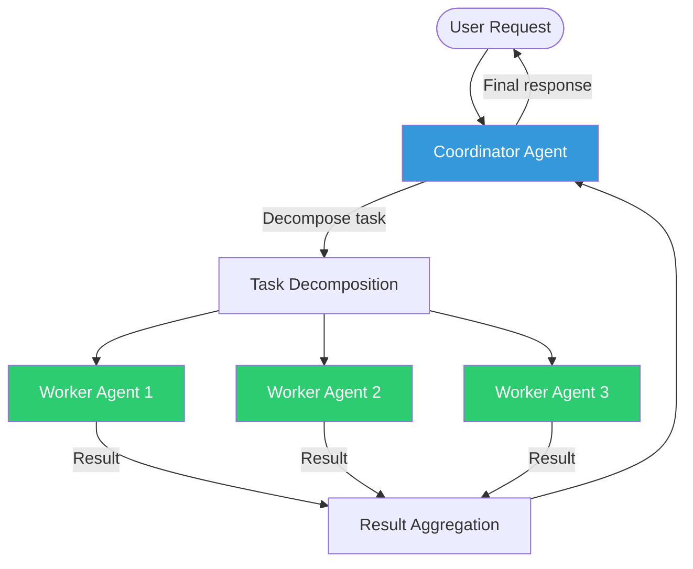
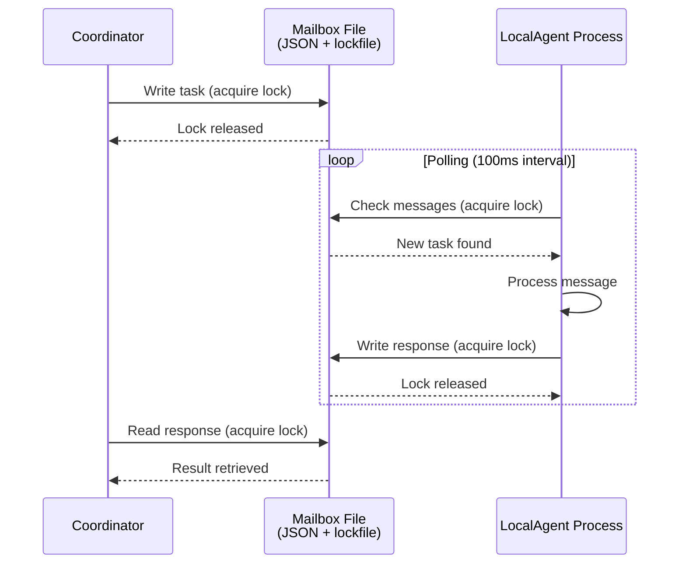
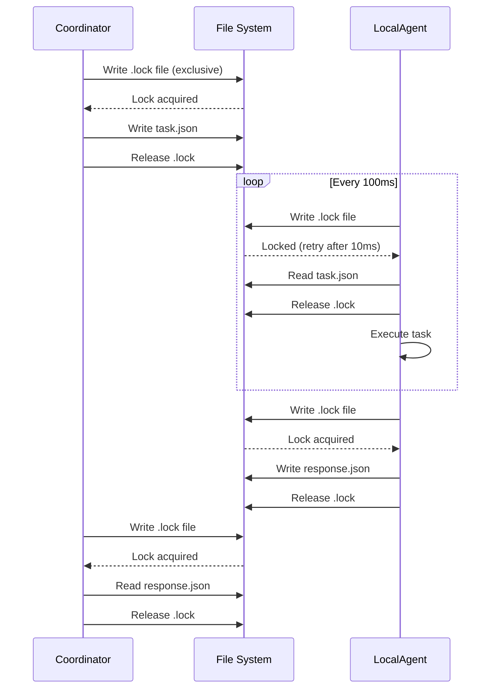
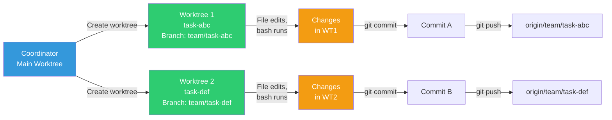
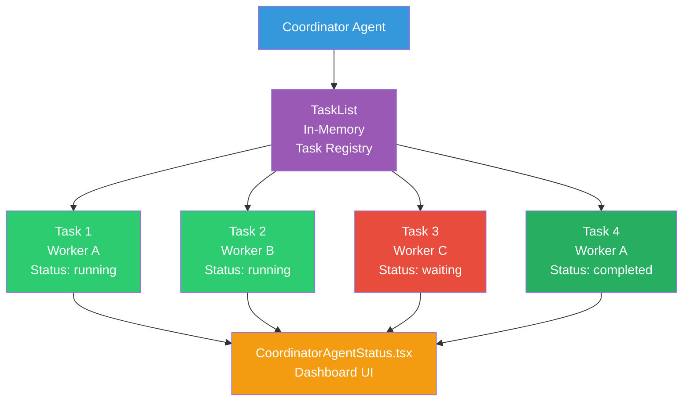
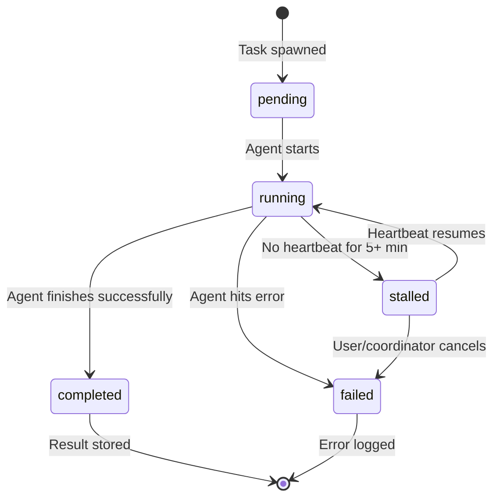
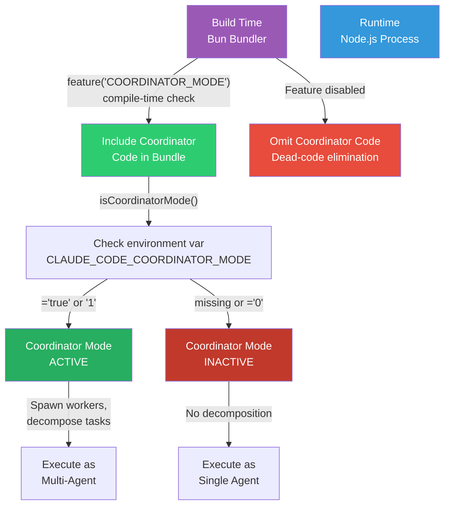

# Coordinator Mode

Coordinator Mode is Claude Code's multi-agent orchestration system. One of the most notable discoveries from the leak is that the orchestration algorithm is **implemented entirely as a prompt, not as code**.

## Architecture



## Four Agent Implementation Types

Claude Code supports four distinct agent implementation types, each with different isolation mechanisms and performance characteristics. The coordinator selects the appropriate type based on task requirements and system constraints.

### InProcessTeammate

The most efficient implementation for lightweight parallel tasks. Uses Node.js `AsyncLocalStorage` for context isolation within a single process.

**Characteristics:**
- **Isolation mechanism**: AsyncLocalStorage provides per-execution-context isolation
- **Communication**: Shared V8 heap (zero serialization overhead)
- **Context isolation**: Each teammate maintains isolated conversation history, tool state, and permissions
- **Concurrency**: Multiple teammates in the same process without thread issues
- **Memory overhead**: Minimal
- **Startup time**: Microseconds

**How it works:**
Each InProcessTeammate runs inside an async execution context. The AsyncLocalStorage mechanism ensures that:
- Tool invocations are routed to the correct agent
- Conversation history doesn't leak between agents
- Permissions are enforced per-agent (not globally)
- Abort signals can be propagated to individual agents

The unified execution engine runs inside the async context, receiving the teammate's specific prompt, allowed tools, and permission configuration. Multiple teammates can execute concurrently in the same Node.js process without their tool calls interfering with each other. Each teammate maintains isolated tool state, conversation history, and permissions.

Progress is tracked via heartbeats and state updates, allowing the coordinator to detect stalled tasks and the UI to display real-time status. When a teammate completes or fails, its result is stored and notified back to the coordinator, which can then decide whether to retry, continue the work, or escalate to a different agent type.

**Best for:**
- Feature implementation + parallel testing
- Multi-file refactoring with independent workers
- Large codebase exploration (partition search space)

### LocalAgent

A more isolated implementation using file-based IPC with message passing. Each agent runs in a separate Node.js process with its own V8 heap.

**Characteristics:**
- **Isolation mechanism**: Separate process (different V8 instance)
- **Communication**: JSON file mailbox with lockfile synchronization
- **Message polling**: Agent periodically checks for new messages
- **Context isolation**: Complete process-level isolation
- **Memory overhead**: One V8 heap per agent (~30-50 MB)
- **Startup time**: Milliseconds

**How it works:**
The coordinator and LocalAgent communicate through a shared mailbox directory:



**Mailbox structure:**
Mailbox files contain task metadata (ID, status), the task itself (prompt, allowed tools, context), execution results (output, modified files, exit code), and timestamping for lifecycle tracking.

**Crash resilience:**
If a LocalAgent crashes, the mailbox file remains intact. The coordinator can:
- Detect timeout (no response update for N seconds)
- Spawn a new agent to retry the task
- Recover partial state from the mailbox

**Best for:**
- Tasks requiring file system isolation
- Long-running operations (can survive main process events)
- When heap size limits are a concern

### RemoteAgent

Distribution across machines using Teleport (Anthropic's internal RPC system). Not typically exposed in public builds but essential for large-scale deployments.

**Characteristics:**
- **Isolation mechanism**: Network boundary (different machine)
- **Communication**: Teleport RPC (serialized messages)
- **Concurrency**: Can run on separate hardware
- **Context isolation**: Complete machine-level isolation
- **Memory overhead**: Scales across multiple machines
- **Startup time**: Seconds (network latency + provisioning)

**Best for:**
- Distributed CI/CD pipelines
- Massive codebase analysis (partition across multiple machines)
- Resource-intensive operations (GPU-accelerated analysis)

### LocalShell

Subprocess communication via stdin/stdout. Simplest isolation model.

**Characteristics:**
- **Isolation mechanism**: Subprocess boundary
- **Communication**: stdin/stdout (JSON line protocol)
- **Execution**: Direct shell command execution
- **Context isolation**: Process-level isolation
- **Memory overhead**: Minimal (~5 MB per subprocess)
- **Startup time**: Milliseconds

**Best for:**
- Simple shell command tasks
- Integration with external tools
- Minimal coordination overhead needed

---

## Agent Type Comparison Matrix

| Aspect | InProcessTeammate | LocalAgent | RemoteAgent | LocalShell |
|--------|-------------------|-----------|-------------|-----------|
| **Isolation Level** | AsyncLocalStorage | Process | Network | Subprocess |
| **Communication** | Shared heap | File mailbox | Teleport RPC | stdin/stdout |
| **Memory per agent** | ~1 MB | ~40 MB | ~100 MB+ | ~5 MB |
| **Startup latency** | μs | ms | s | ms |
| **Concurrency** | High (100+) | Medium (10-20) | Medium (varies) | Low (5-10) |
| **Heap sharing** | Yes | No | No | No |
| **Serialization overhead** | None | JSON only | Full RPC stack | JSON line |
| **Crash resilience** | Low | High | High | Medium |
| **Use case** | Parallel tasks | Independent work | Distributed compute | Shell tasks |

---

## File-Based Mailbox IPC Pattern

The LocalAgent communication uses a proven file-based IPC pattern that trades latency for simplicity and crash resilience.

### Message Flow



### Advantages Over Socket-Based IPC

**Simplicity**: No port management, no network stack complexity.

**Crash resilience**: A crashed process leaves the mailbox file intact. The coordinator can detect the agent failure and spawn a replacement without data loss.

**Observability**: The mailbox file is human-readable JSON. Debugging is as simple as `cat ~/.cache/claude-code/mailbox-*.json`.

**No deadlocks**: Unlike pipes or sockets, file operations don't create circular wait conditions.

### Lockfile Synchronization

The pattern uses a dotfile lockfile for atomic operations:

```bash
# Coordinator wants to write
touch ~/.cache/claude-code/mailbox-agent-1.lock  # Exclusive create
echo '{"task": ...}' > ~/.cache/claude-code/mailbox-agent-1.json
rm ~/.cache/claude-code/mailbox-agent-1.lock

# Agent polls and reads
touch ~/.cache/claude-code/mailbox-agent-1.lock  # Acquires lock
cat ~/.cache/claude-code/mailbox-agent-1.json > /tmp/task.json
rm ~/.cache/claude-code/mailbox-agent-1.lock     # Releases lock
```

If the lock file exists, the process sleeps for 10ms and retries (backoff).

---

## Git Worktree Isolation

Each teammate agent works in a dedicated Git worktree, enabling concurrent file modifications without conflicts. For the worktree strategy diagram and lifecycle details, see [Subagent Types - Worktree Isolation](./subagent-types.md#worktree-isolation).

### Benefits

**Parallel file modifications**: Each agent can modify the same files simultaneously without conflicts.

**Independent commits**: Each agent creates its own commits with its own commit message.

**Atomic merging**: Changes are reviewed independently before merging back to main.

**Rollback capability**: If one agent's work is rejected, simply delete its worktree.

### Coordinator Worktree Management

Worktree management in Claude Code is handled by the ProjectSessionManager, which orchestrates concurrent git worktrees for teammates. When a teammate is spawned, the system creates a dedicated worktree in `.claude/worktrees/` (or `.claude-worktrees/`) with a branch named after the task (e.g., `team/task-uuid-123`). This allows the teammate to make commits and push changes without interfering with the main worktree.

The lifecycle is automatic: when a teammate starts work, its worktree is created. As the teammate runs commands (file edits, bash operations), all changes are isolated to that worktree. When the teammate completes (successfully or with failure), the worktree can be cleaned up, or if the work is valuable, pushed to the remote for review as a pull request.

Each worktree has its own `.git` configuration, allowing teammates to commit with their own user context and messages. Git's worktree feature ensures that concurrent modifications don't race; each teammate sees a consistent file state within its own worktree branch.

### Coordinator Worktree Lifecycle



---

## Prompt-Based Orchestration

The coordinator doesn't use a coded algorithm for task distribution. Instead, the **orchestration logic is expressed as a system prompt** that instructs the coordinator agent how to:

1. Decompose complex tasks into subtasks
2. Assign subtasks to worker agents
3. Monitor worker progress
4. Validate worker outputs
5. Aggregate results

### Coordinator Prompt Structure

The coordinator prompt guides agent behavior through several key principles:

1. **Task Decomposition**: Break requests into independent, parallelizable subtasks while identifying critical dependencies and appropriate specialist agent assignments with time estimates.

2. **Worker Assignment**: Choose the right agent type based on task characteristics—parallel teammates for independent file work, process-isolated agents for long-running analysis, subprocess agents for shell tasks, and distributed agents for cross-machine work.

3. **Quality Control**: Critically evaluate each worker's output rather than rubber-stamping it. Verify completeness, check architectural consistency, validate against original requirements, and request revisions for substandard work.

4. **Progress Monitoring**: Track all active workers through a task registry, monitoring completion time, detecting stalled tasks (no progress beyond 5 minutes), signaling failures to the UI, and aggregating partial results as tasks complete.

5. **Result Aggregation**: After all workers complete, merge all changes while handling conflicts, validate the integrated solution, run final verification tests, and either report success or request re-work if issues remain.

### Quality Control Directives

The coordinator is explicitly instructed to avoid rubber-stamping weak work. This means:
- Critically evaluate each worker's output against the assigned task
- Reject substandard work and request revisions instead of accepting incomplete solutions
- Ensure consistency across all worker outputs
- Validate that the assembled result meets the original user requirement
- Track failed attempts and escalate if work repeatedly fails to meet standards

---

## Task Panel Management

The coordinator uses a `TaskList` (internal data structure) to monitor all active workers in real time.

### TaskPanel Architecture



### Task Lifecycle

When the coordinator spawns a worker, the task enters the registry with metadata: task ID, agent ID, status, and timestamps. The task transitions through phases: **pending** (queued but not started), **running** (actively executing), **completed** (finished successfully), or **failed** (stopped with an error).

Each task includes a heartbeat mechanism. The agent reports progress at intervals. If a task is running but no heartbeat arrives for a configured timeout (typically 5 minutes), the coordinator marks it as stalled and can either wait longer or signal intervention to the UI.

The status display component subscribes to task changes and displays all active tasks in real time, showing status badges, progress indicators, error messages, and stalled task warnings. This allows the user to monitor parallel workers without polling, and gives the coordinator visibility into which tasks are making progress and which are blocked.



The task result (final message, file list, exit code) is stored in AppState alongside the task record, making it accessible to the coordinator for synthesis and the UI for display.

### UI Component

The `CoordinatorAgentStatus.tsx` React component displays:
- Task count and status breakdown
- Per-task progress indicators
- Stalled task warnings
- Result preview
- Failure notifications

---

## Worker Agents

Workers are spawned as subagents using the Agent tool with `subagent_type: "general-purpose"`. Each worker:

- Receives a complete task description (no shared context)
- Operates independently with its own context window
- Can use all available tools (Bash, Read, Edit, and MCP tools)
- Returns results to the coordinator via `<task-notification>` XML

### Available Agent Types for Coordinator Workers

The coordinator can spawn workers with these agent types:

| Type | Use Case |
|------|----------|
| **general-purpose** | Complex multi-step tasks with full tool access: implementation, research, verification, refactoring |
| **Explore** | Fast read-only codebase exploration with parallel support |
| **Plan** | Architectural planning and design strategies |

Most coordinator work uses `subagent_type: "general-purpose"` for flexibility. Specialized types (Explore, Plan) are used when you want type-specific constraints or optimized behavior.

### Parallel Execution

Workers operate in parallel when their tasks are independent:

```mermaid
gantt
    title Coordinator Task Execution
    dateFormat X
    axisFormat %s

    section Coordinator
    Decompose task      :0, 1
    Aggregate results   :4, 5

    section Worker 1
    Implement feature A :1, 3

    section Worker 2
    Implement feature B :1, 4

    section Worker 3
    Write tests         :1, 3
```



---

## When Coordinator Mode Is Used

Coordinator Mode is gated behind the `COORDINATOR_MODE` compile-time flag and is not available in public builds. When enabled, it activates for tasks that benefit from parallel execution:

| Suitable Tasks | Why |
|---------------|-----|
| Multi-file refactoring | Each file can be handled by a different worker |
| Feature + tests | Feature implementation and test writing can parallelize |
| Multi-component changes | Frontend + backend + database changes |
| Large codebase exploration | Different workers explore different areas |

---

## Feature Gate Details

### Compile-Time Flag and Environment Control

Coordinator mode is controlled by two mechanisms working together: a compile-time feature flag (`COORDINATOR_MODE`) and an environment variable (`CLAUDE_CODE_COORDINATOR_MODE`). The feature flag determines whether coordinator code is bundled at all; the environment variable controls runtime activation when the feature is enabled.

This two-layer design prevents bundling coordinator code in public builds (via the feature flag) while allowing internal builds to enable/disable it at runtime (via the environment variable). When coordinator mode is disabled, the code paths that would instantiate coordinator components simply are not executed.

Session resumption logic ensures that resumed sessions respect their stored mode (coordinator vs. normal), automatically setting the environment variable as needed for consistency.

### Coordinator Mode Feature Gate



### Activation

Coordinator mode activation happens at the query engine level. When a new agent request arrives, the system checks whether the compile-time feature flag and runtime environment variable both enable coordinator mode.

If both checks pass, the query engine may spawn a coordinator instead of a standalone agent. The coordinator receives the full user prompt and breaks it into subtasks, launching workers for independent work. Otherwise, a single agent executes the task end-to-end.

This design ensures coordinator mode is controlled strictly by flags rather than inferred from prompt keywords. When enabled, the coordinator can still choose to execute sequentially if the task is inherently sequential. The prompt-based orchestration philosophy gives the coordinator this flexibility to decide the best execution strategy for each request.

---

## Relationship to Current Agent System

Even without Coordinator Mode, the current Agent system supports a simpler form of multi-agent operation:

| Feature | Current Agent | Coordinator Mode |
|---------|--------------|-----------------|
| Subagent spawning | Yes | Yes |
| Parallel execution | Yes | Yes |
| Orchestration | Manual (model decides) | Prompt-based coordinator |
| Quality control | None | "Do not rubber-stamp" |
| Task decomposition | Ad hoc | Structured |
| Result aggregation | Manual | Coordinator handles |
| Worktree isolation | Manual | Automatic per-agent |
| Progress monitoring | None | TaskPanel dashboard |
