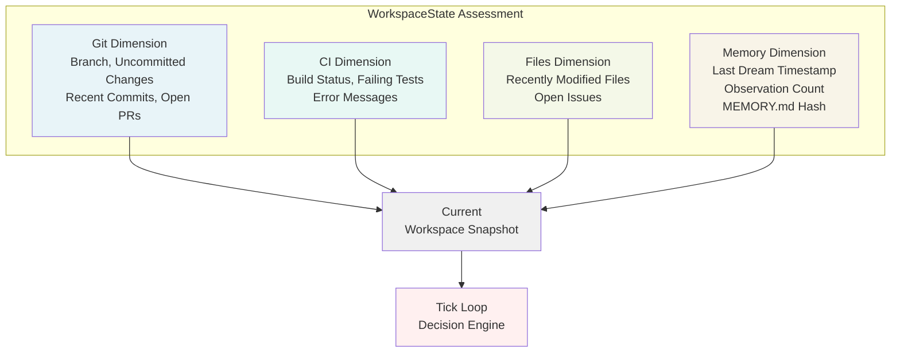
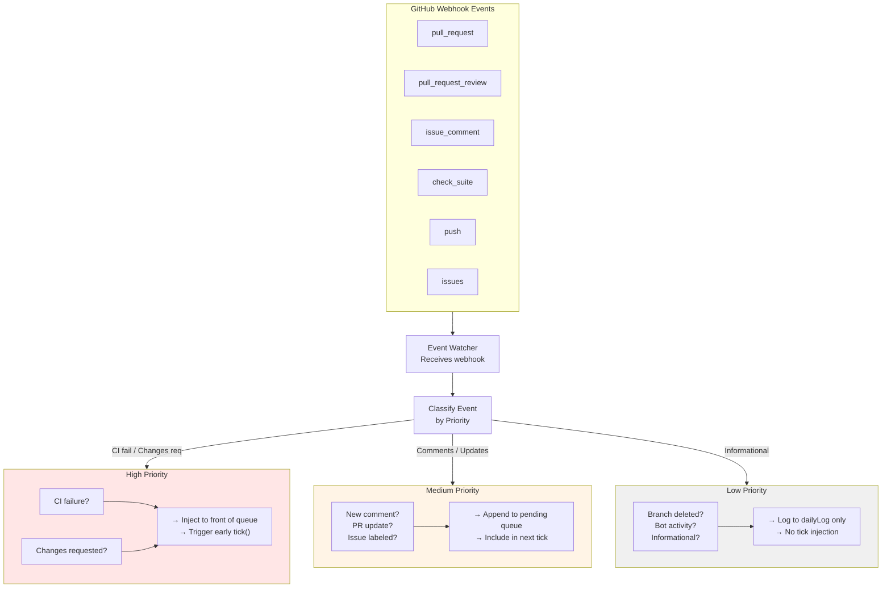
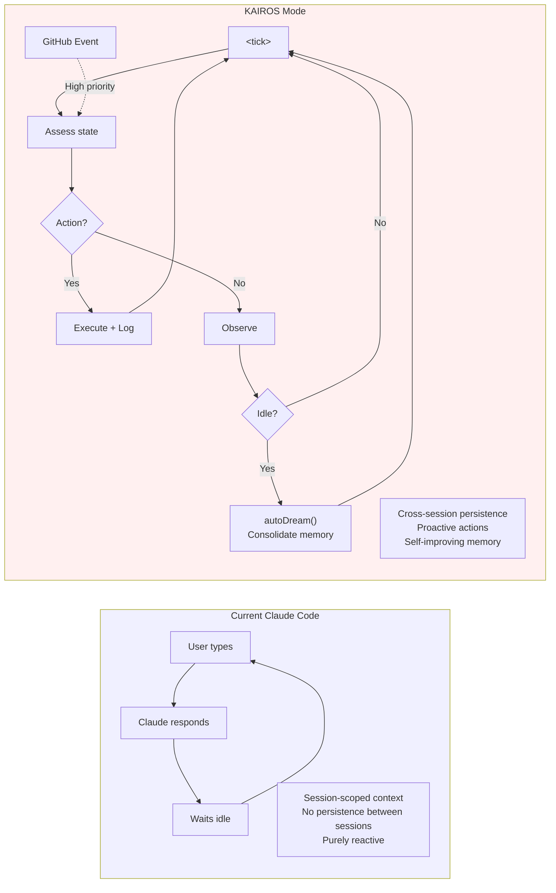

# KAIROS: Autonomous Daemon Mode

KAIROS is one of the most significant discoveries in the leaked source code. With **150+ references** across the codebase, it represents a fully implemented but unreleased autonomous daemon mode. This is a paradigm shift from Claude Code's current reactive interaction model to a continuously operating background agent.

## Technical Summary

| Property | Value |
|----------|-------|
| Architecture | Autonomous daemon with tick loop, autoDream consolidation, and event watching |
| Implementation status | Fully implemented, not a prototype |
| Feature flag | `KAIROS` (compile-time): dead-code-eliminated in public builds |
| Key modules | kairosManager, tickLoop, autoDream, eventWatcher, dailyLog |

## Architecture

```mermaid
graph TB
    subgraph KairosManager["kairosManager.ts"]
        Init["initialize()"] --> Config["Load KAIROS config<br/>tick interval, dream threshold"]
        Config --> Start["startDaemon()"]
        Start --> TL["tickLoop"]
        Start --> EW["eventWatcher"]
        Start --> DL["dailyLog"]
    end

    subgraph TickLoop["tickLoop.ts"]
        Timer["setInterval(<br/>  onTick,<br/>  TICK_INTERVAL_MS<br/>)"]
        Timer --> Tick["onTick()"]
        Tick --> Assess["assessWorkspaceState()"]
        Assess --> Decision{"actionNeeded?"}
        Decision -->|"Yes"| Plan["planAction()"]
        Decision -->|"No"| Idle["recordIdleObservation()"]
        Plan --> Execute["executeAction(<br/>  action,<br/>  toolDispatcher<br/>)"]
        Execute --> Log["dailyLog.append(<br/>  action, result<br/>)"]
        Idle --> DreamCheck{"idle time ><br/>DREAM_THRESHOLD?"}
        DreamCheck -->|"Yes"| TriggerDream["autoDream.run()"]
        DreamCheck -->|"No"| Wait["Wait for next tick"]
    end

    subgraph AutoDream["autoDream.ts"]
        DreamStart["run()"] --> Load["Load recent observations<br/>from dailyLog"]
        Load --> Merge["mergeRelatedObservations(<br/>  observations<br/>)"]
        Merge --> Dedup["removeContradictions(<br/>  mergedObservations<br/>)"]
        Dedup --> Crystal["crystallizeInsights(<br/>  dedupedObservations<br/>)"]
        Crystal --> Update["updateMemoryMd(<br/>  newFacts<br/>)"]
        Update --> DreamEnd["Log dream results"]
    end

    subgraph EventWatcher["eventWatcher.ts"]
        Subscribe["subscribeToWebhooks(<br/>  repoConfig<br/>)"]
        Subscribe --> Listen["listenForEvents()"]
        Listen --> EventRecv["onEvent(event)"]
        EventRecv --> Classify["classifyEvent(<br/>  event<br/>)"]
        Classify -->|"Actionable"| InjectTick["Inject into next tick<br/>as high-priority context"]
        Classify -->|"Informational"| LogEvent["Log to dailyLog"]
        Classify -->|"Ignorable"| Skip["Skip"]
    end

    style KairosManager fill:#ff6b6b,color:#fff
    style AutoDream fill:#9b59b6,color:#fff
    style TickLoop fill:#e67e22,color:#fff
    style EventWatcher fill:#3498db,color:#fff
```



## Tick Loop: Implementation Detail

### The `<tick>` Prompt

The tick loop operates on a configurable interval (typically 30-60 seconds) and sends a structured prompt to the Claude model on each cycle. Each tick is numbered sequentially and timestamped, allowing the model to understand temporal progression across multiple invocations. The prompt wraps the current assessment in an XML tag (`<tick>`) that contextualizes the request as a periodic evaluation rather than a user-initiated command.

The tick prompt construction follows a consistent pattern: it gathers the current workspace state (git status, CI results, file changes, memory statistics), drains any pending high-priority events from the event watcher that occurred since the last tick, and includes recent entries from the daily log to provide continuity. The model then evaluates three decision points:

1. Whether any action is currently needed based on the workspace state and pending events
2. If action is needed, what specific action to take (with enough context to execute it safely)
3. If no action is needed, what observations should be recorded for future reference (seeding the dream consolidation process)

This prompt structure enables the autonomous daemon to maintain state across ticks while remaining grounded in observable workspace reality.

```mermaid
sequenceDiagram
    participant Timer as setInterval()
    participant TickLoop as tickLoop.onTick()
    participant State as assessWorkspaceState()
    participant Events as eventWatcher
    participant Log as dailyLog
    participant Model as Claude Model
    participant Response as processTickResponse()

    Timer->>TickLoop: Trigger onTick (30-60s interval)
    TickLoop->>State: Gather git, CI, file, memory state
    State-->>TickLoop: Current workspace snapshot
    TickLoop->>Events: drainPendingEvents()
    Events-->>TickLoop: High-priority events since last tick
    TickLoop->>Log: getRecentEntries(10)
    Log-->>TickLoop: Last 10 action records
    TickLoop->>TickLoop: Build tick prompt with all data
    TickLoop->>Model: Send &lt;tick number="N"&gt; with prompt
    Model->>Model: Evaluate: action needed?
    alt Action Needed
        Model-->>TickLoop: { action, targetFile, context }
    else Observational
        Model-->>TickLoop: { observation, category }
    else No Action
        Model-->>TickLoop: { idle: true, reason }
    end
    TickLoop->>Response: Process model response
    Response->>Log: Append decision + result
```

### Workspace State Assessment

The `assessWorkspaceState()` function performs a systematic snapshot of the development environment across four dimensions. The **git dimension** captures the current branch, uncommitted changes (staged and unstaged), recent commit history (titles and authors), and open pull requests (status, review state). This provides the daemon with visibility into the repository's current trajectory and any pending code changes awaiting merge.

The **CI dimension** tracks the last continuous integration run status (success, failure, or pending), lists any failing tests, and their error messages. This allows KAIROS to detect build breaks and failed test suites as autonomous action triggers. The daemon can read CI logs, identify the root cause, and attempt fixes without waiting for user intervention.

The **files dimension** identifies recently modified files (within a configurable window, typically 5-30 minutes), which helps correlate workspace changes with specific development sessions. It also includes open issues assigned to the workspace or project, providing context for issue-driven development workflows.

The **memory dimension** tracks timing and metadata about previous memory consolidations. It stores the timestamp of the last autoDream run, a count of accumulated observations since that run, and a hash of the MEMORY.md file. This hash is crucial for detecting external modifications (e.g., user edits to MEMORY.md in another session or tool), which would trigger a re-consolidation to prevent conflicts.

Together, these four dimensions give KAIROS a complete picture of "where the work stands" on each tick, enabling informed decision-making about whether autonomous action is appropriate.



## autoDream: Memory Consolidation

### Configuration

AutoDream uses two key thresholds controlled by the `tengu_onyx_plover` GrowthBook flag:

| Setting | Default | Purpose |
|---------|---------|---------|
| **minHours** | 24 | Hours since last consolidation before dream becomes eligible |
| **minSessions** | 5 | Minimum number of sessions touched since last consolidation |

AutoDream only triggers when **both** conditions are met:
1. At least `minHours` have passed since the last successful dream
2. At least `minSessions` sessions have been modified since the last dream

This prevents excessive consolidation while ensuring fresh learning from recent activity.

### The Dream Process

`autoDream` runs when both time and session gates pass, and the daemon has been idle. The dream process is the core learning mechanism of KAIROS. It consolidates loosely-recorded observations into structured, reusable knowledge.

The dream pipeline follows five sequential stages:

**Stage 1: Load Raw Observations.** The process begins by querying the daily log for all observations recorded since the last successful dream run. These are unfiltered, often repetitive, sometimes contradictory raw data. Notes like "API call timed out," "deployment succeeded," "function X behavior unclear."

**Stage 2: Merge Related Observations.** The Claude model is prompted to identify observations that belong to the same logical unit and combine them into coherent summaries. For example, three separate log entries. "API endpoint /users timed out (2pm)," "API endpoint /users timed out (3pm)," "Retry logic helped (3:15pm)" are merged into a single observation. "API /users endpoint experiences intermittent timeouts; retry logic mitigates the issue."

**Stage 3: Remove Contradictions.** The model identifies conflicting facts and resolves them by checking the actual codebase. If one observation claims "function X takes 2 arguments" and another says "function X takes 3 arguments," the dream process reads the function signature from source code to determine ground truth.

**Stage 4: Crystallize Insights.** Vague observations are transformed into precise, actionable facts. Instead of storing "this seems to work," the output becomes "Function X requires parameter Y of type Z; it can be called with `foo(a, { required: b })`; see api/users.ts:42." These crystallized facts are specific enough to be used in future tick decisions without requiring the model to re-derive them.

**Stage 5: Update MEMORY.md.** New facts are appended to the persistent memory file with file references and context, making them searchable and version-controlled across sessions.

```mermaid
graph TD
    Start["Dream Triggered<br/>Idle > DREAM_THRESHOLD"]
    
    Load["Stage 1: Load Observations<br/>Query daily log since last dream"]
    LoadOut["Raw observations<br/>Often repetitive & contradictory"]
    
    Merge["Stage 2: Merge Related<br/>Claude identifies logical units<br/>Combines 3-5 scattered entries → 1 summary"]
    MergeOut["Merged observations<br/>Coherent summaries<br/>Reduced count ~60%"]
    
    Dedup["Stage 3: Remove Contradictions<br/>Identify conflicts<br/>Check codebase for ground truth"]
    DedupOut["Deduplicated observations<br/>Only verified facts remain<br/>Reduced count ~30%"]
    
    Crystal["Stage 4: Crystallize Insights<br/>Transform vague → precise<br/>Add file refs & context<br/>Make reusable for future ticks"]
    CrystalOut["Crystallized facts<br/>Precise, actionable<br/>Ready for MEMORY.md"]
    
    Update["Stage 5: Update MEMORY.md<br/>Append facts with references<br/>Lock for concurrent access"]
    UpdateOut["MEMORY.md updated<br/>Searchable across sessions"]
    
    Complete["Dream Complete<br/>Record dream in daily log<br/>Update lastDreamTimestamp"]
    
    Start --> Load
    Load --> LoadOut
    LoadOut --> Merge
    Merge --> MergeOut
    MergeOut --> Dedup
    Dedup --> DedupOut
    DedupOut --> Crystal
    Crystal --> CrystalOut
    CrystalOut --> Update
    Update --> UpdateOut
    UpdateOut --> Complete
    
    style Start fill:#c7e9c0
    style Load fill:#e8f4f8
    style Merge fill:#e8f8f4
    style Dedup fill:#f4f8e8
    style Crystal fill:#f8f4e8
    style Update fill:#f8e8f4
    style Complete fill:#c7e9c0
```



### Observation → Fact Transformation

The crystallization step is the most intellectually interesting part. The model is prompted to transform fuzzy observations into precise, actionable facts:

| Stage | Example |
|-------|---------|
| **Raw observation** | "Had to retry the API call because it timed out" |
| **Merged** | "API calls to /api/users sometimes timeout. Seen 3 times today." |
| **Contradiction removed** | (no contradiction in this case) |
| **Crystallized fact** | "API endpoint /api/users has timeout issues. Retry with exponential backoff. See api/users.ts:45" |
| **MEMORY.md entry** | `- API: /api/users endpoint needs retry logic, see api/users.ts:45` |

## Event Watcher: GitHub Integration

### Webhook Subscription and Event Classification

The event watcher module maintains a subscription to six GitHub repository event types, forming a bridge between external development activity and the autonomous daemon. The subscribed events are:

- **pull_request**: PR lifecycle events (opened, updated, reopened, closed, merged)
- **pull_request_review**: Review submissions and state changes (approved, changes_requested, commented)
- **issue_comment**: Comments on issues and pull requests
- **check_suite**: CI status changes (started, completed with success/failure)
- **push**: New commits pushed to the repository
- **issues**: Issue lifecycle events (opened, closed, reopened, labeled)

Each incoming webhook event is immediately classified into one of three priority levels, determining how it enters the daemon's decision pipeline:

**High-priority events** interrupt the normal tick schedule. These include CI failures (indicating a breaking change that needs immediate investigation), review comments requesting changes (blocking PR merges), or security-related notifications. When a high-priority event arrives, it is injected at the front of the pending events queue, and the event watcher triggers an early tick. This forces the daemon to evaluate this urgent context before waiting for the next scheduled interval.

**Medium-priority events** are queued but do not interrupt the tick schedule. Examples include routine PR comments, commit notifications, and issue updates. These are included in the next regularly scheduled tick, where they inform the model's decision-making within the normal workspace assessment.

**Low-priority events** are not queued for tick injection. Instead, they are logged directly to the daily log as informational records. Branch deletions, PR auto-merge attempts, bot activity provide an audit trail without triggering autonomous action.



## Daily Log: Append-Only Journal

The daily log maintains a structured, append-only record:

```typescript
interface DailyLogEntry {
  timestamp: number;
  tickNumber: number;
  type: 'action' | 'observation' | 'event' | 'dream' | 'error';
  action: string;          // What was done
  result: string;          // What happened
  context: {
    workspaceState?: WorkspaceState;
    triggeredBy?: string;  // 'tick' | 'event' | 'dream'
    relatedFiles?: string[];
  };
}
```

The log serves multiple purposes:
1. **Audit trail**: Complete record of autonomous actions for user review
2. **Dream input**: Raw material for `autoDream` consolidation
3. **Context for ticks**: Recent log entries inform decision-making
4. **Debug tool**: Helps diagnose why KAIROS took a particular action

## Paradigm Comparison



| Dimension | Current Mode | KAIROS Mode |
|-----------|-------------|-------------|
| **Activation** | User-initiated only | Self-initiated via tick loop |
| **Lifecycle** | Single session | Persistent background daemon |
| **Memory** | Per-session, lost on close | Persistent + autoDream consolidation |
| **External events** | None | GitHub webhooks, CI status |
| **Logging** | Conversation history | Structured append-only daily journal |
| **Learning** | None between sessions | autoDream improves over time |
| **Error recovery** | Requires user intervention | Can autonomously retry, escalate |
| **Concurrency** | One session at a time | Daemon + interactive sessions can coexist |

## Autonomous Action Examples

Based on the event classification and tick loop logic, KAIROS can:

| Trigger | Autonomous Action |
|---------|-------------------|
| CI failure (webhook) | Read CI logs, identify failing test, attempt fix, push |
| Review comment "please rename X to Y" | Make the rename, push, reply to comment |
| Idle for 10+ minutes | Run autoDream, consolidate observations, update MEMORY.md |
| New issue assigned | Read issue, create branch, start initial investigation |
| Dependency security alert | Read advisory, evaluate impact, propose fix PR |
| Stale PR detected | Check if rebasing would resolve conflicts, attempt it |

## Deployment Status

KAIROS is gated behind a **compile-time flag**, meaning the code is completely absent from public builds via dead code elimination. The flag hierarchy:

```
KAIROS (compile-time)
  ├── Dead-code-eliminated in public builds
  ├── Present in internal Anthropic builds
  └── Requires additional runtime configuration:
      ├── KAIROS_ENABLED=true (environment variable)
      ├── Repository webhook access (GitHub token with webhook scope)
      └── Persistent storage for daily log and MEMORY.md
```

The fact that KAIROS is **fully implemented** (not a prototype sketch) with comprehensive error handling, logging, and configuration suggests it is in internal testing or close to public release.
