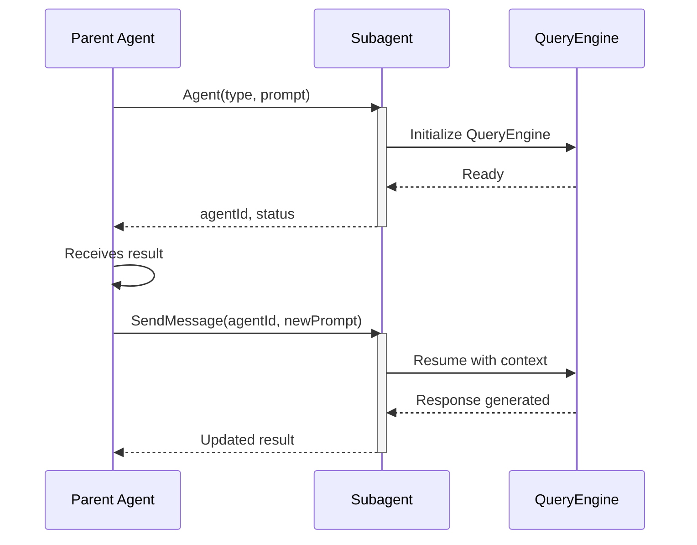
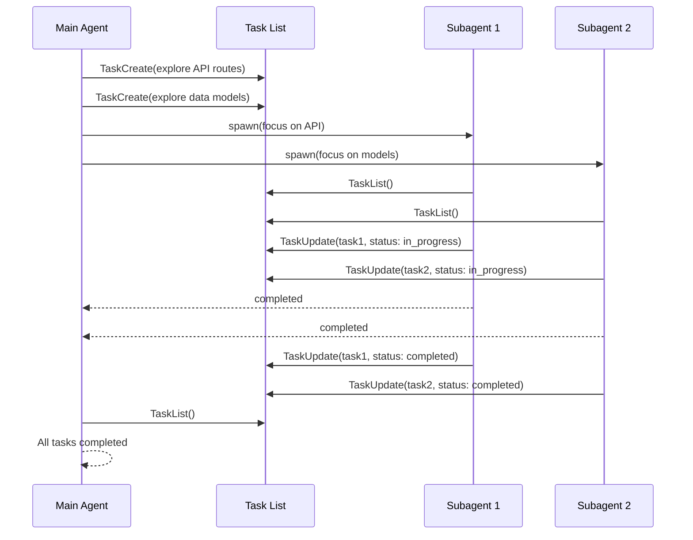
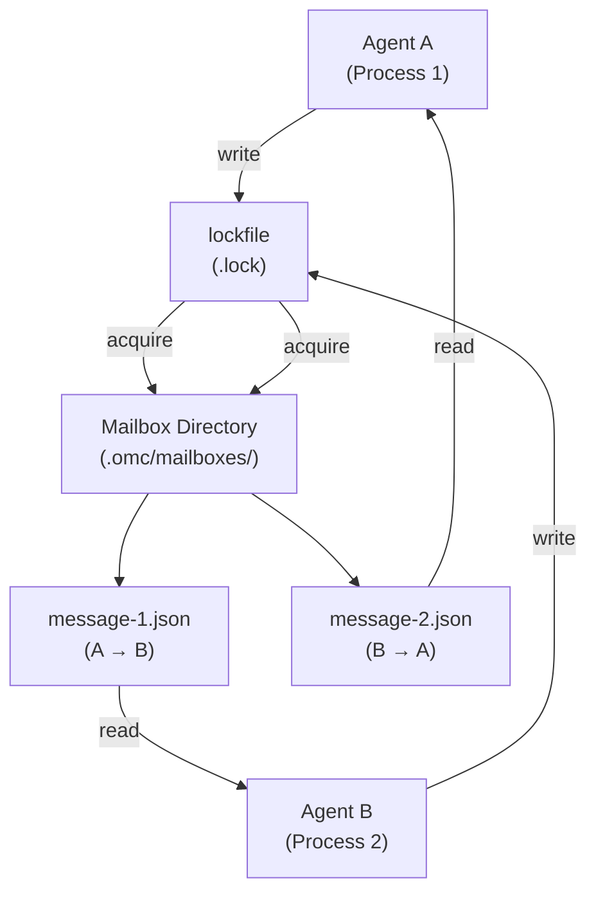
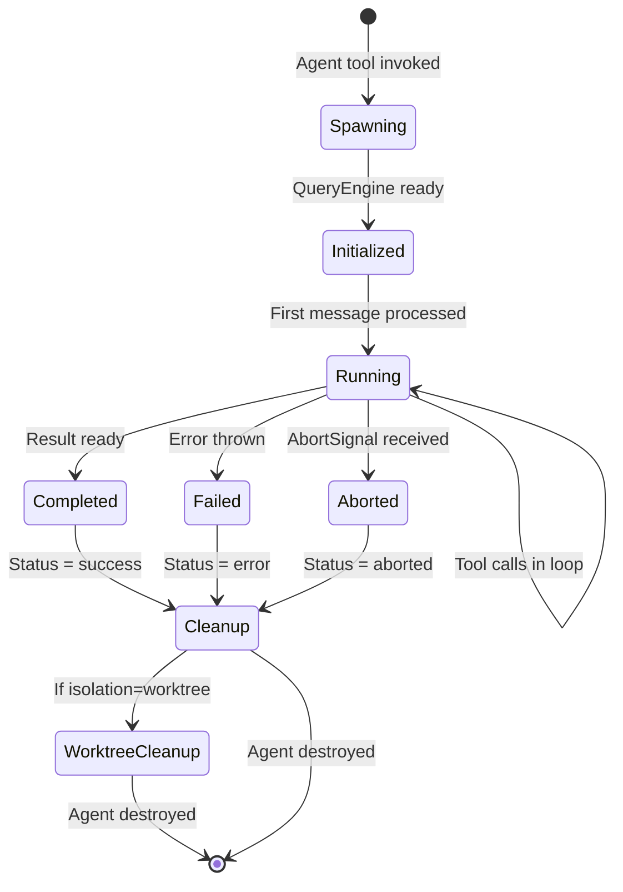
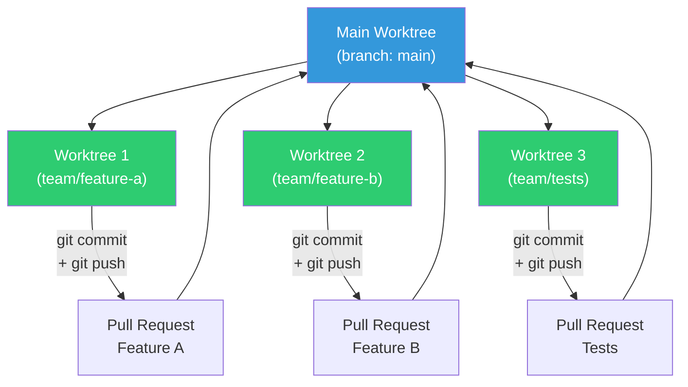
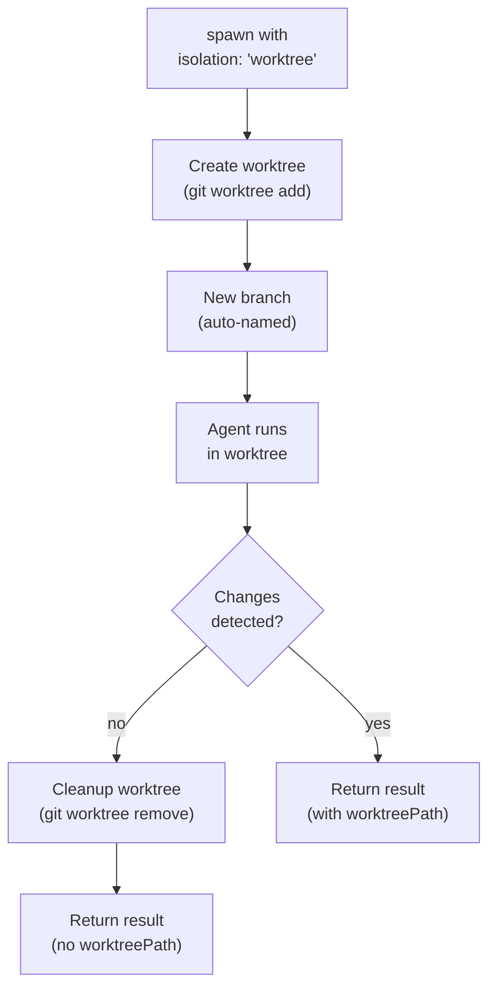
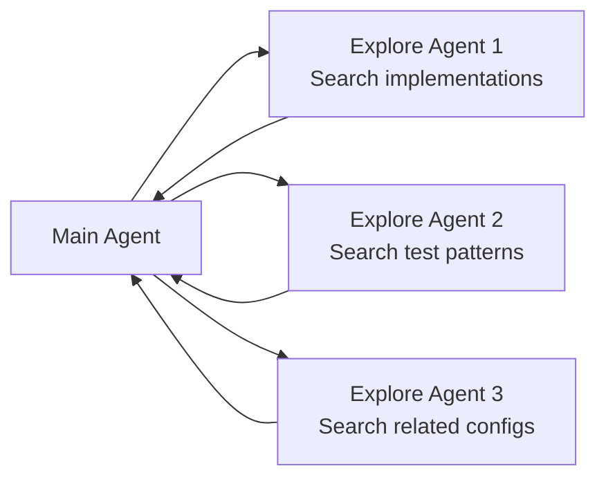

# Subagent Types

Claude Code defines 5+ specialized subagent types, each with a specific purpose and restricted tool access.

## Subagent Architecture

Subagents are independent agent instances spawned at runtime with isolated execution contexts. Each subagent operates as a distinct `QueryEngine` with its own system prompt, tool restrictions, and resource allocation.

### Initialization Flow

When a parent agent spawns a subagent, the system performs these initialization steps:

1. **Config Loading**: Loads the subagent type configuration to determine constraints and capabilities
2. **Tool Filtering**: Restricts the tool registry to only those allowed for this subagent type (done at init time, not runtime)
3. **Prompt Construction**: Builds the subagent's system prompt, including type-specific instructions, agent-specific constraints, parent tracking information, and execution boundaries
4. **QueryEngine Creation**: Initializes an independent QueryEngine instance for the child agent
5. **Context Setup**: Establishes isolated context for conversation history, tool state, working directory, and parent-child relationship tracking

### Key Architectural Concepts

**QueryEngine Isolation**: Each subagent receives its own QueryEngine instance, ensuring isolated conversation history, independent tool state management, separate working directory context, and no cross-agent data leakage.

**Type-Specific System Prompts**: The subagent prompt is constructed to include type-specific instructions, agent-specific constraints and capabilities, parent agent tracking information, and execution boundaries (read-only, implementation-only, etc.).

**Tool Registration at Initialization**: Tools are filtered when the subagent is created, not during runtime. This prevents bypass of tool restrictions and ensures the child only receives the allowed tool registry.

**Parent-Child Hierarchy**: Tracked via a parent agent identifier, enabling hierarchical abort signal propagation, allowing the parent to monitor child progress, and supporting nested subagent spawning (agent → subagent → sub-subagent).

---

## Tool Restrictions by Type

Each subagent type uses an **allowlist model**: tools are explicitly permitted or explicitly blocked per type. Tools not in the allowlist are unavailable to that subagent.

| Type | Disallowed Tools | Available Tools | Purpose | 
|------|-----------------|-----------------|---------|
| **general-purpose** | None | All tools | Complex multi-step tasks requiring full capabilities |
| **Explore** | Agent, Edit, Write, NotebookEdit, ExitPlanMode | All read-only tools (Glob, Grep, Read, WebFetch, etc.) | Fast codebase exploration, read-only analysis |
| **Plan** | Agent, Edit, Write, NotebookEdit, ExitPlanMode | All read-only tools (Glob, Grep, Read, WebFetch, etc.) | Implementation planning, design strategy |
| **claude-code-guide** | Edit, Write, Bash, Agent, NotebookEdit, ExitPlanMode | Glob, Grep, Read, WebFetch, WebSearch | Claude Code usage questions, configuration guidance |
| **statusline-setup** | All except Read, Edit | Read, Edit | Status line configuration and setup |
| **verification** | Agent, Edit, Write, NotebookEdit, ExitPlanMode | All read-only tools (Glob, Grep, Read, WebFetch, etc.) | Implementation verification, testing, and validation |

### Disallowed Tool Explanations

**Agent Tool**: Prevents subagents from spawning their own subagents (except general-purpose). This avoids runaway spawn hierarchies and simplifies context management.

**File Modification Tools (Edit, Write, NotebookEdit)**: Prevents read-only agents (Explore, Plan, verification) from modifying code. These types are designed for analysis, planning, and verification, not implementation.

**Plan Mode Controls**: Only relevant to Plan agents; prevents unintended mode exits.

---

## AsyncLocalStorage Isolation Pattern

Node.js `AsyncLocalStorage` provides per-agent context isolation, ensuring:
- Each agent has isolated conversation history
- Tool state is never shared between parallel agents
- Permissions are enforced per-agent
- No cross-contamination between agents running in parallel

### Agent Context Structure

Node.js `AsyncLocalStorage` provides a namespace for storing data that flows through async execution chains without explicit parameter passing. Each agent gets its own AsyncLocalStorage instance to hold context like identity, permissions, and abort signals.

**How it works:**

1. **Context Creation** - When an agent spawns, a new context object is created containing:
   - `agentId`: Unique identifier for the agent
   - `agentType`: Either `'subagent'` (spawned via Agent tool) or `'teammate'` (swarm teammate)
   - For subagents: subagent name (e.g., "Explore", "Plan"), parent session ID, permissions
   - For teammates: agent name, team name, visual identifier, mode requirements
   - `abortController`: For hierarchical cancellation

2. **Context Binding** - The agent's entire execution runs within an async context that automatically propagates to all nested operations (tool calls, timers, async functions).

3. **Context Retrieval** - Tool calls, nested functions, and timers can access the context implicitly without manual parameter passing.

4. **Isolation Guarantee** - When multiple agents run concurrently (backgrounded agents, parallel explores), each maintains its own isolated context namespace. Agent A's events never see Agent B's context.

### AsyncLocalStorage Isolation Flow

```mermaid
flowchart TB
    Main["Main REPL<br/>Session"]
    
    subgraph AsyncLocalStorage["AsyncLocalStorage Instance"]
        Store["asyncContextStorage<br/>(single global)"]
    end
    
    Main -->|spawn Agent A| A["Agent A<br/>asyncStore.run(ctxA, fn)"]
    Main -->|spawn Agent B| B["Agent B<br/>asyncStore.run(ctxB, fn)"]
    
    A -->|getStore()| CtxA["Returns ctxA<br/>agentId: A<br/>permissions: ..."]
    B -->|getStore()| CtxB["Returns ctxB<br/>agentId: B<br/>permissions: ..."]
    
    CtxA --> ToolA["Tool Call A<br/>receives ctxA"]
    CtxB --> ToolB["Tool Call B<br/>receives ctxB"]
    
    ToolA -->|inherits context| NestedA["Nested Function A<br/>sees only ctxA"]
    ToolB -->|inherits context| NestedB["Nested Function B<br/>sees only ctxB"]
    
    style Store fill:#4a90e2,color:#fff
    style A fill:#7cb342,color:#fff
    style B fill:#e67e22,color:#fff
    style CtxA fill:#66bb6a,color:#fff
    style CtxB fill:#f4a460,color:#fff
    style ToolA fill:#81c784,color:#000
    style ToolB fill:#ffb74d,color:#000
    style NestedA fill:#a5d6a7,color:#000
    style NestedB fill:#ffe0b2,color:#000
```

### Isolation Benefits

- **No Global State**: Each agent runs in its own `AsyncLocalStorage` namespace
- **Parallel Safety**: Multiple agents can run simultaneously without mutex locks
- **Context Preservation**: Agent context is automatically available to all async operations (tool calls, nested async functions)
- **Automatic Cleanup**: When an agent completes, its context is garbage-collected

---

## AbortController Hierarchy

Subagents support hierarchical cancellation via `AbortController` chains. When a parent agent is terminated, all child agents receive the abort signal and clean up gracefully.

### Signal Propagation Flow

```mermaid
flowchart TB
    Root["Root AbortController<br/>(main agent)"]
    A1["Agent 1<br/>AbortController"]
    A2["Agent 2<br/>AbortController"]
    A1a["Subagent 1a<br/>AbortController"]
    A1b["Subagent 1b<br/>AbortController"]

    Root --> A1
    Root --> A2
    A1 --> A1a
    A1 --> A1b

    Root -.->|abort()| A1
    Root -.->|abort()| A2
    A1 -.->|abort()| A1a
    A1 -.->|abort()| A1b

    style Root fill:#e74c3c,color:#fff
    style A1 fill:#e67e22,color:#fff
    style A2 fill:#e67e22,color:#fff
    style A1a fill:#f39c12,color:#000
    style A1b fill:#f39c12,color:#000
```

### Abort Signal Hierarchy

When a parent agent spawns children, it passes its abort signal down the hierarchy. If the parent is cancelled, the signal propagates to all children automatically, triggering graceful cleanup.

### Cleanup Guarantees

When an abort signal is received:
1. All pending tool calls are cancelled
2. Worktree cleanup is initiated (if applicable)
3. File handles are closed
4. QueryEngine instance is destroyed
5. Result is returned with `{ aborted: true }` status

---

## Communication Patterns

Subagents communicate with their parent agent through three primary patterns:

### 1. SendMessage Pattern (Direct Communication)

Used when a parent agent needs to continue an ongoing conversation with a subagent.



**When to use:**
- Multi-step exploration where each step depends on the previous result
- Interactive problem-solving requiring back-and-forth
- Refining a design or plan iteratively

**Example:**
```typescript
// Initial exploration
const result1 = await spawnAgent({
  type: 'Explore',
  prompt: 'Find all API endpoints in the routes directory',
});

// Continue exploring based on initial result
const result2 = await sendMessage({
  agentId: result1.agentId,
  prompt: 'Now find their middleware dependencies',
});
```

### 2. Task List Pattern (Shared Coordination)

Used when multiple subagents need to coordinate work through a central task list. Agents read, update, and check off tasks asynchronously.



**When to use:**
- Parallel exploration with coordinated handoff
- Large tasks split across multiple agents
- Progress tracking across agent boundaries

**Task Structure:**
```typescript
interface Task {
  id: string;
  title: string;
  description: string;
  status: 'pending' | 'in_progress' | 'completed' | 'failed';
  assignedTo?: string;  // agentId
  createdAt: Date;
  updatedAt: Date;
  result?: unknown;
  error?: string;
}
```

### 3. File-Based Mailbox Pattern (Resilient IPC)

Used by `LocalAgent` type for inter-process communication via JSON files and lockfile synchronization.



**Advantages:**
- Survives agent crash/restart
- Works across process boundaries
- Automatic cleanup on completion
- Observable for debugging

**When to use:**
- Cross-process agent communication
- Debugging parallel execution
- Persistent agent coordination

---

## Agent Lifecycle Management

Subagents follow a well-defined lifecycle from spawning to cleanup.

### Lifecycle Diagram



### Lifecycle Phases

**Spawning (0-100ms)**: Load agent type configuration, filter tool registry, construct system prompt.

**Initialized (100-200ms)**: Create QueryEngine instance, set up AsyncLocalStorage context, establish AbortController chain, create worktree if isolation is requested.

**Running**: Agent processes messages, executes tool calls within QueryEngine, persists state to AsyncLocalStorage, may spawn child agents if type permits.

**Completed/Failed/Aborted**: Prepare result object, capture error details if applicable, propagate abort signal to children.

**Cleanup**: Close file handles, remove worktree if applicable, destroy AsyncLocalStorage context, deallocate QueryEngine.

### Spawning Parameters

Subagents are spawned with these key parameters:

- **type**: The subagent type (general-purpose, Explore, Plan, claude-code-guide, statusline-setup)
- **prompt**: The task or query for the subagent
- **run_in_background**: Whether to run asynchronously (default: false)
- **isolation**: Optional git worktree isolation for safe code modifications
- **parentAgentId**: Set by parent agent for tracking
- **abortSignal**: Optional cancellation signal for hierarchical cleanup
- **workingDirectory**: Override the default working directory
- **maxDuration**: Timeout in milliseconds

### Agent Result Structure

Subagents return a result object containing:

- **agentId**: Unique identifier for this agent execution
- **status**: Terminal status (completed, failed, or aborted)
- **result**: The agent's output or response
- **error**: Error details if status is failed
- **duration**: Execution time in milliseconds
- **worktreePath**: Path to worktree if isolation was used and changes were made
- **worktreeBranch**: Git branch name if worktree was created

---

## Worktree Isolation

Subagents can run in isolated git worktrees to safely modify code without conflicts. This enables:
- Parallel file modifications without merge conflicts
- Automatic cleanup of temporary branches
- Non-destructive exploration (changes can be discarded)

### Worktree Strategy



### Worktree Lifecycle



### Configuration Example

```typescript
// Parent spawns agent with worktree isolation
const result = await spawnAgent({
  type: 'general-purpose',
  prompt: 'Implement the new feature',
  isolation: 'worktree',
});

// If changes were made:
if (result.worktreePath) {
  console.log(`Changes at: ${result.worktreePath}`);
  console.log(`Branch: ${result.worktreeBranch}`);
  // Parent can create a PR from this branch
} else {
  console.log('No changes made, worktree auto-cleaned');
}
```

### When to Use Worktree Isolation

- **Parallel Implementation**: Multiple agents implement different features simultaneously
- **Safe Exploration**: Agent can modify code without affecting main branch
- **Feature Branches**: Automatic branch creation for PR workflow
- **Rollback Safety**: If agent produces unwanted changes, entire worktree is discarded

---

## Agent Type Comparison

| Type | Purpose | Available Tools | Key Constraints | Typical Duration |
|------|---------|----------------|----------------|------------------|
| **general-purpose** | Complex multi-step tasks | All tools | Default type, full capabilities | 30s-5m |
| **Explore** | Fast codebase exploration | All except Agent, Edit, Write, NotebookEdit | Read-only, one-shot (no SendMessage), max 3 parallel | 5-30s per agent |
| **Plan** | Implementation planning | All except Agent, Edit, Write, NotebookEdit | Read-only, one-shot (no SendMessage), returns detailed plans | 10-60s |
| **claude-code-guide** | Claude Code usage questions | Glob, Grep, Read, WebFetch | Information retrieval only | 5-15s |
| **statusline-setup** | Status line configuration | Read, Edit | Minimal tool access | 5-10s |
| **verification** | Implementation verification | All except Agent, Edit, Write, NotebookEdit | Read-only, produces PASS/FAIL/PARTIAL verdicts | 30s-2m |

---

## One-Shot Agent Behavior

**Explore** and **Plan** agents are "one-shot" agents. They do not support the SendMessage continuation pattern. Once spawned, they run to completion and return a report. The parent agent cannot send follow-up messages to continue the conversation.

This design choice optimizes for:
- **Token efficiency**: Eliminates SendMessage overhead (~135 characters) for agents that typically complete in a single pass
- **Simpler context management**: No need to track ongoing conversations
- **Clarity**: Parent knows the agent will deliver a complete result, not wait for further input

For multi-step exploration or planning that requires iterative refinement, spawn a fresh agent with updated context rather than continuing the previous one.

---

## Verification Agent

Specialized for testing and validation after implementation. Designed to rigorously verify that code changes actually work.

### When to Use
- After non-trivial implementation (3+ file edits, backend/API changes)
- Before reporting completion on infrastructure or database migrations
- To validate that changes meet requirements (not just that tests pass)

### Key Characteristics
- **Read-only execution**: Cannot modify project files (temp directory allowed for test scripts)
- **Adversarial focus**: Attempts to break the implementation, not rubber-stamp it
- **Evidence-based verdicts**: Returns PASS/FAIL/PARTIAL with concrete evidence (command output, not reasoning)
- **Scope**: Understands tests, builds, linters, API endpoints, databases, and CLI tools

### Output Format
Verification results follow a structured format with required evidence:

```
### Check: [what is being verified]
**Command run:**
  [exact command executed]
**Output observed:**
  [actual terminal output: copy-paste, not paraphrased]
**Result: PASS** (or FAIL with Expected vs Actual)
```

The agent ends with exactly one verdict line:
- `VERDICT: PASS`: implementation verified to work
- `VERDICT: FAIL`: found issues that block completion
- `VERDICT: PARTIAL`: environmental limitations prevented full verification

---

## Fork Subagent (Experimental)

Fork is an execution model distinct from spawn. When enabled via the `FORK_SUBAGENT` feature flag, forking allows:

### How Fork Differs from Spawn

| Aspect | Spawn (Agent tool) | Fork |
|--------|-------------------|------|
| **System prompt** | Specialized by type (Explore, Plan, etc.) | Inherits parent's exact system prompt |
| **Context** | Empty (child starts fresh) | Full parent conversation history |
| **Tool pool** | Type-specific (filtered allowlist) | Parent's exact tools (cache-identical) |
| **Execution** | Parent waits or runs background task | Always background (async) |
| **Use case** | Independent tasks, clean isolation | Parallel execution of related work within same context |

### Fork Semantics

Omitting `subagent_type` on the Agent tool triggers an implicit fork (when enabled). The child:
- Receives the parent's full conversation and system prompt
- Executes in the background via `<task-notification>`
- Cannot spawn sub-agents (recursive fork guard)
- Must stay within assigned directive scope
- Reports via structured format (Scope, Result, Key files, Files changed, Issues)

---

## Explore Agent

The most commonly used subagent type. Designed for fast codebase exploration with read-only access.

### Thoroughness Levels
When spawning an Explore agent, the caller specifies a thoroughness level:

| Level | Use Case | Search Scope |
|-------|----------|--------------|
| `quick` | Basic file/pattern searches | Specific directory or 1-2 files |
| `medium` | Moderate exploration across multiple locations | 5-20 files, multiple directories |
| `very thorough` | Comprehensive analysis across the full codebase | 50+ files, full repository |

### Usage Pattern
- Up to **3 Explore agents** can run in parallel
- Each agent receives a specific search focus
- Results help inform subsequent planning or implementation



### Practical Example

```typescript
// Parent spawns 3 parallel explore agents
const [apiResult, testResult, configResult] = await Promise.all([
  spawnAgent({
    type: 'Explore',
    prompt: 'Find all API endpoint definitions in the routes directory',
  }),
  spawnAgent({
    type: 'Explore',
    prompt: 'Find test patterns in __tests__ directories',
  }),
  spawnAgent({
    type: 'Explore',
    prompt: 'Find configuration files (tsconfig, jest.config, etc)',
  }),
]);

// Aggregate results
const findings = {
  apis: apiResult.result,
  tests: testResult.result,
  configs: configResult.result,
};
```

---

## Plan Agent

Specialized for designing implementation strategies before coding.

### Capabilities
- Reads code and understands architecture
- Considers alternatives and tradeoffs
- Returns step-by-step implementation plans
- Identifies critical files and dependencies
- Detects potential risks and constraints

### Usage Pattern
- Usually launched after Explore agents gather information
- Receives comprehensive context from exploration results
- Returns a detailed plan (not code changes)
- Plan is stored for reference during implementation

### Plan Output Structure

```typescript
interface ImplementationPlan {
  overview: string;
  phases: Phase[];
  risks: Risk[];
  dependencies: string[];
  estimatedEffort: string;
  keyFiles: string[];
}

interface Phase {
  title: string;
  description: string;
  steps: Step[];
  dependencies: string[];  // Phase IDs this depends on
}

interface Step {
  id: string;
  title: string;
  description: string;
  files: string[];
  testStrategy?: string;
}

interface Risk {
  description: string;
  severity: 'low' | 'medium' | 'high';
  mitigation: string;
}
```

---

## claude-code-guide Agent

Specialized for answering questions about Claude Code itself.

### Trigger
Used when users ask:
- "Can Claude Code...?"
- "How do I...?"
- "Does Claude support...?"
- "What's the difference between...?"

### Knowledge Areas
- Features and capabilities
- Hooks and slash commands
- MCP server configuration
- IDE integrations
- Keyboard shortcuts
- Agent SDK usage
- API usage
- OMC (oh-my-claudecode) orchestration patterns
- Worktree and git integration

### Tool Access
- **Read**: Access to `.claude/` and `.omc/` configuration files
- **Edit**: Modify user configuration (settings.json, CLAUDE.md)
- Limited Bash: For displaying command help and status checks

---

## Communication Patterns Summary

See the three communication patterns above (SendMessage, Task List, File-Based Mailbox) for detailed cross-references to `coordinator.md` and `task-tools.md`.

### Pattern Selection Guide

| Pattern | Latency | Persistence | Complexity | Best For |
|---------|---------|-----------|-----------|----------|
| SendMessage | Low (same QueryEngine) | No | Low | Multi-step conversations, back-and-forth |
| Task List | Medium (per-agent sync) | Yes | Medium | Parallel work, coordinated handoff |
| File Mailbox | High (file I/O) | Yes | High | Cross-process, long-running jobs |

---

## Practical Usage Patterns

### Exploration Task
**Goal**: Understand the codebase structure before planning implementation

```typescript
const result = await spawnAgent({
  type: 'Explore',
  prompt: `Search the codebase and find:
    1. All API route definitions
    2. Database schema files
    3. Middleware implementations
    Then summarize the architecture.`,
});
```

### Planning Task
**Goal**: Design implementation strategy based on exploration results

```typescript
const plan = await spawnAgent({
  type: 'Plan',
  prompt: `Based on this codebase structure: [exploration results]
    Design a plan to add user authentication with JWT tokens.
    Consider: existing middleware patterns, database schema changes,
    test coverage strategy.`,
});
```

### Implementation Task
**Goal**: Write code based on approved plan

```typescript
const implementation = await spawnAgent({
  type: 'general-purpose',
  prompt: `Implement the authentication feature following this plan: [plan details]
    Create: middleware, routes, database migration, tests.
    Ensure: all tests pass, no breaking changes to existing APIs.`,
  isolation: 'worktree',  // Isolate changes
});
```

### Configuration Task
**Goal**: Set up Claude Code settings

```typescript
const config = await spawnAgent({
  type: 'claude-code-guide',
  prompt: `I want to enable MCP servers for web search and file operations.
    Show me how to configure settings.json and what features become available.`,
});
```

---

## Cross-References

- **Parent Agent Coordination**: See `coordinator.md` for orchestration patterns
- **Task Tracking**: See `task-tools.md` for structured work management
- **Tool Restrictions**: See `agent-tool.md` for implementation details
- **OMC Integration**: See `oh-my-claudecode.md` for multi-agent orchestration

