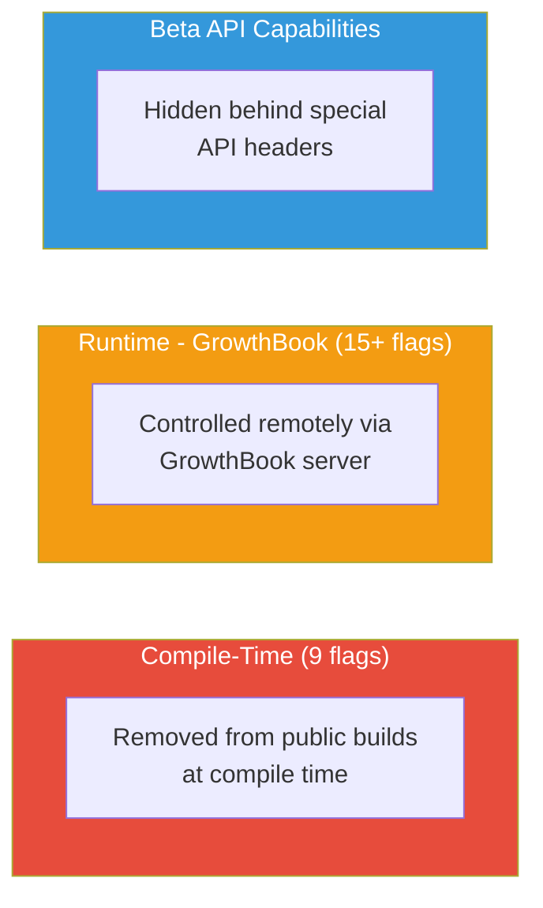
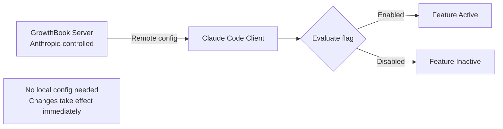
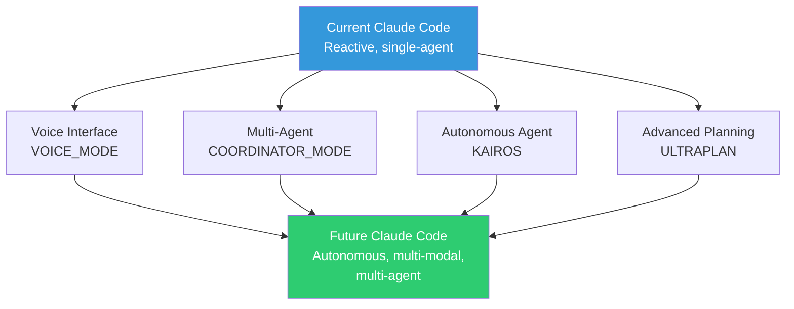

# Feature Flags

The leaked source code reveals **44 feature flags** controlling fully built but unreleased features. These flags fall into three categories based on how they're managed.

## Flag Categories

## Compile-Time Flags (9)

These features are completely removed from public builds during compilation. The code exists in the source but is dead-code-eliminated in the distributed binary.

| Flag | Feature | Status | Additional Gate |
|------|---------|--------|-----------------|
| `KAIROS` | Autonomous daemon mode | Fully implemented | None |
| `COORDINATOR_MODE` | Multi-agent orchestration | Fully implemented | `CLAUDE_CODE_COORDINATOR_MODE` env var |
| `VOICE_MODE` | Push-to-talk voice interface | Implemented | `tengu_amber_quartz_disabled` GrowthBook flag (killswitch) |
| `ULTRAPLAN` | 30-minute remote planning sessions | Implemented | None |
| `BUDDY` | Terminal pet (18 species, rarity tiers) | Implemented | None |
| `NATIVE_CLIENT_ATTESTATION` | Zig HTTP-level DRM hash | Active in builds | None |
| `ANTI_DISTILLATION_CC` | Fake tool injection | Active in builds | None |
| `VERIFICATION_AGENT` | Implementation verification agent | Fully implemented | `tengu_hive_evidence` GrowthBook flag |
| `FORK_SUBAGENT` | Fork execution model for subagents | Implemented | None |

### Implementation Notes

- **Directories without explicit feature() gates**: Voice (`/src/voice`), Buddy (`/src/buddy`), and UltraPlan modules exist in source code as standalone implementations. They are gated at the module entry point (e.g., `isVoiceGrowthBookEnabled()`, `isBuddyLive()`) rather than with inline `feature()` calls throughout the code.

## Runtime Flags: GrowthBook (15+)

These flags use the `tengu_` prefix and are controlled remotely via [GrowthBook](https://www.growthbook.io/), a feature flagging service. Anthropic can toggle these without pushing a new build.

### Key Feature Flags

| Flag | Controls | Type |
|------|----------|------|
| `tengu_hive_evidence` | Enables verification agent (production feature) | Boolean |
| `tengu_onyx_plover` | AutoDream configuration: `{ enabled, minHours, minSessions }` | Object |
| `tengu_cobalt_raccoon` | Reactive-only compact mode | Boolean |
| `tengu_time_based_microcompact` | Time-based microcompact behavior | Boolean |
| `tengu_amber_stoat` | Explore/Plan agents enabled (A/B test) | Boolean |
| `tengu_amber_quartz_disabled` | Voice mode killswitch (emergency off) | Boolean |
| `tengu_anti_distill_fake_tool_injection` | Fake tool injection on/off | Boolean |
| `tengu_attribution_header` | Client attestation header on/off | Boolean |
| `tengu_security_classifier_*` | Security classifier behavior | Various |
| `tengu_scratch` | Scratchpad feature availability | Boolean |

### GrowthBook Architecture

Key properties:
- Flags are evaluated at runtime against remote configuration
- Changes take effect without local updates
- Can be A/B tested across user segments
- Telemetry can be removed in modified builds without affecting local flag evaluation

## Notable Hidden Features

### KAIROS: Autonomous Daemon
The most significant hidden feature. See [KAIROS deep dive](../agents/kairos.md).

- 150+ source code references
- Fully implemented background agent
- `autoDream` memory consolidation
- GitHub webhook subscriptions

### VOICE_MODE: Push-to-Talk
A voice interface for Claude Code:
- Push-to-talk activation
- Speech-to-text for input
- Text-to-speech for responses
- Designed for hands-free coding

### ULTRAPLAN: Remote Planning
Extended planning sessions:
- 30-minute planning sessions
- Remote execution (not local)
- Designed for complex architectural decisions
- May involve multiple model calls

### BUDDY: Terminal Pet
The most unexpected finding:
- 18 different species
- Rarity tier system
- Lives in the terminal alongside Claude Code
- Purely cosmetic/entertainment feature

### COORDINATOR_MODE: Multi-Agent
Multi-worker orchestration:
- Spawns multiple worker agents
- Coordinator manages task distribution
- Workers operate in parallel
- Results aggregated by coordinator

## Feature Flag Impact

The 44 flags reveal Anthropic's product roadmap:

The feature flags paint a picture of Claude Code evolving from a reactive coding assistant to an autonomous, multi-modal, multi-agent development platform.
