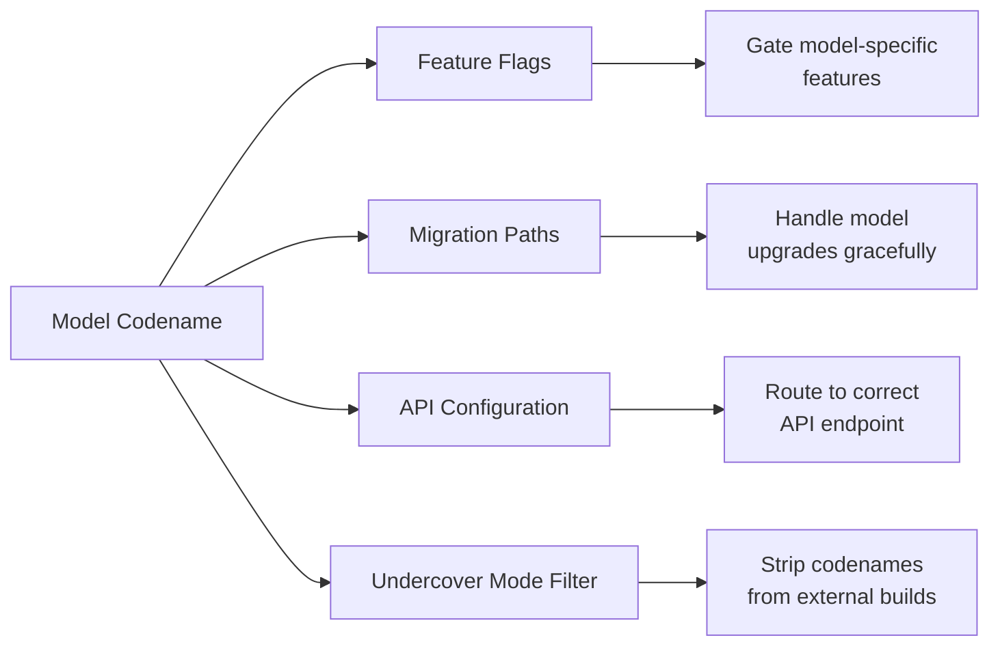

# Model and Project Codenames

The leaked source code reveals internal codenames for Claude models and projects that are not publicly documented. These codenames appear in feature flags, migration paths, and configuration code.

## Codename Map

| Codename | Type | Details |
|----------|------|---------|
| **Capybara** | Model | Sonnet-series v8 with 1M context window; appears in "fast mode" comments |
| **Fennec** | Model | Claude Opus 4.5; migration paths exist in source |
| **Numbat** | Model | Next unreleased model; launch window baked into source code |
| **Tengu** | Project | Internal codename for Claude Code itself |

## Capybara (Sonnet v8)

Capybara is the internal codename for the Sonnet-series model at version 8 with a 1M context window. It appears in the source code as the model powering "fast mode."

### Key Observations

- Context window: **1M tokens**
- Has a "fast mode" variant (same model, optimized for faster output)
- **False claims rate**: 29-30%, a notable regression from v4's 16.7%
- This regression suggests a speed-accuracy tradeoff in the v8 iteration

::: info
"Fast mode" in Claude Code uses the same model (Capybara/Sonnet), not a different model. It optimizes for faster token generation at the same quality level, though the false claims rate data suggests some accuracy tradeoff.
:::

## Fennec (Claude Opus 4.5)

Fennec is the internal codename for Claude Opus 4.5. The source code contains migration paths from Fennec to the current Opus model, suggesting a structured model upgrade process.

- Migration code exists for transitioning configurations
- Feature flags reference Fennec for backward compatibility
- Indicates Anthropic maintains parallel model versions during transitions

## Numbat (Unreleased)

Numbat is the most intriguing codename. It refers to a **next-generation model** that has not been publicly announced.

- Launch window dates are embedded in the source code
- Feature flags exist to gate Numbat-specific behavior
- Configuration entries suggest different capability profiles

::: warning
The presence of Numbat in the source code confirms that Anthropic has at least one unreleased model in development with launch timing already planned.
:::

## Tengu (Project Codename)

Unlike Capybara, Fennec, and Numbat, Tengu is not a model codename. It's the **internal project codename for Claude Code itself**.

Tengu appears as a namespace prefix across multiple systems:

| Usage | Example |
|-------|---------|
| Feature flags | `tengu_hive_evidence` (verification agent), `tengu_onyx_plover` (autoDream) |
| GrowthBook control flags | `tengu_anti_distill_fake_tool_injection`, `tengu_attribution_header` |
| Telemetry events | `tengu_` prefixed analytics events |
| Configuration keys | Various `tengu_` prefixed settings |

The `tengu_` prefix provides a consistent namespace that ties feature flags, telemetry, and configuration to the Claude Code product specifically (distinguishing Claude Code infrastructure from other Anthropic products like Claude.ai).

## How Codenames Are Used

### Undercover Mode Integration

[Undercover Mode](../security/undercover-mode.md) specifically prevents the disclosure of these codenames in external builds. The system is configured to strip any mention of Capybara, Fennec, Numbat, and Tengu from outputs when operating in public or open-source repositories.
