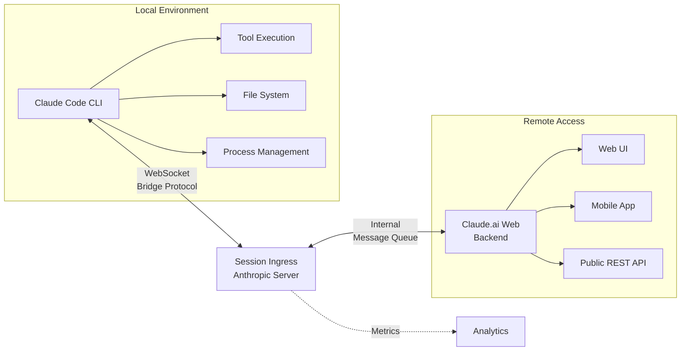

# Unreleased Features

Beyond the major hidden features documented elsewhere, the leaked source reveals several additional unreleased capabilities. This document provides deep technical analysis of each system, including implementation details, architecture diagrams, and integration patterns.

## Voice Mode

| Property | Details |
|----------|---------|
| Implementation | Fully implemented as standalone module |
| Compile-time flag | `VOICE_MODE` |
| Runtime gate | `tengu_amber_quartz_disabled` GrowthBook killswitch |
| Interface | Push-to-talk |
| Input | Speech-to-text (streaming) |
| Output | Text-to-speech synthesis |
| Module location | `/src/voice/` |

Voice Mode adds a push-to-talk interface to Claude Code, enabling hands-free interaction through a complete audio pipeline. The implementation includes:

- **Microphone activation** via keyboard shortcut (typically Alt+Space or Cmd+Space)
- **Real-time speech-to-text transcription** with streaming audio processing
- **Response delivery via text-to-speech** synthesis
- **Integration with the existing tool system**: voice commands trigger the same tools as text input
- **Voice keyterm detection**: recognizing wake words and command phrases to optimize STT performance

### Audio Pipeline Architecture

The complete audio flow operates as follows:

```
Microphone
    ↓
Audio Capture (WebAudio API or platform native)
    ↓
voiceStreamSTT.ts: Streaming Speech-to-Text
    ↓
Text Input Buffer
    ↓
Claude Model Processing (existing)
    ↓
Text Output
    ↓
TTS Engine (Web Speech API or platform native)
    ↓
Speaker Output
```

### Implementation Details

**Streaming STT Processing**:
- Chunks audio into ~100-200ms buffers
- Sends chunks to upstream STT service with minimal latency
- Maintains streaming context for better recognition accuracy
- Handles microphone permission requests and device enumeration
- Fallback to alternative STT providers if primary service unavailable

**Voice Command Integration**:
- Voice inputs are converted to text and injected into the standard input system
- Tool calls triggered by voice use identical execution paths as text-based calls
- Voice context is preserved in the session for debugging and analytics

**Keyterm Detection**:
- Pre-processing step to identify trigger phrases ("hey Claude", "run test", etc.)
- Reduces unnecessary STT processing for ambient noise
- Customizable per user/organization preferences

### Related Documentation
Voice Mode is currently gated behind a compile-time flag and not available in public builds.

---

## UltraPlan

| Property | Details |
|----------|---------|
| Implementation | Fully implemented as standalone module |
| Compile-time flag | `ULTRAPLAN` |
| Duration | Up to 30 minutes |
| Execution | Remote (Anthropic infrastructure) |
| Purpose | Complex architectural planning |
| Command | `/ultraplan` |
| Module location | `/src/ultraplan/` |

UltraPlan extends the current [Plan mode](../agents/subagent-types.md) with a remote, longer-running variant designed for complex architectural decisions:

### Comparison with Standard Plan Mode

| Feature | Plan Mode | UltraPlan |
|---------|-----------|----------|
| **Execution** | Local (Claude Code CLI) | Remote (Anthropic servers) |
| **Duration** | 2-5 minutes | Up to 30 minutes |
| **Model Calls** | Single-pass analysis | Multiple iterative calls |
| **State Access** | Full read/write to filesystem | Read-only via file upload |
| **File System** | Direct access | Sandboxed upload |
| **Intended Use** | Feature planning, refactoring | System architecture, multi-service design |
| **Cost Model** | Included in CLI usage | Metered separately |

### UltraPlan Execution Flow

```
1. User invokes /ultraplan
2. Claude Code uploads project context + requirements to Anthropic API
3. Remote planning agent initialized in parallel execution environment
4. Multiple model calls (Claude 3.x variants) analyze problem iteratively:
   - First pass: Decompose problem into components
   - Refinement passes: Validate assumptions, stress-test design
   - Final pass: Generate implementation roadmap
5. Plan artifact downloaded and stored in `.claude/plans/`
6. User can review, approve, or iterate with feedback
```

### Technical Integration

- Plans are serialized to `.claude/plans/ultplan-{id}.md` format
- Remote planning respects the same approval/rejection workflow as local plans
- File uploads use authenticated endpoints with optional encryption
- Planning session can be paused and resumed within the 30-minute window
- Tool calls from the remote planner are logged and can be audited

### Use Cases
- **Microservices architecture review**: Design services, data flows, and API contracts across 10+ systems
- **Framework migration**: Plan multi-week TypeScript-to-Rust migration with minimal breaking changes
- **Security hardening**: Comprehensive threat model + remediation strategy for production systems
- **Performance optimization**: Full-stack analysis for latency-critical applications

---

## Buddy: Terminal Pet

| Property | Details |
|----------|---------|
| Implementation | Fully implemented as standalone module |
| Compile-time flag | `BUDDY` |
| Species | 18 different types |
| Rarity | Tiered system (Common → Legendary) |
| Function | Cosmetic / engagement feature |
| Module location | `/src/buddy/` |

The most unexpected discovery. A virtual pet system for the terminal that appears alongside Claude Code:

### Species Collection System

Buddy features an 18-species collection mechanism:

- **Common species** (50% drop rate): Basic ASCII art creatures with minimal animation
- **Uncommon species** (30% drop rate): More detailed designs with 2-3 animation frames
- **Rare species** (15% drop rate): Complex emoji/Unicode art with fluid animation
- **Legendary species** (5% drop rate): Complex multi-line ASCII art, rare dialogue

Species are randomly assigned to new sessions and can be influenced by:
- Session duration (longer sessions unlock rarer species)
- Time of day (nocturnal species more common after 8 PM)
- Productivity streaks (consecutive error-free sessions improve rarity odds)
- Special events (holiday-themed species during December)

### Implementation Architecture

The Buddy system includes modular components for species management, animation, persistence, and terminal UI rendering.

### Engagement & Retention Features

- **Leveling system**: Buddy gains XP through completed tasks (tools used, files edited)
- **Achievement badges**: Unlock special cosmetics for milestones (100 tool calls, 1000 lines edited)
- **Daily streaks**: Maintain consecutive days of Claude Code usage for bonuses
- **Seasonal events**: Limited-time species spawns and cosmetic variants
- **Social sharing**: Export cute terminal screenshots (privacy-preserving)

### Purely Cosmetic Nature

- No functional impact on Claude Code's core capabilities
- Buddy state persists independently from project/session state
- Can be disabled entirely via feature flag without affecting CLI behavior
- Rendering occurs in-band with terminal output but uses non-blocking async rendering

---

## Bridge Mode

| Property | Details |
|----------|---------|
| Implementation | Fully implemented as standalone module |
| Compile-time flag | `BRIDGE_MODE` |
| Connection | WebSocket to Claude.ai |
| State Flag | `replBridgeEnabled` |
| Protocol | Bridge Protocol (proprietary) |
| Module location | `/src/bridge/` |

Bridge Mode represents the most architecturally significant unreleased feature. An always-on WebSocket connection to Claude.ai enabling persistent background sessions and remote access patterns.

### Architecture Overview



### Session Ingress Protocol

The Bridge Protocol defines a message format for exchanging:

```typescript
// Incoming from Claude Code
{
  type: 'tool_call',
  sessionId: string,
  toolName: string,
  params: Record<string, unknown>,
  timestamp: number
}

// Outgoing to Claude Code
{
  type: 'tool_result',
  sessionId: string,
  toolName: string,
  result: unknown,
  error?: string,
  timestamp: number
}
```

### Key Capabilities

- **Persistent background sessions**: Initiate long-running tasks from web UI and check status from CLI or mobile
- **Remote tool execution**: Execute filesystem operations or system commands from Claude.ai web interface
- **Cross-platform continuity**: Start conversation on web, continue on CLI, complete on mobile
- **Live session mirroring**: Bidirectional event streaming (all parties see updates in real-time)
- **Fallback handling**: If Bridge connection drops, CLI continues with local context; reconnection syncs state

### Implementation Details

**WebSocket Connection**:
- Auto-reconnect with exponential backoff (1s → 30s max)
- Heartbeat every 30 seconds to detect stale connections
- Authentication via session token with 1-hour TTL
- Message queuing if disconnected (100-message buffer)

**Bridge Protocol Handler**:
- Parses incoming Bridge Protocol messages
- Routes tool calls to local executor
- Captures results and sends back upstream
- Handles error propagation and retry logic

**State Synchronization**:
- Merkle tree-based state reconciliation
- Conflict resolution: local changes take precedence in case of divergence
- Full state snapshot uploaded on reconnect
- Incremental updates for performance

### `replBridgeEnabled` State Flag

This flag controls Bridge Mode activation and is stored in the user's configuration:

```json
{
  "replBridgeEnabled": true,
  "bridgeSettings": {
    "autoReconnect": true,
    "sessionTimeout": 3600,
    "bufferSize": 100,
    "compressionEnabled": true
  }
}
```

### Security Considerations

- TLS 1.3 for all Bridge connections
- Session tokens are short-lived and device-bound
- Tool execution logs are sanitized before remote transmission
- File operations are restricted to project directory
- No arbitrary code execution over Bridge

---

## Worktree Mode

| Property | Details |
|----------|---------|
| Tool | `EnterWorktreeTool` / `ExitWorktreeTool` |
| Storage | `.claude/worktrees/` |
| Branch | Temporary, auto-created |
| Integration | tmux session management |
| Use Case | Safe experimentation, parallel development |

Worktree Mode enables git worktree isolation for safe feature development without conflicts:

### Workflow

**Entering a worktree**:
```bash
EnterWorktreeTool(name='feature-auth')
# Creates: .claude/worktrees/feature-auth/
# Creates branch: claude/feature-auth (from HEAD)
# Creates tmux session: claude-feature-auth (optional)
# Changes directory to worktree
```

**Working in isolation**:
- All file edits, git commits occur in the isolated worktree
- Original working directory remains unaffected
- Can run builds, tests independently
- Tool execution scoped to worktree filesystem

**Exiting the worktree**:
```bash
ExitWorktreeTool(action='keep') # or 'remove'
# Keeps working directory: .claude/worktrees/feature-auth/
# Keeps branch: claude/feature-auth
# Returns to original working directory
# Returns to original git branch
```

### Implementation Details

**Worktree Creation**:
- Uses `git worktree add` to create isolated filesystem
- Branch naming: `claude/{name}` auto-generated if not specified
- Supports resuming abandoned worktrees by name
- Validates no uncommitted changes in primary repo

**tmux Integration**:
- Optional session creation with name: `claude-{name}`
- Session attached to worktree directory
- Supports multiple panes for parallel tasks
- Session name returned for user reconnection

**File Scoping**:
- All file operations (Read, Edit, Write) scoped to worktree root
- Prevents accidental modifications to main working directory
- Enforces `.claude/worktrees/` containment for new files

### Use Cases

- **Parallel feature development**: Develop feature-A in one worktree, hotfix bugs in another
- **Safe experimentation**: Try risky refactorings without affecting main checkout
- **Multi-PR workflows**: Maintain separate branches for concurrent code reviews
- **CI/CD testing**: Run full test suite in worktree before merging
- **Version testing**: Keep worktrees on different git tags for comparison

### Merge & Discard Flow

After exiting with `action='keep'`:
- Branch exists at `.claude/worktrees/feature-auth`
- User can manually merge, rebase, or push
- Or abandon and run `ExitWorktreeTool(action='remove')` later

---

## Plan Mode Internals

| Property | Details |
|----------|---------|
| Storage | `.claude/plans/` directory |
| File Format | Markdown with YAML frontmatter |
| Tool Restrictions | Read-only (Edit, Write, NotebookEdit blocked) |
| Lifecycle | `EnterPlanModeTool` → work → `ExitPlanModeTool` |
| Approval Flow | Read-only → approved state → executable |

Plan Mode provides structured planning with read-only tool restrictions to prevent accidental execution during planning phases:

### Directory Structure

```
.claude/plans/
├── plan-{id}.md
│   ├── YAML Frontmatter:
│   │   ├── id: plan-12345
│   │   ├── created: 2026-04-02T10:30:00Z
│   │   ├── status: draft|approved|executing|completed
│   │   ├── mode: local|remote
│   │   └── approval: { approvedBy, approvedAt }
│   └── Markdown Content:
│       ├── # Goal
│       ├── # Analysis
│       ├── # Implementation Steps
│       └── # Success Criteria
├── plan-{id}-artifacts/
│   ├── diagram.mermaid
│   ├── code-snippet.ts
│   └── timeline.json
└── index.md (plan registry)
```

### Tool Restrictions During Planning

When `PlanMode` is active, the following tools are blocked:

| Tool | Reason |
|------|--------|
| `Edit` | Prevent accidental code modifications |
| `Write` | Prevent file creation during planning |
| `NotebookEdit` | Prevent notebook cell changes |
| `Bash` | Prevent command execution (read-only access OK) |

**Allowed during planning**:
- `Read`, `Glob`, `Grep`: Information gathering
- `mcp__plugin_oh-my-claudecode_t__lsp_*`: Code analysis
- `mcp__plugin_deploy-on-aws_awsknowledge__aws___search_documentation`: Research
- Creating and updating plan artifacts

### Lifecycle Management

**Entering Plan Mode** (`EnterPlanModeTool`):
```typescript
EnterPlanModeTool({
  goal: "Migrate authentication system from JWT to OAuth2",
  duration: 300, // 5 minutes
  template: "architecture|feature|refactor"
})
// Creates .claude/plans/plan-{id}.md
// Sets status: draft
// Blocks write operations
```

**Exiting Plan Mode** (`ExitPlanModeTool`):
```typescript
ExitPlanModeTool({
  planId: "plan-12345",
  action: "approve" | "discard"
})
// If approve: status → approved
// Generates approval receipt with timestamp
// Unblocks write operations
```

### Approval Flow

1. **Draft phase**: Plan created and edited in read-only mode
2. **Review**: Plan content is finalized with analysis and steps
3. **Approval**: User or reviewer approves the plan (approval recorded in frontmatter)
4. **Execution**: Plan status changes to `executing`, tools are unblocked
5. **Completion**: Steps completed, plan status → `completed`

---

## Vim Mode

| Property | Details |
|----------|---------|
| Flag | `VIM_MODE` (compile-time) |
| Command | `/vim` (toggle) |
| Integration | Ink text input component |
| Keybinding | Standard Vi/Vim conventions |

Vim Mode adds comprehensive Vi/Vim keybindings to the Claude Code terminal input system:

### Core Features

- **Modal editing**: Normal mode (navigation), Insert mode (editing), Visual mode (selection)
- **Navigation commands**: `hjkl`, `w`, `b`, `^`, `$`, `G`, `gg`
- **Editing operations**: `d`, `c`, `y`, `p`, `u`, `Ctrl-R`
- **Motions and text objects**: `w`, `W`, `s`, `p`, `(`, `{`, `"`, etc.
- **Search and replace**: `/`, `?`, `:%s///g` (command prompt)

### Implementation

**Keybinding Engine**:
- Intercepts raw keyboard input before text component processing
- Maintains modal state machine (normal ↔ insert ↔ visual)
- Buffers keypresses to recognize multi-key commands (e.g., `dw`, `y$`)
- Falls through to default input behavior when Vim keybinds don't match

**Ink Integration**:
- Hooks into Ink's `useInput` hook via custom component wrapper
- Translates Vim commands to text cursor movements and selections
- Synchronizes buffer state with actual text input component
- Handles edge cases (EOL, empty input, paste behavior)

### Command Prompt

Vim Command Mode (`:` prefix) supports:
- `:w`: Save current file (delegates to parent application)
- `:q`: Quit Claude Code session
- `:set number`: Toggle line numbers
- `:set paste`: Enable paste mode (disables Vim keybinds temporarily)
- `:%s/old/new/g`: Global find and replace in session history

### Configuration

```json
{
  "vim": {
    "enabled": true,
    "mode": "normal",
    "showModeIndicator": true,
    "keymap": "vim",
    "smartcase": true,
    "undoLevels": 100
  }
}
```

### Use Cases

- **Efficient text editing**: Power users accustomed to Vim get native support
- **Scripted interactions**: Vim commands can be recorded and played back
- **Accessibility**: Keyboard-only workflow without mouse dependency

---

## GrowthBook Remote Configuration

| Property | Details |
|----------|---------|
| Service | GrowthBook (feature flag management) |
| Flag Prefix | `tengu_` |
| Control | Anthropic's servers |
| Scope | All Claude Code installations |
| Update Frequency | Real-time with polling fallback (30s) |

GrowthBook integration extends beyond simple feature flags. It provides full remote configuration and emergency controls:

### Tengu Prefix Explanation

The `tengu_` prefix indicates **internal-only flags** controlled by Anthropic engineering:

- `tengu_classifier_sensitivity`: Adjust auto-mode permission classifier strictness (0.5-1.0)
- `tengu_distillation_protection`: Enable/disable anti-distillation guards
- `tengu_attestation_enabled`: Require client device attestation
- `tengu_model_routing_{region}`: Route requests to specific model endpoints
- `tengu_rate_limit_{tier}`: Dynamically adjust rate limits per customer segment

### A/B Testing & Feature Rollout

GrowthBook enables staged rollouts:

```json
{
  "rule": {
    "id": "tengu_bridge_mode_rollout",
    "variations": [
      { "id": "control", "value": false },
      { "id": "treatment", "value": true }
    ],
    "weights": [0.8, 0.2],
    "namespace": ["bridge-mode", 0.05],
    "tracks": ["cohort_a", "cohort_b"]
  }
}
```

- 80% of users see `bridge_mode: false`
- 20% see `bridge_mode: true` (early adopters)
- Namespace prevents overlap (stable 5% of cohort_a gets both A/B tests)
- Tracks can be segmented by region, account age, or usage pattern

### Emergency Killswitches

Anthropic can instantly disable any feature across all installations:

```json
{
  "feature": "tengu_experimental_voice_mode",
  "enabled": false,
  "reason": "Critical security issue in audio processing pipeline"
}
```

When a killswitch is triggered:
1. All clients pull updated config (within next poll cycle, ~30 seconds)
2. Feature is disabled for all users simultaneously
3. Graceful degradation (no user-visible crashes)
4. Telemetry event recorded for audit trail

### Security & Compliance

- All flag changes logged with timestamp, actor, and reason
- Flags cannot be accessed client-side (read-only from remote)
- Rollback capability: previous config versions maintained
- Flag evaluation respects user privacy (no PII in decision logic)

---

## OpenTelemetry Integration

| Property | Details |
|----------|---------|
| Framework | OpenTelemetry (OTEL) |
| Exporter | Datadog, self-hosted OTEL collector |
| Privacy | PII-free diagnostic logging |
| Control | Disableable in modified builds |

OpenTelemetry instrumentation provides comprehensive observability of Claude Code operations:

### Span Definitions

**Request/Response Lifecycle**:
```typescript
span('claude.api.request', {
  attributes: {
    'model': 'claude-3-5-sonnet',
    'token_count.input': 1024,
    'token_count.output': 256,
    'latency_ms': 1200,
    'retry_count': 0
  }
})
```

**Tool Execution**:
```typescript
span('tool.execution', {
  attributes: {
    'tool_name': 'Edit',
    'file_path_hash': 'sha256:abc...', // Hashed for privacy
    'execution_time_ms': 45,
    'error_type': null
  }
})
```

**Session Metrics**:
```typescript
span('session.lifecycle', {
  attributes: {
    'session_duration_minutes': 15,
    'tool_call_count': 8,
    'file_operations': 3,
    'error_count': 0,
    'completion_rate': 0.95
  }
})
```

### Datadog Integration

The exporter sends traces to Datadog's API:

```typescript
export const datadogExporter = new BatchSpanProcessor(
  new OTLPExporter({
    url: 'https://trace.agent.datadoghq.com/v1/traces',
    headers: {
      'DD-API-KEY': process.env.DATADOG_API_KEY
    }
  })
)
```

Benefits:
- Real-time alerting on error spike detection
- Service performance dashboard (p50, p95, p99 latencies)
- Distributed tracing across Claude Code ↔ API calls
- Custom metrics and event correlation

### First-Party Event Logger

An in-house event logger provides structured event capture:

```typescript
logger.event('tool_executed', {
  tool: 'Edit',
  duration_ms: 45,
  file_lines: 10,
  success: true
})
```

Logged events:
- Tool invocations and outcomes
- API call latencies and error rates
- Feature flag evaluations (which flags, value, user segment)
- Session start/stop/error events
- Authentication and session lifecycle

### Privacy & Data Handling

**PII Mitigation**:
- File paths are hashed (SHA-256) before transmission
- Source code is never transmitted (only hash/size)
- User identifiers are session-scoped, not account-scoped
- Usernames and email addresses never logged

**PII-Free Diagnostics**:
```typescript
// GOOD: Hash + size
span('file_operation', {
  'file_hash': sha256(filepath),
  'file_size_bytes': 1024
})

// BAD: Raw path (NEVER sent)
// span('file_operation', { 'file_path': '/Users/alice/secrets.env' })
```

### Disabling Telemetry in Modified Builds

Modified builds can disable telemetry:

```bash
# Compile-time removal
build --no-telemetry

# Runtime configuration
export OTEL_DISABLED=true
./claude-code
```

Telemetry removal does not affect core functionality:
- OpenTelemetry code is in a separate module
- Tool execution code paths are telemetry-agnostic
- Datadog integration can be completely removed (no hard dependency)

---

## Desktop, Mobile, and IDE Integration

| Property | Details |
|----------|---------|
| Desktop | Native desktop app integration |
| Mobile | Mobile app support |
| Browser | Chrome Extension |
| IDE | VS Code and JetBrains IDEs |
| App Integrations | Slack, GitHub |

Claude Code extends beyond the terminal through platform bridges and integrations:

### Desktop Bridge

Enables native desktop app integration:

- **Window management**: Focus Claude Code from other apps, switch between windows
- **Clipboard integration**: Paste file contents or code snippets directly from Claude Code
- **Keyboard shortcuts**: Global hotkeys (Cmd+Shift+K to activate Claude Code from any app)
- **File associations**: Open files with Claude Code from Finder/Explorer
- **Notification delivery**: Desktop notifications for long-running tasks completion

### Mobile Bridge

Mobile app support with platform-specific implementations:

- **iOS integration**: Claude Code companion app for session management, notifications
- **Android integration**: Similar features, Android-specific APIs (push notifications via FCM)
- **File picker**: Share files from mobile device to Claude Code session
- **Voice input**: Mobile microphone → Claude Code voice input (via Bridge Mode)
- **Real-time sync**: Session state synced across mobile and desktop

### Browser Integration

Chrome Extension provides in-browser Claude Code access:

```javascript
// Content script injects Claude Code assistant
chrome.runtime.sendMessage({
  action: 'analyze_code',
  code: selectedCode,
  context: 'github_pr'
})
```

Features:
- **GitHub integration**: Inline code review suggestions on pull requests
- **Code snippet capture**: Right-click any code block to send to Claude Code
- **Session context sharing**: Share current tab URL and selected text
- **Interactive results**: Display analysis results in a sidebar

### IDE Integration

First-class support for VS Code and JetBrains IDEs:

**VS Code Extension**:
```typescript
export class VSCodeBridge {
  async executeCommand(toolName: string, params: Record<string, unknown>) {
    const result = await this.claudeCodeProcess.invoke(toolName, params)
    return this.formatResultForVSCode(result)
  }
}
```

- **Inline tool execution**: Run Claude Code tools from IDE command palette
- **File sync**: Edits in Claude Code reflected in IDE and vice versa
- **Terminal integration**: Run Claude Code in VS Code's integrated terminal
- **Debugging**: IDE breakpoints can trigger Claude Code inspection

**JetBrains Integration**:
- Plugin available for IntelliJ IDEA, PyCharm, WebStorm, etc.
- Context menu actions for code analysis and refactoring
- Intention actions for AI-assisted fixes
- Keyboard shortcut: `Ctrl+Shift+J` (Windows/Linux), `Cmd+Shift+J` (macOS)

### App Integrations

**Slack App** (`install-slack-app`):
- Deploy Claude Code as Slack bot
- Commands: `/claude analyze`, `/claude refactor`, `/claude explain`
- File sharing: Drag files into Slack thread → Claude Code processes
- Message threading: Conversation history preserved in Slack
- Installation: https://claude-code.app/slack/install

**GitHub App** (`install-github-app`):
- Permissions: Read issues, read pull requests, write pull request comments
- Features:
  - `/claude-code help` in GitHub issues/PRs
  - Inline code review on PRs
  - Automatic issue triage and labeling
  - GitHub Actions integration (Claude Code as CI step)
- Installation: https://github.com/apps/claude-code-assistant

### Architecture Pattern

All integrations follow a common bridge pattern:

```
External Platform (IDE/Mobile/Browser)
    ↓
Platform-Specific Bridge (desktop.ts/mobile.ts/chrome.ts)
    ↓
Tool Invocation (via REST API or IPC)
    ↓
Claude Code Core (same execution path as CLI)
    ↓
Result Formatting (platform-specific output)
    ↓
Back to External Platform
```

This ensures consistency: a tool called from VS Code executes identically to the same tool from the CLI.

---

## Cross-Feature Integration Points

Several unreleased features interact with each other:

| Feature A | Feature B | Integration |
|-----------|-----------|-------------|
| Voice Mode | Bridge Mode | Voice commands from mobile device routed to local CLI |
| UltraPlan | Worktree Mode | Generate implementation plan in worktree isolation |
| Buddy | Plan Mode | Buddy cosmetics unlock based on plan completion streaks |
| Vim Mode | IDE Integration | IDE extensions expose Vim keybindings |
| GrowthBook | Desktop Bridge | Feature flags control which integrations are available |
| OpenTelemetry | All features | Every feature emits telemetry spans (disableable) |

---

## Security & Privacy Considerations

### Data Transmission

- **Bridge Mode**: TLS 1.3, session-bound tokens, file path hashing
- **OpenTelemetry**: PII-free spans, code content never transmitted
- **Mobile/Desktop bridges**: Encrypted local socket communication
- **IDE Integration**: VSCode/JetBrains process-local IPC, no network transmission

### Capability Restrictions

- **Plan Mode**: Read-only restrictions prevent accidental execution
- **Worktree Mode**: Filesystem scoped to worktree root
- **Buddy**: No file system access, purely cosmetic
- **Voice Mode**: Microphone access requires user permission grant

### User Control

- All features are **opt-in** (compile-time flags)
- GrowthBook killswitches provide emergency disable capability
- Telemetry can be disabled without affecting functionality
- User can revoke Bridge Mode WebSocket connection at any time

---

## Summary

These unreleased features represent significant investments in:

1. **Multimodal interaction** (Voice Mode, Vim Mode, IDE integration)
2. **Remote execution** (UltraPlan, Bridge Mode, mobile/desktop bridges)
3. **Planning & governance** (Plan Mode, worktree isolation)
4. **Observability** (OpenTelemetry, telemetry infrastructure)
5. **User engagement** (Buddy, GrowthBook rollout capabilities)

The architecture maintains clear separation of concerns, with each feature deployable independently via compile-time flags and GrowthBook feature control. Integration points are minimal and well-defined, reducing coupling and improving maintainability.
