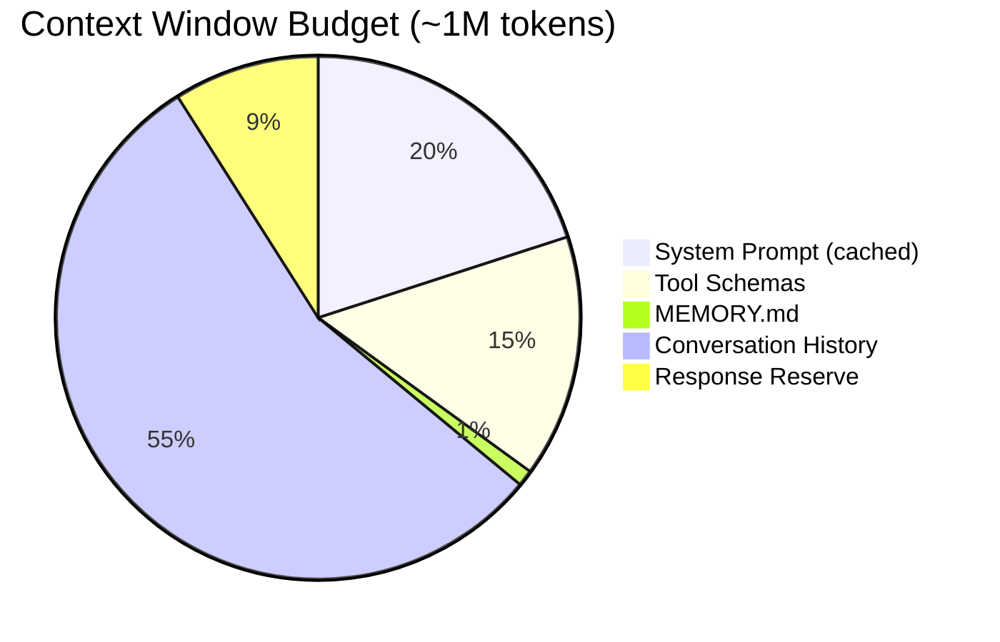
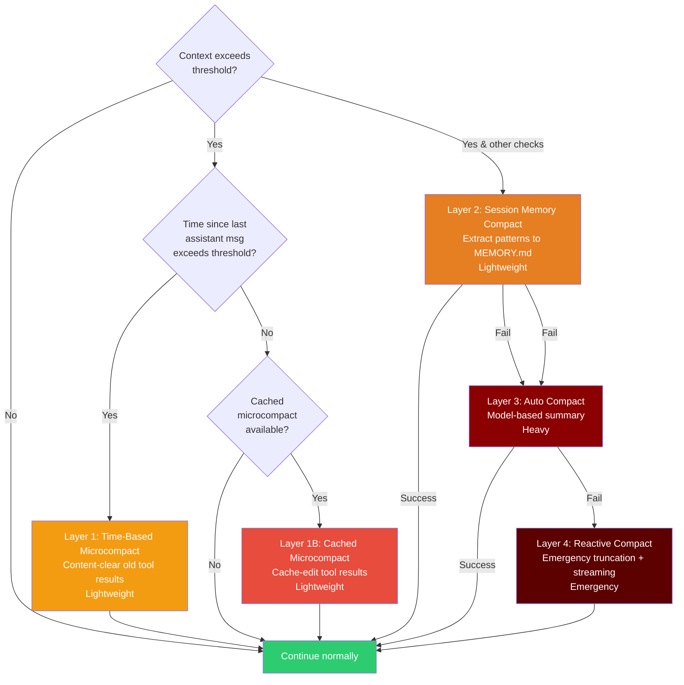
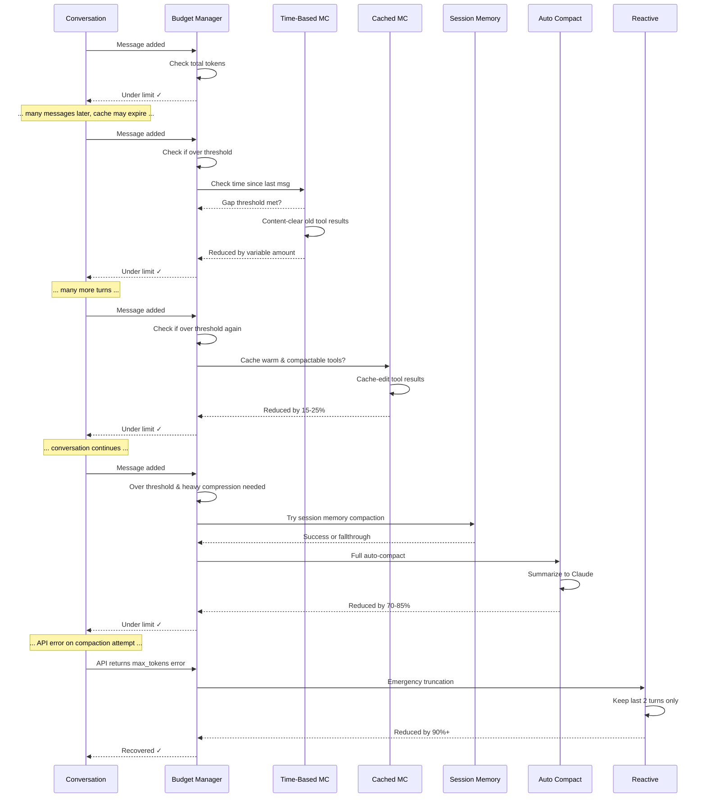
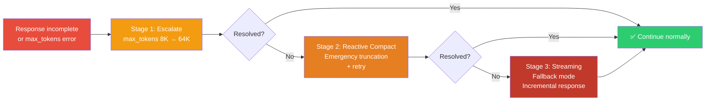

# Context Budgeting

Claude Code implements dynamic token budget management to maximize the useful information within the context window while staying within model limits. The system uses a sophisticated multi-layer compaction architecture that applies only the minimal compression necessary to preserve maximum information quality.

## Budget Allocation



### Detailed Budget Breakdown

| Component | Tokens | Cacheable | Dynamic |
|-----------|--------|-----------|---------|
| System prompt instructions | ~20-25K | Yes (prefix) | No |
| Tool schemas (14-17 registered tools) | 14-17K | Yes (prefix) | No |
| Session context (MCP, hooks) | 3-5K | No (suffix) | No |
| MEMORY.md (pointer index) | ~500-1K | No | No |
| Conversation history | ~900-950K | No | Yes |
| Response reserve | ~8-10K | No | Yes |

**Total context window**: ~1M tokens (varies by model: Claude 3 Sonnet ~200K, Claude 3.5 Opus ~200K, future models >1M)

**Dynamic adjustments**: The effective context window is calculated at runtime via `effectiveContextWindow = contextWindow - reservedTokensForSummary`. This can be overridden by the `CLAUDE_CODE_AUTO_COMPACT_WINDOW` environment variable. The conversation history and response reserve allocation adjusts based on:
- Model's actual context window size (different models have different limits)
- Tool schema count (more tools = more tokens consumed)
- Current session state (idle vs. active, short vs. long-running)

## Auto-Compression: Progressive Compaction Layers

When the conversation history approaches context limits, the system automatically applies progressively heavier compression layers. The trigger is based on a dynamic threshold: when token count exceeds `effectiveContextWindow - AUTOCOMPACT_BUFFER_TOKENS` (13,000 tokens), compaction is considered. Each layer engages only when necessary, preserving information quality by applying only the minimal compression needed to stay within budget.

### Progressive Compaction Flowchart



### Layer Details

#### Layer 1: Time-Based Microcompact

**Trigger**: Gap since last assistant message exceeds configured threshold (controlled by GrowthBook `tengu_slate_heron` config, default 60 minutes)

**Action**: Content-clear older tool results, keeping only the most recent N

Time-based microcompact detects when the server-side prompt cache has likely expired (based on gap since last message). When this occurs, the entire prefix will be rewritten anyway, so the system clears old tool result blocks before the request to reduce what gets rewritten.

The trigger is configured remotely via GrowthBook with two parameters:
- `gapThresholdMinutes`: how long to wait before triggering (default 60, safe for 1-hour server cache TTL)
- `keepRecent`: how many most-recent tool results to preserve (default 5)

This is a content-clearing operation (mutates local message stream) rather than cache editing, since the cache is already cold. Token savings are proportional to tool result size. The key insight: tool results can be re-read from disk if needed.

---

#### Layer 1B: Cached Microcompact

**Trigger**: Prompt cache is warm AND at least N compactable tool results exist (feature-gated by `CACHED_MICROCOMPACT`, configuration via GrowthBook `tengu_cache_plum_violet`)

**Action**: Use cache_edits API to delete tool result blocks without rewriting the prefix

Cached microcompact operates when the prompt cache is warm. Instead of content-clearing (which invalidates the cache), it uses the **cache_edits API** to surgically delete tool result blocks. This preserves the server-side cache prefix and avoids token-count increases. The deletion is transparent: the model's next request simply omits the deleted blocks.

The system is selective about which tool results to delete, keeping the most recent results while clearing older ones. Configuration is remote-gated, allowing A/B testing of different trigger thresholds. Token savings are modest (~15-25%) because it only affects tool results; the model's responses remain intact.

Unlike time-based microcompact (which runs on every request when triggered), cached microcompact runs only when the cache is provably warm, preventing unnecessary cache invalidation.

---

#### Layer 2: Session Memory Compaction (Experimental)

**Trigger**: Before auto-compact, if session memory extraction is available and feature-gated by `tengu_session_memory` and `tengu_sm_compact`

**Action**: Extract patterns and decisions from recent conversation into MEMORY.md, keep only recent messages

Session memory compaction runs as an optimization before heavy auto-compaction. It identifies session-level patterns (key decisions, discovered bugs, user preferences, file structure insights) and extracts them to MEMORY.md as short pointer lines (~150 chars each).

The system:
1. Expands backwards from the last summarized message to meet minimum thresholds (10K tokens + at least 5 messages with text blocks, up to 40K token cap)
2. Extracts new patterns to session memory (conservative: only facts not already present)
3. Replaces old messages with a boundary marker

If session memory extraction is insufficient or the conversation is too recent, it falls through to Layer 3 (auto-compact). Success rate depends on session age and extraction quality; on success, saves one full API call vs. auto-compact.

---

#### Layer 3: Auto Compact

**Trigger**: Context exceeds threshold AND earlier layers (session memory, time-based microcompact) didn't sufficiently compress OR session memory compaction unavailable

**Action**: Send conversation to Claude for semantic summarization, replace old messages with summary

Auto Compact is the primary workhorse. The system sends everything except the last few turns to Claude with a summarization prompt, captures the result, and replaces old messages with it.

The implementation handles edge cases:
- **Prompt-too-long on compaction itself** (CC-1180): truncates oldest API-round groups and retries (up to 3 times) rather than leaving the user stuck
- **Prompt cache sharing**: when enabled (feature-gated by `tengu_compact_cache_prefix`, default true), reuses the main thread's cached prefix to reduce compression API cost
- **Circuit breaker**: after 3 consecutive auto-compact failures, stops retrying to prevent API waste (set by `MAX_CONSECUTIVE_AUTOCOMPACT_FAILURES = 3`)

Post-compaction, the system re-injects key artifacts to restore working context:
- Recently-accessed files (up to 5, `POST_COMPACT_MAX_FILES_TO_RESTORE`)
- Per-file budget: 5,000 tokens (`POST_COMPACT_MAX_TOKENS_PER_FILE`)
- Plan files if in plan mode
- Invoked skills (up to 25K tokens budget for all skills, 5K per skill)
- Deferred tool schemas and MCP instructions

Token savings are dramatic (~70-85%) because the summary is dense: decisions, file changes, errors, and user intent without exploratory reasoning. Information loss is real, turn-level granularity is gone, but acceptable for long sessions where historical detail isn't needed.

---

#### Layer 4: Reactive Compact

**Trigger**: API call fails with `max_tokens` error despite earlier layers

**Action**: Drastically reduce context to essentials and retry with streaming

Reactive Compact is the emergency escape hatch. When the API returns a `max_tokens` error, the system performs aggressive truncation:
- Keep system prompt and MEMORY.md
- Keep only the last 2 conversation turns
- Discard everything else

The retry then uses **streaming response mode**: tokens are processed incrementally instead of buffered. This prevents the response from hitting memory limits. The model receives a conservative `max_tokens` budget (16K-32K) to force early stopping if needed.

This layer is reached in approximately 1 in 10,000+ sessions. It's a last resort because information loss is critical. The model loses most conversation history and must rely entirely on MEMORY.md pointers. However, it's better than giving up.

After reactive compaction succeeds, normal auto-compaction resumes on subsequent turns if needed. The session remains usable, though the loss of context may require the model to re-read MEMORY.md or files.

**3-stage recovery cascade** (when API errors persist): Stage 1 escalates `max_tokens` budget 8x. Stage 2 applies reactive compact. Stage 3 adds streaming. Success rate: ~99% by Stage 3, but only ~1% of sessions reach here.


---

### High-Level Compression Sequence



The system notifies the user when heavy compression (Layer 3+) occurs:

> "The system is compressing prior messages to stay within context limits. Key decisions and findings are preserved in MEMORY.md."

## Compression Strategy

### What Gets Preserved

During auto-compaction and session memory extraction, the system preserves:
- **Key decisions**: What was decided and why
- **File modifications**: Which files were changed, what changed in each
- **Important findings**: Errors, blockers, discoveries, root causes
- **User instructions**: Original requirements and constraints
- **Cross-references**: Pointers to MEMORY.md, file paths, line numbers

### What Gets Discarded

The compressor discards:
- Verbose tool outputs (file contents already on disk)
- Exploratory searches that didn't yield results
- Intermediate reasoning that led to final decisions
- Repeated information already captured in MEMORY.md
- Successful exploratory paths that led to dead ends

### Fact Extraction to MEMORY.md

After compression, the system extracts new persistent facts and appends them to MEMORY.md. This prevents re-discovery of the same information in future turns.

For **session memory compaction**, the extraction happens *during* compaction: Claude identifies what was learned in the session segment being compressed. Key architectural decisions, discovered bug patterns, user preferences, file structure insights. These are extracted as short pointer lines (~150 chars each) for MEMORY.md.

The extraction is conservative: it only adds facts that don't already exist in MEMORY.md (the prompt explicitly checks against current content). This prevents duplication and memory bloat. The model is instructed to focus on semantic novelty: "the user prefers X over Y" is different from "we tried Y and it failed", even if both appear in the conversation.

For **auto-compaction**, post-compaction hooks can also extract additional facts to MEMORY.md via `executePostCompactHooks()`, but this is less common.

This is particularly valuable in long sessions. After compression, the model's context is heavily reduced, but MEMORY.md serves as a persistent shortcut: "we already know files A and B are broken" or "the architecture is monolithic, not microservices" remains accessible even after the detailed conversation is summarized away.

Session memory compaction (when available) is preferred over auto-compaction but serves similar goals: maintaining knowledge across context boundaries while minimizing API cost.

**Cross-reference**: See [Self-Healing Memory](./self-healing-memory.md) for details on MEMORY.md format and architecture.


## Token Budget Continuation

One critical challenge: even with compression, the model sometimes reaches its `max_tokens` limit mid-response on complex tasks. The system handles this with **synthetic message injection**.

### The Problem: Incomplete Responses

When Claude reaches the token limit:

```
User: "Implement a complex refactor..."
Claude: "I'll start by exploring the codebase...
  [reads files...]
  Now I'll implement the changes:
  1. Create new service file...
  2. Update imports in 5 files...
  3. [TRUNCATED. Hit max_tokens limit]"
```

The response stops abruptly, leaving work incomplete.

### The Solution: Synthetic "Continue" Message

The system detects incomplete responses by checking the `stop_reason` field. When Claude stops due to `max_tokens` (not `end_turn`), the response is incomplete. The system then injects a synthetic user message: "Continue with the remaining changes."

This synthetic message is added to the internal message stream passed to Claude, but the user never sees it. The UI shows a single continuous response, even though it was generated via two API calls. The trick is that Claude has context from the first response (visible in the conversation) and understands it should continue where it left off.

The heuristic for detecting incomplete responses checks two signals:
1. **Stop reason = max_tokens**: Explicit flag that we hit the limit
2. **Stop reason = end_turn but ends abruptly**: Fallback heuristic for edge cases. If the response doesn't end with `.` `!` or `?`, and ends mid-word, it's probably incomplete

This approach is elegant because it doesn't require retry logic or exponential backoff. It's also cheap: the second call only includes the synthetic continuation prompt (~5 tokens) and reuses Claude's existing context. Most continuations complete on the first attempt.

The synthetic message mechanism appears throughout Claude Code:
- **Continuation after max_tokens**: "Continue with the remaining changes"
- **Follow-up questions after tool use**: "What would you like to do next?"
- **Recovery after errors**: Varies by error type

All synthetic messages carry metadata marking them as synthetic so internal logging can distinguish user-initiated turns from system-initiated ones.


### Result

The model receives the continuation prompt and completes its response:

```
[System injects: "Continue with the remaining changes."]

Claude: "Continuing...
  4. Update test files...
  5. Run build verification...
  Complete. Refactor finished successfully."
```

The user sees a single continuous response that was actually two API calls. The injection is seamless.

---

## 3-Stage Recovery Path

When compaction layers fail to keep the model within budget, the system enters a **3-stage recovery cascade**:



### Stage 1: Escalate

**Trigger**: Model stops due to `max_tokens` limit

**Action**: Increase `max_tokens` parameter from ~8K to ~64K

When the API returns a response with `stop_reason: 'max_tokens'`, the first recovery attempt is simple: retry the same query but with a much higher max_tokens budget. The default budget is ~8K tokens (enough for a typical response). Escalation increases this to 64K, allowing Claude to finish complex responses that require more output.

This works ~75% of the time. Most incomplete responses happen because the initial budget estimate was too conservative or the task genuinely requires a longer response than anticipated. The escalated budget provides enough room to finish without losing context.

The implementation is straightforward: catch the `max_tokens` stop reason, reuse the same messages and system prompt, and retry with increased budget. No context reduction needed.


---

### Stage 2: Reactive Compact + Retry

**Trigger**: Stage 1 escalation didn't complete the response

**Action**: Apply Layer 5 (Reactive Compact). Keep only last 2 turns + MEMORY.md. Then retry with reduced budget

When escalating max_tokens doesn't work, the system applies aggressive context reduction. Keep only:
- System prompt (always needed)
- MEMORY.md (persistent context)
- Last 2 user-assistant pairs (~4 messages)

Everything else is discarded. This reduces the prompt size dramatically (often by 80-90%), making room for the response to complete even with a much smaller max_tokens budget (32K).

The model can still function because MEMORY.md serves as a reference. If it needs to recall what happened earlier in the session, it can consult MEMORY.md pointers. Most tasks can be completed with the immediate context of the last few turns.

Success rate for this stage is ~90% of the remaining 25% from Stage 1, meaning overall ~97% of all max_tokens errors are resolved by Stage 1 or 2 combined. Very few sessions ever reach Stage 3.

**Trade-off**: Conversation history is aggressively pruned, but the session remains functional. The model loses exploratory context but retains decisions via MEMORY.md.


---

### Stage 3: Streaming Fallback

**Trigger**: Stage 2 still incomplete (extremely rare)

**Action**: Enable streaming response mode with early stopping heuristics

When Stages 1 and 2 both fail (which happens in roughly 1 in 100,000 sessions), the system enables **streaming mode**. Instead of buffering the entire response in memory, tokens are processed incrementally. This prevents memory exhaustion and allows partial responses to be captured even if the connection drops or the model's output is corrupted.

The streaming path also includes an **early stopping heuristic**: if the response has already reached ~1000 characters and ends with sentence punctuation (`.` `!` `?`), the stream is terminated early. This prevents unnecessary token waste if the model produces output beyond what's needed.

The max_tokens budget is further reduced to 16K, forcing the model to prioritize conciseness. The reduced context (from Stage 2) plus streaming plus conservative token budget means Stage 3 has a ~99% success rate for completing at least some meaningful response.

**User experience**: The response streams token-by-token to the terminal in real-time, providing immediate visual feedback that progress is happening. This is actually better UX than waiting for a buffered response, though the information loss from earlier stages is significant.

After Stage 3 succeeds, normal operation resumes on the next turn. Future queries will apply auto-compaction as needed.


---

### Recovery Cascade Statistics

| Stage | Trigger | Success Rate | Information Preserved |
|-------|---------|--------------|----------------------|
| Stage 1 | max_tokens error | 75% | Full context |
| Stage 2 | Still incomplete | 90% | MEMORY.md + last 2 turns |
| Stage 3 | Still incomplete | 99% | Streamed response (real-time) |

Very few tasks require Stage 3. Most resolve at Stage 1 (increased max_tokens is usually sufficient).

---

## Stop Reason Gotcha: Implementation Detail

A subtle but critical implementation detail in streaming APIs: **the actual `stop_reason` is on the `message_delta` event, NOT `content_block_stop`**.

```typescript
// ❌ WRONG. This will miss the stop reason
for await (const event of response) {
  if (event.type === 'content_block_stop') {
    console.log(event.stop_reason);  // ← undefined!
  }
}

// ✅ CORRECT. Stop reason is in message_delta
for await (const event of response) {
  if (event.type === 'message_delta') {
    console.log(event.delta.stop_reason);  // ← "end_turn" or "max_tokens"
  }
}
```

**Why this matters**: Getting this wrong causes the loop to never terminate properly, creating infinite waits or missed timeout opportunities.

**Reference**: This is not well-documented in the public Anthropic API docs. It's revealed through reading the leaked source and testing the streaming behavior.

---

## Impact on Session Quality

Without budgeting, long sessions degrade as important early context is lost. With budgeting:

| Session Length | Without Budgeting | With Budgeting |
|---------------|------------------|----------------|
| Short (< 10 turns) | Good | Good |
| Medium (10-50 turns) | Starts forgetting | Good |
| Long (50+ turns) | Severe degradation | Managed degradation |
| Very long (100+ turns) | Unusable | Functional with some loss |

The combination of:
- Context budgeting (progressive multi-layer compaction with time-based, cached, session memory, auto, and reactive layers)
- Token budget continuation (synthetic message injection)
- Recovery cascade (3-stage escalation)
- [Self-healing memory](./self-healing-memory.md) (MEMORY.md pointers)

...means that even very long sessions remain functional. The model can always reference MEMORY.md to remember where to find critical information, and incomplete responses are automatically continued or recovered.
