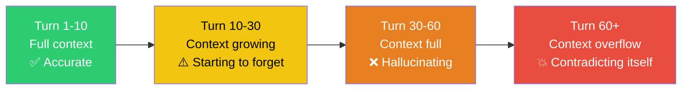
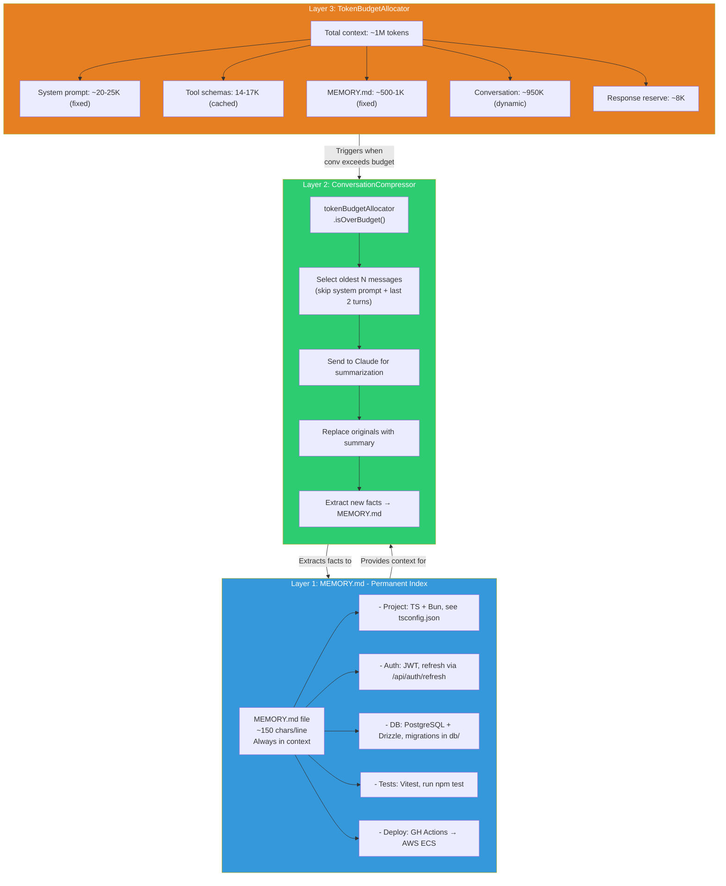
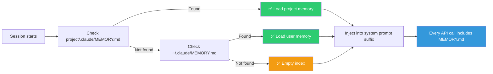
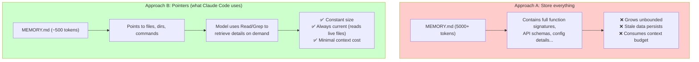
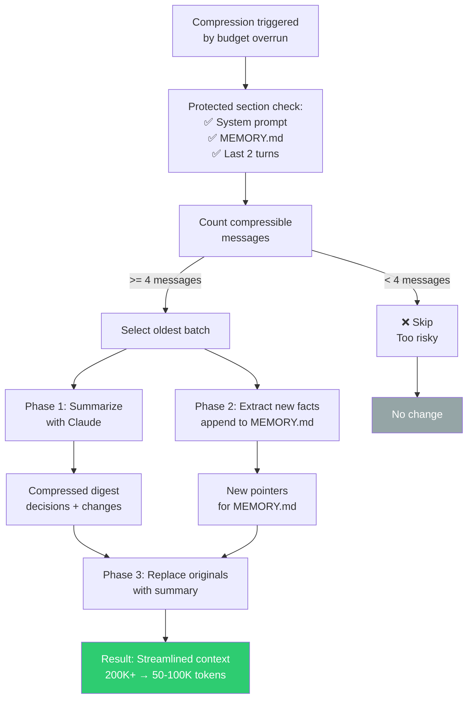
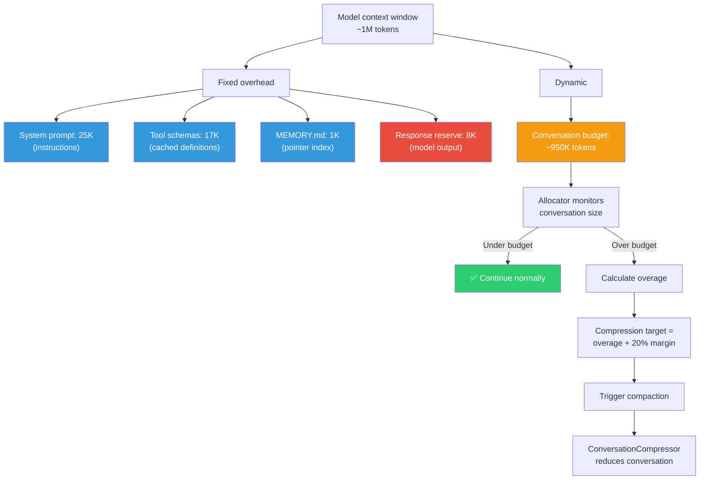
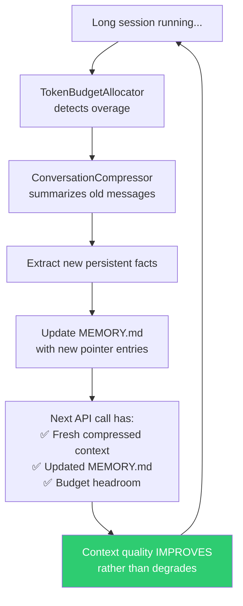

# Self-Healing Memory

The leaked source code reveals a three-layer memory architecture designed to prevent **context entropy**, the gradual degradation of context quality in long-running AI sessions that leads to hallucination and self-contradiction.

## The Problem

In long coding sessions, AI assistants face a fundamental challenge:



## Three-Layer Architecture



## Layer 1: MEMORY.md - Implementation Deep Dive

### File Location and Loading

MEMORY.md uses a cascading search pattern to find the most relevant index for the current session. The loader checks for a project-level memory file first (highest priority), falling back to user-level memory if no project-specific index exists. This allows users to maintain both global preferences and project-specific context.

Once loaded, the memory index is injected into the system prompt's suffix, the section appended at the tail of every API request. This ensures MEMORY.md stays in context across all turns, regardless of conversation length or compaction cycles. The suffix injection pattern means the model always sees the current pointer index before generating responses.



### Format Constraints

MEMORY.md enforces a strict format for token efficiency:

```markdown
# MEMORY.md
## Project
- TypeScript + Bun runtime, config in tsconfig.json and bunfig.toml
- React + Ink terminal UI
- Build: `bun run build`, outputs to dist/

## Architecture
- Core loop (conversation loop)

## Conventions
- Tests: Vitest, co-located as *.test.ts, run `bun test`
- Lint: ESLint + Prettier, run `bun run lint`
- Commits: conventional commits (feat:, fix:, chore:)

## Known Issues
- API timeout on large files > 10MB, use streaming read
- CI flaky on test/integration/auth.test.ts, retry usually fixes
```

**Target**: ~150 characters per line. Each line is a **pointer** (tells the model where to find details), not a **store** (doesn't contain the details themselves).

### Why Pointers Instead of Storage?



The pointer approach means MEMORY.md uses ~500-1000 tokens regardless of project size, while giving the model a map to navigate the entire codebase.

## Layer 2: ConversationCompressor - Implementation

### Compression Trigger

When the token budget allocator detects overage, the compression system enters a three-phase process. First, it identifies which messages can be safely summarized. The system **never** compresses the system prompt, MEMORY.md index, or the last 2 user-assistant turns. These form a protected tail that ensures the model always has recent context to understand ongoing work. If fewer than 4 compressible messages exist, compression is skipped (too risky to lose detail on small conversations).

The second phase summarizes the oldest batch of protected messages using Claude, generating a compact digest that preserves decision rationale, file changes, and key findings while discarding verbose tool outputs and superseded reasoning. Concurrently, the compressor extracts any new persistent facts from the conversation that should be added to MEMORY.md: discoveries about project structure, architecture, tools, or user preferences that future sessions need.

The third phase replaces the original messages with the compressed summary and the preserved tail, then returns the streamlined conversation. This single compaction cycle can reduce a 200K-token conversation to 50-100K tokens while preserving coherence.




### Summarization Call

The compressor makes a focused API call to Claude asking it to produce a concise summary. The system prompt is carefully tuned to preserve what matters: key decisions and their reasoning, specific file modifications, blockers discovered, and user constraints. It explicitly discards noise: verbose tool outputs (file contents remain on disk), failed searches with no results, and intermediate reasoning that was superseded by later findings. This filtering keeps the summary dense and decision-focused rather than transcript-like.

The summarizer output is typically 500-1500 tokens for a 50-100K token conversation segment, a 50-100x compression ratio that maintains coherence because it's intelligently lossy.

### Fact Extraction

After generating the summary, a second API call runs in parallel to extract persistent facts. The compressor shows Claude the current MEMORY.md and the conversation, asking it to identify new patterns or discoveries that should be remembered across sessions. The facts must be formatted as short pointer lines (under 150 characters each) following the MEMORY.md convention, and the extractor deduplicates against existing entries to avoid redundant copies.

The extracted facts are appended to MEMORY.md, making them available to the next session without losing them during compaction. This creates a positive feedback loop: older sessions contribute their learned patterns to the persistent index, gradually improving the context quality for future conversations.


## Layer 3: TokenBudgetAllocator

The token budget allocator divides the model's context window (typically 1M tokens for Claude 3.5 Sonnet) into fixed and dynamic zones. The fixed zones hold system prompt instructions (~25K tokens), tool schema definitions (~17K tokens), and MEMORY.md index (~1K tokens). These are overhead that doesn't change per request.

The response reserve (8K tokens) is held back for the model's output. API errors occur if the model generates beyond its budget, so reserving this space prevents that failure mode. Everything else (approximately 950K tokens in the default allocation) forms the conversation history budget: the space available for the user's input history and the assistant's prior responses.

When the conversation history exceeds this budget, the allocator triggers compression. The compression target isn't just to get back under budget; it aims 20% below the limit to create breathing room for the next few turns. This prevents thrashing: if the allocator just barely squeezed under budget, the next turn might exceed it again, triggering another compaction immediately.



The 20% margin is crucial for stability. If the allocator compressed only to the limit, the next turn's automatic attachments (re-injected tools, agent listings, plan files) could immediately exceed budget again. By targeting 80% of the budget, the compressor ensures at least one full turn of breathing room before the next compaction trigger.


## Self-Healing Feedback Loop

The "self-healing" aspect comes from the interaction between all three layers:



Key insight: compression doesn't just remove old context. It **upgrades** it. Verbose conversation messages (thousands of tokens) become:
1. A compact summary (hundreds of tokens)
2. New MEMORY.md entries (tens of tokens per fact)

The model loses detail but gains **structure**: organized pointers instead of raw conversation logs.

## KAIROS autoDream Integration

In the unreleased [KAIROS daemon mode](../agents/kairos.md), the `autoDream` system extends self-healing memory from **passive** (triggered by budget pressure) to **active** (triggered during idle time):

| Dimension | Current Self-Healing | KAIROS autoDream |
|-----------|---------------------|-----------------|
| **Trigger** | Context budget exceeded | Idle time threshold |
| **Input** | Conversation messages | Daily log observations |
| **Process** | Summarize + extract facts | Merge + deduplicate + crystallize |
| **Output** | Compressed messages + MEMORY.md updates | Consolidated MEMORY.md entries |
| **Timing** | Reactive (when needed) | Proactive (during downtime) |
| **Cross-session** | No | Yes (persistent daemon) |
