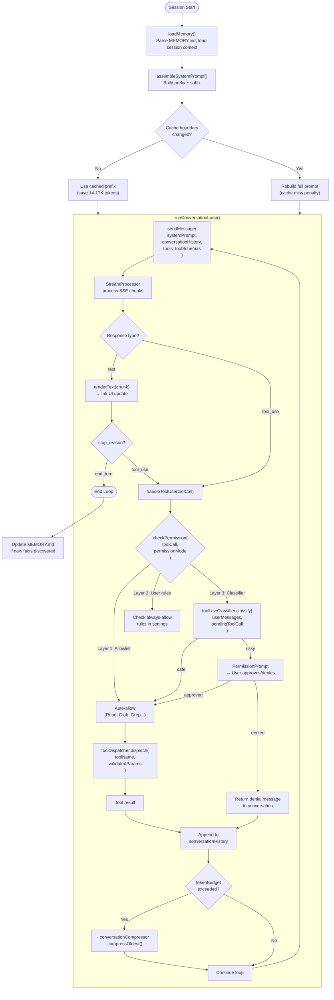
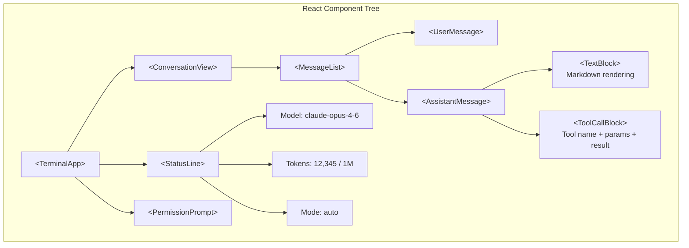
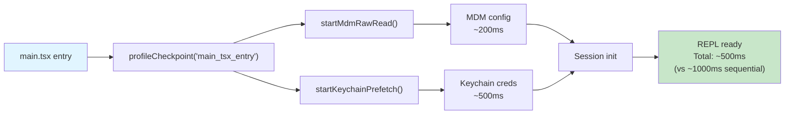
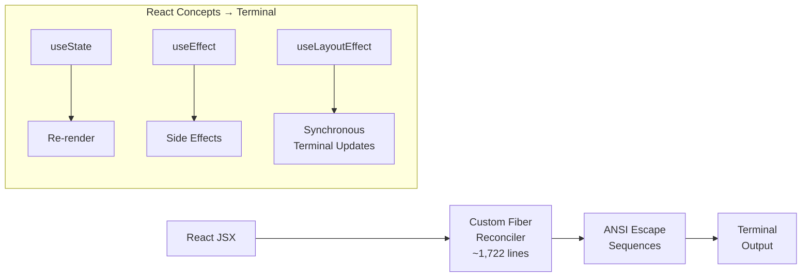
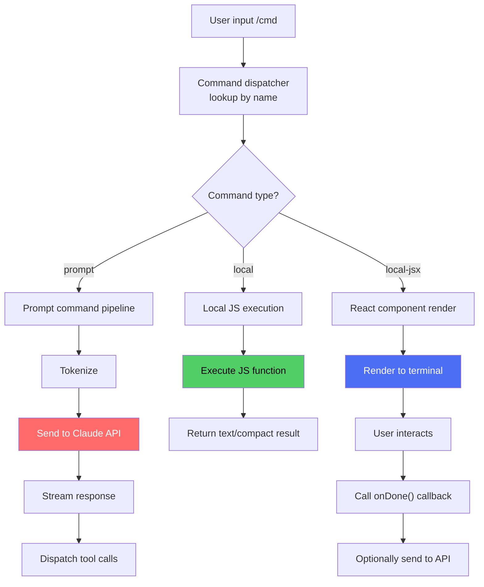

# Architecture Overview

Claude Code is a terminal-based AI coding assistant built with TypeScript, compiled and bundled with Bun, and rendered using React + Ink for terminal UI. This page provides a detailed analysis of the internal architecture as revealed by the leaked source code.

## High-Level Architecture


## Technology Stack

| Component | Technology | Why |
|-----------|-----------|-----|
| Language | TypeScript | Type safety for complex tool schemas and API contracts |
| Runtime | [Bun](https://bun.sh/) | Sub-second cold start, native Zig HTTP stack for client attestation |
| Terminal UI | React + [Ink](https://github.com/vadimdemedes/ink) | Declarative UI composition for complex terminal layouts |
| Bundler | Bun's built-in bundler | Single-file output, source maps (ironically, the cause of the leak) |
| Native layer | Zig | HTTP transport, cryptographic hash for client attestation DRM |
| Feature flags | [GrowthBook](https://www.growthbook.io/) | Remote A/B testing and killswitches without redeploy |
| Telemetry | OpenTelemetry | Distributed tracing for tool call latency and error tracking |
| State management | React hooks + Context | Session state, conversation history, UI state |

## Module Organization

The codebase is organized into approximately 1,900 TypeScript files across several major subsystems:

- **CLI & Session Management**: Entry point initialization, argument parsing, and session lifecycle
- **Core Engine**: Query processing loop, streaming response handling, message history, and token management
- **Prompt System**: System prompt assembly with 110+ instruction blocks and prompt cache management
- **Tools**: Tool registry, dispatcher, schema validation, and 15+ tool implementations (read, write, edit, bash, grep, etc.)
- **Agents**: Agent spawning, multi-worker orchestration, and KAIROS daemon for background scheduling
- **Security**: Permission checking, tool use classification, bash sandboxing, anti-distillation, and client attestation
- **Memory**: Memory management, MEMORY.md parsing, conversation compression, and token budgeting
- **Configuration**: Feature flags via GrowthBook, user settings management
- **UI**: React + Ink terminal components with hooks for conversation and permission state
- **Skills**: Skill registry with implementations for common workflows (commit, simplify, loop, etc.)
- **Telemetry**: OpenTelemetry integration for distributed tracing

## Core Data Flow: QueryEngine Deep Dive

The `QueryEngine` is the single most important module in the codebase. It implements the agentic conversation loop:



### Key Implementation Details

**Message Format**: The QueryEngine maintains a strictly typed message array:

```typescript
interface ConversationMessage {
  role: 'user' | 'assistant';
  content: ContentBlock[];  // TextBlock | ToolUseBlock | ToolResultBlock
}

// The conversation alternates: user → assistant → user → assistant...
// Tool results are sent as user messages with tool_result content blocks
```

**Streaming**: Responses are processed as Server-Sent Events (SSE). The `StreamProcessor` handles partial JSON for tool calls. A tool call's parameters can arrive across multiple SSE chunks and must be buffered until complete.

**Tool Call Batching**: The model can return multiple tool calls in a single response. The QueryEngine processes these according to dependency rules:
- Independent tool calls → dispatched in parallel via `Promise.all()`
- Dependent tool calls → dispatched sequentially

**Conversation Compression Trigger**: When `tokenBudgetAllocator.isOverBudget(conversationHistory)` returns true, the compressor:
1. Selects the oldest N messages (excluding the system prompt and last 2 turns)
2. Sends them to a summarization call (using the same Claude model)
3. Replaces the original messages with the compressed summary
4. Updates `MEMORY.md` if new persistent facts were extracted

## Anthropic API Integration

The API client uses a customized version of the Anthropic TypeScript SDK with several modifications:

```typescript
// Simplified representation of the API call
const response = await anthropicClient.messages.create({
  model: resolveModelId(selectedModel),  // Resolves codenames → API model IDs
  max_tokens: computeMaxTokens(budgetRemaining),
  system: assembledSystemPrompt,         // Array of system prompt blocks
  messages: conversationHistory,
  tools: registeredToolSchemas,          // 14-17K tokens of tool definitions
  stream: true,

  // Anti-distillation: injects fake tool signal
  ...(featureFlags.isEnabled('ANTI_DISTILLATION_CC') && {
    anti_distillation: ['fake_tools']
  }),

  // Prompt caching: marks the prefix boundary
  // Everything before this marker is cached
  ...(promptCacheConfig && {
    cache_control: { type: 'ephemeral' }
  }),
});
```

### Model Resolution

The `resolveModelId()` function maps internal codenames to API model IDs:

```typescript
function resolveModelId(codename: string): string {
  const modelMap = {
    'capybara':   'claude-sonnet-4-6',     // Sonnet v8, 1M context
    'fennec':     'claude-opus-4-5',        // Opus predecessor
    'numbat':     /* unreleased model ID */, // Gated
  };
  return modelMap[codename] ?? codename;
}
```

## React + Ink Terminal UI

The terminal UI is built with React and [Ink](https://github.com/vadimdemedes/ink), which renders React components to the terminal using ANSI escape codes.



### Rendering Pipeline

1. **Input**: User types in a text input component (Ink's `<TextInput>`)
2. **Streaming**: As SSE chunks arrive, the conversation state updates via React hooks
3. **Rendering**: Ink diffs the React tree and emits only the changed ANSI sequences
4. **Tool calls**: Displayed with collapsible detail views (tool name, parameters, result)
5. **Permission prompts**: Modal overlay that blocks until user responds

This architecture means Claude Code's UI is fully declarative. Adding a new UI element (like a progress bar or notification) is just adding a React component.

## Configuration Layers

Configuration flows through multiple layers with precedence:

```
CLI flags (highest priority)
    ↓
Environment variables (CLAUDE_CODE_*)
    ↓
Project settings (.claude/settings.json in repo)
    ↓
User settings (~/.claude/settings.json)
    ↓
GrowthBook remote flags (tengu_* prefix)
    ↓
Compiled defaults (lowest priority)
```

### GrowthBook Integration

The GrowthBook client evaluates feature flags at runtime:

```typescript
// GrowthBook initialization
const gb = new GrowthBook({
  apiHost: 'https://cdn.growthbook.io',
  clientKey: 'sdk-...', // Compiled into the binary
  // Feature definitions fetched from Anthropic's GrowthBook instance
});

// Feature flag evaluation
function isEnabled(flag: string): boolean {
  return gb.isOn(`tengu_${flag}`);
}

// Example usage
if (isEnabled('anti_distill_fake_tool_injection')) {
  injectFakeTools(systemPrompt);
}
```

All `tengu_`-prefixed flags are evaluated against remote configuration. Changes on Anthropic's GrowthBook dashboard take effect across all Claude Code installations **without pushing a new version**.

## Progressive Module Loading

Claude Code uses a fast-path optimization to minimize time-to-first-response (TTFR) for common operations. The main entry point (`src/main.tsx`) implements a three-tier loading strategy:

**Tier 1: Instant exit paths**: When users run `--version` or `--help`, the process exits immediately without loading any heavy modules. These checks happen before all imports, allowing Bun to skip the entire dependency tree for these quick operations.

**Tier 2: Feature-gated subsystems**: The codebase uses Bun's `feature()` bundle-time function to conditionally require modules based on compile-time feature flags. For example, the KAIROS assistant system (a long-running daemon for background task scheduling) is only loaded if the `feature('KAIROS')` flag is true. Similarly, coordinator mode for multi-worker orchestration only loads if `feature('COORDINATOR_MODE')` is enabled. This dead-code elimination happens at the bundler level, shrinking the final executable for builds without these features.

**Tier 3: Lazy initialization**: Even when modules are available, their initialization is deferred. Dependencies like MDM configuration (macOS Mobile Device Management) and keychain credentials are prefetched asynchronously in parallel during the import phase, rather than blocking on them synchronously during session startup.

This hierarchical approach ensures that the perceived startup time depends on the specific operation: version checks complete in milliseconds, help text displays within 50-100ms, and full interactive sessions initialize in 1-2 seconds as subsystems complete their parallel prefetch operations.


## Parallel Prefetching and Startup Profiling

Startup performance is optimized through aggressive parallelization of independent subsystems. Rather than waiting for each initialization phase sequentially, Claude Code launches multiple concurrent operations during the early import phase and monitors them with a startup profiler.

**Key prefetch operations** include MDM (Mobile Device Management) configuration for enterprise policy enforcement (~200ms), macOS Keychain credential retrieval for OAuth and API key management (~500ms), MCP server initialization for protocol support (~300ms), and GrowthBook feature flag fetching for remote A/B testing gates. These are launched asynchronously as soon as the entry point begins execution, before the user's first interaction.

**Startup profiler** measures each phase with `profileCheckpoint()` markers inserted at critical points:
- Entry point checkpoint
- First import completion
- Keychain prefetch launch
- MDM prefetch launch
- Session initialization start
- Query engine ready

The profiling data allows Claude Code to identify bottlenecks in real deployments and measure the impact of optimization changes. Total startup time approximates the slowest single operation (typically Keychain access on macOS), achieving a 2-3x improvement versus sequential initialization.



By launching these operations before waiting for any of them to complete, Claude Code eliminates idle time and ensures that users experience the fastest possible time-to-interaction.


## Terminal Rendering Deep Dive

The terminal UI uses a custom React Fiber reconciler (~1,722 lines) that targets ANSI escape codes instead of the DOM. This architecture enables declarative component composition and React-style state management in a terminal context:



### Raw Mode Synchronicity

A critical implementation detail: Terminal state changes use `useLayoutEffect()` (synchronous commit phase) instead of `useEffect()` (asynchronous scheduling). This synchronicity prevents terminal/React state mismatch, which is essential for signal handling (e.g., Ctrl+C interrupts) and prevents visual glitches when rapid state updates occur.

The reconciler's tight coupling to terminal I/O means that by the time a state update completes, the terminal display has already been synchronized. This is a departure from browser React, where the layout phase is decoupled from DOM mutations.

## Three Command Types

Claude Code's command system distinguishes between three execution models, each optimized for a different purpose. Commands are registered in `src/commands.ts` and implement a discriminated union type where the `type` field determines the runtime behavior.

**Prompt commands** (`type: 'prompt'`) represent user-written prompts or skills that should be sent to the Claude API. When invoked, these expand into the conversation history, are tokenized, and flow through the full message pipeline including tool dispatch, permission checking, and streaming response handling. Examples include `/refactor`, `/summarize`, and any skill that needs model reasoning. These commands include metadata like `progressMessage` (shown during inference), `contentLength` (for token estimation), and optionally allowed tool lists for security sandboxing.

**Local commands** (`type: 'local'`) execute as synchronous or async JavaScript functions with zero latency. They return either plain text output or a structured `CompactionResult` for complex operations like `/compact` (conversation compression). Examples include `/clear` (clears history), `/help` (prints usage), and `/version` (outputs version number). Local commands are handled entirely in-process and never contact the API, making them instant.

**Local JSX commands** (`type: 'local-jsx'`) render interactive React components using Ink's terminal renderer. When invoked, they return `Promise<React.ReactNode>`, which the main event loop renders to the terminal display. These commands are used for complex UI flows like settings dialogs (`/config`), permission approval screens, and IDE setup wizards. Local JSX commands can call `onDone()` to optionally trigger follow-up queries to the model after the dialog completes (e.g., "Apply these settings, then analyze the code").

All three command types are registered in a single `commands: Command[]` array, where `CommandBase` defines shared metadata (name, aliases, description, feature gates, availability requirements for auth types). The discriminated union ensures type safety: attempting to call a `handler` on a prompt command will fail at compile time because prompt commands don't have a handler property. They have `getPromptForCommand()` instead.

This three-type system means **only user prompts hit the API**. Slash commands and UI dialogs are handled entirely locally with zero latency. This design choice dramatically improves responsiveness for common operations like toggling settings or viewing status.




## State Management Architecture

Application state is managed through a hybrid approach combining Zustand-style store patterns with React Context:

- **AppState.tsx**: React Context provider with `useAppState(selector)` hook for component integration
- **AppStateStore.ts**: Central state shape definition and reducer logic

The state tree includes:

```typescript
interface AppState {
  settings: UserSettings;
  mainLoopModel: string;
  messages: Message[];
  tasks: TaskState[];
  toolPermissionContext: {
    rules: PermissionRule[];
    bypassMode: 'auto' | 'block' | 'ask';
    denialTracking: DenialTrackingState;
  };
  kairosEnabled: boolean;
  remoteConnectionStatus: Status;
  replBridgeEnabled: boolean;
  speculationState: Cache;
}
```

Key aspects:

- **Settings** persist to `~/.claude/settings.json` via a `useEffect()` observer
- **Messages** are streamed in from the QueryEngine and updated as tool calls complete
- **Permission context** tracks user approval rules and maintains a denial log for security auditing
- **Feature gates** (kairosEnabled, replBridgeEnabled) control which subsystems are active
- **Speculation state** caches model predictions for prefix matching in prompt caching

The selector pattern (`useAppState(state => state.messages)`) enables fine-grained subscriptions, ensuring components only re-render when their selected slice changes.

## Codebase Statistics

| Metric | Value |
|--------|-------|
| Total TypeScript files | ~1,900 |
| Lines of code | ~512,000 |
| Bundle size (cli.mjs) | ~8 MB |
| Source map size | 59.8 MB |
| Built-in tools | 23+ |
| Deferred/MCP tools | Dynamic |
| System prompt instruction blocks | 110+ |
| Feature flags | 44 (12 compile-time, 15+ runtime) |
| Subagent types | 5+ |
| Gated modules (not in public build) | 108 |
