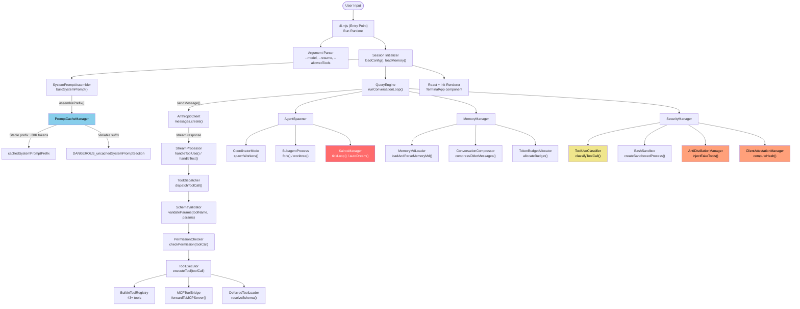
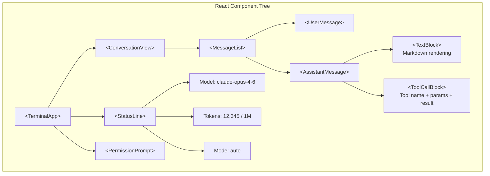
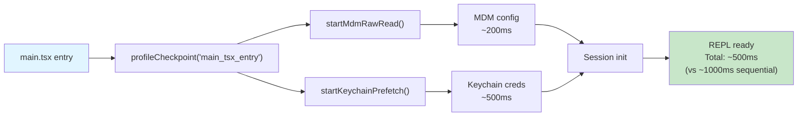
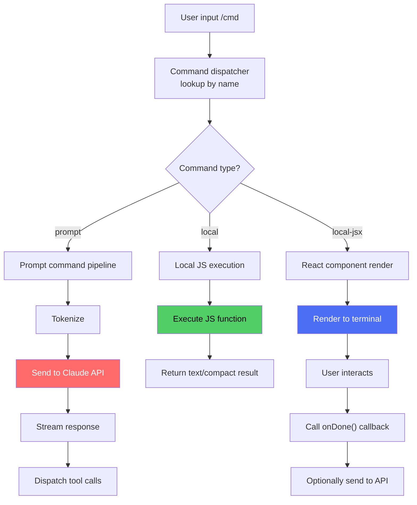

# Architecture Overview

Claude Code is a terminal-based AI coding assistant built with TypeScript, compiled and bundled with Bun, and rendered using React + Ink for terminal UI. This page provides a detailed analysis of the internal architecture as revealed by the leaked source code.

## High-Level Architecture



## Technology Stack

| Component | Technology | Why |
|-----------|-----------|-----|
| Language | TypeScript | Type safety for complex tool schemas and API contracts |
| Runtime | [Bun](https://bun.sh/) | Sub-second cold start, native Zig HTTP stack for client attestation |
| Terminal UI | React + [Ink](https://github.com/vadimdemedes/ink) | Declarative UI composition for complex terminal layouts |
| Bundler | Bun's built-in bundler | Single-file output, source maps (ironically, the cause of the leak) |
| Native layer | Zig | HTTP transport, cryptographic hash for client attestation DRM |
| Feature flags | [GrowthBook](https://www.growthbook.io/) | Remote A/B testing and killswitches without redeploy |
| Telemetry | OpenTelemetry | Distributed tracing for tool call latency and error tracking |
| State management | React hooks + Context | Session state, conversation history, UI state |

## Module Organization

The codebase is organized into approximately 1,900 TypeScript files across several major subsystems:

- **CLI & Session Management**: Entry point initialization, argument parsing, and session lifecycle
- **Core Engine**: Query processing loop, streaming response handling, message history, and token management
- **Prompt System**: System prompt assembly with 110+ instruction blocks and prompt cache management
- **Tools**: Tool registry, dispatcher, schema validation, and 43+ tool implementations (read, write, edit, bash, grep, etc.)
- **Agents**: Agent spawning, multi-worker orchestration, and KAIROS daemon for background scheduling
- **Security**: Permission checking, tool use classification, bash sandboxing, anti-distillation, and client attestation
- **Memory**: Memory management, MEMORY.md parsing, conversation compression, and token budgeting
- **Configuration**: Feature flags via GrowthBook, user settings management
- **UI**: React + Ink terminal components with hooks for conversation and permission state
- **Skills**: Skill registry with implementations for common workflows (commit, simplify, loop, etc.)
- **Telemetry**: OpenTelemetry integration for distributed tracing

## Core Data Flow: QueryEngine Deep Dive

The `QueryEngine` is the single most important module in the codebase. It implements the agentic conversation loop:


### Key Implementation Details

**Message Format**: The QueryEngine maintains a strictly typed message array where each message carries a role (user or assistant) and a list of content blocks. Content blocks are polymorphic and can represent text output, tool invocations, or tool results from previous steps. The conversation alternates strictly between user and assistant messages—tool results always come back as user messages with result content blocks, preserving the alternating pattern expected by the API.

**Streaming**: Responses arrive via Server-Sent Events (SSE), allowing real-time token streaming. The system handles partial JSON that may span multiple SSE chunks. Because tool call parameters can be split across chunk boundaries, they must be buffered until complete before validation and dispatch.

**Tool Call Batching**: The model can return multiple tool calls in a single response. The system dispatches these according to dependency analysis: independent tool calls run in parallel (via `Promise.all()`), while dependent calls run sequentially to respect causal ordering.

**Conversation Compression**: When the token budget is exceeded, the system compresses older message history to reclaim tokens. This involves selecting the oldest N messages (excluding the system prompt and recent context), sending them to a summarization pass with the same Claude model, and replacing the originals with the condensed summary. If new persistent facts are discovered during summarization, these are extracted and added to `MEMORY.md`.

## Anthropic API Integration

The API client sends requests to the Anthropic messages endpoint with the following key parameters:

| Parameter | Purpose |
|-----------|---------|
| `model` | Selected model, resolved from internal codename to API model ID (e.g., 'capybara' → 'claude-sonnet-4-6') |
| `max_tokens` | Dynamically computed from remaining token budget |
| `system` | Array of system prompt blocks assembled by the SystemPromptAssembler |
| `messages` | Conversation history with strict alternation between user and assistant roles |
| `tools` | Tool schema definitions (14-17K tokens) filtered by PermissionChecker based on access rules |
| `stream` | Enabled to allow real-time streaming of response tokens |
| `anti_distillation` | Optional signal injecting fake tools into the request when anti-distillation is enabled |
| `cache_control` | Marks the boundary for prompt caching, enabling the cached system prompt prefix |

### Model Resolution

Claude Code maps internal model codenames to actual API model IDs at runtime. This abstraction layer allows Anthropic to update model availability without requiring client-side binary updates. For example, the codename 'capybara' resolves to 'claude-sonnet-4-6', providing both human readability in logs and flexibility for testing unreleased models. Unknown codenames are passed through directly, allowing forward compatibility with new models.

## React + Ink Terminal UI

The terminal UI is built with React and [Ink](https://github.com/vadimdemedes/ink), which renders React components to the terminal using ANSI escape codes.



### Rendering Pipeline

1. **Input**: User types in a text input component (Ink's `<TextInput>`)
2. **Streaming**: As SSE chunks arrive, the conversation state updates via React hooks
3. **Rendering**: Ink diffs the React tree and emits only the changed ANSI sequences
4. **Tool calls**: Displayed with collapsible detail views (tool name, parameters, result)
5. **Permission prompts**: Modal overlay that blocks until user responds

This architecture means Claude Code's UI is fully declarative. Adding a new UI element (like a progress bar or notification) is just adding a React component.

## Configuration Layers

Configuration flows through multiple layers with precedence:

```
CLI flags (highest priority)
    ↓
Environment variables (CLAUDE_CODE_*)
    ↓
Project settings (.claude/settings.json in repo)
    ↓
User settings (~/.claude/settings.json)
    ↓
GrowthBook remote flags (tengu_* prefix)
    ↓
Compiled defaults (lowest priority)
```

### GrowthBook Integration

GrowthBook enables remote feature flag management, allowing Anthropic to control feature activation across all Claude Code installations without requiring deployments. The client fetches feature flag definitions from Anthropic's GrowthBook instance at startup and evaluates them at runtime.

All feature flags use the `tengu_` prefix and are evaluated against the remote configuration. For example, the `anti_distill_fake_tool_injection` flag controls whether fake tool schemas are injected into system prompts to defend against distillation attacks. Changes to any `tengu_`-prefixed flag propagate immediately to all active Claude Code sessions, enabling rapid experimentation and emergency killswitches without pushing new binaries.

## Progressive Module Loading

Claude Code optimizes startup time through a three-tier loading strategy, recognizing that different use cases demand different initialization profiles. Users running `--version` or `--help` should see results in milliseconds, while full interactive sessions can afford slightly more setup time to load necessary subsystems.

**Tier 1: Instant exit paths** handle quick operations like version and help displays. These checks occur before importing the bulk of the codebase, allowing Bun's dead-code elimination to skip entire dependency trees for these use cases. The result: version checks in under 100ms.

**Tier 2: Feature-gated subsystems** use Bun's compile-time feature flags to conditionally include modules. For example, KAIROS (a daemon for background scheduling) and coordinator mode (multi-worker orchestration) are only bundled if explicitly enabled. This design reflects the insight that many users never invoke these features—why include them? Removing dead code shrinks the binary and reduces initialization overhead.

**Tier 3: Lazy and parallel initialization** defers non-critical dependencies. MDM configuration, keychain credential retrieval, and MCP server setup run asynchronously in parallel rather than sequentially blocking startup. By the time the session initialization completes, these prefetch operations typically finish in the background.

Combined, this strategy ensures fast perceived responsiveness: version checks in milliseconds, help in 50-100ms, and full interactive sessions in 1-2 seconds as parallel subsystems settle. For CLI tools where every 100ms of startup time is felt by users, this architecture is critical to perceived quality.


## Parallel Prefetching and Startup Profiling

Startup performance is optimized through aggressive parallelization of independent subsystems. Rather than waiting for each initialization phase sequentially, Claude Code launches multiple concurrent operations during the early import phase and monitors them with a startup profiler.

**Key prefetch operations** include MDM (Mobile Device Management) configuration for enterprise policy enforcement (~200ms), macOS Keychain credential retrieval for OAuth and API key management (~500ms), MCP server initialization for protocol support (~300ms), and GrowthBook feature flag fetching for remote A/B testing gates. These are launched asynchronously as soon as the entry point begins execution, before the user's first interaction.

**Startup profiler** measures each phase with `profileCheckpoint()` markers inserted at critical points:
- Entry point checkpoint
- First import completion
- Keychain prefetch launch
- MDM prefetch launch
- Session initialization start
- Query engine ready

The profiling data allows Claude Code to identify bottlenecks in real deployments and measure the impact of optimization changes. Total startup time approximates the slowest single operation (typically Keychain access on macOS), achieving a 2-3x improvement versus sequential initialization.



By launching these operations before waiting for any of them to complete, Claude Code eliminates idle time and ensures that users experience the fastest possible time-to-interaction.


## Terminal Rendering Deep Dive

The terminal UI is rendered through a custom React Fiber reconciler (approximately 1,722 lines) that translates React components directly to ANSI escape sequences instead of DOM nodes. This architecture preserves React's declarative component model and state management patterns in a terminal context—developers write familiar React hooks and JSX, and the reconciler handles the translation to terminal output.

The key design choice that makes this work in a terminal environment is **synchronous state commitment**. Unlike browser React, which schedules layout updates asynchronously, terminal state changes use synchronous commit mechanics. This prevents terminal and React state from drifting out of sync, which is critical when responding to terminal signals like Ctrl+C interrupts or handling rapid sequential updates. By the time a state update completes, the terminal display has already been redrawn—there is no window where stale output could confuse the user.

## Three Command Types

Claude Code distinguishes three execution models for commands, each optimized for different latency and capability requirements:

**Prompt commands** represent user prompts and skills that require model reasoning. When invoked, they flow through the complete pipeline: tokenization, system prompt assembly, tool dispatch, permission checking, and streaming response handling. Examples include `/refactor`, `/summarize`, and any skill that benefits from Claude's analysis. These reach the API and may take seconds depending on request complexity.

**Local commands** execute as simple JavaScript functions with zero API latency. They include operations like `/clear` (wipe history), `/help` (show usage), and `/version` (report version). Some local commands return structured results (e.g., `/compact` for conversation compression), while others produce plain text. Because they never contact the API, they complete instantly—typically under 10ms.

**Local JSX commands** render interactive terminal UI using React and Ink. When invoked, they present modal dialogs or configuration screens (e.g., `/config` for settings, permission approval flows, IDE setup wizards). Users interact with the UI, and the command can optionally trigger a follow-up prompt command after completion—for example, "User configured settings, now analyze the codebase with these settings applied."

The key architectural insight is that **only user prompts incur API latency**. Slash commands and UI dialogs are handled locally. This design dramatically improves perceived responsiveness—toggling a setting is instant, not a 2-second round trip to the API. The system registers all three types in a unified command registry with shared metadata (name, aliases, description, feature gates), using type discriminators to ensure that command handlers call the appropriate execution path.




## State Management Architecture

Application state combines React Context with a centralized store pattern. The AppState context provider exposes a `useAppState(selector)` hook, allowing components to subscribe to specific slices of application state rather than the entire tree. This selector-based subscription model ensures components only re-render when their subscribed slice changes, preventing unnecessary re-renders and keeping the UI responsive.

The state tree encompasses:

| Slice | Purpose |
|-------|---------|
| **settings** | User preferences (loaded from `~/.claude/settings.json`) with persistence via effect observers |
| **mainLoopModel** | Currently selected model for the conversation loop |
| **messages** | Conversation history, streamed from QueryEngine and updated as tool calls complete |
| **tasks** | Active task queue for tracking background operations |
| **toolPermissionContext** | Approval rules, bypass mode, and denial log for security auditing |
| **kairosEnabled / replBridgeEnabled** | Feature gates controlling active subsystems |
| **speculationState** | Cache of model predictions used for prompt cache prefix matching |

This architecture separates concerns: the Context handles React integration (subscriptions and re-renders), while the store manages state logic. The selector pattern (`useAppState(state => state.messages)`) is critical to performance—without it, every state change would force a full re-render of all connected components.

## Codebase Statistics

| Metric | Value |
|--------|-------|
| Total TypeScript files | ~1,900 |
| Lines of code | ~512,000 |
| Bundle size (cli.mjs) | ~8 MB |
| Source map size | 59.8 MB |
| Built-in tools | 43+ |
| Deferred/MCP tools | Dynamic |
| System prompt instruction blocks | 110+ |
| Feature flags | 44 (12 compile-time, 15+ runtime) |
| Subagent types | 5+ |
| Gated modules (not in public build) | 108 |
