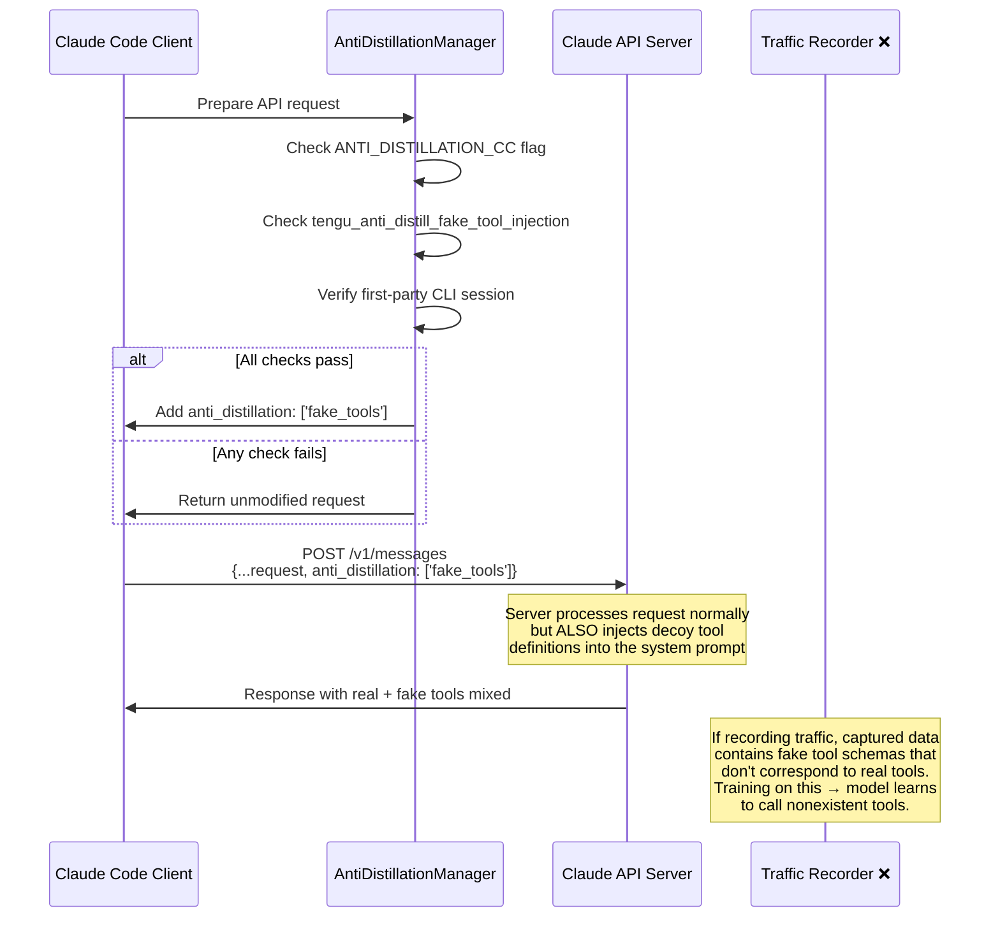
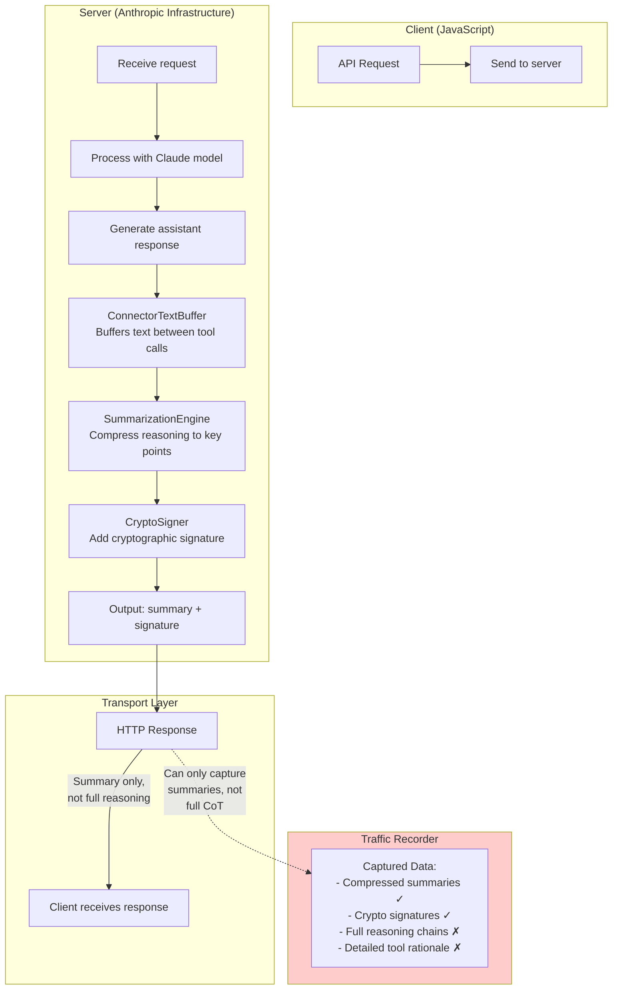
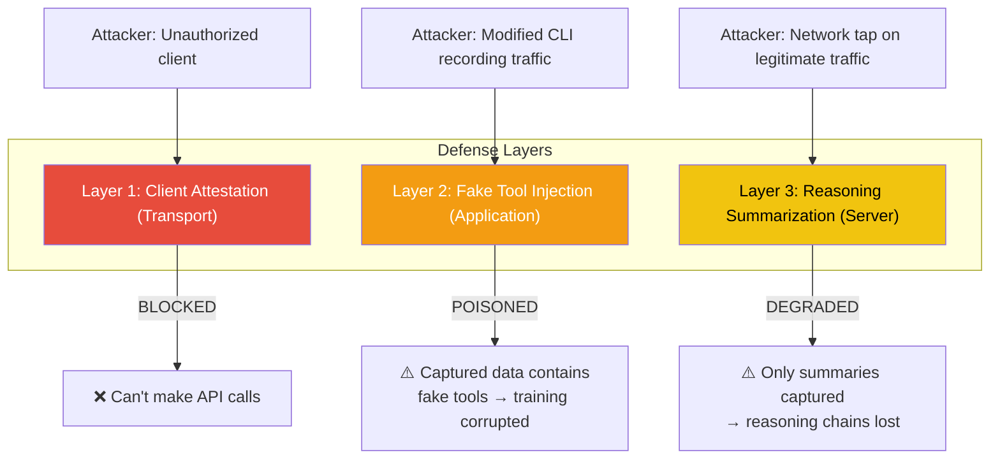

# Anti-Distillation Mechanisms

One of the most surprising discoveries in the leaked source code is a multi-layered system designed to prevent competitors from distilling Claude Code's capabilities by recording and replaying API traffic. The implementation spans both client-side and server-side components.

## Overview

Claude Code employs three distinct anti-distillation mechanisms:

1. **Fake Tool Injection**: Client-side poisons training data with decoy tool definitions
2. **Reasoning Summarization**: Server-side prevents capture of full reasoning chains
3. **Client Attestation**: Transport-level blocks unauthorized API access entirely (see [separate page](./client-attestation.md))

## 1. Fake Tool Injection

### Client-Side Signal Only

The **client-side portion** of fake tool injection is limited to setting a request parameter. The actual injection of fake tools into the response happens entirely **server-side** at Anthropic's infrastructure. The Claude Code client contains no logic to generate, create, or inject fake tool definitions.

### Implementation Detail

The anti-distillation mechanism uses a multi-gate authorization system. The fake tool injection works through three independent gates that must all be satisfied: a compile-time flag ensures the feature is completely absent from third-party builds (dead code elimination), a runtime GrowthBook flag provides an emergency killswitch Anthropic can trigger remotely, and a first-party session check verifies the request comes from a genuine Claude Code binary.

When enabled, the fake tool injection mechanism signals the server to include deceptive tool definitions in the response. This approach ensures that the feature only activates under all three conditions simultaneously, making it impossible to bypass through simple runtime patching.

**Key point:** No fake tool definitions exist in the client source code. The client only sends a parameter to notify the server. The server decides whether to inject fake tools into the response when it receives this signal.

### Request/Response Flow



### Why Fake Tools Work

The fake tool injection is a poisoning defense: fake tools are inserted into responses to ruin any training data captured by traffic recording. A model trained on recorded traffic would learn to call these nonexistent tools, producing broken tool calls in production. This is **a canary trap for API theft** — the cost to inject fake tools is negligible at inference time, but the value they destroy in stolen training data is enormous.

### Two-Gate Authorization

The mechanism requires both gates to be open:

| Gate | Type | Controlled By |
|------|------|---------------|
| `ANTI_DISTILLATION_CC` | Compile-time flag | Set during build; cannot be changed at runtime |
| `tengu_anti_distill_fake_tool_injection` | GrowthBook runtime flag | Remotely toggled by Anthropic |

This design serves two purposes:
1. **Compile-time gate**: Ensures the feature is completely absent from third-party builds (dead code elimination)
2. **Runtime gate**: Allows Anthropic to disable the feature remotely as an emergency killswitch without pushing a new build

### First-Party Session Detection

The `isFirstPartyCLISession()` check verifies the request originates from an official Claude Code binary, not a third-party integration. This involves the [client attestation](./client-attestation.md) system. The Zig-computed HTTP hash confirms the binary is genuine.

## 2. Reasoning Summarization

### Server-Side Only

Reasoning summarization is **implemented entirely on Anthropic's servers**. The Claude Code client contains no summarization logic or code. The client's only involvement is setting a request parameter (`anti_distillation: ['fake_tools']` or similar) to signal the server that anti-distillation protections should be applied. The server then applies summarization to the assistant's reasoning chains before returning the response to the client.

### Design Philosophy

The reasoning summarization mechanism destroys the most valuable training signal: the detailed thought process behind tool selection and code analysis. By summarizing connector text between tool calls to essential points only, this defense reduces distillation value at zero inference cost. A model trained on only summaries loses the nuanced reasoning that makes Claude Code effective.

### Processing Pipeline



### What Gets Summarized

The **connector text** (the assistant's reasoning between consecutive tool calls) is the primary target:

```
[Tool Call 1: Read file.ts]
→ Connector text: "I can see the function has a bug on line 42 where
   the condition check is inverted. The variable `isValid` should be
   checked for truthiness, not falsiness. Let me also check if there
   are any tests that cover this case..."
[Tool Call 2: Grep for test files]
```

After summarization:

```
[Tool Call 1: Read file.ts]
→ Summary: "Found bug on line 42. Checking tests."
→ Signature: 0xa3f7...
[Tool Call 2: Grep for test files]
```

The **detailed reasoning** (which contains the model's understanding of the code, its debugging strategy, and its decision-making process) is the most valuable training signal. By summarizing it, this signal is destroyed for any traffic recorder.

### Cryptographic Signatures

Each summary is signed with a cryptographic signature that:

1. **Proves the summary was generated by Anthropic's server** (not tampered with)
2. **Enables detection** if a third party modifies the summaries
3. **Provides an audit trail** for Anthropic to verify the integrity of captured data

## 3. Combined Defense Matrix



| Attack Vector | Defense Layer | Result |
|---------------|-------------|--------|
| Unauthorized API client | Client Attestation | Blocked entirely |
| Modified CLI with traffic recording | Fake Tool Injection | Training data poisoned |
| Network-level traffic capture | Reasoning Summarization | Only summaries available |
| Man-in-the-middle proxy | All three layers | Blocked, poisoned, degraded |
| Record official CLI traffic | Fake Tools + Summarization | Poisoned, degraded |

## GrowthBook Configuration

The anti-distillation system is integrated with GrowthBook, a feature management platform that allows Anthropic to remotely control the behavior without pushing client updates. The feature flag `tengu_anti_distill_fake_tool_injection` can be configured with conditional rules based on client version, deployment environment, or user cohorts. By default, the flag is disabled, but Anthropic can enable it selectively. For example, only for client versions >= 2.1.0 to ensure baseline capability before activating the defense.

This architecture provides Anthropic with fine-grained control over fake tool injection: the team can enable or disable the feature globally across all installations in seconds, target specific client versions to manage rollout risks, conduct A/B testing to measure the impact on user experience and system performance, and trigger an emergency disable if the mechanism causes unexpected side effects or performance degradation. The separation of compile-time and runtime gates means that even if a runtime flag is compromised, the feature remains completely absent from non-first-party builds.
