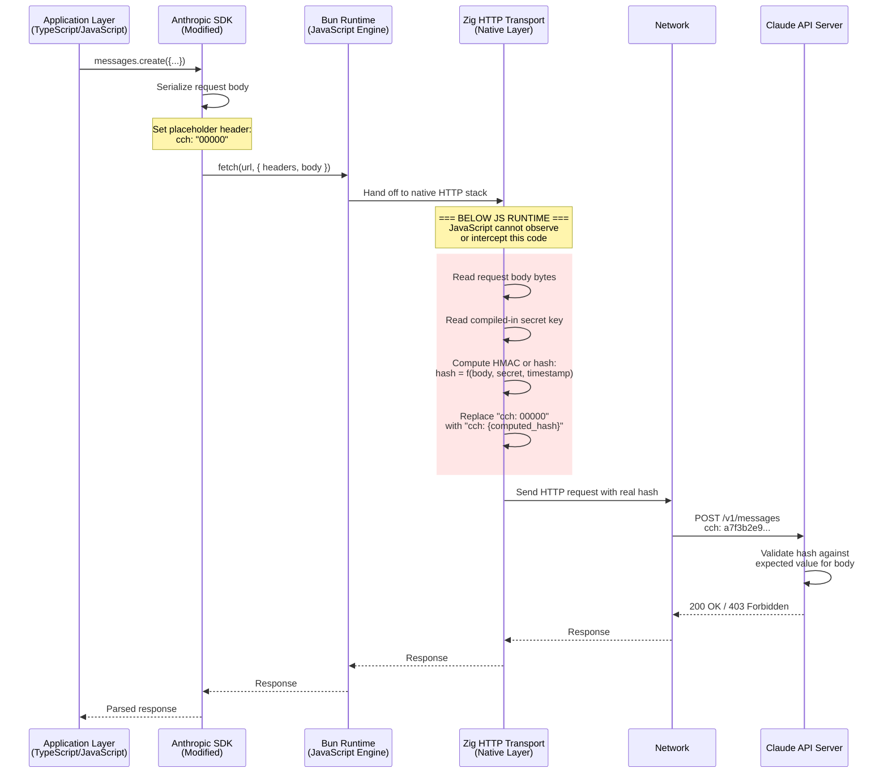
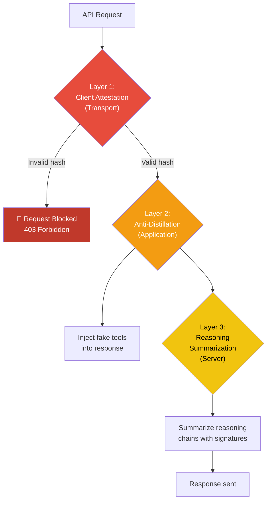

# Client Attestation (DRM)

The leaked source code reveals a cryptographic client attestation mechanism: effectively **DRM for API calls** that ensures requests come from a genuine Claude Code binary rather than a spoofed or modified client. The implementation leverages Bun's unique architecture to place the hash computation **below the JavaScript runtime**.

## Implementation Architecture



## The Key Insight: Zig Below JavaScript

Bun's architecture is unique among JavaScript runtimes:

```
┌─────────────────────────────────────────┐
│  JavaScript/TypeScript Application Code │  ← Can be inspected, patched, debugged
│─────────────────────────────────────────│
│  Bun JavaScript Engine (Zig)            │  ← Compiled native code
│─────────────────────────────────────────│
│  Bun HTTP Client (Zig)                  │  ← Hash computation happens HERE
│  - TLS implementation                   │
│  - HTTP/2 multiplexing                  │
│  - Request serialization                │
│  - ** Client attestation hash **        │
│─────────────────────────────────────────│
│  Operating System (syscalls)            │
└─────────────────────────────────────────┘
```

The critical insight: **JavaScript monkey-patching cannot reach the Zig layer**. Common bypass techniques fail:

| Bypass Attempt | Why It Fails |
|---------------|-------------|
| Override `fetch()` in JS | Hash computed after fetch hands off to Zig |
| Proxy the HTTP request | Hash is computed on the raw body bytes in Zig, before TLS |
| Patch the Anthropic SDK | SDK only sets placeholder; real hash added by Zig |
| Use a JS debugger | Debugger can't step into compiled Zig code |
| Replace the `fetch` implementation | Bun's `fetch` is native Zig, not a JS polyfill |
| `Proxy` wrapper on globalThis.fetch | Same: the Zig transport is called internally |

The **only** way to bypass the attestation is to **recompile the Zig code** in Bun. This requires:
1. The Bun source code
2. The compiled-in secret key (which is not in the JavaScript source)
3. A Zig toolchain
4. Understanding of the hash algorithm

## Technical Details

### Placeholder Mechanism

The JavaScript-side implementation of client attestation is deliberately minimal: it only sets a static placeholder value (`00000`) in the `cch` header before the request is handed off to Bun's native HTTP transport. This placeholder is never the actual attestation hash. The real computation happens below the JavaScript runtime in the Zig layer and cannot be observed or modified from JavaScript.

The specific placeholder value (`00000`) is part of the compiled binary layer and does not correspond to a real attestation token. The actual hash computation (derived from request body, compiled-in secret key, and timestamp) happens entirely in Zig and replaces this placeholder before the request leaves the client.

The JS-side code includes three independent gates that short-circuit before setting the placeholder. First, a compile-time flag (`COMPILE_FLAGS.NATIVE_CLIENT_ATTESTATION`) ensures attestation logic is completely absent from non-first-party builds. Second, a development override via the `CLAUDE_CODE_ATTRIBUTION_HEADER` environment variable allows local testing and CI environments to opt out without recompiling. Third, a GrowthBook feature flag (`tengu_attribution_header`) provides a remote killswitch that allows Anthropic to disable attestation across all installations instantly if the mechanism causes issues. Only when all three gates permit the operation does the code set the placeholder. The actual hash replacement happens entirely in Zig, making it invisible and tamper-proof from the JavaScript perspective.

> 📁 Source reference: `src/utils/` - utility modules for request preparation and header management

### Zig-Side Hash Computation (Inferred)

The Zig HTTP transport layer operates entirely below the JavaScript runtime and performs the actual cryptographic attestation computation. When Bun's native HTTP stack prepares to send a request, it intercepts any `cch` header containing the placeholder value and replaces it with a computed cryptographic hash. The hash is derived from multiple inputs: the complete request body bytes, a compiled-in secret key that never appears in JavaScript memory, and a timestamp to prevent replay attacks.

The computation uses HMAC-SHA256 as the core cryptographic primitive, ensuring that only the genuine Claude Code binary (which has the correct secret key compiled into its Zig layer) can produce valid attestation hashes. The final hash is truncated to the first 16 bytes and formatted as hexadecimal before replacing the placeholder. This occurs after the JavaScript SDK hands off the request but before it reaches the network layer, ensuring that the actual hash computation is completely hidden from JavaScript debuggers, proxies, and instrumentation tools. The timestamp inclusion further protects against replay attacks where an attacker could capture a valid hash and reuse it for a different request.

> 📁 Source reference: `src/native-ts/` - native module bindings for the Zig HTTP layer and cryptographic operations

### Server-Side Validation

The API server validates the hash by:

1. Extracting the `cch` header from the incoming request
2. Recomputing the expected hash using the same algorithm and key
3. Comparing the provided hash with the expected hash
4. Rejecting the request with 403 if they don't match

Since both client and server know the secret key (compiled into the binary and stored on the server), only a genuine binary can produce a valid hash.

## Bypass Mechanisms

Two intentional bypasses exist for development and emergencies:

### 1. Environment Variable

```bash
export CLAUDE_CODE_ATTRIBUTION_HEADER=disabled
```

When set, the JS-side code doesn't set the placeholder header at all, so the Zig layer has nothing to replace. The request goes through without attestation.

**Use case**: Local development, testing, CI environments.

### 2. GrowthBook Killswitch

```json
{
  "tengu_attribution_header": {
    "defaultValue": true,
    "rules": [{
      "condition": { "emergency": true },
      "force": false
    }]
  }
}
```

Anthropic can remotely disable attestation across all installations by flipping this flag. The JS-side check short-circuits before setting the placeholder.

**Use case**: If the attestation mechanism causes widespread issues (e.g., hash algorithm bug, clock skew problems).

## Security Analysis

### Strengths

| Strength | Detail |
|----------|--------|
| **Below JS runtime** | Cannot be observed or patched from JavaScript |
| **Compiled secret** | Key is embedded in Zig binary, not in JS source |
| **Request-specific** | Hash is computed on actual request body, preventing replay |
| **Timestamp-bound** | Likely includes timestamp to prevent replay attacks |
| **No JS-visible hash** | The actual hash never appears in JavaScript memory |

### Weaknesses (Theoretical)

| Weakness | Detail |
|----------|--------|
| **Binary reverse engineering** | The Zig binary could theoretically be reverse-engineered |
| **Key extraction** | Memory dumps could potentially extract the compiled-in key |
| **Env var bypass** | The `CLAUDE_CODE_ATTRIBUTION_HEADER` env var is a known escape hatch |
| **Man-in-the-middle after TLS** | If TLS is broken/intercepted, the hash is visible |

## Relationship to Defense-in-Depth

Client attestation is the **transport-level** defense. It complements the application-level defenses:



Each layer provides independent protection:
1. **Client attestation**: Blocks unauthorized clients entirely
2. **Fake tools**: Poisons any data that slips through (e.g., legitimate but recorded traffic)
3. **Reasoning summarization**: Degrades the value of any captured data
