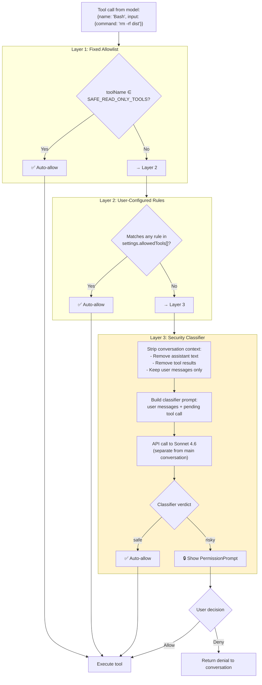
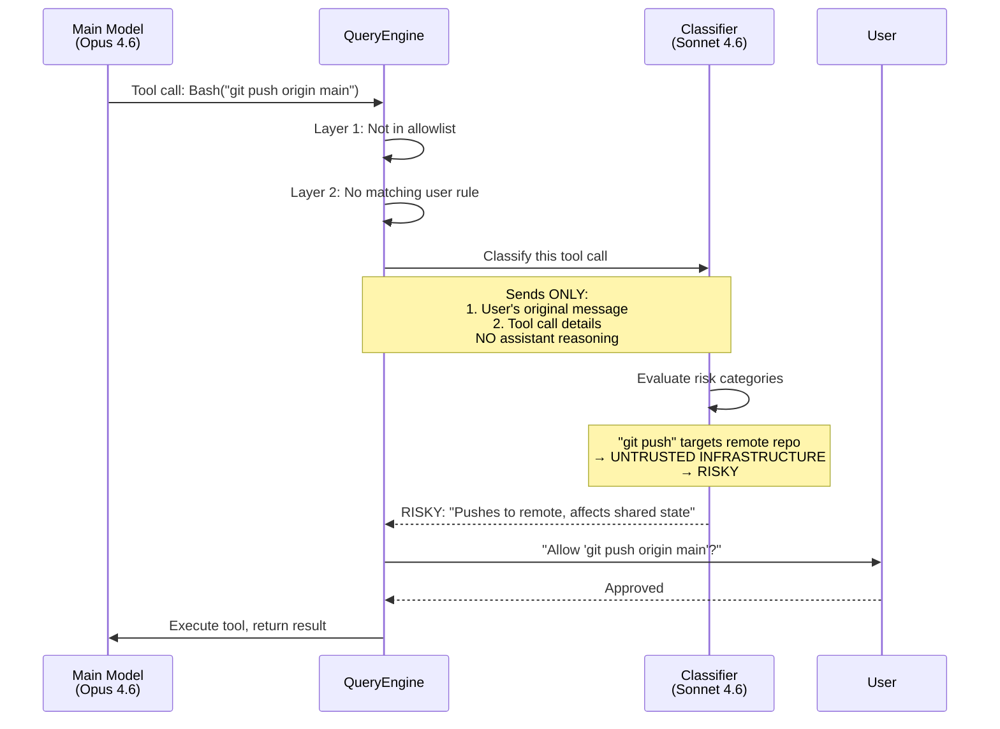
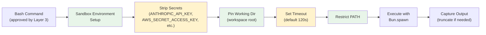

# Permission Model

Claude Code implements a **three-layer security architecture** that evaluates every tool call before execution using a defense-in-depth approach. Even if one layer has a vulnerability, the others still protect against unauthorized actions. The most sophisticated component is a secondary Claude model (Sonnet 4.6) acting as an independent security classifier.

> **Note:** The three-layer model below describes the **Bash tool permission flow**. Other tools (Read, Write, Edit, etc.) have different permission models. See their respective tool documentation for details. Bash has the most complex permission system because it can execute arbitrary shell commands.

## Architecture



## Layer 1: Fixed Allowlist

**Layer 1** is the fastest check: a hardcoded set of **read-only tools** that are unconditionally allowed because they can never modify the system state. These tools are defined in the permission system and checked first before any other logic runs.

The safe allowlist includes tools like **Read** (file inspection), **Glob** (file globbing), **Grep** (text search), and other information-gathering operations. Because these tools have no destructive capability (they only inspect, read, or search), they skip all other permission layers.

When a tool call arrives, the system checks if the tool name is in this allowlist. If it matches, the request is immediately approved. If not, the request passes to **Layer 2** for user-configured rules.

## Layer 2: User-Configured Rules

**Layer 2** lets users define patterns for tools they trust without security review. Users configure these rules in `~/.claude/settings.json`, `.claude/settings.json`, or project-level `.claude/settings.json`, allowing automation for repetitive workflows.

Rules can target three types of operations:

- **Entire tool**: allow `Bash` unconditionally (unsafe; use sparingly)
- **Command prefix**: allow `Bash` only when the command starts with `npm test` or `git status`
- **Path pattern**: allow `Write` or `Edit` only for files matching specific glob patterns like `test/**` or `**/*.test.ts`

The system iterates through the user's configured rules, checking if the current tool call matches. A rule matches if:
1. The tool name matches AND
2. For command-based rules: the command starts with the allowed prefix, OR
3. For path-based rules: the file path matches the glob pattern

If a match is found, the tool is allowed. If no rule matches, the request passes to **Layer 3** (the AI classifier).

This layer gives users fine-grained control without hardcoding permissions globally. It's applied before the AI classifier, so rules take precedence over AI judgments.

## Layer 3: Security Classifier

### The Classifier Model

The classifier is a **separate API call** to Claude Sonnet 4.6, independent of the main conversation. It has its own system prompt and sees a deliberately stripped-down view of the conversation.

The classifier operates as follows:

1. **Extract User Messages**: The system scans the entire conversation history and extracts only messages with `role === 'user'`. Assistant messages, tool results, and metadata are discarded.

2. **Strip Tool Results**: From each user message, only text content blocks are kept. Tool result blocks (which also appear in user messages but are metadata) are filtered out. This ensures the classifier sees only what the user explicitly wrote.

3. **Build Classifier Prompt**: The stripped user messages are combined with the pending tool call (the action being evaluated) to form a concise prompt. This stripped prompt is much smaller than the full conversation, reducing context window usage and improving classifier focus.

4. **Call Classifier API**: The stripped prompt and tool call are sent to Claude Sonnet 4.6 in a **separate API call** with its own system prompt. This classifier model runs independently from the main agent conversation.

5. **Parse Response**: The classifier returns a verdict: `SAFE` (allow) or `RISKY` (require user confirmation). The response includes a brief justification explaining the risk assessment.

This separation is critical: by giving the classifier a clean view of only the user's intent and the proposed action, without the main model's reasoning or context manipulation, you prevent the main model from "arguing" the classifier into unsafe approvals.

### Why Strip Context?

The stripping is the key security insight:

| What the classifier sees | What's removed | Why |
|-------------------------|----------------|-----|
| User messages (what was asked) | Assistant text | Prevents the main model from "arguing" the classifier into approving |
| Pending tool call (what's about to happen) | Previous tool results | Prevents context manipulation via earlier tool outputs |
| Tool parameters | Conversation history detail | Keeps classifier focused on the specific action |

By only seeing **what the user asked for** and **what the tool intends to do**, the classifier evaluates the action purely on its merits, not influenced by the main model's reasoning or persuasion.

### Risk Categories

The classifier evaluates tool calls against several risk categories. The security classifier checks for:

- **SCOPE ESCALATION**: Does the tool call exceed what the user actually requested? (e.g., user asks to fix a bug but the model tries to refactor the entire codebase)
- **UNTRUSTED INFRASTRUCTURE**: Does the tool call target external or shared systems? (e.g., pushing to remote repository, making HTTP requests to external APIs, modifying CI/CD)
- **OTHER RISKS**: General safety concerns like destructive commands (rm -rf, DROP TABLE), exposing secrets (.env files, API keys), or modifying system configuration

The classifier returns a verdict: `SAFE` (allow) or `RISKY` (require user confirmation).

### Classifier Decision Flow



The classifier implementation integrates with all three permission layers, making the final determination when both the allowlist and user rules don't provide a clear answer.

## Remote Configuration via GrowthBook

The classifier behavior can be tuned remotely:

```typescript
// Feature flags affecting the classifier
{
  // Classifier sensitivity threshold
  "tengu_security_classifier_sensitivity": "medium",  // low | medium | high

  // Whether to classify at all (emergency killswitch)
  "tengu_security_classifier_enabled": true,

  // Additional risk categories (extensible)
  "tengu_security_classifier_extra_risks": [],

  // Override: force-ask for specific tool patterns
  "tengu_security_classifier_force_ask": [
    "Bash:git push*",
    "Bash:rm -rf*"
  ]
}
```

This remote control means Anthropic can:
- **Increase sensitivity** if a new attack vector is discovered
- **Disable the classifier** in an emergency (all tool calls go to user prompt)
- **Add new risk categories** without pushing a new build
- **Force-ask patterns** for known-dangerous commands

### Classifier Availability

The security classifier is **only active in first-party Anthropic builds**. In non-Anthropic builds (third-party integrations, custom deployments), the classifier returns `{ matches: false }` without performing any classification. This means:

- Layer 3 effectively becomes a no-op in third-party builds
- Permission decisions default to Layer 1 and Layer 2 only
- Tool calls that don't match layers 1-2 are passed through to the user for manual approval

## Additional Bash Security Layers

Beyond the three-layer permission model, Bash commands undergo additional validation checks:

### Safe Wrapper Stripping

Commands prefixed with safe wrapper programs are normalized before permission matching. The system strips the following wrappers:

- `timeout`: with all GNU long flags (--foreground, --preserve-status, --kill-after, --signal, etc.) and short flags (-v, -k, -s)
- `time`: timing measurement utility
- `nice`: priority adjustment (supports `-n N` and `-N` variants)
- `nohup`: hangup signal immunity
- `stdbuf`: stream buffering control

Additionally, environment variable assignments at the command start (e.g., `NODE_ENV=production npm test`) are stripped if they use safe variable names:

- Safe variables: `NODE_ENV`, `RUST_LOG`, `DEBUG`, `PATH`, and others that don't affect security
- Values must contain only alphanumeric characters and safe punctuation (no command substitution, variable expansion, or operators)

**Example:** The command `timeout 30 npm test` is stripped to `npm test` for permission matching. If there's a deny rule for `Bash(npm:*)`, the wrapper cannot bypass it. Similarly, `NODE_ENV=production npm test` is stripped to `npm test` for matching.

### Output Redirection Validation

Bash commands can redirect output to files using `>`, `>>`, and other operators. These redirections are validated separately from the command itself:

- Output redirection to system files (e.g., `> /etc/passwd`) is denied
- Redirections outside the workspace directory are flagged for approval
- Compound redirections (e.g., `command > file1 > file2`) are analyzed individually

This prevents attacks like: `cat /etc/shadow > /etc/passwd`. Even if `cat` is allowed, the redirection target is checked independently.

### Compound Command Security

When a single Bash invocation contains multiple commands (separated by `;`, `&&`, `||`, pipes, or newlines), each subcommand is checked individually:

- Multiple `cd` commands in one invocation are blocked (requires user approval for clarity)
- Compound commands combining `cd` + `git` are blocked to prevent bare repository RCE attacks
  - Example: `cd /malicious/dir && git status`. The malicious directory might contain a bare git repo with `core.fsmonitor` set to a command
- Each subcommand's output redirections are validated
- Deny rules apply to each subcommand, not just the first one

### Bash Semantic Checks

The permission system validates bash syntax patterns that could hide malicious commands:

- Command substitution patterns (`$(...)`, backticks) are flagged if they contain dangerous constructs
- `eval` and `source` commands are subject to enhanced scrutiny
- Backslash-escaped operators (e.g., `rm\ -rf`) are normalized to their actual form for matching

## Bash Sandbox Details

The **Bash tool** has additional runtime protections that layer on top of the three-layer permission model. Even after a Bash command is approved, the sandbox enforces isolation to prevent accidental or malicious escapes.

When a Bash command executes, the sandbox applies multiple protections:

1. **Working Directory Isolation**: The process runs with its working directory pinned to the workspace root. The CWD persists across multiple Bash calls so you can chain commands, but shell state (variables, aliases) does not persist between separate tool invocations.

2. **Environment Stripping**: The subprocess receives a cleaned environment with sensitive variables removed: `ANTHROPIC_API_KEY`, `AWS_SECRET_ACCESS_KEY`, `GITHUB_TOKEN`, and other credentials are not inherited by the spawned process, preventing accidental leakage through environment inspection.

3. **Timeout Enforcement**: Every Bash command has a timeout enforced by the runtime. The default is 120 seconds, with a maximum configurable limit of 600 seconds. Commands that exceed the timeout are forcefully terminated.

4. **PATH Restriction**: The `PATH` environment variable is constrained to safe system locations, limiting which executables the subprocess can find and run.

5. **Output Truncation**: If Bash output exceeds the token budget, it is truncated to prevent context window overflow.

These protections work in tandem with the permission layers: the three-layer model decides **whether** to run a command, while the sandbox enforces **how safely** it runs.

### Sandbox Execution Flow


