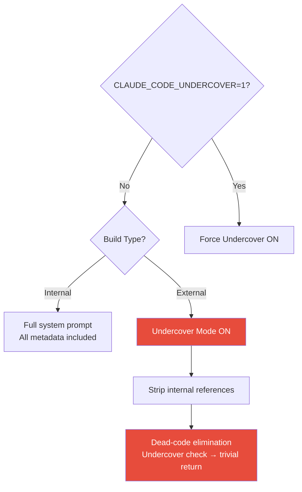

# Undercover Mode

Undercover Mode is a security mechanism that strips all internal Anthropic metadata from Claude Code's outputs when operating in external or public contexts.

## Purpose

When Claude Code operates in public or open-source repositories, Undercover Mode prevents the accidental disclosure of:

- Internal model codenames (Capybara, Fennec, Numbat, Tengu)
- Unreleased model version numbers
- Internal repository names
- Internal tooling and infrastructure details
- Slack channel names
- Internal short links

## Activation

| Method | Details |
|--------|---------|
| Automatic | Active by default in external builds |
| Environment variable | `CLAUDE_CODE_UNDERCOVER=1` forces activation |
| Code elimination | In external builds, the function is dead-code-eliminated to trivial returns |

::: warning
In external builds, there is **no way to disable** Undercover Mode. The relevant code paths are eliminated at compile time, reducing to no-op functions that always return the sanitized output.
:::

## What Gets Stripped

The system prompt injects a directive when Undercover Mode is active:

> "You are operating UNDERCOVER in a PUBLIC/OPEN-SOURCE repository"

This triggers the model to avoid mentioning:

| Category | Examples |
|----------|---------|
| Model codenames | Capybara, Fennec, Numbat, Tengu |
| Version numbers | Internal model iteration numbers |
| Repository names | Internal Anthropic repo references |
| Infrastructure | Internal tooling, services, endpoints |
| Communication | Slack channels, internal links |

## Implementation

## Relationship to Other Security Mechanisms

Undercover Mode is the **information leakage prevention** layer in the broader security architecture:

| Mechanism | Protects Against |
|-----------|-----------------|
| [Anti-Distillation](./anti-distillation.md) | Training data theft |
| [Client Attestation](./client-attestation.md) | Unauthorized API access |
| **Undercover Mode** | Internal information leakage |
| [Permission Model](./permission-model.md) | Unauthorized actions |
