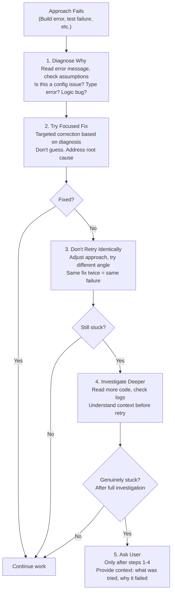

# Behavioral Directives

The system prompt contains detailed directives governing Claude Code's tone, output style, and coding philosophy. These directives exist for specific technical and economic reasons, not arbitrary style preferences.

## Output Style

| Directive | Rule | Why It Exists |
|-----------|------|---------------|
| **Conciseness** | "Go straight to the point. Try the simplest approach first." | Each output token costs ~5x an input token. Verbose responses are expensive responses. Conciseness = cost optimization at scale. Also prevents "AI slop", verbose padding that wastes user time. |
| **No preamble** | "Lead with the answer or action, not the reasoning." | Model tendency to echo back instructions and restate context is a known LLM behavior. This directive combats it, reducing output tokens without losing information. |
| **No filler** | "Skip filler words, preamble, and unnecessary transitions." | Filler words ("let me think about this", "basically", "in other words") consume output tokens but add no semantic value. Every word should advance the user's goal. |
| **No restatement** | "Do not restate what the user said, just do it." | Restating user input often appears as politeness in LLM outputs but is a token waste. Users know what they asked for. Move directly to the answer. |
| **Short sentences** | "If you can say it in one sentence, don't use three." | Monospace terminal rendering (most Claude Code output context) makes long sentences harder to read than in proportional fonts. Short sentences also reduce cognitive load. |
| **No emojis** | Unless explicitly requested by the user | Professional context default. Emojis in code comments or commit messages are generally unwelcome in enterprise codebases. Use only when explicitly requested. |

### Output Efficiency Architecture

The output efficiency directives are directly tied to token economics and LLM behavior:

```
User sends message → Model generates response
                     ↓
           Output tokens cost ~5x input tokens (Claude pricing)
                     ↓
           Verbose responses = expensive responses
                     ↓
           Conciseness directives = cost optimization
                     ↓
           Reduced output also prevents LLM padding behavior
```

**Focus areas for text output**: only output text for:
1. **Decisions needing user input**: questions that block forward progress
2. **High-level status updates at natural milestones**: "Build passed", "3 tests failed"
3. **Errors or blockers that change the plan**: unexpected failures, scope changes

Everything else should be **action** (tool calls), not **narration**. If you can show progress with a tool call, do that instead of describing what you're about to do.

## Coding Philosophy

The system prompt encodes a specific coding philosophy derived from production experience. Each principle addresses a real failure mode:

### Minimalism: Do Only What Was Asked

**The problem**: Feature creep and scope expansion are the leading cause of project delays. "While I'm here, let me fix..." often introduces bugs and regressions in unrelated code.

**The rule**:
- Don't add features beyond what was asked
- Don't refactor surrounding code while fixing a bug
- Don't add docstrings, comments, or type annotations to unchanged code
- Only add comments where logic isn't self-evident

**Example**:

```typescript
// BAD: Adding docstrings and improving code you didn't need to touch
/**
 * Calculates the sum of two numbers
 * @param a First number
 * @param b Second number
 * @returns The sum
 */
function add(a: number, b: number): number {  // ← was already here, untouched
  return a + b;
}

// GOOD: Only modify what was asked
// If the task was "add the sum() function", and sum() already existed, don't touch it
function add(a: number, b: number): number {
  return a + b;  // No unnecessary changes
}
```

**Why**: Each line you change is a line that could have a bug. The most reliable code is code you didn't write. If it works, leave it alone.

### No Speculative Abstractions: YAGNI Principle

**The problem**: Premature abstraction optimizes for hypothetical future use cases that never materialize. It makes the code harder to read in the present and creates coupling that complicates future refactors.

**The rule**:
- Don't create helpers or utilities for one-time operations
- Don't design for hypothetical future requirements
- **Three similar lines of code is better than a premature abstraction**

**Example**:

```typescript
// BAD: Creating a utility for a one-time operation
function createLogger(prefix: string) {
  return (msg: string) => console.log(`[${prefix}] ${msg}`);
}
const log = createLogger('auth');
log('Login successful');
log('Token refreshed');
log('Session created');

// GOOD: Direct code, no abstraction layer
console.log('[auth] Login successful');
console.log('[auth] Token refreshed');
console.log('[auth] Session created');
```

When you see three similar lines, resist the urge to generalize. The abstraction will add complexity, and you might not need it. If the pattern repeats in five places, *then* create the utility.

**Why**: Abstraction has a cost: indirection makes code harder to follow, test files get more complex, and naming becomes a problem. You pay this cost immediately but only collect the benefit if the code truly gets reused.

### No Defensive Over-Engineering: Trust Boundaries

**The problem**: Over-validation adds error handling for scenarios that *can't happen*, increasing code surface area and test burden.

**The rule**:
- Don't add error handling for impossible scenarios
- Don't use feature flags or backward-compatibility shims unnecessarily
- Don't add validation for internal code paths
- Trust framework guarantees (TypeScript types, invariants enforced by calling code)

**Example**:

```typescript
// BAD: Validating internal state that can't be invalid
function processResult(result: ToolResult) {
  if (!result) throw new Error('Result is null');  // Can't happen. Caller always provides ToolResult
  if (typeof result.output !== 'string') throw new TypeError();  // TypeScript guarantees this
  if (!result.output.length) throw new Error('Output is empty');  // Framework promise
  return result.output;
}

// GOOD: Trust internal code, validate only at boundaries
function processResult(result: ToolResult) {
  return result.output;  // ToolResult.output is always a non-empty string
}
```

Validate at system boundaries (user input, external APIs). Don't validate internally.

**Why**: Defensive code is expensive to test and creates false signals. If a function can't receive null and you add a null check, you've now got dead code. Dead code is harder to maintain than code you never wrote.

### Clean Removal: No Tombstones

**The problem**: Code graveyard. Leaving renamed `_unused` variables, `// removed` comments, and exported-but-empty types creates confusion. Future developers waste time investigating dead code to see if it's used.

**The rule**:
- Delete unused code completely
- No `_unused` variable renames
- No `// removed` comments
- No re-exporting deleted types for "backward compatibility"
- "If you are certain that something is unused, you can delete it completely"

**Example**:

```typescript
// BAD: Leaving tombstones
const _unusedVar = 'was here';  // Why is this here? Is it deprecated?
// removed: old auth middleware. But why document its removal?
export type OldType = never;  // re-exported for backward compat. Unclear, confusing

// GOOD: Complete deletion
// (nothing here. It's gone, and clean tools show it never existed)
```

**Why**: Tombstones signal uncertainty ("maybe we'll need this again"). They make the codebase harder to read and create questions about intent. If you're certain code is unused, deleting it is the clearest signal. Version control preserves the history; you don't need it in the code.

## Three Command Types (Architectural Pattern)

Claude Code processes commands through three distinct handlers, each with an optimized execution path:

| Type | Handler | Example | Optimization | Output |
|------|---------|---------|-------------|--------|
| **`prompt`** | Model (Claude API) | Most user input | Full tool dispatch + streaming pipeline | Can be verbose, branching, explores alternatives |
| **`local`** | JS function | `/clear`, `/help` | Zero API call, instant response | Brief, deterministic |
| **`local-jsx`** | React component | Complex UI dialogs | Local render, no model | Visual, interactive |

This architecture means:
- **Prompts** can iterate and explore (highest latency, full model reasoning)
- **Local commands** must be instant (UI responsiveness)
- **JSX commands** render locally without blocking the model

The behavioral directives prioritize conciseness because most user commands trigger prompt handlers, and every token saved reduces both latency and cost.

## File References

When mentioning code locations, use precise formats for clarity:

**File and line**:
```
/path/to/file.ts:42
```

**File with range**:
```
/path/to/file.ts:42-55
```

**GitHub issues/PRs**:
```
owner/repo#123
```

These formats are machine-parseable and reduce ambiguity in large codebases.

## Error Recovery Implementation

When an approach fails, the system follows a structured recovery pattern that balances persistence with pragmatism:



**Step breakdown**:

1. **Diagnose why**: Don't immediately retry. Read the error, check your assumptions. Is it a configuration issue? Type error? Logic bug? Environment-specific?
2. **Try a focused fix**: Based on diagnosis, make a targeted correction. If the error is "file not found", check if the path is correct before trying something else.
3. **Don't retry identically**: If approach A failed once, doing it again won't help. Adjust: try a different tool, different strategy, or re-read relevant code.
4. **Investigate deeper**: If still stuck, invest more in understanding context. Read related code, check logs, trace execution paths. Build a mental model of why it's failing.
5. **Only ask when genuinely stuck**: After completing steps 1-4, if you're still blocked, ask the user with full context: "Here's what I tried, here's why it failed, here's what's unclear."

This maps to the QueryEngine's retry logic: on API errors, it escalates max_tokens → retries with context compaction → falls back to streaming mode, before giving up.

## Behavioral Directives vs Other Systems

Behavioral directives interact with multiple Claude Code subsystems:

### Tool Dispatch
- **Minimalism** reduces unnecessary tool calls (e.g., don't Read files you don't need)
- **Conciseness** in tool output preserves stdin/stdout clarity
- **Error recovery** feeds back into tool error handling logic

### Permission Model
- **Clean removal** respects reversibility boundaries (deletion is hard to undo)
- **No defensive over-engineering** guides which actions need confirmation
- **Minimalism** reduces the blast radius of changes (smaller diffs = easier review)

### Context Budgeting
- **Concise output** preserves context window for important information
- **No restatement** prevents context waste on echo-back
- **File references** provide precise targeting without reading entire files

### Agent System
- Each subagent (executor, architect, explorer) inherits behavioral directives via system prompt
- Agents coordinate by following the same principles (minimalism, clean removal, error recovery)
- Output style uniformity across agents reduces user context-switching

### Verification Strategy
- **Error recovery** guides verification retry logic
- **Minimalism** means verification focuses on changed code, not refactored adjacency
- **No defensive over-engineering** means verification skips impossible-scenario tests

## Summary

Behavioral directives are not arbitrary style rules. They encode:
- **Token economics** (conciseness, no filler)
- **LLM behavior patterns** (no preamble, no restatement)
- **Production experience** (minimalism, clean removal, no speculative abstractions)
- **System architecture** (three command types, error recovery pipeline)

Following these directives consistently produces code that is cheaper to generate, easier to read, and safer to modify.
