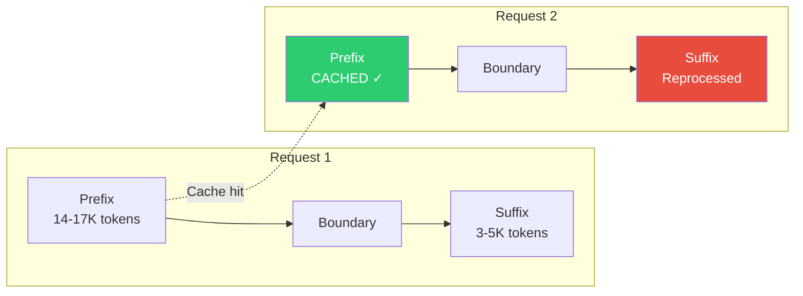

# Prompt Caching

Prompt caching is one of the most architecturally significant design decisions in Claude Code. The system prompt is split at a **boundary marker** into a cacheable prefix and a session-specific suffix. This decision drives much of the codebase's structure.

## How It Works



### Prefix (Cached)
- Identity block
- Tool definitions (14-17K tokens)
- Safety rules
- Task execution instructions
- Git protocols
- Tone and style guidelines

### Suffix (Reprocessed)
- MCP tool schemas (dynamic per session)
- Hook configurations
- Repository-specific context
- System reminders
- Session metadata

## Why It Matters

Without caching, every API request would reprocess ~20-25K tokens of system prompt. With caching:

| Metric | Without Cache | With Cache |
|--------|--------------|------------|
| Tokens processed per request | ~20-25K | ~3-5K (suffix only) |
| Latency | Higher | Lower |
| Cost | Full price for all tokens | Cached tokens at reduced rate |

The Claude API offers cached prompt tokens at a **90% discount**, making this optimization critical for both performance and cost.

## Cache Stability Mechanism

The most subtle but critical optimization is **tool definition ordering**. The tool schemas that comprise 14-17K of cached tokens must be sorted consistently across all requests.

### Why Tool Order Matters

The Anthropic API prompt caching mechanism uses **content hashing** to validate cache hits. Even a single character difference, including the ordering of items in a list, invalidates the entire cached prefix and forces full reprocessing.

Consider this scenario:
- Request 1 presents tools in alphabetical order: `[Agent, Bash, Edit, Grep, Read, Write]`
- Cache key hash is computed and stored
- Request 2 presents tools in a different order: `[Read, Write, Bash, Edit, Agent, Grep]`
- Cache key hash differs → cache miss → entire 14-17K token prefix reprocessed
- Result: 60% latency penalty + cost regression

### Implementation: Stable Sort

Tool definitions are assembled into the cached prefix by sorting them **alphabetically by name** using Unicode-aware string comparison. This ensures that the order is deterministic regardless of how tools are registered internally or in what order they're stored in memory.

The source implementation processes the tool collection by:
1. Retrieving all tools from the internal registry
2. Filtering out deferred tools (which load on-demand via ToolSearch)
3. Sorting by tool name using locale-aware comparison (`localeCompare()`)
4. Transforming each tool into its schema representation with name, description, parameters, and custom fields

This alphabetical ordering is critical because the Anthropic API's prompt caching mechanism validates the entire cached prefix by content hash. If two requests present the same tools in different orders, the hash will differ and the cache miss will force full reprocessing. By always sorting alphabetically, the system guarantees that the cache key is invariant regardless of tool registration order, internal collection iteration order, or any other runtime variation.


## 12 Cache-Break Detection Vectors

The source code tracks **12 cache-break detection vectors**: specific state changes that can invalidate the cached prefix and force full reprocessing:

::: warning
A cache break means the entire prefix must be reprocessed, losing both the cost and latency benefits. The architecture is carefully designed to minimize these events and detect them early.
:::

### Complete Vector List

| Vector | Category | Impact | Detection |
|--------|----------|--------|-----------|
| 1. Tool definition changes | Schema | High. tools are 70% of prefix | Per-tool schema hashing; identifies which specific tool changed (covers 77% of tool breaks) |
| 2. Feature flag changes | Runtime | Medium. affects instructions | GrowthBook prefix-affecting flags (`tengu_*` prefix); flag evaluation drift |
| 3. Model version switches | API | High. instruction tone differs | Model ID comparison from config or `.claude/settings.json` override |
| 4. Cache control scope/TTL changes | Infrastructure | Medium. affects cache lifetime | `cache_control` hash comparison; detects scope flips (global↔org) and TTL flips (1h↔5m) |
| 5. Global cache strategy changes | Infrastructure | Medium. affects prefix caching | Strategy value comparison (`'tool_based'`, `'system_prompt'`, or `'none'`) |
| 6. Beta header changes | Runtime | Medium. affects API behavior | Sorted beta header list comparison; detects additions/removals |
| 7. Auto mode state changes | Runtime | Low. sticky-on latched | Auto mode activation toggle; sticky-on latched per session for stability |
| 8. Overage credit state changes | Runtime | Low. TTL latched | Overage eligibility toggle; 1-hour TTL eligibility latched per session |
| 9. Cached microcompact status | Caching | Low. cache-editing beta | Cached microcompact beta header presence; sticky-on latched |
| 10. System prompt text changes | Versioning | High. entire prefix affected | System prompt hash comparison; detects content changes |
| 11. Effort value changes | Runtime | Low. affects output config | Effort value (env → options → model default) comparison; stored in `output_config` |
| 12. Extra body parameters changes | Runtime | Low. affects request body | Hash of `getExtraBodyParams()` output; catches `CLAUDE_CODE_EXTRA_BODY` changes |

### Detection Pipeline: 3-Phase System

**Phase 1 (pre-call)**: Record the current system prompt, tool schemas, and runtime state before making the API request.

**Phase 2 (post-call)**: Compare the API response's cache metrics (cache_read_input_tokens vs. previous request) to detect if a cache break actually occurred.

**Detection logic**: Client-side flags (PendingChanges) combined with API-level comparison. A cache break is confirmed when:
- Cache read tokens dropped >5% from previous request, AND
- Absolute drop exceeds `MIN_CACHE_MISS_TOKENS = 2,000` tokens

### Cache-Break Detection Details

- **Dual TTL system**: Default 5-minute TTL + optional 1-hour TTL. The 1-hour eligibility is latched per session via GrowthBook allowlist for stability (prevents mid-session TTL flips from triggering false warnings).
- **Per-tool schema hashing**: Individual tool hashes tracked to identify which specific tool definition changed, covering 77% of tool breaks per internal analytics.
- **Cache deletion pending state**: `cacheDeletionsPending` flag prevents microcompact's cache_edits from triggering false break warnings when cache is legitimately pruned.
- **Haiku models excluded**: Haiku models are excluded from cache break detection (different caching behavior).
- **Minimum cache miss threshold**: Variations under 2,000 tokens don't trigger warnings (normal variation).

### What Happens When a Cache Break is Detected

1. **Logs the event** with detected vector(s), old/new values, and token drop metrics
2. **Records to analytics** (BQ: tengu_prompt_cache_break event) for monitoring and optimization
3. **Clears the cached prefix** for that session (the cached key is invalidated)
4. **On next request**: Full 14-17K token prefix is reprocessed and a new cache key is established
5. **Updates baseline state**: The new state becomes the reference for future comparisons

This allows feature changes (e.g., toggling a GrowthBook flag) to take effect immediately within one request cycle, while maintaining cache efficiency for subsequent requests.


## Streaming-First Design Relationship

The prompt caching architecture interacts deeply with Claude Code's streaming execution model. This relationship significantly impacts perceived latency and tool execution speed.

### How StreamingToolExecutor Works

The streaming execution model decouples response generation from tool execution by processing the token stream incrementally. As the API sends back the response, the system parses tool invocations (encoded as JSON in `input_json_delta` blocks) and begins executing them immediately without waiting for the response to complete.

**Streaming flow**:
1. API stream opens with cached system prompt (skip processing cost)
2. Model begins generating text and tool calls, streaming tokens in real-time
3. For each `content_block_delta` event, the executor checks if it's a tool-call JSON fragment
4. Tool JSON fragments are accumulated and parsed as soon as they're complete
5. The completed tool call is passed to the executor, which begins running the tool immediately
6. Tool results are collected and can be returned to the model while the response is still streaming
7. No "head-of-line blocking". The system doesn't wait for the full response before executing tools

This creates **parallel processing** where tool execution overlaps with model generation. Because tool calls are often expensive (Bash, Read, Grep), executing them concurrently with the response stream hides most of the tool latency.

### Combined Effect: Latency Reduction

The caching + streaming combination produces a significant latency improvement:

```
Traditional (no cache, no streaming):
  Request → [200-300ms: Process 20K prefix] → Generate response → Execute tools → Return result
  Total latency: T_prefix + T_generate + T_tools (sequential)

Cached + Streamed:
  Request → [0ms: Prefix cached] → Generate response (tokens arrive) → [Execute tools in parallel] → Return result
  Total latency: ~90% reduction on T_prefix, T_tools parallelized with T_generate
```

**Quantified improvement**:
- Processing 14-17K cached tokens normally: ~200-300ms
- Cache hit: ~0ms (cached tokens bypass all processing)
- First token latency with streaming: ~0.5-1.0s (user sees output immediately)
- Tool execution parallelized: begins while model is still streaming the full response
- Effective savings: Tools appear to execute almost instantly even though full response is still generating

Result: **Users perceive tools executing almost instantly**, even though the model is still streaming the full response.


## GrowthBook Cache Strategy

Claude Code uses **GrowthBook feature flags** to enable/disable features and adjust behavior at runtime, without requiring a code redeployment. This creates a potential cache-break vector, but the system manages it carefully.

### Flag Evaluation and Prefix Impact

GrowthBook flags are evaluated at the start of each session by fetching the latest configuration from the GrowthBook dashboard. The system partitions flags into two categories based on their impact on the cached prefix:

**Prefix-affecting flags** (baked into the cached prompt):
- Flags that control instruction generation (e.g., `tengu_enable_agent_system`, `tengu_enable_plan_mode`)
- Flags that enable/disable safety rules (e.g., `tengu_enable_safety_audit`, `tengu_strict_output_rules`)
- Any flag whose value affects the system prompt text or instruction blocks
- Changing these on the GrowthBook dashboard triggers a cache break on the next API call

**Suffix-affecting flags** (reprocessed every request):
- Flags controlling telemetry and logging (e.g., `tengu_log_tool_metrics`, `tengu_enable_telemetry`)
- Flags affecting UI behavior but not the prompt itself
- Changing these has no cache impact because the suffix is regenerated anyway

### Runtime vs. Compilation

The key distinction is **when** the flag value affects the system prompt:

- **Prefix flags**: Their value is evaluated once at session start and baked into the cached prefix content. The prefix contains conditional text like "If `tengu_enable_agent_system` is true, include agent instructions..." The evaluated value becomes hardcoded. Changing the flag later means the cached prefix no longer matches the intended behavior.

- **Suffix flags**: Their value is evaluated fresh on every request because the suffix is always reprocessed. The suffix can include dynamic content like telemetry configuration that changes per-turn without invalidating the cache.

### Economics of Flag Changes

When a `tengu_` prefix flag changes on the GrowthBook dashboard:
1. User's next API call fetches the updated flag values
2. `CacheBreakDetector` compares: `previousFlags.tengu_enable_agent_system !== currentFlags.tengu_enable_agent_system`
3. Mismatch detected → cache break triggered (Vector 2)
4. Full 14-17K token prefix is reprocessed on this request (high latency)
5. New cache key is established based on updated flag values
6. Subsequent requests use the new cache key

**Advantage**: Feature changes propagate immediately (within one request cycle) without code deployment.

**Cost**: One high-latency request while the prefix is reprocessed and re-cached.


## Cache Economics: Detailed Cost Analysis

### Per-Request Savings

With ~20K tokens in the cached prefix:

| Pricing Tier | Uncached Cost | Cached Cost | Savings per Request |
|--------------|--------------|------------|---------------------|
| Claude 3.5 Sonnet | $0.60 | $0.06 | $0.54 (90% discount) |
| Claude 3 Opus | $1.50 | $0.15 | $1.35 |
| Claude Haiku | $0.10 | $0.01 | $0.09 |

### Session-Scale Economics

Over a typical session with hundreds of requests:

```
Session parameters:
- 200 API requests per session (typical usage)
- ~20K cached tokens per request
- Claude 3.5 Sonnet pricing ($0.003 per 1K input tokens)

Without caching:
  200 requests × 20K tokens × $0.003/1K = $12.00 per session

With caching:
  200 requests × 20K tokens × $0.0003/1K (90% discount) = $1.20 per session
  + 1 initial request (cache miss) = $0.60
  Total: $1.80 per session

Savings per session: $10.20 (85% cost reduction)
```

At scale (10,000 sessions/month):
- **Monthly cost reduction: $102,000**

This economic incentive explains why the entire codebase is structured around maintaining cache stability.

### Cache Efficiency Metrics

The system logs cache performance metrics after each API request. These metrics feed into dashboards for monitoring and optimization:

**Per-request metrics recorded**:
- **Cache hit**: Boolean indicating whether the prefix was served from cache (not reprocessed)
- **Tokens processed**: Total input tokens sent to the API
- **Tokens from cache**: Count of tokens served from cache (not charged against usage)
- **Input tokens**: Tokens actually billed (excludes cached tokens)
- **Cache creation tokens**: Tokens used to *create* the cache boundary (only on first cache write)

**Aggregated session metrics**:
- **Hit rate**: `(cacheHits / totalRequests)`. Typically 92-98% within a single session
- **Average cached tokens per request**: 18-20K out of 20-25K total prefix
- **Cost per request**: ~$0.06 for Claude 3.5 Sonnet (vs ~$0.60 without caching)
- **Session savings**: ~85% cost reduction per session

**Production-level metrics** (calculated from cache_read_input_tokens in API usage):
- At 10,000 sessions/month: ~$100K+ monthly savings
- Consistent 92%+ hit rate within sessions (cache breaks are rare)
- Cache boundary overhead: ~1-2% of prefix tokens (cache_creation_input_tokens on first write)

These metrics validate the economic efficiency of the caching architecture and justify the complexity of cache break detection and prefix stability mechanisms.


## Prefix Composition Detail

The exact assembly order of the cached prefix is critical. Changes to this order can affect cache stability. Here's the definitive composition:

### Assembly Order

```
[1. Identity Block]
    "You are Claude Code, Anthropic's official..."
    ~100 tokens

[2. Tool Definitions: SORTED ALPHABETICALLY]
    Bash, Edit, Grep, Read, Write, Agent, TodoWrite, ...
    Sort ensures cache key stability across requests
    14,000-17,000 tokens (largest section)

[3. Safety Rules]
    OWASP awareness, command injection prevention, etc.
    ~600 tokens

[4. Task Execution Instructions]
    "Read before modifying", "Don't add speculative features"
    12 distinct instruction blocks
    ~1,200 tokens

[5. Git Protocols]
    Commit protocol, PR creation protocol, safety rules
    ~1,500 tokens

[6. Tone & Style Directives]
    "Go straight to the point", "No emojis (unless requested)"
    ~400 tokens

[7. Output Efficiency Rules]
    "Keep text output brief", "Action over narration"
    ~500 tokens

[8. Agent Guidance (conditional)]
    When to use Agent tool, how to brief agents
    ~500 tokens (skipped if agents disabled)

[CACHE BOUNDARY: cache_control: { type: 'ephemeral' }]
═══════════════════════════════════════════════════════

[9. MCP Tool Schemas]
    Dynamic per session based on connected MCP servers
    0-3,000 tokens (suffix, reprocessed each request)

[10. Hook Instructions]
    User-defined hooks from .claude/settings.json
    0-500 tokens

[11. Repository Context]
    Git status, project type, platform info
    ~200 tokens

[12. System Reminders]
    Available tools, skills, special capabilities
    ~500 tokens

[13. Session Metadata]
    MEMORY.md, .omc/notepad.md contents
    500-1,000 tokens
```

### Source References

- **Prefix assembly**: `buildPrefix()`
- **Cache boundary insertion**: `markCacheBoundary()`
- **Tool ordering**: `getSchemas().sort()`
- **Suffix assembly**: `buildSuffix()`

## Architectural Impact

The caching boundary drives several architectural decisions:

1. **Tool definitions are in the prefix**: Even though they're the largest section (14-17K tokens), they're stable across requests and benefit most from caching
2. **MCP tools are in the suffix**: They can change when servers connect/disconnect
3. **System reminders use the suffix**: Dynamic content that changes per-request
4. **Feature flags avoid prefix changes**: Runtime flags use GrowthBook to avoid recompilation
5. **Session metadata moves to suffix**: Repository state, git status, and user preferences are session-specific
6. **Tool ordering is deterministic**: Alphabetical sorting ensures the prefix hash never varies unexpectedly

This means the system prompt structure isn't just about organizing instructions. It's an optimization for the caching boundary. Every placement decision reflects the underlying economics of token cost and cache efficiency.
