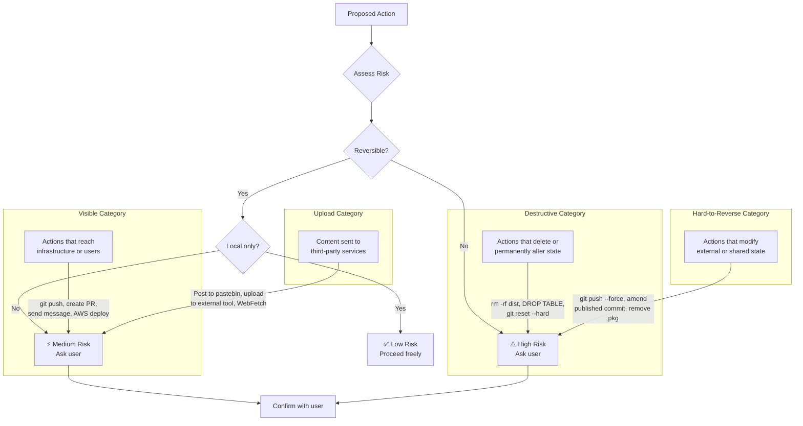
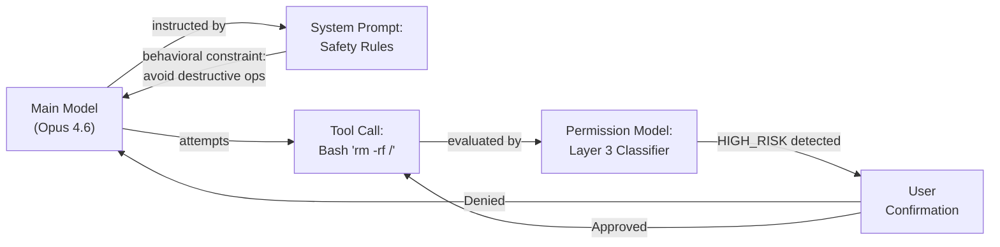
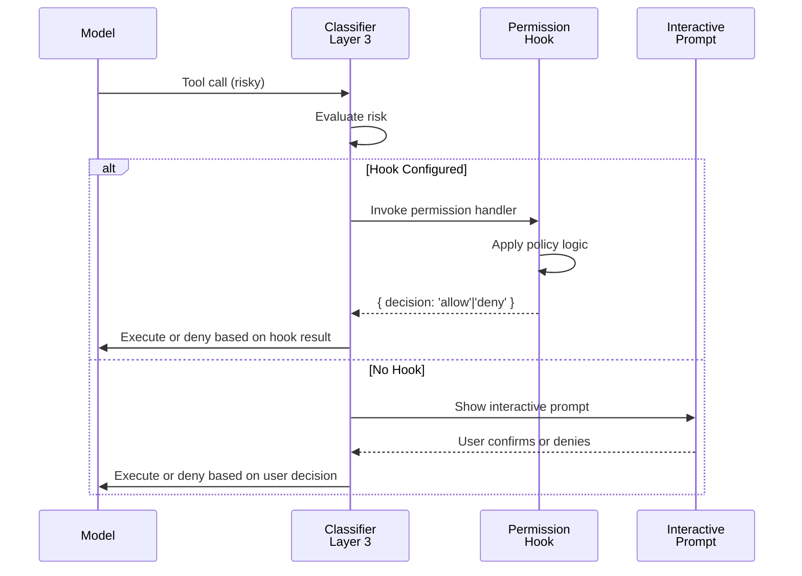

# Safety Rules

Claude Code's system prompt contains detailed safety rules covering both AI safety (preventing harmful outputs) and software security (preventing insecure code). These rules work in concert with the enforcement layer in the permission model to create a two-layer defense: behavioral constraints on the model itself, combined with technical enforcement on the tool system.

## OWASP Awareness

The system prompt explicitly references OWASP Top 10 vulnerabilities and instructs the model to avoid introducing them:

### OWASP Categories and Tool Mapping

| OWASP Category | Tool Risk | Mitigation |
|---------------|-----------|-----------|
| **A1: Injection (Command Injection)** | Bash tool accepts arbitrary shell input | Model validated for untrusted variable injection; Bash sandbox enforces timeout/environment restrictions |
| **A2: Injection (SQL Injection)** | Any database tool | Model instructed to use parameterized queries; never construct SQL from untrusted input |
| **A3: Broken Authentication** | WebFetch, API interactions | Model warned against storing credentials in code; never commit secrets |
| **A4: XSS (Cross-Site Scripting)** | WebFetch result processing, artifact generation | Model sanitizes HTML generation; template injection prevented |
| **A5: Broken Access Control** | File operations, Bash commands | Model respects filesystem boundaries; invalid paths rejected |
| **A6: Security Misconfiguration** | Infrastructure-as-Code tools (CDK, CloudFormation) | Model validates policies against best practices; permission model enforces authorization |
| **A7: Sensitive Data Exposure** | Read, WebFetch, Bash | Model doesn't log secrets; strips credentials from output; refuses to cat .env files directly |
| **A8: XXE (XML External Entity)** | WebFetch, XML parsing | Model avoids XML parsing of untrusted sources |
| **A9: Insecure Deserialization** | JSON parsing, tool inputs | Model validates input before deserialization |
| **A10: Using Components with Known Vulnerabilities** | Dependency management | Model informed of CVE tracking best practices |

### Model Self-Correction Mechanism

If the model accidentally writes insecure code (e.g., `subprocess.call(f"rm {user_input}")` without validation), the system prompt instructs it to **immediately detect and fix it**:

```typescript
// What the model AVOIDS (catches and fixes):
const result = await bash.run(`rm -rf ${userPath}`);  // ❌ Command injection

// What the model DOES (detects the risk, fixes it):
const safeCommand = `rm -rf "${shellEscape(userPath)}"`;  // ✅ Fixed
const result = await bash.run(safeCommand);
```

The model is instructed to treat this as a **blocker fix**: higher priority than the original task.

### Tool-Specific OWASP Defense

**Bash Tool** (highest risk for injection):
- Command injection via untrusted variables is the primary risk
- Model instructed to validate all shell metacharacters (`; | & $ () < >`)
- Prefers `shellEscape()` or `bash -c 'command' -- "$var"` pattern
- Rejects commands like: `ls -l $(user_input)`, `` `whoami` ``, `eval $var`

**WebFetch Tool** (SSRF, XXE, data exfiltration):
- Model warned against fetching URLs constructed from user input
- Refuses to fetch internal IP ranges (127.0.0.1, 10.0.0.0/8, 172.16.0.0/12, etc.)
- Strips authentication headers from error messages
- Never caches or logs response bodies to third-party services

**Write/Edit Tools** (arbitrary file write):
- Model validates file paths stay within project boundaries
- Refuses to overwrite sensitive files (.env, .git, node_modules)
- Detects accidental credential writes and prompts user to rotate

## Security Tool Authorization

For security-related tasks (penetration testing, CTF challenges, exploit development), the system prompt requires clear authorization context:

| Allowed Context | Examples |
|----------------|---------|
| Authorized pentesting | Engagement with documented scope |
| CTF competitions | Challenge-solving context |
| Security research | Academic or defensive research |
| Defensive security | Blue team, detection engineering |

| Refused Context | Examples |
|-----------------|---------|
| DoS attacks | Any denial-of-service techniques |
| Mass targeting | Attacking multiple systems |
| Supply chain compromise | Package poisoning, dependency attacks |
| Detection evasion (malicious) | Bypassing security controls for attack |

Authorization is tracked through conversation context. The model requires explicit mentions of engagement terms, CTF titles, or research affiliation before proceeding.

## Reversibility and Blast Radius Framework

The system prompt contains a sophisticated framework for evaluating action risk. This is not just guidance. **It maps directly to the PermissionChecker's Layer 3 classifier logic** (see [Permission Model](../security/permission-model.md)).

### Framework Flowchart



### Risk Category Details

**Low Risk (Proceed freely):**
- Reading files (no state change)
- Running tests (side-effects contained)
- Local file edits (reversible via version control)
- Search operations (read-only)
- Building artifacts (local, can be cleaned)

**Medium Risk (Confirm with user):**
- **Visible to others**: Pushing to shared repository (affects teammates)
- **Creating PRs**: Changes become visible in project history
- **Deploying infrastructure**: Changes reach production or staging
- **Uploading content**: Third-party services may cache or index it
- **Creating issues/comments**: Public record visible to organization

**High Risk (Always confirm):**
- **Destructive**: `rm -rf`, `DROP TABLE`, permanent deletions
- **Hard-to-reverse**: Force push to published branches, amending published commits, removing npm packages
- **Hijacking state**: Git operations that could corrupt repository state
- **Credential exposure**: Commands that might leak API keys or passwords

### How This Maps to PermissionChecker Classification

The PermissionChecker (Layer 3 in the permission model) evaluates tool calls through the same risk dimensions:

```typescript
// Simplified classifier logic matching the framework
function evaluateRiskDimension(toolCall, userIntent) {
  const isDistructive = (
    toolCall.command.includes('rm -rf') ||
    toolCall.command.includes('DROP TABLE') ||
    toolCall.command.includes('git reset --hard')
  );
  if (isDestructive && !isReversible(toolCall)) {
    return 'HIGH_RISK';  // Always ask user
  }

  const isVisible = (
    toolCall.command.includes('git push') ||
    toolCall.command.includes('git pull') ||
    isDeploymentCommand(toolCall)
  );
  if (isVisible && affectsSharedState(toolCall)) {
    return 'MEDIUM_RISK';  // Ask user
  }

  return 'LOW_RISK';  // Proceed
}
```

Cross-reference: [Permission Model - Layer 3 Classifier](../security/permission-model.md#layer-3-security-classifier)

## Safety Rules and Permission Model Interaction

Claude Code implements a **two-layer defense** against unsafe operations:

### Layer 1: Behavioral Constraints (System Prompt)
Safety rules in the system prompt constrain what the **model thinks it should do**:
- "Don't introduce OWASP vulnerabilities"
- "Only modify files related to the task"
- "Never skip git hooks"
- "Validate external input thoroughly"

These are **soft constraints**. The model is instructed but not technically prevented.

### Layer 2: Technical Enforcement (Permission Model)
The PermissionChecker enforces what the **tool system actually allows**:
- Layer 1 (Fixed allowlist): Read-only tools auto-allow
- Layer 2 (User rules): User-configured patterns auto-allow
- Layer 3 (Classifier): Sonnet 4.6 independently evaluates risky calls

These are **hard constraints**. Even if the model wants to run `rm -rf /`, the tool system blocks it and asks the user.

### Defense in Depth



**If the model's safety rules fail** (e.g., model decides to run a destructive command), the permission model catches it.

**If the permission model is misconfigured** (e.g., too permissive user rules), the model's safety rules discourage bad choices.

### Interaction Example

User asks: "Delete the old build directory"

1. **System Prompt** instructs: "This is destructive; confirm with user"
2. **Model** recognizes destructiveness and includes a confirmation request
3. **User** confirms → Model generates: `Bash("rm -rf old-build")`
4. **Permission Model** Layer 1/2/3 evaluates the `rm -rf` call
5. **Classifier** sees: "User asked to delete old-build, tool targets old-build directory"
6. **Classifier** returns: SAFE (matches user's stated intent)
7. **Tool executes**

If the model tried to do more (e.g., `rm -rf /`):
1. **System Prompt** still instructs caution
2. **Model** generates: `Bash("rm -rf /")`
3. **Permission Model** Layer 3 sees the overshoot
4. **Classifier** returns: RISKY (exceeds user intent)
5. **User is prompted again** → likely denies
6. **Tool does not execute**

## Bare-Repo Attack Prevention

Git state corruption is a known attack vector in CI/CD environments. Claude Code includes post-command cleanup to prevent bare-repo hijacking:

### The Attack

A malicious tool call or script could corrupt the `.git` directory, causing subsequent `git` commands to fail or behave unexpectedly:

```bash
# Attack: Corrupt the git config
echo "corrupted" > .git/config

# Subsequent git commands fail or act on wrong repo
git status  # Now targets wrong repository or fails
```

### Prevention: Post-Command Validation

After any Bash command that modifies git state, Claude Code validates that the repository is still in a clean, valid state. The validation logic checks whether the working directory is clean (no uncommitted or untracked changes) before proceeding with teleportation or state-sensitive operations. This approach ensures that a corrupted or dirty git state is detected immediately rather than propagating silently through subsequent operations.

The validation occurs through explicit checks before critical operations. For example, when using the `--teleport` feature to resume a session on a different branch or machine, Claude Code first verifies that the working directory is clean by checking both committed and untracked files. If the repository is in an unclean state, the operation fails with a clear error message instructing the user to commit or stash their changes before proceeding.

This strategy prevents bare-repo attacks where a malicious tool call or script could corrupt the `.git` directory (for instance, by writing invalid data to `.git/config` or corrupting the HEAD reference). By validating git state at strategic checkpoints, Claude Code ensures that:

1. **Immediate detection**: Corruption is caught at the next validation checkpoint, not after multiple commands
2. **Clear error messages**: Users receive actionable feedback ("Git working directory is not clean") rather than cryptic git errors
3. **Operator control**: The user has explicit visibility into when and why git state is being checked
4. **Recovery guidance**: Error messages suggest remediation steps (e.g., "commit or stash your changes")


## Hook Permission Escape Hatch

The permission model includes a `PermissionRequest` hook mechanism for **programmatic permission decisions in headless environments** (CI/CD systems without interactive prompts):

### Use Case: Headless Deployment

In CI/CD, there's no interactive user to confirm permissions. Instead, the system can implement a hook that makes automated permission decisions based on policy:

```typescript
// CI/CD Configuration: ~/.claude/settings.json or .claude/settings.json
{
  "permissions": {
    "hooks": {
      "onPermissionRequest": {
        "handler": "permissionPolicy",
        "config": {
          "environment": "staging",
          "allowedCommands": [
            "npm run build",
            "npm run test",
            "git push origin staging"
          ]
        }
      }
    }
  }
}

export async function handlePermissionRequest(request) {
  const { toolCall, riskLevel, userMessages } = request;

  // Policy: Allow deployment commands in CI
  if (process.env.CI === 'true') {
    const isAllowedCommand = ALLOWED_COMMANDS.some(cmd =>
      toolCall.input.command.startsWith(cmd)
    );

    if (isAllowedCommand) {
      return { decision: 'allow', reason: 'ci-policy' };
    }
  }

  // Default: deny unknown commands
  return { decision: 'deny', reason: 'not-in-policy' };
}
```

### How Hooks Override the Interactive Prompt



Hooks maintain security by:
- Requiring explicit configuration (not auto-enabled)
- Having audit trail (logged in CI logs)
- Supporting programmatic policy validation
- Falling back to interactive prompt if policy is inconclusive

## Dangerous Permission Stripping in Auto Mode

Claude Code's system automatically removes dangerous permissions when operating in **auto mode** (fully autonomous execution). This guarantees safety even if a user configured overly permissive rules.

### The Problem

A user might configure broad permissions for interactive work:

```json
{
  "permissions": {
    "allowedTools": [
      { "tool": "Bash", "command": "rm" },  // Too broad!
      { "tool": "Write", "pathPattern": "**/*" }
    ]
  }
}
```

In interactive mode, this is acceptable because the user is supervising. But in **auto mode**, these permissions could be exploited.

### The Solution: Permission Stripping

When auto mode activates, dangerous permission rules are automatically removed:

The permission stripping mechanism works by filtering user-configured allow rules against a set of known dangerous command patterns. When auto mode is activated, the system iterates through the user's permission rules and removes any Bash tool rules whose command strings match patterns like `rm -rf`, `git reset --hard`, `git push --force`, `DROP TABLE`, or `DELETE FROM`.

In interactive mode, all user-configured rules pass through unchanged. The user is present to supervise. But in auto mode, the filter silently removes rules that could cause irreversible damage. When a rule is stripped, a warning is logged to the session audit trail so the user can review what was blocked.

This approach ensures that users who have configured permissive rules for their interactive workflow don't accidentally grant those same permissions to autonomous execution. The stripping is conservative: it only removes rules matching known dangerous patterns, leaving all other user rules intact.


### Permission Restoration

On auto mode exit, original permissions are restored:

```typescript
async function autoModeExit(exitCode: 'success' | 'failure') {
  // Restore original permissions
  const originalRules = await loadFromBackup();
  await savePermissions(originalRules);

  logger.info('Auto mode exited; original permissions restored');
}
```

This ensures:
- **Interactive work**: Full user control and flexibility
- **Auto mode**: Locked-down safety without dangerous patterns
- **Graceful restoration**: Permissions intact after auto mode completes

## Git-Specific Safety

Git operations are highest risk for unintended consequences. The system prompt includes detailed git safety rules, with implementation in the permission model:

### Rule 1: Never Update Git Config

```bash
# ❌ BLOCKED by system prompt and permission model
git config user.email "evil@attacker.com"
git config --system receive.denyForce false
```

**Why**: Git config changes affect all subsequent operations. A compromised config could redirect pushes to attacker repositories.

**Implementation**: Permission model blocks `git config` commands entirely.

### Rule 2: Never Force Push to Main/Master

```bash
# ❌ BLOCKED by classifier
git push --force origin main

# ❌ BLOCKED by classifier (amend changes history)
git commit --amend  # After hook failure
```

**Why**: Force push rewrites shared history, corrupting other developers' repositories.

**Implementation**: Classifier detects `git push --force` targeting primary branches and asks user.

### Rule 3: Never Skip Hooks (`--no-verify`)

```bash
# ❌ BLOCKED: Skips pre-commit hooks (security gates)
git commit --no-verify -m "message"

# ✅ ALLOWED: Respects hooks
git commit -m "message"
```

**Why**: Pre-commit hooks are security checkpoints (linting, secret scanning, security validation). Skipping them defeats protections.

**Implementation**: Permission model blocks `--no-verify` unconditionally.

### Rule 4: Never Amend Existing Commits (After Hook Failure)

This is CRITICAL and often misunderstood:

```bash
# SCENARIO 1: First commit attempt
git commit -m "Add feature"  # Hook fails (pre-commit check)

# ❌ WRONG: --amend modifies the PREVIOUS commit (not this one)
git commit --amend -m "Fixed feature"  # This changes the PREVIOUS commit!

# ✅ RIGHT: Fix the issue, stage, and create new commit
# (fix the issue in files)
git add file.ts
git commit -m "Add feature (fixed)"  # New commit
```

**Why**: After a hook failure, the commit didn't happen. Using `--amend` modifies the **previous** commit on that branch, potentially destroying unrelated work.

**Implementation**:
- System prompt explicitly warns: "After hook failure, commit failed. Do NOT use --amend, which modifies the previous commit"
- Permission model avoids amending when recent hook failures are logged
- Model creates new commit instead

### Rule 5: Prefer Staging Specific Files Over `git add -A`

```bash
# ❌ RISKY: Adds ALL modified files, including secrets
git add -A
git commit -m "Update code"
# Accidentally committed: .env, credentials.json, secrets/

# ✅ SAFE: Stage specific files
git add file.ts config/app.ts
git commit -m "Update code"
```

**Why**: `git add -A` can inadvertently stage secrets, build artifacts, or unrelated changes.

**Implementation**: Model explicitly stages individual files by name. When adding multiple files, model uses glob patterns with user confirmation.

### Rule 6: Never Commit Secrets

```bash
# ❌ BLOCKED by validator
git add .env
git commit -m "Config"  # .env file blocked

# ✅ ALLOWED
git add .env.example
git commit -m "Add env template"
```

**Why**: Committed secrets cannot be truly removed (they're in git history). Even if deleted, they're still accessible to anyone with repo access.

**Implementation**:
- Pre-commit hook detects common secret patterns (AWS_SECRET_ACCESS_KEY, PRIVATE_KEY, etc.)
- Model warned to check `.gitignore` before staging
- Model refuses to stage files matching credential patterns

### Git Rule Summary Table

| Rule | Violation | Enforcement | User Impact |
|------|-----------|------------|-------------|
| No config updates | `git config --system receive.denyForce false` | Permission model blocks | None (prevents hijacking) |
| No force push to main | `git push --force origin main` | Classifier asks user | Asked to confirm (safe) |
| Never skip hooks | `git commit --no-verify` | Permission model blocks | None (hooks are necessary) |
| No amending after hook failure | `git commit --amend` (after failed hook) | Model avoids; creates new commit | Creates new commit instead |
| Prefer specific file staging | `git add -A` | Model stages individual files | Slightly more verbose (safer) |
| Never commit secrets | `git add .env` | Pre-commit hook blocks | Cannot commit secrets (safe) |

## Validation Philosophy

The system prompt encodes a specific validation philosophy that balances security with code simplicity:

> **Only validate at system boundaries** (user input, external APIs, file reads from untrusted sources). **Don't add error handling for scenarios that can't happen.** Trust internal code and framework guarantees.

### System Boundaries

**Boundaries that MUST be validated** (external, untrusted):
- User input from CLI arguments, web forms, chat
- File contents read from untrusted sources
- API responses from external services
- Network data from WebFetch
- Environment variables (could be set by attackers)

**Boundaries that DON'T need validation** (internal, trusted):
- Function parameters with TypeScript types (type system guarantees)
- Return values from internal functions (same codebase)
- Framework guarantees (e.g., Next.js routing, Express middleware)
- Compiler-checked invariants

### Examples

```typescript
// ❌ OVER-VALIDATION: Adding guards for impossible states
function processUserData(userId: string, user: User) {
  // User already typed as 'User' by TypeScript
  if (!user || typeof user !== 'object') {
    throw new Error('Invalid user');  // Can't happen; wastes cycles
  }

  // userId already validated by CLI framework
  if (!userId) {
    throw new Error('Missing userId');  // Already guaranteed by type
  }

  return user.profile.name;
}

// ✅ RIGHT: Validate only at boundaries
function processUserData(userId: string, user: User) {
  // Trust TypeScript types; no re-validation needed
  return user.profile.name;
}

// ✅ ALSO RIGHT: Validate where data enters the system
function parseUserInput(rawInput: string): User {
  // User input MUST be validated
  if (!rawInput || typeof rawInput !== 'string') {
    throw new Error('Invalid input type');
  }

  const parsed = JSON.parse(rawInput);  // Can throw
  if (!parsed.id || !parsed.name) {
    throw new Error('Missing required fields');
  }

  return parsed;
}
```

### Rationale

This philosophy reduces code complexity without reducing security:

| Approach | Code Complexity | Security | When to Use |
|----------|-----------------|----------|------------|
| Validate everything | High | Same (redundant) | Never; wastes cycles |
| Validate at boundaries | Low | Strong | Always (this approach) |
| Validate nothing | Very low | Weak | Never (dangerous) |

By validating only at boundaries, Claude Code:
- **Reduces code bloat** (no redundant checks)
- **Maintains security** (all external input validated)
- **Improves performance** (fewer unnecessary guards)
- **Matches the codebase** (existing code follows this pattern)

### Boundary Detection Checklist

When writing code, Claude Code asks: "Could this value come from outside the system?"

- **External input** (untrusted, must validate):
  - `process.argv`, `req.body`, form submissions
  - File contents, WebFetch responses
  - User-provided filenames, commands
- **Internal state** (trusted, no re-validation):
  - Typed function parameters
  - Return values from same codebase
  - Framework-guaranteed values (Next.js `params.id`, etc.)
  - Compiler-checked invariants

---

## Related Documentation

- [Permission Model](../security/permission-model.md): Three-layer enforcement architecture
- [Anti-Distillation](../security/anti-distillation.md): Preventing model extraction attacks
- [Undercover Mode](../security/undercover-mode.md): Detection evasion prevention
- [Client Attestation](../security/client-attestation.md): Proving identity to remote services
