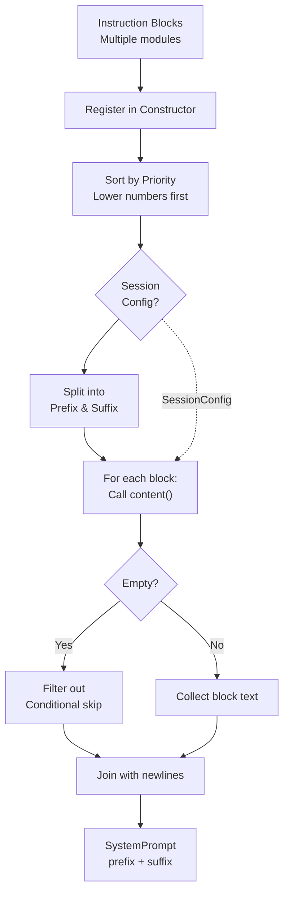

# System Prompt Structure

Claude Code's system prompt is not a static string. It is **dynamically assembled at runtime** by `SystemPromptAssembler` from **numerous separate instruction blocks**, organized into a cacheable prefix and a session-specific suffix.

## Assembly Pipeline

```mermaid
flowchart TB
    subgraph AssemblerInput["SystemPromptAssembler Inputs"]
        Blocks["InstructionBlock modules"]
        Config["Session Config<br/>(model, permissions, features)"]
        MCP["MCP Server Connections<br/>(dynamic tool schemas)"]
        Hooks["User Hooks<br/>(.claude/settings.json)"]
        Repo["Repository Context<br/>(git status, project type)"]
        Flags["GrowthBook Feature Flags<br/>(tengu_* prefix)"]
    end

    subgraph Assembly["assembleSystemPrompt()"]
        direction TB
        Step1["1. buildIdentityBlock()"]
        Step1 --> Step2["2. buildToolDefinitions()<br/>14-17K tokens"]
        Step2 --> Step3["3. buildSafetyRules()"]
        Step3 --> Step4["4. buildTaskInstructions()<br/>12 instruction blocks"]
        Step4 --> Step5["5. buildGitProtocol()"]
        Step5 --> Step6["6. buildToneDirectives()"]
        Step6 --> Step7["7. buildOutputRules()"]

        Step7 --> Boundary["═══ CACHE BOUNDARY ═══<br/>cache_control: { type: 'ephemeral' }"]

        Boundary --> Step8["8. buildMCPToolSchemas()<br/>(dynamic per session)"]
        Step8 --> Step9["9. buildHookInstructions()"]
        Step9 --> Step10["10. buildRepoContext()"]
        Step10 --> Step11["11. buildSystemReminders()"]
        Step11 --> Step12["12. buildMemoryMd()"]
    end

    AssemblerInput --> Assembly

    subgraph Output["Assembled System Prompt"]
        Prefix["CACHED PREFIX<br/>~20K tokens<br/>Stable across requests"]
        Suffix["UNCACHED SUFFIX<br/>(DANGEROUS_uncachedSystemPromptSection)<br/>~3-5K tokens, reprocessed each request"]
    end

    Assembly --> Output

    style Boundary fill:#ff6b6b,color:#fff
    style Prefix fill:#2ecc71,color:#fff
    style Suffix fill:#e74c3c,color:#fff
```



## Instruction Blocks: Building the System Prompt

Instruction blocks are the fundamental building blocks of Claude Code's system prompt. Each block encapsulates a single semantic instruction or capability: identity, tool usage rules, git protocol, safety rules, and more. Blocks are organized by metadata that controls how they fit into the final assembled prompt:

- Each block has a **category identifier** (e.g., `identity`, `tool-usage`)
- Each is marked for either the **cached prefix** (stable across requests) or **uncached suffix** (reprocessed per request)
- Each has a **priority level** that determines its position in the final prompt (0 = highest priority, rendered first)
- Each includes an **estimated token count** for budgeting purposes
- Each has conditional logic to include or exclude itself based on session configuration (useful for feature gates like "only include git protocol if in a git repository")

All blocks are registered at startup and sorted by priority. The assembler concatenates them in order, allowing features to be toggled on/off without modifying the core assembly logic. Tool-related blocks are dynamically injected with the current available tools (14–17K tokens of JSON schemas). Identity and other foundational blocks always render. This modular design allows the codebase to scale efficiently: adding a new instruction capability is just adding a new block, not refactoring the core assembly logic.


### Block Registration and Assembly

The system prompt assembler orchestrates the assembly of the complete system prompt. At initialization, all instruction blocks are registered into a central list. The blocks cover diverse concerns: foundational identity (who Claude Code is), capability boundaries (what tools are available), safety constraints (what risks to avoid), execution patterns (how to approach tasks), and runtime state (current repository, git status, available MCP servers).

The assembly process follows a predictable, repeatable sequence:

1. **Initialization**: All instruction blocks are loaded and registered at startup
2. **Sorting**: Blocks are sorted by priority (lower numbers first), ensuring foundational blocks like identity appear before specialized ones like agent guidance
3. **Filtering by section**: Blocks are split into two groups: prefix blocks (cacheable, ~20K tokens) and suffix blocks (reprocessed per request, ~3–5K tokens)
4. **Content generation**: For each block, the conditional logic determines whether to include the block based on session configuration. If a block is disabled (e.g., "git protocol only if in a git repo"), it's filtered out
5. **Concatenation**: The resulting blocks are joined with section separators to form cohesive markdown sections
6. **Token budgeting**: Total token count is computed for monitoring and resource allocation

The final assembled system prompt has three components: the cacheable prefix (stable across requests), the uncached suffix (regenerated per request), and a total token budget for monitoring.

This design separates concerns: blocks define *what* content should be included, while the assembler defines *how* to combine them. New features can be added as new blocks without touching assembly logic. Conditional inclusion is handled by each block's own logic, keeping dependencies local.




## Token Budget Breakdown

```
TOTAL SYSTEM PROMPT: ~20-25K tokens
│
├── CACHED PREFIX (~20K tokens)
│   │
│   ├── Identity block                    ~100 tokens
│   │   "You are Claude Code, Anthropic's official CLI for Claude"
│   │
│   ├── Tool definitions                  14,000-17,000 tokens  ████████████████
│   │   ├── Read tool schema              ~800 tokens
│   │   ├── Write tool schema             ~400 tokens
│   │   ├── Edit tool schema              ~600 tokens
│   │   ├── Bash tool schema              ~1,200 tokens (largest individual tool)
│   │   ├── Grep tool schema              ~900 tokens
│   │   ├── Agent tool schema             ~2,000 tokens (largest, includes all agent types)
│   │   ├── TodoWrite tool schema         ~1,500 tokens
│   │   └── ... 15+ more tools            ~6,600 tokens
│   │
│   ├── Tool usage rules                  ~800 tokens
│   │   "Do NOT use Bash when dedicated tool is provided"
│   │   "Use Read instead of cat, Edit instead of sed..."
│   │
│   ├── Safety rules                      ~600 tokens
│   │   OWASP awareness, security testing policy
│   │
│   ├── Task execution (12 instructions)  ~1,200 tokens
│   │   "Read before modifying", "Don't add unnecessary features"
│   │   "Three similar lines > premature abstraction"
│   │
│   ├── Git protocols                     ~1,500 tokens
│   │   Commit protocol, PR protocol, safety rules
│   │
│   ├── Tone & output style              ~400 tokens
│   │   "Go straight to the point", "No emojis"
│   │
│   └── Agent guidance                    ~500 tokens
│       When to use Agent tool, how to brief agents
│
│   ═══════════ CACHE BOUNDARY ═══════════
│
└── UNCACHED SUFFIX (~3-5K tokens, variable)
    │
    ├── MCP tool schemas                  0-3,000 tokens (depends on connections)
    ├── Hook instructions                 0-500 tokens
    ├── Repository context                ~200 tokens
    │   Platform, shell, git status
    ├── System reminders                  ~500 tokens
    │   Available deferred tools, skills
    └── MEMORY.md contents                500-1,000 tokens
```

## The `DANGEROUS_uncachedSystemPromptSection`

The suffix section is explicitly named to signal its cache implications to developers. The `DANGEROUS_` prefix is a deliberate naming choice that warns: anything added to the suffix is reprocessed on every API call, adding content here breaks cache efficiency, and developers should think carefully before putting anything in the suffix. This naming convention serves as a constant reminder that the suffix has a direct performance and cost impact, since everything in the suffix bypasses prompt caching.

## Conditional Blocks

Many instruction blocks are conditionally included based on configuration. For example, the git protocol block only renders if the user is in a git repository. The agent system block only includes agent guidance if agents are enabled in the session. The undercover mode block only appears when the system is operating in an open-source repository context. Each block's conditional logic is self-contained—blocks evaluate their own conditions rather than requiring the assembler to manage complex inclusion/exclusion rules.

## Cache Boundary Design Principles

The placement of each instruction block (prefix vs suffix) follows these rules:

| Principle | Rule | Reason |
|-----------|------|--------|
| **Stability** | Content that doesn't change between requests → prefix | Maximize cache hit rate |
| **Frequency** | Rarely-changing content → prefix | Even if it *can* change, if it seldom does, cache wins |
| **Dynamism** | Content that changes per-session → suffix | MCP tools, hooks, repo state |
| **Size** | Large stable content → prefix first | Tool schemas (14-17K tokens) benefit most from caching |
| **Risk** | Content whose change breaks the cache → suffix | Moving something to prefix that changes often is worse than never caching it |

The result: **60-70% of the system prompt is cached**, with the most token-expensive component (tool definitions) always in the cached prefix.
