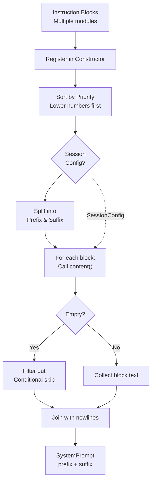

# System Prompt Structure

Claude Code's system prompt is not a static string. It is **dynamically assembled at runtime** by `SystemPromptAssembler` from **numerous separate instruction blocks**, organized into a cacheable prefix and a session-specific suffix.

## Assembly Pipeline

```mermaid
flowchart TB
    subgraph AssemblerInput["SystemPromptAssembler Inputs"]
        Blocks["InstructionBlock modules"]
        Config["Session Config<br/>(model, permissions, features)"]
        MCP["MCP Server Connections<br/>(dynamic tool schemas)"]
        Hooks["User Hooks<br/>(.claude/settings.json)"]
        Repo["Repository Context<br/>(git status, project type)"]
        Flags["GrowthBook Feature Flags<br/>(tengu_* prefix)"]
    end

    subgraph Assembly["assembleSystemPrompt()"]
        direction TB
        Step1["1. buildIdentityBlock()"]
        Step1 --> Step2["2. buildToolDefinitions()<br/>14-17K tokens"]
        Step2 --> Step3["3. buildSafetyRules()"]
        Step3 --> Step4["4. buildTaskInstructions()<br/>12 instruction blocks"]
        Step4 --> Step5["5. buildGitProtocol()"]
        Step5 --> Step6["6. buildToneDirectives()"]
        Step6 --> Step7["7. buildOutputRules()"]

        Step7 --> Boundary["═══ CACHE BOUNDARY ═══<br/>cache_control: { type: 'ephemeral' }"]

        Boundary --> Step8["8. buildMCPToolSchemas()<br/>(dynamic per session)"]
        Step8 --> Step9["9. buildHookInstructions()"]
        Step9 --> Step10["10. buildRepoContext()"]
        Step10 --> Step11["11. buildSystemReminders()"]
        Step11 --> Step12["12. buildMemoryMd()"]
    end

    AssemblerInput --> Assembly

    subgraph Output["Assembled System Prompt"]
        Prefix["CACHED PREFIX<br/>~20K tokens<br/>Stable across requests"]
        Suffix["UNCACHED SUFFIX<br/>(DANGEROUS_uncachedSystemPromptSection)<br/>~3-5K tokens, reprocessed each request"]
    end

    Assembly --> Output

    style Boundary fill:#ff6b6b,color:#fff
    style Prefix fill:#2ecc71,color:#fff
    style Suffix fill:#e74c3c,color:#fff
```



## Source Module: InstructionBlocks

Each instruction block is a separate TypeScript module. Instruction blocks are the fundamental building blocks of Claude Code's system prompt. Each block encapsulates a single semantic instruction or capability: identity, tool usage rules, git protocol, safety rules, and more. It is packaged as a reusable, independently-versioned component.

The core structure of an instruction block consists of metadata that controls registration and assembly:

- **id**: A unique identifier for the block (e.g., `'identity'`, `'tool-usage'`)
- **section**: Either `'prefix'` (cached) or `'suffix'` (reprocessed per request)
- **priority**: A numeric ordering that determines the block's position in the final prompt (0 = highest priority, rendered first)
- **tokens**: An estimated token count for budgeting (approximately 100 tokens for identity, ~800 for tool definitions)
- **content()**: A function that generates the block's text. It receives a `SessionConfig` object and can conditionally return an empty string to skip the block entirely (useful for feature gates and environment checks)

Blocks are registered into a central registry at startup. The assembler then sorts all blocks by priority, filters them by session configuration, and concatenates them in priority order. This design allows features to be toggled on/off without modifying the core assembly logic.

For example, the git protocol block conditionally includes instructions only if the user is in a git repository. Tool-related blocks are dynamically injected with the current available tools (14–17K tokens of JSON schemas). Identity and other foundational blocks always render. By centralizing all instruction blocks in a module directory with consistent structure, the codebase scales efficiently without becoming unwieldy.


### Block Registration and Assembly

The SystemPromptAssembler class orchestrates the assembly of the complete system prompt. At initialization, it registers all instruction blocks into a central list. The blocks cover diverse concerns: foundational identity (who Claude Code is), capability boundaries (what tools are available), safety constraints (what risks to avoid), execution patterns (how to approach tasks), and runtime state (current repository, git status, available MCP servers).

The assembly process follows a predictable, repeatable sequence:

1. **Initialization**: All instruction blocks are loaded and registered in the assembler constructor
2. **Sorting**: Blocks are sorted by their `priority` field (lower numbers first), ensuring that foundational blocks like identity appear before specialized ones like agent guidance
3. **Filtering by section**: Blocks are split into two groups: prefix blocks (cacheable, ~20K tokens) and suffix blocks (reprocessed per request, ~3–5K tokens)
4. **Content generation**: For each block, the `content()` function is called with the current `SessionConfig`. If the function returns an empty string, the block is filtered out (useful for conditional features and permission checks)
5. **Concatenation**: The resulting blocks are joined with `'\n\n'` separators to form cohesive markdown sections
6. **Token budgeting**: Total token count is computed for monitoring and debugging

The assembly result is a `SystemPrompt` object with three fields: `prefix` (the cacheable portion), `suffix` (the uncached portion), and `totalTokens` (the full token budget consumed).

This design separates concerns: blocks define *what* content should be included, while the assembler defines *how* to combine them. New features can be added as new blocks without touching assembly logic. Conditional inclusion (e.g., "only include git protocol if in a git repo") is handled by returning an empty string from the block's `content()` function, keeping logic local to each block.




## Token Budget Breakdown

```
TOTAL SYSTEM PROMPT: ~20-25K tokens
│
├── CACHED PREFIX (~20K tokens)
│   │
│   ├── Identity block                    ~100 tokens
│   │   "You are Claude Code, Anthropic's official CLI for Claude"
│   │
│   ├── Tool definitions                  14,000-17,000 tokens  ████████████████
│   │   ├── Read tool schema              ~800 tokens
│   │   ├── Write tool schema             ~400 tokens
│   │   ├── Edit tool schema              ~600 tokens
│   │   ├── Bash tool schema              ~1,200 tokens (largest individual tool)
│   │   ├── Grep tool schema              ~900 tokens
│   │   ├── Agent tool schema             ~2,000 tokens (largest, includes all agent types)
│   │   ├── TodoWrite tool schema         ~1,500 tokens
│   │   └── ... 15+ more tools            ~6,600 tokens
│   │
│   ├── Tool usage rules                  ~800 tokens
│   │   "Do NOT use Bash when dedicated tool is provided"
│   │   "Use Read instead of cat, Edit instead of sed..."
│   │
│   ├── Safety rules                      ~600 tokens
│   │   OWASP awareness, security testing policy
│   │
│   ├── Task execution (12 instructions)  ~1,200 tokens
│   │   "Read before modifying", "Don't add unnecessary features"
│   │   "Three similar lines > premature abstraction"
│   │
│   ├── Git protocols                     ~1,500 tokens
│   │   Commit protocol, PR protocol, safety rules
│   │
│   ├── Tone & output style              ~400 tokens
│   │   "Go straight to the point", "No emojis"
│   │
│   └── Agent guidance                    ~500 tokens
│       When to use Agent tool, how to brief agents
│
│   ═══════════ CACHE BOUNDARY ═══════════
│
└── UNCACHED SUFFIX (~3-5K tokens, variable)
    │
    ├── MCP tool schemas                  0-3,000 tokens (depends on connections)
    ├── Hook instructions                 0-500 tokens
    ├── Repository context                ~200 tokens
    │   Platform, shell, git status
    ├── System reminders                  ~500 tokens
    │   Available deferred tools, skills
    └── MEMORY.md contents                500-1,000 tokens
```

## The `DANGEROUS_uncachedSystemPromptSection`

The source code uses an explicitly named variable for the suffix:

```typescript
// The suffix is intentionally named to draw attention to its cache implications
const DANGEROUS_uncachedSystemPromptSection = buildSuffix(config);

// This naming convention serves as a warning to developers:
// "Anything added here is reprocessed on EVERY API call"
// "Adding content here breaks cache efficiency"
// "Think carefully before putting anything in the suffix"
```

The `DANGEROUS_` prefix is a deliberate naming choice. It warns developers that adding content to the suffix has a direct performance and cost impact, since everything in the suffix bypasses prompt caching.

## Conditional Blocks

Many instruction blocks are conditionally included based on configuration:

```typescript
// Examples of conditional inclusion
const planModeBlock: InstructionBlock = {
  id: 'plan-mode',
  section: 'prefix',
  content: (config) => {
    if (!config.planMode) return '';  // Skip entirely if not in plan mode
    return `## Plan Mode\nYou are currently in plan mode...`;
  },
};

const agentBlock: InstructionBlock = {
  id: 'agent-system',
  section: 'prefix',
  content: (config) => {
    // Include agent instructions only if agents are available
    if (config.disableAgents) return '';
    return `## Using the Agent tool\n...`;
  },
};

const undercoverBlock: InstructionBlock = {
  id: 'undercover',
  section: 'prefix',
  content: (config) => {
    if (!config.undercoverMode) return '';
    return `You are operating UNDERCOVER in a PUBLIC/OPEN-SOURCE repository.
Do not mention: ${INTERNAL_CODENAMES.join(', ')}...`;
  },
};
```

## Cache Boundary Design Principles

The placement of each instruction block (prefix vs suffix) follows these rules:

| Principle | Rule | Reason |
|-----------|------|--------|
| **Stability** | Content that doesn't change between requests → prefix | Maximize cache hit rate |
| **Frequency** | Rarely-changing content → prefix | Even if it *can* change, if it seldom does, cache wins |
| **Dynamism** | Content that changes per-session → suffix | MCP tools, hooks, repo state |
| **Size** | Large stable content → prefix first | Tool schemas (14-17K tokens) benefit most from caching |
| **Risk** | Content whose change breaks the cache → suffix | Moving something to prefix that changes often is worse than never caching it |

The result: **60-70% of the system prompt is cached**, with the most token-expensive component (tool definitions) always in the cached prefix.
