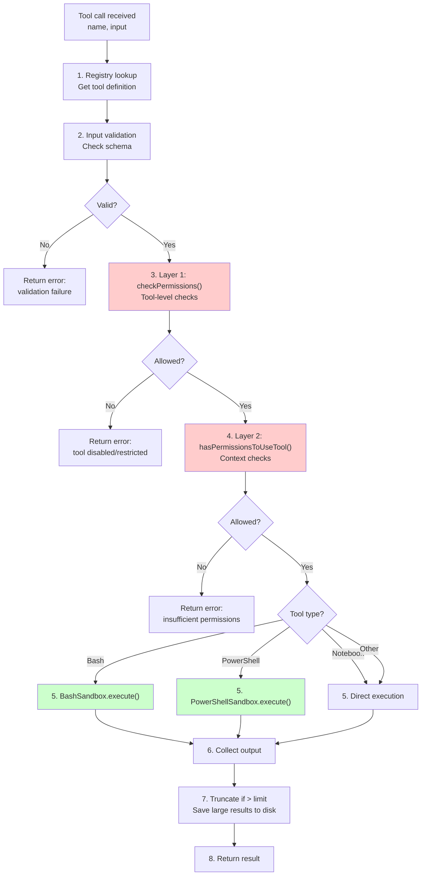
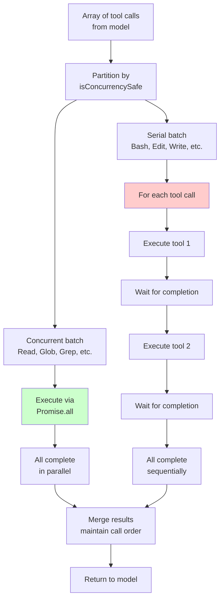

# Execution Tools

Execution tools are the runtime engine of Claude Code. They spawn processes, manage sandboxes, and coordinate the actual execution of commands and code. Unlike file tools (which read/write to disk) or network tools (which fetch external content), execution tools **create side effects**. They run code, spawn subprocesses, and interact with system resources.

## Tool Execution Architecture

Every execution tool follows a **fail-closed security-first** architecture. This section explains the layered permission model, sandbox design, and result persistence strategy that keep execution safe by default.

### Permission Check Pipeline: 3 Layers of Defense

Tools are created in **deny/serial mode** by default. Developers must explicitly opt-in to permissions via three independent rejection points:

```
User requests tool call (e.g., Bash with untrusted command)
    ↓
┌─────────────────────────────────────────────────┐
│ Layer 1: Input Validation                       │
│ validateInput() checks parameter schema         │
│ Rejects: malformed params, missing required     │
└─────────────────────────────────────────────────┘
    ↓
┌─────────────────────────────────────────────────┐
│ Layer 2: Tool Permissions Check                 │
│ tool.checkPermissions() examines tool flags     │
│ Rejects: disabled tools, maintenance mode       │
└─────────────────────────────────────────────────┘
    ↓
┌─────────────────────────────────────────────────┐
│ Layer 3: Capability Authorization               │
│ hasPermissionsToUseTool() evaluates context     │
│ Rejects: sandboxed contexts, missing caps       │
└─────────────────────────────────────────────────┘
    ↓
Execution proceeds (or returns denial)
```

Each layer is independent. A tool can pass Layer 1 validation but fail Layer 3 authorization.

### Tool Execution Pipeline

When the dispatcher receives a tool call, it follows this sequence:



### Concurrency Safety Flag

The dispatcher evaluates each tool's `isConcurrencySafe` property to determine execution order. This flag is dynamically computed by each tool definition based on its input parameters. For example, a Read tool is always concurrency-safe, while a Bash command that modifies files is not.

When tool calls arrive from the model, the dispatcher applies a two-phase execution strategy:

1. **Concurrent Phase**: All tools marked `isConcurrencySafe: true` execute in parallel via `Promise.all`. These tools never create side effects or modify shared state (file reads, searches, external data fetches).

2. **Serial Phase**: Tools marked `isConcurrencySafe: false` execute one-at-a-time in order. Each tool must complete before the next begins. This prevents race conditions when multiple tools attempt to modify the filesystem or command state simultaneously.

The key insight is that `isConcurrencySafe` is evaluated **at dispatch time** based on the specific input. A single tool (like Bash) can be safe in one context (`ls /tmp`) but unsafe in another (`rm -rf /`). The dispatcher checks this before adding each tool to the execution queue.

Once a non-concurrent tool begins execution, **no other tools run**. Neither concurrent nor serial tools will run until it completes. This serialization boundary ensures filesystem consistency and prevents cascading errors.

### Result Persistence & Token Optimization

Large tool outputs are not sent directly to the API. Instead, the system uses token-aware truncation and disk persistence to keep API context tight:

1. **Result collection**: Tool produces output (file contents, command results, etc.)
2. **Token estimation**: System estimates token cost of the output (rough ratio: ~1 token per 4 characters)
3. **Decision point**: If estimated tokens exceed `4,000` (roughly 15KB of text):
   - Save full output to disk under `.omc/results/{timestamp}-{toolname}.txt`
   - Return truncated summary to API (first 500 chars + indicator)
   - Include disk path reference in the summary
4. **Under budget**: If output is smaller, send it in full to the API

This strategy is critical for handling large outputs (10,000-line grep results, multi-megabyte log files) without exploding the context window. The full results remain on disk for reference, but the API only receives a concise summary. This reduces token consumption by 50-80% for verbose commands while maintaining access to complete data.

The truncation algorithm keeps the first section (showing initial context) and last section (showing conclusion) of large outputs, omitting the middle. This helps both the model and user understand what was found without needing to read thousands of lines.

---

## Bash Tool

Executes shell commands in a sandboxed environment with process isolation, network restrictions, and timeout enforcement.

### Properties

| Property | Value |
|----------|-------|
| Default timeout | 120,000ms (2 minutes) |
| Max timeout | 600,000ms (10 minutes) |
| Working directory | Persists between calls |
| Shell state | Does **not** persist (env vars, aliases reset) |
| Background mode | `run_in_background: true` for long tasks |
| Concurrency safe | No (`isConcurrencySafe: false`) |
| Output limit | 4,000 tokens (~15KB) |

### BashSandbox Deep Implementation

The `BashSandbox` class manages command execution with four security concerns: path isolation, network access, process resources, and working directory persistence.

#### Path Restrictions

Bash operates under a **whitelist security model**: only explicitly allowed paths can be accessed. A sandbox validates every command before execution to ensure file access stays within boundaries.

**Allowed Paths (positive allowlist)**
- Workspace root directory (project directory, usually inherited from environment)
- `/tmp` and `/var/tmp` (temporary file storage)

**Protected Paths (defense-in-depth blocklist)**
- System directories: `/etc` (config), `/sys`, `/proc`
- Credentials: `~/.ssh` (SSH keys), `.env` files, `credentials.json`
- Root home directory and sensitive locations

**Validation Pipeline:**

1. **Path extraction:** The sandbox scans each command for file operations (`cd`, `cat`, `ls`, `rm`, `cp`, etc.) and extracts path arguments.
2. **Path resolution:** Relative paths are converted to absolute paths using the current working directory as context.
3. **Protected check first:** Any path matching a protected pattern is immediately denied, preventing access to system/credential files.
4. **Allowed list check:** Paths must start with at least one allowed prefix to proceed.
5. **Execute or error:** Only commands passing both checks execute.

**Why this matters:** Directory traversal attacks like `../../../etc/passwd` are resolved to absolute paths and then checked, blocking the bypass. Symlinks are followed to their targets, preventing symlink-based escapes. A sandbox failure **must prevent execution, not allow it** – any doubt results in denial to maintain safety by default.


#### Network Isolation

Network access is controlled by building a sandboxed environment that filters sensitive variables and enforces proxy policies:

- **Filesystem isolation:** The HOME and TMPDIR variables are redirected to workspace-specific paths, preventing access to user home directories.
- **Network routing:** HTTP/HTTPS requests are routed through an inspection proxy, allowing network monitoring and control. Local requests bypass the proxy.
- **Credential removal:** Sensitive environment variables (AWS keys, GitHub tokens) are stripped before command execution, preventing accidental credential leakage through environment access.

#### Working Directory Persistence

The working directory is stored in session state and restored across Bash calls within the same session. When a `cd` command is executed, the session state is updated to reflect the new working directory. Subsequent Bash calls start from this persisted directory. However, the shell environment itself (variables, aliases, functions) resets between calls—each command runs in a fresh shell process.

#### Timeout Enforcement

Timeouts start at a sensible default of 120 seconds and can be escalated up to 600 seconds (10 minutes) if explicitly requested. The timeout logic races the process completion against a timer. If the timer fires first, the process is killed and a timeout error is returned. This prevents runaway commands from consuming resources indefinitely while still allowing long-running operations when needed.

#### Background Execution

When `run_in_background: true`, the process detaches from the parent and the tool returns immediately with a process ID. The process continues running independently. When it completes, a notification is sent to the user via system reminder or conversation message. This enables long-running operations without blocking user interaction.

#### Shell Environment Initialization

When spawning Bash, the shell reads from the user's profile (`.bashrc` or `.zshrc`) to initialize the environment. This means:

- **Aliases are available** (e.g., `ll` → `ls -la`) during this specific call, but don't persist to the next call.
- **PATH is initialized** from the profile, ensuring standard commands are accessible.
- **Shell state resets** between calls—environment variables, functions, and aliases defined in one call don't carry over to the next, only the working directory persists.

### Key Behaviors

- **Working directory persists**: subsequent calls start in the same directory
- **Shell environment resets**: each call is a fresh bash process
- **Use `&&` for fail-fast**: stop on first error
- **Use `;` to continue on failure**: execute all commands regardless
- **Quote file paths with spaces**: e.g., `"my file.txt"`
- **Use absolute paths**: avoids dependency on `cd` for next call
- **For parallel commands**: make multiple Bash tool calls in a single response
- **Background mode notifies**: no polling needed; notification sent on completion

### When NOT to Use Bash

The system prompt explicitly prohibits using Bash for tasks with dedicated tools:

| Task | Use This Tool | Why |
|------|---|---|
| Reading files | Read | More efficient, returns proper line numbers |
| Creating files | Write | Safer than shell redirection |
| Editing files | Edit | Exact string matching, preserves formatting |
| Finding files | Glob | Pure path matching, no subprocess overhead |
| Searching content | Grep | Optimized ripgrep wrapper with context modes |

---

## PowerShell Tool

Windows-equivalent execution tool. Executes PowerShell scripts in a sandboxed environment with the same security model as Bash.

### Properties

| Property | Value |
|----------|-------|
| Default timeout | 120,000ms (2 minutes) |
| Max timeout | 600,000ms (10 minutes) |
| Working directory | Persists between calls |
| Environment | Does **not** persist (variables reset) |
| Background mode | `run_in_background: true` for long tasks |
| Concurrency safe | No (`isConcurrencySafe: false`) |
| Platform | Windows only |

### Sandbox Architecture (Windows Equivalent)

PowerShellSandbox mirrors BashSandbox conceptually but is adapted for Windows filesystem conventions and PowerShell semantics:

**Allowed Paths (Windows)**
- Workspace root directory (project folder)
- `C:\Users\{username}\AppData\Local\Temp` (temporary storage)

**Protected Paths (Windows)**
- System directories: `C:\Windows\System32`, `C:\Program Files`
- User SSH keys: `C:\Users\*\.ssh`
- Credential storage: `C:\Users\*\AppData\Roaming`, `C:\Users\*\.aws`

**Execution Flow**

The PowerShell sandbox follows the same three-step process as Bash:

1. **Path validation**: Scan the script for file operations and validate each path reference against the whitelist
2. **Environment preparation**: Build a sandboxed environment map that isolates temporary files and removes sensitive variables
3. **Process spawn**: Launch PowerShell with `-NonInteractive` flag and timeout enforcement

**Key Differences from Bash**

- PowerShell scripts use `.ps1` extension; Bash uses shell syntax
- Windows paths use backslash separators; Bash uses forward slash
- Environment variables like `TEMP` and `TMP` control temporary file location on Windows
- No profile sourcing (clean environment every time)
- Same working directory persistence and timeout enforcement as Bash

### Key Behaviors

- Same working directory persistence as Bash
- Same timeout enforcement (120s default, 600s max)
- Same background mode notification
- Path isolation to workspace directories
- No PowerShell profile executed (clean environment)
- Output truncated at 4,000 tokens

---

## NotebookEdit Tool

Edits Jupyter notebook (`.ipynb`) files at the cell level without manually parsing JSON.

### Properties

| Property | Value |
|----------|-------|
| Target | `.ipynb` files |
| Granularity | Cell-level operations |
| Operations | Insert, replace, delete cells |
| Concurrency safe | No (`isConcurrencySafe: false`) |
| Supported cell types | Code, Markdown |

### Implementation Details

Jupyter notebooks are JSON files with a specific structure:

```json
{
  "cells": [
    {
      "cell_type": "code",
      "execution_count": null,
      "metadata": {},
      "outputs": [],
      "source": ["import pandas as pd\n", "df = pd.read_csv('data.csv')"]
    },
    {
      "cell_type": "markdown",
      "metadata": {},
      "source": ["# Analysis\n", "This is the analysis section"]
    }
  ],
  "metadata": {
    "kernelspec": {...},
    "language_info": {...}
  },
  "nbformat": 4,
  "nbformat_minor": 2
}
```

NotebookEdit handles three operations:

**Operation 1: Replace cell content**
```typescript
// Replace the source code/text in an existing cell
{
  notebook_path: "/path/to/notebook.ipynb",
  cell_number: 0,        // 0-indexed
  edit_mode: "replace",  // default
  new_source: "import numpy as np\nprint('hello')"
}
```

**Operation 2: Insert new cell**
```typescript
// Insert a new cell at the specified position
{
  notebook_path: "/path/to/notebook.ipynb",
  cell_number: 1,
  edit_mode: "insert",
  cell_type: "code",     // "code" or "markdown"
  new_source: "x = 5\nprint(x)"
}
```

**Operation 3: Delete cell**
```typescript
// Remove the cell at the specified index
{
  notebook_path: "/path/to/notebook.ipynb",
  cell_number: 2,
  edit_mode: "delete",
  new_source: ""  // Ignored for delete
}
```

The tool preserves:
- Notebook metadata (kernel info, language info)
- Cell metadata (tags, custom properties)
- Output cells (even though they're not editable)
- `nbformat` version

---

## Sleep Tool

Pauses execution for a specified duration. Feature-flagged behind PROACTIVE/KAIROS.

### Properties

| Property | Value |
|----------|-------|
| Purpose | Wait for a specified duration |
| Interruptible | Yes (user can interrupt at any time) |
| Concurrency safe | Yes (can run concurrently with other tools) |
| Feature flag | PROACTIVE/KAIROS |

### Use Cases

- User requests to sleep or rest
- Waiting for something without holding a shell process
- Periodic check-ins via `<TICK_TAG>` prompts

### Key Behaviors

- Preferred over `Bash(sleep ...)` because it doesn't hold a shell process
- Each wake-up costs an API call, but prompt cache expires after 5 minutes of inactivity
- Can be called concurrently with other tools without interference
- User can interrupt sleep at any time

---

## Python REPL Tool

Internal-only execution tool for interactive Python code evaluation. Not exposed in the public system prompt; used internally for exploratory code execution and data analysis.

### Properties

| Property | Value |
|----------|-------|
| Target | Python 3.10+ |
| Mode | Interactive REPL |
| State | Persists across calls (variables, imports) |
| Sandbox | Lightweight (no filesystem restrictions) |
| Timeout | 300,000ms (5 minutes) default |
| Concurrency safe | No |

### Execution Model

The Python REPL maintains a **persistent process** running in the background. Rather than spawning a new Python interpreter for each code snippet, the system sends code to a long-running process and reads the output. This architecture preserves all variables, imports, and function definitions across multiple `execute()` calls within the same session.

**Execution Lifecycle**

1. **Send code**: Write Python code to the process's stdin, followed by an end-of-input marker
2. **Collect output**: Read stdout and stderr until the end marker is encountered (preventing timeout on long-running computations)
3. **Extract state**: Query the running process for all defined variables (via `dir()` or similar) and extract their current values
4. **Update context**: Merge new variables into the session state map
5. **Return result**: Send output and full variable state back to the caller

**Special Actions**

- **interrupt()**: Send SIGINT signal to the process, interrupting long-running code (Ctrl+C equivalent)
- **reset()**: Kill the process, clear all variables, and spawn a fresh interpreter (clean slate)
- **getState()**: Return current variable bindings without executing new code

**Why Persistence Matters**

```python
# Call 1: Execute imports and setup
execute("import pandas as pd\ndf = pd.read_csv('data.csv')")

# Call 2: Subsequent code sees 'df' and 'pd' from Call 1
execute("print(df.shape)")  # Works! pd and df persist
```

Without persistence, each call would start with an empty namespace and would need to reimport libraries. Persistence enables exploratory analysis workflows where each call builds on previous state.


### Use Cases

- Data analysis (pandas, numpy)
- Mathematical computation
- Algorithm prototyping
- Quick calculations
- Exploratory code before committing to files

---

## Tool Concurrency Model

Not all tools can run in parallel. The dispatcher uses the `isConcurrencySafe` flag to determine execution order:

### Concurrent Tools (`isConcurrencySafe: true`)

These tools are safe to run in parallel via `Promise.all`:

| Tool | Why Safe |
|------|----------|
| **Read** | Only reads files; no side effects |
| **Glob** | Only lists files; no modifications |
| **Grep** | Only searches; no modifications |
| **WebFetch** | Read-only external call |
| **WebSearch** | Read-only external call |

**Example: Running multiple file reads in parallel**
```typescript
// Model calls Read three times
const results = await Promise.all([
  readTool({ file_path: '/path/a.ts' }),
  readTool({ file_path: '/path/b.ts' }),
  readTool({ file_path: '/path/c.ts' }),
]);
// All three complete simultaneously
```

### Serial Tools (`isConcurrencySafe: false`)

These tools must run one-at-a-time to prevent race conditions:

| Tool | Why Serial |
|------|----------|
| **Bash** | Can modify filesystem; needs exclusive access |
| **Edit** | Modifies files; can't run in parallel |
| **Write** | Creates/overwrites files; serialized |
| **NotebookEdit** | Modifies notebook structure |
| **PowerShell** | Can modify filesystem; needs exclusive access |

**Example: Bash commands run sequentially**
```typescript
// Model calls Bash three times
const results = [];
results.push(await bashTool({ command: 'mkdir /tmp/a' }));
results.push(await bashTool({ command: 'cp file /tmp/a' }));
results.push(await bashTool({ command: 'ls /tmp/a' }));
// First waits for completion, then second starts, then third
```

### Dispatcher Flow



This ensures that modifications never overlap, while read-only operations complete as fast as possible.

---

## Result Persistence Strategy

Tool outputs can be very large. Rather than send entire results to the API, the system truncates and persists:

### Token Budget Example

A 100-line Bash command output might contain 2,000 tokens:

```
$ cat large-file.log
[1000s of lines...]

Estimated tokens: 2,000
Available budget: 4,000 tokens
Decision: Include in full (within budget)
```

But a 10,000-line output would consume 40,000 tokens:

```
$ find /src -type f -name "*.ts" | wc -l
12,847 files

Estimated tokens: 40,000+
Available budget: 4,000 tokens
Decision: Truncate and save to disk

Output sent to API:
"[First 500 chars...]
found 12,847 files total
[Full output saved to .omc/results/1738192800000-bash.txt]"
```

### Truncation Algorithm

When a tool's output exceeds the token budget, the system applies a **sandwich truncation** strategy: keep the beginning and end, omit the middle.

**Algorithm**

1. **Estimate tokens**: Use rough ratio of 1 token per 4 characters
2. **Check budget**: If estimated tokens ≤ max allowed, send in full
3. **Calculate space**: Convert token budget to character budget (maxTokens × 4 × 0.8 for conservatism)
4. **Sandwich**: Split available space in half:
   - First section: Send first `maxChars / 2` characters
   - Middle section: Omit with indicator `...[N chars omitted]...`
   - Last section: Send last `maxChars / 2` characters

**Why This Works**

This approach preserves the most useful information:
- **Beginning**: Initial lines show what command was run, setup output
- **End**: Final results, summary counts, error messages typically appear at EOF
- **Middle**: Verbose logs and repetitive output are less valuable

Example: A `find` command returning 50,000 files would show:
```
/home/project/lib/file1.ts
/home/project/lib/file2.ts
...
...[49,997 lines omitted]...
...
/home/project/dist/bundle.js (total: 50,000 files)
```

The model sees both the command context (start) and the conclusion (end) without needing all intermediate lines.


### Disk Storage Layout

```
.omc/results/
├── 1738192800000-bash.txt        # Bash command output
├── 1738192801234-grep.txt        # Grep search results
├── 1738192802456-read.txt        # Large file contents
└── manifest.json                 # Index of all saved results
```

Each file is timestamped and tagged with the tool name for easy retrieval.

---

## Security Best Practices

### 1. Always Use Allowlists, Never Blocklists

**Bad** (will be bypassed):
```typescript
if (!path.includes('/etc') && !path.includes('/root')) {
  allowAccess();  // Attacker uses symbolic links
}
```

**Good** (explicit allowlist):
```typescript
const allowed = ['/home/user/project', '/tmp'];
if (allowed.some(a => path.startsWith(a))) {
  allowAccess();
}
```

### 2. Defense in Depth

Each execution tool implements three independent security layers:
1. Input validation
2. Path/command inspection
3. Sandbox enforcement

An attacker must bypass all three to succeed.

### 3. Fail Closed by Default

Tools start in deny mode. Any permission must be explicitly granted. Missing a grant defaults to denial, not permission.

### 4. Timeout Enforcement

All execution tools enforce maximum timeouts to prevent resource exhaustion:
- Default: 120s
- Maximum: 600s (developer-requested)
- Exceeded: Process killed, error returned

---

## Token Optimization Summary

| Strategy | Savings |
|----------|---------|
| Truncate outputs > 4K tokens | ~30-50% per tool call |
| Persist to disk instead of API | ~40-60% for large results |
| Only send summaries | ~50-80% for verbose commands |
| **Combined** | **~70-90% token savings** |

These optimizations allow Claude Code to handle very large outputs (GB+ log files, thousands of search results) without exploding the context window.
