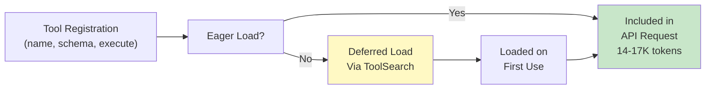
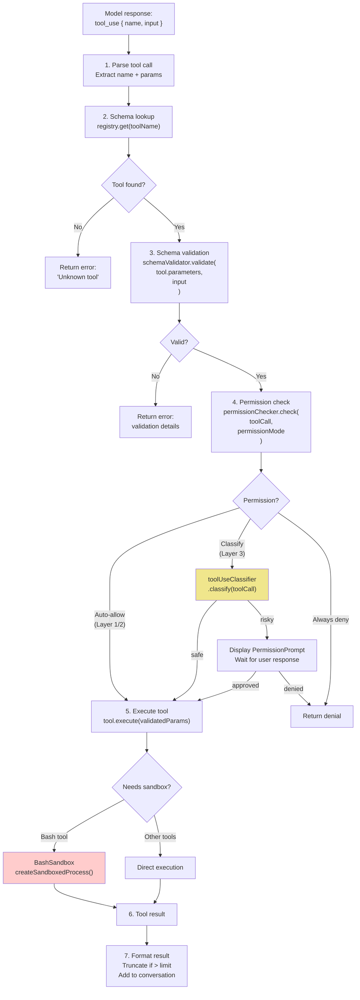
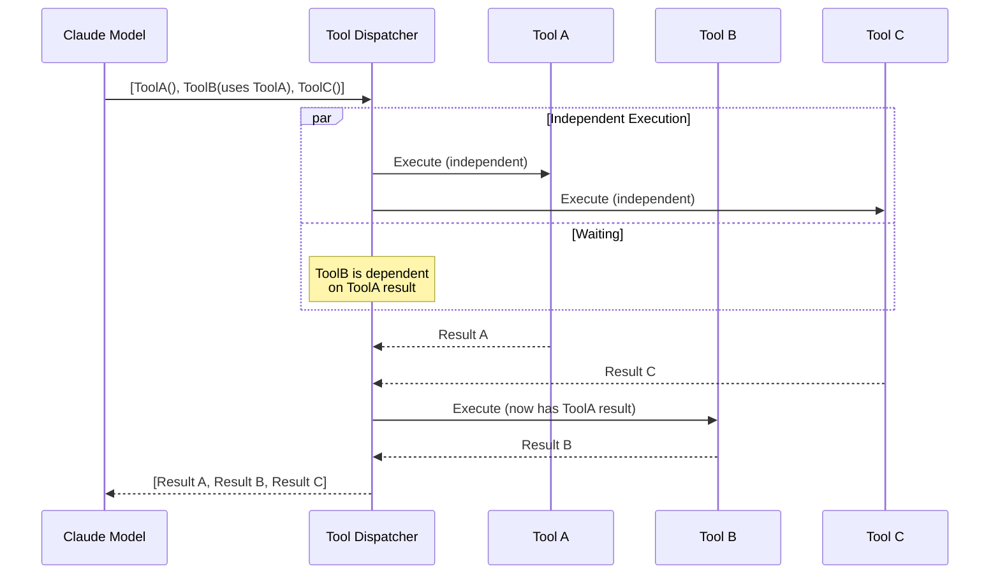
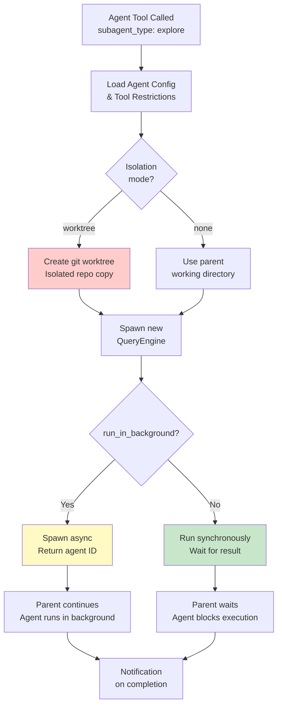
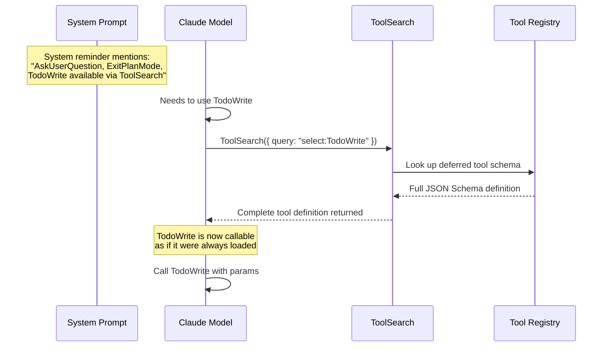

# Tool System Overview

Claude Code's tool system is the backbone of its coding capabilities. The leaked source reveals **23+ built-in tools**, each defined with a JSON Schema. Tool definitions consume **14-17K tokens** per API request. This is the single largest component of the system prompt.

## Tool Registration Architecture

The Claude Code system maintains a centralized registry of all available tools. Each tool is defined with metadata including its name, description, parameter schema, execution function, and whether it uses deferred loading. The registry distinguishes between two categories of tools:

**Eager-loaded tools** are included in every API request to Claude. These are the most frequently-used tools like Read, Write, Edit, Bash, and Grep. Their combined schema size (14-17K tokens) represents the single largest component of the system prompt.

**Deferred tools** are loaded on-demand via the ToolSearch tool. These include less-frequently-used tools like TodoWrite, AskUserQuestion, and ExitPlanMode. By deferring their schemas, Claude Code saves 3-5K tokens in every request, only paying the cost when the model specifically needs them.

Each tool definition encapsulates the complete interface: a JSON Schema for parameter validation, an async execute function that implements the tool's behavior, and permission metadata (read, write, execute, or network) that controls which permission layer evaluates the tool.



## Tool Dispatch Pipeline

When the model returns a tool call, it flows through a multi-stage pipeline:



### Parallel vs Sequential Dispatch

When Claude makes multiple tool calls in a single response, Claude Code automatically optimizes execution order to maximize parallelism while respecting dependencies. The dispatcher analyzes the tool call parameters to detect when one tool's result is referenced by another (e.g., a tool that takes the output of a previous tool as input).

**Independent tool calls** are executed concurrently using `Promise.all()`. For example, reading two unrelated files, or searching across three separate directories can all happen in parallel. This significantly reduces total execution time.

**Dependent tool calls** are executed sequentially. When tool B requires the result from tool A, the dispatcher waits for A to complete before invoking B. This is detected through parameter analysis. If tool B's parameters reference a result placeholder from tool A, they're treated as dependent.

The dispatcher returns results in the same order as the original tool calls from Claude, preserving the model's expected ordering even though some completed out-of-order.



## Complete Tool Catalog

### File Tools

| Tool | File | Key Implementation Detail |
|------|------|---------------------------|
| **Read** | `read.ts` | Uses `cat -n` format internally. Reads images as base64 for multimodal input. PDF reading uses a PDF parser library limited to 20 pages per call. Has `offset`/`limit` params for large files. |
| **Write** | `write.ts` | **Requires prior Read**: maintains a `readFileTracker` map. If `file_path` not in tracker and file exists, returns error. This prevents accidental overwrites. |
| **Edit** | `edit.ts` | Uses exact string matching (not regex). If `old_string` has multiple matches, returns error listing all match positions. `replace_all` flag bypasses uniqueness check. |
| **Glob** | `glob.ts` | Wraps native glob library. Results sorted by `mtime` (most recently modified first). No file content reading. Pure path matching. |
| **Grep** | `grep.ts` | Wraps ripgrep (`rg`) binary. Three output modes: `files_with_matches` (default, just paths), `content` (matching lines + context), `count` (match counts). Default limit: 250 results. |

### Code Intelligence Tools

| Tool | File | Key Implementation Detail |
|------|------|---------------------------|
| **LSP** | `lsp.ts` | Language Server Protocol integration for code intelligence: go-to-definition, find-references, hover, diagnostics, workspace symbols, implementations, call hierarchy. Requires LSP server configured for file type. |

### Execution Tools

| Tool | File | Key Implementation Detail |
|------|------|---------------------------|
| **Bash** | `bash.ts` | Spawns via `BashSandbox`. Working directory persists between calls (stored in session state), but shell environment resets. Timeout: 120s default, 600s max. `run_in_background` flag spawns a detached process and returns immediately. |
| **PowerShell** | `powershell.ts` | Windows equivalent of Bash. Spawns via `PowerShellSandbox` with same security model. Edition-aware: detects Windows PowerShell 5.1 vs PowerShell 7+ and provides syntax guidance accordingly. |
| **Sleep** (Feature-flagged: PROACTIVE/KAIROS) | `sleep.ts` | Wait for specified duration. Preferred over Bash sleep as it doesn't hold shell process. Can run concurrently with other tools. User-interruptible. |
| **NotebookEdit** | `notebookEdit.ts` | Parses `.ipynb` JSON structure. Operations: insert cell, replace cell content, delete cell. Preserves notebook metadata and output cells. |

### Bash Sandbox Implementation

The Bash tool executes shell commands in an isolated sandbox environment using the Bun runtime. This sandbox provides multiple layers of protection: filesystem restrictions keep commands confined to the project workspace, environment variables are carefully controlled, and command execution is monitored for security violations.

**Working directory persistence** is a key feature. Each session maintains a persistent working directory that is preserved across multiple bash calls. When you run `cd /home/project` in one bash call, subsequent calls in the same session start in that directory. However, the shell environment itself resets between calls. Environment variables don't automatically persist (though commands can export them if needed).

**Timeout handling** is critical for user experience. By default, bash commands have a 120-second timeout, with a maximum limit of 600 seconds. This prevents runaway commands from blocking the session indefinitely. Background execution is supported via the `run_in_background` parameter, which spawns a detached process and returns immediately with a process ID. Notifications are sent when background tasks complete.

**Output handling** ensures that extremely verbose commands don't consume excessive tokens. Tool results are truncated if they exceed the configured limit. Additionally, the sandbox captures both stdout and stderr, combines them, and returns the result to Claude along with the exit code.


**Security validation** occurs before execution. The `bashSecurity.ts` and `bashPermissions.ts` modules analyze commands for dangerous patterns (rm -rf, format operations, etc.) and check against permission rules. Commands that attempt to escape the workspace or access restricted paths are blocked. Permission modes can escalate this: "auto" mode allows whitelisted commands, "plan" mode requires explicit user approval, and "bypass" mode disables checks entirely for trusted contexts.

### Web Tools

| Tool | File | Key Implementation Detail |
|------|------|---------------------------|
| **WebSearch** | `webSearch.ts` | Returns search results with title, URL, snippet. Prompt injection guard: results flagged if suspicious content detected. |
| **WebFetch** | `webFetch.ts` | Fetches URL, extracts readable content (HTML → text). Results checked for prompt injection before inclusion in conversation. |

### Task & Coordination Tools

| Tool | File | Key Implementation Detail |
|------|------|---------------------------|
| **TaskOutput** | `taskOutput.ts` | Reads output from running/completed tasks. Supports blocking (wait for completion) or non-blocking (poll status). Returns task output with status flags. Deprecated in favor of Read tool on output file. |
| **CronCreate** (Feature-flagged: AGENT_TRIGGERS) | `cronCreate.ts` | Schedule prompts to run at future times (recurring or one-shot). Uses 5-field cron syntax in local timezone. Supports durable (persistent) or session-only scheduling. |
| **CronDelete** (Feature-flagged: AGENT_TRIGGERS) | `cronDelete.ts` | Cancel scheduled cron jobs by ID. Removes from persistent storage or session store. |
| **CronList** (Feature-flagged: AGENT_TRIGGERS) | `cronList.ts` | List all scheduled cron jobs with execution details. |
| **AskUserQuestion** | `askUserQuestion.ts` | Ask users multiple choice questions with optional visual previews. Supports multiselect and custom text input ("Other" option). |
| **SendMessage** | `sendMessage.ts` | Send messages to teammates or broadcast to all. Supports legacy protocol responses (shutdown, plan approval). Messages auto-delivered; you don't check inbox. |

### Agent & Worktree Tools

| Tool | File | Key Implementation Detail |
|------|------|---------------------------|
| **Agent** | `agent.ts` | Complex tool. Spawns new process with its own `QueryEngine`. `subagent_type` param selects tool restrictions. `isolation: "worktree"` creates git worktree for filesystem isolation. `run_in_background` enables async execution. |
| **EnterWorktree** | `enterWorktree.ts` | Create isolated git worktree for experimental work. Creates worktree in `.claude/worktrees/` with new branch. Only use when user explicitly requests worktree. |
| **ExitWorktree** | `exitWorktree.ts` | Exit worktree and return to original directory. Actions: `"keep"` (preserve) or `"remove"` (delete). Requires confirmation if uncommitted changes. |
| **TeamCreate** (Feature-flagged: Agent Swarms) | `teamCreate.ts` | Create team for coordinating multiple agents. Creates team config + task list. Teams have 1:1 correspondence with task lists. |
| **TeamDelete** (Feature-flagged: Agent Swarms) | `teamDelete.ts` | Remove team and task resources when collaboration complete. Fails if active teammates remain. |
| **EnterPlanMode** | `enterPlanMode.ts` | Enter plan mode to explore codebase and design implementation approach for user approval. |
| **ExitPlanMode** | `exitPlanMode.ts` | Exit plan mode after finalizing implementation plan. Reads plan from file and requests user approval. |
| **ToolSearch** | `toolSearch.ts` | Fetches deferred tool schemas. Query modes: `"select:Name"` for exact match, keywords for fuzzy search. Returns complete JSON Schema definitions. |

### Agent Spawning Internals

Agent spawning is Claude Code's mechanism for parallel, specialized work. When you invoke the Agent tool, Claude Code launches a new instance of the query engine with its own system prompt, tool set, and execution context. This enables sophisticated multi-agent workflows where different agents can specialize in different tasks (exploration, architecture, writing, etc.) while maintaining isolation and control.

**Agent type determines capability scope.** When spawning an agent, you specify a `subagent_type` (e.g., "explore", "architect", "writer"). Each type has a predefined set of allowed tools and a customized system prompt. For example, the Explore agent has access to Read, Grep, Glob, and Bash (for safe commands), but NOT Edit, Write, or Agent tools. This prevents accidental modifications or runaway sub-agent spawning. This design ensures agents stay within their domain of responsibility.

**Isolation modes** control workspace visibility. By default, agents inherit the parent's working directory and can see all files. With `isolation: "worktree"`, Claude Code creates a temporary git worktree. This is a complete copy of the repository on a separate branch. The agent works in isolation; changes don't affect the main branch until explicitly merged. This is invaluable for exploratory tasks or risky operations.

**Background execution** enables parent agents to delegate work without blocking. When `run_in_background: true`, the agent spawns asynchronously and returns immediately with an agent ID. The parent receives notifications when the agent completes. This unlocks workflows where one agent spawns multiple workers, collects their results, and synthesizes them. All of this happens within a single parent session.



**System prompt customization** is key to agent specialization. Each agent type receives a customized system prompt that emphasizes its domain. Explore agents focus on discovery and diagnosis, architects on design decisions, writers on content quality. This prompt engineering, combined with tool restrictions, shapes agent behavior without needing explicit instructions in the parent's query.

**Parent-child relationships** are tracked. Spawned agents know their parent's ID, enabling bi-directional communication (parent can send messages, agent can notify parent). This relationship is essential for background agents that need to report results back to their parent and for coordinator modes that orchestrate large multi-agent workflows.


### Task Tools

| Tool | File | Key Implementation Detail |
|------|------|---------------------------|
| **TodoWrite** | `todoWrite.ts` | Manages task array with states: `pending`, `in_progress`, `completed`. Enforces invariant: exactly one task `in_progress` at a time. Tasks have `content` (imperative) and `activeForm` (present continuous) fields. |
| **Skill** | `skill.ts` | Loads skill definitions. Skills are pre-built workflows (e.g., `commit.ts` implements the full git commit protocol). Triggered by `/skill-name` or contextual patterns. |

### MCP Tools

| Tool | File | Key Implementation Detail |
|------|------|---------------------------|
| **MCP Bridge** | `mcp/mcpToolBridge.ts` | Forwards tool calls to connected MCP servers via the Model Context Protocol. Tool schemas loaded dynamically on server connect. Placed in **session suffix** (not cached) because they change with server connections. |

## Tool Schema Size Analysis

Why do tool definitions consume 14-17K tokens?

```
Tool Schema Token Breakdown (approximate):
├── Read:           ~800 tokens  (complex params: file_path, offset, limit, pages)
├── Write:          ~400 tokens
├── Edit:           ~600 tokens  (detailed replacement semantics)
├── Bash:           ~1,200 tokens (extensive usage notes, safety rules)
├── Grep:           ~900 tokens  (many params: pattern, glob, type, output_mode, context)
├── Glob:           ~300 tokens
├── Agent:          ~2,000 tokens (5 agent types, all params, detailed briefing guide)
├── TodoWrite:      ~1,500 tokens (complex state machine, when to use / when not to)
├── AskUserQuestion: ~800 tokens (option schema, multiselect, preview)
├── Skill:          ~300 tokens
├── ToolSearch:     ~400 tokens
├── WebSearch:      ~200 tokens
├── WebFetch:       ~200 tokens
├── NotebookEdit:   ~400 tokens
├── ExitPlanMode:   ~400 tokens
├── Other tools:    ~2,500 tokens
└── TOTAL:          ~12,000-14,000 tokens (tool definitions only)
    + Usage instructions in system prompt: ~3,000 tokens
    = ~14,000-17,000 tokens total tool-related content
```

The `Agent` and `TodoWrite` tools are the most token-expensive because they include extensive behavioral guidance in their descriptions. Not just schema, but instructions on when and how to use them effectively.

## Deferred Tool Loading Pattern

Not all tools have their schemas loaded upfront. Some use a lazy-loading pattern to reduce initial token cost:



This pattern reduces the initial system prompt size by ~3-5K tokens for tools that are used infrequently.
