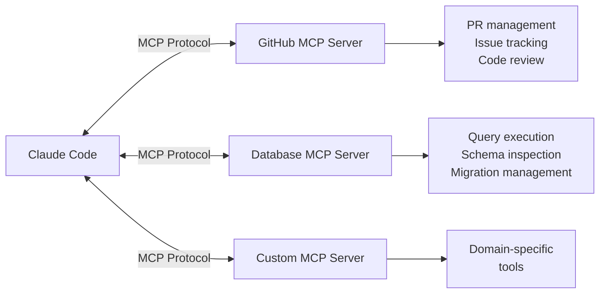
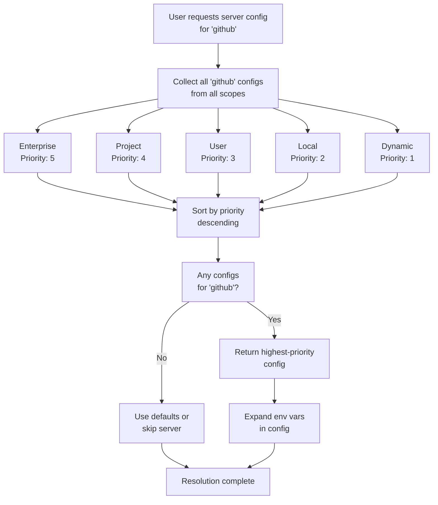
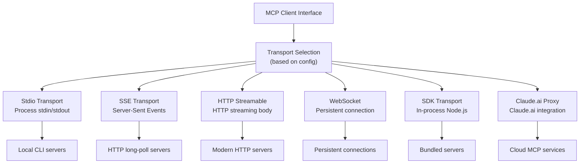
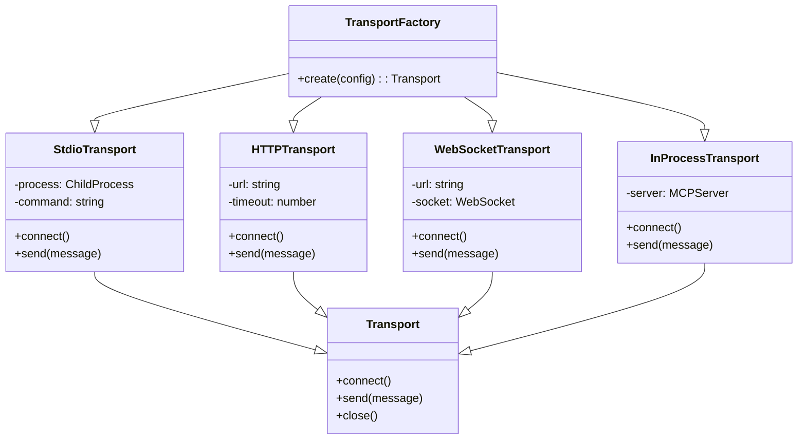
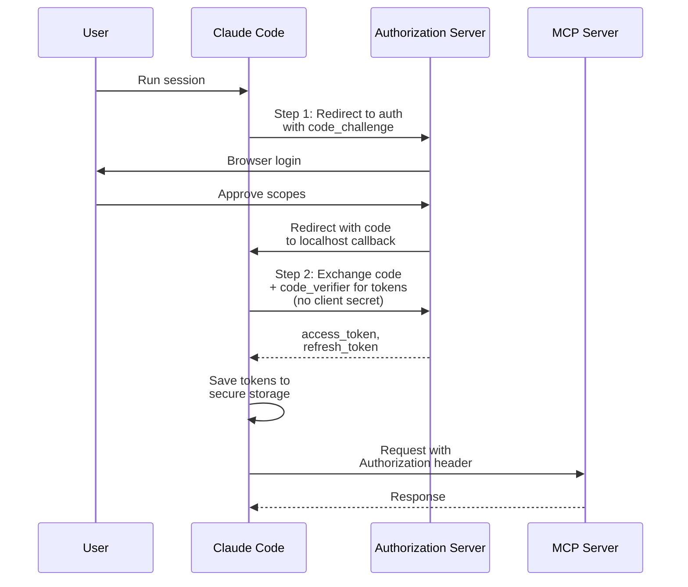
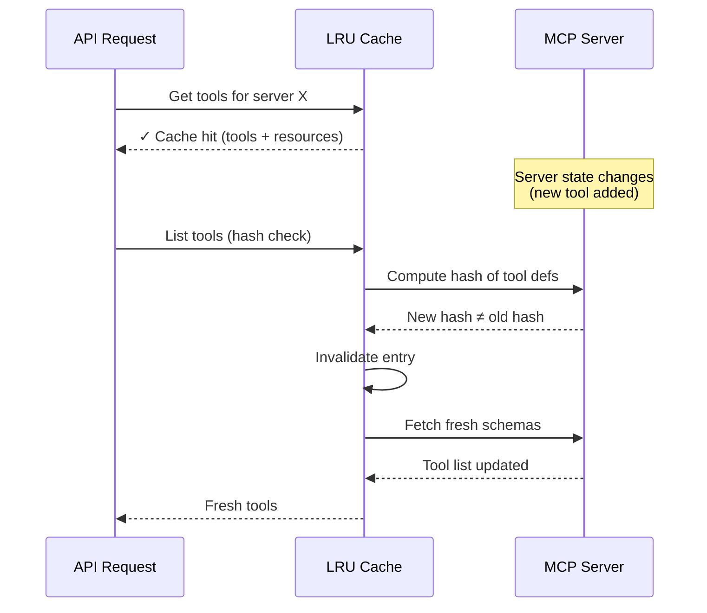
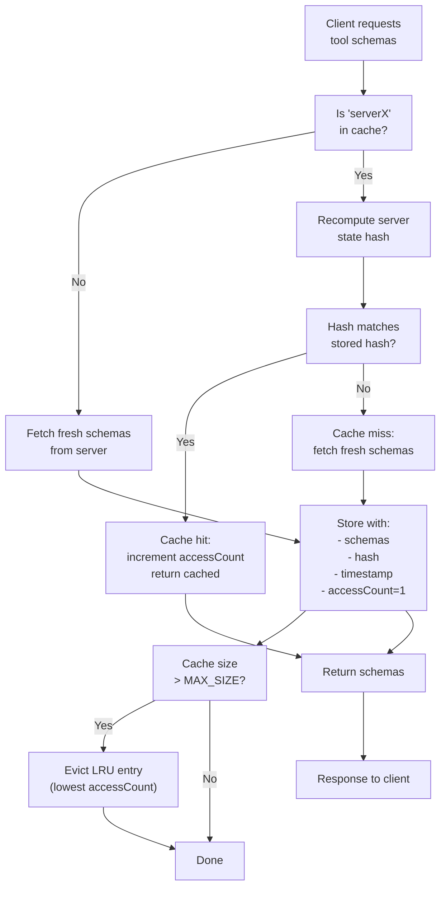
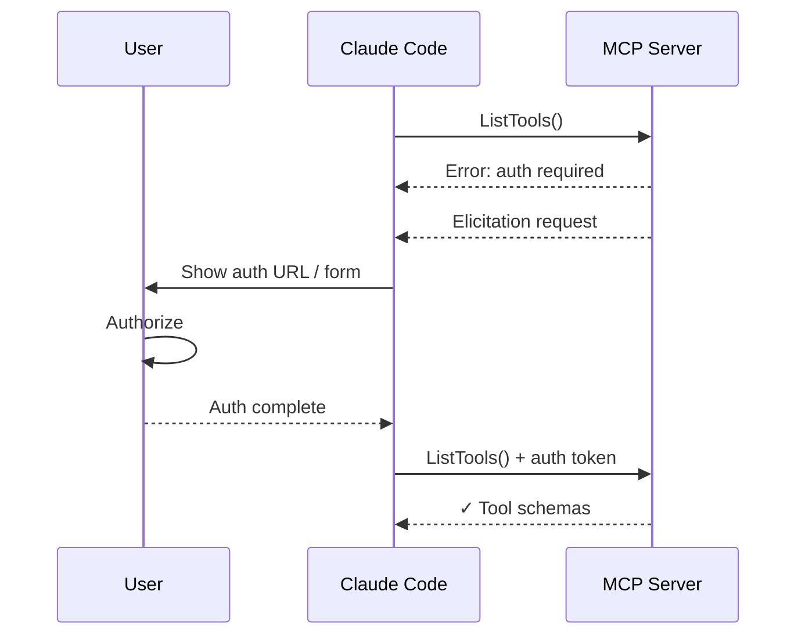
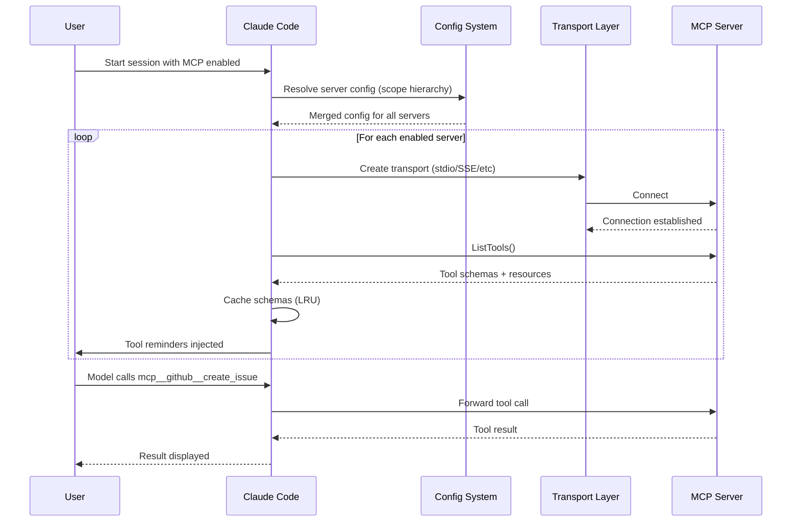

# MCP Tools

## Model Context Protocol Integration

Claude Code integrates with [Model Context Protocol (MCP)](https://modelcontextprotocol.io/) servers to dynamically extend its tool capabilities. The implementation is a full MCP client with multi-transport support, hierarchical configuration, and sophisticated caching strategies.

### How MCP Works in Claude Code



### Key Properties

| Property | Value |
|----------|-------|
| Protocol | Model Context Protocol (MCP) |
| Loading | Dynamic. Tools appear when server connects |
| Placement | Tool schemas added to session suffix (not cached) |
| Namespace | Tools prefixed with `mcp__servername__toolname` |
| Transport | Multiple transports: stdio, SSE, HTTP Streamable, WebSocket, SDK, Claude.ai proxy |
| Config | Hierarchical scopes: Enterprise > Project > User > ClaudeAI > Dynamic |

---

## MCP Architecture Overview

The MCP client in Claude Code is a sophisticated multi-layer system:

1. **Server Management**: Discovery, lifecycle, configuration
2. **Transport Abstraction**: Multiple protocols unified under a single interface
3. **Tool Schema Loading**: Dynamic discovery with deferred loading pattern
4. **Resource Access**: Read-only resource discovery via MCP Resources
5. **Caching Layer**: LRU cache with hash-based invalidation
6. **Authentication**: OAuth + XAA token exchange for secure auth
7. **Elicitation Handling**: User input requests from servers
8. **Session Integration**: Tool schemas in session suffix for cache correctness

---

## Configuration Hierarchy (7 Scopes)

MCP servers are configured using a hierarchical scope system where upper scopes take precedence. This design enforces a principle: **organizational policies constrain personal choices, while allowing flexibility within those bounds**.

```
Enterprise (highest priority)   ← Organization mandate
    ↓
Project (.claude/settings.json)  ← Team agreement
    ↓
User (~/.claude/settings.json)   ← Personal choice
    ↓
ClaudeAI (workspace settings)    ← Web UI
    ↓
Dynamic (runtime params)         ← Temporary override
```

**Scope Characteristics:**

| Scope | Location | Override Behavior | Use Case | Why |
|-------|----------|-------------------|----------|-----|
| **Enterprise** | Organization policy | Cannot be overridden | Security policies, compliance requirements | Prevents individual override of org mandates |
| **Project** | `.claude/settings.json` | Overrides User/ClaudeAI/Dynamic | Team standards, repo-specific servers | Ensures consistent tooling across team |
| **User** | `~/.claude/settings.json` | Overrides ClaudeAI/Dynamic | Personal preferences, local tools | Allows personalization within org bounds |
| **ClaudeAI** | Claude.ai workspace | Overrides Dynamic | Web interface settings | Enables web-based configuration |
| **Dynamic** | Runtime params | Lowest priority | Temporary configuration | One-off overrides for testing/debugging |

This hierarchy balances **security and control** (enterprise/project scopes lock down critical settings) with **usability** (user/dynamic scopes allow personalization).

### Configuration Resolution

Claude Code resolves MCP server configurations by merging all scopes and selecting the highest-priority version. When multiple scopes define the same server, the resolution algorithm compares scope priorities and uses the one with the highest rank.

The configuration resolution process is deterministic: for each server name, Claude Code collects all matching configurations across all enabled scopes (enterprise, project, user, local, claudeai, dynamic), then sorts them by scope priority and returns the first match. This ensures consistent behavior regardless of load order or initialization sequence.

Scope priority follows organizational hierarchy: Enterprise (highest) takes precedence over Project, which overrides User, which overrides ClaudeAI, which overrides Dynamic (lowest). This design reflects the principle that organizational policies should constrain personal choices, while allowing users flexibility within those bounds.

Environment variables in server configurations are expanded at resolution time. Missing variables generate warnings but don't prevent server startup. The actual connection attempt will catch true errors (e.g., a missing `GITHUB_TOKEN` when the server tries to authenticate).




---

## Transport Abstraction (6 Transports)

Claude Code's MCP implementation uses a **single client interface** that abstracts over multiple transport protocols. The transport is automatically selected based on configuration:



### Transport Comparison

| Transport | Protocol | Bidirectional | Latency | Best For |
|-----------|----------|--------------|---------|----------|
| **Stdio** | stdin/stdout pipes | Yes | Low | Local CLI servers (GitHub CLI, DB tools) |
| **SSE** | HTTP long-polling | One-way (polling) | Medium | HTTP servers without WebSocket |
| **HTTP Streamable** | HTTP streaming body | Yes | Low-Medium | Modern HTTP servers with streaming |
| **WebSocket** | WS protocol | Yes | Low | Persistent connections, real-time |
| **SDK** | In-process | Yes | Minimal | Bundled/embedded servers, testing |
| **Claude.ai Proxy** | Proxy protocol | Yes | Network | Claude.ai workspace integration |

### Transport Factory Pattern

Claude Code uses a factory pattern to instantiate transports based on server configuration type. The factory maps each transport type to its concrete implementation, passing configuration parameters (URLs, environment variables, timeouts) to the transport constructor.

**Transport selection is stateless and deterministic**: the same configuration always produces the same transport type. The factory validates the transport type at instantiation time and fails fast if an unknown type is encountered (this should never happen in production, as config validation occurs before factory invocation).

**For different transport families:**

- **Local transports (stdio):** The factory resolves the command path and passes environment variables for subprocess spawning.
- **Remote transports (SSE, HTTP, WebSocket):** The factory constructs the URL and passes network options like timeouts and retry counts.
- **SDK transport:** Dynamically loads a Node.js module and wraps it in a transport adapter.
- **Claude.ai proxy transport:** Used only in remote Claude.ai sessions.

The transport hierarchy (conceptual representation):




---

## Authentication: OAuth + XAA Token Exchange

MCP servers can require authentication. Claude Code supports two authentication patterns:

### 1. RFC 8693 Cross-App Access (XAA)

XAA enables secure token exchange without browser popups in CLI environments. When an MCP server requires authentication:

```
User → Claude Code → Token Exchange Service → OAuth Provider
         ↓
    User gets temporary token
         ↓
    Token sent to MCP server in Authorization header
```

**Use Case:** CLI-based servers (GitHub, Jira, Anthropic) that need user identity without disrupting terminal flow.

### 2. OAuth Client Flows

Claude Code supports multiple OAuth authentication patterns. Standard OAuth client credentials flow uses PKCE (Proof Key for Code Exchange) to securely exchange an authorization code for tokens without exposing a client secret in the CLI environment.

**Standard OAuth (Authorization Code + PKCE):**
1. Generate a random `code_verifier` (43-128 characters)
2. Compute `code_challenge = BASE64URL(SHA256(code_verifier))`
3. Redirect to authorization server with `code_challenge` and `redirect_uri = localhost:RANDOM_PORT`
4. User authenticates and approves scopes
5. Authorization server redirects with authorization code to the local callback server
6. Exchange code + code_verifier for tokens (no client secret in the request)

**API Key / Static Token:**
For servers that use static authentication (API keys, bearer tokens), store them in secure storage and inject via Authorization headers on every request.

**HTTP Basic Auth:**
For legacy servers requiring HTTP Basic authentication, encode credentials as `BASE64(username:password)` and attach to the Authorization header.




---

## LRU Cache Strategy

MCP tool and resource schemas are cached using an LRU (Least Recently Used) cache to avoid re-fetching server state on every request:

### Cache Architecture



### Cache Invalidation Strategy

Claude Code's MCP schema cache uses a two-level validation strategy: **hash-based invalidation** and **LRU eviction**. Each cached entry stores a hash of the server's current capabilities (tools list, resources list, version). Before returning cached schemas, the cache recomputes this hash and compares it to the stored value. If they differ, the cache is invalidated for that server and fresh schemas are fetched.

This approach avoids expensive polling while ensuring schema freshness. Servers can add/remove tools without Claude Code's knowledge, and the next schema access will detect the mismatch and fetch the updated list. For servers that expose new tools frequently, the hash check is still cheaper than re-fetching and re-parsing every time.

**LRU (Least Recently Used) Eviction:**
The cache maintains a maximum of 100 entries. When full, the entry with the lowest access count (and oldest timestamp as tiebreaker) is evicted. This ensures frequently-accessed servers stay cached while rarely-used ones are discarded when space is needed.




**Why Caching Matters:**
- MCP tool schemas can be large (2-5KB per tool)
- Servers might expose 10-100+ tools
- Re-fetching on every request adds latency and network overhead
- Hash-based invalidation ensures freshness without unnecessary refetches

---

## Elicitation Handling

MCP servers can request user input through the **Elicitation** feature for scenarios where the server needs information it cannot obtain independently (e.g., MFA codes, user preferences, dynamic credentials). Claude Code implements two elicitation modes:

**URL-Based Elicitation:**
The server provides a URL and asks the user to visit it (typically for device authorization or multi-factor authentication). Claude Code displays the URL in the UI, optionally opens it in the user's browser, and waits for the user to complete the flow. The server then calls back via an elicitation completion notification to confirm the process is done. This mode has a 5-minute timeout.

**Form-Based Elicitation:**
The server provides a JSON schema describing input fields (username, password, OTP, etc.). Claude Code renders a terminal form, captures user input, and returns the structured data back to the server as JSON. Form-based elicitation is synchronous. The server waits for the response before proceeding.

**Elicitation Hooks:**
Applications can register custom elicitation handlers via hooks to intercept requests before displaying UI. This allows test suites to provide automated responses or security tools to audit/approve/deny elicitation requests programmatically.

All elicitation requests include a request ID for tracking and an abort signal for cancellation. If the user cancels or the request times out, the server receives an "cancel" response and should handle cleanup gracefully (no contract to retry).

**Usage Pattern:**



---

## In-Process Transport

For bundled or embedded MCP servers running in the same Node.js process, Claude Code implements a paired transport design using `createLinkedTransportPair()`. This transport pair uses `queueMicrotask()` to deliver messages asynchronously, avoiding stack depth issues from synchronous request/response cycles while keeping everything in-process.

**Architecture:**
The in-process transport pair consists of two linked transports (`a` and `b`). When `a.send(message)` is called, it queues a microtask to invoke `b.onmessage(message)`, and vice versa. This allows the MCP client and server to run in the same event loop without blocking each other, while preserving message ordering and enabling proper cleanup when either side closes.

**Message Flow:**
1. Client calls `clientTransport.send(request)`
2. Message is queued as a microtask for delivery to server
3. Server's `onmessage` handler processes the request
4. Server calls `serverTransport.send(response)`
5. Response is queued as a microtask back to client
6. Client's `onmessage` handler receives response

**Advantages:**
- Zero inter-process communication (IPC) overhead
- Shared memory space with parent process
- No subprocess spawning or port allocation
- Proper async/await support without blocking
- Ideal for testing and embedded high-performance tools

**Use Cases:**
- Built-in MCP servers bundled with Claude Code
- Testing MCP implementations without spawning processes
- High-performance local tooling that doesn't need isolation
- Development and plugin MCP servers


---

## Impact on Prompt Caching

MCP tool schemas are placed in the **session-specific suffix** of the system prompt, not the cacheable prefix. This is critical for cache efficiency:

### Why Not in Cached Prefix?

1. **Dynamic Connections:** MCP servers can connect/disconnect mid-session
2. **Schema Changes:** Servers add/remove tools; cache would break on every change
3. **Tool Count Variability:** Different users connect different servers
4. **Prefix Length:** Schema definitions consume 5-10KB+ tokens per session

### Suffix Placement Strategy

```
System Prompt Structure:
├── [CACHED PREFIX]
│   ├── Core instructions
│   ├── Built-in tool schemas (14-17K tokens)
│   └── General rules
│
├── [SESSION SUFFIX - NOT CACHED]
│   ├── MCP tool schemas
│   │   ├── mcp__github__*
│   │   ├── mcp__database__*
│   │   └── mcp__custom__*
│   └── Dynamic tool list
│
└── [CONVERSATION HISTORY]
    └── Previous messages & tool calls
```

**Result:** Enables prompt caching while keeping MCP tools dynamic.

### Tool Naming Convention

All MCP tools are prefixed with the server name:

```
mcp__<servername>__<toolname>

Examples:
  mcp__github__create_pull_request
  mcp__github__list_issues
  mcp__aws__s3_list_buckets
  mcp__stripe__create_charge
```

---

## MCP Tool Discovery

Claude Code provides two mechanisms for accessing MCP tools and resources:

### 1. Tool Discovery via System Reminders

When an MCP server connects, Claude Code injects tool names into system reminders:

```
Available MCP tools:
- mcp__github__create_pull_request
- mcp__github__list_issues
- mcp__github__get_pull_request
- mcp__database__execute_query
- mcp__database__list_tables
```

### 2. Deferred Schema Loading

Tool schemas are loaded on-demand via **ToolSearch**, a built-in Claude Code tool that fetches full tool definitions from MCP servers. The ToolSearch tool supports two query modes:

**Exact Lookup (`select:ToolName`):**
Requests the exact schema for a named tool. Useful when the model knows exactly which tool to use. Returns HTTP 404 if the tool doesn't exist.

**Fuzzy Search (keywords):**
Provides a space-separated list of keywords (e.g., "list pull requests"). ToolSearch fetches all tools from the server, scores each one's description against the keywords, and returns the top match's full schema. Useful for exploratory queries where the exact tool name is unknown.

**Why Deferred?**
Fetching all tool schemas on server connection would add latency and bloat the prompt with rarely-used tools. Deferred loading delays schema fetching until the model actually requests a tool, reducing session startup time and token usage. The caching layer ensures repeated calls for the same tool reuse the cached schema.

**Implementation:**
ToolSearch is itself an MCP-style tool registered in Claude Code's system prompt. When invoked, it returns a ToolSchema object describing the requested MCP tool. The model can then call the actual MCP tool using that schema. This creates a two-step flow: (1) model calls ToolSearch to get schema, (2) model calls the actual MCP tool.

### 3. Resource Access Tools

MCP Servers can expose **Resources** (read-only data) separate from Tools:

```typescript
// Access MCP resources dynamically

// List available resources from a server
const resources = await listMCPResources('github');
// Returns: [
//   { name: 'issues', description: 'GitHub issues' },
//   { name: 'pull-requests', description: 'GitHub PRs' }
// ]

// Read a resource
const issueList = await readMCPResource('github', 'issues', {
  repo: 'owner/repo',
});
```

**Resource vs Tool:**
- **Tools:** Functions you call; server performs action
- **Resources:** Data you read; server provides information

### 4. Official MCP Registry

Claude Code maintains an **Official MCP Registry** that lists all published MCP servers vetted by the MCP project. The registry is fetched asynchronously at startup (fire-and-forget) and cached in memory for the session. The registry includes server metadata like discovery URLs, recommended transport types, and brief descriptions.

**Registry Purpose:**
1. **Trust Signal:** Servers in the official registry have passed basic security vetting
2. **Analytics:** Claude Code can tag MCP server usage (e.g., "user called a tool from official registry server X")
3. **Discovery:** Future UI enhancements can surface recommended/popular servers
4. **Audit Trail:** Organizations can see whether users are connecting to official or custom servers

**Registry Format:**
Each entry contains:
- `server.name`: Canonical server identifier (e.g., "github", "stripe")
- `server.remotes[].url`: HTTP endpoint(s) for the server
- Metadata for discoverability and recommendations

**URL Normalization:**
Registry URLs are normalized (query string and trailing slashes stripped) before comparison. This allows direct `Set.has()` lookups to detect whether a configured server URL belongs to the official registry, independent of query parameters or URL formatting differences.

**Privacy:** The registry fetch respects `CLAUDE_CODE_DISABLE_NONESSENTIAL_TRAFFIC` to avoid network calls in restricted environments. If the fetch fails (network error, timeout), Claude Code continues normally. The registry is optional for functionality.


---

## GitHub MCP Server Example

When a GitHub MCP server is connected, Claude Code gains structured tools:

| Tool | Purpose | Example Input |
|------|---------|---------------|
| `mcp__github__create_pull_request` | Create a PR | `{ owner: "facebook", repo: "react", head: "feature", base: "main", title: "..." }` |
| `mcp__github__list_issues` | List repository issues | `{ owner: "facebook", repo: "react", state: "open" }` |
| `mcp__github__create_issue_comment` | Comment on an issue | `{ owner: "facebook", repo: "react", issue_number: 123, body: "..." }` |
| `mcp__github__get_pull_request` | Read PR details | `{ owner: "facebook", repo: "react", pull_number: 456 }` |
| `mcp__github__list_pull_requests` | List PRs | `{ owner: "facebook", repo: "react", state: "open" }` |

**Comparison to CLI:**

Instead of:
```bash
gh pr create --repo facebook/react --head feature --base main --title "Add feature"
```

Claude Code calls the structured tool:
```json
{
  "type": "tool_use",
  "name": "mcp__github__create_pull_request",
  "input": {
    "owner": "facebook",
    "repo": "react",
    "head": "feature",
    "base": "main",
    "title": "Add feature",
    "body": "Description of changes"
  }
}
```

**Advantages:**
- Schema validation before execution
- Structured output (JSON) instead of text
- Easier for Claude to chain multiple API calls
- Better error handling and retry logic

---

## Server Configuration Examples

### Configuring GitHub MCP

```json
// .claude/settings.json (project scope)
{
  "mcp": {
    "servers": {
      "github": {
        "transport": "stdio",
        "command": "node",
        "args": ["/path/to/github-mcp-server.js"],
        "env": {
          "GITHUB_TOKEN": "${GITHUB_TOKEN}"
        },
        "enabled": true
      }
    }
  }
}
```

### Configuring Stripe MCP

```json
// ~/.claude/settings.json (user scope)
{
  "mcp": {
    "servers": {
      "stripe": {
        "transport": "http-streamable",
        "url": "https://api.stripe.com/mcp",
        "auth": {
          "type": "api-key",
          "key": "${STRIPE_API_KEY}"
        },
        "enabled": true
      }
    }
  }
}
```

### Configuring Custom Local Server

```json
// .claude/settings.json (project scope)
{
  "mcp": {
    "servers": {
      "internal-tools": {
        "transport": "stdio",
        "command": "python3",
        "args": ["/workspace/mcp-servers/internal-tools.py"],
        "timeout": 30000,
        "enabled": true
      }
    }
  }
}
```

---

## Connection Lifecycle



---

## Troubleshooting Common Issues

### Server Connection Fails

**Symptom:** "Failed to connect to MCP server"

**Debugging:**
1. Verify transport type matches server capabilities
2. Check authentication (OAuth token, API key)
3. Test server independently: `node server.js --test`
4. Check firewall (for HTTP/WebSocket servers)

### Tool Schema Not Appearing

**Symptom:** Tool names in reminders but schema unavailable

**Cause:** Deferred loading not triggered

**Solution:**
1. Use ToolSearch to fetch schema: `ToolSearch({ query: "select:ToolName" })`
2. Check cache invalidation (hash-based)

### High Latency Calls

**Symptom:** Tool calls take 5+ seconds

**Causes:**
1. Stdio process startup time (first call)
2. Network latency for HTTP/SSE/WebSocket
3. Server-side processing time

**Solutions:**
- Use in-process transport for frequently-called servers
- Enable connection pooling for HTTP servers
- Optimize server implementation

---

## Best Practices

1. **Use Project Scope for Team Tools:** Store `.claude/settings.json` in repo for consistency
2. **Cache-Aware Design:** Keep tool schemas stable; avoid frequent schema changes
3. **Error Handling:** MCP servers can fail; implement retry logic in your tools
4. **Authentication:** Use XAA for CLI tools, OAuth for web-based servers
5. **Resource Over Tools:** When possible, use MCP Resources for read-only data
6. **Connection Pooling:** Reuse HTTP connections for high-throughput scenarios
