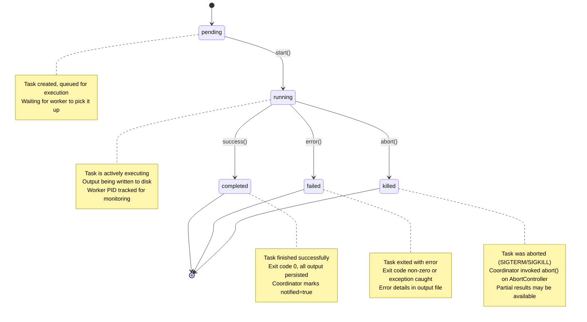
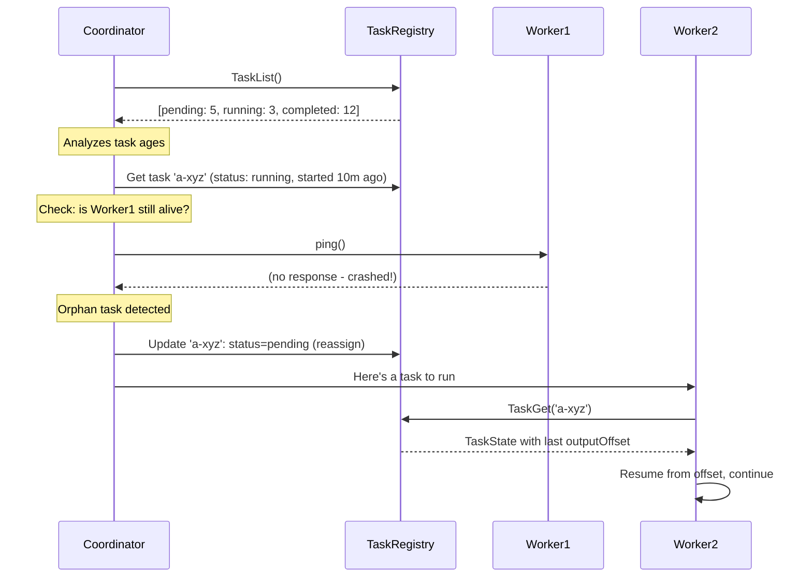
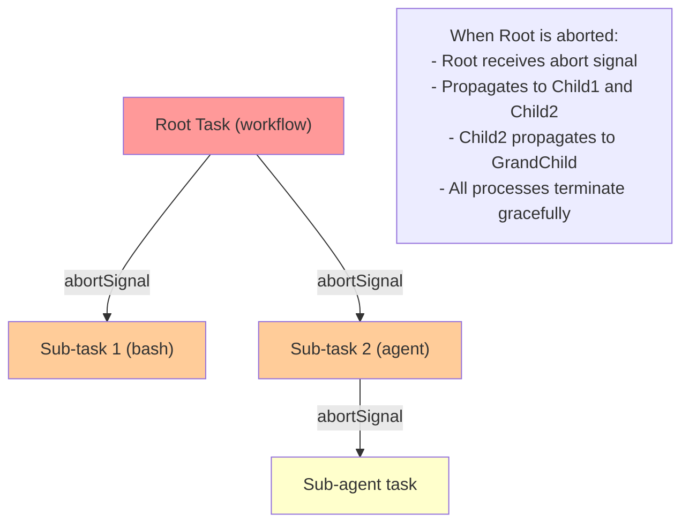
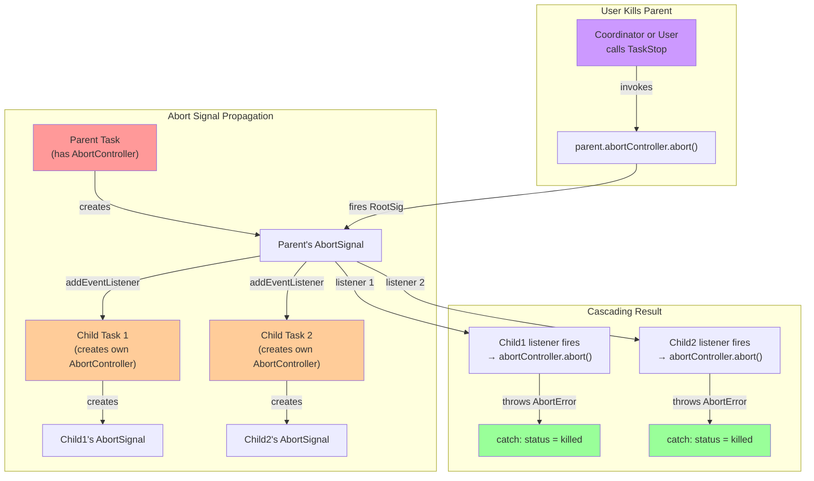
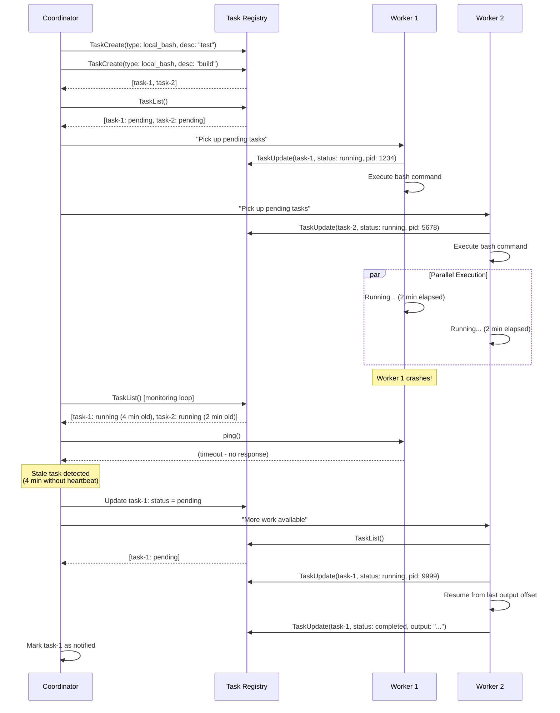
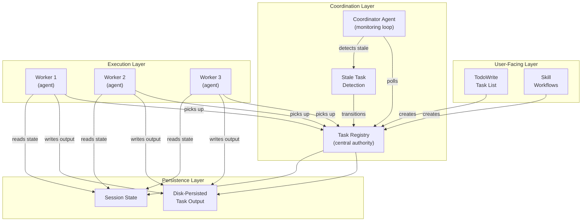

# Task Tools

The task system is the coordination backbone of multi-agent operations in Claude Code. This document covers both the internal task architecture (for system architects) and the user-facing task management tools (for practitioners).

---

## Part 1: Task System Architecture

### Core Concept: Distributed Coordination Protocol

The task system is not merely a todo list. It's a **fault-tolerant coordination protocol** for multi-agent operations. Key principles:

1. **Central Task Registry**: A coordinator maintains a global task list readable by all agents
2. **Automatic Orphan Detection**: When an agent crashes, its uncompleted tasks remain in "running" state and can be picked up by other agents
3. **Task Isolation**: Each task is independent; a crashed task doesn't cascade to others
4. **Persistent Output**: Task results are written to disk immediately, surviving agent restarts

This architecture enables reliable distributed workflows where worker agents can be spawned, crash, and be replaced without losing progress.

### Seven Task Types

Claude Code's task system supports seven distinct task types, each optimized for a specific execution pattern. Rather than a unified "task" abstraction, each type has its own lifecycle logic, state machine, and cleanup protocol. This reflects the architectural reality: spawning a subprocess requires different coordination than running an in-process agent, which differs again from supervising an MCP server.

**Local Bash tasks** execute shell commands in isolated processes. They capture output incrementally to disk, enforce timeouts, and support stall detection when a command appears to be blocked on keyboard input (like an interactive prompt). Process groups are tracked so background subprocesses don't escape on kill.

**Local agent tasks** spawn sub-agents within the same Claude Code process. They inherit a subset of the parent's tools and share abort signal chains so parent cancellation cascades down. Agent tasks maintain transcript output files and emit progress updates (token counts, tool use history) to the UI. They support both foreground (blocking coordinator) and background modes.

**Remote agent tasks** delegate work to agents deployed elsewhere. Typically via API calls to cloud functions or remote Claude Code instances. They handle higher latency and network failures gracefully through polling loops and timeout windows. Results are fetched via long-lived HTTP connections or callback webhooks.

**In-process teammate tasks** run agents in the same TypeScript event loop with zero IPC overhead. They share AppState memory directly via mutable references, enabling low-latency team coordination. Teammates poll a shared inbox for messages and can read/write state without serialization. These are the fastest task type but cannot isolate state from the leader.

**Local workflow tasks** orchestrate multi-step operations with conditional branching and error handling. They spawn child tasks (bash, agent, or nested workflows) and coordinate their outcomes. Workflows maintain a step execution tree and roll back on failure if configured.

**Monitor MCP tasks** supervise active MCP server connections. They run monitoring loops in the background, detect stale connections, and restart servers if they crash. MCP monitors emit health status events and integrate with the task notification system.

**Dream tasks** run continuous learning loops in the background (part of the KAIROS always-on architecture). They process accumulated logs, generate insights, and update agent memory without blocking the main interaction loop.

| Type | Use Case | Characteristics |
|------|----------|-----------------|
| `local_bash` | Run shell commands, scripts, builds | Spawns process, persists working dir, timeout enforced |
| `local_agent` | Spawn sub-agent for specific subtask | Gets subset of parent's tools, inherits system prompt template |
| `remote_agent` | Delegate to deployed agent (e.g., cloud function) | Network call, eventual consistency, higher latency |
| `in_process_teammate` | Parallel agent with shared state (fast) | Must be same process, shared memory, no isolation |
| `local_workflow` | Complex multi-step operations | Orchestrated by workflow engine, can spawn sub-tasks |
| `monitor_mcp` | Supervise MCP server health and messages | Runs monitoring loop, restarts on failure |
| `dream` | Continuous learning (KAIROS architecture) | Runs in background, processes logs, generates insights |

### Task Lifecycle State Machine



### Task State Shape

```typescript
interface TaskState {
  // Identification
  id: string;                   // Unique ID with type prefix: "b-xyz" (bash), "a-xyz" (agent)
  type: TaskType;               // One of the seven types above
  
  // Status tracking
  status: 'pending' | 'running' | 'completed' | 'failed' | 'killed';
  description: string;          // Human-readable task description
  
  // Timing
  startTime: number;            // Unix timestamp when task started
  endTime?: number;             // Unix timestamp when task ended (set on completion/failure/kill)
  
  // Output and results
  outputFile: string;           // Absolute path to disk-persisted output
  outputOffset: number;         // Current read position (for incremental reads)
  exitCode?: number;            // Exit code (0 = success, non-zero = error)
  error?: string;               // Exception message if task threw
  
  // Notification tracking
  notified: boolean;            // Whether completion/failure was reported to coordinator
  
  // Execution context
  workingDirectory?: string;    // CWD for bash tasks, inherited for sub-agents
  parentTaskId?: string;        // If spawned by another task
  abortSignal?: AbortSignal;    // Hierarchical abort propagation
}
```

### Task ID Format and Prefixes

Task IDs encode their type to enable quick filtering and dispatch:

```
Bash task:              b-a1b2c3d4e5f6g7h8
Agent task:             a-x9y8z7w6v5u4t3s2
Workflow task:          w-f1e2d3c4b5a6
MCP Monitor task:       m-j7i6h5g4f3e2d1
Dream task:             d-k8l7m6n5o4p3q2r1
Remote agent task:      r-s1t2u3v4w5x6y7z8
In-process teammate:    i-a2b3c4d5e6f7g8h9
```

---

## Part 2: Complete Task Tool Inventory

### Core Task Management Tools

| Tool | Module | Purpose | Returns |
|------|--------|---------|---------|
| **TaskCreate** | `taskCreate.ts` | Create new background task with type, description, and parameters | `{ taskId: string }` with type prefix |
| **TaskGet** | `taskGet.ts` | Retrieve current task status and state | `TaskState` object with all fields |
| **TaskUpdate** | `taskUpdate.ts` | Update task status, description, or custom fields | `{ updated: true, newState: TaskState }` |
| **TaskList** | `taskList.ts` | List all tasks across all states with optional filtering | `{ tasks: TaskState[], total: number }` |
| **TaskStop** | `taskStop.ts` | Kill a running task by sending abort signal | `{ killed: true, taskId: string }` |
| **TaskOutput** | `taskOutput.ts` | Read task output incrementally with offset-based pagination | `{ retrieval_status: 'success'|'timeout'|'not_ready', task: TaskOutput }` |
| **SendMessage** | `sendMessage.ts` | Send message to running agent task (mailbox communication) | `{ queued: true, messageId: string }` |
| **CronCreate** | `cronCreate.ts` | Schedule a prompt to run at a future time (recurring or one-shot) | `{ jobId: string }` |
| **CronDelete** | `cronDelete.ts` | Cancel a scheduled cron job | `{ deleted: true, jobId: string }` |
| **CronList** | `cronList.ts` | List all scheduled cron jobs | `{ jobs: CronJob[] }` |
| **AskUserQuestion** | `askUserQuestion.ts` | Ask user multiple choice questions to gather information | `{ selectedOptions: string[], customInput?: string }` |

### Tool Details and Implementation Notes

#### TaskCreate

Creates a new task and adds it to the registry.

```typescript
// Usage example
TaskCreate({
  type: 'local_bash',
  description: 'Run full test suite',
  command: 'npm test -- --coverage',
  workingDirectory: '/home/user/project',
  timeout: 300_000  // 5 minutes
})
// Returns: { taskId: 'b-a1b2c3d4e5f6g7h8' }
```

**Key implementation detail**: Tasks start in `pending` state. A background worker process monitors the task registry and picks up pending tasks, transitions them to `running`, and begins output capture.

#### TaskList + Coordinator Monitoring

The coordinator uses `TaskList` to detect stale tasks:



#### TaskOutput with Offset-Based Reading

Output is persisted to disk incrementally. Consumers read with offset to get only new data:

```typescript
// Reader 1: Read first 100 lines
TaskOutput({ taskId: 'b-xyz', offset: 0, limit: 100 })
// Returns: { output: "line1\nline2\n...", offset: 2500, eof: false }

// Reader 2: Poll for more output (continue from last offset)
TaskOutput({ taskId: 'b-xyz', offset: 2500, limit: 100 })
// Returns: { output: "line101\nline102\n...", offset: 5000, eof: false }

// When task completes
TaskOutput({ taskId: 'b-xyz', offset: 5000, limit: 100 })
// Returns: { output: "final output", offset: 5347, eof: true }
```

This enables efficient tail-following behavior without re-reading the entire output.

#### TaskOutput with Blocking and Polling

Reads output from a running or completed task with optional waiting for completion:

```typescript
// Non-blocking: check current status
TaskOutput({ taskId: 'b-xyz', block: false })
// Returns: { retrieval_status: 'not_ready'|'success', task: TaskOutput }

// Blocking: wait for completion (default)
TaskOutput({ taskId: 'b-xyz', block: true, timeout: 30000 })
// Returns: { retrieval_status: 'success'|'timeout', task: TaskOutput }
```

This allows you to:
- Poll task status without blocking
- Wait for background tasks to complete
- Retrieve task output incrementally

Note: This tool is deprecated in favor of using the Read tool directly on the task output file path, which is returned in the task notification.

#### SendMessage for Agent Communication

Agents spawned as tasks can receive messages via a mailbox:

```typescript
// Main coordinator
TaskCreate({
  type: 'local_agent',
  description: 'Run data processing',
  prompt: 'Process the dataset...'
})
// Returns: { taskId: 'a-worker1' }

// Later: send a message to the running agent
SendMessage({
  taskId: 'a-worker1',
  message: 'New data chunk arrived, process it',
  priority: 'high'
})
// Agent polls its mailbox and receives message
```

---

## Part 3: AbortController Hierarchy

Task cancellation uses a hierarchical AbortController pattern to prevent orphaned processes:



**Implementation Details**:

Each task executor maintains its own `AbortController`, which serves as a local abort gate. When a task is created as a child of an existing task, the executor registers a listener on the parent's abort signal. If the parent is terminated, this listener fires immediately and calls `abort()` on the child's local controller, triggering the cascade.

The abort propagation is **asynchronous but prompt**. The listener is invoked synchronously when the parent's abort signal fires, so cancellation reaches children within microseconds (not a polling loop). For bash tasks, this translates to `SIGTERM` sent to the process group. For agent tasks, it aborts any pending I/O operations and transitions the task state to `killed`. For nested workflows, the abort cascades depth-first through the entire tree.

Error handling distinguishes between intentional aborts (from a parent or user kill) and other failures. If a task catches an `AbortError` exception (thrown by the signal when `abort()` is called), it marks the task status as `killed` with a clean termination record. Other exceptions become `failed` tasks with error messages preserved for diagnostics.

The abort chain design prevents two critical failure modes: (1) orphaned processes that survive when a parent crashes, and (2) resource leaks where child tasks aren't properly cleaned up. By wiring abort signals at task creation time, the system guarantees that any child task's cleanup code will execute when the parent terminates, whether due to user request, timeout, or coordinator shutdown.




---

## Part 4: Distributed Coordination Protocol

### Multi-Agent Task Distribution

The following sequence diagram shows how the coordinator distributes work across multiple agents and handles failures:



**Key points**:
1. Coordinator polls `TaskList()` periodically (default: every 5 seconds)
2. Stale detection: tasks in `running` state for > N seconds without heartbeat
3. Recovery: stale task transitions back to `pending`, next available worker picks it up
4. Resilience: partial output is preserved via `outputOffset`

---

## Cron Tools (Feature-flagged: AGENT_TRIGGERS)

### CronCreate

Schedule a prompt to run at a future time, either recurring on a cron schedule or once at a specific time.

**Parameters:**
- `cron`: 5-field cron expression (minute hour day-of-month month day-of-week) in user's local timezone
- `prompt`: The prompt to execute at scheduled time
- `recurring`: Boolean (default: true): if false, runs once then auto-deletes
- `durable`: Boolean (default: false): if true, persists to `.claude/scheduled_tasks.json` for cross-session scheduling

**Returns:** `{ jobId: string }`

**Key Behaviors:**
- Uses standard cron syntax: "0 9 * * *" means 9am local time
- Recurring tasks auto-expire after configurable days
- Scheduler adds jitter to avoid thundering herd (up to 10% of period, max 15 minutes)
- One-shot tasks landing on :00 or :30 fire up to 90 seconds early
- Jobs only fire while REPL is idle (not mid-query)

### CronDelete

Cancel a scheduled cron job by ID.

**Parameters:**
- `jobId`: The ID returned by CronCreate

**Returns:** `{ deleted: true, jobId: string }`

**Key Behaviors:**
- Removes from `.claude/scheduled_tasks.json` (durable jobs) or in-memory session store (session-only)
- No error if job ID not found

### CronList

List all scheduled cron jobs.

**Returns:** `{ jobs: CronJob[] }`

Each job includes:
- `jobId`: Unique identifier
- `cron`: The cron expression
- `prompt`: The scheduled prompt
- `recurring`: Whether it's recurring
- `durable`: Whether it persists across sessions
- `lastRun`: Timestamp of last execution (if any)
- `nextRun`: Timestamp of next scheduled execution

---

## AskUserQuestion Tool

Ask the user multiple choice questions to gather information, clarify ambiguity, or get decisions during execution.

**Parameters:**
- `question`: String: the question to ask
- `options`: Array of strings: answer choices
- `multiSelect`: Boolean (default: false): allow multiple selections
- `preview`: Optional markdown/HTML content to display alongside options (single-select only)

**Returns:** `{ selectedOptions: string[], customInput?: string }`

**Key Behaviors:**
- Users can always select "Other" to provide custom text
- `preview` field supports markdown or HTML for visual comparisons
- When using previews, UI switches to side-by-side layout
- Useful in plan mode to clarify requirements before finalizing approach
- Do NOT use this to ask "Is my plan ready?" Use ExitPlanMode for plan approval instead.

---

## SendMessage Tool

Send a message to another agent (in teams) or to the user.

**Parameters:**
- `to`: Target. Teammate name (e.g., "researcher"), "*" (broadcast), or cross-session address
- `message`: Plain text message or structured protocol message
- `summary`: Optional brief summary of the message

**Returns:** `{ queued: true, messageId: string }`

**Key Behaviors:**
- Messages from teammates are automatically delivered; you don't check an inbox
- Refer to teammates by name, never by UUID
- Your plain text output is NOT visible to other agents. You must use this tool to communicate.
- Supports legacy protocol responses (shutdown_request, plan_approval_request)
- For teams: messages enqueue and drain at receiver's next tool round
- For cross-session (if UDS_INBOX enabled): use ListPeers to discover targets

---

## Part 5: TodoWrite (User-Facing Task Management)

### Overview

`TodoWrite` is the **user-facing** task management tool, distinct from the internal task system. It's optimized for human workflow tracking, not distributed coordination.

| Property | Value |
|----------|-------|
| Purpose | Track multi-step tasks with user-visible state |
| States | `pending`, `in_progress`, `completed` |
| Constraint | Exactly one task `in_progress` at a time |
| Persistence | Stored in session state, not shared across agents |

### Task Requirements

Each task has two forms:

- **`content`**: Imperative form (action to take)  
  Example: `"Implement auth middleware"`
  
- **`activeForm`**: Present continuous (what you're doing now)  
  Example: `"Implementing auth middleware"`

### State Semantics

```typescript
interface TodoTask {
  id: string;
  content: string;        // "Implement feature X"
  activeForm: string;     // "Implementing feature X"
  status: 'pending' | 'in_progress' | 'completed';
  createdAt: number;
  completedAt?: number;
}
```

### When to Use

Create a TodoWrite task list when:
- Tasks require 3+ distinct steps
- Multiple independent tasks from user
- After receiving new instructions that clarify priorities
- Complex operations requiring atomic progress tracking

### When NOT to Use

Skip TodoWrite for:
- Single straightforward task
- Trivial tasks (< 3 steps)
- Purely conversational or informational requests
- One-off commands

### Key Rules

1. **Mark complete immediately**: After finishing a step, mark it complete in TodoWrite. Don't batch completions.
2. **Never mark as completed if**:
   - Tests are failing
   - Implementation is partial
   - Errors are unresolved
   - Dependencies are incomplete
3. **Remove irrelevant tasks**: If a task becomes outdated, remove it entirely rather than leaving it marked pending.
4. **One in_progress**: The system enforces exactly one task in `in_progress` state at a time. Mark the previous task complete before starting a new one.

### Example Workflow

```
Initial tasks (user creates):
- pending:     "Setup project scaffold"
- pending:     "Implement data model"
- pending:     "Write API tests"
- pending:     "Deploy to staging"

Step 1: Start first task
- pending:     "Implement data model"
- pending:     "Write API tests"
- pending:     "Deploy to staging"
+ in_progress: "Setup project scaffold"

Step 2: Finish scaffold, mark complete, start model
- pending:     "Write API tests"
- pending:     "Deploy to staging"
+ completed:   "Setup project scaffold"
+ in_progress: "Implement data model"

Step 3: Finish model, mark complete, start tests
- pending:     "Deploy to staging"
+ completed:   "Setup project scaffold"
+ completed:   "Implement data model"
+ in_progress: "Write API tests"

Step 4: Finish tests, mark complete, start deploy
+ completed:   "Setup project scaffold"
+ completed:   "Implement data model"
+ completed:   "Write API tests"
+ in_progress: "Deploy to staging"

Step 5: Finish deploy, mark complete, all done
+ completed:   "Setup project scaffold"
+ completed:   "Implement data model"
+ completed:   "Write API tests"
+ completed:   "Deploy to staging"
```

---

## Part 6: Skill (Pre-Built Workflows)

### Overview

`Skill` is a tool for executing pre-built, registered workflows. Skills are not one-off prompts. They are full implementations of complex procedures.

| Property | Value |
|----------|-------|
| Purpose | Run specialized multi-step workflows |
| Invocation | Explicit: `/skill-name` or Skill tool |
| Registration | Centralized in the codebase |
| Trigger Pattern | Contextual auto-detection (optional) |

### Skill vs. Regular Prompting

**Skill**: "Execute the `/commit` workflow" → Full git commit protocol with staged file detection, commit message generation, hook execution, and error handling.

**Regular prompt**: "How do I make a git commit?" → General information, not executable workflow.

### Available Skills

| Skill | Trigger | Purpose | Implementation |
|-------|---------|---------|-----------------|
| `commit` | `/commit` | Create git commits with proper messages and hooks | Full protocol: status → diff → message → commit → verify |
| `simplify` | `/simplify` | Review code for quality and efficiency, then auto-fix | Runs linter, suggests refactors, applies fixes |
| `loop` | `/loop 5m /foo` | Execute command/prompt on recurring interval | Spawns background task, polls on interval |
| `claude-api` | `import anthropic` | Help build Claude API / SDK applications | Guides API usage patterns, generates examples |
| `update-config` | Behavior keywords (from now on, whenever) | Configure harness hooks in settings.json | Modifies settings, enables automated behaviors |
| `session-start-hook` | Repository setup | Create SessionStart hooks for web environments | Scaffolds hook infrastructure |

### Skill Discovery

Skills are loaded from the skill registry. To find available skills:

```typescript
// Pseudo-code
const skills = await skillRegistry.list();
// Returns: { commit, simplify, loop, claude-api, update-config, ... }

// Search for skills by keyword
const matches = await skillRegistry.search('deploy');
// Returns: [{ name: 'deploy-aws', description: '...' }, ...]
```

### Hot-Reload Support

Skills can be reloaded without restarting the agent:

```typescript
export const MySkill: SkillDefinition = {
  name: 'my-skill',
  trigger: '/my-skill',
  execute: async (params) => { /* ... */ }
};

// Later: skill is updated on disk
// Call: Skill({ name: 'my-skill' })
// Engine detects file change, reloads definition, executes fresh
```

### Context vs. Explicit Triggering

**Explicit**:
```
User: /commit
→ Skill tool is called directly
```

**Contextual** (auto-detect):
```
User: "Save my changes to git"
System prompt includes: "If user mentions git commit, suggest /commit skill"
→ Model recognizes intent, calls Skill tool
```

---

## Part 7: Architecture Diagram



---

## Part 8: Security Considerations

### Task Isolation

Tasks run with:
- **Separate processes** (bash tasks) or **isolated agent instances** (agent tasks)
- **Environment sandboxing**: HOME, PATH, and network restricted to workspace
- **Resource limits**: Memory caps, CPU time limits, file descriptor limits enforced

### Output Sanitization

Task output is sanitized before inclusion in conversation:
- Credentials (AWS keys, API tokens) are redacted
- Sensitive paths are anonymized
- Extremely large output is truncated

### Abort Signal Safety

The AbortController hierarchy ensures no orphaned processes:
- Parent abort cascades to all children
- SIGTERM sent gracefully first (30s timeout)
- SIGKILL as fallback
- Process group killed to catch backgrounded subprocesses

---

## Part 9: Troubleshooting

### Task Stuck in "running" State

**Symptom**: Task shows `status: 'running'` but no recent output.

**Diagnosis**:
1. Check task age: `endTime` missing, `startTime` > 10 minutes ago?
2. Verify worker still alive: Check process list for task's PID
3. Check output staleness: `outputOffset` unchanged for > 5 minutes?

**Recovery**:
```typescript
// Option 1: Kill and retry
TaskStop({ taskId: 'task-xyz' })
// Wait 2 seconds
TaskCreate({ ...originalParams })  // Retry

// Option 2: Force state reset (last resort)
TaskUpdate({
  taskId: 'task-xyz',
  status: 'failed',
  error: 'Coordinator detected stale task, force terminating'
})
```

### Task Output Lost / Incomplete

**Symptom**: Task completed but `outputOffset` doesn't match file size.

**Cause**: Worker crashed mid-write, or buffer not flushed.

**Recovery**:
```typescript
// Read raw output file
Read({ file_path: '/tmp/task-xyz-output.txt' })
// Compare with last known outputOffset
// Coordinator will detect mismatch on next poll and handle
```

### Cascading Failures (Parent Abort Triggering Unexpected Kills)

**Symptom**: Unrelated tasks get killed when one parent task is aborted.

**Cause**: Incorrect abort signal wiring; non-child task listening to parent's signal.

**Fix**: Verify task hierarchy in creation code:
```typescript
// Wrong: child inherits parent signal but also listens to global abort
TaskCreate({
  type: 'local_bash',
  parentTaskId: 'a-parent',
  // Should NOT also listen to root abort signal
})

// Right: child only inherits parentTaskId
TaskCreate({
  type: 'local_bash',
  parentTaskId: 'a-parent',
  // Engine automatically wires abort hierarchy
})
```

---

## Summary Table: When to Use Each Tool

| Tool | Use When | Output | Example |
|------|----------|--------|---------|
| **TodoWrite** | 3+ steps, tracking user progress | Task list with states | "Implement feature, write tests, deploy" |
| **Skill** | Running pre-built workflow | Workflow result + logs | `/commit` to run full git commit protocol |
| **TaskCreate** | Spawn background work (async) | Task ID | Run tests while user continues working |
| **TaskList** | Monitor coordinator health | All tasks + states | Check if worker crashed, stale task detected |
| **TaskOutput** | Stream task results | Output chunk + EOF flag | Tail build logs as they happen |
| **TaskStop** | Kill a task | Confirmation | Abort long-running test suite |
| **SendMessage** | Communicate with running agent | Message ID | Send new data chunk to processing agent |
