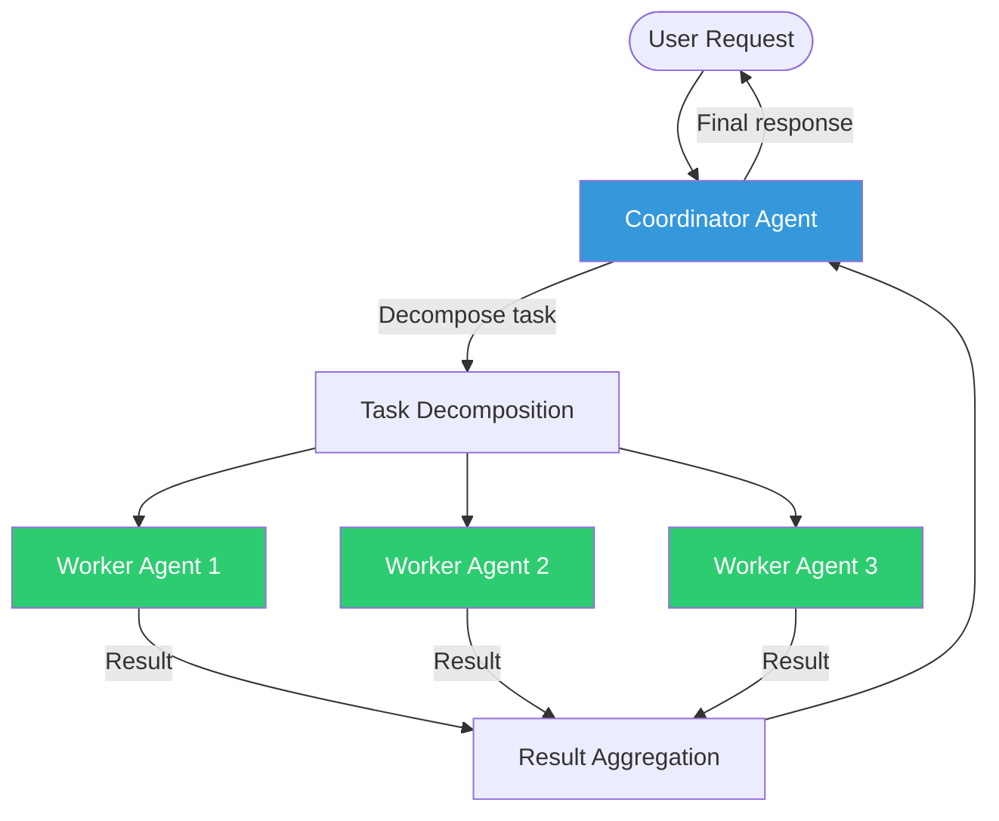
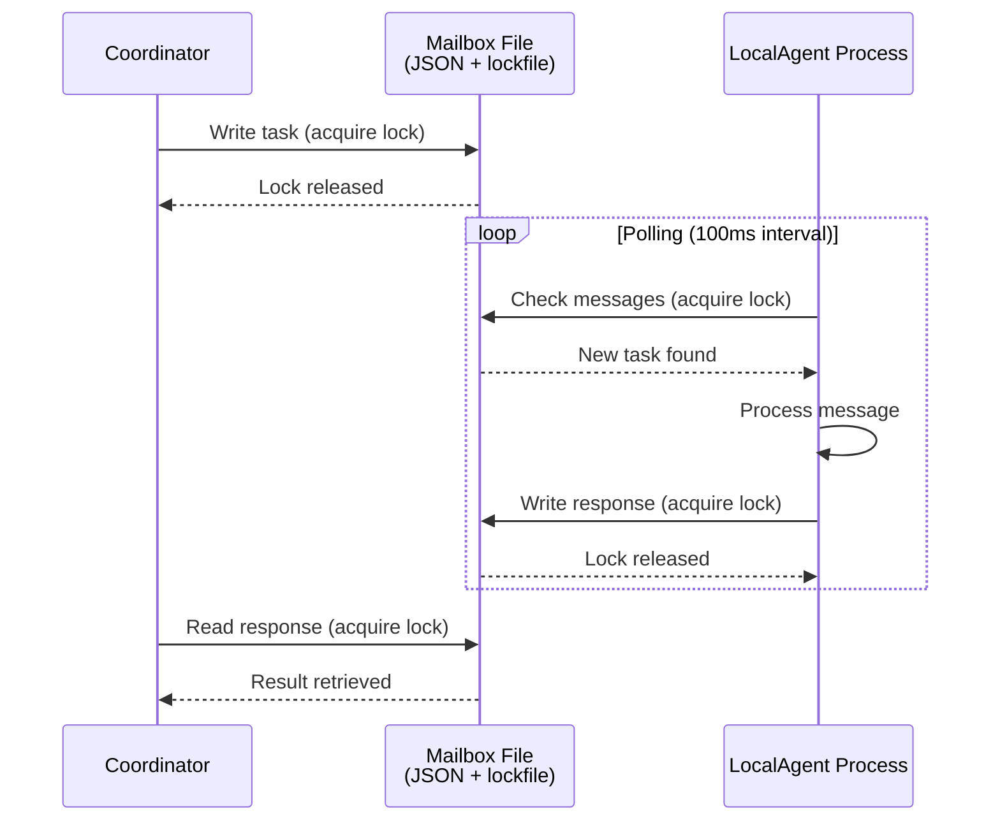
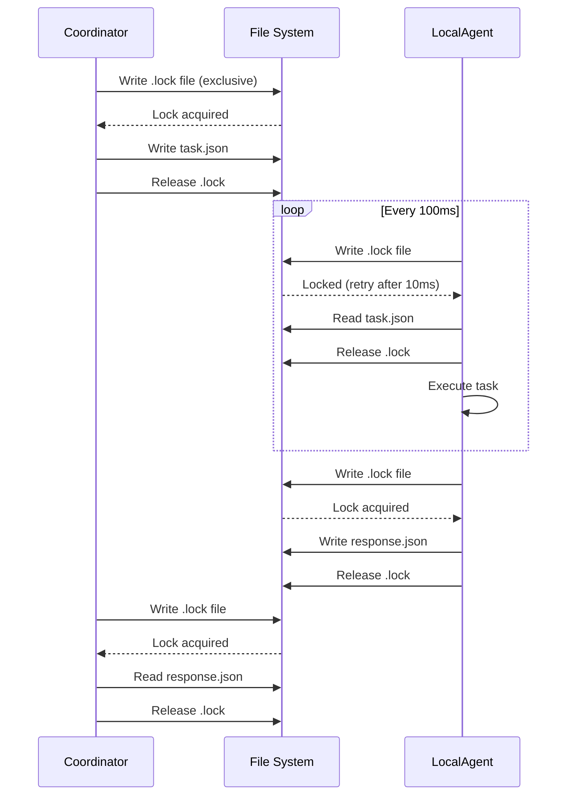
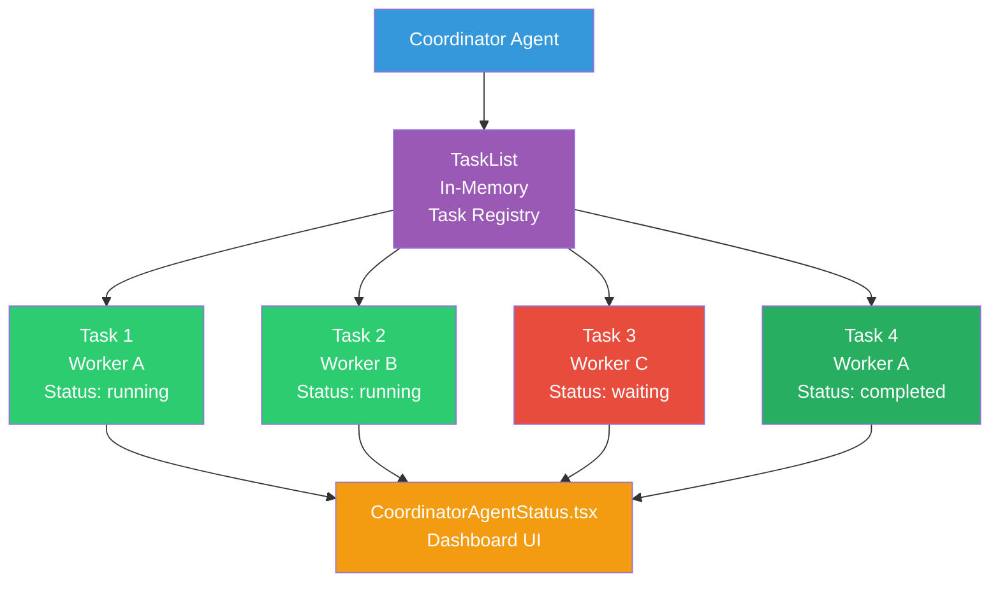

# Coordinator Mode

코디네이터 모드는 Claude Code의 다중 Agent 오케스트레이션 시스템입니다. 유출된 정보 중 가장 주목할 만한 발견은 오케스트레이션 알고리즘이 **코드가 아닌 프롬프트로 완전히 구현**되어 있다는 것입니다.

## 아키텍처

## 4가지 Agent 구현 유형

Claude Code는 네 가지 서로 다른 Agent 구현 유형을 지원하며, 각각 다양한 격리 메커니즘과 성능 특성을 갖습니다. Coordinator는 작업 요구사항과 시스템 제약에 따라 적절한 유형을 선택합니다.

### InProcessTeammate

경량 병렬 작업에 가장 효율적인 구현입니다. 단일 프로세스 내에서 컨텍스트 격리를 위해 Node.js `AsyncLocalStorage`를 사용합니다.

**특성:**
- **격리 메커니즘**: AsyncLocalStorage는 실행 컨텍스트당 격리를 제공
- **통신**: 공유 V8 힙 (직렬화 오버헤드 없음)
- **컨텍스트 격리**: 각 팀원은 격리된 대화 기록, 도구 상태, 권한을 유지
- **동시성**: 같은 프로세스의 여러 팀원이 스레드 문제 없이 실행
- **메모리 오버헤드**: 최소
- **시작 시간**: 마이크로초

**작동 방식:**
각 InProcessTeammate는 async 실행 컨텍스트 내에서 실행됩니다. AsyncLocalStorage 메커니즘은 다음을 보장합니다:
- 도구 호출이 올바른 Agent로 라우팅됨
- 대화 기록이 Agent 간에 유출되지 않음
- 권한이 Agent별로 적용됨 (전역이 아님)
- 중단 신호가 개별 Agent에 전파됨

통합 실행 엔진이 async 컨텍스트 내에서 실행되며, 팀원의 특정 프롬프트, 허용된 도구, 권한 설정을 받습니다. 같은 Node.js 프로세스에서 여러 팀원이 동시에 실행되면서 도구 호출이 서로 간섭하지 않도록 합니다. 각 팀원은 격리된 도구 상태, 대화 기록, 권한을 유지합니다.

진행 상황은 하트비트와 상태 업데이트를 통해 추적되어, Coordinator가 정체된 작업을 감지할 수 있고 UI가 실시간 상태를 표시할 수 있습니다. 팀원이 완료되거나 실패하면, 결과가 저장되어 Coordinator에 알려지고, 작업을 재시도하거나 다른 Agent 유형으로 에스컬레이션할지 결정할 수 있습니다.

**최적 사용 사례:**
- 기능 구현 + 병렬 테스팅
- 독립적인 작업자가 있는 다중 파일 리팩토링
- 대규모 코드베이스 탐색 (검색 공간 분할)

### LocalAgent

파일 기반 IPC와 메시지 전달을 사용하는 더 격리된 구현입니다. 각 에이전트는 자체 V8 힙을 가진 별도의 Node.js 프로세스에서 실행됩니다.

**특성:**
- **격리 메커니즘**: 별도 프로세스 (다른 V8 인스턴스)
- **통신**: 잠금 파일 동기화를 사용하는 JSON 파일 메일박스
- **메시지 폴링**: 에이전트가 주기적으로 새 메시지를 확인합니다
- **컨텍스트 격리**: 완전한 프로세스 수준 격리
- **메모리 오버헤드**: 에이전트당 하나의 V8 힙 (~30-50 MB)
- **시작 시간**: 밀리초

**작동 방식:**
Coordinator와 LocalAgent는 공유 Mailbox 디렉토리를 통해 통신합니다:

**Mailbox 구조:**
Mailbox 파일에는 작업 메타데이터 (ID, 상태), 작업 자체 (프롬프트, 허용된 도구, 컨텍스트), 실행 결과 (출력, 수정된 파일, 종료 코드), 라이프사이클 추적용 타임스탐프가 포함됩니다.

**충돌 복원력:**
LocalAgent가 충돌하면 메일박스 파일이 손상되지 않습니다. 코디네이터는 다음을 수행할 수 있습니다:
- 시간 초과 감지 (N초 동안 응답 업데이트 없음)
- 새 에이전트를 생성하여 작업 재시도
- 메일박스에서 부분 상태 복구

**최적 사용 사례:**
- 파일 시스템 격리가 필요한 작업
- 장시간 실행되는 작업 (메인 프로세스 이벤트에서 생존할 수 있음)
- 힙 크기 제한이 우려되는 경우

### RemoteAgent

Teleport (Anthropic의 내부 RPC 시스템)를 사용하는 머신 간 배포입니다. 공개 빌드에서는 일반적으로 노출되지 않지만 대규모 배포에 필수적입니다.

**특성:**
- **격리 메커니즘**: 네트워크 경계 (다른 머신)
- **통신**: Teleport RPC 
- **동시성**: 별도의 하드웨어에서 실행할 수 있습니다
- **컨텍스트 격리**: 완전한 머신 수준 격리
- **메모리 오버헤드**: 여러 머신에 걸쳐 확장됩니다
- **시작 시간**: 초 (네트워크 지연 + 프로비저닝)

**최적 사용 사례:**
- 분산 CI/CD 파이프라인
- 대규모 코드베이스 분석 (여러 머신에 걸쳐 분할)
- 리소스 집약적인 작업 (GPU 가속 분석)

### LocalShell

stdin/stdout을 통한 서브프로세스 통신입니다. 가장 간단한 격리 모델입니다.

**특성:**
- **격리 메커니즘**: 서브프로세스 경계
- **통신**: stdin/stdout (JSON 라인 프로토콜)
- **실행**: 직접 셸 명령 실행
- **컨텍스트 격리**: 프로세스 수준 격리
- **메모리 오버헤드**: 최소 (~서브프로세스당 5 MB)
- **시작 시간**: 밀리초

**최적 사용 사례:**
- 간단한 셸 명령 작업
- 외부 도구와의 통합
- 최소 조정 오버헤드가 필요한 경우

---

## 에이전트 유형 비교 매트릭스

| 측면 | InProcessTeammate | LocalAgent | RemoteAgent | LocalShell |
|--------|-------------------|-----------|-------------|-----------|
| **격리 수준** | AsyncLocalStorage | 프로세스 | 네트워크 | 서브프로세스 |
| **통신** | 공유 힙 | 파일 메일박스 | Teleport RPC | stdin/stdout |
| **에이전트당 메모리** | ~1 MB | ~40 MB | ~100 MB+ | ~5 MB |
| **시작 지연** | μs | ms | s | ms |
| **동시성** | 높음 (100+) | 중간 (10-20) | 중간 (다양함) | 낮음 (5-10) |
| **힙 공유** | 예 | 아니오 | 아니오 | 아니오 |
| **직렬화 오버헤드** | 없음 | JSON만 | 완전 RPC 스택 | JSON 라인 |
| **충돌 복원력** | 낮음 | 높음 | 높음 | 중간 |
| **사용 사례** | 병렬 작업 | 독립적 작업 | 분산 계산 | 셸 작업 |

---

## 파일 기반 메일박스 IPC 패턴

LocalAgent 통신은 지연을 간단함과 충돌 복원력으로 교환하는 입증된 파일 기반 IPC 패턴을 사용합니다.

### 메시지 흐름

### File-Based IPC vs Socket-Based IPC(파일 기반 IPC 대 소켓 기반 IPC)의 이점

**단순성**: 포트 관리 없음, 네트워크 스택 복잡성 없음.

**충돌 복원력**: 충돌한 프로세스는 Mailbox 파일을 그대로 두고 갑니다. Coordinator는 Agent 실패를 감지하고 데이터 손실 없이 대체 에이전트를 생성할 수 있습니다.

**관찰성**: Mailbox 파일은 사람이 읽을 수 있는 JSON입니다. 디버깅은 `cat ~/.cache/claude-code/mailbox-*.json`만큼 간단합니다.

**데드락 없음**: 파이프나 소켓과 달리 파일 작업은 순환 대기 조건을 만들지 않습니다.

### Lock File Synchronization

패턴은 원자 작업을 위해 점 파일 잠금 파일을 사용합니다. Coordinator가 쓸 때 `.lock` 파일을 생성하고, Agent가 폴링할 때도 `.lock` 파일을 생성하여 파일 접근을 동기화합니다. 잠금 파일이 존재하면 프로세스는 10ms 동안 대기했다가 다시 시도합니다 (백오프).

---

## Git Worktree Isolation

각 팀원 Agent는 전용 Git Worktree에서 작업하여 충돌 없이 동시에 파일을 수정할 수 있습니다. Worktree 전략 다이어그램 및 라이프사이클에 대한 자세한 내용은 [Subagent Types - Worktree Isolation](./subagent-types.md#worktree-isolation)을 참조하세요.

### 이점

**병렬 파일 수정**: 각 에이전트는 충돌 없이 동시에 동일한 파일을 수정할 수 있습니다.

**독립적 커밋**: 각 에이전트는 자신의 커밋 메시지를 사용하여 자신의 커밋을 만듭니다.

**원자적 병합**: 변경사항은 메인으로 병합되기 전에 독립적으로 검토됩니다.

**롤백 기능**: 한 에이전트의 작업이 거부되면 단순히 그 worktree를 삭제합니다.

### Coordinator Worktree Management

Claude Code의 Worktree 관리는 ProjectSessionManager에 의해 처리되며, 이는 팀원을 위한 동시 git Worktree를 조정합니다. 팀원이 생성되면, 시스템은 `.claude/worktrees/` (또는 `.claude-worktrees/`) 내에 전용 Worktree를 작성하고 작업 이름을 따라 명명된 브랜치 (예: `team/task-uuid-123`)를 사용합니다. 이를 통해 팀원이 메인 Worktree와 간섭하지 않으면서 커밋하고 변경사항을 푸시할 수 있습니다.

라이프사이클은 자동입니다. 팀원이 작업을 시작하면 Worktree가 생성됩니다. 팀원이 명령어를 실행할 때(파일 편집, bash 작업), 모든 변경사항은 해당 Worktree로 격리됩니다. 팀원이 완료되면(성공 또는 실패 여부) Worktree를 정리하거나, 작업이 가치 있는 경우 검토를 위해 원격으로 푸시할 수 있습니다.

각 Worktree는 자신의 `.git` 설정을 가지므로 팀원이 자신의 사용자 컨텍스트와 메시지로 커밋할 수 있습니다. Git의 Worktree 기능은 동시 수정이 경합하지 않도록 보장하며, 각 팀원은 자신의 Worktree 브랜치 내에서 일관된 파일 상태를 봅니다.

---

## Prompt-Based Orchestration

Coordinator는 작업 배포를 위해 코딩된 알고리즘을 사용하지 않습니다. 대신 **오케스트레이션 로직은 시스템 프롬프트로 표현되어** Coordinator Agent에게 다음을 지시합니다:

1. 복잡한 작업을 하위 작업으로 분해
2. 하위 작업을 작업자 에이전트에 할당
3. 작업자 진행 상황 모니터링
4. 작업자 결과 검증
5. 결과 집계

### Coordinator Prompt Structure

Coordinator 프롬프트는 Agent 행동을 여러 핵심 원칙으로 가이드합니다:

1. **작업 분해**: 요청을 독립적이고 병렬화 가능한 하위 작업으로 분해하면서 중요한 종속성을 식별하고 적절한 전문 Agent 할당을 시간 추정과 함께 수행합니다.

2. **작업자 할당**: 작업 특성에 따라 올바른 Agent 유형을 선택합니다. 독립적인 파일 작업을 위한 병렬 팀원, 장시간 실행 분석용 프로세스 격리 Agent, 셸 작업용 서브프로세스 Agent, 그리고 크로스 머신 작업용 분산 Agent입니다.

3. **품질 관리**: 각 작업자의 출력을 비판적으로 평가합니다. 완성도를 확인하고 아키텍처 일관성을 체크하고 원래 요구사항에 대해 검증하며 표준 이하의 작업에 대해 수정을 요청합니다.

4. **진행 상황 모니터링**: 작업 레지스트리를 통해 모든 활성 작업자를 추적하고, 완료 시간을 모니터링하고, 정체된 작업 (5분 이상 진행 없음)을 감지하고, 실패를 UI에 신호하고, 작업 완료시 부분 결과를 집계합니다.

5. **결과 집계**: 모든 작업자가 완료되면, 모든 변경사항을 병합하면서 충돌을 처리하고, 통합된 솔루션을 검증하고, 최종 검증 테스트를 실행하고, 성공을 보고하거나 문제가 남아있으면 재작업을 요청합니다.

### Quality Assurance Directives

Coordinator는 약한 작업을 거부하지 말지 말도록 명시적으로 지시받습니다. 이는 다음을 의미합니다:
- 각 작업자의 출력을 할당된 작업에 대해 비판적으로 평가합니다
- 표준 이하의 작업을 거부하고 불완전한 솔루션을 받아들이는 대신 수정을 요청합니다
- 모든 작업자 출력 간 일관성을 보장합니다
- 조립된 결과가 원래 사용자 요구사항을 충족하는지 검증합니다
- 실패한 시도를 추적하고 작업이 표준을 충족하지 못하면 반복적으로 에스컬레이션합니다

---

## Task Panel Management

Coordinator는 `TaskList` (내부 데이터 구조)를 사용하여 모든 활성 Worker를 실시간으로 모니터링합니다.

### TaskPanel 아키텍처

### Task Lifecycle

Coordinator가 Worker를 생성하면, 작업은 레지스트리에 메타데이터와 함께 들어갑니다: 작업 ID, Agent ID, 상태, 타임스탐프. 작업은 **pending** (대기열에 있지만 시작되지 않음), **running** (활발하게 실행 중), **completed** (성공적으로 완료) 또는 **failed** (오류로 중지됨)의 단계를 통해 전환됩니다.

각 작업은 하트비트 메커니즘을 포함합니다. Agent는 정기적으로 진행 상황을 보고합니다. 작업이 실행 중이지만 설정된 시간 초과 (일반적으로 5분) 동안 하트비트가 도착하지 않으면, Coordinator는 이를 정체됨으로 표시하고 더 오래 기다리거나 UI에 중재 신호를 보낼 수 있습니다.

상태 표시 컴포넌트는 작업 변경사항을 구독하고 실시간으로 모든 활성 작업을 표시하여 상태 배지, 진행 표시기, 오류 메시지 및 정체된 작업 경고를 보여줍니다. 이를 통해 사용자는 폴링 없이 병렬 Worker를 모니터링할 수 있으며, Coordinator가 어떤 작업이 진행 중이고 어떤 작업이 차단되었는지 가시성을 확보할 수 있습니다.

### UI 컴포넌트

`CoordinatorAgentStatus.tsx` React 컴포넌트는 다음을 표시합니다:
- 작업 수 및 상태 분석
- 작업당 진행 표시기
- 정체된 작업 경고
- 결과 미리보기
- 실패 알림

---

## Worker Agents

Worker는 Agent 도구를 사용하여 하위 Agent로 생성됩니다. 각 Worker는:

- 전체 작업 설명을 수신합니다 (공유 컨텍스트 없음)
- 자신의 Context Window를 가지고 독립적으로 작동합니다
- 사용 가능한 모든 도구를 사용할 수 있습니다 (Bash, Read, Edit, MCP 도구)
- Coordinator에 결과를 반환합니다

### Coordinator Worker를 위한 사용 가능한 Agent 유형

Coordinator는 이러한 Agent 유형으로 Worker를 생성할 수 있습니다:

| 유형 | 사용 사례 |
|------|----------|
| **general-purpose** | 복잡한 다단계 작업: 구현, 연구, 검증, 리팩토링 |
| **Explore** | 병렬 지원이 있는 빠른 읽기 전용 코드베이스 탐색 |
| **Plan** | 아키텍처 계획 및 설계 전략 |

대부분의 Coordinator 작업은 유연성을 위해 `subagent_type: "general-purpose"`를 사용합니다. 특화된 유형 (Explore, Plan)은 유형별 제약이나 최적화된 동작을 원할 때 사용됩니다.

### Parallel Execution

Worker는 작업이 독립적일 때 병렬로 작동합니다:

```mermaid
gantt
    title Coordinator Task Execution
    dateFormat X
    axisFormat %s

    section Coordinator
    Decompose task      :0, 1
    Aggregate results   :4, 5

    section Worker 1
    Implement feature A :1, 3

    section Worker 2
    Implement feature B :1, 4

    section Worker 3
    Write tests         :1, 3
```

---

## When Coordinator Mode is Used

Coordinator 모드는 `COORDINATOR_MODE` 컴파일 시간 플래그 뒤에 있으며 공개 빌드에서는 사용할 수 없습니다. 활성화되면 병렬 실행에서 이점을 얻는 작업에 대해 활성화됩니다:

| 적합한 작업 | 이유 |
|---------------|-----|
| 다중 파일 리팩토링 | 각 파일을 다른 작업자가 처리할 수 있습니다 |
| 기능 + 테스트 | 기능 구현과 테스트 작성을 병렬화할 수 있습니다 |
| 다중 컴포넌트 변경 | 프론트엔드 + 백엔드 + 데이터베이스 변경 |
| 대규모 코드베이스 탐색 | 다른 작업자가 다른 영역을 탐색합니다 |

---

## Feature Gate Details

### Compile-Time Flags and Runtime Control

Coordinator 모드는 두 가지 메커니즘으로 제어됩니다: 컴파일 타임 Feature Flag (`COORDINATOR_MODE`)와 환경 변수 (`CLAUDE_CODE_COORDINATOR_MODE`)가 함께 작동합니다. Feature Flag는 Coordinator 코드가 번들에 포함되는지 여부를 결정하고, 환경 변수는 Feature Flag가 활성화되어 있을 때 런타임 활성화를 제어합니다.

이 2계층 설계는 공개 빌드에서 Coordinator 코드 번들링을 방지하는 동시에 (컴파일 타임 flag 통해), 내부 빌드가 환경 변수를 통해 런타임에 활성화/비활성화할 수 있게 합니다. Coordinator 모드가 비활성화되면, Coordinator 컴포넌트를 인스턴스화할 코드 경로는 실행되지 않습니다.

세션 재개 로직은 저장된 모드 (Coordinator vs. 일반)를 존중하도록 재개된 세션을 보장하고, 일관성을 위해 필요시 환경 변수를 자동으로 설정합니다.

### Directory Structure

코디네이터의 핵심 구성 요소는 Coordinator.ts (주요 오케스트레이션 엔진), agents 하위 디렉토리 (InProcessTeammate, LocalAgent, RemoteAgent, LocalShell), TaskList.ts, WorktreeManager.ts, PromptBuilder.ts, 그리고 CoordinatorAgentStatus.tsx UI 컴포넌트를 포함합니다.

### Activation

Query Engine 수준에서 Coordinator 모드 활성화가 발생합니다. 새로운 Agent 요청이 도착할 때 시스템은 다음을 확인합니다:

1. 컴파일 시 Feature Flag가 활성화되어 있는가?
2. 런타임에 환경 변수가 활성화되도록 설정되어 있는가?

두 확인이 모두 통과하면 Query Engine이 독립 실행형 Agent 대신 Coordinator를 생성할 수 있습니다. Coordinator는 전체 사용자 프롬프트를 받고 이를 하위 작업으로 분해하여 독립적 작업에 대한 Worker를 시작합니다. 그렇지 않으면 단일 Agent가 작업을 끝까지 실행합니다.

이 설계는 Coordinator 모드가 프롬프트 키워드에서 추론되지 않고 컴파일 시간 및 런타임 플래그에 의해 엄격하게 제어되도록 보장합니다. Coordinator 모드가 활성화되면 Coordinator는 작업이 본질적으로 순차적이라고 판단하는 경우 순차적으로 실행하기로 결정할 수 있습니다. 프롬프트 기반 오케스트레이션 (위에서 설명함)은 Coordinator에 이러한 유연성을 제공합니다.

---

## Relationship to Current Agent System

Coordinator 모드가 없어도 현재 Agent 시스템은 더 간단한 형태의 다중 Agent 작업을 지원합니다:

| 기능 | 현재 에이전트 | 코디네이터 모드 |
|---------|--------------|-----------------|
| 하위 에이전트 생성 | 예 | 예 |
| 병렬 실행 | 예 | 예 |
| 오케스트레이션 | 수동 (모델 결정) | 프롬프트 기반 코디네이터 |
| 품질 관리 | 없음 | "약한 작업에 도장 찍지 않기" |
| 작업 분해 | 임시 | 구조화됨 |
| 결과 집계 | 수동 | 코디네이터가 처리 |
| Worktree 격리 | 수동 | 에이전트당 자동 |
| 진행 상황 모니터링 | 없음 | TaskPanel 대시보드 |

