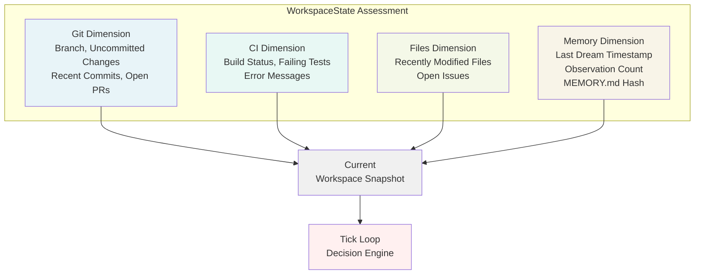
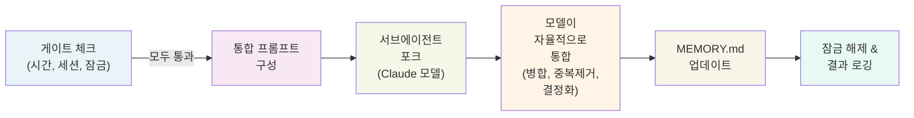
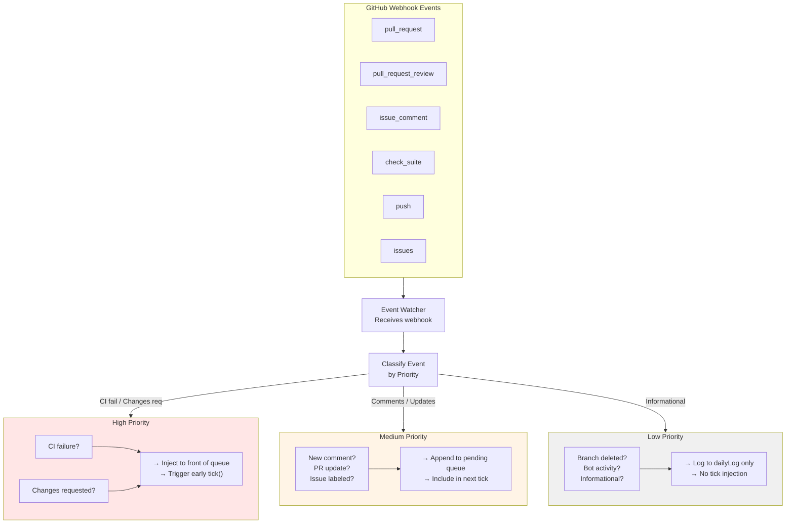
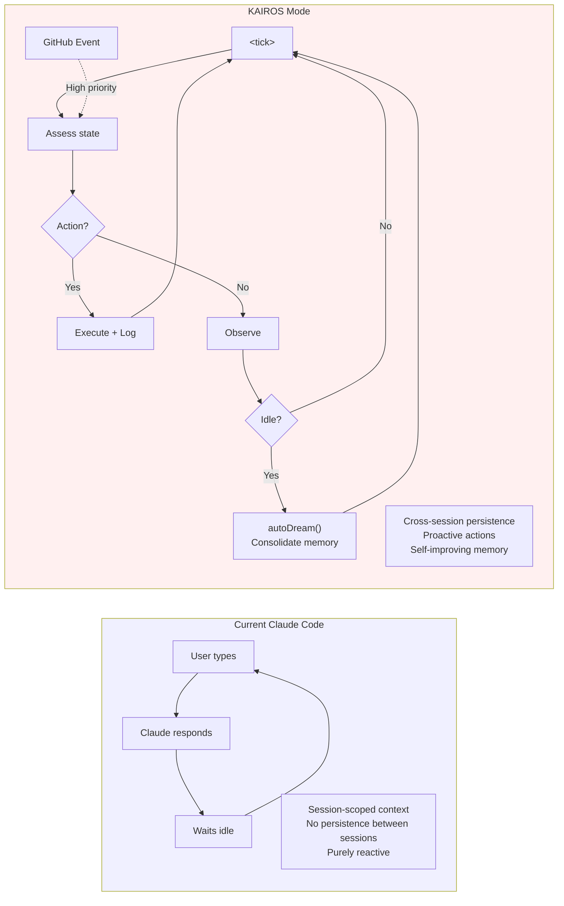

# KAIROS: Autonomous Daemon Mode

KAIROS는 유출된 소스 코드의 가장 중요한 발견 중 하나입니다. **150+ 개의 참조**가 코드베이스 전체에 걸쳐 있으며, 완전히 구현되었지만 미출시된 자율 데몬 모드를 나타냅니다. Claude Code의 현재 반응형 상호작용 모델에서 지속적으로 작동하는 백그라운드 Agent로의 패러다임 전환입니다.

## 기술 요약

KAIROS는 4가지 핵심 서브시스템으로 자율 데몬 아키텍처를 구현합니다:

- **Tick Loop**: 워크스페이스 상태를 평가하고, 조치를 결정하고, 관측을 기록하는 주기적 평가 사이클
- **autoDream**: 관측을 구조화된 사실로 병합하여 장기 메모리를 만드는 통합 엔진
- **Event Watcher**: 높은 우선순위 이벤트를 결정 파이프라인에 주입하는 GitHub 웹훅 통합
- **Daily Log**: 모든 자율 조치, 관측, 결정을 기록하는 append-only 저널로 감사 추적과 꿈 입력 제공

`KAIROS` 컴파일 타임 feature flag (공개 빌드에서 데드 코드 제거)로 제어됩니다.

## 아키텍처

```mermaid
graph TB
    subgraph KairosManager["KAIROS Daemon Manager"]
        Init["Initialize"] --> Config["Load Configuration<br/>(interval, thresholds)"]
        Config --> Start["Start Daemon"]
        Start --> TL["Tick Loop"]
        Start --> EW["Event Watcher"]
        Start --> DL["Daily Log"]
    end

    subgraph TickLoop["Tick Loop"]
        Timer["Periodic Timer<br/>(configurable interval)"]
        Timer --> Tick["On Tick"]
        Tick --> Assess["Assess Workspace State"]
        Assess --> Decision{"actionNeeded?"}
        Decision -->|"Yes"| Plan["Plan Action"]
        Decision -->|"No"| Idle["Record Idle Observation"]
        Plan --> Execute["Execute Action"]
        Execute --> Log["Append to Daily Log"]
        Idle --> DreamCheck{"idle time ><br/>DREAM_THRESHOLD?"}
        DreamCheck -->|"Yes"| TriggerDream["Trigger autoDream"]
        DreamCheck -->|"No"| Wait["Wait for next tick"]
    end

    subgraph AutoDream["autoDream Consolidation"]
        DreamStart["Start Consolidation"] --> Load["Load Recent Observations"]
        Load --> Merge["Merge Related Observations"]
        Merge --> Dedup["Remove Contradictions"]
        Dedup --> Crystal["Crystallize Insights"]
        Crystal --> Update["Update MEMORY.md"]
        Update --> DreamEnd["Log dream results"]
    end

    subgraph EventWatcher["Event Watcher"]
        Subscribe["Subscribe to Webhooks"]
        Subscribe --> Listen["Listen for Events"]
        Listen --> EventRecv["Receive Event"]
        EventRecv --> Classify["Classify Event Priority"]
        Classify -->|"Actionable"| InjectTick["Inject into next tick<br/>as high-priority context"]
        Classify -->|"Informational"| LogEvent["Log to dailyLog"]
        Classify -->|"Ignorable"| Skip["Skip"]
    end

    style KairosManager fill:#ff6b6b,color:#fff
    style AutoDream fill:#9b59b6,color:#fff
    style TickLoop fill:#e67e22,color:#fff
    style EventWatcher fill:#3498db,color:#fff
```



## Tick 루프: 구현 세부사항

### `<tick>` 프롬프트

Tick 루프는 설정 가능한 간격으로 작동하며 각 사이클에서 Claude 모델로 구조화된 프롬프트를 전송합니다.

> **구현 참고:** 위 다이어그램에 표시된 아키텍처 컴포넌트는 개념적 설계를 나타냅니다. KAIROS는 컴파일 타임 feature flag로 게이트되어 있으며 공개 빌드에서는 없습니다. 구체적인 구현 세부사항(클래스 구조, 정확한 메서드 서명)은 이 표현과 다를 수 있습니다. 각 tick은 순차적으로 번호가 지정되고 타임스탐프가 기록되어 모델이 여러 호출에 걸쳐 시간 진행을 이해할 수 있도록 합니다. 프롬프트는 현재 평가를 XML 태그 (`<tick>`)로 래핑하여 요청을 사용자 시작 명령이 아닌 주기적 평가로 상황화합니다.

Tick 프롬프트 구성은 일관된 패턴을 따릅니다. 현재 워크스페이스 상태(git 상태, CI 결과, 파일 변경, 메모리 통계)를 수집하고, 마지막 tick 이후 발생한 이벤트 감시자의 대기 중인 높은 우선순위 이벤트를 비우고, 연속성을 제공하기 위해 일일 로그의 최근 항목을 포함합니다. 각 tick은 순차적으로 번호가 지정되고 타임스탐프가 기록되어 모델이 여러 호출에 걸쳐 시간 진행을 이해할 수 있도록 합니다. 그러면 모델은 세 가지 결정 포인트를 평가합니다:

1. 워크스페이스 상태와 대기 중인 이벤트에 따라 현재 조치가 필요한지 여부
2. 조치가 필요한 경우, 구체적으로 어떤 조치를 취해야 하는지 (안전하게 실행하기에 충분한 컨텍스트 포함)
3. 조치가 필요하지 않은 경우, 향후 참고를 위해 어떤 관측을 기록해야 하는지 (Tick Loop 통합 프로세스 시드)

이 프롬프트 구조는 자율 데몬이 tick을 통해 상태를 유지하면서 관찰 가능한 워크스페이스 현실에 기반하도록 합니다.

```mermaid
sequenceDiagram
    participant Timer as Periodic Timer
    participant TickLoop as Tick Loop
    participant State as State Assessor
    participant Events as Event Watcher
    participant Log as Daily Log
    participant Model as Claude Model
    participant Response as Response Processor

    Timer->>TickLoop: Trigger tick (configurable interval)
    TickLoop->>State: Gather git, CI, file, memory state
    State-->>TickLoop: Current workspace snapshot
    TickLoop->>Events: Drain pending events
    Events-->>TickLoop: High-priority events since last tick
    TickLoop->>Log: Get recent entries
    Log-->>TickLoop: Last 10 action records
    TickLoop->>TickLoop: Build tick prompt with all data
    TickLoop->>Model: Send &lt;tick number="N"&gt; with prompt
    Model->>Model: Evaluate: action needed?
    alt Action Needed
        Model-->>TickLoop: { action, targetFile, context }
    else Observational
        Model-->>TickLoop: { observation, category }
    else No Action
        Model-->>TickLoop: { idle: true, reason }
    end
    TickLoop->>Response: Process model response
    Response->>Log: Append decision + result
```

### 워크스페이스 상태 평가

워크스페이스 상태 평가는 개발 환경의 체계적인 스냅샷을 4개 차원에 걸쳐 수행합니다. **git 차원**은 현재 브랜치, 커밋되지 않은 변경(스테이징됨 및 스테이징되지 않음), 최근 커밋 히스토리(제목 및 작성자) 및 열린 PR(상태, 검토 상태)을 캡처합니다. 이는 데몬이 리포지토리의 현재 궤적과 병합 대기 중인 보류 중인 코드 변경에 대한 가시성을 제공합니다.

**CI 차원**은 마지막 연속 통합 실행 상태(성공, 실패 또는 대기), 실패하는 모든 테스트 목록 및 오류 메시지를 추적합니다. 이를 통해 KAIROS가 빌드 깨짐과 실패한 테스트 스위트를 자율 작업 트리거로 감지할 수 있습니다. 데몬이 CI 로그를 읽고, 근본 원인을 식별하고, 사용자 개입을 기다리지 않고 수정을 시도할 수 있습니다.

**파일 차원**은 최근에 수정된 파일(설정 가능한 윈도우, 일반적으로 5-30분 내)을 식별하여 워크스페이스 변경을 특정 개발 세션과 연관시키는 데 도움이 됩니다. 또한 워크스페이스나 프로젝트에 할당된 열린 이슈를 포함하여 이슈 주도 개발 워크플로우에 대한 컨텍스트를 제공합니다.

**메모리 차원**은 이전 메모리 통합에 대한 타이밍 및 메타데이터를 추적합니다. 마지막 autoDream 실행의 타임스탐프, 그 실행 이후 누적된 관측 수, MEMORY.md 파일의 해시를 저장합니다. 이 해시는 외부 수정(예: 다른 세션이나 도구의 사용자 MEMORY.md 편집)을 감지하기 위해 중요하며, 이는 충돌을 방지하기 위해 재통합을 트리거합니다.

함께, 이 4개 차원은 KAIROS에게 각 tick에서 "작업이 어디까지 진행되었는지"에 대한 완전한 그림을 제공하여 자율 조치가 적절한지 여부에 대한 정보 기반 의사결정을 가능하게 합니다.



## autoDream: 메모리 통합

autoDream은 느슨하게 기록된 관측을 구조화되고 재사용 가능한 지식으로 통합하는 포크된 서브에이전트 아키텍처입니다. 시스템은 두 개의 계층으로 책임을 분담합니다: **코드**는 통합 시점의 메커니즘을 처리하고(3개의 게이트 체크를 통해), **모델**은 통합 방식을 자율적으로 결정합니다(통합 프롬프트를 통해). 이러한 지능을 모델에 위임하면 코드는 간단하게 유지하면서도 정교한 추론을 가능하게 합니다.

### 게이트 메커니즘

데몬은 통합이 적절한 시점을 결정하기 위해 3개의 연속 게이트를 사용합니다. 통합이 시작되기 전에 3개 모두 통과해야 합니다:

**시간 게이트**: 마지막 성공한 통합 이후 경과해야 하는 최소 시간을 설정합니다. 이는 코드베이스가 안정적일 때 과도한 꿈 사이클을 방지합니다. 기본값: 24시간.

**세션 게이트**: 마지막 통합 이후 건드려진 최소 서로 다른 세션 수입니다. 이는 학습할 가치가 있는 충분한 신선한 활동이 있음을 보장합니다. 기본값: 5개 세션.

**잠금 게이트**: 분산 잠금은 동시 통합 프로세스를 방지합니다. 다른 데몬 인스턴스가 통합 중이면 새로운 시도는 잠금이 해제될 때까지 기다리거나 연기합니다. 실패 시 잠금이 자동으로 롤백됩니다(잠금 파일의 수정 시간을 되감으므로 다음 확인 시 시간 게이트가 다시 통과합니다).

또한 **스캔 스로틀**은 연속 세션 스캔 사이에 최소 10분의 지연을 강제합니다. 이는 게이트 조건이 아직 충족되지 않았을 때 일일 로그에 대한 중복 확인을 방지합니다.

### 설정

AutoDream은 `tengu_onyx_plover` GrowthBook 플래그로 제어되는 설정 가능한 임계값을 사용합니다:

| 설정 | 기본값 | 목적 |
|------|---------|---------|
| **minHours** | 24 | 꿈이 자격을 갖추기 전에 마지막 통합 이후 경과한 시간 |
| **minSessions** | 5 | 마지막 꿈 이후 수정된 최소 세션 수 |
| **scanThrottle** | 10분 | 연속 세션 스캔 확인 사이의 최소 간격 |

### 꿈 프로세스

3개의 게이트가 모두 통과하고 데몬이 유휴 상태일 때, 시스템은 마지막 꿈 이후 기록된 모든 세션 기록과 관측을 포함하는 통합 프롬프트를 구성합니다. 그런 다음 포크된 서브에이전트를 시작합니다 — 제한된 도구 세트를 가진 별도의 Claude 모델 인스턴스 — 자율적으로 처리합니다.

통합 프롬프트는 모델에 다음을 지시합니다:

1. **패턴 식별**: 제공된 모든 세션 기록과 관측 전체에 걸쳐 패턴 식별
2. **관련 관측 병합**: 동일한 논리적 단위에 속하는 관측을 일관된 요약으로 병합
3. **모순 해결**: 실제 코드베이스 확인(`ls`, `find`, `grep`, `cat`, `stat`, `wc`, `head`, `tail`의 읽기 전용 액세스 포크된 에이전트 보유)
4. **모호한 관측 결정화**: 파일 참조 및 컨텍스트를 포함한 정밀하고 실행 가능한 사실로 변환
5. **MEMORY.md 업데이트**: 결과 사실로 업데이트

이 5개의 변환은 **모델에 대한 프롬프트 지시**, 불연속 코드 단계가 아닙니다. 모델은 단일 실행 내에서 자율적으로 이를 추론합니다. 코드는 진행 상황을 모니터링(텍스트 출력 및 파일 편집 추적)하고 완료되면 잠금을 해제합니다.



### Observation to Fact Transformation

결정화 단계는 가장 지적으로 흥미로운 부분입니다. 모델은 모호한 관측을 정밀하고 실행 가능한 사실로 변환하도록 프롬프트됩니다:

| 단계 | 예제 |
|------|------|
| **원본 관측** | "API 호출이 시간 초과되었기 때문에 재시도해야 했습니다" |
| **병합됨** | "API /api/users 호출이 때때로 시간 초과됩니다. 오늘 3번 발생했습니다." |
| **모순 제거** | (이 경우 모순 없음) |
| **결정화된 사실** | "API 엔드포인트 /api/users는 시간 초과 문제가 있습니다. 지수 백오프로 재시도합니다." |
| **MEMORY.md 항목** | `- API: /api/users 엔드포인트는 재시도 로직이 필요합니다` |

## Event Watcher: GitHub Integration

### Webhook Subscription and Event Classification

이벤트 감시자 모듈은 6가지 GitHub 리포지토리 이벤트 유형에 대한 구독을 유지하여 외부 개발 활동과 자율 데몬 사이의 다리를 형성합니다. 구독된 이벤트는:

- **pull_request**: PR 라이프사이클 이벤트 (열림, 업데이트, 재개, 닫힘, 병합)
- **pull_request_review**: 검토 제출 및 상태 변경 (승인, 변경 요청, 댓글)
- **issue_comment**: 이슈 및 PR에 대한 댓글
- **check_suite**: CI 상태 변경 (시작, 성공/실패로 완료)
- **push**: 리포지토리로 푸시된 새로운 커밋
- **issues**: 이슈 라이프사이클 이벤트 (열림, 닫힘, 재개, 레이블)

수신된 각 웹훅 이벤트는 즉시 3개의 우선순위 수준 중 하나로 분류되어 데몬의 결정 파이프라인에 진입하는 방식을 결정합니다:

**높은 우선순위 이벤트**는 정상적인 tick 일정을 방해합니다. 여기에는 CI 실패(즉시 조사가 필요한 주요 변경 표시), PR 병합을 차단하는 검토 댓글 또는 보안 관련 알림이 포함됩니다. 높은 우선순위 이벤트가 도착하면, 이는 대기 중인 이벤트 큐의 앞에 주입되고, 이벤트 감시자는 조기 tick을 트리거합니다. 정상 간격을 기다리기 전에 데몬이 이 긴급 컨텍스트를 평가하도록 강제합니다.

**중간 우선순위 이벤트**는 대기열에 있지만 tick 일정을 방해하지 않습니다. 예에는 일상적인 PR 댓글, 커밋 알림 및 이슈 업데이트가 포함됩니다. 이들은 정상적으로 예약된 다음 tick에 포함되어 모델의 의사결정에 정보를 제공합니다.

**낮은 우선순위 이벤트**는 tick 주입에 대해 대기열에 있지 않습니다. 대신, 이들은 일일 로그에 직접 정보 기록으로 기록됩니다. 브랜치 삭제, PR 자동 병합 시도, 봇 활동 등이 자율 조치를 트리거하지 않으면서 감시 추적을 제공합니다.



## Daily Log: Append-Only Journal

Daily Log는 구조화되고 append-only 기록을 유지합니다. 각 항목은 타임스탐프, tick 번호, 항목 유형(action/observation/event/dream/error), 수행된 작업 설명, 결과, 그리고 워크스페이스 상태 스냅샷, 항목을 트리거한 요인, 관련 파일 목록을 포함하는 컨텍스트 메타데이터를 캡처합니다.

로그는 여러 목적을 제공합니다:
1. **감시 추적**: 사용자 검토를 위한 자율 조치의 완전한 기록
2. **꿈 입력**: `autoDream` 통합을 위한 원본 자료
3. **Tick에 대한 컨텍스트**: 최근 로그 항목이 의사결정에 정보를 제공
4. **디버그 도구**: KAIROS가 특정 조치를 취한 이유를 진단하는 데 도움

## 패러다임 비교



| 측면 | Current Claude Code | KAIROS Mode |
|------|---------------------|-------------|
| **외부 이벤트** | 없음 | GitHub 웹훅, CI 상태 |
| **로깅** | 대화 기록 | 구조화된 append-only 일일 저널 |
| **학습** | 세션 간 없음 | autoDream이 시간 경과에 따라 개선 |
| **오류 복구** | 사용자 개입 필요 | 자율 재시도, 에스컬레이션 가능 |
| **동시성** | 한 번에 하나의 세션 | 데몬 + 대화형 세션 공존 |

## 자율 조치 예제

이벤트 분류 및 tick 루프 로직에 기반하여 KAIROS는 다음을 수행할 수 있습니다:

| 트리거 | 자율 조치 |
|------|---------|
| CI 실패 (웹훅) | CI 로그 읽기, 실패한 테스트 식별, 수정 시도, 푸시 |
| 리뷰 댓글 "X를 Y로 이름 바꾸세요" | 이름 바꾸기 수행, 푸시, 댓글 답변 |
| 10분 이상 유휴 상태 | autoDream 실행, 관측 통합, MEMORY.md 업데이트 |
| 새로운 이슈 할당 | 이슈 읽기, 브랜치 생성, 초기 조사 시작 |
| 종속성 보안 경고 | 권고 사항 읽기, 영향 평가, PR 수정 제안 |
| 정체된 PR 감지 | 리베이싱이 충돌을 해결하는지 확인, 시도 |

## 배포 상태

KAIROS는 **컴파일 타임 플래그**로 게이트되어 있습니다. 이는 공개 빌드에서 데드 코드 제거를 통해 완전히 부재하다는 의미입니다. 플래그 계층:

```
KAIROS (compile-time)
  ├── Dead-code-eliminated in public builds
  ├── Present in internal Anthropic builds
  └── Requires additional runtime configuration:
      ├── KAIROS_ENABLED=true (environment variable)
      ├── Repository webhook access (GitHub token with webhook scope)
      └── Persistent storage for daily log and MEMORY.md
```

KAIROS가 **완전히 구현**되었다는 사실 (프로토타입 스케치가 아님) 포괄적인 오류 처리, 로깅 및 설정과 함께 내부 테스트 중이거나 공개 출시에 가까울 수 있음을 시사합니다.

