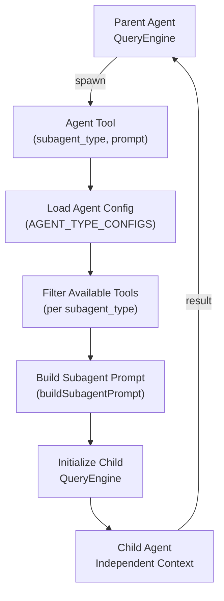
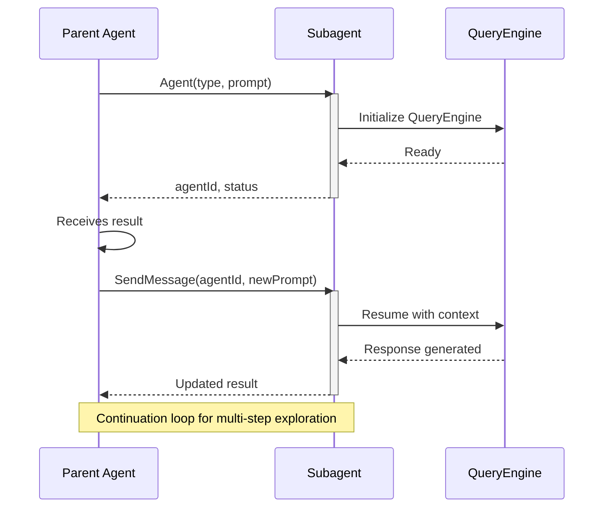
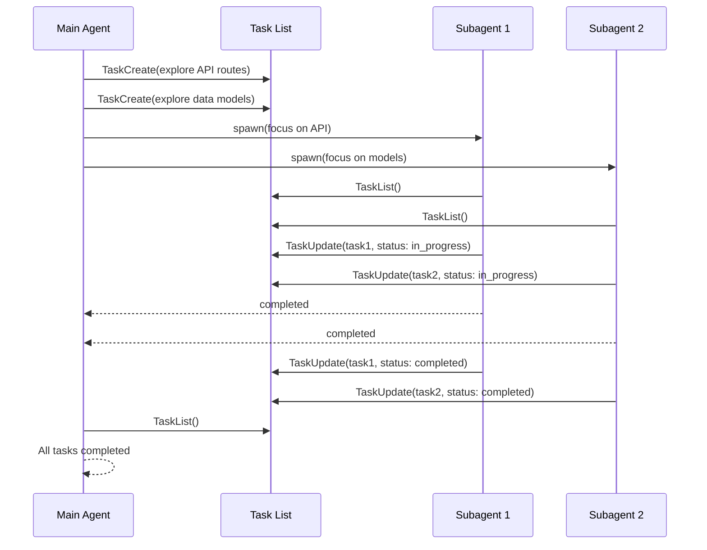
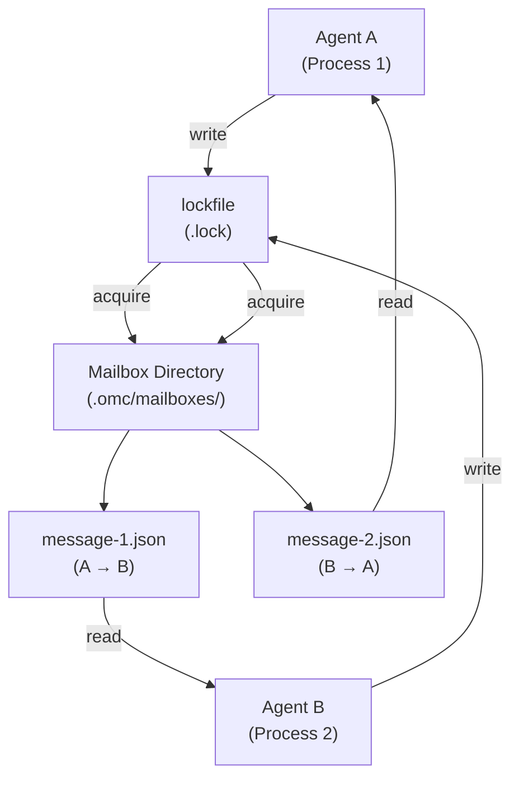
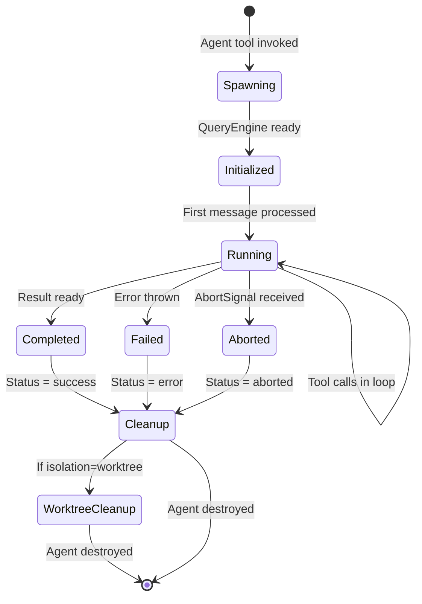

# Subagent Types

Claude Code는 5가지 이상의 특화된 Subagent 유형을 정의하며, 각각은 특정 목적과 제한된 도구 접근 권한을 가집니다.

## Subagent Architecture

Subagent는 런타임에 생성되는 독립적인 Agent 인스턴스로, 격리된 실행 컨텍스트를 가집니다. 각 Subagent는 자체 시스템 프롬프트, 도구 제한, 리소스 할당을 가진 고유한 `QueryEngine`으로 작동합니다.

### 초기화 흐름



### 핵심 아키텍처 개념

**QueryEngine Instance(QueryEngine 인스턴스)**: 각 Subagent는 자신의 `QueryEngine` 인스턴스를 받으며, 격리된 대화 히스토리, 독립적인 도구 상태 관리, 별도의 작업 디렉토리 컨텍스트, Agent 간 데이터 유출 없음을 보장합니다.

**System Prompt Injection**: Subagent 프롬프트는 `buildSubagentPrompt(type, userPrompt)`를 통해 구성되며, 유형별 지침을 로드하고, Agent별 제약 및 기능을 추가하고, 부모-자식 추적을 위한 parentAgentId를 주입하고, 실행 경계를 설정합니다.

**Tool Registration**: 도구는 런타임이 아닌 초기화 시 필터링됩니다. Agent 도구는 Subagent 유형 설정을 읽고, 허용된 도구만으로 도구 레지스트리를 구성합니다.

**Parent-Child Relationship(부모-자식 관계)**: `parentAgentId` 필드를 통해 추적되며, 계층적 중단 신호 전파를 활성화하고, 부모가 자식 진행 상황을 모니터링하고, 중첩된 Subagent 생성을 지원합니다.

---

## 유형별 도구 제한

각 서브에이전트 유형은 **허용 목록 모델**을 사용합니다: 도구는 유형별로 명시적으로 허가되거나 명시적으로 차단됩니다. 허용 목록에 없는 도구는 해당 서브에이전트에서 사용할 수 없습니다.

| 유형 | 차단된 도구 | 사용 가능한 도구 | 목적 | 
|------|--------------|-----------------|---------|
| **general-purpose** | 없음 | 모든 도구 | 전체 기능이 필요한 복잡한 다단계 작업 |
| **Explore** | Agent, Edit, Write, NotebookEdit, ExitPlanMode | 모든 읽기 전용 도구 (Glob, Grep, Read, WebFetch 등) | 빠른 코드베이스 탐색, 읽기 전용 분석 |
| **Plan** | Agent, Edit, Write, NotebookEdit, ExitPlanMode | 모든 읽기 전용 도구 (Glob, Grep, Read, WebFetch 등) | 구현 계획, 설계 전략 |
| **claude-code-guide** | Read, Edit 제외 모두 | Read, Edit, Bash  | Claude Code 사용 질문, 설정 가이드 |
| **statusline-setup** | Read, Edit 제외 모두 | Read, Edit | 상태 표시줄 설정 및 구성 |
| **verification** | Agent, Edit, Write, NotebookEdit, ExitPlanMode | 모든 읽기 전용 도구 (Glob, Grep, Read, WebFetch 등) | 구현 검증, 테스트 및 유효성 검사 |

### 차단된 도구 설명

**Agent**: 서브에이전트가 자신의 서브에이전트를 생성하는 것을 방지합니다 (general-purpose 제외). 이는 폭발적인 생성 계층 구조를 방지하고 컨텍스트 관리를 단순화합니다.

**Edit / Write / NotebookEdit**: 읽기 전용 에이전트 (Explore, Plan, verification)가 코드를 수정하는 것을 방지합니다. 이 유형들은 분석, 계획 및 검증을 위해 설계되었으며, 구현을 위함이 아닙니다.

**ExitPlanMode**: Plan 에이전트에만 관련되며, 의도하지 않은 모드 종료를 방지합니다.

---

## AsyncLocalStorage 격리 패턴

Node.js `AsyncLocalStorage`는 에이전트당 컨텍스트 격리를 제공하여 다음을 보장합니다:
- 각 에이전트는 격리된 대화 히스토리를 가집니다
- 도구 상태는 병렬 에이전트 간에 절대 공유되지 않습니다
- 권한은 에이전트당 적용됩니다
- 병렬로 실행되는 에이전트 간의 교차 오염이 없습니다

### 에이전트 컨텍스트 구조

Node.js `AsyncLocalStorage` (`async_hooks`에서)는 async 실행 체인을 통해 흐르는 데이터를 저장하기 위한 네임스페이스를 제공합니다. 각 에이전트는 고유한 `AsyncLocalStorage` 인스턴스를 얻어 ID, 권한 및 중단 신호와 같은 컨텍스트를 저장합니다.

**작동 방식:**

1. **컨텍스트 생성** - 에이전트가 생성되면 다음을 포함하는 새로운 컨텍스트 객체가 생성됩니다:
   - `agentId`: 에이전트의 고유 식별자
   - `agentType`: `'subagent'` (Agent 도구) 또는 `'teammate'` (swarm 팀원) 중 하나
   - 서브에이전트: `subagentName` (예: "Explore", "Plan"), `parentSessionId`, `permissions`
   - 팀원: `agentName`, `teamName`, `color`, `planModeRequired`
   - `abortController`: 계층적 취소 위함

2. **컨텍스트 바인딩** - 에이전트의 전체 실행은 `asyncStore.run(context, fn)` 내부에서 실행되며, 이는:
   - 컨텍스트를 해당 async 체인에 대한 "로컬 저장소"로 설정
   - 모든 중첩된 `await` 호출이 동일한 컨텍스트를 상속
   - 수동 매개변수 전달 필요 없음

3. **컨텍스트 검색** - 도구 호출, 중첩 함수 및 타이머는 매개변수로 전달하지 않고도 `asyncStore.getStore()`를 통해 컨텍스트에 액세스할 수 있습니다

4. **격리 보장** - 여러 에이전트가 동시에 실행될 때(백그라운드 에이전트, 병렬 탐색), 각 에이전트는 자신의 컨텍스트 네임스페이스를 유지합니다. 에이전트 A의 이벤트는 절대 에이전트 B의 컨텍스트를 보지 않습니다.


### AsyncLocalStorage 격리 흐름

---

## AbortController Hierarchy(AbortController 계층 구조)

Subagent는 `AbortController` 체인을 통한 계층적 취소를 지원합니다. 부모 Agent가 종료되면, 모든 자식 Agent는 중단 신호를 받고 우아하게 정리됩니다.

### Signal Propagation Flow

```mermaid
flowchart TB
    Root["Root AbortController<br/>(main agent)"]
    A1["Agent 1<br/>AbortController"]
    A2["Agent 2<br/>AbortController"]
    A1a["Subagent 1a<br/>AbortController"]
    A1b["Subagent 1b<br/>AbortController"]

    Root --> A1
    Root --> A2
    A1 --> A1a
    A1 --> A1b

    Root -.->|abort()| A1
    Root -.->|abort()| A2
    A1 -.->|abort()| A1a
    A1 -.->|abort()| A1b

    style Root fill:#e74c3c,color:#fff
    style A1 fill:#e67e22,color:#fff
    style A2 fill:#e67e22,color:#fff
    style A1a fill:#f39c12,color:#000
    style A1b fill:#f39c12,color:#000
```

### Lifecycle Example

부모 Agent가 자식 Agent를 생성할 때, 부모의 AbortController 신호가 자식에 전달됩니다. 부모가 취소되면, 신호는 계층을 통해 자식에 전파되어 우아한 정리를 보장합니다.

### Cleanup Guarantees

중단 신호를 받으면 모든 대기 중인 도구 호출이 취소되고, Worktree 정리가 시작되고, 파일 핸들이 닫히고, QueryEngine 인스턴스가 소멸되고, 결과는 `{ aborted: true }` 상태로 반환됩니다.

---

## Communication Patterns

Subagent는 부모 Agent와 세 가지 주요 패턴을 통해 통신합니다:

### 1. SendMessage Pattern(SendMessage 패턴) (Direct Communication/직접 통신)

부모 Agent가 Subagent와의 진행 중인 대화를 계속해야 할 때 사용됩니다.



**사용 시점:** 각 단계가 이전 결과에 따라 달라지는 다단계 탐색, 상호작용적 문제 해결 (왕복 필요), 설계 또는 계획을 반복적으로 개선할 때입니다.

### 2. Task List Pattern(Task List 패턴) (Shared Coordination/공유 조정)

여러 Subagent가 중앙 작업 목록을 통해 작업을 조정해야 할 때 사용됩니다. Agent는 비동기적으로 작업을 읽고, 업데이트하고, 체크합니다.



**사용 시점:** 조정된 핸드오프를 통한 병렬 탐색, 여러 Agent에 걸쳐 분할된 대규모 작업, Agent 경계 전체에서 진행률 추적할 때입니다.

**Task Structure:** 각 작업은 ID, 제목, 설명, 상태(pending, in_progress, completed, failed), 할당 대상 Agent, 생성/업데이트 타임스탐프, 선택적 결과 및 오류 세부정보를 포함합니다.

### 3. File-Based Mailbox Pattern(File-Based Mailbox 패턴) (Resilient IPC/복원력 있는 IPC)

`LocalAgent` 유형에서 JSON 파일 및 lockfile 동기화를 통한 프로세스 간 통신에 사용됩니다.



**장점:** Agent 충돌/재시작 후에도 생존, 프로세스 경계 전체에서 작동, 완료 시 자동 정리, 디버깅을 위해 관찰 가능합니다.

**사용 시점:** 프로세스 간 Agent 통신, 병렬 실행 디버깅, 영구적인 Agent 조정할 때입니다.

---

## Agent Lifecycle Management

Subagent는 생성부터 정리까지의 잘 정의된 라이프사이클을 따릅니다.

### Lifecycle Diagram



### Lifecycle Phases

**Spawning (0-100ms):** `Agent` 도구가 subagent_type 및 프롬프트를 받고, 유형에 대한 `AGENT_TYPE_CONFIGS`를 로드하고, 도구 레지스트리를 필터링하고, 시스템 프롬프트를 구성합니다.

**Initialized (100-200ms):** QueryEngine 인스턴스가 생성되고, AsyncLocalStorage 컨텍스트가 설정되고, AbortController 체인이 구성되고, Worktree가 생성됩니다 (isolation: 'worktree'인 경우).

**Running:** Agent가 메시지를 처리하고, QueryEngine 내에서 도구 호출을 실행하고, 상태가 AsyncLocalStorage에 유지되고, 자식 Agent가 생성될 수 있습니다 (유형이 허용하는 경우).

**Completed/Failed/Aborted:** 결과 객체가 준비되고, 오류 세부 정보가 캡처되고, 중단 신호가 자식에 전파됩니다.

**Cleanup:** 파일 핸들이 닫히고, Worktree가 제거되고, AsyncLocalStorage 컨텍스트가 소멸되고, QueryEngine이 할당 해제됩니다.

### Spawn Parameters

Agent를 생성할 때 호출자는 Agent 유형, 프롬프트, 백그라운드 실행 여부, git Worktree 격리 필요 여부, 부모 Agent ID, 계층적 취소를 위한 AbortSignal, 작업 디렉토리 재정의 및 선택적 시간 제한을 지정합니다. Agent는 완료되면 agentId, 상태(completed, failed, 또는 aborted), 선택적 결과, 오류 세부정보, 실행 시간 (밀리초), 변경사항이 있는 경우 Worktree 경로 및 브랜치 이름을 포함하는 결과 객체를 반환합니다.

---

## Worktree Isolation

Subagent는 격리된 git Worktree에서 실행되어 충돌 없이 코드를 안전하게 수정할 수 있습니다. 병렬 파일 수정이 병합 충돌 없이 가능하고, 임시 브랜치가 자동으로 정리되고, 비파괴적 탐색 (변경사항을 버릴 수 있음)이 가능합니다.

### Worktree Lifecycle

부모 Agent가 `isolation: 'worktree'` 옵션과 함께 Agent를 생성하면, 시스템은 자동으로 git Worktree를 설정합니다. Agent가 변경사항을 만들면, 결과는 worktreePath와 브랜치 이름을 포함합니다. 부모는 이 브랜치에서 PR을 생성할 수 있습니다. 변경사항이 없으면 Worktree가 자동으로 정리됩니다.

### Worktree Isolation Use Cases

- **병렬 구현**: 여러 Agent가 동시에 다양한 기능 구현
- **안전한 탐색**: Agent가 메인 브랜치에 영향을 주지 않고 코드 수정
- **기능 브랜치**: PR 워크플로우를 위한 자동 브랜치 생성
- **롤백 안전성**: Agent가 원치 않는 변경사항을 생성하면 전체 Worktree 버림

---

## 에이전트 유형 비교

| 유형 | 목적 | 사용 가능한 도구 | 주요 제약 | 일반적인 소요 시간 |
|------|---------|----------------|----------------|------------------|
| **general-purpose** | 복잡한 다단계 작업 | 모든 도구 | 기본 유형, 전체 기능 | 30초-5분 |
| **Explore** | 빠른 코드베이스 탐색 | Agent, Edit, Write, NotebookEdit 제외 | 읽기 전용, 최대 3개 병렬 | 에이전트당 5-30초 |
| **Plan** | 구현 계획 | Agent, Edit, Write, NotebookEdit 제외 | 읽기 전용, 상세 계획 반환 | 10-60초 |
| **claude-code-guide** | Claude Code 사용 질문 | Glob, Grep, Read, WebFetch | 정보 검색만 | 5-15초 |
| **statusline-setup** | 상태 표시줄 설정 | Read, Edit | 최소 도구 접근 | 5-10초 |
| **verification** | 구현 검증 | Agent, Edit, Write, NotebookEdit 제외 | 읽기 전용, PASS/FAIL/PARTIAL 반환 | 30초-2분 |

---

## Verification Agent

구현 후의 테스트 및 검증을 위해 특화되었습니다. 코드 변경사항이 실제로 작동하는지 철저히 검증하도록 설계되었습니다.

### 사용 시점
- 중요하지 않은 구현 후 (3개 이상 파일 편집, 백엔드/API 변경사항)
- 인프라 또는 데이터베이스 마이그레이션 완료 전
- 변경사항이 요구사항을 충족하는지 검증하기 위해 (테스트가 통과하는 것만으로는 부족)

### 주요 특성
- **읽기 전용 실행**: 프로젝트 파일을 수정할 수 없음 (임시 디렉토리는 테스트 스크립트용으로 허용)
- **적대적 초점**: 구현을 개선하려 하지 않고, 깨뜨리려고 시도
- **증거 기반 판정**: PASS/FAIL/PARTIAL을 구체적인 증거와 함께 반환 (추론이 아닌 명령 출력)
- **범위**: 테스트, 빌드, linter, API 엔드포인트, 데이터베이스, CLI 도구를 이해

### 출력 형식

검증 결과는 필수 증거를 포함한 구조화된 형식을 따릅니다:

```
### Check: [무엇을 검증하는지]
**실행된 명령:**
  [실행된 정확한 명령]
**관찰된 출력:**
  [실제 터미널 출력: 재해석이 아닌 복사 붙여넣기]
**결과: PASS** (또는 FAIL with Expected vs Actual)
```

Agent는 정확히 하나의 판정 라인으로 끝납니다:
- `VERDICT: PASS`: 구현이 작동함을 확인
- `VERDICT: FAIL`: 완료를 차단하는 문제 발견
- `VERDICT: PARTIAL`: 환경 제약으로 전체 검증 불가능

---

## Fork Subagent (실험적)

Fork는 spawn과 다른 실행 모델입니다. `FORK_SUBAGENT` feature flag를 통해 활성화되면, forking은 다음을 허용합니다:

### Fork와 Spawn의 차이

| 측면 | Spawn (Agent tool) | Fork |
|--------|-------------------|------|
| **시스템 프롬프트** | 유형별로 특화됨 (Explore, Plan 등) | 부모의 정확한 시스템 프롬프트를 상속 |
| **컨텍스트** | 비어 있음 (자식이 새로 시작) | 전체 부모 대화 기록 |
| **도구 풀** | 유형별 (필터된 허용 목록) | 부모의 정확한 도구 (캐시 동일) |
| **실행** | 부모 대기 또는 백그라운드 작업 | 항상 백그라운드 (비동기) |
| **사용 사례** | 독립적 작업, 깔끔한 격리 | 동일한 컨텍스트 내 관련 작업의 병렬 실행 |

### Fork 의미

Agent 도구에 `subagent_type`을 생략하면 implicit fork를 트리거합니다 (활성화 시). 자식은:
- 부모의 전체 대화 및 시스템 프롬프트를 받음
- `<task-notification>`을 통해 백그라운드에서 실행
- 하위 Agent를 생성할 수 없음 (재귀 fork 가드)
- 할당된 지시문 범위 내에 머물러야 함
- 구조화된 형식으로 보고 (Scope, Result, Key files, Files changed, Issues)

---

## Explore Agent

가장 일반적으로 사용되는 Subagent 유형입니다. 읽기 전용 접근으로 빠른 코드베이스 탐색을 위해 설계되었습니다.

### Thoroughness Levels

Explore Agent를 생성할 때, 호출자는 철저함 레벨을 지정합니다:

| 레벨 | 사용 사례 | 검색 범위 |
|-------|----------|--------------|
| `quick` | 기본 파일/패턴 검색 | 특정 디렉토리 또는 1-2개 파일 |
| `medium` | 여러 위치 전체에 대한 중간 탐색 | 5-20개 파일, 여러 디렉토리 |
| `very thorough` | 전체 코드베이스 전체에 대한 포괄적 분석 | 50개 이상 파일, 전체 리포지토리 |

### Usage Pattern

최대 **3개의 Explore Agent**가 병렬로 실행될 수 있으며, 각 Agent는 특정 검색 초점을 받습니다. 부모 Agent는 3개의 병렬 Explore Agent를 생성할 수 있으며, 각각은 서로 다른 검색 초점을 가집니다. 이들은 Promise.all()을 사용하여 병렬로 실행되고, 모두 완료되면 부모는 결과를 집계하여 코드베이스의 통합 이해를 얻습니다.

---

## Plan Agent

코딩 전에 구현 전략을 설계하기 위해 특화되었습니다.

### Capabilities

- 코드를 읽고 아키텍처를 이해
- 대안과 절충안 고려
- 단계별 구현 계획 반환
- 중요한 파일 및 종속성 식별
- 잠재적 위험 및 제약 감지

### Usage Pattern

일반적으로 Explore Agent가 정보를 수집한 후 시작되며, 탐색 결과에서 포괄적인 컨텍스트를 받고, 상세한 계획을 반환합니다 (코드 변경사항 아님). 계획은 구현 중 참고용으로 저장됩니다.

### Plan Output Structure

Plan Agent는 구조화된 구현 계획을 반환하며, 여기에는 전반적인 개요, 단계별 분할, 식별된 위험, 기술 종속성 목록, 노력 추정 및 수정되어야 할 핵심 파일이 포함됩니다.

---

## claude-code-guide Agent(Claude Code 가이드 에이전트)

Claude Code 자체에 대한 질문에 답변하기 위해 특화되었습니다.

### 트리거
사용자가 다음을 묻을 때 사용됩니다:
- "Claude Code는 ... 할 수 있나요?"
- "어떻게 ...?"
- "Claude는 ... 지원하나요?"
- "... 의 차이점은?"

### Knowledge Areas

- 기능 및 기능
- Hooks 및 슬래시 명령어
- MCP 서버 설정
- IDE 통합
- 키보드 단축키
- Agent SDK 사용
- API 사용
- OMC (oh-my-claudecode) 조정 패턴
- Worktree 및 git 통합

### Tool Access

- **Read**: `.claude/` 및 `.omc/` 설정 파일 접근
- **Edit**: 사용자 설정 수정 (settings.json, CLAUDE.md)
- 제한된 Bash: 명령어 도움말 표시 및 상태 확인

---

## Communication Patterns Summary

위의 세 가지 통신 패턴 (SendMessage, Task List, File-Based Mailbox)에 대한 자세한 내용은 `coordinator.md` 및 `task-tools.md` 참조를 확인하세요.

### Pattern Selection Guide

| 패턴 | 지연 시간 | 영구성 | 복잡성 | 최적 사용 |
|---------|---------|-----------|-----------|----------|
| SendMessage | 낮음 (동일 QueryEngine) | 없음 | 낮음 | 다단계 대화, 왕복 |
| Task List | 중간 (에이전트당 동기화) | 있음 | 중간 | 병렬 작업, 조정된 핸드오프 |
| File Mailbox | 높음 (파일 I/O) | 있음 | 높음 | 프로세스 간, 장기 실행 작업 |

---

## Practical Usage Patterns

### Exploration Task
**목표**: 구현 계획 전에 코드베이스 구조 이해

부모 Agent는 Explore Agent를 생성하여 특정 지점의 코드베이스를 검색합니다. 코드베이스에서 모든 API 라우트 정의, 데이터베이스 스키마 파일 및 미들웨어 구현을 찾도록 지시하고 아키텍처를 요약하도록 요청할 수 있습니다.

### Planning Task
**목표**: 탐색 결과에 기반하여 구현 전략 설계

탐색 Agent가 정보를 수집한 후, 부모는 Plan Agent를 생성하여 구현 전략을 설계합니다. 코드베이스 구조, JWT 토큰으로 사용자 인증을 추가하는 방법, 기존 미들웨어 패턴, 데이터베이스 스키마 변경 및 테스트 범위 전략을 고려하는 계획을 설계하도록 요청할 수 있습니다.

### Implementation Task
**목표**: 승인된 계획에 따라 코드 작성

계획이 승인되면, 부모는 general-purpose Agent를 생성하여 인증 기능을 구현합니다. 미들웨어, 라우트, 데이터베이스 마이그레이션 및 테스트를 생성하도록 지시하고, 모든 테스트가 통과하고 기존 API에 대한 주요 변경사항이 없도록 요청합니다. `isolation: 'worktree'` 옵션을 사용하여 변경사항을 격리합니다.

### Configuration Task
**목표**: Claude Code 설정

사용자가 MCP 서버를 활성화하려는 경우, 부모는 claude-code-guide Agent를 생성하여 settings.json을 구성하는 방법과 사용 가능하게 되는 기능을 보여줍니다.

---

## 실전 사용 패턴

### 탐색 작업
**목표**: 구현 계획 전에 코드베이스 구조 이해

```typescript
const result = await spawnAgent({
  type: 'Explore',
  prompt: `코드베이스에서 다음을 찾고:
    1. 모든 API 라우트 정의
    2. 데이터베이스 스키마 파일
    3. 미들웨어 구현
    그 후 아키텍처를 요약하세요.`,
});
```

### 계획 작업
**목표**: 탐색 결과에 기반하여 구현 전략 설계

```typescript
const plan = await spawnAgent({
  type: 'Plan',
  prompt: `이 코드베이스 구조를 기반으로: [탐색 결과]
    JWT 토큰을 사용한 사용자 인증을 추가하는 계획을 설계하세요.
    고려사항: 기존 미들웨어 패턴, 데이터베이스 스키마 변경,
    테스트 범위 전략.`,
});
```

### 구현 작업
**목표**: 승인된 계획에 따라 코드 작성

```typescript
const implementation = await spawnAgent({
  type: 'general-purpose',
  prompt: `이 계획에 따라 인증 기능을 구현하세요: [계획 세부정보]
    생성: 미들웨어, 라우트, 데이터베이스 마이그레이션, 테스트.
    보장: 모든 테스트 통과, 기존 API에 대한 주요 변경사항 없음.`,
  isolation: 'worktree',  // 변경사항 격리
});
```

### 설정 작업
**목표**: Claude Code 설정

```typescript
const config = await spawnAgent({
  type: 'claude-code-guide',
  prompt: `웹 검색 및 파일 작업을 위해 MCP 서버를 활성화하고 싶습니다.
    settings.json을 어떻게 설정하고 사용 가능하게 되는 기능은 무엇인가요?`,
});
```

---

## 교차 참조

- **부모 에이전트 조정**: `coordinator.md`에서 조정 패턴 참조
- **작업 추적**: `task-tools.md`에서 구조화된 작업 관리 참조
- **도구 제한**: `agent-tool.md`에서 구현 세부 정보 참조
- **OMC 통합**: `oh-my-claudecode.md`에서 다중 에이전트 조정 참조
