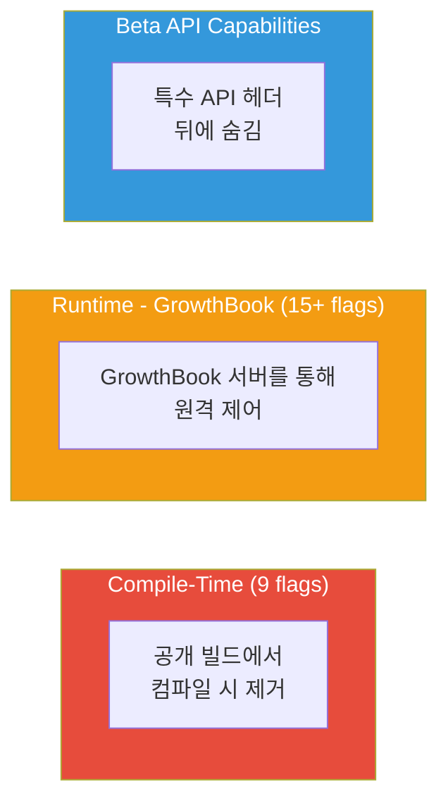
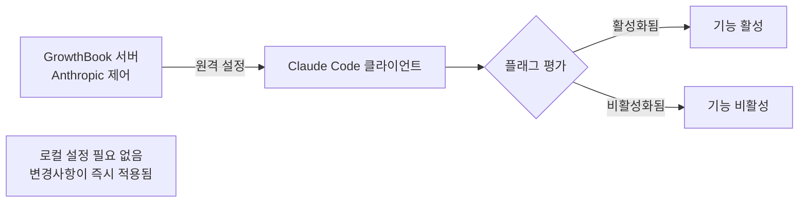

# Feature Flags

유출된 소스코드에서 완전히 구현되었지만 미출시된 기능을 제어하는 **44개 Feature Flag**가 발견되었습니다. 이 플래그들은 관리 방식에 따라 3가지 카테고리로 분류됩니다.

## 플래그 카테고리

## 컴파일 타임 플래그 (9개)

이 기능들은 컴파일 중에 공개 빌드에서 완전히 제거됩니다. 코드는 소스에 존재하지만 배포된 바이너리에서는 데드코드 제거됩니다.

| 플래그 | 기능 | 상태 | 추가 게이트 |
|--------|------|------|-----------|
| `KAIROS` | 자율 데몬 모드 | 완전 구현 | 없음 |
| `COORDINATOR_MODE` | 멀티 에이전트 오케스트레이션 | 완전 구현 | `CLAUDE_CODE_COORDINATOR_MODE` env var |
| `VOICE_MODE` | Push-to-talk 음성 인터페이스 | 구현됨 | `tengu_amber_quartz_disabled` GrowthBook flag (킬스위치) |
| `ULTRAPLAN` | 30분 원격 계획 세션 | 구현됨 | 없음 |
| `BUDDY` | 터미널 펫 (18종, 희귀도 등급) | 구현됨 | 없음 |
| `NATIVE_CLIENT_ATTESTATION` | Zig HTTP 레벨 DRM 해시 | 빌드에 활성 | 없음 |
| `ANTI_DISTILLATION_CC` | 가짜 도구 주입 | 빌드에 활성 | 없음 |
| `VERIFICATION_AGENT` | 구현 검증 Agent | 완전 구현 | `tengu_hive_evidence` GrowthBook flag |
| `FORK_SUBAGENT` | Subagent용 Fork 실행 모델 | 구현됨 | 없음 |

### 구현 참고사항

- **명시적 feature() 게이트가 없는 디렉토리**: Voice (`/src/voice`), Buddy (`/src/buddy`), UltraPlan 모듈은 소스 코드에 독립 실행형 구현으로 존재합니다. 이들은 코드 전체에 인라인 `feature()` 호출이 아니라 모듈 진입점 (예: `isVoiceGrowthBookEnabled()`, `isBuddyLive()`)에서 게이트됩니다.

## 런타임 플래그: GrowthBook (15+)

이 플래그들은 `tengu_` 접두사를 사용하며 [GrowthBook](https://www.growthbook.io/)을 통해 원격 제어됩니다. Anthropic은 새 빌드를 푸시하지 않고도 이들을 토글할 수 있습니다.

### 주요 Feature Flags

| 플래그 | 제어 대상 | 유형 |
|--------|----------|------|
| `tengu_hive_evidence` | 검증 Agent 활성화 (프로덕션 기능) | Boolean |
| `tengu_onyx_plover` | AutoDream 설정: `{ enabled, minHours, minSessions }` | Object |
| `tengu_cobalt_raccoon` | Reactive-only 컴팩트 모드 | Boolean |
| `tengu_time_based_microcompact` | 시간 기반 microcompact 동작 | Boolean |
| `tengu_amber_stoat` | Explore/Plan Agent 활성화 (A/B 테스트) | Boolean |
| `tengu_amber_quartz_disabled` | Voice 모드 킬스위치 (긴급 off) | Boolean |
| `tengu_anti_distill_fake_tool_injection` | 가짜 도구 주입 on/off | Boolean |
| `tengu_attribution_header` | 클라이언트 인증 헤더 on/off | Boolean |
| `tengu_security_classifier_*` | 보안 분류기 동작 | Various |
| `tengu_scratch` | Scratchpad 기능 가용성 | Boolean |

### GrowthBook 아키텍처

주요 속성:
- 플래그는 런타임에 원격 설정에 대해 평가됨
- 변경사항이 로컬 업데이트 없이 적용됨
- 사용자 세그먼트 전체에서 A/B 테스트 가능
- 수정된 빌드에서 텔레메트리를 제거할 수 있으며 로컬 플래그 평가에는 영향을 주지 않음

## 주요 숨겨진 기능

### KAIROS: 자율 데몬
가장 중요한 숨겨진 기능. [KAIROS 딥다이브](../agents/kairos.md) 참조.

### VOICE_MODE: Push-to-Talk
- 키보드 단축키로 마이크 활성화
- 실시간 음성 → 텍스트 변환
- 핸즈프리 코딩을 위한 인터페이스

### ULTRAPLAN: 원격 계획
- 30분 계획 세션
- Anthropic 인프라에서 원격 실행
- 복잡한 아키텍처 결정을 위한 설계

### BUDDY: 터미널 펫
가장 예상치 못한 발견:
- 18종의 다른 종
- 희귀도 등급 시스템
- 터미널에서 Claude Code와 함께 표시
- 순수 장식/엔터테인먼트 기능

## 피처 플래그가 보여주는 것

44개 플래그는 Claude Code가 반응형 코딩 어시스턴트에서 자율적, 멀티모달, 멀티에이전트 개발 플랫폼으로 진화하는 로드맵을 보여준다.
