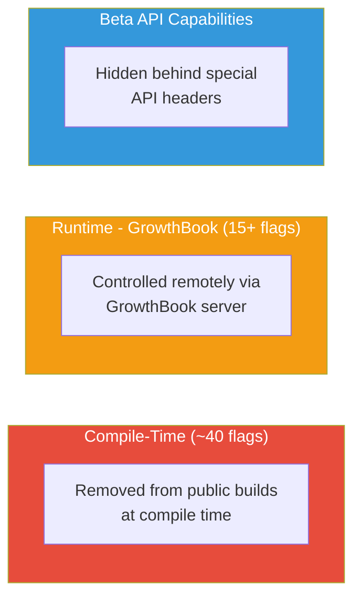
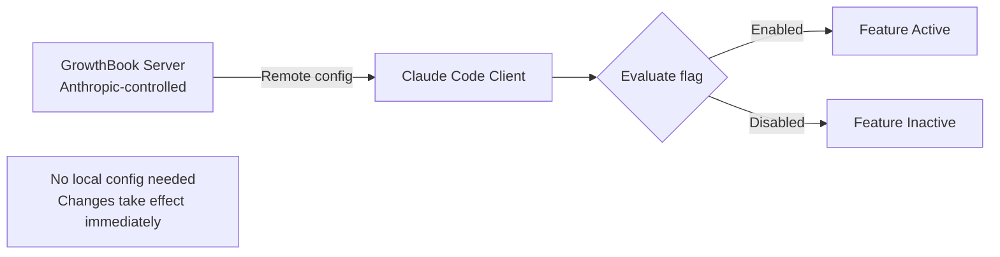
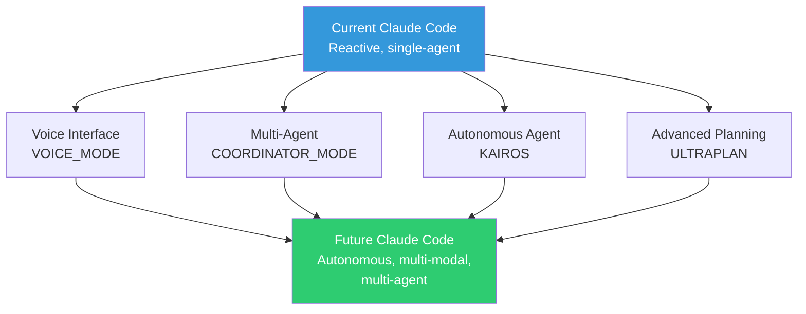

# 피처 플래그

유출된 소스 코드는 완전히 구현되었지만 아직 공개되지 않은 기능을 제어하는 **50개 이상의 피처 플래그**를 드러냅니다. 이 플래그들은 관리 방식에 따라 세 가지 범주로 나뉩니다.

> **참고:** 다음 목록은 소스 코드 분석을 통해 식별된 플래그를 나타냅니다. 내부 빌드에는 분석된 소스에서 보이지 않는 추가 플래그가 있을 수 있습니다. 플래그 개수는 약이며 빌드 설정에 따라 다양합니다.

## 플래그 범주

## 컴파일 타임 플래그 (~40)

이러한 기능은 컴파일 중에 공개 빌드에서 완전히 제거됩니다. 코드는 소스에 존재하지만 배포된 바이너리에서는 데드 코드 제거됩니다. 아래 표는 주요 플래그를 보여주며, 전체 소스에는 UI 기능, 압축 단계, 보안 분류기, 에이전트 모드, 내부 도구를 포괄하는 약 40개의 컴파일 타임 게이트가 있습니다.

| 플래그 | 기능 | 상태 | 추가 게이트 |
|------|---------|--------|-----------------|
| `KAIROS` | 자율 데몬 모드 | 완전히 구현됨 | 없음 |
| `COORDINATOR_MODE` | 멀티 에이전트 오케스트레이션 | 완전히 구현됨 | `CLAUDE_CODE_COORDINATOR_MODE` 환경변수 |
| `VOICE_MODE` | 푸시투톡 음성 인터페이스 | 구현됨 | `tengu_amber_quartz_disabled` GrowthBook 플래그 (킬스위치) |
| `ULTRAPLAN` | 30분 원격 계획 세션 | 구현됨 | 없음 |
| `BUDDY` | 터미널 펫 (다양한 종, 레어티 계층) | 구현됨 | 없음 |
| `NATIVE_CLIENT_ATTESTATION` | Zig HTTP 레벨 DRM 해시 | 빌드에서 활성 | 없음 |
| `ANTI_DISTILLATION_CC` | 가짜 도구 주입 | 빌드에서 활성 | 없음 |
| `VERIFICATION_AGENT` | 구현 검증 에이전트 | 완전히 구현됨 | `tengu_hive_evidence` GrowthBook 플래그 |
| `FORK_SUBAGENT` | 서브에이전트를 위한 포크 실행 모델 | 구현됨 | 없음 |
| `CONTEXT_COLLAPSE` | 컨텍스트 관리를 위한 단계적 대화 축소 | 구현됨 | 없음 |
| `PROACTIVE` | 능동적 제안 모드 | 구현됨 | 없음 |
| `DAEMON` | 백그라운드 데몬/워커 모드 | 구현됨 | 없음 |
| `BRIDGE_MODE` | 원격 머신 브릿지 (WebSocket REPL) | 구현됨 | 없음 |
| `WORKFLOW_SCRIPTS` | 워크플로 자동화 스크립트 | 구현됨 | 없음 |
| `HISTORY_SNIP` | 고아 메시지 가비지 컬렉션 | 구현됨 | 없음 |
| `CACHED_MICROCOMPACT` | 캐시 인식 도구 결과 컴팩션 | 구현됨 | `tengu_cache_plum_violet` GrowthBook 플래그 |
| `BASH_CLASSIFIER` | Bash 명령 보안 분류 | 구현됨 | 없음 |
| `TRANSCRIPT_CLASSIFIER` | AI 권한 분류기가 있는 자동 모드 | 구현됨 | 자사 빌드만 |

### 구현 참고사항

- **명시적 feature() 게이트가 없는 디렉토리**: Voice (`/src/voice`), Buddy (`/src/buddy`), UltraPlan 모듈은 소스 코드에 독립적인 구현으로 존재합니다. 이들은 코드 전체에서 인라인 `feature()` 호출 대신 모듈 진입점(예: `isVoiceGrowthBookEnabled()`, `isBuddyLive()`)에서 게이트됩니다.

## 런타임 플래그: GrowthBook (15+)

이 플래그들은 `tengu_` 접두사를 사용하며 피처 플래깅 서비스인 [GrowthBook](https://www.growthbook.io/)을 통해 원격으로 제어됩니다. Anthropic은 새 빌드를 푸시하지 않고도 이 플래그들을 전환할 수 있습니다.

### 주요 피처 플래그

| 플래그 | 제어 대상 | 타입 |
|------|----------|------|
| `tengu_hive_evidence` | 검증 에이전트 활성화 (프로덕션 기능) | Boolean |
| `tengu_onyx_plover` | AutoDream 설정: `{ enabled, minHours, minSessions }` | Object |
| `tengu_cobalt_raccoon` | 반응형 전용 컴팩트 모드 | Boolean |
| `tengu_time_based_microcompact` | 시간 기반 마이크로컴팩트 동작 | Boolean |
| `tengu_amber_stoat` | Explore/Plan 에이전트 활성화 (A/B 테스트) | Boolean |
| `tengu_amber_quartz_disabled` | 음성 모드 킬스위치 (긴급 끔) | Boolean |
| `tengu_anti_distill_fake_tool_injection` | 가짜 도구 주입 켜기/끄기 | Boolean |
| `tengu_attribution_header` | 클라이언트 증명 헤더 켜기/끄기 | Boolean |
| `tengu_security_classifier_*` | 보안 분류기 동작 | 다양함 |
| `tengu_scratch` | 스크래치패드 기능 가용성 | Boolean |
| `tengu_slate_prism` | 커넥터 텍스트 요약 (안티 디스틸레이션) | Boolean |
| `tengu_amber_json_tools` | 토큰 효율성을 위한 JSON 도구 형식 | Boolean |
| `tengu_cache_plum_violet` | 캐시된 마이크로컴팩트 설정 | Object |
| `tengu_slate_heron` | 시간 기반 마이크로컴팩트 설정 | Object |
| `tengu_session_memory` | 세션 메모리 컴팩션 | Boolean |
| `tengu_sm_compact` | 세션 메모리 컴팩트 게이트 | Boolean |
| `tengu_compact_cache_prefix` | 컴팩션을 위한 프롬프트 캐시 공유 | Boolean |
| `tengu_auto_mode_config` | 자동 모드 분류기 설정 | Object |
| `tengu_ant_model_override` | 내부 모델 오버라이드 (개미만) | Object |

### GrowthBook 아키텍처

주요 특성:
- 플래그는 런타임 시 원격 설정에 대해 평가됩니다
- 로컬 업데이트 없이 변경 사항이 즉시 적용됩니다
- 사용자 세그먼트 전체에서 A/B 테스트할 수 있습니다
- 수정된 빌드에서 원격 분석을 제거할 수 있지만 로컬 플래그 평가에는 영향을 주지 않습니다

## 베타 API 헤더

피처 플래그 외에도 Claude Code는 **베타 API 헤더**를 사용하여 실험적 서버 측 기능을 활성화합니다. 이 헤더들은 API 요청과 함께 전송되며 클라이언트와 서버 조율이 필요한 기능을 활성화합니다. 25개 이상의 베타 헤더가 존재하며, API 제공자(자사, Bedrock, Vertex, Foundry)별로 필터링됩니다.

주목할 만한 베타 기능:

| 헤더 목적 | 설명 |
|-----------|------|
| 확장 컨텍스트 (1M 토큰) | 전체 1M 토큰 컨텍스트 윈도우 활성화 |
| 인터리브 사고 | 모델이 추론과 도구 호출을 인터리브할 수 있음 |
| 프롬프트 캐시 범위 | 프롬프트 캐시 세분성 제어 |
| 커넥터 텍스트 요약 | 안티 디스틸레이션을 위한 서버 측 추론 체인 압축 (자사만) |
| 토큰 효율적 도구 형식 | 출력 토큰을 약 4.5% 감소시키는 JSON 기반 도구 호출 형식 (자사만) |
| 웹 검색 | 내장 웹 검색 기능 활성화 |
| 구조화된 출력 | JSON 스키마 제약 모델 출력 활성화 |

일부 베타 헤더는 자사 Anthropic 빌드로만 제한되며, 활성화 전에 추가 GrowthBook 플래그 뒤에 숨겨져 있습니다.

## 주요 숨겨진 기능

### KAIROS: 자율 데몬
가장 중요한 숨겨진 기능입니다. [KAIROS 심화 문서](../agents/kairos.md)를 참고하세요.

- 150개 이상의 소스 코드 참조
- 완전히 구현된 백그라운드 에이전트
- `autoDream` 메모리 통합
- GitHub 웹훅 구독

### VOICE_MODE: 푸시투톡
Claude Code를 위한 음성 인터페이스:
- 푸시투톡 활성화
- 입력을 위한 음성 인식
- 응답을 위한 텍스트 음성 변환
- 손 없이 코딩하도록 설계됨

### ULTRAPLAN: 원격 계획
확장된 계획 세션:
- 30분 계획 세션
- 원격 실행 (로컬이 아님)
- 복잡한 아키텍처 결정을 위해 설계됨
- 다양한 모델 호출을 포함할 수 있음

### BUDDY: 터미널 펫
가장 예상 밖의 발견:
- 다양한 종 사용 가능
- 레어티 계층 시스템
- Claude Code와 함께 터미널에서 생활
- 순수하게 장식용/오락용 기능

### COORDINATOR_MODE: 멀티 에이전트
멀티 워커 오케스트레이션:
- 다양한 워커 에이전트를 생성합니다
- 코디네이터가 작업 분배를 관리합니다
- 워커들은 병렬로 작동합니다
- 결과는 코디네이터가 취합합니다

## 피처 플래그의 의미

50개 이상의 플래그는 Anthropic의 제품 로드맵을 드러냅니다:

피처 플래그는 Claude Code가 반응형 코딩 어시스턴트에서 자율적이고 멀티모달한 멀티 에이전트 개발 플랫폼으로 진화하고 있다는 모습을 보여줍니다.
