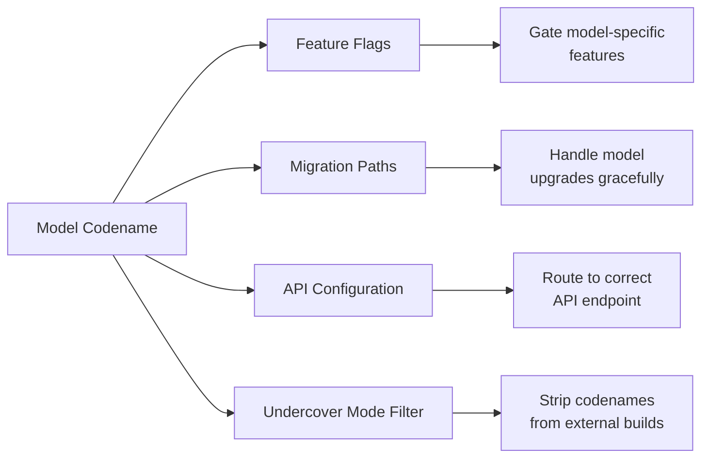

# 모델 및 프로젝트 코드네임

소스 코드에는 모델과 프로젝트에 대한 내부 코드네임이 포함되어 있습니다. 이 코드네임들은 피처 플래그, 마이그레이션 경로, 설정 코드에서 발견됩니다.

> **참고:** 아래 설명하는 코드네임-모델 매핑은 소스 코드 컨텍스트(설정 경로, 마이그레이션 로직, 피처 플래그 연관)에서 추론한 것입니다. 이 코드네임 뒤의 실제 모델 정체는 클라이언트 소스 코드에서 확정적으로 확인되지 않습니다. Tengu 프로젝트 코드네임만이 네임스페이스 접두사로서의 광범위한 사용을 통해 확인되었습니다.

## 코드네임 맵

| 코드네임 | 유형 | 세부사항 |
|----------|------|----------|
| **Capybara** | 모델 | "fast mode" 설정에서 발견; Sonnet 계열 변형으로 추정 |
| **Fennec** | 모델 | 마이그레이션 경로에서 참조; 이전 세대 모델로 추정 |
| **Numbat** | 모델 | 설정 항목에서 참조; 예정된 모델로 보임 |
| **Tengu** | 프로젝트 | Claude Code 자체의 내부 코드네임으로 **확인됨** |

## Capybara

Capybara는 소스 코드에서 "fast mode" 설정과 관련하여 나타나는 내부 코드네임입니다. 코드베이스의 컨텍스트로 볼 때 — fast-mode 설정 및 1M-토큰 컨텍스트 참조와 함께 나타나 — 서로 다른 모델 계열이 아닌 더 빠른 출력을 위해 최적화된 모델 변형을 가리킬 가능성이 높습니다.

### 주요 관찰 사항

- **1M 토큰** 컨텍스트 윈도우 관련 참조와 함께 등장
- "fast mode"와 연관 (다른 모델이 아닌 동일 모델의 빠른 출력 최적화)
- 모델 설정 및 라우팅 로직에서 사용됨

::: info
Claude Code의 "Fast mode"는 동일한 기본 모델을 사용하면서 더 빠른 토큰 생성을 최적화합니다. Capybara 코드네임은 이 모드와 관련된 설정 경로에서 나타납니다.
:::

## Fennec

Fennec은 이전 세대 모델의 코드네임으로 보입니다. 소스 코드에는 이 코드네임을 참조하는 마이그레이션 경로가 포함되어 있어 구조화된 모델 업그레이드 프로세스를 시사합니다.

- 설정 전환을 위한 마이그레이션 코드가 존재
- 피처 플래그가 하위 호환성을 위해 Fennec을 참조
- Anthropic이 전환 기간 동안 병렬 모델 버전을 유지함을 시사

이 코드네임 뒤의 정확한 모델은 불명확하며, 마이그레이션 경로는 최신 모델 세대를 위해 단계적으로 제거되었음을 시사합니다.

## Numbat

Numbat은 소스 코드에서 발견되는 또 다른 코드네임으로, 계획 중이거나 예정된 모델일 수 있음을 시사하는 설정 항목에서 참조됩니다.

- 설정 항목이 향후 가용성 기간을 참조
- Numbat 특화 동작을 게이팅하는 피처 플래그 존재
- 설정 항목이 서로 다른 기능 프로필을 시사

::: warning
소스 코드에 Numbat이 존재한다는 것은 Anthropic이 다양한 개발 단계에 있는 추가 모델을 보유하고 있음을 시사합니다.
:::

Numbat이 현재 테스팅 중인 모델을 나타내는지 또는 향후 릴리스를 위해 계획된 모델인지는 클라이언트 소스만으로는 확인할 수 없습니다.

## Tengu (프로젝트 코드네임)

Capybara, Fennec, Numbat과 달리 Tengu는 모델 코드네임이 아닙니다. **Claude Code 자체의 내부 프로젝트 코드네임**입니다.

Tengu는 여러 시스템에 걸쳐 네임스페이스 접두사로 나타납니다:

| 용도 | 예시 |
|------|------|
| 피처 플래그 | `tengu_hive_evidence` (검증 에이전트), `tengu_onyx_plover` (autoDream) |
| GrowthBook 제어 플래그 | `tengu_anti_distill_fake_tool_injection`, `tengu_attribution_header` |
| 텔레메트리 이벤트 | `tengu_` 접두사가 붙은 분석 이벤트 |
| 설정 키 | 다양한 `tengu_` 접두사 설정 |

`tengu_` 접두사는 피처 플래그, 텔레메트리, 설정을 Claude Code 제품에 구체적으로 연결하는 일관된 네임스페이스를 제공합니다 (Claude.ai 등 다른 Anthropic 제품과 구별).

## 코드네임 사용 방식

### 언더커버 모드 연동

[언더커버 모드](../security/undercover-mode.md)는 외부 빌드에서 이 코드네임의 공개를 구체적으로 방지합니다. 시스템은 공개 또는 오픈소스 저장소에서 작업할 때 Capybara, Fennec, Numbat, Tengu의 모든 언급을 출력에서 제거하도록 설정되어 있습니다.
