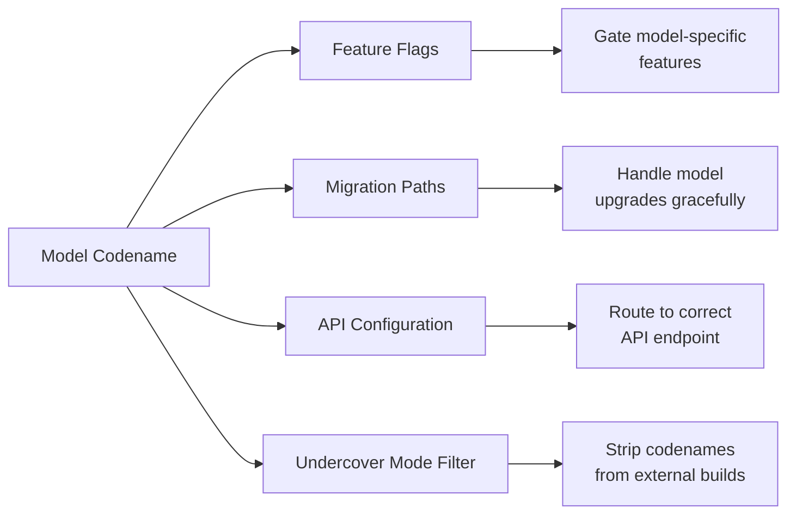

# Model Codenames

유출된 소스코드에서 공식적으로 문서화되지 않은 Claude 모델의 내부 Codename이 발견되었다. 이 Codename들은 Feature Flag, 마이그레이션 경로, 설정 코드에 등장한다.

## Codename 맵

| Codename | 모델 | 상세 |
|----------|------|------|
| **Capybara** | Sonnet 시리즈 v8 | 1M Context Window, "fast mode" 변형 |
| **Fennec** | Opus 4.6 전신 | 소스에 마이그레이션 경로 존재 |
| **Numbat** | 차기 미출시 모델 | 출시 일정이 소스코드에 포함 |
| **Tengu** | 내부 프로젝트 Codename | Feature Flag, 텔레메트리, 분석에 사용 |

## Capybara (Sonnet v8)

Capybara는 1M Context Window를 가진 Sonnet 시리즈 v8 모델의 내부 Codename이다. "fast mode"를 구동하는 모델로 소스코드에 등장한다.

### 주요 관측

- Context Window: **1M 토큰**
- "fast mode" 변형 존재 (동일 모델, 빠른 출력 최적화)
- **거짓 주장률**: 29-30%, v4의 16.7%에서 눈에 띄는 회귀
- 이 회귀는 v8에서의 속도-정확도 트레이드오프를 시사

::: info
Claude Code의 "Fast mode"는 동일한 모델(Capybara/Sonnet)을 사용하며, 다른 모델이 아니다. 동일 품질 수준에서 더 빠른 토큰 생성을 최적화하지만, 거짓 주장률 데이터는 일부 정확도 트레이드오프를 시사한다.
:::

## Fennec (Pre-Opus 4.6)

Fennec은 Opus 4.6의 전신이다. 소스코드에 Fennec에서 현재 Opus 모델로의 마이그레이션 경로가 포함되어 있어, 구조화된 모델 업그레이드 프로세스를 보여준다.

## Numbat 

Numbat은 가장 흥미로운 코드네임이다. 공개적으로 발표되지 않은 **차세대 모델**을 지칭한다.

- 출시 일정이 소스코드에 임베딩됨
- Numbat 전용 동작을 게이트하는 피처 플래그 존재
- 설정 항목이 다른 능력 프로파일을 시사

## Tengu (프로젝트 Codename)

Capybara, Fennec, Numbat과 달리, Tengu는 모델 코드네임이 아니다. Claude Code 자체의 **내부 프로젝트 코드네임**입니다.

Tengu는 여러 시스템에 걸쳐 네임스페이스 접두사로 나타납니다:

| 사용처 | 예시 |
|--------|------|
| Feature flags | `tengu_hive_evidence` (검증 Agent), `tengu_onyx_plover` (autoDream) |
| GrowthBook 제어 플래그 | `tengu_anti_distill_fake_tool_injection`, `tengu_attribution_header` |
| 텔레메트리 이벤트 | `tengu_` 접두사 분석 이벤트 |
| 설정 키 | 다양한 `tengu_` 접두사 설정 |

`tengu_` 접두사는 Feature Flag, 텔레메트리, 설정을 Claude Code 제품에 특정하게 연결하는 일관된 네임스페이스를 제공합니다 (Claude Code 인프라를 Claude.ai 같은 다른 Anthropic 제품과 구분).

## Codename 사용 방법

### Undercover Mode 통합

[Undercover Mode](../security/undercover-mode.md)는 특히 외부 빌드에서 이 코드네임들의 공개를 방지합니다. 시스템은 공개 또는 오픈소스 리포지토리에서 작동할 때 출력에서 Capybara, Fennec, Numbat, Tengu에 대한 모든 언급을 제거하도록 설정됩니다.
