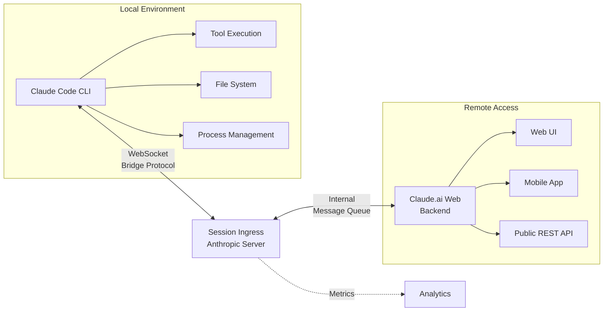

# 미출시 기능

주요 숨겨진 기능 문서 외에도 유출된 소스에는 추가적인 여러 미출시 기능들이 있습니다. 이 문서에서는 각 시스템의 심층적인 기술 분석을 제공하며, 구현 세부 사항, 아키텍처 다이어그램 및 통합 패턴을 포함합니다.

## Voice Mode

| 속성 | 세부 사항 |
|----------|---------|
| 구현 | 독립 실행형 모듈로 완전 구현 |
| 컴파일 타임 플래그 | `VOICE_MODE` |
| 런타임 게이트 | `tengu_amber_quartz_disabled` GrowthBook 킬스위치 |
| 인터페이스 | Push-to-talk |
| 입력 | Speech-to-text (streaming) |
| 출력 | Text-to-speech synthesis |
| 모듈 위치 | `/src/voice/` |

Voice Mode는 Claude Code에 push-to-talk 인터페이스를 추가하여 완전한 오디오 파이프라인을 통해 핸즈프리 상호 작용을 활성화합니다. 구현에는 다음이 포함됩니다:

- **Microphone activation** 키보드 단축키를 통해 (일반적으로 Alt+Space 또는 Cmd+Space)
- **Real-time speech-to-text transcription** 스트리밍 오디오 처리
- **Response delivery via text-to-speech** synthesis
- **Integration with the existing tool system**: voice 명령어는 텍스트 입력과 동일한 도구를 트리거합니다
- **Voice keyterm detection**: 웨이크 워드 및 명령 구문을 인식하여 STT 성능을 최적화합니다

### Audio Pipeline Architecture

전체 오디오 흐름은 다음과 같이 작동합니다:

```
Microphone
    ↓
Audio Capture (WebAudio API or platform native)
    ↓
voiceStreamSTT.ts: Streaming Speech-to-Text
    ↓
Text Input Buffer
    ↓
Claude Model Processing (existing)
    ↓
Text Output
    ↓
TTS Engine (Web Speech API or platform native)
    ↓
Speaker Output
```

### Implementation Details

**Streaming STT Processing** (`voiceStreamSTT.ts`):
- 오디오를 ~100-200ms 버퍼로 청킹합니다
- 최소 지연 시간으로 업스트림 STT 서비스에 청크를 전송합니다
- 더 나은 인식 정확도를 위해 스트리밍 컨텍스트를 유지합니다
- 마이크 권한 요청 및 디바이스 열거를 처리합니다
- 기본 서비스를 사용할 수 없는 경우 대체 STT 제공자로 폴백합니다

**Voice Command Integration**:
- Voice 입력은 텍스트로 변환되고 표준 입력 시스템에 주입됩니다
- Voice에 의해 트리거되는 도구 호출은 텍스트 기반 호출과 동일한 실행 경로를 사용합니다
- Voice 컨텍스트는 디버깅 및 분석을 위해 세션에 보존됩니다

**Keyterm Detection**:
- 트리거 구문을 식별하기 위한 전처리 단계 ("hey Claude", "run test" 등)
- 주변 소음에 대한 불필요한 STT 처리를 줄입니다
- 사용자/조직별 기본 설정에 따라 사용자 정의할 수 있습니다

Voice Mode는 현재 컴파일 타임 플래그 뒤에 게이트되어 있으며 공개 빌드에서는 사용할 수 없습니다.

---

## UltraPlan

| 속성 | 세부 사항 |
|----------|---------|
| 구현 | 독립 실행형 모듈로 완전 구현 |
| 컴파일 타임 플래그 | `ULTRAPLAN` |
| 지속 시간 | 최대 30분 |
| 실행 | 원격 (Anthropic 인프라) |
| 목적 | 복잡한 아키텍처 계획 |
| 명령 | `/ultraplan` |
| 모듈 위치 | `/src/ultraplan/` |

UltraPlan은 현재 [Plan mode](../agents/subagent-types.md)를 복잡한 아키텍처 결정을 위해 설계된 원격, 장기 실행 변형으로 확장합니다:

### 표준 Plan Mode와의 비교

| 기능 | Plan Mode | UltraPlan |
|---------|-----------|----------|
| **실행** | Local (Claude Code CLI) | Remote (Anthropic servers) |
| **지속 시간** | 2-5분 | 최대 30분 |
| **모델 호출** | Single-pass analysis | 여러 반복 호출 |
| **상태 접근** | 파일시스템 전체 읽기/쓰기 | 파일 업로드를 통한 읽기 전용 |
| **파일시스템** | 직접 접근 | Sandboxed upload |
| **의도된 사용** | 기능 계획, 리팩토링 | 시스템 아키텍처, 다중 서비스 설계 |
| **비용 모델** | CLI 사용량에 포함 | 별도로 측정됨 |

### UltraPlan 실행 흐름

```
1. 사용자가 /ultraplan을 호출합니다
2. Claude Code는 프로젝트 컨텍스트 + 요구사항을 Anthropic API에 업로드합니다
3. 원격 계획 Agent가 병렬 실행 환경에서 초기화됩니다
4. 여러 모델 호출 (Claude 3.x variants)이 문제를 반복적으로 분석합니다:
   - First pass: 문제를 구성 요소로 분해
   - Refinement passes: 가정 유효성 검사, 디자인 스트레스 테스트
   - Final pass: 구현 로드맵 생성
5. Plan artifact가 다운로드되어 `.claude/plans/`에 저장됩니다
6. 사용자는 계획을 검토, 승인 또는 피드백으로 반복할 수 있습니다
```

### 기술 통합

- Plan은 `.claude/plans/ultplan-{id}.md` 형식으로 직렬화됩니다
- 원격 계획은 로컬 계획과 동일한 승인/거부 워크플로우를 준수합니다
- 파일 업로드는 인증된 엔드포인트를 사용하며 선택적 암호화를 사용합니다
- 계획 세션을 30분 윈도우 내에서 일시 중지 및 재개할 수 있습니다
- 원격 플래너의 도구 호출이 로깅되고 감사될 수 있습니다

### 사용 사례
- **Microservices architecture review**: 10개 이상의 시스템에 걸쳐 서비스, 데이터 흐름 및 API 계약을 설계합니다
- **Framework migration**: 최소한의 breaking changes로 다중 주 TypeScript-to-Rust 마이그레이션을 계획합니다
- **Security hardening**: 프로덕션 시스템에 대한 포괄적인 위협 모델 + 완화 전략입니다
- **Performance optimization**: 지연 시간이 중요한 애플리케이션을 위한 풀 스택 분석입니다

---

## Buddy: Terminal Pet

| 속성 | 세부 사항 |
|----------|---------|
| 구현 | 독립 실행형 모듈로 완전 구현 |
| 컴파일 타임 플래그 | `BUDDY` |
| 종 | 18가지 유형 |
| 희귀도 | Tiered system (Common → Legendary) |
| 함수 | Cosmetic / engagement feature |
| 모듈 위치 | `/src/buddy/` |

가장 예상치 못한 발견. Claude Code 옆에 나타나는 터미널용 가상 반려동물 시스템입니다:

### Species Collection System

Buddy는 18가지 종의 수집 메커니즘을 특징으로 합니다:

- **Common species** (50% drop rate): 최소한의 애니메이션을 갖춘 기본 ASCII art creatures
- **Uncommon species** (30% drop rate): 2-3개의 애니메이션 프레임을 포함한 더 자세한 디자인
- **Rare species** (15% drop rate): 유동적인 애니메이션이 있는 복잡한 emoji/Unicode art
- **Legendary species** (5% drop rate): 복잡한 다중 라인 ASCII art, 드문 dialogue

종은 새 세션에 무작위로 할당되며 다음에 의해 영향을 받을 수 있습니다:
- 세션 지속 시간 (긴 세션은 더 희귀한 종 잠금 해제)
- 시간대 (야행성 종은 오후 8시 이후 더 흔함)
- Productivity streaks (연속 무오류 세션은 희귀도 확률 향상)
- Special events (12월 중 휴일 테마 종)

### Implementation Architecture

Buddy 시스템은 다음 아키텍처를 가집니다:

- **Species Management**: 18가지 종을 공통, 드문, 희귀, 전설적 등급으로 분류
- **Animation System**: 프레임 생성 및 전환 로직
- **Persistence Layer**: 사용자의 수집 상태와 통계 관리
- **UI Rendering**: 터미널 출력 및 렌더링

### Engagement & Retention Features

- **Leveling system**: Buddy는 완료된 작업을 통해 XP를 얻습니다 (사용된 도구, 편집된 파일)
- **Achievement badges**: 마일스톤에 대한 특수 cosmetics 잠금 해제 (100 도구 호출, 1000 라인 편집)
- **Daily streaks**: Claude Code 사용의 연속 일수를 유지하여 보너스를 받습니다
- **Seasonal events**: 제한된 시간 종 스폰 및 cosmetic variants
- **Social sharing**: 귀여운 터미널 스크린샷 내보내기 (개인정보 보호)

### 순수 Cosmetic 특성

- Claude Code의 핵심 기능에 기능적 영향 없음
- Buddy 상태는 프로젝트/세션 상태와 독립적으로 유지됩니다
- 기능 플래그를 통해 CLI 동작에 영향을 주지 않으면서 완전히 비활성화할 수 있습니다
- 렌더링은 터미널 출력과 대역 내에서 발생하지만 논-블로킹 비동기 렌더링을 사용합니다

---

## Bridge Mode

| 속성 | 세부 사항 |
|----------|---------|
| 구현 | 독립 실행형 모듈로 완전 구현 |
| 컴파일 타임 플래그 | `BRIDGE_MODE` |
| 연결 | Claude.ai로의 WebSocket |
| 상태 플래그 | `replBridgeEnabled` |
| 프로토콜 | Bridge Protocol (proprietary) |
| 모듈 위치 | `/src/bridge/` |

Bridge Mode는 가장 아키텍처적으로 중요한 미출시 기능을 나타냅니다. Claude.ai에 대한 항상 연결된 WebSocket 연결로 지속적인 백그라운드 세션 및 원격 접근 패턴을 활성화합니다.

### 아키텍처 개요



### Session Ingress Protocol

Bridge Protocol은 다음을 교환하기 위한 메시지 형식을 정의합니다:

```typescript
// Claude Code에서 들어오는 메시지
{
  type: 'tool_call',
  sessionId: string,
  toolName: string,
  params: Record<string, unknown>,
  timestamp: number
}

// Claude Code로 나가는 메시지
{
  type: 'tool_result',
  sessionId: string,
  toolName: string,
  result: unknown,
  error?: string,
  timestamp: number
}
```

### 주요 기능

- **Persistent background sessions**: 웹 UI에서 장기 실행 작업을 시작하고 CLI 또는 모바일에서 상태를 확인합니다
- **Remote tool execution**: Claude.ai 웹 인터페이스에서 파일시스템 작업 또는 시스템 명령을 실행합니다
- **Cross-platform continuity**: 웹에서 대화를 시작하고 CLI에서 계속하며 모바일에서 완료합니다
- **Live session mirroring**: 양방향 이벤트 스트리밍 (모든 당사자가 실시간으로 업데이트를 봅니다)
- **Fallback handling**: Bridge 연결이 끊어지면 CLI는 로컬 컨텍스트로 계속 실행됩니다; 재연결은 상태를 동기화합니다

### Implementation Details

**WebSocket Connection**:
- Auto-reconnect with exponential backoff (1s → 30s max)
- 30초마다 heartbeat를 전송하여 stale 연결을 감지합니다
- 1시간 TTL을 사용한 세션 토큰으로 인증합니다
- 연결이 끊어지면 메시지 큐잉 (100-message 버퍼)

**Bridge Protocol Handler**:
- Bridge Protocol 메시지를 파싱합니다
- 도구 호출을 로컬 executor로 라우팅합니다
- 결과를 캡처하고 업스트림으로 다시 전송합니다
- 에러 전파 및 재시도 로직을 처리합니다

**State Synchronization**:
- Merkle tree 기반 상태 재조정
- Conflict resolution: 발산이 발생한 경우 로컬 변경 사항이 우선입니다
- 재연결 시 전체 상태 스냅샷 업로드
- 성능을 위한 증분 업데이트

### `replBridgeEnabled` 상태 플래그

이 플래그는 Bridge Mode 활성화를 제어하며 사용자의 구성에 저장됩니다:

```json
{
  "replBridgeEnabled": true,
  "bridgeSettings": {
    "autoReconnect": true,
    "sessionTimeout": 3600,
    "bufferSize": 100,
    "compressionEnabled": true
  }
}
```

### 보안 고려사항

- 모든 Bridge 연결에 TLS 1.3
- 세션 토큰은 단기 수명이며 디바이스에 바인딩됩니다
- 도구 실행 로그는 원격 전송 전에 sanitized됩니다
- 파일 작업은 프로젝트 디렉토리로 제한됩니다
- Bridge를 통한 임의 코드 실행 없음

---

## Worktree Mode

| 속성 | 세부 사항 |
|----------|---------|
| 도구 | `EnterWorktreeTool` / `ExitWorktreeTool` |
| 저장소 | `.claude/worktrees/` |
| 브랜치 | Temporary, auto-created |
| 통합 | tmux session management |
| 사용 사례 | 안전한 실험, 병렬 개발 |

Worktree Mode는 conflict 없이 안전한 기능 개발을 위한 git worktree 격리를 활성화합니다:

### Workflow

**Entering a worktree**:
```bash
EnterWorktreeTool(name='feature-auth')
# Creates: .claude/worktrees/feature-auth/
# Creates branch: claude/feature-auth (from HEAD)
# Creates tmux session: claude-feature-auth (optional)
# Changes directory to worktree
```

**Working in isolation**:
- 모든 파일 편집, git 커밋은 격리된 worktree에서 발생합니다
- 원본 작업 디렉토리는 영향을 받지 않습니다
- 독립적으로 빌드, 테스트를 실행할 수 있습니다
- 도구 실행은 worktree 파일시스템으로 범위가 지정됩니다

**Exiting the worktree**:
```bash
ExitWorktreeTool(action='keep') # or 'remove'
# Keeps working directory: .claude/worktrees/feature-auth/
# Keeps branch: claude/feature-auth
# Returns to original working directory
# Returns to original git branch
```

### Implementation Details

**Worktree Creation**:
- `git worktree add`를 사용하여 격리된 파일시스템을 생성합니다
- Branch naming: `claude/{name}` auto-generated if not specified
- 이름으로 abandoned worktree를 재개하는 것을 지원합니다
- 기본 저장소의 uncommitted changes가 없는지 확인합니다

**tmux Integration**:
- 선택적 세션 생성 with name: `claude-{name}`
- 세션은 worktree 디렉토리에 연결됩니다
- 병렬 작업을 위한 여러 panes를 지원합니다
- 사용자 재연결을 위해 반환되는 세션 이름

**File Scoping**:
- 모든 파일 작업 (Read, Edit, Write)은 worktree root로 범위가 지정됩니다
- 기본 작업 디렉토리에 대한 우발적 수정을 방지합니다
- 새 파일에 대해 `.claude/worktrees/` 포함을 적용합니다

### 사용 사례

- **Parallel feature development**: 하나의 worktree에서 feature-A를 개발하고, 다른 worktree에서 hotfix bugs를 합니다
- **Safe experimentation**: 기본 checkout에 영향을 주지 않으면서 위험한 리팩토링을 시도합니다
- **Multi-PR workflows**: 동시 코드 검토를 위한 별도 브랜치를 유지합니다
- **CI/CD testing**: 병합하기 전에 worktree에서 전체 테스트 스위트를 실행합니다
- **Version testing**: 비교를 위해 다양한 git 태그에 worktree를 유지합니다

### Merge & Discard Flow

`action='keep'`으로 종료한 후:
- Branch가 `.claude/worktrees/feature-auth`에 존재합니다
- 사용자는 수동으로 병합, 리베이스 또는 푸시할 수 있습니다
- 또는 abandon하고 나중에 `ExitWorktreeTool(action='remove')`를 실행할 수 있습니다

---

## 기타 주요 미출시 기능

### GrowthBook 원격 설정

GrowthBook 통합은 단순 기능 플래그를 넘어갑니다. 전체 원격 구성 및 긴급 제어를 제공합니다. `tengu_` 접두사는 Anthropic engineering이 제어하는 **내부용 플래그**를 나타냅니다.

### OpenTelemetry 통합

OpenTelemetry instrumentation은 Claude Code 작업의 포괄적인 observability를 제공합니다. 모든 작업은 해시된 파일 경로, 실행 시간, 성공/실패 상태를 포함하는 PII-free diagnostic을 내보냅니다.

### Desktop, Mobile, IDE 통합

Claude Code는 platform bridges 및 통합을 통해 터미널을 넘어 확장됩니다:
- Desktop Bridge: 네이티브 데스크톱 앱 통합
- Mobile Bridge: iOS/Android 지원
- Browser Extension: Chrome 통합
- IDE Integration: VS Code, JetBrains 지원
- App Integrations: Slack, GitHub 앱

---

## Cross-Feature 통합 지점

여러 미출시 기능이 서로 상호작용합니다:

| Feature A | Feature B | 통합 |
|-----------|-----------|-------------|
| Voice Mode | Bridge Mode | 모바일 디바이스의 Voice 명령이 로컬 CLI로 라우팅됩니다 |
| UltraPlan | Worktree Mode | worktree 격리에서 구현 계획을 생성합니다 |
| Buddy | Plan Mode | Plan 완료 streaks를 기반으로 Buddy cosmetics가 잠금 해제됩니다 |
| Vim Mode | IDE Integration | IDE 확장이 Vim 키바인딩을 노출합니다 |
| GrowthBook | Desktop Bridge | Feature flags는 사용 가능한 통합을 제어합니다 |
| OpenTelemetry | 모든 기능 | 모든 기능은 telemetry spans을 내보냅니다 (비활성화 가능) |

---

## 보안 & 개인정보 고려사항

### 데이터 전송

- **Bridge Mode**: TLS 1.3, session-bound tokens, 파일 경로 해싱
- **OpenTelemetry**: PII-free spans, 코드 콘텐츠는 절대 전송되지 않음
- **Mobile/Desktop bridges**: 암호화된 로컬 socket 통신
- **IDE Integration**: VSCode/JetBrains process-local IPC, 네트워크 전송 없음

### 기능 제약

- **Plan Mode**: 우발적 실행을 방지하는 읽기 전용 제한
- **Worktree Mode**: 파일시스템은 worktree root로 범위가 지정됩니다
- **Buddy**: 파일 시스템 접근 없음, 순수 cosmetic
- **Voice Mode**: 마이크 접근은 사용자 권한 부여가 필요합니다

### 사용자 제어

- 모든 기능은 **opt-in**입니다 (compile-time flags)
- GrowthBook killswitches는 긴급 비활성화 기능을 제공합니다
- Telemetry는 기능에 영향을 주지 않으면서 비활성화할 수 있습니다
- 사용자는 언제든지 Bridge Mode WebSocket 연결을 철회할 수 있습니다

---

## 요약

이러한 미출시 기능들은 다음에 대한 상당한 투자를 나타냅니다:

1. **Multimodal interaction** (Voice Mode, Vim Mode, IDE integration)
2. **Remote execution** (UltraPlan, Bridge Mode, mobile/desktop bridges)
3. **Planning & governance** (Plan Mode, worktree isolation)
4. **Observability** (OpenTelemetry, telemetry infrastructure)
5. **User engagement** (Buddy, GrowthBook rollout capabilities)

아키텍처는 관심사의 명확한 분리를 유지하며, 각 기능은 compile-time flags 및 GrowthBook feature 제어를 통해 독립적으로 배포할 수 있습니다. 통합 지점은 최소한이며 잘 정의되어 있어 결합을 줄이고 유지 보수성을 향상시킵니다.
