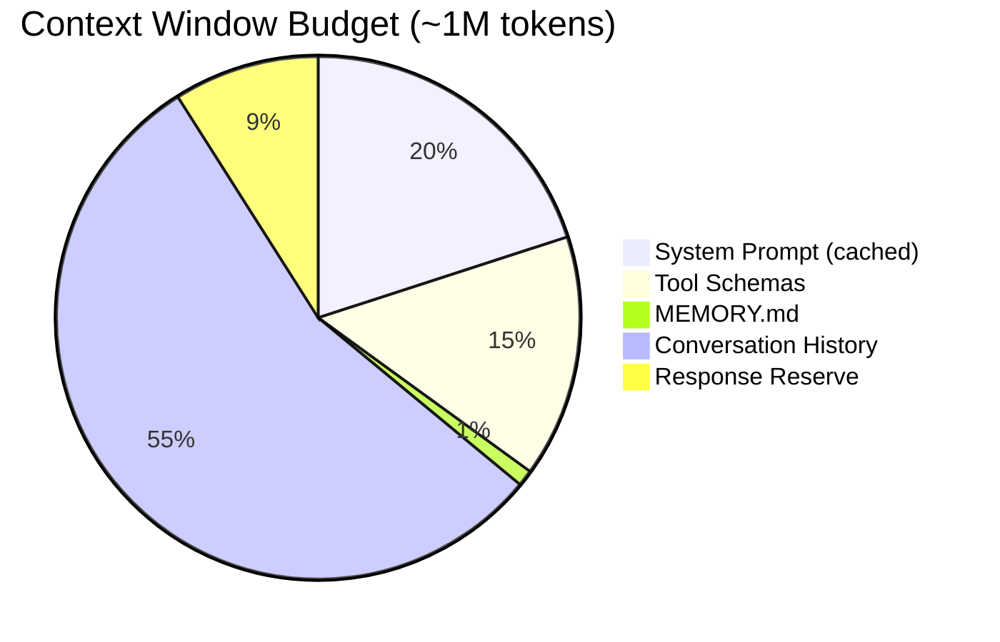
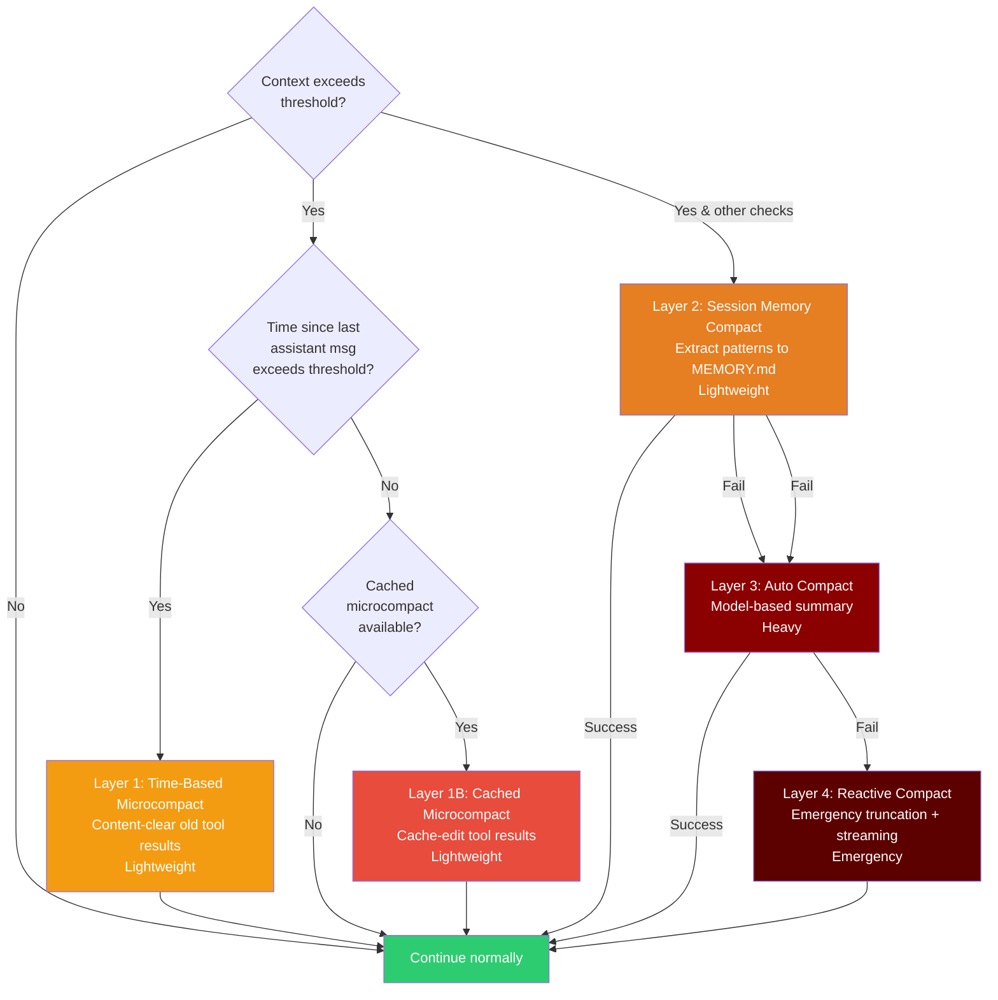
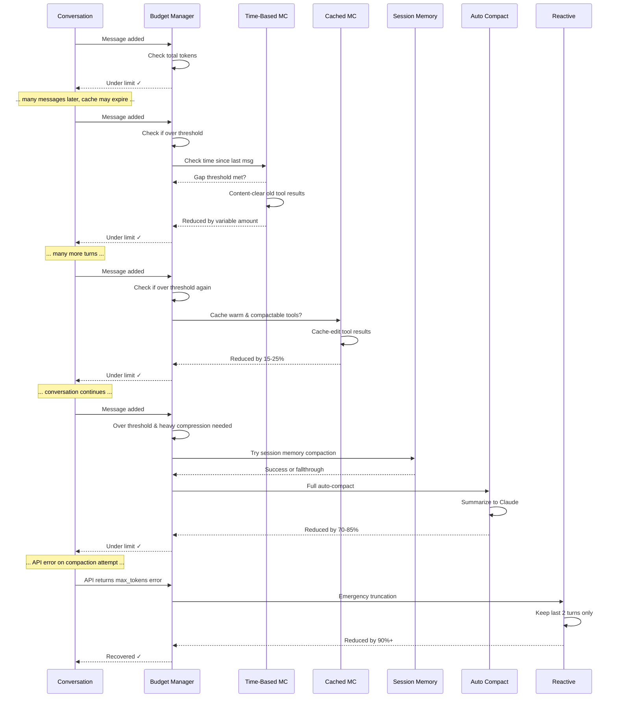
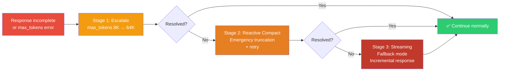

# Context Budgeting

Claude Code는 모델 제한을 유지하면서 Context Window 내의 유용한 정보를 극대화하기 위해 동적 Token Budget 관리를 구현합니다. 이 시스템은 최대 정보 품질을 보존하기 위해 필요한 최소한의 압축만 적용하는 정교한 다층 압축 아키텍처를 사용합니다.

## Budget Allocation



### 상세한 Budget 분석

| 구성 요소 | Token | 캐시 가능 | 동적 |
|-----------|--------|-----------|---------|
| System prompt 명령어 | ~20-25K | 예 (prefix) | 아니오 |
| Tool schemas (14-17개 등록된 tool) | 14-17K | 예 (prefix) | 아니오 |
| Session context (MCP, hooks) | 3-5K | 아니오 (suffix) | 아니오 |
| MEMORY.md (포인터 색인) | ~500-1K | 아니오 | 아니오 |
| 대화 이력 | ~900-950K | 아니오 | 예 |
| Response reserve | ~8-10K | 아니오 | 예 |

**전체 context window**: ~1M tokens (모델에 따라 다름: Claude 3 Sonnet ~200K, Claude 3.5 Opus ~200K, 미래 모델 >1M)

**동적 조정**: 유효 context window는 런타임 중 `effectiveContextWindow = contextWindow - reservedTokensForSummary`를 통해 계산됩니다. `CLAUDE_CODE_AUTO_COMPACT_WINDOW` 환경변수로 오버라이드할 수 있습니다. 대화 이력 및 response reserve 할당은 다음을 기반으로 조정됩니다:
- 모델의 실제 context window 크기 (모델마다 다른 제한)
- Tool schema 개수 (더 많은 tool = 더 많은 token 소비)
- 현재 session 상태 (유휴 상태 vs. 활성 상태, 단기 vs. 장기 실행)

## Auto-Compression: 점진적 압축 레이어

대화 이력이 context 제한에 접근하면, 시스템은 자동으로 점진적으로 더 강한 압축 레이어를 적용합니다. Trigger는 동적 임계값을 기반으로 합니다: token 수가 `effectiveContextWindow - AUTOCOMPACT_BUFFER_TOKENS` (13,000 tokens)을 초과하면 압축이 고려됩니다. 각 레이어는 필요할 때만 활성화되며, 필요한 최소한의 압축만 적용하여 정보 품질을 보존합니다.

### 점진적 Compaction 흐름도



### Layer 상세 설명

#### Layer 1: Time-Based Microcompact

**Trigger**: 마지막 assistant 메시지 이후 경과 시간이 구성된 임계값을 초과할 때 (GrowthBook `tengu_slate_heron` config에 의해 제어됨, 기본값 60분)

**Action**: 오래된 tool 결과를 content-clear하고 가장 최근 N개만 유지

Time-based microcompact은 서버 측 prompt cache가 만료되었을 가능성을 감지합니다(마지막 메시지 이후 경과 시간 기반). 이 경우 전체 prefix가 어차피 다시 작성되므로, 시스템은 요청 전에 오래된 tool 결과 블록을 지워 다시 작성되는 내용을 줄입니다.

Trigger는 GrowthBook을 통해 원격으로 구성되며 두 개의 매개변수가 있습니다:
- `gapThresholdMinutes`: trigger 전에 대기할 시간 (기본값 60, 1시간 서버 cache TTL에 안전)
- `keepRecent`: 유지할 가장 최근 tool 결과 개수 (기본값 5)

이는 cache를 이미 무효화했으므로 cache 편집이 아닌 content-clearing 작업입니다. Token 절감은 tool 결과 크기에 비례합니다. 핵심 통찰: tool 결과는 디스크에서 필요하면 다시 읽을 수 있습니다.

---

#### Layer 1B: Cached Microcompact

**Trigger**: Prompt cache가 warm일 때 AND 최소 N개의 compactable tool 결과가 존재할 때 (feature-gated by `CACHED_MICROCOMPACT`, GrowthBook `tengu_cache_plum_violet` config 사용)

**Action**: cache_edits API를 사용하여 prefix를 다시 쓰지 않고 tool 결과 블록 삭제

Cached microcompact은 prompt cache가 warm일 때 작동합니다. Content-clearing (cache 무효화) 대신 **cache_edits API**를 사용하여 tool 결과 블록을 정교하게 삭제합니다. 이는 서버 측 cache prefix를 보존하고 token 수 증가를 방지합니다. 삭제는 투명합니다: 모델의 다음 요청은 단순히 삭제된 블록을 생략합니다.

시스템은 삭제할 tool 결과를 선택적으로 결정하여 최근 결과는 유지하고 오래된 것은 지웁니다. 구성은 원격 게이트되어 다양한 trigger threshold의 A/B 테스팅을 가능하게 합니다. Token 절감은 modest (~15-25%)입니다. tool 결과에만 영향을 미치기 때문입니다.

Time-based microcompact과 달리 (trigger될 때마다 모든 요청에서 실행), cached microcompact은 cache가 명백히 warm일 때만 실행되어 불필요한 cache 무효화를 방지합니다.

---

#### Layer 2: Session Memory Compaction (실험 단계)

**Trigger**: Auto-compact 이전에, session memory 추출이 가능하고 `tengu_session_memory` 및 `tengu_sm_compact`에 의해 feature-gated될 때

**Action**: 최근 대화에서 패턴과 결정을 추출하여 MEMORY.md로 보내고, 최근 메시지만 유지

Session memory compaction은 무거운 auto-compaction 이전의 최적화로 실행됩니다. 마지막 요약된 메시지 이후부터 시작하여 최소 임계값을 충족하도록 확장합니다 (10K tokens + 최소 5개 텍스트 블록 메시지, 40K token cap까지).

시스템은:
1. 마지막 요약된 메시지에서부터 역방향으로 확장하여 최소 임계값 충족 (10K tokens + 텍스트 블록 포함 최소 5개 메시지, 40K token cap)
2. Session memory에 새로운 패턴 추출 (보수적: MEMORY.md에 없는 사실만)
3. 오래된 메시지를 boundary marker로 교체

Session memory 추출이 부족하거나 대화가 너무 최근인 경우, Layer 3 (auto-compact)으로 fallthrough됩니다. 성공 시 auto-compact 대비 하나의 전체 API 호출을 절약합니다.

---

#### Layer 3: Auto Compact

**Trigger**: Context가 임계값을 초과할 때 AND 초기 레이어 (session memory, time-based microcompact)가 충분히 압축하지 못했거나 session memory compaction을 사용할 수 없을 때

**Action**: 대화를 Claude에게 전송하여 의미론적 요약을 받고, 오래된 메시지를 요약으로 교체

Auto Compact는 주요 workhorse입니다. 시스템이 마지막 몇 턴을 제외한 모든 것을 Claude에게 요약 prompt와 함께 전송하고, 결과를 캡처하여 오래된 메시지를 교체합니다.

구현은 edge case를 처리합니다:
- **Compaction 자체에서 prompt-too-long** (CC-1180): 가장 오래된 API 라운드 그룹을 자르고 최대 3회까지 재시도하여 사용자가 stuck 되지 않도록 함
- **Prompt cache 공유**: `tengu_compact_cache_prefix`에 의해 feature-gated 됨 (기본값 true), 메인 스레드의 캐시된 prefix를 재사용하여 압축 API 비용 감소
- **Circuit breaker**: 3회 연속 auto-compact 실패 후 재시도 중단 (`MAX_CONSECUTIVE_AUTOCOMPACT_FAILURES = 3`에 의해 설정)

Post-compaction, 시스템은 주요 artifact를 재주입하여 작업 context 복원:
- 최근 접근 파일 (최대 5개, `POST_COMPACT_MAX_FILES_TO_RESTORE`)
- 파일당 budget: 5,000 tokens (`POST_COMPACT_MAX_TOKENS_PER_FILE`)
- Plan 모드인 경우 plan 파일
- 호출된 skill (모든 skill에 대해 최대 25K tokens budget, skill당 5K)
- Deferred tool schemas 및 MCP instructions

Token 절감은 극적입니다 (~70-85%). 요약이 dense하기 때문입니다: 탐색적 추론이나 장황한 출력 없이 결정, 파일 변경, 오류, 사용자 의도를 추출합니다. 정보 손실은 실제입니다. Turn 수준 세분성이 사라집니다. 하지만 긴 세션에서는 허용됩니다.

---

#### Layer 4: Reactive Compact

**Trigger**: API 호출이 초기 레이어에도 불구하고 `max_tokens` 오류로 실패할 때

**Action**: Context를 essentials로 급격히 축소하고 streaming으로 재시도

Reactive Compact는 emergency escape hatch입니다. API가 `max_tokens` 오류를 반환할 때, 시스템은 aggressive truncation을 수행합니다:
- System prompt 및 MEMORY.md 유지
- 마지막 2개 대화 턴만 유지
- 다른 모든 것 폐기

재시도는 **streaming response mode**를 사용합니다: 전체 응답을 버퍼링하는 대신 token을 incrementally 처리합니다. 이는 응답 자체가 메모리 제한에 닿는 것을 방지합니다. 모델은 보수적인 `max_tokens` budget (16K-32K)을 받아 필요하면 조기 종료를 강제합니다.

이 레이어는 약 10,000+ 세션마다 1회 도달합니다. 정보 손실이 중대하므로 last resort입니다. 모델은 대부분의 대화 이력을 잃고 MEMORY.md 포인터에만 의존합니다. 하지만 완전히 포기하는 것보다 낫습니다.

Reactive compaction 성공 후, 정상 auto-compaction은 필요하면 다음 턴에서 재개됩니다. 세션은 사용 가능하게 유지되지만, context 손실로 인해 MEMORY.md나 파일 재읽기가 필요할 수 있습니다.

**3단계 복구 cascade** (API 오류가 계속되면): Stage 1은 `max_tokens` budget을 8배 증가. Stage 2는 reactive compact 적용. Stage 3은 streaming 추가. 성공률: Stage 3까지 ~99%, 하지만 약 1%의 세션만 여기 도달.

---

### 고수준 압축 시퀀스



시스템은 무거운 압축 (Layer 3+)이 발생할 때 사용자에게 알립니다:

> "시스템이 context 제한을 유지하기 위해 이전 메시지를 압축 중입니다. 주요 결정 및 발견사항은 MEMORY.md에 보존됩니다."

## 압축 전략

### 보존되는 항목

Auto-compaction 및 session memory 추출 중에 시스템은 다음을 보존합니다:
- **주요 결정**: 무엇이 결정되었고 왜 그렇게 했는가
- **파일 수정**: 어떤 파일이 변경되었고, 각각 무엇이 변경되었는가
- **중요한 발견사항**: 오류, 차단자, 발견, 근본 원인
- **사용자 명령어**: 원래 요구사항 및 제약 조건
- **상호 참조**: MEMORY.md, 파일 경로, 라인 번호에 대한 포인터

### 삭제되는 항목

Compressor는 다음을 삭제합니다:
- 장황한 tool 출력 (파일 내용은 이미 디스크에 있음)
- 결과를 산출하지 못한 탐색 검색
- 최종 결정으로 이어진 중간 추론
- MEMORY.md에 이미 캡처된 중복 정보
- 막다른 길로 이어진 성공적인 탐색 경로

### 사실 추출 to MEMORY.md

압축 후, 시스템은 새로운 지속적인 사실을 추출하여 MEMORY.md에 추가합니다. 이는 향후 턴에서 동일한 정보의 재발견을 방지합니다.

**Session memory compaction**의 경우, 추출은 *압축 중에* 발생합니다: Claude는 압축되는 session segment에서 무엇이 학습되었는지 식별합니다. 주요 architectural 결정, 발견된 bug 패턴, 사용자 선호도, 파일 구조 통찰. 그리고 이를 MEMORY.md의 짧은 pointer 라인(~150자 각)으로 추출합니다.

**Auto-compaction**의 경우, post-compaction hooks는 또한 `executePostCompactHooks()`를 통해 MEMORY.md에 추가 사실을 추출할 수 있지만 이는 덜 일반적입니다.

추출은 보수적입니다: MEMORY.md에 이미 없는 사실만 추가합니다(prompt가 현재 내용에 대해 명시적으로 확인). 이는 duplication과 memory bloat을 방지합니다. 모델은 의미론적 novelty에 집중하도록 지시받습니다: "사용자는 X보다 Y를 선호한다"는 "우리가 Y를 시도했고 실패했다"와 다릅니다.

이는 특히 장시간 세션에서 가치 있습니다. 압축 후, 모델의 context는 크게 감소되지만, MEMORY.md는 persistent shortcut으로 제공됩니다: "우리는 이미 파일 A와 B가 손상되었음을 알고 있습니다" 또는 "아키텍처는 monolithic이지, microservices가 아닙니다"는 상세 대화가 요약되어 사라진 후에도 접근 가능합니다.

Session memory compaction (가능한 경우)은 auto-compaction보다 선호되지만 유사한 목표를 제공합니다: API 비용을 최소화하면서 context 경계를 넘어 knowledge를 유지합니다.

**상호 참조**: 자세한 내용은 [Self-Healing Memory](./self-healing-memory.md)를 참조하십시오.

## Token Budget 지속

한 가지 중요한 과제: 압축에도 불구하고, 모델이 복잡한 작업에서 response 중간에 `max_tokens` 제한에 도달하는 경우가 있습니다. 시스템은 이를 **synthetic message injection**으로 처리합니다.

### 문제: 불완전한 응답

Claude가 token 제한에 도달하면:

```
User: "Implement a complex refactor..."
Claude: "I'll start by exploring the codebase...
  [reads files...]
  Now I'll implement the changes:
  1. Create new service file...
  2. Update imports in 5 files...
  3. [TRUNCATED. Hit max_tokens limit]"
```

응답이 갑자기 중단되어 작업이 불완전하게 남습니다.

### 솔루션: Synthetic "Continue" 메시지

시스템은 incomplete response를 감지하고 synthetic user 메시지를 주입합니다: "Continue with the remaining changes."

이 synthetic 메시지는 Claude Code 내부의 메시지 stream에 추가됩니다. 하지만 사용자는 이를 보지 못합니다. UI는 하나의 continuous response를 표시합니다. 심지어 두 API 호출을 통해 생성되었어도. trick은 Claude가 첫 응답의 context를 가지고 있다는 것입니다(대화에서 볼 수 있음) 그리고 그곳에서 계속해야 한다는 것을 이해합니다.

incomplete response 감지를 위한 휴리스틱은 두 신호를 확인합니다:
1. **Stop reason = max_tokens**: 우리가 제한에 hit했다는 명시적 플래그
2. **Stop reason = end_turn 하지만 갑자기 종료**: edge case용 fallback heuristic. 응답이 `.` `!` 또는 `?`로 끝나지 않고, mid-word로 끝나면, 그것은 아마도 incomplete입니다

이 접근법은 우아합니다. 왜냐하면 재시도 로직이나 exponential backoff가 필요하지 않기 때문입니다. 또한 저렴합니다: 두 번째 호출은 synthetic continuation prompt(~5 token)만 포함하고 Claude의 기존 context를 재사용합니다. 대부분의 continuation은 첫 시도에서 완료됩니다.

synthetic message mechanism은 Claude Code 전체에 나타납니다:
- **max_tokens 후 continuation**: "Continue with the remaining changes"
- **tool use 후 follow-up 질문**: "What would you like to do next?"
- **오류 후 복구**: error type에 따라 다름

모든 synthetic 메시지는 내부 logging이 user-initiated turn과 system-initiated turn을 구분할 수 있도록 synthetic으로 표시하는 메타데이터를 전달합니다.

### 결과

모델은 continuation 프롬프트를 수신하고 응답을 완료합니다:

```
[System injects: "Continue with the remaining changes."]

Claude: "Continuing...
  4. Update test files
  5. Run build verification...
  Complete. Refactor finished successfully."
```

사용자는 실제로 두 API 호출인 하나의 연속된 응답을 봅니다. 주입은 seamless입니다.

---

## 3단계 복구 경로

Compaction 레이어가 모델을 budget 내에 유지하지 못할 때, 시스템은 **3단계 복구 cascade**에 진입합니다:



### Stage 1: Escalate

**Trigger**: API가 `max_tokens` 제한으로 응답을 반환함

**Action**: `max_tokens` 매개변수를 ~8K에서 ~64K로 증가

API가 `stop_reason: 'max_tokens'`를 가진 응답을 반환할 때, 첫 번째 복구 시도는 간단합니다: 동일한 쿼리를 다시 시도하지만, 훨씬 더 높은 max_tokens budget 사용. 기본 budget은 ~8K token. Escalation은 이를 64K로 증가시켜, 더 많은 출력이 필요한 복잡한 응답이 context를 잃지 않고 완료되도록 합니다.

이는 ~75% 시간에 작동합니다. 대부분의 incomplete response는 초기 budget 추정이 너무 보수적이었거나, task가 진정으로 예상보다 더 긴 응답을 필요로 하기 때문에 발생합니다. escalated budget은 context를 감소시킬 필요 없이 완료할 충분한 room을 제공합니다.

구현은 straightforward입니다: `max_tokens` stop reason을 catch하고, 동일한 메시지와 system prompt를 재사용하며, 증가된 budget으로 재시도합니다. Context 감소가 필요하지 않습니다.

---

### Stage 2: Reactive Compact + Retry

**Trigger**: Stage 1 escalation이 응답을 완료하지 못했을 때

**Action**: Layer 5 (Reactive Compact) 적용. Essentials만 유지. 후 감소된 budget으로 재시도

Escalating max_tokens가 작동하지 않을 때, 시스템은 aggressive context 감소를 적용합니다. 유지:
- System prompt 
- MEMORY.md (persistent context)
- 마지막 2 user-assistant 쌍(~4 메시지)

다른 모든 것은 폐기됩니다. 이는 prompt 크기를 극적으로 감소시킵니다(종종 80-90%), response가 훨씬 더 작은 max_tokens budget(32K)으로도 완료될 room을 만듭니다.

모델은 여전히 기능할 수 있습니다. 왜냐하면 MEMORY.md가 reference로 제공되기 때문입니다. 만약 session 초기에 무엇이 일어났는지 recall해야 한다면, MEMORY.md 포인터를 참조할 수 있습니다. 대부분의 작업은 마지막 몇 턴의 immediate context로 완료될 수 있습니다.

이 단계의 성공률은 Stage 1에서 남은 25% 중 ~90%. 즉, 전체적으로 모든 max_tokens 오류의 약 97%는 Stage 1 또는 2에 의해 해결됩니다. 매우 적은 세션만 Stage 3에 도달합니다.

**Trade-off**: 대화 이력은 aggressive하게 pruned되지만, 세션은 기능적으로 유지됩니다. 모델은 exploratory context를 잃지만 MEMORY.md를 통해 결정을 유지합니다.

---

### Stage 3: Streaming Fallback

**Trigger**: Stage 2가 여전히 불완전할 때(극히 드문 경우)

**Action**: Streaming response 모드 활성화(early stopping heuristic 포함)

Stage 1과 2가 둘 다 실패할 때(약 1 in 100,000 세션에서 발생), 시스템은 **streaming mode**를 활성화합니다. 메모리에 전체 response를 버퍼링하는 대신, token은 incrementally 처리됩니다. 이는 메모리 exhaustion을 방지하고 connection이 drop되거나 모델의 출력이 corrupted되어도 partial response를 캡처할 수 있게 합니다.

streaming 경로는 또한 **early stopping heuristic**을 포함합니다: response가 이미 ~1000자에 도달했고 sentence punctuation(`.` `!` `?`)으로 끝나면, stream이 조기 종료됩니다. 이는 모델이 필요 이상의 출력을 생산하면 불필요한 token waste를 방지합니다.

max_tokens budget은 추가로 16K로 감소되어, conciseness를 우선시하도록 모델을 강제합니다. 감소된 context(Stage 2에서), streaming, 보수적인 token budget은 Stage 3이 최소한 의미 있는 응답을 완료할 ~99% 성공률을 갖도록 의미합니다.

**사용자 경험**: Response는 terminal에 token-by-token으로 실시간으로 stream되어, progress가 발생하고 있다는 즉시적 시각적 피드백을 제공합니다. 이는 사실 buffered response를 기다리는 것보다 더 나은 UX이지만, 초기 단계로부터의 정보 손실은 significant합니다.

Stage 3이 성공한 후, 정상 작동이 다음 턴에서 재개됩니다. 향후 쿼리는 필요하면 auto-compaction을 적용합니다.

---

### 복구 Cascade 통계

| Stage | Trigger | 성공률 | 보존된 정보 |
|-------|---------|--------------|----------------------|
| Stage 1 | max_tokens 오류 | 75% | 전체 context |
| Stage 2 | 여전히 불완전 | 90% | MEMORY.md + 마지막 2 턴 |
| Stage 3 | 여전히 불완전 | 99% | Streamed response  |

매우 적은 작업만 Stage 3이 필요합니다. 대부분 Stage 1에서 해결됩니다 (증가된 max_tokens는 보통 충분합니다).

---

## Stop Reason 주의사항: 구현 세부사항

Streaming API의 미묘하지만 중요한 구현 세부사항: **실제 `stop_reason`은 `message_delta` 이벤트에 있으며, `content_block_stop`에는 없습니다.**

```typescript
// ❌ WRONG. This will miss the stop reason
for await (const event of response) {
  if (event.type === 'content_block_stop') {
    console.log(event.stop_reason);  // ← undefined!
  }
}

// ✅ CORRECT. Stop reason is in message_delta
for await (const event of response) {
  if (event.type === 'message_delta') {
    console.log(event.delta.stop_reason);  // ← "end_turn" or "max_tokens"
  }
}
```

**중요한 이유**: 이를 놓치면 루프가 제대로 종료되지 않아 무한 대기 또는 timeout 기회 손실이 발생합니다.

**참고**: 이는 공개 Anthropic API 문서에 잘 문서화되어 있지 않습니다. 이는 leaked source를 읽고 streaming behavior를 테스트함으로써 드러납니다.

---

## Session 품질에 미치는 영향

budgeting이 없으면, 긴 session은 중요한 초기 context가 손실되면서 저하됩니다. Budgeting을 사용하면:

| Session 길이 | Budgeting 없이 | Budgeting 포함 |
|---------------|------------------|----------------|
| 짧음 (< 10 턴) | 좋음 | 좋음 |
| 중간 (10-50 턴) | 잊기 시작 | 좋음 |
| 긴 (50+ 턴) | 심각한 저하 | 관리된 저하 |
| 매우 긺 (100+ 턴) | 사용 불가 | 약간의 손실로 기능 |

다음의 조합:
- Context budgeting (time-based, cached, session memory, auto, reactive 레이어를 포함한 점진적 다층 compaction)
- Token budget continuation (synthetic message injection)
- Recovery cascade (3단계 escalation)
- [Self-healing memory](./self-healing-memory.md) (MEMORY.md 포인터)

...는 매우 긴 session도 기능할 수 있도록 합니다. 모델은 항상 MEMORY.md를 참조하여 중요한 정보를 찾을 위치를 기억할 수 있으며, 불완전한 응답은 자동으로 계속되거나 복구됩니다.
