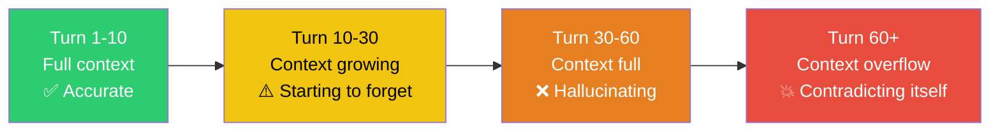
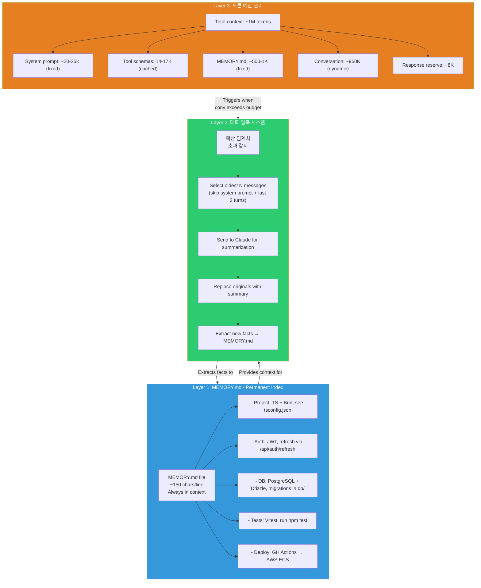
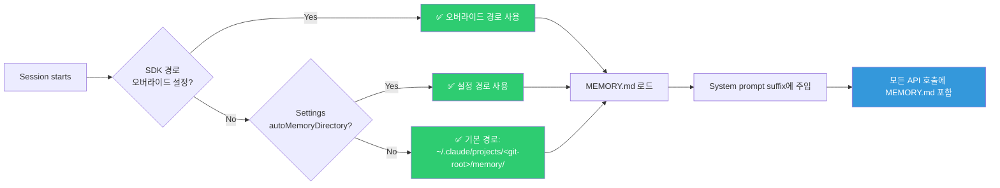
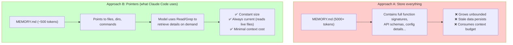
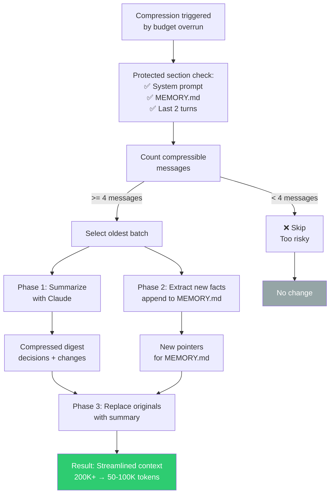
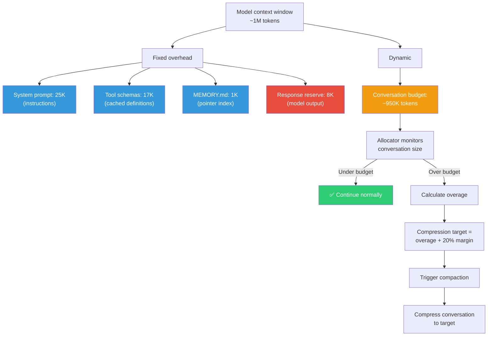
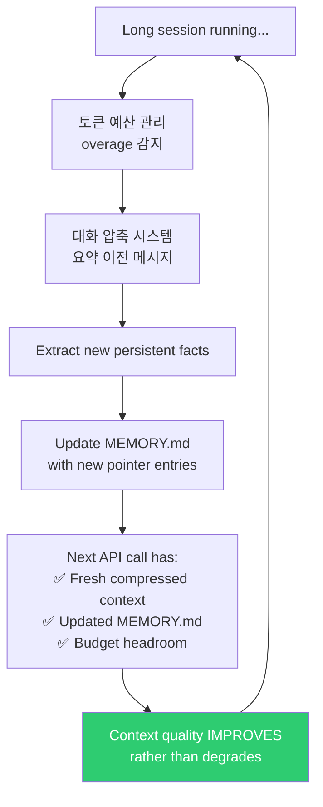

# Self-Healing Memory

유출된 소스코드에서 3단계 메모리 아키텍처가 발견되었다. **컨텍스트 엔트로피**(장시간 AI 세션에서 컨텍스트 품질이 점진적으로 저하되어 환각과 자기 모순을 유발하는 현상)를 방지하기 위해 설계되었다.

## 문제

장시간 코딩 세션에서 AI 어시스턴트는 근본적인 도전에 직면합니다:



## 3단계 아키텍처



## Layer 1: MEMORY.md - Implementation Deep Dive

### File Location and Loading

MEMORY.md는 프로젝트별로 저장되며, 레포지토리의 canonical git root를 기준으로 스코핑됩니다. 같은 레포지토리의 모든 worktree가 하나의 메모리 디렉토리를 공유하므로, 어떤 worktree에서 세션을 실행하든 지식이 일관되게 유지됩니다.

시스템은 우선순위 체인을 통해 메모리 디렉토리를 결정합니다:

1. **환경변수 오버라이드** (`CLAUDE_COWORK_MEMORY_PATH_OVERRIDE`): SDK 통합에서 메모리를 space-scoped 마운트로 리다이렉트하는 데 사용되는 전체 경로 오버라이드. 설정 시 해당 경로가 직접 사용됩니다.
2. **설정 오버라이드** (settings.json의 `autoMemoryDirectory`): `~/` 확장을 지원하는 사용자 설정 가능 경로. 보안을 위해 신뢰할 수 있는 소스(policy, local, user 설정)에서만 반영되며, 프로젝트 레벨 `.claude/settings.json`은 의도적으로 제외됩니다. 악의적인 레포지토리가 메모리 쓰기를 민감한 디렉토리로 리다이렉트하는 것을 방지하기 위함입니다.
3. **기본 경로**: `~/.claude/projects/<sanitized-git-root>/memory/MEMORY.md`. 원격 실행 환경에서는 `CLAUDE_CODE_REMOTE_MEMORY_DIR`로 기본 디렉토리를 변경할 수 있습니다.

로드되면, memory index는 system prompt의 suffix(모든 API 요청 끝에 추가되는 섹션)로 주입됩니다. 이는 대화 길이나 compaction cycle에 상관없이 모든 턴에서 MEMORY.md가 Context Window에 유지되도록 보장합니다. 모델은 응답을 생성하기 전에 항상 최신 pointer index를 참조합니다.



### Format Constraints

MEMORY.md는 token 효율성을 위해 엄격한 형식을 적용합니다:

```markdown
# MEMORY.md
## Project
- TypeScript + Bun runtime, config in tsconfig.json and bunfig.toml
- React + Ink terminal UI, components in terminal UI layer
- Build: `bun run build`, outputs to dist/

## Architecture
- Core loop: Conversation loop implementation
- Tools registered in tool registry
- System prompt assembled in system prompt assembler

## Conventions
- Tests: Vitest, co-located as *.test.ts, run `bun test`
- Lint: ESLint + Prettier, run `bun run lint`
- Commits: conventional commits (feat:, fix:, chore:)

## Known Issues
- API timeout on large files > 10MB, use streaming read
- CI flaky on test/integration/auth.test.ts, retry usually fixes
```

**Target**: 줄당 ~150자. 각 줄은 **포인터**(model에 세부사항을 찾을 위치를 알려줌)이지, **저장소**(세부사항 자체를 포함하지 않음)가 아닙니다.

**하드 제한**:
- 최대 200줄
- 최대 25KB 파일 크기
- 이 제한을 초과하는 줄은 경고와 함께 잘립니다

### Why Pointers Instead of Storage?



포인터 접근법은 project 크기에 관계없이 MEMORY.md가 ~500-1000 token을 사용함을 의미하면서, 모델이 전체 codebase를 navigate할 map을 제공합니다.

## Layer 2: 대화 압축 시스템 - 설계 철학

### Compression Trigger and Design

Token Budget allocator가 overage를 감지할 때, compression 시스템은 3단계 프로세스에 진입합니다. 핵심 원칙은: **최근 context 보존, 오래된 세부 사항 압축, 영구적 사실 추출**.

먼저, 시스템은 안전하게 압축될 수 있는 메시지를 식별합니다. 시스템은 system prompt, MEMORY.md index, 마지막 2 user-assistant turn을 **절대** 압축하지 않습니다. 이들이 ongoing work를 이해하기 위해 model이 항상 최근 context를 갖도록 보장하는 protected tail을 형성합니다. 4개 미만의 compressible message가 존재하면, 압축은 완전히 skip됩니다 (작은 대화에서 detail을 잃기에는 너무 위험). 이러한 보수적 접근법은 대화가 아직 젊을 때 정보 손실을 방지합니다.

두 번째 단계는 가장 오래된 compressible message를 Claude로 요약합니다. 핵심 통찰: 중요한 것은 장황한 대화가 아니라 *이루어진 결정과 그 이유*입니다. 시스템은 결정 rationale, 어떤 파일이 변경되었는지, 중요한 발견을 보존하면서 장황한 tool output과 중간 reasoning을 폐기합니다. 동시에, compressor는 대화에서 새로운 persistent fact를 추출합니다 (project structure, architecture, tool, user preference에 대한 발견).

세 번째 단계는 original message를 compressed summary와 protected tail로 교체합니다. 이 단일 compaction cycle은 200K-token 대화를 coherence를 유지하면서 50-100K token으로 감소시킬 수 있습니다. 왜 이것이 작동하는가? Compression이 구문론적이 아니라 의미론적이기 때문입니다 (시스템이 무엇이 중요한지 이해하고 불필요한 것을 ruthlessly 제거).



### Summarization Call

Compressor는 focused API call을 Claude에게 수행하여 concise summary를 생성하도록 요청합니다. System prompt는 무엇이 중요한지 보존하도록 신중하게 조정됩니다: 주요 결정 및 그들의 추론, 특정 파일 수정, 발견된 차단자, 사용자 제약. 명시적으로 폐기: 장황한 tool output(파일 내용은 디스크에 남아있음), 결과가 없는 failed search, superseded된 intermediate reasoning. 이 필터링은 요약을 dense하고 decision-focused하게 유지하여 transcript-like하지 않게 합니다.

Summarizer output은 일반적으로 50-100K token 대화 segment에 대해 500-1500 token입니다. 의미론적으로 lossy이기 때문에 coherence를 유지하면서 50-100배 compression ratio입니다.

### Fact Extraction

요약 생성 후, 두 번째 API 호출이 parallel로 실행되어 persistent fact를 추출합니다. Compressor는 Claude에게 current MEMORY.md와 대화를 보여주고, session을 통해 기억되어야 하는 새로운 pattern이나 발견을 식별하도록 요청합니다. Fact는 MEMORY.md convention을 따르는 짧은 pointer line(각 150자 미만)로 포맷되어야 하고, extractor는 기존 entry에 대해 dedup하여 redundant copy를 방지합니다.

추출된 fact는 MEMORY.md에 추가되어, compaction 중에 잃어버리지 않고 다음 session에서 사용 가능하게 됩니다. 이는 positive feedback loop를 만듭니다: 이전 session이 학습된 pattern을 persistent index에 기여하여, 향후 대화에 대한 context 품질을 점진적으로 향상시킵니다.

## Layer 3: 토큰 예산 관리 - 왜 사전 관리가 중요한가

Token Budget allocator는 model의 Context Window(일반적으로 200K token, 모델 의존, 최신 모델은 최대 1M)를 fixed 및 dynamic zone으로 나눕니다. Fixed zone은 system prompt 명령어(~25K token), tool schema 정의(~17K token), MEMORY.md index(~1K token)를 보유합니다. 이것들은 request당 변경되지 않는 overhead입니다 (운영 비용).

Response reserve(8K token)은 model의 output을 위해 보유됩니다. 왜 이것을 예약하는가? API 오류는 model이 budget을 초과하여 생성하면 발생하므로, 이 공간을 예약하는 것은 치명적 실패를 방지합니다. 다른 모든 것(기본 할당에서 약 950K token)은 conversation history budget을 형성합니다 (사용자의 입력 이력 및 assistant의 이전 응답).

Conversation history가 이 budget을 초과할 때, allocator는 compression을 트리거합니다. 하지만 여기 핵심 설계 결정이 있습니다: **compression target은 정확한 제한이 아니라 제한 아래 20%**입니다. 왜? Allocator가 정확한 제한까지만 압축했다면, 다음 턴의 automatic attachment(재주입된 도구, Agent listing, plan file)가 즉시 다시 budget을 초과할 수 있습니다. 이는 *thrashing*을 만들어집니다 (constant compression overhead가 성능을 저하). Budget의 80%를 target으로 하여, compressor는 최소 한 전체 턴의 breathing room을 보장하여, compression 비용을 여러 턴에 걸쳐 분산합니다.



이 20% margin은 경제적 최적화입니다 (여러 턴에 걸쳐 절약된 한 번의 compression 비용이 frequent recompressions 비용을 능가).

## Self-Healing Feedback Loop

"self-healing" 측면은 세 레이어 모두 간의 상호작용에서 비롯됩니다:



Key insight: compression은 단순히 old context를 제거하지 않습니다. 이를 **upgrade**합니다. Verbose conversation message(수천 token)는 다음이 됩니다:
1. Compact summary(수백 token)
2. New MEMORY.md entry(fact당 수십 token)

Model은 detail을 잃지만 **structure**를 얻습니다. raw conversation log 대신 조직된 pointer입니다.

## KAIROS autoDream Integration

미출시 [KAIROS daemon mode](../agents/kairos.md)에서, `autoDream` 시스템은 self-healing memory를 **passive**(budget pressure에 의해 트리거)에서 **active**(idle time 중에 트리거)로 확장합니다:

| Dimension | Current Self-Healing | KAIROS autoDream |
|-----------|---------------------|-----------------|
| **Trigger** | Context budget exceeded | Idle time threshold |
| **Input** | Conversation messages | Daily log observations |
| **Process** | Summarize + extract facts | Merge + deduplicate + crystallize |
| **Output** | Compressed messages + MEMORY.md updates | Consolidated MEMORY.md entries |
| **Timing** | Reactive (when needed) | Proactive (during downtime) |
| **Cross-session** | No | Yes (persistent daemon) |
