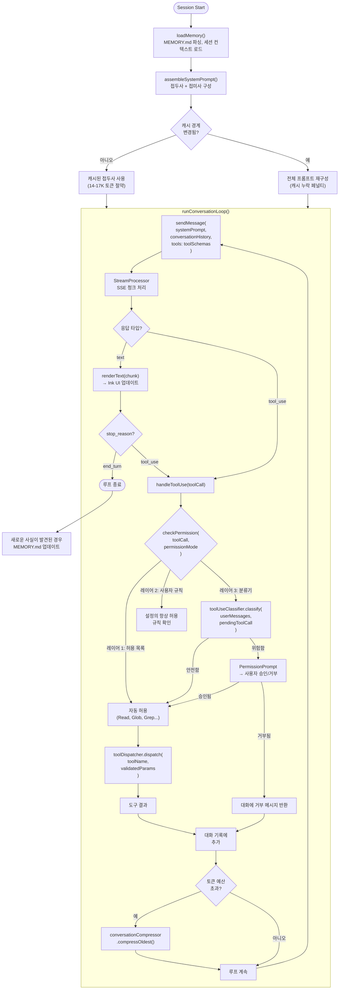
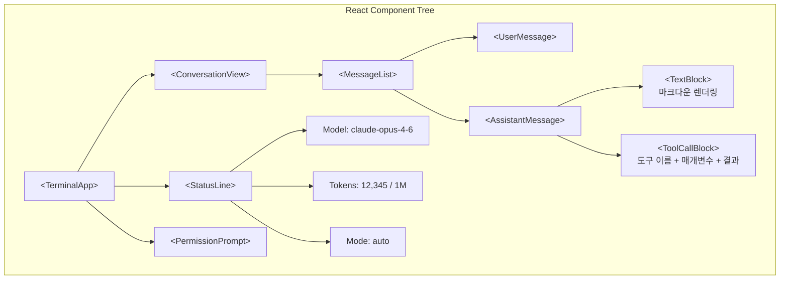

# 아키텍처 개요

Claude Code는 TypeScript로 작성되고 Bun으로 컴파일 및 번들링되며 React + Ink을 사용하여 터미널 UI로 렌더링된 터미널 기반 AI 코딩 어시스턴트입니다. 이 페이지에서는 유출된 소스 코드를 통해 밝혀진 내부 아키텍처에 대한 자세한 분석을 제공합니다.

주요 용어: **QueryEngine**은 핵심 대화 루프를 실행하고, **ConversationCompressor**는 메시지 히스토리를 압축하며, **SystemPromptAssembler**는 동적 프롬프트를 구성합니다.

## 고수준 아키텍처

## 기술 스택

| 구성 요소 | 기술 | 이유 |
|-----------|-----------|-----|
| 언어 | TypeScript | 복잡한 도구 스키마 및 API 계약을 위한 타입 안정성 |
| 런타임 | [Bun](https://bun.sh/) | 1초 미만의 콜드 스타트, 클라이언트 증명을 위한 네이티브 Zig HTTP 스택 |
| 터미널 UI | React + [Ink](https://github.com/vadimdemedes/ink) | 복잡한 터미널 레이아웃을 위한 선언형 UI 구성 |
| 번들러 | Bun의 기본 제공 번들러 | 단일 파일 출력, 소스 맵 (유출의 원인이라는 점이 아이러니) |
| 네이티브 레이어 | Zig | HTTP 전송, 클라이언트 증명 DRM을 위한 암호화 해시 |
| Feature Flag | [GrowthBook](https://www.growthbook.io/) | 재배포 없이 원격 A/B 테스팅 및 킬스위치 |
| 텔레메트리 | OpenTelemetry | 도구 호출 지연 시간 및 오류 추적을 위한 분산 추적 |
| 상태 관리 | React hooks + Context | 세션 상태, 대화 기록, UI 상태 |

## 소스 트리 구조

유출된 소스 맵에 의하면 다음과 같은 모듈 구조가 있습니다 (~1,900개 파일):

모듈 구조는 다음과 같이 구성됩니다:

- **CLI Layer**: 진입점 및 인수 파싱
- **Core Engine**: 대화 루프, 스트리밍 처리, 메시지 히스토리
- **System Prompt**: 프롬프트 조립, 캐시 관리, 110+ 명령어 블록
- **Tools**: 43+ 기본 도구, MCP 브릿지, 지연 로딩
- **Agents**: 에이전트 생성, 조정, 서브에이전트 관리, KAIROS 데몬
- **Security**: 권한 검사, 분류기, 샌드박스, 암호화
- **Memory**: 메모리 관리, 대화 압축, 토큰 예산 할당
- **Config**: 기능 플래그, 설정 관리
- **UI**: React/Ink 터미널 인터페이스
- **Skills**: 스킬 등록 및 정의
- **Telemetry**: OpenTelemetry 및 메트릭

## 핵심 데이터 흐름: QueryEngine 심층 분석

QueryEngine은 코드베이스에서 가장 중요한 모듈입니다. 이는 에이전트 대화 루프를 구현합니다:

### 주요 구현 세부 사항

**메시지 형식**: QueryEngine은 엄격한 타입의 메시지 배열을 유지합니다. 각 메시지는 역할(user 또는 assistant)과 콘텐츠 블록 배열로 구성되며, 콘텐츠 블록은 다형적으로 텍스트 출력, 도구 호출, 또는 이전 단계의 도구 결과를 나타낼 수 있습니다. 대화는 사용자와 어시스턴트 메시지 간에 엄격하게 교대로 진행되며, 도구 결과는 API가 예상하는 교대 패턴을 유지하면서 tool_result 콘텐츠 블록이 있는 사용자 메시지로 반환됩니다.

**스트리밍**: 응답은 Server-Sent Events (SSE)를 통해 실시간으로 도착하며 부분 JSON 처리를 지원합니다. 도구 호출의 매개변수가 여러 SSE 청크에 걸쳐 도착할 수 있으므로, 검증 및 발송 전에 완료될 때까지 버퍼링되어야 합니다.

**도구 호출 배치**: 모델은 단일 응답에서 여러 도구 호출을 반환할 수 있습니다. 시스템은 종속성 분석에 따라 이를 처리합니다: 독립적인 도구 호출은 병렬로 실행되고 (`Promise.all()` 사용), 종속적인 호출은 순차적으로 실행되어 인과관계를 존중합니다.

**대화 압축**: 토큰 예산을 초과하면 시스템은 오래된 메시지 기록을 압축하여 토큰을 회수합니다. 이는 가장 오래된 N개 메시지(시스템 프롬프트 및 최근 컨텍스트 제외)를 선택하고, 동일한 Claude 모델을 사용하여 요약 처리로 전송한 후, 원본을 압축된 요약으로 바꾸는 과정을 포함합니다. 요약 중에 새로운 영구적 사실이 발견되면 이를 추출하여 `MEMORY.md`에 추가합니다.

## Anthropic API 통합

API 클라이언트는 Anthropic messages 엔드포인트에 다음과 같은 주요 매개변수를 포함하여 요청을 전송합니다:

| 매개변수 | 목적 |
|----------|------|
| `model` | 선택된 모델, 내부 코드명에서 API 모델 ID로 해석 (예: 'capybara' → 'claude-sonnet-4-6') |
| `max_tokens` | 남은 토큰 예산에서 동적으로 계산 |
| `system` | SystemPromptAssembler에 의해 구성된 프롬프트 블록 배열 |
| `messages` | 사용자 및 어시스턴트 역할 간의 엄격한 교대 패턴을 유지하는 대화 기록 |
| `tools` | PermissionChecker가 접근 규칙 기반으로 필터링한 14-17K 토큰의 도구 스키마 정의 |
| `stream` | 응답 토큰의 실시간 스트리밍을 활성화 |
| `anti_distillation` | Anti-Distillation이 활성화된 경우 가짜 도구를 요청에 주입하는 선택적 신호 |
| `cache_control` | 프롬프트 캐싱 경계를 표시하여 캐시된 시스템 프롬프트 접두사를 활성화 |

### 모델 해석

Claude Code는 런타임에 내부 모델 코드명을 실제 API 모델 ID로 매핑합니다. 이 추상화 계층을 통해 Anthropic은 클라이언트 측 바이너리 업데이트 없이 모델 가용성을 업데이트할 수 있습니다. 예를 들어, 코드명 'capybara'는 'claude-sonnet-4-6'으로 해석되어 로그에서의 인간 가독성과 미출시 모델 테스트의 유연성을 모두 제공합니다. 알려지지 않은 코드명은 직접 전달되어 새로운 모델과의 호환성을 지원합니다.

## React + Ink 터미널 UI

터미널 UI는 React 및 [Ink](https://github.com/vadimdemedes/ink)로 구축되며, ANSI 이스케이프 코드를 사용하여 React 구성 요소를 터미널로 렌더링합니다.

### 렌더링 파이프라인

1. **입력**: 사용자가 텍스트 입력 구성 요소(Ink의 `<TextInput>`)에 입력합니다
2. **스트리밍**: SSE 청크가 도착하면 React 훅을 통해 대화 상태가 업데이트됩니다
3. **렌더링**: Ink는 React 트리를 비교하고 변경된 ANSI 수열만 방출합니다
4. **도구 호출**: 축소 가능한 상세 뷰(도구 이름, 매개변수, 결과)와 함께 표시됩니다
5. **권한 프롬프트**: 사용자가 응답할 때까지 차단하는 모달 오버레이

이 아키텍처는 Claude Code의 UI가 완전히 선언형이라는 것을 의미합니다. 새로운 UI 요소(예: 진행률 표시줄 또는 알림)를 추가하는 것은 단순히 React 구성 요소를 추가하는 것입니다.

## 구성 레이어

구성은 우선순위가 있는 여러 레이어를 통해 흐릅니다:

1. **CLI 플래그** (최우선): 명령행에서 직접 지정된 옵션
2. **환경 변수** (CLAUDE_CODE_*): 환경에서 정의된 설정
3. **프로젝트 설정** (.claude/settings.json): 저장소 루트의 설정
4. **사용자 설정** (~/.claude/settings.json): 사용자 홈 디렉터리의 설정
5. **Feature Flag** (tengu_* 접두사): GrowthBook 원격 플래그
6. **컴파일된 기본값** (최하순위): 코드에 하드코딩된 기본값

### GrowthBook 통합

GrowthBook은 원격 기능 플래그 관리를 지원하여 Anthropic이 배포 없이 모든 Claude Code 설치 전체에서 기능 활성화를 제어할 수 있게 합니다. 클라이언트는 시작 시 Anthropic의 GrowthBook 인스턴스에서 기능 플래그 정의를 가져오고 런타임에 평가합니다.

모든 기능 플래그는 `tengu_` 접두사를 사용하며 원격 구성에 대해 평가됩니다. 예를 들어, `anti_distill_fake_tool_injection` 플래그는 시스템 프롬프트에 가짜 도구 스키마를 주입할지 여부를 제어하여 증류 공격에 대한 방어를 제공합니다. 모든 `tengu_` 접두사 플래그의 변경 사항은 새 바이너리를 배포하지 않고도 모든 활성 Claude Code 세션에 즉시 전파되어 빠른 실험과 비상 킬스위치를 활성화합니다.

## 점진적 모듈 로딩

Claude Code는 3계층 로딩 전략을 통해 시작 시간을 최적화하며, 서로 다른 사용 사례가 서로 다른 초기화 프로필을 요구한다는 점을 인식합니다. `--version` 또는 `--help`을 실행하는 사용자는 밀리초 단위의 결과를 기대하지만, 완전한 대화형 세션은 필요한 서브시스템을 로드하는 데 약간 더 많은 설정 시간을 할당할 수 있습니다.

**Tier 1: 즉시 종료 경로**는 버전 및 도움말 표시 같은 빠른 작업을 처리합니다. 이러한 확인은 대부분의 코드베이스를 가져오기 전에 발생하므로, Bun의 데드 코드 제거가 이러한 사용 사례에 대한 전체 종속성 트리를 건너뛸 수 있습니다. 결과: 버전 확인이 100ms 이하.

**Tier 2: 기능 게이트 서브시스템**은 Bun의 컴파일 타임 기능 플래그를 사용하여 모듈을 조건부로 포함합니다. 예를 들어, KAIROS(백그라운드 스케줄링 데몬)와 코디네이터 모드(다중 워커 오케스트레이션)는 명시적으로 활성화된 경우에만 번들됩니다. 이 설계는 많은 사용자가 이러한 기능을 절대 호출하지 않는다는 인식을 반영합니다—왜 포함할까요? 데드 코드를 제거하면 바이너리가 축소되고 초기화 오버헤드가 줄어듭니다.

**Tier 3: 지연 및 병렬 초기화**는 중요하지 않은 종속성을 지연시킵니다. MDM 구성, 키체인 자격 증명 검색, MCP 서버 설정은 시작 중에 순차적으로 차단하는 대신 비동기적으로 병렬로 실행됩니다. 세션 초기화가 완료될 때쯤이면 이러한 프리페치 작업이 일반적으로 백그라운드에서 완료됩니다.

함께 작동하면 이 전략은 빠른 인지된 반응성을 보장합니다: 버전 확인은 밀리초 단위, 도움말은 50-100ms, 완전한 대화형 세션은 병렬 서브시스템이 정착하는 동안 1-2초. CLI 도구의 경우 시작 시간의 모든 100ms이 사용자에게 느껴지기 때문에 이 아키텍처는 인지된 품질에 중요합니다.

## 병렬 프리페칭

시작 성능은 독립 서브시스템의 병렬 초기화를 통해 추가로 최적화됩니다:

**주요 프리페치 작업**으로는 엔터프라이즈 정책 적용을 위한 MDM(Mobile Device Management) 구성(~200ms), OAuth 및 API 키 관리를 위한 macOS 키체인 자격 증명 검색(~500ms), 프로토콜 지원을 위한 MCP 서버 초기화(~300ms), 원격 A/B 테스트 게이트를 위한 GrowthBook 기능 플래그 가져오기가 있습니다. 이들은 애플리케이션 실행이 시작되자마자 사용자의 첫 번째 상호작용 전에 비동기적으로 시작됩니다.

**시작 프로파일러**는 주요 지점에 마커를 삽입하여 각 단계를 측정합니다. 프로파일링 데이터를 통해 실제 배포에서 병목 현상을 식별하고 최적화 변경의 영향을 측정할 수 있습니다. 총 시작 시간은 가장 느린 단일 작업(일반적으로 macOS에서 키체인 접근)에 근접하며, 순차 초기화 대비 2-3배 개선을 달성합니다.

**주요 프리페치 작업**:
- MDM 구성: ~200ms (엔터프라이즈 정책 적용)
- Keychain 자격증명: ~500ms (OAuth 및 API 키 관리)
- MCP 서버 초기화: ~300ms (프로토콜 지원)
- GrowthBook Feature Flag 로드: ~100ms (원격 A/B 테스트 게이트)

이 작업들은 사용자의 첫 번째 상호작용 전에 비동기적으로 병렬로 시작되어, 총 시작 시간은 약 500ms로 단축됩니다 (순차 초기화 대비 1000ms 절감).

## 터미널 렌더링 심층 분석

터미널 UI는 DOM 노드 대신 ANSI 이스케이프 시퀀스로 직접 변환하는 사용자 정의 React Fiber 조정자(약 1,722줄)를 통해 렌더링됩니다. 이 아키텍처는 터미널 컨텍스트에서 React의 선언형 컴포넌트 모델과 상태 관리 패턴을 보존합니다—개발자는 친숙한 React 훅과 JSX를 작성하고 조정자가 터미널 출력으로의 변환을 처리합니다.

이 방식을 터미널 환경에서 작동하게 하는 핵심 설계 선택은 **동기적 상태 커밋**입니다. 브라우저 React와 달리 레이아웃 업데이트를 비동기적으로 스케줄하는 것과는 다르게, 터미널 상태 변경은 동기적 커밋 메커니즘을 사용합니다. 이는 Ctrl+C 인터럽트 같은 터미널 신호에 응답할 때나 빠른 순차 업데이트를 처리할 때 필수적인 터미널과 React 상태가 동기화되지 않는 것을 방지합니다. 상태 업데이트가 완료될 때쯤이면 터미널 디스플레이가 이미 다시 그려졌으므로, 오래된 출력이 사용자를 혼동시킬 수 있는 윈도우는 없습니다.

## 3가지 명령 타입

Claude Code는 다양한 지연 시간 및 기능 요구 사항에 최적화된 3가지 실행 모델을 구별합니다:

**프롬프트 명령**은 모델 추론이 필요한 사용자 프롬프트 및 스킬을 나타냅니다. 호출 시 전체 파이프라인을 통해 흐릅니다: 토큰화, 시스템 프롬프트 조립, 도구 발송, 권한 검사, 스트리밍 응답 처리. `/refactor`, `/summarize` 등이 예시이며, API에 도달하고 요청 복잡도에 따라 몇 초가 걸릴 수 있습니다.

**로컬 명령**은 간단한 JavaScript 함수로 실행되며 API 지연 시간이 전혀 없습니다. `/clear`(기록 삭제), `/help`(사용법 표시), `/version`(버전 보고) 등이 포함되며 API에 접촉하지 않습니다. 일부 로컬 명령은 구조화된 결과를 반환하며(예: `/compact` for conversation compression), 다른 명령은 순수 텍스트를 생성합니다. API에 접촉하지 않으므로 일반적으로 10ms 이내에 완료됩니다.

**로컬 JSX 명령**은 React 및 Ink를 사용하여 대화형 터미널 UI를 렌더링합니다. 호출 시 모달 대화 상자나 구성 화면(예: `/config` for 설정, 권한 승인 흐름, IDE 설정 마법사)을 제시합니다. 사용자가 UI와 상호작용한 후 명령은 선택적으로 후속 프롬프트 명령을 트리거할 수 있습니다—예를 들어, "사용자가 설정을 구성했으므로 이제 이러한 설정으로 코드베이스를 분석하세요."

핵심 아키텍처 통찰은 **오직 사용자 프롬프트만 API 지연 시간을 발생**시킨다는 것입니다. 슬래시 명령 및 UI 대화 상자는 로컬에서 처리됩니다. 이 설계는 인지된 반응성을 획기적으로 향상시킵니다—설정을 토글하는 것이 즉시이고 2초의 API 왕복이 아닙니다. 시스템은 공유 메타데이터(이름, 별칭, 설명, 기능 게이트)가 있는 통합 명령 레지스트리에 모든 3가지 타입을 등록하며, 타입 판별자를 사용하여 명령 핸들러가 적절한 실행 경로를 호출하도록 합니다.

| 명령 타입 | 처리 방식 | 예시 |
|----------|---------|------|
| prompt | Claude API → 스트리밍 → 도구 발송 | /refactor, /summarize |
| local | 즉시 JS 함수 실행 | /clear, /help, /version |
| local-jsx | 터미널 렌더링 → 사용자 상호작용 | /config, 권한 승인 |

## 상태 관리 아키텍처

응용 프로그램 상태는 React Context와 중앙화된 저장소 패턴을 결합합니다. AppState 컨텍스트 제공자는 `useAppState(selector)` 훅을 노출하여 전체 트리가 아닌 응용 프로그램 상태의 특정 조각을 구독할 수 있게 합니다. 이 선택자 기반 구독 모델은 구성 요소가 구독한 조각이 변경될 때만 다시 렌더링되도록 보장하여 불필요한 다시 렌더링을 방지하고 UI 반응성을 유지합니다.

상태 트리는 다음을 포함합니다:

| 슬라이스 | 목적 |
|-------|---------|
| **settings** | 사용자 환경 설정 (`~/.claude/settings.json`에서 로드), 효과 옵저버를 통한 지속성 |
| **mainLoopModel** | 대화 루프에서 현재 선택된 모델 |
| **messages** | 대화 기록, QueryEngine에서 스트리밍되고 도구 호출 완료 시 업데이트 |
| **tasks** | 백그라운드 작업 추적을 위한 활성 작업 큐 |
| **toolPermissionContext** | 승인 규칙, 바이패스 모드, 보안 감시를 위한 거부 로그 |
| **kairosEnabled / replBridgeEnabled** | 활성 서브시스템을 제어하는 기능 게이트 |
| **speculationState** | 프롬프트 캐시 접두사 매칭에 사용되는 모델 예측 캐시 |

이 아키텍처는 관심사를 분리합니다: Context는 React 통합(구독 및 다시 렌더링)을 처리하고, 저장소는 상태 로직을 관리합니다. 선택자 패턴(`useAppState(state => state.messages)`)은 성능에 중요합니다—없으면 모든 상태 변경이 연결된 모든 구성 요소의 전체 다시 렌더링을 강제할 것입니다.

## 코드베이스 통계

| 지표 | 값 |
|--------|-------|
| 총 TypeScript 파일 | ~1,900 |
| 코드 줄 수 | ~512,000 |
| 번들 크기 (cli.mjs) | ~8 MB |
| 소스 맵 크기 | 59.8 MB |
| 기본 제공 도구 | 43+ |
| 지연/MCP 도구 | 동적 |
| 시스템 프롬프트 명령어 블록 | 110+ |
| 기능 플래그 | 44 (12 컴파일 타임, 15+ 런타임) |
| 서브에이전트 타입 | 5+ |
| 게이트된 모듈 (공개 빌드에 없음) | 108 |
