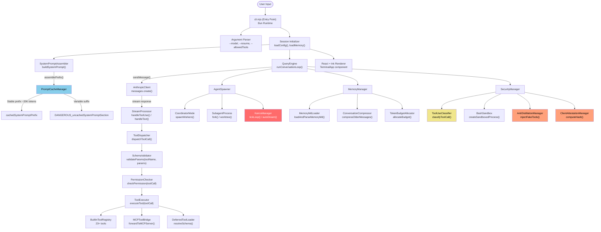
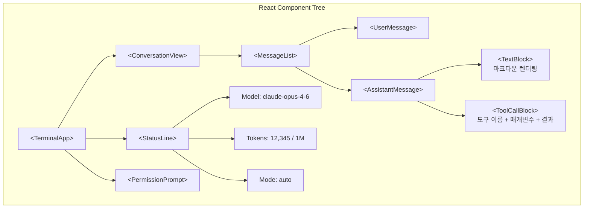
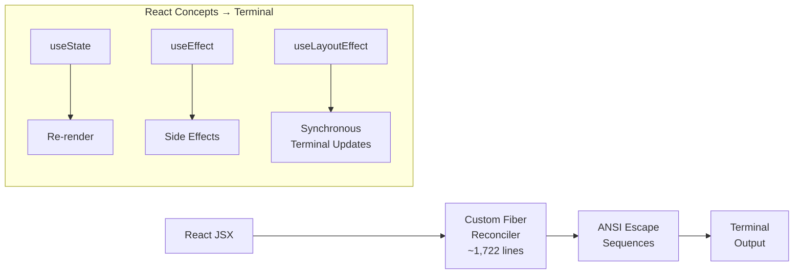

# 아키텍처 개요

Claude Code는 TypeScript로 작성되고 Bun으로 컴파일 및 번들링되며 React + Ink을 사용하여 터미널 UI로 렌더링된 터미널 기반 AI 코딩 어시스턴트입니다. 이 페이지에서는 유출된 소스 코드를 통해 밝혀진 내부 아키텍처에 대한 자세한 분석을 제공합니다.

주요 용어: **QueryEngine**은 핵심 대화 루프를 실행하고, **ConversationCompressor**는 메시지 히스토리를 압축하며, **SystemPromptAssembler**는 동적 프롬프트를 구성합니다.

## 고수준 아키텍처

## 기술 스택

| 구성 요소 | 기술 | 이유 |
|-----------|-----------|-----|
| 언어 | TypeScript | 복잡한 도구 스키마 및 API 계약을 위한 타입 안정성 |
| 런타임 | [Bun](https://bun.sh/) | 1초 미만의 콜드 스타트, 클라이언트 증명을 위한 네이티브 Zig HTTP 스택 |
| 터미널 UI | React + [Ink](https://github.com/vadimdemedes/ink) | 복잡한 터미널 레이아웃을 위한 선언형 UI 구성 |
| 번들러 | Bun의 기본 제공 번들러 | 단일 파일 출력, 소스 맵 (유출의 원인이라는 점이 아이러니) |
| 네이티브 레이어 | Zig | HTTP 전송, 클라이언트 증명 DRM을 위한 암호화 해시 |
| Feature Flag | [GrowthBook](https://www.growthbook.io/) | 재배포 없이 원격 A/B 테스팅 및 킬스위치 |
| 텔레메트리 | OpenTelemetry | 도구 호출 지연 시간 및 오류 추적을 위한 분산 추적 |
| 상태 관리 | React hooks + Context | 세션 상태, 대화 기록, UI 상태 |

## 소스 트리 구조

유출된 소스 맵에 의하면 다음과 같은 모듈 구조가 있습니다 (~1,900개 파일):

모듈 구조는 다음과 같이 구성됩니다:

- **CLI Layer**: 진입점 및 인수 파싱
- **Core Engine**: 대화 루프, 스트리밍 처리, 메시지 히스토리
- **System Prompt**: 프롬프트 조립, 캐시 관리, 110+ 명령어 블록
- **Tools**: 23+ 기본 도구, MCP 브릿지, 지연 로딩
- **Agents**: 에이전트 생성, 조정, 서브에이전트 관리, KAIROS 데몬
- **Security**: 권한 검사, 분류기, 샌드박스, 암호화
- **Memory**: 메모리 관리, 대화 압축, 토큰 예산 할당
- **Config**: 기능 플래그, 설정 관리
- **UI**: React/Ink 터미널 인터페이스
- **Skills**: 스킬 등록 및 정의
- **Telemetry**: OpenTelemetry 및 메트릭

## 핵심 데이터 흐름: QueryEngine 심층 분석

QueryEngine은 코드베이스에서 가장 중요한 모듈입니다. 이는 에이전트 대화 루프를 구현합니다:

### 주요 구현 세부 사항

**메시지 형식**: QueryEngine은 엄격한 타입의 메시지 배열을 유지합니다. 각 메시지는 역할(user 또는 assistant)과 콘텐츠 블록 배열로 구성됩니다. 콘텐츠 블록은 텍스트 블록, 도구 사용 블록, 또는 도구 결과 블록일 수 있습니다.

대화는 사용자 메시지와 어시스턴트 메시지가 교대로 진행됩니다. 도구 결과는 tool_result 콘텐츠 블록이 있는 사용자 메시지로 API에 전송됩니다.

**스트리밍**: 응답은 Server-Sent Events (SSE)로 처리됩니다. `StreamProcessor`는 도구 호출에 대한 부분 JSON을 처리합니다. 도구 호출의 매개변수는 여러 SSE 청크에 걸쳐 도착할 수 있으며 완료될 때까지 버퍼링되어야 합니다. 이 스트리밍 방식은 실시간 응답을 가능하게 합니다.

**도구 호출 배치**: 모델은 단일 응답에서 여러 도구 호출을 반환할 수 있습니다. QueryEngine은 다음 종속성 규칙에 따라 이를 처리합니다:
- 독립적 도구 호출 → `Promise.all()`을 통해 병렬로 발송
- 종속적 도구 호출 → 순차적으로 발송

**대화 압축 트리거**: `tokenBudgetAllocator.isOverBudget(conversationHistory)`가 true를 반환하면, ConversationCompressor는 가장 오래된 N개 메시지를 선택합니다 (시스템 프롬프트와 마지막 2개 턴 제외). 동일한 Claude 모델을 사용하여 요약 호출로 이를 보내고, 원본 메시지를 압축된 요약으로 바꿉니다. 새로운 영구적 사실이 추출된 경우 `MEMORY.md`를 업데이트합니다.

## Anthropic API 통합

API 클라이언트는 Anthropic TypeScript SDK의 사용자 정의 버전을 사용합니다. API 호출은 다음과 같은 주요 매개변수를 포함합니다:

| 매개변수 | 목적 |
|----------|------|
| `model` | 코드명을 API 모델 ID로 해석 (예: 'capybara' → 'claude-sonnet-4-6') |
| `max_tokens` | 남은 Token Budget에 따라 동적으로 계산 |
| `system` | SystemPromptAssembler에 의해 구성된 프롬프트 블록 배열 |
| `messages` | 대화 히스토리 |
| `tools` | PermissionChecker가 필터링한 14-17K 토큰의 도구 정의 |
| `stream` | 실시간 스트리밍 응답 활성화 |
| `anti_distillation` | Anti-Distillation 기능이 활성화되면 가짜 도구 신호 주입 |
| `cache_control` | Prompt Caching 경계 표시. 이 마커 이전의 모든 것이 캐시됨 |

### 모델 해석

`resolveModelId()` 함수는 내부 코드명을 API 모델 ID로 매핑합니다:

| 코드명 | API 모델 ID | 설명 |
|--------|------------|------|
| capybara | claude-sonnet-4-6 | Sonnet v8, 1M Context Window |
| fennec | claude-opus-4-5 | Opus 전임자 |
| numbat | (미출시) | 게이트됨 |

코드명이 매핑되지 않으면 코드명이 그대로 반환되어 API에 전달됩니다.

## React + Ink 터미널 UI

터미널 UI는 React 및 [Ink](https://github.com/vadimdemedes/ink)로 구축되며, ANSI 이스케이프 코드를 사용하여 React 구성 요소를 터미널로 렌더링합니다.

### 렌더링 파이프라인

1. **입력**: 사용자가 텍스트 입력 구성 요소(Ink의 `<TextInput>`)에 입력합니다
2. **스트리밍**: SSE 청크가 도착하면 React 훅을 통해 대화 상태가 업데이트됩니다
3. **렌더링**: Ink는 React 트리를 비교하고 변경된 ANSI 수열만 방출합니다
4. **도구 호출**: 축소 가능한 상세 뷰(도구 이름, 매개변수, 결과)와 함께 표시됩니다
5. **권한 프롬프트**: 사용자가 응답할 때까지 차단하는 모달 오버레이

이 아키텍처는 Claude Code의 UI가 완전히 선언형이라는 것을 의미합니다. 새로운 UI 요소(예: 진행률 표시줄 또는 알림)를 추가하는 것은 단순히 React 구성 요소를 추가하는 것입니다.

## 구성 레이어

구성은 우선순위가 있는 여러 레이어를 통해 흐릅니다:

1. **CLI 플래그** (최우선): 명령행에서 직접 지정된 옵션
2. **환경 변수** (CLAUDE_CODE_*): 환경에서 정의된 설정
3. **프로젝트 설정** (.claude/settings.json): 저장소 루트의 설정
4. **사용자 설정** (~/.claude/settings.json): 사용자 홈 디렉터리의 설정
5. **Feature Flag** (tengu_* 접두사): GrowthBook 원격 플래그
6. **컴파일된 기본값** (최하순위): 코드에 하드코딩된 기본값

### GrowthBook 통합

GrowthBook 클라이언트는 런타임에 Feature Flag를 평가합니다. GrowthBook SDK는 `https://cdn.growthbook.io`에서 기능 정의를 가져오며, 클라이언트 키는 바이너리로 컴파일됩니다.

모든 `tengu_` 접두사를 가진 플래그는 원격 구성에 대해 평가됩니다. 예를 들어, `anti_distill_fake_tool_injection` 플래그가 활성화되면 가짜 도구를 시스템 프롬프트에 주입합니다. Anthropic의 GrowthBook 대시보드의 변경 사항은 새 버전을 푸시하지 않고도 모든 Claude Code 설치 전체에 적용됩니다.

## 점진적 모듈 로딩

Claude Code는 일반적인 작업에 대한 첫 응답 시간(TTFR)을 최소화하기 위해 빠른 경로 최적화를 사용합니다:

- **빠른 경로 확인** `--version` 및 `--help`의 경우: 0 모듈 로딩, 즉시 응답
- **전체 트리 지연 로딩** REPL 모드 및 대화형 세션에만 필요합니다
- 이 최적화는 콜드 스타트에서 인지된 성능을 극적으로 향상시킵니다

기능 게이트 모듈 로딩은 Bun의 `feature()` 번들 타임 함수를 통해 관리됩니다. 예를 들어, KAIROS 어시스턴트 시스템(백그라운드 작업 스케줄링을 위한 장기 실행 데몬)은 `feature('KAIROS')` 플래그가 true일 때만 로드됩니다. 마찬가지로 다중 워커 오케스트레이션을 위한 코디네이터 모드는 `feature('COORDINATOR_MODE')`가 활성화된 경우에만 로드됩니다. 이 데드 코드 제거는 번들러 수준에서 발생하여 이러한 기능이 없는 빌드의 최종 실행 파일 크기를 줄입니다.

**Tier 3: 지연 초기화**: 모듈이 사용 가능하더라도 초기화는 지연됩니다. MDM 구성(macOS Mobile Device Management) 및 키체인 자격 증명과 같은 종속성은 세션 시작 중 동기적으로 차단하는 대신 가져오기 단계에서 비동기적으로 병렬 프리페치됩니다.

이 계층적 접근 방식은 인지된 시작 시간이 특정 작업에 따라 달라지도록 보장합니다: 버전 확인은 밀리초 단위로 완료되고, 도움말 텍스트는 50-100ms 내에 표시되며, 전체 대화형 세션은 서브시스템이 병렬 프리페치 작업을 완료하는 동안 1-2초 내에 초기화됩니다. 이를 통해 사용자는 가능한 가장 빠른 상호작용 시간을 경험합니다.

## 병렬 프리페칭

시작 성능은 독립 서브시스템의 병렬 초기화를 통해 추가로 최적화됩니다:

**주요 프리페치 작업**으로는 엔터프라이즈 정책 적용을 위한 MDM(Mobile Device Management) 구성(~200ms), OAuth 및 API 키 관리를 위한 macOS 키체인 자격 증명 검색(~500ms), 프로토콜 지원을 위한 MCP 서버 초기화(~300ms), 원격 A/B 테스트 게이트를 위한 GrowthBook 기능 플래그 가져오기가 있습니다. 이들은 애플리케이션 실행이 시작되자마자 사용자의 첫 번째 상호작용 전에 비동기적으로 시작됩니다.

**시작 프로파일러**는 주요 지점에 마커를 삽입하여 각 단계를 측정합니다. 프로파일링 데이터를 통해 실제 배포에서 병목 현상을 식별하고 최적화 변경의 영향을 측정할 수 있습니다. 총 시작 시간은 가장 느린 단일 작업(일반적으로 macOS에서 키체인 접근)에 근접하며, 순차 초기화 대비 2-3배 개선을 달성합니다.

**주요 프리페치 작업**:
- MDM 구성: ~200ms (엔터프라이즈 정책 적용)
- Keychain 자격증명: ~500ms (OAuth 및 API 키 관리)
- MCP 서버 초기화: ~300ms (프로토콜 지원)
- GrowthBook Feature Flag 로드: ~100ms (원격 A/B 테스트 게이트)

이 작업들은 사용자의 첫 번째 상호작용 전에 비동기적으로 병렬로 시작되어, 총 시작 시간은 약 500ms로 단축됩니다 (순차 초기화 대비 1000ms 절감).

## 터미널 렌더링 심층 분석

터미널 UI는 DOM 대신 ANSI 이스케이프 코드를 대상으로 하는 사용자 정의 React Fiber 조정자를 사용합니다. 이 아키텍처는 터미널 컨텍스트에서 선언형 구성 요소 구성 및 React 스타일 상태 관리를 가능하게 합니다.

React JSX는 사용자 정의 Fiber 조정자를 거쳐 ANSI 이스케이프 시퀀스로 변환되고, 이를 통해 터미널에 출력됩니다. useState, useEffect, useLayoutEffect 같은 React 개념들이 터미널 환경에서 동작합니다.

### Raw Mode 동기성

중요한 구현 세부 사항: 터미널 상태 변경은 `useEffect()` (비동기 스케줄링) 대신 `useLayoutEffect()` (동기 커밋 단계)를 사용합니다. 이 동기성은 터미널/React 상태 불일치를 방지하며, 이는 신호 처리(예: Ctrl+C 인터럽트)에 필수적이며 빠른 상태 업데이트 시 시각적 결함을 방지합니다.

조정자의 터미널 I/O와의 긴밀한 결합은 상태 업데이트가 완료될 때 터미널 표시가 이미 동기화되었음을 의미합니다. 이는 브라우저 React와의 편차이며, 여기서 레이아웃 단계는 DOM 변경과 분리됩니다.

## 3가지 명령 타입

Claude Code는 3가지 고유한 명령 타입을 처리하며 각각 최적화된 실행 경로가 있습니다:

| 타입 | 핸들러 | 예시 | 처리 |
|------|---------|---------|------------|
| `prompt` | Claude API  | 대부분의 사용자 입력 | 스트리밍 + 도구 발송 |
| `local` | JavaScript 함수 실행 | `/clear`, `/help`, `/version` | 즉시, API 호출 없음 |
| `local-jsx` | React 구성 요소 렌더링 | 복잡한 UI (설정, 대화) | 로컬 렌더, 모델 없음 |

명령은 `type` 필드가 런타임 동작을 결정하는 판별된 유니온 타입으로 등록됩니다.

**프롬프트 명령** (`type: 'prompt'`): Claude API로 전송되어야 하는 사용자 프롬프트 또는 스킬입니다. 호출 시 대화 기록으로 확장되어 도구 발송, PermissionChecker의 검사, 스트리밍 응답 처리를 포함한 전체 메시지 파이프라인을 통과합니다. `/refactor`, `/summarize` 등이 예시입니다.

**로컬 명령** (`type: 'local'`): 동기/비동기 JavaScript 함수로 실행되며 지연 시간이 없습니다. `/clear`(기록 삭제), `/help`(사용법 출력), `/version`(버전 출력) 등이 있으며 API에 접촉하지 않습니다.

**로컬 JSX 명령** (`type: 'local-jsx'`): Ink의 터미널 렌더러를 사용하여 대화형 React 컴포넌트를 렌더링합니다. 설정 대화 상자(`/config`), 권한 승인 화면 등 복잡한 UI 흐름에 사용됩니다.

이 3가지 타입 시스템은 **사용자 프롬프트만 API에 도달**함을 의미합니다. 슬래시 명령 및 UI 대화 상자는 0 지연 시간으로 완전히 로컬에서 처리됩니다.

| 명령 타입 | 처리 방식 | 예시 |
|----------|---------|------|
| prompt | Claude API → 스트리밍 → 도구 발송 | /refactor, /summarize |
| local | 즉시 JS 함수 실행 | /clear, /help, /version |
| local-jsx | 터미널 렌더링 → 사용자 상호작용 | /config, 권한 승인 |

## 상태 관리 아키텍처

응용 프로그램 상태는 Zustand 스타일 저장소 패턴과 React Context를 결합하는 하이브리드 방식을 통해 관리됩니다. React Context 제공자가 `useAppState(selector)` 훅을 통해 구성 요소 통합을 제공합니다.

**AppState 주요 필드**:

| 필드 | 목적 |
|------|------|
| settings | UserSettings - `~/.claude/settings.json`에 지속 |
| mainLoopModel | 현재 선택된 모델 |
| messages | Message[] - QueryEngine에서 스트리밍됨 |
| tasks | TaskState[] - 진행 중인 작업 추적 |
| toolPermissionContext | PermissionChecker의 규칙 및 거부 로그 추적 |
| kairosEnabled | Agent 시스템 활성화 여부 |
| remoteConnectionStatus | 원격 연결 상태 |
| replBridgeEnabled | Python REPL 브릿지 활성화 여부 |
| speculationState | Prompt Caching 접두사 매칭을 위한 모델 예측 캐시 |

선택자 패턴 (`useAppState(state => state.messages)`)은 세분화된 구독을 활성화하여 구성 요소가 선택된 조각이 변경될 때만 다시 렌더링되도록 합니다.

## 코드베이스 통계

| 지표 | 값 |
|--------|-------|
| 총 TypeScript 파일 | ~1,900 |
| 코드 줄 수 | ~512,000 |
| 번들 크기 (cli.mjs) | ~8 MB |
| 소스 맵 크기 | 59.8 MB |
| 기본 제공 도구 | 23+ |
| 지연/MCP 도구 | 동적 |
| 시스템 프롬프트 명령어 블록 | 110+ |
| 기능 플래그 | 44 (12 컴파일 타임, 15+ 런타임) |
| 서브에이전트 타입 | 5+ |
| 게이트된 모듈 (공개 빌드에 없음) | 108 |
