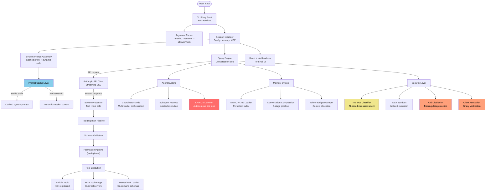
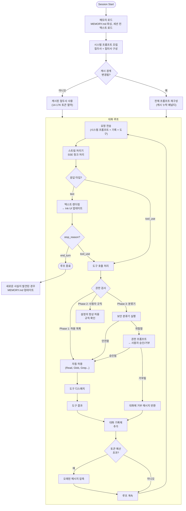

# 아키텍처 개요

Claude Code는 TypeScript로 작성되고 Bun으로 컴파일 및 번들링되며 React + Ink을 사용하여 터미널 UI로 렌더링된 터미널 기반 AI 코딩 어시스턴트입니다. 이 페이지에서는 유출된 소스 코드를 통해 밝혀진 내부 아키텍처에 대한 자세한 분석을 제공합니다.

## 고수준 아키텍처

## 기술 스택

| 구성 요소 | 기술 | 이유 |
|-----------|-----------|-----|
| 언어 | TypeScript | 복잡한 도구 스키마 및 API 계약을 위한 타입 안정성 |
| 런타임 | [Bun](https://bun.sh/) | 1초 미만의 콜드 스타트, 클라이언트 증명을 위한 네이티브 Zig HTTP 스택 |
| 터미널 UI | React + [Ink](https://github.com/vadimdemedes/ink) | 복잡한 터미널 레이아웃을 위한 선언형 UI 구성 |
| 번들러 | Bun의 기본 제공 번들러 | 단일 파일 출력, 소스 맵 (유출의 원인이라는 점이 아이러니) |
| 네이티브 레이어 | Zig | HTTP 전송, 클라이언트 증명 DRM을 위한 암호화 해시 |
| Feature Flag | [GrowthBook](https://www.growthbook.io/) | 재배포 없이 원격 A/B 테스팅 및 킬스위치 |
| 텔레메트리 | OpenTelemetry | 도구 호출 지연 시간 및 오류 추적을 위한 분산 추적 |
| 상태 관리 | React hooks + Context | 세션 상태, 대화 기록, UI 상태 |

## 모듈 구성

코드베이스는 여러 주요 서브시스템에 걸쳐 대략 1,800-2,000개의 TypeScript 파일로 구성되어 있습니다:

- **CLI & 세션 관리**: 진입점 초기화, 인수 파싱, 세션 수명 관리
- **핵심 엔진**: 쿼리 처리 루프, 스트리밍 응답 처리, 메시지 기록, 토큰 관리
- **프롬프트 시스템**: 110+ 개의 명령 블록을 포함한 시스템 프롬프트 조립, 프롬프트 캐시 관리
- **도구**: 도구 레지스트리, 디스패처, 스키마 검증, 43+ 개의 도구 구현 (read, write, edit, bash, grep 등)
- **에이전트**: 에이전트 생성, 다중 작업자 오케스트레이션, 백그라운드 스케줄링을 위한 KAIROS 데몬
- **보안**: 권한 검사, 도구 사용 분류, Bash 샌드박스, 역분류 방지, 클라이언트 증명
- **메모리**: 메모리 관리, MEMORY.md 파싱, 대화 압축, 토큰 예산 관리
- **구성**: GrowthBook을 통한 기능 플래그, 사용자 설정 관리
- **UI**: 대화 및 권한 상태를 위한 훅이 있는 React + Ink 터미널 컴포넌트
- **스킬**: 일반적인 워크플로우를 위한 구현이 포함된 스킬 레지스트리 (commit, simplify, loop 등)
- **텔레메트리**: 분산 추적을 위한 OpenTelemetry 통합

## 핵심 데이터 흐름: QueryEngine 심층 분석

QueryEngine은 코드베이스에서 가장 중요한 모듈입니다. 이는 에이전트 대화 루프를 구현합니다:

### 주요 구현 세부 사항

**메시지 형식**: QueryEngine은 엄격한 타입의 메시지 배열을 유지합니다. 각 메시지는 역할(user 또는 assistant)과 콘텐츠 블록 배열로 구성되며, 콘텐츠 블록은 다형적으로 텍스트 출력, 도구 호출, 또는 이전 단계의 도구 결과를 나타낼 수 있습니다. 대화는 사용자와 어시스턴트 메시지 간에 엄격하게 교대로 진행되며, 도구 결과는 API가 예상하는 교대 패턴을 유지하면서 tool_result 콘텐츠 블록이 있는 사용자 메시지로 반환됩니다.

**스트리밍**: 응답은 Server-Sent Events (SSE)를 통해 실시간으로 도착하며 부분 JSON 처리를 지원합니다. 도구 호출의 매개변수가 여러 SSE 청크에 걸쳐 도착할 수 있으므로, 검증 및 발송 전에 완료될 때까지 버퍼링되어야 합니다.

**도구 호출 배치**: 모델은 단일 응답에서 여러 도구 호출을 반환할 수 있습니다. 시스템은 종속성 분석에 따라 이를 처리합니다: 독립적인 도구 호출은 병렬로 실행되고, 종속적인 호출은 순차적으로 실행되어 인과관계를 존중합니다.

**대화 압축**: 토큰 예산을 초과하면 시스템은 오래된 메시지 기록을 압축하여 토큰을 회수합니다. 이는 가장 오래된 N개 메시지(시스템 프롬프트 및 최근 컨텍스트 제외)를 선택하고, 동일한 Claude 모델을 사용하여 요약 처리로 전송한 후, 원본을 압축된 요약으로 바꾸는 과정을 포함합니다. 요약 중에 새로운 영구적 사실이 발견되면 이를 추출하여 `MEMORY.md`에 추가합니다.

> **참고:** 위 다이어그램에 표시된 권한 검사는 단순화된 것입니다. 전체 파이프라인은 사용자 프롬프트로 폴스루(fallthrough)되기 전에 거부 규칙, 요청 규칙, 도구별 검사, 우회 불가능한 안전 검사, 모드 기반 권한 및 허용 규칙을 평가합니다. 자동 모드에서는 AI 분류기가 추가 평가 phase를 제공합니다. 전체 흐름은 [권한 모델](../security/permission-model.md)을 참조하세요.

## Anthropic API 통합

API 클라이언트는 Anthropic messages 엔드포인트에 다음과 같은 주요 매개변수를 포함하여 요청을 전송합니다:

| Parameter | Purpose |
|-----------|---------|
| `model` | resolved from internal identifiers to API model IDs at runtime |
| `max_tokens` | Dynamically computed from remaining token budget |
| `system` | 시스템 프롬프트 조립 파이프라인으로 구성됨 |
| `messages` | Conversation history with strict alternation between user and assistant roles |
| `tools` | 도구 스키마 정의 (14-17K 토큰), 접근 규칙에 따라 필터링됨 |
| `stream` | Enabled to allow real-time streaming of response tokens |
| `anti_distillation` | Optional signal injecting fake tools into the request when anti-distillation is enabled |
| `cache_control` | Marks the boundary for prompt caching, enabling the cached system prompt prefix |

## 코드베이스 통계

> **참고:** 다음 통계는 소스 코드 분석 기반의 근사치이며, 빌드 설정 및 버전에 따라 달라질 수 있습니다.

| Metric | Value |
|--------|-------|
| Total TypeScript files | ~1,900 |
| Lines of code | ~512,000 |
| Bundle size (cli.mjs) | ~8 MB |
| Source map size | 59.8 MB |
| Built-in tools | 43+ |
| Deferred/MCP tools | Dynamic |
| System prompt instruction blocks | 110+ |
| Feature flags | 50+ (compile-time + GrowthBook runtime) |
| Subagent types | 5+ |
| Gated modules (not in public build) | 108 |
