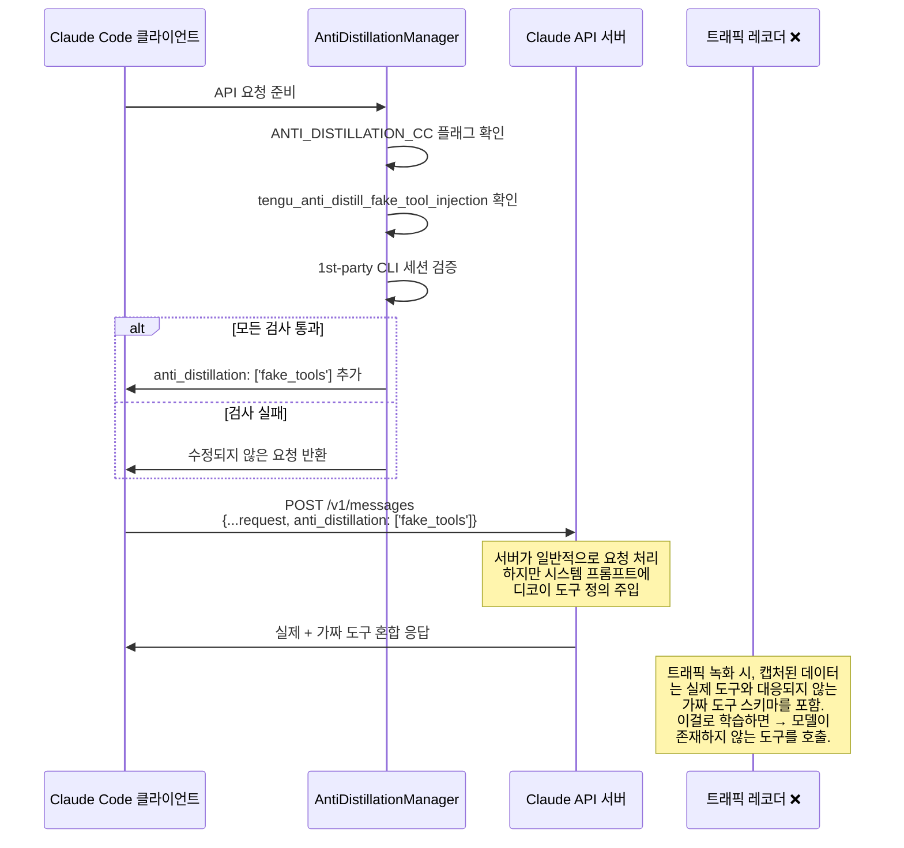
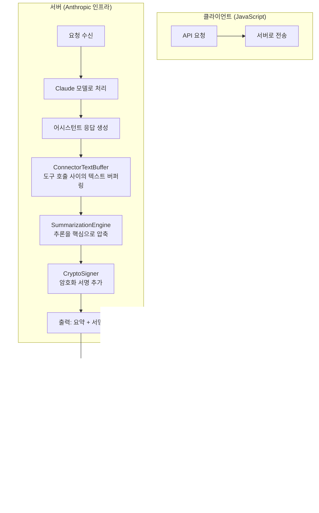
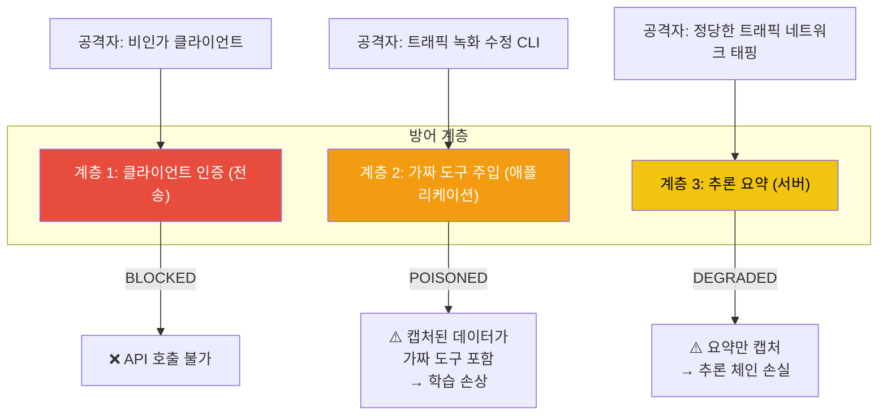

# Anti-Distillation 메커니즘

유출된 소스코드에서 가장 놀라운 발견 중 하나는 경쟁사가 API 트래픽을 녹화/재생하여 Claude Code의 능력을 디스틸레이션하는 것을 방지하기 위한 다중 레이어 시스템이었다. 구현은 클라이언트 사이드와 서버 사이드 컴포넌트 모두에 걸쳐 있다.

## 개요

Claude Code는 세 가지 서로 다른 Anti-Distillation 메커니즘을 사용한다:

1. **가짜 도구 주입**: 클라이언트 사이드는 디코이 도구 정의로 학습 데이터를 오염시킴
2. **추론 요약**: 서버 사이드는 전체 추론 체인 캡처를 방지
3. **Client Attestation**: 전송 레벨은 비인가 API 접근을 완전히 차단 ([별도 페이지](./client-attestation.md) 참조)

## 1. 가짜 도구 주입

### 클라이언트 사이드 신호만

**클라이언트 사이드** 가짜 도구 주입은 요청 파라미터 설정으로 제한된다. 응답에 가짜 도구를 실제로 주입하는 것은 완전히 **서버 사이드**에서 Anthropic의 인프라에서 일어난다. Claude Code 클라이언트는 가짜 도구 정의를 생성하거나 주입하는 로직을 포함하지 않는다.

### 구현 상세

안티 디스틸레이션 로직은 다양한 조건을 검증하는 게이트 메커니즘을 통해 작동한다. 시스템은 이중 계층 권한 패턴을 구현한다: 컴파일 타임 플래그(`COMPILE_FLAGS.ANTI_DISTILLATION_CC`)는 데드 코드 제거를 통해 3rd-party 빌드에서 기능을 완전히 제거하고, 런타임 GrowthBook 플래그(`tengu_anti_distill_fake_tool_injection`)는 Anthropic에 새 클라이언트 릴리스를 요구하지 않고 원격으로 메커니즘을 비활성화할 수 있는 긴급 킬스위치를 제공한다. 활성화되면, 매니저는 클라이언트 인증 시스템의 Zig-계산 HTTP 해시를 활용하여 요청이 정품 Claude Code 바이너리에서 온 것인지 확인함으로써 1st-party 세션 검출을 수행한다.

실제 구현은 이 검증 체인을 사용하여 `anti_distillation: ['fake_tools']` 파라미터를 추가하는 API 요청 페이로드를 조건부로 수정한다. 이 파라미터는 서버에 응답에 가짜 도구 정의를 포함시키도록 신호한다. 이 접근법은 세 조건 모두가 동시에 충족될 때만 기능이 활성화되도록 보장한다: 컴파일 타임 게이트 존재, 런타임 플래그 활성화, 인증된 1st-party 바이너리. 단순 런타임 패칭으로 우회하는 것을 불가능하게 한다.

**핵심 포인트:** 클라이언트 소스 코드에 가짜 도구 정의는 존재하지 않는다. 클라이언트는 서버에 알리기 위해 파라미터(`anti_distillation: ['fake_tools']`)만 전송한다. 서버는 이 파라미터를 받을 때 응답의 시스템 프롬프트에 가짜 도구를 주입할지 결정한다.


### 요청/응답 흐름



### 가짜 도구의 모습

서버는 그럴듯해 보이지만 실제 기능과 대응되지 않는 도구 정의를 주입한다. 분석을 바탕으로, 이 가짜 도구들:

- 현실적인 이름을 가짐 (예: 내부 Anthropic 도구처럼 들리는 도구)
- 완전한 JSON Schema 파라미터 정의 포함
- 상세한 설명과 사용 지침 포함
- 실제 소스 코드에 접근하지 않고는 실제 도구와 구별 불가능

캡처된 트래픽으로 학습한 모델은 이 가짜 도구들을 호출하는 것을 배우게 되어, 프로덕션에서는 깨진 도구 호출을 생성한다. 이는 효과적으로 **API 트래픽 도용에 대한 카나리 함정**이다.

### 이중 게이트 권한

메커니즘은 두 게이트가 모두 열려야 한다:

| 게이트 | 유형 | 제어자 |
|-------|------|--------|
| `ANTI_DISTILLATION_CC` | 컴파일 타임 플래그 | 빌드 시 설정; 런타임에 변경 불가 |
| `tengu_anti_distill_fake_tool_injection` | GrowthBook 런타임 플래그 | Anthropic이 원격 제어 |

이 설계는 두 가지 목적을 제공한다:
1. **컴파일 타임 게이트**: 기능이 3rd-party 빌드에서 완전히 제거되도록 보장 (데드 코드 제거)
2. **런타임 게이트**: Anthropic이 새 빌드를 푸시할 필요 없이 원격으로 기능을 비활성화할 수 있게 함

### 1st-Party 세션 감지

`isFirstPartyCLISession()` 검사는 요청이 3rd-party 통합이 아닌 공식 Claude Code 바이너리에서 유래했는지 검증한다. 이는 [클라이언트 인증](./client-attestation.md) 시스템을 포함한다. Zig-계산 HTTP 해시는 바이너리가 정품인지 확인한다.

## 2. 추론 요약

### 서버 사이드 전용

추론 요약은 **Anthropic 서버에서만 구현된다**. Claude Code 클라이언트는 요약 로직이나 코드를 포함하지 않는다. 클라이언트의 유일한 관련은 서버에 안티 디스틸레이션 보호를 적용해야 함을 신호하는 요청 파라미터(`anti_distillation: ['fake_tools']` 또는 유사)를 설정하는 것이다. 서버는 클라이언트에 응답을 반환하기 전에 어시스턴트의 추론 체인에 요약을 적용한다.

### 구현 상세

두 번째 메커니즘은 완전히 **서버 사이드**에서 작동한다. 클라이언트 소스 코드에서 직접 관찰될 수 없지만, 그 존재는 다음으로 드러난다:

1. 클라이언트 코드의 설정 참조 (활성화/비활성화를 위한 피처 플래그)
2. API 요청에서 `anti_distillation` 파라미터 전달
3. 문서 주석에서 참조되는 서버 사이드 컴포넌트

### 처리 파이프라인



### 요약되는 것

**커넥터 텍스트** (연속적인 도구 호출 사이의 어시스턴트 추론)이 주요 대상이다:

```
[도구 호출 1: Read file.ts]
→ 커넥터 텍스트: "함수의 버그를 42번 줄에서 볼 수 있다.
   조건 검사가 반전되어 있다. 변수 `isValid`는
   거짓성이 아닌 참성을 확인해야 한다. 이 경우를 다루는
   테스트가 있는지도 확인해보자..."
[도구 호출 2: Grep for test files]
```

요약 후:

```
[도구 호출 1: Read file.ts]
→ 요약: "42번 줄에서 버그 발견. 테스트 확인 중."
→ 서명: 0xa3f7...
[도구 호출 2: Grep for test files]
```

**상세한 추론** (모델의 코드 이해, 디버깅 전략, 의사결정 프로세스를 담는 것)이 가장 유용한 학습 신호다. 이를 요약하면, 트래픽 레코더에 대해 이 신호는 파괴된다.

### 암호화 서명

각 요약은 다음을 수행하는 암호화 서명과 함께 서명된다:

1. **Anthropic 서버가 요약을 생성했음을 증명** (변조되지 않음)
2. **3rd-party가 요약을 수정할 경우 감지 가능** 
3. **Anthropic이 캡처된 데이터의 무결성을 검증할 수 있는 감사 흔적 제공**

## 3. 통합 방어 매트릭스



| 공격 벡터 | 방어 계층 | 결과 |
|----------|----------|------|
| 비인가 API 클라이언트 | 클라이언트 인증 | 완전히 차단 |
| 트래픽 녹화 수정 CLI | 가짜 도구 주입 | 학습 데이터 오염 |
| 네트워크 레벨 트래픽 캡처 | 추론 요약 | 요약만 사용 가능 |
| 중간자 프록시 | 세 계층 모두 | 차단, 오염, 저하 |
| 공식 CLI 트래픽 녹화 | 가짜 도구 + 요약 | 오염, 저하 |

## GrowthBook 설정

안티 디스틸레이션 시스템은 GrowthBook과 통합되어 있다. GrowthBook은 클라이언트 업데이트를 푸시할 필요 없이 원격으로 동작을 제어하는 피처 관리 플랫폼이다. `tengu_anti_distill_fake_tool_injection` 피처 플래그는 클라이언트 버전, 배포 환경, 또는 사용자 코호트에 따른 조건부 규칙으로 설정될 수 있다. 기본적으로 플래그는 비활성화되지만, Anthropic은 선택적으로 활성화할 수 있다. 예를 들어, 방어가 활성화되기 전에 기본 기능을 보장하기 위해 클라이언트 버전 >= 2.1.0에 대해서만.

이 아키텍처는 Anthropic에 가짜 도구 주입에 대한 세밀한 제어를 제공한다: 팀은 모든 설치에 걸쳐 전역적으로 기능을 활성화 또는 비활성화할 수 있고 초 단위로 처리하고, 롤아웃 위험을 관리하기 위해 특정 클라이언트 버전을 대상으로 지정하고, 사용자 경험과 시스템 성능에 미치는 영향을 측정하기 위해 A/B 테스트를 수행하고, 메커니즘이 예상치 못한 부작용이나 성능 저하를 일으킬 경우 긴급 비활성화를 트리거할 수 있다. 컴파일 타임과 런타임 게이트의 분리는 런타임 플래그가 손상되더라도 기능이 non-1st-party 빌드에서 완전히 제거된 상태로 유지된다는 의미다.

