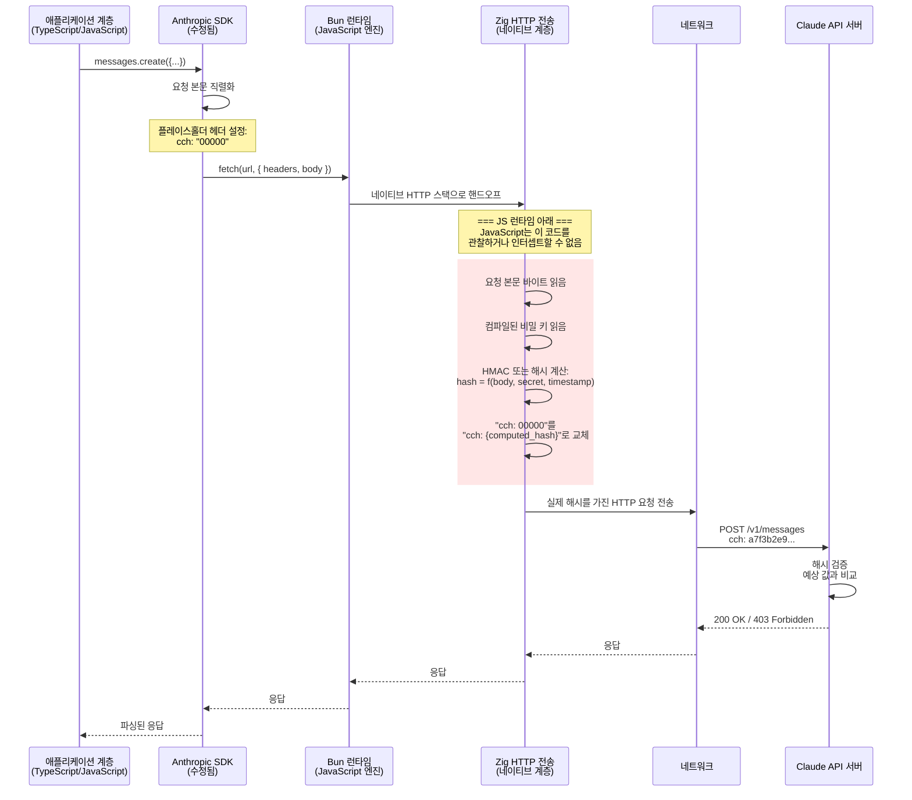
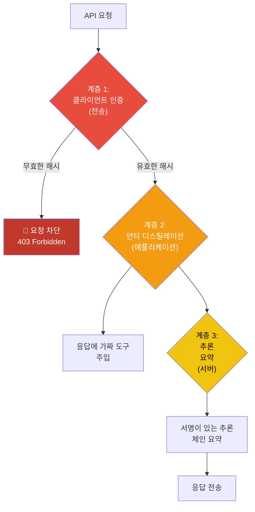

# Client Attestation (DRM)

유출된 소스코드에서 암호화 Client Attestation 메커니즘이 발견되었다. 사실상 **API 호출을 위한 DRM**으로, 요청이 위조되거나 수정된 클라이언트가 아닌 정품 Claude Code 바이너리에서 온 것인지 확인한다. 구현은 Bun의 고유한 아키텍처를 활용하여 해시 계산을 **JavaScript 런타임 아래**에 배치한다.

## 구현 아키텍처



## 핵심 인사이트: JavaScript 아래 Zig

Bun의 아키텍처는 JavaScript 런타임 중에서 유일하다. 클라이언트 인증의 핵심 설계 통찰은 **해시 계산을 JavaScript 런타임 아래에 놓는 것**이다. 이는 다음을 의미한다:

```
┌─────────────────────────────────────────┐
│  JavaScript/TypeScript 애플리케이션 코드 │  ← 검사, 패칭, 디버깅 가능
│─────────────────────────────────────────│
│  Bun HTTP 클라이언트 (Zig)              │  ← 해시 계산은 여기서 (네이티브 코드)
│  - TLS 구현                             │
│  - HTTP/2 멀티플렉싱                    │
│  - 요청 직렬화                          │
│  - ** 클라이언트 인증 해시 **           │
│─────────────────────────────────────────│
│  운영체제 (syscalls)                    │
└─────────────────────────────────────────┘
```

결과: **JavaScript 몽키패칭은 Zig 계층에 도달할 수 없다**. 공통 우회 기법들이 실패한다:

| 우회 시도 | 실패 이유 |
|----------|---------|
| JS에서 `fetch()` 오버라이드 | 해시는 fetch가 Zig로 핸드오프한 후 계산됨 |
| HTTP 요청 프록시 | 해시는 Zig의 원본 본문 바이트에 계산, TLS 전 |
| Anthropic SDK 패치 | SDK는 플레이스홀더만 설정; 실제 해시는 Zig가 추가 |
| JS 디버거 사용 | 디버거는 컴파일된 Zig 코드로 진입할 수 없음 |
| `fetch` 구현 교체 | Bun의 `fetch`는 네이티브 Zig, JS 폴리필 아님 |
| globalThis.fetch에 `Proxy` 래퍼 | Zig 전송이 내부적으로 호출되므로 동일함 |

인증을 우회하는 **유일한** 방법은 Bun에서 **Zig 코드를 재컴파일**하는 것이다. 다음이 필요:
1. Bun 소스 코드
2. 컴파일된 비밀 키 (JavaScript 소스에 없음)
3. Zig 도구체인
4. 해시 알고리즘에 대한 이해

## 기술 상세

### 플레이스홀더 메커니즘

클라이언트 인증의 JavaScript 사이드 구현은 의도적으로 최소화되어 있다: Bun의 네이티브 HTTP 전송으로 핸드오프되기 전에 `cch` 헤더에 정적 플레이스홀더 값(`00000`)을 설정할 뿐이다. 이 플레이스홀더는 절대 실제 인증 해시가 아니다. 실제 계산은 JavaScript 런타임 아래 Zig 계층에서 일어나며 JavaScript에서 관찰하거나 수정할 수 없다.

특정 플레이스홀더 값(`00000`)은 컴파일된 바이너리 계층의 일부이며 실제 인증 토큰에 대응되지 않는다. 실제 해시 계산(요청 본문, 컴파일된 비밀 키, 타임스탐프에서 파생)은 완전히 Zig에서 일어나며 이 플레이스홀더를 클라이언트를 떠나기 전에 교체한다.

JS 사이드 코드는 플레이스홀더를 설정하기 전에 단락시키는 세 가지 독립적인 게이트를 포함한다. 첫째, 컴파일 타임 플래그(`COMPILE_FLAGS.NATIVE_CLIENT_ATTESTATION`)는 non-1st-party 빌드에서 인증 로직을 완전히 제거한다. 둘째, `CLAUDE_CODE_ATTRIBUTION_HEADER` 환경 변수를 통한 개발 오버라이드는 로컬 테스트 및 CI 환경이 재컴파일 없이 옵트아웃할 수 있게 한다. 셋째, GrowthBook 피처 플래그(`tengu_attribution_header`)는 메커니즘이 문제를 일으킬 경우 Anthropic이 즉시 모든 설치에서 인증을 비활성화할 수 있는 원격 킬스위치를 제공한다. 세 게이트 모두 작동 허가를 할 때만 코드가 플레이스홀더를 설정한다. 실제 해시 교체는 완전히 Zig에서 일어나 JavaScript 관점에서 보이지 않고 변조 불가능하다.


### Zig-사이드 해시 계산

Zig HTTP 전송 계층은 JavaScript 런타임 아래에서 완전히 작동하며 실제 암호화 인증 계산을 수행한다. 해시는 JavaScript에서 관찰될 수 없는 세 가지 입력에서 파생된다: 완전한 요청 본문 바이트, Zig 바이너리에 구워진 컴파일된 비밀 키, 그리고 재생 공격을 방지하는 타임스탐프.

이 배치를 JavaScript 아래에 놓는 것이 보안 기초다: 해시 계산은 JavaScript 디버거, 프록시, 인스트루먼테이션 도구에서 완전히 숨겨진다. JavaScript 실행에 대한 완전한 제어권을 가진 공격자도 해시가 어떻게 계산되는지 관찰하거나 비밀 키를 가로챌 수 없다. 타임스탐프 포함은 캡처된 해시를 다른 요청에 재사용하는 재생 공격을 추가로 방지한다.


### 서버 사이드 검증

API 서버는 다음을 통해 해시를 검증한다:

1. 수신 요청에서 `cch` 헤더 추출
2. 동일한 알고리즘과 키를 사용하여 예상 해시 재계산
3. 제공된 해시를 예상 해시와 비교
4. 매치하지 않을 경우 403으로 요청 거부

클라이언트와 서버 모두 비밀 키를 알고 있기 때문에 (바이너리에 컴파일, 서버에 저장), 정품 바이너리만 유효한 해시를 생성할 수 있다.

## 우회 메커니즘

개발과 긴급 상황을 위한 두 가지 의도적 우회가 존재한다:

### 1. 환경 변수

```bash
export CLAUDE_CODE_ATTRIBUTION_HEADER=disabled
```

설정되면, JS 사이드 코드는 플레이스홀더 헤더를 설정하지 않으므로 Zig 계층이 교체할 것이 없다. 요청은 인증 없이 전송된다.

**사용 사례**: 로컬 개발, 테스트, CI 환경.

### 2. GrowthBook 킬스위치

```json
{
  "tengu_attribution_header": {
    "defaultValue": true,
    "rules": [{
      "condition": { "emergency": true },
      "force": false
    }]
  }
}
```

Anthropic은 이 플래그를 토글하여 모든 설치에 걸쳐 원격으로 인증을 비활성화할 수 있다. JS 사이드 검사는 플레이스홀더를 설정하기 전에 단락된다.

**사용 사례**: 인증 메커니즘이 광범위한 문제를 일으킬 경우 (예: 해시 알고리즘 버그, 클록 스큐 문제).

## 보안 분석

### 강점

| 강점 | 상세 |
|-----|------|
| **JS 런타임 아래** | JavaScript에서 관찰하거나 패치할 수 없음 |
| **컴파일된 비밀** | 키가 Zig 바이너리에 임베드, JS 소스에 없음 |
| **요청 특정** | 해시는 실제 요청 본문에서 계산, 재생 방지 |
| **타임스탐프 바운드** | 타임스탬프를 포함하여 재생 공격 방지 가능성 높음 |
| **JS 비가시 해시** | 실제 해시는 JavaScript 메모리에 절대 나타나지 않음 |

### 약점 (이론적)

| 약점 | 상세 |
|-----|------|
| **바이너리 리버스 엔지니어링** | Zig 바이너리는 이론적으로 리버스 엔지니어링될 수 있음 |
| **키 추출** | 메모리 덤프가 잠재적으로 컴파일된 키를 추출할 수 있음 |
| **환경 변수 우회** | `CLAUDE_CODE_ATTRIBUTION_HEADER` 환경 변수는 알려진 탈출구 |
| **TLS 후 중간자** | TLS가 손상/인터셉트되면 해시가 보임 |

## 심층 방어와의 관계

클라이언트 인증은 **전송 레벨** 방어다. 애플리케이션 레벨 방어를 보완한다:



각 계층은 독립적 보호를 제공한다:
1. **클라이언트 인증**: 비인가 클라이언트를 완전히 차단
2. **가짜 도구**: 새는 데이터를 오염 (예: 정당하지만 녹화된 트래픽)
3. **추론 요약**: 캡처된 데이터의 가치 저하
