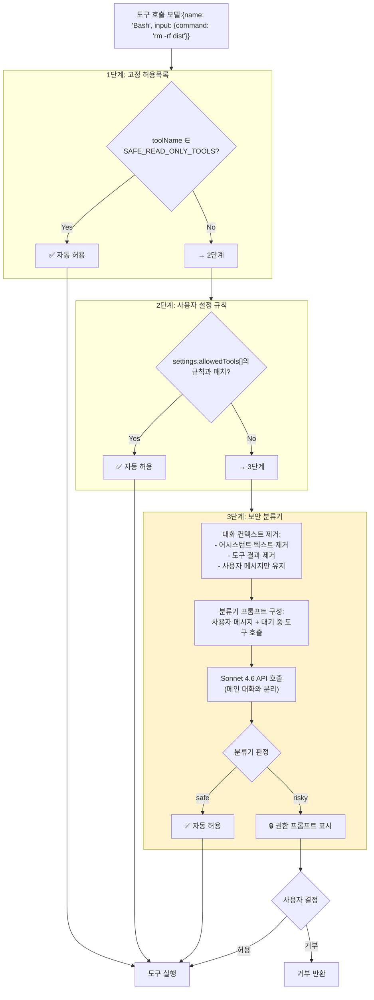
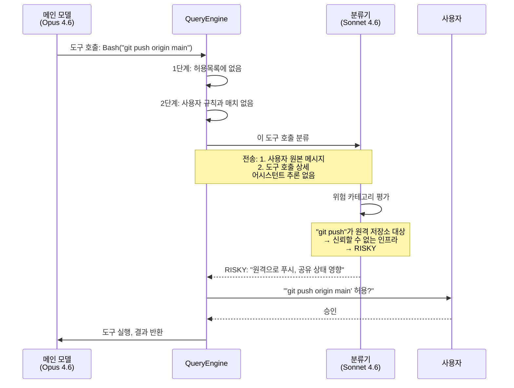
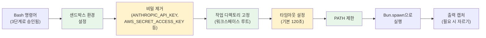

# Permission Model

Claude Code는 모든 도구 호출을 실행 전에 평가하는 **3단계 보안 아키텍처**를 구현한다. 가장 정교한 컴포넌트는 독립적인 보안 Classifier로 작동하는 보조 Claude 모델(Sonnet 4.6)이다.

> **주의:** 아래의 3단계 모델은 **Bash 도구 권한 흐름**을 설명한다. 다른 도구들(Read, Write, Edit 등)은 서로 다른 권한 모델을 가지므로 각 도구의 문서를 참조하기 바란다. Bash는 임의의 셸 명령어를 실행할 수 있기 때문에 가장 복잡한 권한 시스템을 가진다.

## 아키텍처



## 1단계: 고정 허용목록

**1단계**는 가장 빠른 검사다: 시스템 상태를 절대 수정할 수 없기 때문에 무조건 허용되는 **읽기 전용 도구**의 하드코딩된 집합. 이 도구들은 권한 시스템에 정의되어 있으며 다른 로직보다 먼저 검사된다.

안전한 허용목록에는 **Read**(파일 검사), **Glob**(파일 글로빙), **Grep**(텍스트 검색) 및 기타 정보 수집 작업 같은 도구들이 포함된다. 이 도구들은 파괴적인 능력이 없기 때문에 (검사, 읽기, 또는 검색만 수행) 모든 다른 권한 계층을 건넌다.

도구 호출이 도착하면, 시스템은 도구 이름이 이 허용목록에 있는지 확인한다. 매치되면 요청이 즉시 승인된다. 그렇지 않으면 요청은 **2단계**로 전달되어 사용자 설정 규칙을 확인한다.


## 2단계: 사용자 설정 규칙

**2단계**는 사용자가 보안 검토 없이 신뢰하는 도구에 대한 패턴을 정의할 수 있게 해준다. 사용자는 `~/.claude/settings.json`, `.claude/settings.json`, 또는 프로젝트 레벨 `.claude/settings.json`에서 이러한 규칙을 설정하여 반복적인 워크플로우를 자동화할 수 있다.

규칙은 세 가지 유형의 작업을 대상으로 할 수 있다:

- **전체 도구**: `Bash`를 무조건 허용 (위험; 주의해서 사용)
- **명령어 접두어**: `Bash`를 `npm test` 또는 `git status`로 시작하는 명령어일 때만 허용
- **경로 패턴**: `Write` 또는 `Edit`을 `test/**` 또는 `**/*.test.ts`와 매칭하는 파일에 대해서만 허용

시스템은 사용자의 설정된 규칙을 반복하며 현재 도구 호출이 매치하는지 확인한다. 규칙이 매치되는 경우:
1. 도구 이름이 매치되고, AND
2. 명령어 기반 규칙: 명령어가 허용된 접두어로 시작, OR
3. 경로 기반 규칙: 파일 경로가 글롭 패턴과 매치

매치가 발견되면 도구가 허용된다. 규칙이 매치되지 않으면 요청은 **3단계**(AI 분류기)로 전달된다.

이 계층은 전역적으로 권한을 하드코딩하지 않고도 세밀한 제어를 제공한다. AI 분류기보다 먼저 적용되므로 규칙이 AI 판단보다 우선된다.


## 3단계: 보안 분류기

### 분류기 모델

분류기는 메인 대화와 독립적인 **별도의 API 호출**로 Claude Sonnet 4.6으로 구성되어 있다. 자체 시스템 프롬프트를 가지고 있으며 의도적으로 축소된 대화 뷰를 본다.

분류기는 다음과 같이 작동한다:

1. **사용자 메시지 추출**: 시스템은 전체 대화 히스토리를 스캔하고 `role === 'user'`인 메시지만 추출한다. 어시스턴트 메시지, 도구 결과, 메타데이터는 폐기된다.

2. **도구 결과 제거**: 각 사용자 메시지에서 텍스트 컨텐츠 블록만 유지된다. 도구 결과 블록 (사용자 메시지에도 나타나지만 메타데이터)은 필터링된다. 이는 분류기가 사용자가 명시적으로 작성한 것만 보도록 보장한다.

3. **분류기 프롬프트 구성**: 축소된 사용자 메시지는 대기 중인 도구 호출(평가 중인 액션)과 결합되어 간결한 프롬프트를 형성한다. 이 축소된 프롬프트는 전체 대화보다 훨씬 작아서 컨텍스트 윈도우 사용을 줄이고 분류기 포커스를 개선한다.

4. **분류기 API 호출**: 축소된 프롬프트와 도구 호출은 자체 시스템 프롬프트(`CLASSIFIER_SYSTEM_PROMPT`)가 있는 **별도의 API 호출**로 Claude Sonnet 4.6에 전송된다. 이 분류기 모델은 메인 에이전트 대화와 독립적으로 실행된다.

5. **응답 파싱**: 분류기는 판정을 반환한다: `SAFE`(허용) 또는 `RISKY`(사용자 확인 필요). 응답에는 위험 평가를 설명하는 간단한 정당성이 포함된다.

이 분리는 중요하다: 분류기에게 메인 모델의 추론이나 컨텍스트 조작 없이 사용자의 의도와 제안된 액션만 깨끗한 뷰를 제공함으로써 메인 모델이 분류기를 "설득하여" 안전하지 않은 승인을 얻는 것을 방지한다.


### 왜 컨텍스트를 제거하는가?

축소는 핵심 보안 통찰이다:

| 분류기가 보는 것 | 제거되는 것 | 이유 |
|-----------------|-----------|------|
| 사용자 메시지 (요청된 것) | 어시스턴트 텍스트 | 메인 모델이 분류기를 승인으로 "설득"하는 것을 방지 |
| 대기 중인 도구 호출 (발생할 것) | 이전 도구 결과 | 이전 도구 결과를 통한 컨텍스트 조작 방지 |
| 도구 파라미터 | 대화 히스토리 상세 | 분류기를 특정 액션에 포커스하도록 유지 |

**사용자가 요청한 것**과 **도구가 의도하는 것**만 봄으로써, 분류기는 메인 모델의 추론이나 설득에 영향받지 않고 순수하게 액션의 장점으로만 평가한다.

### 위험 카테고리

분류기는 세 가지 위험 차원을 평가한다:

```typescript
const CLASSIFIER_SYSTEM_PROMPT = `
You are a security classifier for Claude Code. Evaluate whether the following
tool call is safe to execute given the user's request.

Evaluate these risk categories:

1. SCOPE ESCALATION: Does the tool call exceed what the user actually requested?
   Examples: User asks to fix a bug → model tries to refactor entire codebase
             User asks to read a file → model tries to delete it

2. UNTRUSTED INFRASTRUCTURE: Does the tool call target external or shared systems?
   Examples: Pushing to remote repository
             Making HTTP requests to external APIs
             Modifying CI/CD configuration

3. OTHER RISKS: General safety concerns.
   Examples: Destructive commands (rm -rf, DROP TABLE)
             Exposing secrets (cat .env, printing API keys)
             Modifying system configuration

Respond with exactly one of:
- SAFE: The tool call is appropriate for the user's request
- RISKY: The tool call requires user confirmation

Include a brief justification.
`;
```

### 분류기 결정 흐름



## GrowthBook을 통한 원격 설정

분류기 동작을 원격으로 조정할 수 있다:

```typescript
// 분류기에 영향을 주는 피처 플래그
{
  // 분류기 민감도 임계값
  "tengu_security_classifier_sensitivity": "medium",  // low | medium | high

  // 분류기 활성화 여부 (긴급 킬스위치)
  "tengu_security_classifier_enabled": true,

  // 추가 위험 카테고리 (확장 가능)
  "tengu_security_classifier_extra_risks": [],

  // 특정 도구 패턴에 대해 강제로 물음
  "tengu_security_classifier_force_ask": [
    "Bash:git push*",
    "Bash:rm -rf*"
  ]
}
```

이 원격 제어는 Anthropic이:
- **민감도 증가** (새로운 공격 벡터 발견 시)
- **분류기 비활성화** (긴급 상황 - 모든 도구 호출이 사용자 프롬프트로)
- **새로운 위험 카테고리 추가** (빌드 푸시 없이)
- **강제 물음 패턴** (알려진 위험 명령어)

을 할 수 있게 한다.

### 분류기 가용성

보안 분류기는 **Anthropic 1st-party 빌드에서만 활성화된다**. non-Anthropic 빌드(3rd-party 통합, 커스텀 배포)에서는 분류기가 `{ matches: false }`를 반환하고 분류를 수행하지 않는다. 이는 다음을 의미한다:

- 3단계는 사실상 3rd-party 빌드에서 무동작
- 권한 결정은 1단계와 2단계만 기본값
- 1-2단계와 매치되지 않는 도구 호출은 사용자의 수동 승인을 위해 전달

## 추가 Bash 보안 계층

3단계 권한 모델 외에도 Bash 명령어는 추가 검증 검사를 거친다:

### 안전한 래퍼 제거

안전한 래퍼 프로그램 접두어가 있는 명령어는 권한 매칭 전에 정규화된다. 시스템은 다음 래퍼를 제거한다:

- `timeout`: 모든 GNU 긴 플래그 (--foreground, --preserve-status, --kill-after, --signal 등) 및 짧은 플래그 (-v, -k, -s)
- `time`: 시간 측정 유틸리티
- `nice`: 우선순위 조정 (`-n N` 및 `-N` 변형 지원)
- `nohup`: 행업 신호 면역
- `stdbuf`: 스트림 버퍼링 제어

추가로, 명령어 시작 환경 변수 할당(예: `NODE_ENV=production npm test`)은 안전한 변수 이름을 사용할 경우 제거된다:

- 안전한 변수: `NODE_ENV`, `RUST_LOG`, `DEBUG`, `PATH` 등 보안에 영향을 주지 않는 것들
- 값은 영숫자와 안전한 구두점만 포함해야 함 (명령어 치환, 변수 확장, 연산자 없음)

**예시:** `timeout 30 npm test` 명령어는 권한 매칭을 위해 `npm test`로 제거된다. `Bash(npm:*)` 거부 규칙이 있으면 래퍼가 이를 우회할 수 없다. 마찬가지로 `NODE_ENV=production npm test`는 매칭을 위해 `npm test`로 제거된다.

### 출력 리다이렉션 검증

Bash 명령어는 `>`, `>>` 등 연산자를 사용하여 파일로 출력을 리다이렉션할 수 있다. 이 리다이렉션은 명령어와 별도로 검증된다:

- 시스템 파일로의 출력 리다이렉션(예: `> /etc/passwd`)은 거부
- 워크스페이스 디렉토리 외부로의 리다이렉션은 승인용으로 표시
- 복합 리다이렉션(예: `command > file1 > file2`)은 개별적으로 분석

이는 `cat /etc/shadow > /etc/passwd` 같은 공격을 방지한다. `cat`이 허용되더라도 리다이렉션 대상이 독립적으로 검사된다.

### 복합 명령어 보안

단일 Bash 호출에 여러 명령어(`;`, `&&`, `||`, 파이프, 또는 줄바꿈으로 구분)가 포함될 때 각 서브명령어는 개별적으로 검사된다:

- 한 호출에서 여러 `cd` 명령어는 차단 (명확성을 위해 사용자 승인 필요)
- `cd` + `git` 결합 복합 명령어는 bare repository RCE 공격 방지를 위해 차단
  - 예시: `cd /malicious/dir && git status`. 악의적 디렉토리는 `core.fsmonitor`를 명령어로 설정한 bare git 저장소를 포함할 수 있음
- 각 서브명령어의 출력 리다이렉션 검증
- 거부 규칙은 첫 번째가 아닌 각 서브명령어에 적용

### Bash 시맨틱 검사

권한 시스템은 악의적 명령어를 숨길 수 있는 bash 문법 패턴을 검증한다:

- 명령어 치환 패턴 (`$(...)`, 백틱)은 위험한 구성을 포함할 경우 표시
- `eval` 및 `source` 명령어는 강화된 조사 대상
- 백슬래시 이스케이프 연산자(예: `rm\ -rf`)는 매칭을 위해 실제 형태로 정규화

## Bash Sandbox 상세

**Bash 도구**는 3단계 권한 모델 위에 적층되는 추가 런타임 보호를 가진다. Bash 명령어가 승인된 후에도 Sandbox는 격리를 강화하여 우발적이거나 악의적인 탈출을 방지한다.

Bash 명령어가 실행될 때, 샌드박스는 여러 보호를 적용한다:

1. **작업 디렉토리 격리**: 프로세스는 작업 디렉토리가 워크스페이스 루트에 고정되어 실행된다. CWD는 여러 Bash 호출에 걸쳐 유지되어 명령어를 연결할 수 있지만, 셸 상태 (변수, 별칭)는 별도의 도구 호출 간에 유지되지 않는다.

2. **환경 변수 제거**: 서브프로세스는 민감한 변수가 제거된 정리된 환경을 수신한다: `ANTHROPIC_API_KEY`, `AWS_SECRET_ACCESS_KEY`, `GITHUB_TOKEN` 및 기타 자격증명은 스폰된 프로세스에 상속되지 않아 환경 검사를 통한 우발적인 누수를 방지한다.

3. **타임아웃 강제**: 모든 Bash 명령어는 런타임에 의해 강제된 타임아웃를 가진다. 기본값은 120초이며 최대 설정 가능한 한도는 600초다. 타임아웃을 초과하는 명령어는 강제로 종료된다.

4. **PATH 제한**: `PATH` 환경 변수는 안전한 시스템 위치로 제한되어 서브프로세스가 찾고 실행할 수 있는 실행 파일을 제한한다.

5. **출력 자르기**: Bash 출력이 토큰 예산을 초과하면 컨텍스트 윈도우 오버플로우를 방지하기 위해 잘린다.

이 보호는 권한 계층과 함께 작동한다: 3단계 모델이 명령어를 **실행할지 말지**를 결정하는 반면, 샌드박스는 **얼마나 안전하게** 실행할지를 강제한다.



