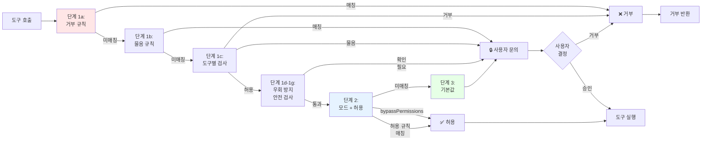
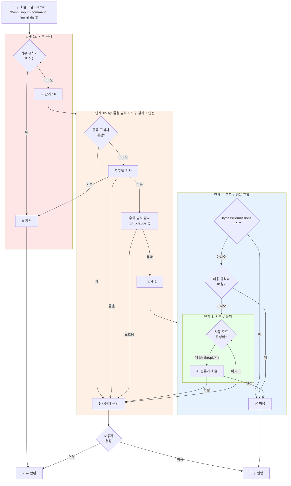
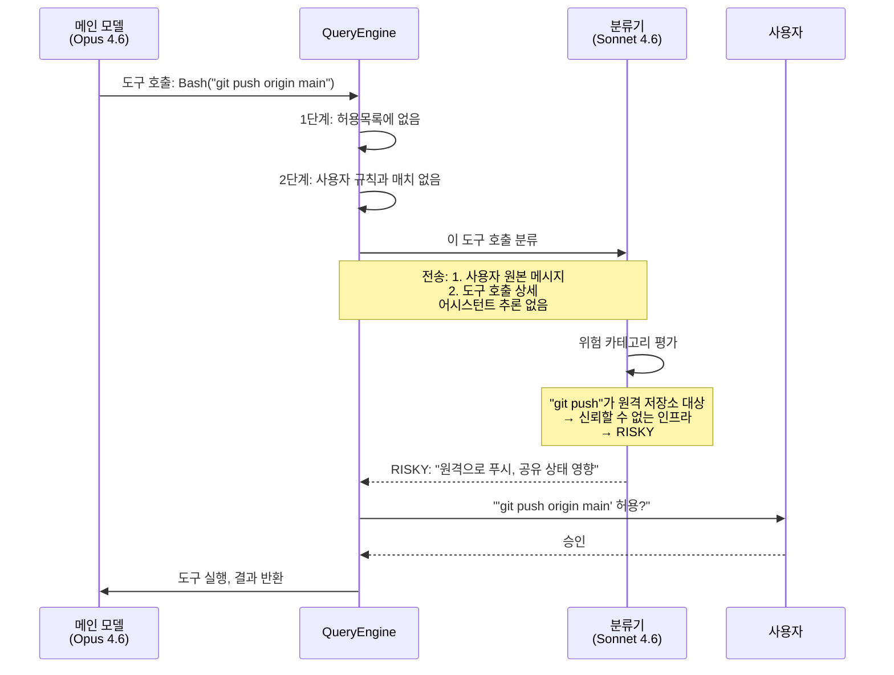
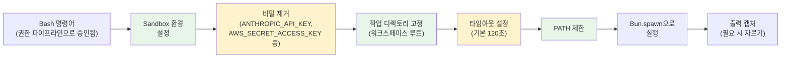

# Permission Model

Claude Code는 모든 도구 호출을 실행 전에 평가하는 **다단계 권한 파이프라인**을 구현하며, 이는 fail-closed 의미론으로 설계되었다: 거부 규칙은 즉시 차단하고, 물음 규칙은 사용자에게 에스컬레이션하고, 허용 규칙은 명시적으로 매칭할 때만 자동 승인한다. 다층 방어(defense-in-depth) 접근으로 한 단계에 취약점이 있더라도 다른 단계들이 계속 보호한다. 시스템은 또한 관대한 모드에서도 재정의될 수 없는 우회 방지 검사, 자동화된 결정이 반복적으로 실패할 때 사용자 프롬프트로 상향되는 거부 추적, MCP 서버 레벨 권한을 포함하며, 1st-party 빌드의 경우 독립적인 안전 평가자로 작동하는 선택적 AI 분류기(Sonnet 4.6)를 포함한다.

> **주의:** 아래의 상세한 권한 시스템 아키텍처는 **Bash를 주요 사례로 사용**한다. Bash는 임의의 셸 명령어를 실행할 수 있기 때문에 가장 복잡한 권한 시스템을 가진다. 일반적인 다단계 파이프라인은 모든 도구에 적용되지만, 다른 도구들(Read, Write, Edit 등)은 더 간단한 권한 모델과 더 적은 검사를 가진다. 각 도구의 문서를 참조하기 바란다.

## 일반적인 권한 파이프라인

권한 시스템은 모든 도구 호출을 일련의 단계를 통해 평가하며, 이는 핵심 원칙을 구현한다: **거부 먼저, 그 다음 물음, 그 다음 허용**. 이는 제한적 정책이 항상 관대한 정책을 이기도록 보장한다.

각 단계 순서대로:

1. **단계 1a: 거부 규칙** - 도구 호출이 거부 규칙과 매칭되면 즉시 차단된다. 추가 평가는 발생하지 않는다.

2. **단계 1b: 물음 규칙** - 도구 호출이 물음 규칙과 매칭되면 사용자에게 확인을 요청한다. 정책 레벨에서 명시적으로 설정되면 거부 규칙을 재정의할 수 있다.

3. **단계 1c: 도구별 검사** - 도구는 자신의 권한 논리를 구현한다 (예: Bash는 위험한 명령어를 검사, Edit는 파일 경로를 검증). 이 단계는 거부 또는 물음 판정을 발행할 수 있다.

4. **단계 1d-1g: 우회 방지 안전 검사** - 특정 경로(`.git/`, `.claude/` 등)와 작업은 보호된 경로로, `bypassPermissions` 모드가 활성화되어도 항상 사용자 확인이 필요하다. 이 검사는 재정의될 수 없다.

5. **단계 2: 모드 + 허용 규칙** - 전역 권한 모드가 평가된다. `bypassPermissions`가 활성화되면 도구가 허용된다. 도구 호출이 허용 규칙과 매칭되면 허용된다. 그렇지 않으면 단계 3으로 계속된다.

6. **단계 3: 기본값 폴백** - 명시적 규칙이 매칭되지 않으면 기본 동작은 사용자에게 물음을 던지는 것이다 (passthrough는 ask가 된다). 자동 모드 (1st-party 빌드만)에서는 분류기가 자동화된 결정을 하도록 호출된다.

이 다단계 설계는 **거부가 항상 허용을 이기도록** 보장하며, 관대한 규칙이 제한적 규칙을 재정의할 수 있는 권한 우회 공격을 방지한다.

## 아키텍처 (Bash 도구 권한 시스템)

## 단계 1a: 고정 허용목록 (읽기 전용 도구)

**고정 허용목록 단계**는 가장 빠른 검사다: 시스템 상태를 절대 수정할 수 없기 때문에 무조건 허용되는 **읽기 전용 도구**의 하드코딩된 집합. 이 도구들은 권한 시스템에 정의되어 있으며 다른 로직보다 먼저 검사된다.

안전한 허용목록에는 **Read**(파일 검사), **Glob**(파일 글로빙), **Grep**(텍스트 검색) 및 기타 정보 수집 작업 같은 도구들이 포함된다. 이 도구들은 파괴적인 능력이 없기 때문에 (검사, 읽기, 또는 검색만 수행) 모든 다른 권한 계층을 건넌다.

도구 호출이 도착하면, 시스템은 도구 이름이 이 허용목록에 있는지 확인한다. 매치되면 요청이 즉시 승인된다. 그렇지 않으면 요청은 **2단계**로 전달되어 사용자 설정 규칙을 확인한다.

## 단계 1b: 사용자 설정 규칙

**단계 1b**는 사용자가 보안 검토 없이 신뢰하는 도구에 대한 패턴을 정의할 수 있게 해준다. 사용자는 `~/.claude/settings.json`, `.claude/settings.json`, 또는 프로젝트 레벨 `.claude/settings.json`에서 이러한 규칙을 설정하여 반복적인 워크플로우를 자동화할 수 있다.

규칙은 세 가지 유형의 작업을 대상으로 할 수 있다:

- **전체 도구**: `Bash`를 무조건 허용 (위험; 주의해서 사용)
- **명령어 접두어**: `Bash`를 `npm test` 또는 `git status`로 시작하는 명령어일 때만 허용
- **경로 패턴**: `Write` 또는 `Edit`을 `test/**` 또는 `**/*.test.ts`와 매칭하는 파일에 대해서만 허용

시스템은 사용자의 설정된 규칙을 반복하며 현재 도구 호출이 매치하는지 확인한다. 규칙이 매치되는 경우:
1. 도구 이름이 매치되고, AND
2. 명령어 기반 규칙: 명령어가 허용된 접두어로 시작, OR
3. 경로 기반 규칙: 파일 경로가 글롭 패턴과 매치

매치가 발견되면 도구가 허용된다. 규칙이 매치되지 않으면 요청은 **3단계**(AI 분류기)로 전달된다.

이 계층은 전역적으로 권한을 하드코딩하지 않고도 세밀한 제어를 제공한다. AI 분류기보다 먼저 적용되므로 규칙이 AI 판단보다 우선된다.

### 권한 모드

도구별 규칙 이상으로, Claude Code는 전역적으로 적용되는 여러 권한 모드를 지원한다:

- **default** - 제한된 도구 접근 시 사용자에게 프롬프트 표시 (표준 동작)
- **plan** - 읽기 전용 제한이 있는 계획 모드; 쓰기 및 실행 작업은 명시적 승인 필요
- **acceptEdits** - 워크스페이스 내 파일 편집 및 쓰기 작업 자동 승인
- **bypassPermissions** - 대부분 프롬프트를 건너뛰고 도구 호출 자동 승인 (단, 우회 방지 안전 검사는 여전히 적용)
- **dontAsk** - 모든 권한 요청 거부; '물음' 동작을 '거부'로 변환
- **auto** - AI 분류기 기반 자동 결정 (Anthropic 1st-party 빌드만)

### 규칙 소스 계층

규칙은 명확한 우선순위를 가진 여러 소스에서 평가된다: 거부 규칙이 물음 규칙을 재정의하고, 물음 규칙이 허용 규칙을 재정의한다. 각 동작 내에서 더 구체적인 규칙이 일반 규칙보다 우선된다. 규칙 소스는 다음을 포함한다:

1. 세션 레벨 재정의 (최고 우선순위)
2. CLI 인자
3. 정책 설정
4. 로컬 프로젝트 설정 (프로젝트 루트의 `.claude/settings.json`)
5. 사용자 설정 (홈 디렉토리의 `.claude/settings.json`)
6. 글로벌 설정 (`~/.claude/settings.json`)

## MCP 서버 권한

MCP 도구는 동일한 3단계 파이프라인을 따르지만 추가 명명 규칙을 가진다. 각 MCP 도구는 완전 정규화된 이름으로 식별된다: `mcp__<serverName>__<toolName>`. 권한 규칙은 개별 도구 또는 전체 서버를 대상으로 할 수 있다:

- `mcp__myserver__mytool` - 특정 도구를 대상
- `mcp__myserver` - 해당 서버의 모든 도구를 차단 또는 허용

이 서버 레벨 세분성은 사용자가 각 도구에 대한 규칙을 설정할 필요 없이 전체 MCP 서버 통합을 신뢰하거나 신뢰하지 않을 수 있다는 의미다. 예를 들어, 사용자는 신뢰할 수 있는 AWS 배포 서버에서는 모든 도구를 허용하면서 실험적 통합에서는 모든 도구를 거부할 수 있다.

## 단계 2-3: 모드 기반 및 선택적 AI 분류기를 포함한 기본값 결정

도구 호출이 명시적 규칙과 매칭되지 않으면 Claude Code는 **모드 및 기본값 단계**로 진입한다. 여기서 시스템은 현재 권한 모드를 존중하고, 규칙이 매칭되지 않으면 사용자에게 물음을 던지는 것이 기본이다. 자동 모드가 활성화된 1st-party Anthropic 빌드에서는 시스템이 사용자에게 프롬프트하기 전에 **선택적 AI 분류기**를 호출하여 자동화된 결정을 내릴 수 있다.

### 분류기 모델 (자동 모드)

분류기는 메인 대화와 독립적인 **별도의 API 호출**로 Claude Sonnet 4.6으로 구성되어 있다. 자동 모드가 활성화되고 (1st-party Anthropic 빌드만) 도구 호출이 명시적 규칙 매칭 없이 단계 3에 도달할 때만 작동된다. 자체 시스템 프롬프트를 가지고 있으며 의도적으로 축소된 대화 뷰를 본다.

분류기는 다음과 같이 작동한다:

1. **사용자 메시지 추출**: 시스템은 전체 대화 히스토리를 스캔하고 `role === 'user'`인 메시지만 추출한다. 어시스턴트 메시지, 도구 결과, 메타데이터는 폐기된다.

2. **도구 결과 제거**: 각 사용자 메시지에서 텍스트 컨텐츠 블록만 유지된다. 도구 결과 블록 (사용자 메시지에도 나타나지만 메타데이터)은 필터링된다. 이는 분류기가 사용자가 명시적으로 작성한 것만 보도록 보장한다.

3. **분류기 프롬프트 구성**: 축소된 사용자 메시지는 대기 중인 도구 호출(평가 중인 액션)과 결합되어 간결한 프롬프트를 형성한다. 이 축소된 프롬프트는 전체 대화보다 훨씬 작아서 컨텍스트 윈도우 사용을 줄이고 분류기 포커스를 개선한다.

4. **분류기 API 호출**: 축소된 프롬프트와 도구 호출은 자체 시스템 프롬프트가 있는 **별도의 API 호출**로 Claude Sonnet 4.6에 전송된다. 이 분류기 모델은 메인 에이전트 대화와 독립적으로 실행된다.

5. **응답 파싱**: 분류기는 판정을 반환한다: `SAFE`(허용) 또는 `RISKY`(사용자 확인 필요). 응답에는 위험 평가를 설명하는 간단한 정당성이 포함된다.

이 분리는 중요하다: 분류기에게 메인 모델의 추론이나 컨텍스트 조작 없이 사용자의 의도와 제안된 액션만 깨끗한 뷰를 제공함으로써 메인 모델이 분류기를 "설득하여" 안전하지 않은 승인을 얻는 것을 방지한다.

### 왜 컨텍스트를 제거하는가?

축소는 핵심 보안 통찰이다:

| 분류기가 보는 것 | 제거되는 것 | 이유 |
|-----------------|-----------|------|
| 사용자 메시지 (요청된 것) | 어시스턴트 텍스트 | 메인 모델이 분류기를 승인으로 "설득"하는 것을 방지 |
| 대기 중인 도구 호출 (발생할 것) | 이전 도구 결과 | 이전 도구 결과를 통한 컨텍스트 조작 방지 |
| 도구 파라미터 | 대화 히스토리 상세 | 분류기를 특정 액션에 포커스하도록 유지 |

**사용자가 요청한 것**과 **도구가 의도하는 것**만 봄으로써, 분류기는 메인 모델의 추론이나 설득에 영향받지 않고 순수하게 액션의 장점으로만 평가한다.

### 자동 모드: 2단계 분류기 평가

자동 모드가 활성화되고 분류기가 호출되면, 도구 호출을 2단계로 평가한다:

**단계 1: 빠른 경로** - 단순하고 명확하게 안전하거나 명확하게 위험한 명령어의 경우, 분류기는 단일 모델 호출을 사용하여 빠른 결정을 내린다. 이는 일반적인 경우에 최적화되고 지연시간을 줄인다.

**단계 2: 사고 경로** - 복잡하거나 애매한 명령어의 경우, 분류기는 확장된 사고 (2개의 모델 호출)를 사용하여 엣지 케이스, 잠재적 위험, 사용자의 실제 의도에 대해 신중하게 숙고한다. 이는 추가 지연시간의 비용으로 더 견고한 안전 평가를 제공한다.

### 거부 추적 및 폴백

무한 거부 루프를 방지하기 위해 시스템은 연속적인 분류기 거부를 추적한다. 동일한 도구 호출 (또는 의미론적으로 유사한 호출)이 빠른 연속으로 여러 번 거부되면, 시스템은 사용자 프롬프트로 에스컬레이션한다. 이는 과도하게 보수적인 분류기가 사용자가 목표를 달성하는 것을 방지하는 시나리오를 방지한다.

### 자동 모드에서 위험한 규칙 제거

자동 모드에 진입할 때, 시스템은 중요한 안전 조치를 적용한다: 과도하게 광범위한 허용 규칙 (예: `Bash(*)`)은 고려 대상에서 제거된다. 이는 분류기가 도구 호출을 독립적으로 재평가하도록 강제하며, 관대한 사용자 설정이 분류기의 판단을 우회하는 것을 방지한다. 사용자의 명시적 승인은 여전히 우선되지만, 자동화된 허용 규칙은 그렇지 않다.

### 위험 카테고리

분류기는 도구 호출을 평가하는 몇 가지 위험 카테고리를 검사한다. 보안 분류기는 다음 항목을 체크한다:

- **범위 확대(SCOPE ESCALATION)**: 도구 호출이 사용자가 실제로 요청한 것을 초과하는가? (예: 사용자가 버그 수정을 요청했지만 모델이 전체 코드베이스를 리팩토링하려는 경우)
- **신뢰할 수 없는 인프라(UNTRUSTED INFRASTRUCTURE)**: 도구 호출이 외부 또는 공유 시스템을 대상으로 하는가? (예: 원격 저장소에 푸시, 외부 API에 HTTP 요청, CI/CD 수정)
- **기타 위험**: rm -rf, DROP TABLE 같은 파괴적 명령, .env 파일 노출, API 키 인쇄, 시스템 설정 수정 같은 일반적 보안 우려

분류기는 판정을 반환한다: `SAFE`(허용) 또는 `RISKY`(사용자 확인 필요)

### 분류기 결정 흐름

## GrowthBook을 통한 원격 설정

분류기의 동작은 GrowthBook 피처 플래그 (`tengu_` 접두사 사용)를 통해 조정 가능하다. 이 원격 제어 메커니즘은 Anthropic이 다음을 할 수 있게 한다:
- **분류기 민감도 조정** (새로운 공격 벡터 발견 또는 거짓 양성 비율 증가 시)
- **긴급 상황에서 분류기 비활성화** (모든 도구 호출은 사용자 프롬프트로 기본값)
- **새로운 위험 카테고리 추가** (새 바이너리 푸시 없이)
- **거부 추적 시스템의 평가 임계값 수정**

이 원격 제어는 보안에 중요하다: 사용자가 설치를 업그레이드하지 않고도 신흥 위협에 빠르게 대응할 수 있게 한다.

### 분류기 가용성

보안 분류기는 **Anthropic 1st-party 빌드에서만 활성화된다**. non-Anthropic 빌드(3rd-party 통합, 커스텀 배포)에서는 분류기가 `{ matches: false }`를 반환하고 분류를 수행하지 않는다. 이는 다음을 의미한다:

- 3단계는 사실상 3rd-party 빌드에서 무동작
- 권한 결정은 1단계와 2단계만 기본값
- 1-2단계와 매치되지 않는 도구 호출은 사용자의 수동 승인을 위해 전달

## Bash별 추가 보안 검사

일반적인 다단계 권한 파이프라인 외에도 Bash 명령어는 셸 명령어 안전에 특화된 추가 검증 검사를 거친다:

### 안전한 래퍼 제거

안전한 래퍼 프로그램 접두어가 있는 명령어는 권한 매칭 전에 정규화된다. 시스템은 다음 래퍼를 제거한다:

- `timeout`: 모든 GNU 긴 플래그 (--foreground, --preserve-status, --kill-after, --signal 등) 및 짧은 플래그 (-v, -k, -s)
- `time`: 시간 측정 유틸리티
- `nice`: 우선순위 조정 (`-n N` 및 `-N` 변형 지원)
- `nohup`: 행업 신호 면역
- `stdbuf`: 스트림 버퍼링 제어

추가로, 명령어 시작 환경 변수 할당(예: `NODE_ENV=production npm test`)은 안전한 변수 이름을 사용할 경우 제거된다:

- 안전한 변수: `NODE_ENV`, `RUST_LOG`, `DEBUG`, `PATH` 등 보안에 영향을 주지 않는 것들
- 값은 영숫자와 안전한 구두점만 포함해야 함 (명령어 치환, 변수 확장, 연산자 없음)

**예시:** `timeout 30 npm test` 명령어는 권한 매칭을 위해 `npm test`로 제거된다. `Bash(npm:*)` 거부 규칙이 있으면 래퍼가 이를 우회할 수 없다. 마찬가지로 `NODE_ENV=production npm test`는 매칭을 위해 `npm test`로 제거된다.

### 출력 리다이렉션 검증

Bash 명령어는 `>`, `>>` 등 연산자를 사용하여 파일로 출력을 리다이렉션할 수 있다. 이 리다이렉션은 명령어와 별도로 검증된다:

- 시스템 파일로의 출력 리다이렉션(예: `> /etc/passwd`)은 거부
- 워크스페이스 디렉토리 외부로의 리다이렉션은 승인용으로 표시
- 복합 리다이렉션(예: `command > file1 > file2`)은 개별적으로 분석

이는 `cat /etc/shadow > /etc/passwd` 같은 공격을 방지한다. `cat`이 허용되더라도 리다이렉션 대상이 독립적으로 검사된다.

### 복합 명령어 보안

단일 Bash 호출에 여러 명령어(`;`, `&&`, `||`, 파이프, 또는 줄바꿈으로 구분)가 포함될 때 각 서브명령어는 개별적으로 검사된다:

- 한 호출에서 여러 `cd` 명령어는 차단 (명확성을 위해 사용자 승인 필요)
- `cd` + `git` 결합 복합 명령어는 bare repository RCE 공격 방지를 위해 차단
  - 예시: `cd /malicious/dir && git status`. 악의적 디렉토리는 `core.fsmonitor`를 명령어로 설정한 bare git 저장소를 포함할 수 있음
- 각 서브명령어의 출력 리다이렉션 검증
- 거부 규칙은 첫 번째가 아닌 각 서브명령어에 적용

### Bash 시맨틱 검사

권한 시스템은 악의적 명령어를 숨길 수 있는 bash 문법 패턴을 검증한다:

- 명령어 치환 패턴 (`$(...)`, 백틱)은 위험한 구성을 포함할 경우 표시
- `eval` 및 `source` 명령어는 강화된 조사 대상
- 백슬래시 이스케이프 연산자(예: `rm\ -rf`)는 매칭을 위해 실제 형태로 정규화

## Bash Sandbox 상세

**Bash 도구**는 다단계 권한 파이프라인 위에 적층되는 추가 런타임 보호를 가진다. Bash 명령어가 승인된 후에도 Sandbox는 격리를 강화하여 우발적이거나 악의적인 탈출을 방지한다.

Bash 명령어가 실행될 때, 샌드박스는 여러 보호를 적용한다:

1. **작업 디렉토리 격리**: 프로세스는 작업 디렉토리가 워크스페이스 루트에 고정되어 실행된다. CWD는 여러 Bash 호출에 걸쳐 유지되어 명령어를 연결할 수 있지만, 셸 상태 (변수, 별칭)는 별도의 도구 호출 간에 유지되지 않는다.

2. **환경 변수 제거**: 서브프로세스는 민감한 변수가 제거된 정리된 환경을 수신한다: `ANTHROPIC_API_KEY`, `AWS_SECRET_ACCESS_KEY`, `GITHUB_TOKEN` 및 기타 자격증명은 스폰된 프로세스에 상속되지 않아 환경 검사를 통한 우발적인 누수를 방지한다.

3. **타임아웃 강제**: 모든 Bash 명령어는 런타임에 의해 강제된 타임아웃를 가진다. 기본값은 120초이며 최대 설정 가능한 한도는 600초다. 타임아웃을 초과하는 명령어는 강제로 종료된다.

4. **PATH 제한**: `PATH` 환경 변수는 안전한 시스템 위치로 제한되어 서브프로세스가 찾고 실행할 수 있는 실행 파일을 제한한다.

5. **출력 자르기**: Bash 출력이 토큰 예산을 초과하면 컨텍스트 윈도우 오버플로우를 방지하기 위해 잘린다.

이 보호는 권한 파이프라인과 함께 작동한다: 다단계 권한 모델이 명령어를 **실행할지 말지**를 결정하는 반면, 샌드박스는 **얼마나 안전하게** 실행할지를 강제한다.

### 샌드박스 실행 흐름

