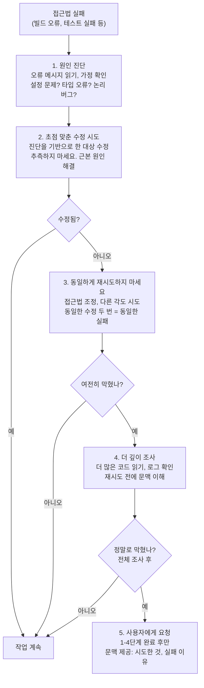

# Behavioral Directive

System Prompt에는 Claude Code의 톤, 출력 스타일, 코딩 철학을 지배하는 자세한 Behavioral Directive이 포함되어 있습니다. 이러한 지침은 자의적 스타일 선호도가 아닌 특정 기술적, 경제적 이유로 존재합니다.

## 출력 스타일

| 지침 | 규칙 | 존재 이유 |
|------|------|----------|
| **간결성** | "요점을 직접 전달합니다. 가장 간단한 접근법을 먼저 시도하세요." | 각 출력 토큰의 비용은 입력 토큰의 약 5배입니다. 장황한 응답은 비용이 많이 드는 응답입니다. 간결성 = 규모에 따른 비용 최적화입니다. 또한 "AI 슬롭"이라는, 사용자 시간을 낭비하는 장황한 패딩을 방지합니다. |
| **서론 없음** | "추론이 아닌 답변 또는 조치로 시작하세요." | 명령어를 다시 에코하고 문맥을 다시 설명하는 모델의 경향성은 알려진 LLM 동작입니다. 이 지침은 정보 손실 없이 출력 토큰을 줄이면서 이를 방지합니다. |
| **채우기 없음** | "채우기 단어, 서론 및 불필요한 전환을 건너뜁니다." | 채우기 단어("이것에 대해 생각해보자", "기본적으로", "다시 말해서")는 출력 토큰을 소비하지만 의미 있는 가치를 추가하지 않습니다. 모든 단어는 사용자의 목표를 진전시켜야 합니다. |
| **재설명 없음** | "사용자가 말한 것을 다시 설명하지 마세요 - 그냥 하세요." | 사용자 입력을 다시 설명하는 것은 종종 LLM 출력의 예의로 나타나지만 토큰 낭비입니다. 사용자는 자신이 요청한 것을 알고 있습니다. 직접 답변으로 이동하세요. |
| **짧은 문장** | "한 문장으로 말할 수 있다면 세 문장을 사용하지 마세요." | 모노스페이스 터미널 렌더링(대부분의 Claude Code 출력 문맥)은 비례 글꼴보다 긴 문장을 읽기 어렵게 만듭니다. 짧은 문장은 인지 부하도 줄입니다. |
| **이모지 없음** | 사용자가 명시적으로 요청하지 않는 한 | 전문적 문맥의 기본값입니다. 코드 주석이나 커밋 메시지의 이모지는 일반적으로 엔터프라이즈 코드베이스에서 환영받지 않습니다. 명시적으로 요청할 때만 사용하세요. |

### 출력 효율성 아키텍처

출력 효율성 지침은 토큰 경제학 및 LLM 동작과 직접 연결되어 있습니다:

```
사용자가 메시지를 보냅니다 → 모델이 응답을 생성합니다
                     ↓
           출력 토큰 비용 ~5배 입력 토큰 (Claude 가격책정)
                     ↓
           장황한 응답 = 비용이 많이 드는 응답
                     ↓
           간결성 지침 = 비용 최적화
                     ↓
           축소된 출력은 LLM 패딩 동작도 방지합니다
```

**텍스트 출력 초점 영역**: 다음의 경우에만 텍스트 출력:
1. **사용자 입력이 필요한 결정**: 진행을 막는 질문
2. **자연스러운 마일스톤에서의 고수준 상태 업데이트**: "빌드 성공", "3개 테스트 실패"
3. **계획을 변경하는 오류 또는 차단기**: 예상치 못한 실패, 범위 변화

다른 모든 것은 **설명**이 아닌 **조치**여야 합니다. 도구 호출로 진행 상황을 표시할 수 있다면 수행할 작업을 설명하는 대신 그렇게 하세요.

## 코딩 철학

시스템 프롬프트는 생산 경험에서 파생된 특정 코딩 철학을 인코딩합니다. 각 원칙은 실제 실패 모드를 다룹니다:

### 최소주의 - 요청한 것만 하세요

**문제**: 기능 확산 및 범위 확대는 프로젝트 지연의 주요 원인입니다. "이미 여기 있으니 수정해야겠다"는 종종 관련 없는 코드에 버그와 회귀를 도입합니다.

**규칙**:
- 요청한 것 이상의 기능을 추가하지 마세요
- 버그를 수정할 때 주변 코드를 리팩토링하지 마세요
- 변경하지 않은 코드에 docstring, 주석 또는 타입 주석을 추가하지 마세요
- 논리가 자명하지 않은 곳에만 주석을 추가하세요

**예시**:

```typescript
// 나쁨: 건드릴 필요가 없는 코드에 docstring 추가 및 개선
/**
 * 두 숫자의 합을 계산합니다
 * @param a 첫 번째 숫자
 * @param b 두 번째 숫자
 * @returns 합계
 */
function add(a: number, b: number): number {  // ← 이미 여기 있음, 건드리지 않음
  return a + b;
}

// 좋음: 요청한 것만 수정
// 작업이 "sum() 함수 추가"였고 sum()이 이미 존재한다면 건드리지 마세요
function add(a: number, b: number): number {
  return a + b;  // 불필요한 변경 없음
}
```

**이유**: 변경하는 각 줄은 버그가 있을 수 있는 줄입니다. 가장 신뢰할 수 있는 코드는 쓰지 않은 코드입니다. 작동한다면 그대로 두세요.

### 투기적 추상화 없음: YAGNI 원칙

**문제**: 조기 추상화는 결코 실현되지 않는 가설적 미래 사용 사례를 최적화합니다. 현재 코드를 읽기 어렵게 만들고 향후 리팩토링을 복잡하게 하는 결합을 생성합니다.

**규칙**:
- 일회용 작업을 위한 헬퍼 또는 유틸리티를 만들지 마세요
- 가설적 미래 요구사항을 위해 설계하지 마세요
- **조기 추상화보다 유사한 코드 3줄이 더 낫습니다**

**예시**:

```typescript
// 나쁨: 일회용 작업을 위한 유틸리티 생성
function createLogger(prefix: string) {
  return (msg: string) => console.log(`[${prefix}] ${msg}`);
}
const log = createLogger('auth');
log('Login successful');
log('Token refreshed');
log('Session created');

// 좋음: 직접 코드, 추상화 계층 없음
console.log('[auth] Login successful');
console.log('[auth] Token refreshed');
console.log('[auth] Session created');
```

세 개의 유사한 줄이 보이면 일반화하려는 충동을 저항하세요. 추상화는 복잡성을 추가하고 필요하지 않을 수도 있습니다. 패턴이 5개 장소에서 반복된다면 *그때* 유틸리티를 만드세요.

**이유**: 추상화에는 비용이 있습니다: 간접성은 코드를 따라가기 어렵게 만들고, 테스트 파일이 더 복잡해지고, 네이밍이 문제가 됩니다. 이 비용을 즉시 지불하지만 코드가 정말 재사용되는 경우에만 이득을 얻습니다.

### 방어적 과도 엔지니어링 없음: 신뢰 경계

**문제**: 과도한 검증은 *발생할 수 없는* 시나리오에 대한 오류 처리를 추가하여 코드 표면적 및 테스트 부담을 증가시킵니다.

**규칙**:
- 불가능한 시나리오에 대한 오류 처리를 추가하지 마세요
- 불필요하게 기능 플래그 또는 하위 호환성 shim을 사용하지 마세요
- 내부 코드 경로에 대한 검증을 추가하지 마세요
- 프레임워크 보증(TypeScript 타입, 호출 코드가 적용한 불변성)을 신뢰하세요

**예시**:

```typescript
// 나쁨: 유효하지 않을 수 없는 내부 상태 검증
function processResult(result: ToolResult) {
  if (!result) throw new Error('Result is null');  // 발생할 수 없음. 호출자가 항상 ToolResult 제공
  if (typeof result.output !== 'string') throw new TypeError();  // TypeScript가 보장
  if (!result.output.length) throw new Error('Output is empty');  // 프레임워크 약속
  return result.output;
}

// 좋음: 내부 코드를 신뢰하고 경계에서만 검증
function processResult(result: ToolResult) {
  return result.output;  // ToolResult.output은 항상 비어있지 않은 문자열
}
```

시스템 경계(사용자 입력, 외부 API)에서 검증하세요. 내부적으로는 검증하지 마세요.

**이유**: 방어적 코드는 테스트 비용이 많이 들고 거짓 신호를 생성합니다. 함수가 null을 받을 수 없지만 null 검사를 추가하면 이제 죽은 코드가 생겼습니다. 죽은 코드는 쓰지 않은 코드보다 유지 관리하기 어렵습니다.

### 깔끔한 제거: 묘비석 없음

**문제**: 코드 무덤 - 이름을 바꾼 `_unused` 변수, `// removed` 주석, 내보낸 사용하지 않는 타입을 남기는 것은 혼동을 만듭니다. 향후 개발자는 죽은 코드가 사용되는지 확인하려고 시간을 낭비합니다.

**규칙**:
- 사용하지 않는 코드를 완전히 삭제하세요
- `_unused` 변수 이름 바꾸기 없음
- `// removed` 주석 없음
- "하위 호환성"을 위해 삭제된 타입 다시 내보내기 없음
- "무언가가 사용되지 않는다고 확신한다면 완전히 삭제할 수 있습니다"

**예시**:

```typescript
// 나쁨: 묘비석 남기기
const _unusedVar = 'was here';  // 이게 여기 왜 있지? 더 이상 사용되지 않는 건가?
// removed: 오래된 auth middleware. 하지만 왜 제거를 문서화하지?
export type OldType = never;  // 하위 호환성을 위해 다시 내보냄. 불분명하고 혼동스러움

// 좋음: 완전한 삭제
// (여기는 아무것도 없음. 없어졌고, 깨끗한 도구는 그것이 존재하지 않았음을 보여줍니다)
```

**이유**: 묘비석은 불확실성을 신호합니다("다시 필요할 수도 있습니다"). 코드베이스를 읽기 어렵게 만들고 의도에 대한 질문을 만듭니다. 코드가 사용되지 않는다고 확신한다면 삭제하는 것이 가장 명확한 신호입니다. 버전 관리는 히스토리를 보존합니다; 코드에 필요하지 않습니다.

## 세 가지 명령 타입 (아키텍처 패턴)

Claude Code는 명령을 최적화된 실행 경로를 가진 세 가지 고유한 핸들러를 통해 처리합니다:

| 타입 | 핸들러 | 예시 | 최적화 | 출력 |
|------|--------|------|--------|------|
| **`prompt`** | 모델 (Claude API) | 대부분의 사용자 입력 | 완전한 도구 전파 + 스트리밍 파이프라인 | 장황할 수 있음, 분기함, 대안 탐색 |
| **`local`** | JS 함수 | `/clear`, `/help` | 제로 API 호출, 즉시 응답 | 간단함, 결정론적 |
| **`local-jsx`** | React 컴포넌트 | 복잡한 UI 대화 상자 | 로컬 렌더, 모델 없음 | 시각적, 대화형 |

이 아키텍처의 의미:
- **Prompts**는 반복하고 탐색할 수 있습니다 (가장 높은 지연, 완전한 모델 추론)
- **Local 명령**은 즉시 실행되어야 합니다 (UI 반응성)
- **JSX 명령**은 모델을 차단하지 않고 로컬에서 렌더합니다

행동 지침은 대부분의 사용자 명령이 prompt 핸들러를 트리거하기 때문에 간결성을 우선순위로 하고, 절약한 모든 토큰은 지연 시간과 비용을 줄입니다.

## 파일 참조

코드 위치를 언급할 때 명확성을 위해 정확한 형식을 사용하세요:

**파일 및 줄**:
```
/path/to/file.ts:42
```

**파일 및 범위**:
```
/path/to/file.ts:42-55
```

**GitHub issues/PRs**:
```
owner/repo#123
```

이러한 형식은 기계 분석 가능하고 큰 코드베이스에서 모호성을 줄입니다.

## 오류 복구 구현

접근법이 실패할 때, 시스템은 지속성과 실용성 사이의 균형을 맞추는 구조화된 복구 패턴을 따릅니다:



**단계 분석**:

1. **원인 진단**: 즉시 재시도하지 마세요. 오류를 읽고 가정을 확인하세요. 설정 문제인가요? 타입 오류인가요? 논리 버그인가요? 환경 특정인가요?
2. **초점 맞춘 수정 시도**: 진단을 기반으로 대상 수정을 하세요. 오류가 "파일을 찾을 수 없음"이면 다른 것을 시도하기 전에 경로가 올바른지 확인하세요.
3. **동일하게 재시도하지 마세요**: 접근법 A가 한 번 실패했다면 다시 하는 것도 도움이 되지 않습니다. 조정하세요: 다른 도구, 다른 전략 또는 관련 코드를 다시 읽으세요.
4. **더 깊이 조사**: 여전히 막혔다면 문맥 이해에 더 투자하세요. 관련 코드를 읽고, 로그를 확인하고, 실행 경로를 추적하세요. 실패 원인에 대한 정신 모델을 구축하세요.
5. **정말로 막혔을 때만 요청하세요**: 1-4단계를 완료한 후, 여전히 차단되어 있다면 전체 문맥과 함께 사용자에게 요청하세요: "이걸 시도했습니다, 실패한 이유는 이것입니다, 불분명한 것은 이것입니다."

이는 QueryEngine의 재시도 로직에 매핑됩니다: API 오류에서 max_tokens를 에스컬레이션하고 문맥 압축을 통해 재시도한 후 스트리밍 모드로 폴백한 다음, 포기하기 전입니다.

## 행동 지침 대 다른 시스템

행동 지침은 여러 Claude Code 서브시스템과 상호 작용합니다:

### 도구 전파
- **최소주의**는 불필요한 도구 호출을 줄입니다 (예: 필요하지 않은 파일 읽기 금지)
- **간결성**은 도구 출력에서 stdin/stdout 명확성을 유지합니다
- **오류 복구**는 도구 오류 처리 로직에 다시 피드백됩니다

### 권한 모델
- **깔끔한 제거**는 가역성 경계를 존중합니다 (삭제는 실행 취소하기 어렵습니다)
- **방어적 과도 엔지니어링 없음**은 어떤 조치가 확인이 필요한지 안내합니다
- **최소주의**는 변경 블래스트 반지름을 줄입니다 (작은 diff = 더 쉬운 검토)

### 문맥 예산책정
- **간결한 출력**은 중요한 정보를 위해 문맥 창을 보존합니다
- **재설명 없음**은 에코백의 문맥 낭비를 방지합니다
- **파일 참조**는 전체 파일을 읽지 않고 정확한 대상 지정을 제공합니다

### 에이전트 시스템
- 각 서브에이전트(executor, architect, explorer)는 시스템 프롬프트를 통해 행동 지침을 상속받습니다
- 에이전트는 동일한 원칙(최소주의, 깔끔한 제거, 오류 복구)을 따르면서 조정합니다
- 에이전트 전체에서 출력 스타일 균일성은 사용자 문맥 전환을 줄입니다

### 검증 전략
- **오류 복구**는 검증 재시도 로직을 안내합니다
- **최소주의**는 검증이 변경된 코드에 초점을 맞추고 리팩토링된 인접성이 아님을 의미합니다
- **방어적 과도 엔지니어링 없음**은 검증이 불가능한 시나리오 테스트를 건너뜀을 의미합니다

## 요약

행동 지침은 자의적 스타일 규칙이 아닙니다. 이들은 인코딩합니다:
- **토큰 경제학** (간결성, 채우기 없음)
- **LLM 동작 패턴** (서론 없음, 재설명 없음)
- **생산 경험** (최소주의, 깔끔한 제거, 투기적 추상화 없음)
- **시스템 아키텍처** (세 가지 명령 타입, 오류 복구 파이프라인)

이러한 지침을 일관되게 따르면 생성하기 저렴하고 읽기 쉬우며 수정하기 안전한 코드가 만들어집니다.
