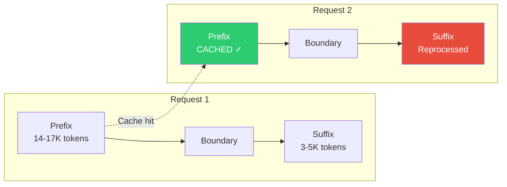

# Prompt Caching

Prompt Caching은 Claude Code의 가장 중요한 아키텍처 설계 결정 중 하나입니다. System Prompt는 **경계 마커**에서 캐시 가능한 prefix와 세션별 suffix로 분할되며, 이러한 결정이 코드베이스 구조의 대부분을 주도합니다.

## 작동 원리



### Prefix 
- Identity block
- Tool definitions (14-17K tokens)
- Safety rules
- Task execution instructions
- Git protocols
- Tone and style guidelines

### Suffix 
- MCP tool schemas 
- Hook configurations
- Repository-specific context
- System reminders
- Session metadata

## 중요한 이유

Caching이 없으면 모든 API 요청은 ~20-25K개의 System Prompt 토큰을 재처리해야 합니다. Caching을 사용하면:

| 메트릭 | 캐시 없음 | 캐시 사용 |
|--------|--------------|------------|
| 요청당 처리된 토큰 | ~20-25K | ~3-5K (suffix만) |
| 지연 시간 | 더 높음 | 더 낮음 |
| 비용 | 모든 토큰에 대한 정가 | 캐시된 토큰은 할인된 요금 |

Claude API는 Cache된 프롬프트 토큰을 **90% 할인**으로 제공하여 성능과 비용 모두에 중요한 최적화입니다.

## Cache Stability Mechanism

가장 미묘하지만 중요한 최적화는 **tool definition 순서**입니다. Cache된 토큰의 14-17K를 구성하는 tool schemas는 모든 요청에서 일관되게 정렬되어야 합니다.

### 도구 순서가 중요한 이유

Anthropic API Prompt Caching 메커니즘은 **content hashing**을 사용하여 Cache 히트를 검증합니다. 항목 순서를 포함한 단 한 글자의 차이도 전체 Cache된 접두사를 무효화하고 완전한 재처리를 강제합니다.

이 시나리오를 고려하세요:
- Request 1은 도구를 알파벳 순서로 제시합니다: `[Agent, Bash, Edit, Grep, Read, Write]`
- 캐시 키 해시가 계산되고 저장됩니다
- Request 2는 다른 순서로 도구를 제시합니다: `[Read, Write, Bash, Edit, Agent, Grep]`
- Cache 키 해시가 다릅니다 → Cache 미스 → 전체 14-17K 토큰 접두사 재처리
- 결과: 60% 지연 시간 페널티 + 비용 회귀

### 구현: Stable Sort

도구 스키마는 **이름순으로 알파벳순 정렬**되어 유니코드 인식 문자열 비교를 사용합니다. 이는 도구가 내부적으로 어떻게 등록되거나 메모리에 저장되는 순서와 관계없이 순서가 결정적임을 보장합니다.

도구 어셈블리 프로세스는 다음 순서를 따릅니다:
1. 시스템 레지스트리에서 모든 도구 검색
2. 지연 도구 필터링 (필요할 때 로드됨)
3. 시스템 간 일관성을 위해 로케일 인식 비교를 사용하여 도구 이름으로 정렬
4. 각 도구를 이름, 설명, 매개변수 및 사용자 정의 필드를 포함한 스키마 표현으로 변환

이 알파벳순 정렬은 중요합니다. Anthropic API의 Prompt Caching 메커니즘은 콘텐츠 해시로 전체 Cache된 prefix를 검증하기 때문입니다. 두 요청이 같은 도구를 다른 순서로 제시하면 해시가 달라지고 Cache 미스가 발생하여 전체 14-17K 토큰 prefix의 전체 재처리를 강제합니다. 항상 알파벳순으로 정렬함으로써 시스템은 도구 등록 순서, 내부 컬렉션 반복 순서, 또는 기타 런타임 변동과 관계없이 Cache 키가 변함없음을 보장합니다.


## 12개의 Cache-Break 감지 Vectors

소스 코드는 **12개의 Cache-Break 감지 Vectors**: Cache된 접두사를 무효화하고 완전한 재처리를 강제할 수 있는 특정 상태 변화를 추적합니다:

::: warning
Cache-Break는 전체 접두사를 재처리해야 하므로 비용과 지연 시간 이점을 모두 잃게 됩니다. 아키텍처는 이러한 이벤트를 최소화하고 조기에 감지하도록 신중하게 설계되었습니다.
:::

### 완전한 Vector 목록

| Vector | 카테고리 | 영향 | 감지 |
|--------|----------|--------|-----------|
| 1. Tool 정의 변경 | Schema | 높음, tools는 접두사의 70% | 도구별 스키마 해싱; 변경된 특정 도구 식별 (내부 분석에 따라 도구 break의 77% 포함) |
| 2. 피처 플래그 변경 | Runtime | 중간. instructions에 영향 | GrowthBook 접두사 영향 플래그 (`tengu_*` 접두사); flag evaluation drift |
| 3. 모델 버전 전환 | API | 높음. instruction tone이 다름 | Config 또는 `.claude/settings.json` model override에서 모델 ID 비교 |
| 4. Cache control 범위/TTL 변경 | Infrastructure | 중간. cache lifetime에 영향 | `cache_control` 해시 비교; 범위 플립(global↔org)과 TTL 플립(1h↔5m) 감지 |
| 5. Global cache strategy 변경 | Infrastructure | 중간. 접두사 caching에 영향 | Strategy 값 비교 (`'tool_based'`, `'system_prompt'`, or `'none'`) |
| 6. Beta header 변경 | Runtime | 중간. API 동작에 영향 | 정렬된 beta header 목록 비교; 추가/제거 감지 |
| 7. Auto mode 상태 변경 | Runtime | 낮음. sticky-on latched | Auto mode 활성화 토글; 안정성을 위해 세션별로 sticky-on latched |
| 8. Overage 크레딧 상태 변경 | Runtime | 낮음. TTL latched | Overage 적격성 토글; 1시간 TTL 적격성이 세션별로 latched |
| 9. Cached microcompact 상태 | Caching | 낮음. cache-editing beta | Cached microcompact beta header 존재 여부; sticky-on latched |
| 10. System prompt 텍스트 변경 | Versioning | 높음. 전체 접두사 영향 | System prompt 해시 비교; 콘텐츠 변경 감지 |
| 11. Effort 값 변경 | Runtime | 낮음. output config에 영향 | Effort 값 (env → options → model default) 비교; `output_config`에 저장됨 |
| 12. 추가 body 매개변수 변경 | Runtime | 낮음. request body에 영향 | `getExtraBodyParams()` 출력의 해시; `CLAUDE_CODE_EXTRA_BODY` 변경 감지 |

### 감지 파이프라인: 3단계 시스템

**Phase 1 (pre-call)**: API 요청 전에 현재 system prompt, tool schemas, runtime state를 기록합니다.

**Phase 2 (post-call)**: API 응답의 cache metrics (cache_read_input_tokens vs. 이전 요청)을 비교하여 cache break가 실제로 발생했는지 감지합니다.

**감지 로직**: 클라이언트 측 플래그 (PendingChanges)와 API 레벨 비교를 결합합니다. Cache break는 다음 조건에서 확인됩니다:
- Cache read 토큰이 이전 요청에서 5% 이상 감소, AND
- 절대 감소량이 `MIN_CACHE_MISS_TOKENS = 2,000` 토큰을 초과

### Cache-Break 감지 세부사항

- **이중 TTL 시스템**: 기본 5분 TTL + 선택적 1시간 TTL. 1시간 적격성은 안정성을 위해 GrowthBook allowlist를 통해 세션별로 latched되어 있습니다 (중간 세션 TTL 플립이 오경고를 트리거하는 것을 방지).
- **도구별 스키마 해싱**: 개별 도구 해시를 추적하여 변경된 특정 도구 정의를 식별하고, 내부 분석에 따라 도구 break의 77%를 포함합니다.
- **Cache 삭제 대기 상태**: `cacheDeletionsPending` 플래그는 microcompact의 cache_edits가 cache가 합법적으로 정리될 때 오경고를 트리거하지 않도록 방지합니다.
- **Haiku 모델 제외**: Haiku 모델은 cache break 감지에서 제외됩니다 (다른 caching 동작).
- **최소 cache miss 임계값**: 2,000 토큰 이하의 변동은 경고를 트리거하지 않습니다 (일반적인 변동).

### Cache Break가 감지되면 발생하는 작업

1. **이벤트 로깅**: 감지된 vector(s), 이전/새 값, 토큰 감소 메트릭 포함
2. **분석에 기록** (BQ: tengu_prompt_cache_break event) 모니터링 및 최적화용
3. **캐시된 prefix 지우기**: 해당 세션의 캐시된 키가 무효화됨
4. **다음 요청에서**: 전체 14-17K 토큰 prefix가 재처리되고 새로운 캐시 키가 설정됨
5. **기준선 상태 업데이트**: 새로운 상태는 향후 비교를 위한 참조가 됨

이를 통해 기능 변경 (예: GrowthBook 플래그 토글)이 즉시 적용되며, 한 요청 사이클 내에 효율적인 캐시를 유지할 수 있습니다.


## Streaming-First 설계 관계

prompt caching 아키텍처는 Claude Code의 streaming 실행 모델과 깊이 상호작용합니다. 이 관계는 인지된 지연 시간과 도구 실행 속도에 상당한 영향을 미칩니다.

### StreamingToolExecutor 작동 방식

Streaming 실행 모델은 응답 생성을 도구 실행에서 분리합니다. API가 응답을 스트리밍할 때 시스템은 토큰 스트림을 증분식으로 파싱합니다. `content_block_delta` 이벤트마다 실행기는 도구 호출이 있는지 확인합니다 (`input_json_delta` 블록으로 인코딩됨). 도구 호출은 응답이 완료되기를 기다리지 않고 즉시 수집 및 파싱되고 실행기에 전달되어 도구가 즉시 실행되기 시작합니다.

**Streaming 흐름**:
1. API 스트림은 캐시된 시스템 프롬프트로 열립니다 (처리 비용 건너뜀)
2. 모델은 텍스트 및 도구 호출 생성을 시작하고 실시간으로 토큰을 스트리밍합니다
3. 각 `content_block_delta` 이벤트에 대해 실행기는 도구 호출 JSON 조각인지 확인합니다
4. 도구 JSON 조각은 완성되는 즉시 누적되고 파싱됩니다
5. 완성된 도구 호출은 실행기에 전달되어 즉시 도구 실행을 시작합니다
6. 도구 결과는 수집되며 응답이 여전히 스트리밍되는 동안 모델에 반환될 수 있습니다
7. "head-of-line blocking" 없음. 시스템이 도구를 실행하기 전에 응답이 완료될 때까지 기다리지 않습니다

이는 **병렬 처리**를 만들어 도구 실행이 모델 생성과 겹칩니다. 도구 호출이 종종 비싸기 때문 (Bash, Read, Grep) 응답 스트림과 동시에 실행하면 대부분의 도구 지연 시간을 숨깁니다.


### 결합된 효과: 지연 시간 감소

캐싱 + streaming 조합은 상당한 지연 시간 개선을 생성합니다:

```
기존 방식 (캐시 없음, streaming 없음):
  Request → Process 20K token prefix → Generate response → Execute tool → Return result
  Latency: T_prefix + T_generate + T_tool

Cached + Streamed:
  Request → Prefix cached, skip → Generate response (streaming) → Execute tool mid-stream → Return result
  Latency: ~90% reduction on T_prefix, T_tool parallelized with T_generate
```

**정량화된 개선**:
- 14-17K 캐시된 토큰 정상 처리: ~200-300ms
- Cache hit: ~0ms (캐시된 토큰은 처리 우회)
- Streaming을 포함한 첫 번째 토큰 지연 시간: ~0.5-1.0s (사용자는 즉시 출력을 봅니다)
- 도구 실행 병렬화: 모델이 여전히 응답을 스트리밍하는 동안 시작됩니다

결과: **사용자는 모델이 여전히 응답을 스트리밍하고 있는 상태에서도 도구가 거의 즉시 실행되는 것으로 인지합니다**.

## GrowthBook Cache 전략

Claude Code는 **GrowthBook feature flags**를 사용하여 코드 재배포 없이 런타임에 기능을 활성화/비활성화하고 동작을 조정합니다. 이는 잠재적 cache-break vector를 생성하지만 시스템이 신중하게 관리합니다.

### Flag 평가 및 Prefix 영향

GrowthBook 플래그는 세션 시작 시 GrowthBook 대시보드의 최신 구성을 가져와서 평가됩니다. 시스템은 플래그를 캐시된 prefix에 미치는 영향에 따라 두 가지 범주로 분할합니다:

**Prefix 영향 플래그** (캐시된 프롬프트에 구워짐):
- 지시사항 생성을 제어하는 플래그 (예: `tengu_enable_agent_system`, `tengu_enable_plan_mode`)
- 안전 규칙 활성화/비활성화 플래그 (예: `tengu_enable_safety_audit`, `tengu_strict_output_rules`)
- 값이 시스템 프롬프트 텍스트 또는 지시사항 블록에 영향을 미치는 모든 플래그
- GrowthBook 대시보드에서 변경하면 다음 API 호출에서 cache break를 트리거합니다

**Suffix 영향 플래그** (매 요청마다 재처리):
- 텔레메트리 및 로깅을 제어하는 플래그 (예: `tengu_log_tool_metrics`, `tengu_enable_telemetry`)
- UI 동작에 영향을 미치지만 프롬프트 자체에는 영향을 미치지 않는 플래그
- 변경하면 suffix가 어차피 재생성되므로 캐시 영향 없음

### Runtime vs. Compilation

핵심 구분:
- **Prefix-affecting flags** (위의 첫 번째 그룹)는 처음 평가될 때 캐시된 접두사에 포함됩니다. 이들을 변경하면 GrowthBook 대시보드에서 cache break를 트리거합니다.
- **Suffix-affecting flags** (두 번째 그룹)는 모든 요청에서 재처리되는 접미사이므로 캐시 영향 없이 런타임에 변경될 수 있습니다.

### Flag 변경의 경제성

GrowthBook 대시보드에서 `tengu_` prefix flag가 변경되면:
1. 다음 API 호출은 현재 flag 값을 평가합니다
2. `CacheBreakDetector`는 이전 값과 새로운 값을 비교합니다
3. 불일치 → cache break 트리거
4. 다음 요청에서 전체 14-17K 토큰 접두사 재처리
5. 향후 요청을 위해 새로운 캐시 키 설정

**이점**: 기능 변경이 즉시 효과를 발생합니다 (새 코드를 푸시하지 않고 한 요청 사이클 내).

**비용**: 캐시가 다시 구축되는 동안 하나의 높은 지연 시간 요청.


## Prefix 구성 상세

캐시된 접두사의 정확한 조립 순서는 중요합니다. 이 순서 변경은 캐시 안정성에 영향을 미칠 수 있습니다. 다음은 정확한 구성입니다:

### 조립 순서

```
[1. Identity Block]
    "You are Claude Code, Anthropic's official..."
    ~100 tokens

[2. Tool Definitions: 알파벳순 정렬]
    Bash, Edit, Grep, Read, Write, Agent, TodoWrite, ...
    정렬은 요청 간 캐시 키 안정성을 보장합니다
    14,000-17,000 tokens (가장 큰 섹션)

[3. Safety Rules]
    OWASP awareness, command injection prevention, etc.
    ~600 tokens

[4. Task Execution Instructions]
    "Read before modifying", "Don't add speculative features"
    12개의 서로 다른 instruction blocks
    ~1,200 tokens

[5. Git Protocols]
    Commit protocol, PR creation protocol, safety rules
    ~1,500 tokens

[6. Tone & Style Directives]
    "Go straight to the point", "No emojis (unless requested)"
    ~400 tokens

[7. Output Efficiency Rules]
    "Keep text output brief", "Action over narration"
    ~500 tokens

[8. Agent Guidance ]
    Agent tool 사용 시기, agents에 대한 지시 방법
    ~500 tokens (agents 비활성화되면 스킵)

[CACHE BOUNDARY: cache_control: { type: 'ephemeral' }]
═══════════════════════════════════════════════════════

[9. MCP Tool Schemas]
    세션에 따라 동적으로 연결된 MCP 서버 기반
    0-3,000 tokens (suffix, 매 요청마다 재처리)

[10. Hook Instructions]
    .claude/settings.json의 사용자 정의 hooks
    0-500 tokens

[11. Repository Context]
    Git status, project type, platform info
    ~200 tokens

[12. System Reminders]
    사용 가능한 도구, 기술, 특별 기능
    ~500 tokens

[13. Session Metadata]
    MEMORY.md, .omc/notepad.md 내용
    500-1,000 tokens
```

## 아키텍처 영향

캐싱 경계는 여러 아키텍처 결정을 주도합니다:

1. **Tool definitions은 접두사에 있습니다**: 가장 큰 섹션(14-17K 토큰)이지만 요청 간 안정적이고 캐싱으로부터 가장 이점을 받습니다
2. **MCP tools은 접미사에 있습니다**: 서버 연결/연결 해제 시 변경될 수 있습니다
3. **System reminders는 접미사를 사용합니다**: 요청마다 변경되는 동적 콘텐츠
4. **Feature flags는 접두사 변경을 피합니다**: Runtime flags는 재컴파일을 피하기 위해 GrowthBook을 사용합니다
5. **Session metadata는 접미사로 이동합니다**: Repository state, git status, 사용자 기본 설정은 세션별입니다
6. **Tool ordering은 결정적입니다**: 알파벳순 정렬은 접두사 해시가 예기치 않게 변하지 않도록 보장합니다

이는 시스템 프롬프트 구조가 단지 지시사항을 구성하는 것이 아니라 캐싱 경계에 대한 최적화라는 의미입니다. 모든 배치 결정은 토큰 비용과 캐시 효율성의 기본 경제학을 반영합니다.
