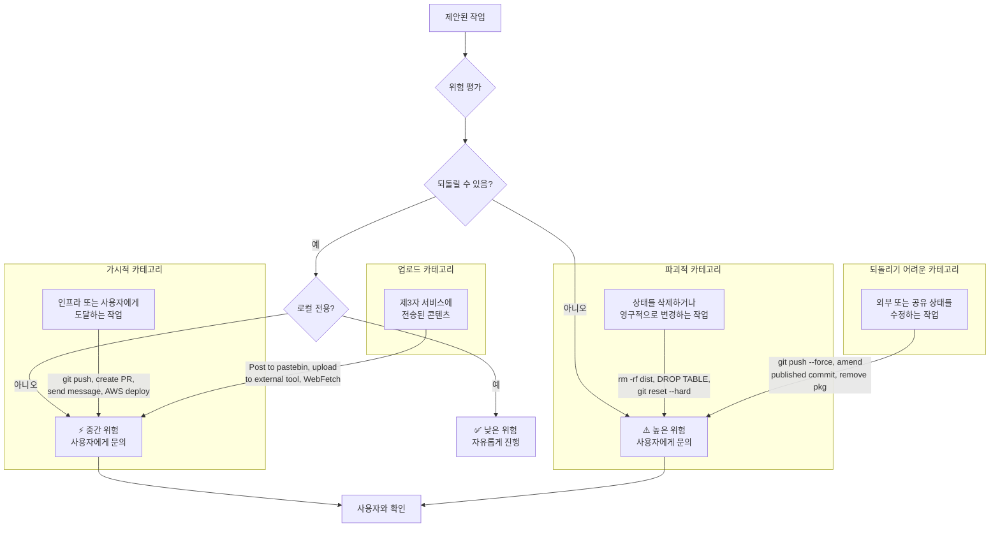
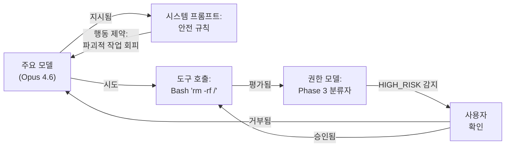
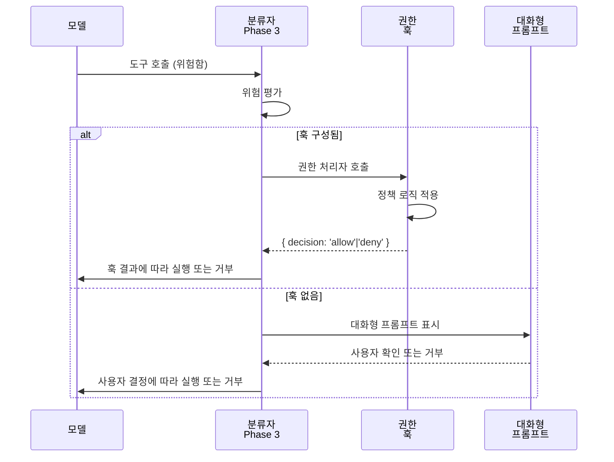

# Safety Rule

Claude Code의 System Prompt는 AI 안전(유해한 출력 방지)과 소프트웨어 보안(안전하지 않은 코드 방지)을 모두 다루는 상세한 Safety Rule을 포함합니다. 이러한 규칙은 Permission Model의 실행 계층과 함께 작동하여 2계층 방어를 만듭니다: 모델 자체에 대한 행동 제약, 그리고 도구 시스템에 대한 기술적 실행입니다.

## OWASP 인식

시스템 프롬프트는 OWASP Top 10 취약점을 명시적으로 참조하고 모델에 이를 도입하지 않도록 지시합니다:

### OWASP 카테고리 및 도구 매핑

| OWASP 카테고리 | 도구 위험 | 완화 조치 |
|---------------|-----------|-----------|
| **A1: Injection** | Bash 도구는 임의의 셸 입력을 수용합니다. | 모델은 신뢰할 수 없는 변수 주입에 대해 검증되며, Bash 샌드박스는 제한 시간/환경 제약을 적용합니다. |
| **A2: Injection (SQL 주입)** | 모든 데이터베이스 도구. | 모델은 매개변수화된 쿼리 사용 지시; 신뢰할 수 없는 입력에서 SQL을 구성하지 않음. |
| **A3: Broken Authentication** | WebFetch, API 상호작용. | 모델은 코드에 자격증명을 저장하지 않도록 경고; 절대 비밀을 커밋하지 않음. |
| **A4: XSS** | WebFetch 결과 처리, 아티팩트 생성. | 모델은 HTML 생성을 새니타이징; 템플릿 주입 방지. |
| **A5: Broken Access Control** | 파일 작업, Bash 명령. | 모델은 파일시스템 경계를 존중; 유효하지 않은 경로 거부. |
| **A6: Security Misconfiguration** | Infrastructure-as-Code 도구 (CDK, CloudFormation). | 모델은 정책을 모범 사례에 대해 검증; 권한 모델은 인증을 실행합니다. |
| **A7: Sensitive Data Exposure** | Read, WebFetch, Bash. | 모델은 비밀을 로깅하지 않음; 출력에서 자격증명을 제거; .env 파일을 직접 읽는 것을 거부. |
| **A8: XXE (XML 외부 엔티티)** | WebFetch, XML 파싱. | 모델은 신뢰할 수 없는 출처의 XML 파싱을 회피. |
| **A9: Insecure Deserialization** | JSON 파싱, 도구 입력. | 모델은 역직렬화 전에 입력을 검증. |
| **A10: Using Components with Known Vulnerabilities** | 의존성 관리. | 모델은 CVE 추적 모범 사례에 대해 알림. |

### 모델 자동 수정 메커니즘

모델이 실수로 안전하지 않은 코드를 작성하는 경우 (예: 유효성 검사 없이 `subprocess.call(f"rm {user_input}")` 또는 `bash.run(`rm -rf ${userPath}`)`), 시스템 프롬프트는 이를 **즉시 감지하고 수정**하도록 지시합니다. 모델은 위험을 감지하고 명령을 이스케이프 (예: `shellEscape()` 사용)하거나 적절한 기술을 사용하여 수정합니다.

모델은 이를 **blocker 수정**으로 취급하도록 지시받습니다. 원래 작업보다 우선 순위가 높습니다.

### 도구별 OWASP 방어

**Bash 도구** (주입에 대한 최고 위험):
- 신뢰할 수 없는 변수를 통한 명령 주입이 주요 위험입니다
- 모델은 모든 셸 메타문자(`; | & $ () < >`)를 검증하도록 지시됩니다
- `shellEscape()` 또는 `bash -c 'command' -- "$var"` 패턴을 선호합니다
- 다음 명령을 거부합니다: `ls -l $(user_input)`, `` `whoami` ``, `eval $var`

**WebFetch 도구** (SSRF, XXE, 데이터 유출):
- 모델은 사용자 입력에서 구성된 URL을 가져오지 않도록 경고받습니다
- 내부 IP 범위 (127.0.0.1, 10.0.0.0/8, 172.16.0.0/12 등)를 가져오기를 거부합니다
- 오류 메시지에서 인증 헤더를 제거합니다
- 응답 본문을 제3자 서비스로 캐싱 또는 로깅하지 않습니다

**Write/Edit 도구** (임의의 파일 쓰기):
- 모델은 파일 경로가 프로젝트 경계 내에 유지되는지 검증합니다
- 민감한 파일 (.env, .git, node_modules)을 덮어쓰기를 거부합니다
- 우발적인 자격증명 쓰기를 감지하고 사용자에게 회전을 프롬프트합니다

## 보안 도구 인증

보안 관련 작업 (침투 테스트, CTF 챌린지, 익스플로잇 개발)의 경우, 시스템 프롬프트는 명확한 인증 컨텍스트를 요구합니다:

| 허용된 컨텍스트 | 예제 |
|----------------|---------|
| 권한 부여된 침투 테스트 | 문서화된 범위의 약정 |
| CTF 경쟁 | 챌린지 해결 컨텍스트 |
| 보안 연구 | 학술 또는 방어 연구 |
| 방어 보안 | Blue team, 탐지 엔지니어링 |

| 거부된 컨텍스트 | 예제 |
|-----------------|---------|
| DoS 공격 | 모든 denial-of-service 기법 |
| 대량 타겟팅 | 여러 시스템 공격 |
| 공급망 손상 | 패키지 독살, 의존성 공격 |
| 탐지 회피 (악의적) | 공격을 위한 보안 컨트롤 우회 |

인증은 대화 컨텍스트를 통해 추적됩니다. 모델은 진행하기 전에 약정 조건, CTF 제목 또는 연구 소속의 명시적인 언급이 필요합니다.

## 되돌릴 수 있음 및 영향 반경 프레임워크

시스템 프롬프트는 행동 위험을 평가하기 위한 정교한 프레임워크를 포함합니다. 이것은 단순한 지침이 아닙니다. **권한 파이프라인의 Phase 3 분류자 로직과 직접 매핑됩니다** ([권한 모델](../security/permission-model.md) 참조).

### 프레임워크 순서도



### 위험 카테고리 세부 정보

**낮은 위험 (자유롭게 진행):**
- 파일 읽기 (상태 변경 없음)
- 테스트 실행 (부작용 포함)
- 로컬 파일 편집 (버전 컨트롤을 통해 되돌릴 수 있음)
- 검색 작업 (읽기 전용)
- 아티팩트 빌드 (로컬, 정리 가능)

**중간 위험 (사용자와 확인):**
- **다른 사람에게 표시**: 공유 리포지토리에 푸시 (팀원에게 영향)
- **PR 생성**: 변경 사항이 프로젝트 히스토리에서 표시됨
- **인프라 배포**: 변경 사항이 프로덕션 또는 스테이징에 도달
- **콘텐츠 업로드**: 제3자 서비스가 캐시하거나 인덱싱할 수 있음
- **문제/주석 생성**: 조직에 표시되는 공개 기록

**높은 위험 (항상 확인):**
- **파괴적**: `rm -rf`, `DROP TABLE`, 영구 삭제
- **되돌리기 어려움**: 게시된 브랜치에 강제 푸시, 게시된 커밋 수정, npm 패키지 제거
- **상태 납치**: 리포지토리 상태를 손상시킬 수 있는 Git 작업
- **자격증명 유출**: API 키 또는 비밀번호를 누출할 수 있는 명령

### 권한 파이프라인 분류로 매핑하는 방법

Phase 3 분류자는 권한 파이프라인에서 같은 위험 차원을 통해 도구 호출을 평가합니다. 분류자는 도구 호출을 검사하고 파괴성 여부를 확인합니다 (파일 삭제, 데이터베이스 테이블 삭제, git 리셋). 파괴적이고 되돌릴 수 없으면 HIGH_RISK를 반환합니다. 도구 호출이 공유 상태에 영향을 미치는 가시적 작업인지 확인합니다 (git push, PR 생성, AWS 배포). 그렇다면 MEDIUM_RISK를 반환합니다. 그 외는 LOW_RISK를 반환하여 진행하도록 합니다.

교차 참조: [권한 모델 - Phase 3 분류자](../security/permission-model.md#phase-3-security-classifier)

## 안전 규칙 및 권한 모델 상호작용

Claude Code는 안전하지 않은 작업에 대항하는 **2계층 방어**를 구현합니다:

### Phase 1: 행동 제약 (시스템 프롬프트)
시스템 프롬프트의 안전 규칙은 **모델이 해야 한다고 생각하는 것**을 제약합니다:
- "OWASP 취약점을 도입하지 않음"
- "작업과 관련된 파일만 수정"
- "절대 git 훅을 건너뛰지 않음"
- "외부 입력을 철저히 검증"

이는 **soft 제약**입니다. 모델은 지시받지만 기술적으로 방지되지는 않습니다.

### Phase 2: 기술적 실행 (권한 모델)
권한 파이프라인은 **도구 시스템이 실제로 허용하는 것**을 실행합니다:
- Phase 1 (고정 허용 목록): 읽기 전용 도구 자동 허용
- Phase 2 (사용자 규칙): 사용자 구성 패턴 자동 허용
- Phase 3 (분류자): Sonnet 4.6은 위험한 호출을 독립적으로 평가합니다

이는 **hard 제약**입니다. 모델이 `rm -rf /`를 실행하려고 해도 도구 시스템이 이를 차단하고 사용자에게 문의합니다.

### 깊이 있는 방어



**모델의 안전 규칙이 실패하면** (예: 모델이 파괴적인 명령을 실행하도록 결정), 권한 모델이 이를 포착합니다.

**권한 모델이 잘못 구성되면** (예: 너무 허용적인 사용자 규칙), 모델의 안전 규칙이 나쁜 선택을 낙담시킵니다.

### 상호작용 예제

사용자가 묻습니다: "이전 빌드 디렉토리 삭제"

1. **시스템 프롬프트** 지시: "이것은 파괴적입니다; 사용자와 확인"
2. **모델** 파괴성을 인식하고 확인 요청 포함
3. **사용자** 확인 → 모델 생성: `Bash("rm -rf old-build")`
4. **권한 모델** Phase 1/2/3이 `rm -rf` 호출 평가
5. **분류자** 보기: "사용자가 old-build 삭제 요청, 도구가 old-build 디렉토리 대상"
6. **분류자** 반환: SAFE 
7. **도구 실행**

모델이 더 많은 작업을 하려고 한 경우 (예: `rm -rf /`):
1. **시스템 프롬프트** 여전히 주의 지시
2. **모델** 생성: `Bash("rm -rf /")`
3. **권한 모델** Phase 3이 오버슈트 확인
4. **분류자** 반환: RISKY 
5. **사용자가 다시 프롬프트됨** → 아마도 거부
6. **도구가 실행되지 않음**

## Bare-Repo 공격 방지

Git 상태 손상은 CI/CD 환경에서 알려진 공격 벡터입니다. Claude Code는 bare-repo 납치를 방지하기 위한 명령 후 정리를 포함합니다:

### 공격

악의적인 도구 호출 또는 스크립트는 `.git` 디렉토리를 손상시켜 후속 `git` 명령이 실패하거나 예기치 않게 작동하게 할 수 있습니다:

```bash
# 공격: git 구성 손상
echo "corrupted" > .git/config

# 후속 git 명령이 잘못된 리포지토리를 대상으로 하거나 실패합니다
git status  # 이제 잘못된 리포지토리를 대상으로 하거나 실패합니다
```

### 방지: 명령 후 검증

Git 상태를 수정하는 Bash 명령 후 Claude Code는 리포지토리가 여전히 깨끗하고 유효한 상태에 있는지 검증합니다. 검증 로직은 작업 디렉토리가 깨끗한지 확인합니다 (커밋되지 않았거나 추적되지 않은 변경 없음). 이 접근 방식은 손상되거나 더러운 git 상태가 후속 작업을 통해 조용히 전파되는 것이 아니라 즉시 감지되도록 보장합니다.

검증은 명시적 확인을 통해 발생합니다. 예를 들어 다른 브랜치나 다른 컴퓨터에서 세션을 재개하기 위해 `--teleport` 기능을 사용할 때 Claude Code는 먼저 작업 디렉토리가 깨끗한지 확인합니다. 리포지토리가 더러운 상태 (커밋되지 않았거나 추적되지 않은 파일)이면 작업이 실패합니다.

이는 bare-repo 공격을 방지합니다. 악의적인 도구 호출 또는 스크립트가 `.git` 디렉토리를 손상시킬 수 있습니다 (예: `.git/config`에 유효하지 않은 데이터 쓰기 또는 HEAD 참조 손상). 전략적 체크포인트에서 git 상태를 검증함으로써 Claude Code는 다음을 보장합니다:

1. **즉시 감지**: 손상이 다음 검증 체크포인트에서 포착됨
2. **명확한 오류 메시지**: 사용자가 암호화된 git 오류 대신 실행 가능한 피드백 수신
3. **운영자 제어**: 사용자가 git 상태 확인 시기와 이유를 명시적으로 볼 수 있음
4. **복구 지침**: 오류 메시지는 수정 단계 제안 (예: "변경사항을 커밋 또는 stash하세요")


## 훅 권한 이스케이프 해치

권한 모델은 **헤드리스 환경 (대화형 프롬프트가 없는 CI/CD 시스템)에서 프로그래밍 방식의 권한 결정**을 위한 `PermissionRequest` 훅 메커니즘을 포함합니다:

### 사용 사례: 헤드리스 배포

CI/CD에는 권한을 확인할 대화형 사용자가 없습니다. 대신 시스템은 정책에 따라 자동화된 권한 결정을 내리는 훅을 구현할 수 있습니다. CI/CD 구성 (`.claude/settings.json`)에서 `permissions.hooks.onPermissionRequest` 객체는 정책 로직이 있는 핸들러 파일 경로와 환경 (예: staging) 및 허용된 명령 목록을 지정합니다.

정책 로직은 도구 호출, 위험 수준 및 사용자 메시지를 받습니다. 실행 환경이 CI인지 확인하고, 있다면 도구 호출의 명령이 허용 명령 목록에 있는지 확인합니다. 허용되면 `{ decision: 'allow', reason: 'ci-policy' }`를 반환합니다. 그렇지 않으면 기본값으로 거부합니다.

### 훅이 대화형 프롬프트를 무시하는 방법



훅은 다음을 통해 보안을 유지합니다:
- 명시적 구성 필요 (자동 활성화 아님)
- 감사 추적 (CI 로그에 로깅)
- 프로그래밍 방식의 정책 검증 지원
- 정책이 결정적이지 않은 경우 대화형 프롬프트로 폴백

## 자동 모드에서 위험한 권한 제거

Claude Code는 **자동 모드** (완전 자율 실행)에서 작동할 때 자동으로 위험한 권한을 제거합니다. 이것은 사용자가 과도하게 허용적인 규칙을 구성했더라도 안전을 보장합니다.

### 문제

사용자가 대화형 작업을 위해 광범위한 권한을 구성할 수 있습니다:

```json
{
  "permissions": {
    "allowedTools": [
      { "tool": "Bash", "command": "rm" },  // 너무 광범위합니다!
      { "tool": "Write", "pathPattern": "**/*" }
    ]
  }
}
```

대화형 모드에서는 사용자가 감시하고 있으므로 이것이 허용됩니다. 하지만 **자동 모드**에서는 이러한 권한이 악용될 수 있습니다.

### 해결책: 권한 제거

자동 모드가 활성화되면 위험한 권한 규칙이 자동으로 제거됩니다. `stripDangerousPermissions()` 함수는 원본 규칙과 현재 모드를 받습니다. 대화형 모드이면 모든 규칙을 유지합니다. 자동 모드이면 규칙을 필터링합니다. 각 규칙에 대해 Bash 도구이고 명령이 있는지 확인합니다. 그런 다음 위험한 패턴 집합(`rm -rf`, `git reset --hard`, `git push --force`, `DROP TABLE`, `DELETE FROM`)에 대해 명령을 확인합니다. 위험한 패턴과 일치하면 로그 경고를 남기고 규칙을 필터링합니다.

### 권한 복원

자동 모드 종료 시 원본 권한이 복원됩니다. 백업에서 원본 규칙을 로드하고 권한을 저장합니다. 이는 자동 모드가 종료될 때 원본 권한이 유지되도록 보장합니다.

이것은 다음을 보장합니다:
- **대화형 작업**: 완전한 사용자 제어 및 유연성
- **자동 모드**: 위험한 패턴 없이 잠금된 안전
- **우아한 복원**: 자동 모드 완료 후 권한 유지

## Git 특화 안전

Git 작업은 의도하지 않은 결과의 최고 위험입니다. 시스템 프롬프트는 상세한 git 안전 규칙을 포함하며, 권한 모델에서 구현됩니다:

### 규칙 1: Git 구성 업데이트하지 않기

```bash
# ❌ 시스템 프롬프트 및 권한 모델에 의해 차단됨
git config user.email "evil@attacker.com"
git config --system receive.denyForce false
```

**이유**: Git 구성 변경은 모든 후속 작업에 영향을 미칩니다. 손상된 구성은 푸시를 공격자 리포지토리로 리다이렉트할 수 있습니다.

**구현**: 권한 모델이 `git config` 명령을 완전히 차단합니다.

### 규칙 2: Main/Master에 강제 푸시하지 않기

```bash
# ❌ 분류자에 의해 차단됨
git push --force origin main

# ❌ 차단됨 (이력 수정)
git commit --amend  # 훅 실패 후
```

**이유**: 강제 푸시는 공유 이력을 다시 쓰고, 다른 개발자의 리포지토리를 손상시킵니다.

**구현**: 분류자는 기본 브랜치를 대상으로 하는 `git push --force`를 감지하고 사용자에게 문의합니다.

### 규칙 3: 훅 건너뛰지 않기 (`--no-verify`)

```bash
# ❌ 차단됨: pre-commit 훅 건너뜀 (보안 게이트)
git commit --no-verify -m "message"

# ✅ 허용됨: 훅 존중
git commit -m "message"
```

**이유**: Pre-commit 훅은 보안 체크포인트입니다 (linting, 비밀 스캔, 보안 검증). 이를 건너뛰면 보호를 무효화합니다.

**구현**: 권한 모델이 `--no-verify`를 무조건 차단합니다.

### 규칙 4: 훅 실패 후 기존 커밋 수정하지 않기

이것은 중요하고 자주 잘못 이해됩니다:

```bash
# 시나리오 1: 첫 번째 커밋 시도
git commit -m "Add feature"  # 훅 실패 (pre-commit 확인)

# ❌ 잘못됨: --amend는 이전 커밋을 수정합니다 (이것이 아님)
git commit --amend -m "Fixed feature"  # 이것은 이전 커밋을 변경합니다!

# ✅ 올바름: 문제 수정, 스테이지, 새 커밋 생성
# (파일에서 문제 수정)
git add file.ts
git commit -m "Add feature (fixed)"  # 새 커밋
```

**이유**: 훅 실패 후 커밋이 발생하지 않았습니다. `--amend`를 사용하면 해당 브랜치의 **이전** 커밋이 수정되어 관련 없는 작업을 손상시킬 수 있습니다.

**구현**:
- 시스템 프롬프트는 명시적으로 경고합니다: "훅 실패 후 커밋 실패. --amend를 사용하지 마세요. 이전 커밋을 수정합니다"
- 권한 모델은 최근 훅 실패가 로깅될 때 수정을 회피합니다
- 모델은 대신 새 커밋을 생성합니다

### 규칙 5: `git add -A` 보다 특정 파일 스테이징 선호

```bash
# ❌ 위험: 모든 수정 파일 추가 (비밀 포함)
git add -A
git commit -m "Update code"
# 실수로 커밋됨: .env, credentials.json, secrets/

# ✅ 안전: 특정 파일 스테이징
git add file.ts config/app.ts
git commit -m "Update code"
```

**이유**: `git add -A`는 실수로 비밀, 빌드 아티팩트 또는 관련 없는 변경을 스테이징할 수 있습니다.

**구현**: 모델은 명시적으로 개별 파일을 스테이징합니다. 여러 파일을 추가할 때 모델은 사용자 확인과 함께 glob 패턴을 사용합니다.

### 규칙 6: 비밀 커밋하지 않기

```bash
# ❌ 검증자에 의해 차단됨
git add .env
git commit -m "Config"  # .env 파일 차단됨

# ✅ 허용됨
git add .env.example
git commit -m "Add env template"
```

**이유**: 커밋된 비밀은 진정으로 제거될 수 없습니다 (git 이력에 있음). 삭제된 경우에도 리포지토리 액세스 권한이 있는 모든 사람이 여전히 액세스할 수 있습니다.

**구현**:
- Pre-commit 훅은 일반적인 비밀 패턴 감지 (AWS_SECRET_ACCESS_KEY, PRIVATE_KEY 등)
- 모델은 스테이징 전에 `.gitignore` 확인하도록 경고받습니다
- 모델은 자격증명 패턴과 일치하는 파일 스테이징을 거부합니다

### Git 규칙 요약 표

| 규칙 | 위반 | 실행 | 사용자 영향 |
|------|-----------|------------|-------------|
| 구성 업데이트 없음 | `git config --system receive.denyForce false` | 권한 모델 차단 | 없음 (납치 방지) |
| main에 강제 푸시 없음 | `git push --force origin main` | 분류자가 사용자에게 문의 | 확인 요청됨 (안전) |
| 절대 훅 건너뛰기 | `git commit --no-verify` | 권한 모델 차단 | 없음 (훅 필요) |
| 훅 실패 후 수정 없음 | `git commit --amend` (실패한 훅 후) | 모델 회피; 새 커밋 생성 | 새 커밋 생성됨 |
| 특정 파일 스테이징 선호 | `git add -A` | 모델이 개별 파일 스테이징 | 약간 더 상세함 (안전) |
| 절대 비밀 커밋 | `git add .env` | Pre-commit 훅 차단 | 비밀 커밋 불가 (안전) |

## 검증 철학

시스템 프롬프트는 보안과 코드 단순성의 균형을 맞추는 특정 검증 철학을 인코드합니다:

> **시스템 경계에서만 검증** (사용자 입력, 외부 API, 신뢰할 수 없는 출처의 파일 읽기). **일어날 수 없는 시나리오에 대한 오류 처리를 추가하지 마세요.** 내부 코드 및 프레임워크 보증을 신뢰합니다.

### 시스템 경계

**검증이 필요한 경계** (외부, 신뢰할 수 없음):
- CLI 인수, 웹 양식, 채팅에서의 사용자 입력
- 신뢰할 수 없는 출처에서 읽은 파일 내용
- 외부 서비스의 API 응답
- WebFetch의 네트워크 데이터
- 환경 변수 (공격자가 설정할 수 있음)

**검증이 필요하지 않은 경계** (내부, 신뢰할 수 있음):
- TypeScript 유형의 함수 매개변수 (유형 시스템이 보증)
- 내부 함수의 반환 값 (같은 코드베이스)
- 프레임워크 보증 (예: Next.js 라우팅, Express 미들웨어)
- 컴파일러 확인 불변량

### 예제

과도한 검증은 이미 TypeScript로 타입 지정된 함수 매개변수나 CLI 프레임워크에 의해 검증된 값에 대해 가드를 추가합니다. 이는 일어날 수 없는 상태를 확인하려 하므로 사이클을 낭비합니다. 대신 경계에서만 검증합니다. 내부 함수는 TypeScript 유형 보증과 같은 프레임워크 보장을 신뢰합니다.

반대로 데이터가 시스템에 들어오는 곳에서는 검증해야 합니다. 사용자 입력을 파싱할 때 raw input이 문자열인지 확인합니다. JSON을 파싱하고 필수 필드가 있는지 확인합니다. 이 경계 검증은 모든 외부 입력이 안전하고 유효함을 보장합니다.

### 근거

이 철학은 보안을 감소시키지 않으면서 코드 복잡성을 줄입니다:

| 접근 방식 | 코드 복잡성 | 보안 | 사용 시기 |
|----------|-----------------|----------|------------|
| 모두 검증 | 높음 | 동일 (중복) | 절대 아님; 사이클 낭비 |
| 경계에서 검증 | 낮음 | 강함 | 항상 (이 접근 방식) |
| 검증 없음 | 매우 낮음 | 약함 | 절대 아님 (위험) |

경계에서만 검증함으로써 Claude Code는:
- **코드 블로트 감소** (중복 확인 없음)
- **보안 유지** (모든 외부 입력 검증됨)
- **성능 향상** (불필요한 가드 감소)
- **코드베이스와 일치** (기존 코드가 이 패턴 따름)

### 경계 감지 체크리스트

코드를 작성할 때 Claude Code는 다음과 같이 묻습니다: "이 값이 시스템 외부에서 올 수 있을까요?"

- **외부 입력** (신뢰할 수 없음, 검증 필수):
  - `process.argv`, `req.body`, 양식 제출
  - 파일 내용, WebFetch 응답
  - 사용자 제공 파일명, 명령
- **내부 상태** (신뢰할 수 있음, 재검증 불필요):
  - 타입 지정된 함수 매개변수
  - 같은 코드베이스의 반환 값
  - 프레임워크 보증 값 (Next.js `params.id` 등)
  - 컴파일러 확인 불변량

---

## 관련 문서

- [권한 모델](../security/permission-model.md): 3계층 실행 아키텍처
- [Anti-Distillation](../security/anti-distillation.md): 모델 추출 공격 방지
- [Undercover Mode](../security/undercover-mode.md): 탐지 회피 방지
- [Client Attestation](../security/client-attestation.md): 원격 서비스에 ID 증명
