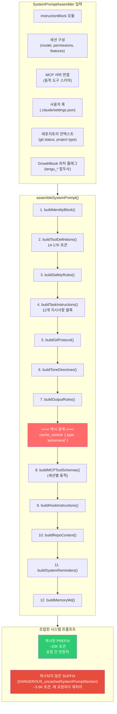
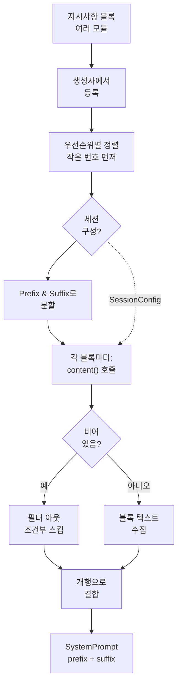

# System Prompt 구조

Claude Code의 System Prompt는 정적 문자열이 아니다. **다양한 개별 Instruction Block**에서 런타임에 동적으로 조립되며, **캐시 가능한 prefix와 세션별 suffix**로 구성된다.

## 조립 파이프라인



## 소스 모듈: InstructionBlocks

각 Instruction Block은 코드베이스의 별도 TypeScript 모듈입니다. Instruction Block은 Claude Code의 System Prompt의 기본 구성 요소입니다. 각 블록은 단일 의미론적 지시사항 또는 기능(identity, tool usage rules, git protocol, safety rules 등)을 캡슐화하고 재사용 가능하고 독립적으로 버전이 지정된 구성 요소로 패키징됩니다.

지시사항 블록의 핵심 구조는 등록 및 조립을 제어하는 메타데이터로 구성됩니다:

- **id**: 블록의 고유 식별자 (예: `'identity'`, `'tool-usage'`)
- **section**: `'prefix'` (캐시됨) 또는 `'suffix'` (요청마다 재처리)
- **priority**: 최종 프롬프트에서 블록의 위치를 결정하는 숫자 순서 (0 = 최고 우선순위, 먼저 렌더링)
- **tokens**: 예산 책정을 위한 예상 토큰 수 (identity의 경우 약 100 토큰, tool definitions의 경우 ~800)
- **content()**: 블록의 텍스트를 생성하는 함수. `SessionConfig` 객체를 수신하며 조건부로 빈 문자열을 반환하여 블록을 건너뛸 수 있습니다 (기능 게이트 및 환경 확인에 유용).

블록은 시작 시 중앙 레지스트리에 등록됩니다. 그런 다음 어셈블러는 모든 블록을 우선순위별로 정렬하고 세션 구성으로 필터링한 후 우선순위 순서대로 연결합니다. 이 설계를 통해 기능을 핵심 조립 로직을 수정하지 않고도 켜고 끌 수 있습니다. Cache Invalidation은 블록 상태 변화 시 감지됩니다.

예를 들어 git protocol 블록은 사용자가 git 리포지토리에 있는 경우에만 조건부로 지시사항을 포함합니다. 도구 관련 블록은 현재 사용 가능한 도구(14-17K 토큰의 JSON 스키마)로 동적으로 주입됩니다. Identity 및 기타 기본 블록은 항상 렌더링됩니다. 모든 Instruction Block을 일관된 구조의 모듈 디렉토리에서 중앙화함으로써 코드베이스는 효율적으로 확장할 수 있습니다.


### 블록 등록 및 조립

SystemPromptAssembler 클래스는 완전한 System Prompt의 조립을 조율합니다. 초기화 시 모든 Instruction Block을 중앙 목록에 등록합니다. 블록은 다양한 관심사를 다룹니다: 기본 identity (Claude Code가 무엇인가), 기능 경계 (어떤 도구가 사용 가능한가), 안전 제약 (어떤 위험을 피할 것인가), 실행 패턴 (작업에 어떻게 접근할 것인가), 런타임 상태 (현재 리포지토리, git status, 사용 가능한 MCP 서버).

조립 프로세스는 예측 가능하고 반복 가능한 순서를 따릅니다:

1. **초기화**: 모든 Instruction Block이 로드되고 어셈블러 생성자에 등록됩니다
2. **정렬**: 블록은 `priority` 필드로 정렬됩니다 (작은 번호가 먼저), identity 같은 기본 블록이 agent guidance 같은 특수 블록보다 먼저 나타나도록 보장합니다
3. **Context Window 별 필터링**: 블록은 두 그룹으로 분할됩니다: prefix 블록 (캐시 가능, ~20K 토큰) 및 suffix 블록 (요청마다 재처리, ~3-5K 토큰)
4. **콘텐츠 생성**: 각 블록에 대해 현재 `SessionConfig`를 사용하여 `content()` 함수가 호출됩니다. 함수가 빈 문자열을 반환하면 블록이 필터링됩니다 (조건부 기능 및 권한 확인에 유용).
5. **연결**: 결과 블록은 `'\n\n'` 구분 기호와 함께 결합되어 응집력 있는 마크다운 섹션을 형성합니다
6. **토큰 예산**: 모니터링 및 디버깅을 위해 총 토큰 수가 계산됩니다

조립 결과는 세 필드를 가진 `SystemPrompt` 객체입니다: `prefix` (캐시 가능한 부분), `suffix` (캐시되지 않은 부분), `totalTokens` (소비된 전체 토큰 예산).

이 설계는 우려사항을 분리합니다: 블록은 *어떤* 콘텐츠를 포함해야 하는지 정의하고 어셈블러는 *어떻게* 결합할 것인지 정의합니다. 새로운 기능은 조립 로직을 건드리지 않고도 새로운 블록으로 추가될 수 있습니다. 조건부 포함 (예: "git repo에 있는 경우에만 git protocol을 포함")은 블록의 `content()` 함수에서 빈 문자열을 반환하여 처리되며, 로직이 각 블록에 로컬로 유지됩니다.




## 토큰 예산 분석

```
전체 시스템 프롬프트: ~20-25K 토큰
│
├── 캐시된 PREFIX (~20K 토큰)
│   │
│   ├── Identity 블록                    ~100 토큰
│   │   "You are Claude Code, Anthropic's official CLI for Claude"
│   │
│   ├── 도구 정의                        14,000-17,000 토큰  ████████████████
│   │   ├── Read 도구 스키마              ~800 토큰
│   │   ├── Write 도구 스키마             ~400 토큰
│   │   ├── Edit 도구 스키마              ~600 토큰
│   │   ├── Bash 도구 스키마              ~1,200 토큰 (가장 큰 개별 도구)
│   │   ├── Grep 도구 스키마              ~900 토큰
│   │   ├── Agent 도구 스키마             ~2,000 토큰 (가장 큼, 모든 에이전트 타입 포함)
│   │   ├── TodoWrite 도구 스키마         ~1,500 토큰
│   │   └── ... 15+ 추가 도구             ~6,600 토큰
│   │
│   ├── 도구 사용 규칙                   ~800 토큰
│   │   "Bash 도구를 사용하지 마세요 (전용 도구가 있을 때)"
│   │   "Read를 cat 대신 사용하세요, Edit를 sed 대신 사용하세요..."
│   │
│   ├── 안전 규칙                        ~600 토큰
│   │   OWASP 인식, 보안 테스팅 정책
│   │
│   ├── 작업 실행 (12개 지시사항)        ~1,200 토큰
│   │   "수정 전 읽기", "불필요한 기능 추가 금지"
│   │   "3개 유사 줄 > 조기 추상화"
│   │
│   ├── Git 프로토콜                     ~1,500 토큰
│   │   커밋 프로토콜, PR 프로토콜, 안전 규칙
│   │
│   ├── 톤 & 출력 스타일                ~400 토큰
│   │   "핵심으로 직진", "이모지 없음"
│   │
│   └── 에이전트 지침                    ~500 토큰
│       Agent 도구 언제 사용, 에이전트에게 지시하는 방법
│
│   ═══════════ 캐시 경계 ═══════════
│
└── 캐시되지 않은 SUFFIX (~3-5K 토큰, 가변)
    │
    ├── MCP 도구 스키마                  0-3,000 토큰 (연결에 따라 다름)
    ├── 훅 지시사항                      0-500 토큰
    ├── 레포지토리 컨텍스트              ~200 토큰
    │   플랫폼, 셸, git status
    ├── 시스템 리마인더                  ~500 토큰
    │   사용 가능한 지연 도구, 기술
    └── MEMORY.md 내용                  500-1,000 토큰
```

## `DANGEROUS_uncachedSystemPromptSection`

소스 코드는 suffix를 위해 명시적으로 이름이 지정된 변수를 사용합니다:

```typescript
// Suffix는 의도적으로 캐시 영향을 그리기 위해 이름이 지정되었습니다
const DANGEROUS_uncachedSystemPromptSection = buildSuffix(config);

// 이 명명 규칙은 개발자에게 경고로 작동합니다:
// "여기에 추가된 모든 것은 모든 API 호출에서 재처리됩니다"
// "여기에 콘텐츠를 추가하면 캐시 효율성이 깨집니다"
// "여기에 무언가를 넣기 전에 신중하게 생각하세요"
```

`DANGEROUS_` 접두사는 의도적인 명명 선택입니다. suffix에 콘텐츠를 추가하면 성능과 비용 영향이 있다는 개발자에게 경고합니다. 왜냐하면 suffix의 모든 것이 프롬프트 캐싱을 우회하기 때문입니다.

## 조건부 블록

많은 지시사항 블록은 구성에 따라 조건부로 포함됩니다:

```typescript
// 조건부 포함의 예제
const planModeBlock: InstructionBlock = {
  id: 'plan-mode',
  section: 'prefix',
  content: (config) => {
    if (!config.planMode) return '';  // plan 모드가 아니면 완전히 건너뛰기
    return `## Plan Mode\nYou are currently in plan mode...`;
  },
};

const agentBlock: InstructionBlock = {
  id: 'agent-system',
  section: 'prefix',
  content: (config) => {
    // 에이전트가 사용 가능한 경우에만 에이전트 지시사항 포함
    if (config.disableAgents) return '';
    return `## Using the Agent tool\n...`;
  },
};

const undercoverBlock: InstructionBlock = {
  id: 'undercover',
  section: 'prefix',
  content: (config) => {
    if (!config.undercoverMode) return '';
    return `You are operating UNDERCOVER in a PUBLIC/OPEN-SOURCE repository.
Do not mention: ${INTERNAL_CODENAMES.join(', ')}...`;
  },
};
```

## 캐시 경계 설계 원칙

각 지시사항 블록의 배치 (prefix vs suffix)는 다음 규칙을 따릅니다:

| 원칙 | 규칙 | 이유 |
|-----------|------|--------|
| **안정성** | 요청 간 변경되지 않는 콘텐츠 → prefix | 캐시 히트율 최대화 |
| **빈도** | 거의 변경되지 않는 콘텐츠 → prefix | 변경될 *수* 있더라도 자주 하지 않으면 캐시 승리 |
| **동적성** | 세션당 변경되는 콘텐츠 → suffix | MCP 도구, 훅, 리포 상태 |
| **크기** | 큰 안정 콘텐츠 → 먼저 prefix | 도구 스키마 (14-17K 토큰)는 캐싱에서 가장 이익) |
| **위험** | 변경 시 캐시를 깨는 콘텐츠 → suffix | prefix로 이동하면 자주 변경되는 경우 캐싱하지 않는 것이 더 나쁨 |

결과: **시스템 프롬프트의 60-70%가 캐시되며**, 가장 토큰 비용이 큰 구성 요소 (도구 정의)는 항상 캐시된 prefix에 있습니다.
