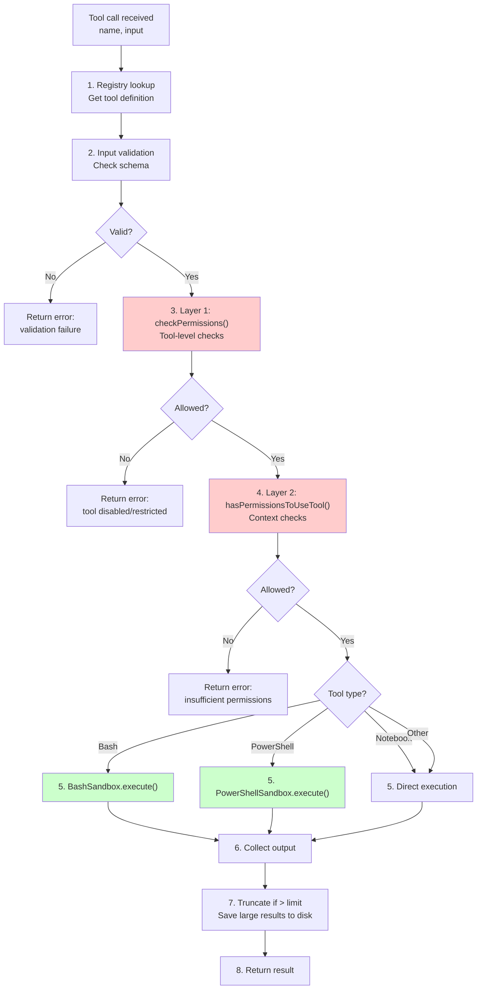
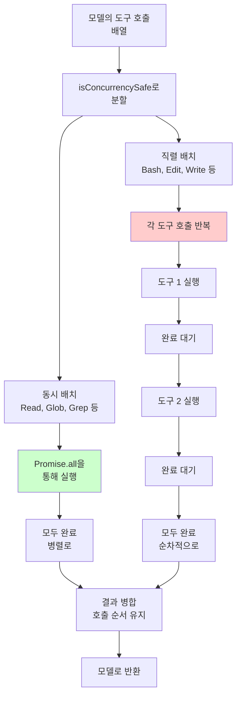

# 실행 도구 (Execution Tools)

실행 도구는 Claude Code의 런타임 엔진입니다. 이들은 프로세스를 생성하고, Sandbox를 관리하며, 명령어와 코드의 실제 실행을 조율합니다. 파일 도구(디스크에 읽기/쓰기)나 네트워크 도구(외부 콘텐츠 가져오기)와 달리, 실행 도구는 **부작용을 만듭니다**. 코드를 실행하고, Subprocess를 생성하며, 시스템 리소스와 상호작용합니다.

## 도구 실행 아키텍처

모든 실행 도구는 **장애-폐쇄 보안-우선** 아키텍처를 따릅니다. 이 섹션에서는 계층화된 권한 모델, 샌드박스 설계, 그리고 실행을 기본적으로 안전하게 유지하는 결과 지속성 전략을 설명합니다.

### 권한 확인 파이프라인: 3계층 방어

도구는 기본적으로 **거부/직렬 모드**로 생성됩니다. 개발자는 세 가지 독립적인 거부 지점을 통해 명시적으로 권한에 옵트인해야 합니다:

실행 도구는 다음과 같은 3계층 권한 모델을 따릅니다:

**계층 1: 입력 검증** - `validateInput()`이 매개변수 스키마를 확인합니다. 형식 오류나 필수 항목이 누락되면 거부됩니다.

**계층 2: 도구 권한 확인** - `tool.checkPermissions()`이 도구 플래그를 검토합니다. 비활성화된 도구나 유지보수 모드에서는 거부됩니다.

**계층 3: 기능 인증** - `hasPermissionsToUseTool()`이 컨텍스트를 평가합니다. Sandbox된 컨텍스트나 누락된 기능으로 인해 거부될 수 있습니다.

각 계층은 독립적입니다. 도구가 계층 1 검증을 통과했지만 계층 3 인증에서 실패할 수 있습니다. 실행이 진행되려면 모든 계층을 통과해야 합니다.

### 도구 실행 파이프라인

디스패처가 도구 호출을 받으면 다음 순서를 따릅니다:



### 동시성 안전 플래그

디스패처는 각 도구의 `isConcurrencySafe` 속성을 평가하여 실행 순서를 결정합니다. 이 플래그는 입력 매개변수에 따라 각 도구 정의에 의해 동적으로 계산됩니다. 예를 들어 Read 도구는 항상 Concurrency 안전하지만, 파일을 수정하는 Bash 명령어는 그렇지 않습니다.

도구 호출이 모델에서 도착하면 디스패처는 두 단계 실행 전략을 적용합니다:

1. **동시 단계**: `isConcurrencySafe: true`로 표시된 모든 도구는 `Promise.all`을 통해 병렬로 실행됩니다. 이 도구들은 부작용을 만들거나 공유 상태를 수정하지 않습니다 (파일 읽기, 검색, 외부 데이터 가져오기).

2. **직렬 단계**: `isConcurrencySafe: false`로 표시된 도구는 순서대로 한 번에 하나씩 실행됩니다. 각 도구는 다음 도구가 시작되기 전에 완료되어야 합니다. 이는 여러 도구가 동시에 파일시스템이나 명령 상태를 수정하려고 할 때 경쟁 조건을 방지합니다. 이 메커니즘은 **Concurrency 제어**라고 부릅니다.

핵심 통찰력은 `isConcurrencySafe`가 **특정 입력에 따라 디스패치 시점에 평가된다**는 것입니다. 단일 도구 (예: Bash)는 한 컨텍스트에서는 안전할 수 있지만 (`ls /tmp`) 다른 컨텍스트에서는 안전하지 않을 수 있습니다 (`rm -rf /`). 디스패처는 각 도구를 실행 큐에 추가하기 전에 이를 확인합니다.

비동시 도구가 실행을 시작하면 **다른 도구는 실행되지 않습니다**. 동시 도구도, 직렬 도구도 실행되지 않습니다. 완료될 때까지. 이 직렬화 경계는 파일시스템 일관성을 보장하고 연쇄 오류를 방지합니다.

### 결과 지속성 & Token Budget 최적화

큰 도구 출력은 API로 직접 전송되지 않습니다. 대신 시스템은 Token Budget 인식 절단과 디스크 지속성을 사용하여 API 컨텍스트를 좁게 유지합니다:

1. **결과 수집**: 도구가 출력을 생성합니다 (파일 내용, 명령어 결과 등)
2. **토큰 예산 책정**: 시스템은 출력의 토큰 비용을 예상합니다 (대략적 비율: 약 4글자마다 1토큰)
3. **의사 결정 지점**: 예상 토큰이 `4,000` (대략 15KB 텍스트)을 초과하면:
   - 전체 출력을 `.omc/results/{타임스탐프}-{도구이름}.txt`로 디스크에 저장
   - 자른 요약을 API에 반환 (첫 500글자 + 표시자)
   - 요약에 디스크 경로 참조 포함
4. **예산 내**: 출력이 더 작으면 API에 전체 전송

이 전략은 큰 출력 (10,000줄 grep 결과, 다중 메가바이트 로그 파일) 처리에 중요하며 Context Window를 폭발시키지 않습니다. 전체 결과는 참조를 위해 디스크에 유지되지만 API는 간결한 요약만 받습니다. 이는 자세한 명령어의 토큰 소비를 50-80% 줄이면서 완전한 데이터 접근을 유지합니다.

절단 알고리즘은 큰 출력의 첫 번째 섹션 (초기 컨텍스트 표시) 과 마지막 섹션 (결론 표시)을 유지하고 중간을 생략합니다. 이는 모델과 사용자 모두 수천 줄을 읽을 필요 없이 발견한 내용을 이해하도록 돕습니다.

---

## Bash 도구

프로세스 격리, 네트워크 제한, 타임아웃 강제 실행을 사용하여 샌드박스 환경에서 셸 명령어를 실행합니다.

### 속성

| 속성 | 값 |
|----------|-------|
| 기본 타임아웃 | 120,000ms (2분) |
| 최대 타임아웃 | 600,000ms (10분) |
| 작업 디렉터리 | 호출 간에 지속 |
| 셸 상태 | 지속되지 않음 (환경 변수, 별칭 초기화) |
| 백그라운드 모드 | 긴 작업의 경우 `run_in_background: true` |
| 동시성 안전 | 아니오 (`isConcurrencySafe: false`) |
| 출력 제한 | 4,000개 토큰 (~15KB) |

### BashSandbox 깊이 있는 구현

`BashSandbox` 클래스는 네 가지 보안 관심사를 고려하여 명령어 실행을 관리합니다: 경로 격리, 네트워크 액세스, 프로세스 리소스, 작업 디렉터리 지속성.

#### 경로 제한

Bash는 화이트리스트 보안 모델 하에서 작동합니다: 명시적으로 허용된 경로만 액세스할 수 있습니다. 샌드박스는 각 명령어를 파싱하여 파일 경로를 추출하고 두 가지 목록에 대해 검증합니다:

**허용된 경로 (긍정 허용 목록)**
- 작업 디렉터리 루트 (프로젝트 디렉터리, 보통 환경에서 상속)
- `/tmp` 및 `/var/tmp` (임시 파일 저장소)

**보호된 경로 (부정 목록, 심층 방어)**
- 시스템 디렉터리: `/etc` (설정), `/sys`, `/proc`
- 자격증명: `~/.ssh` (SSH 키), `.env` 파일, `credentials.json`
- 루트 홈 디렉터리 및 민감한 위치

검증 프로세스는 명령어 실행 전에 발생합니다:

1. **명령어 파싱**: 일반적인 Bash 작업 (`cd`, `cat`, `ls`, `rm` 등)에서 경로 인수 추출
2. **경로 확인**: 현재 작업 디렉터리를 기반으로 상대 경로를 절대 경로로 변환
3. **거부 먼저 확인**: 확인된 경로가 보호된 패턴과 일치하면 즉시 거부
4. **허용 목록 확인**: 확인된 경로가 허용된 접두사로 시작하지 않으면 거부
5. **진행 또는 오류**: 경로가 두 가지 확인을 모두 통과할 때만 실행 계속

이 심층 방어 접근은 다음을 의미합니다:
- 경로가 보호된 패턴과 일치하면 안 되고, AND
- 경로가 최소한 하나의 허용된 패턴과 일치해야 합니다

`../../../etc/passwd` 같은 상대 경로는 확인 전에 절대 경로로 확인되어 디렉터리 순회 공격을 방지합니다. 심볼릭 링크는 대상으로 따라가서 심볼릭 링크를 통한 제한 우회 시도를 차단합니다.

#### 네트워크 격리

네트워크 액세스는 환경 변수와 방화벽 정책을 통해 제어됩니다. Sandbox 환경에서 다음과 같은 주요 환경 변수를 설정합니다:

| 환경 변수 | 설정값 | 목적 |
|----------|--------|------|
| `HOME` | workspaceRoot | 파일시스템 격리 |
| `TMPDIR` | workspaceRoot/.tmp | 임시 파일 격리 |
| `HTTP_PROXY` | http://proxy:8080 | 검사 프록시를 통한 라우팅 |
| `HTTPS_PROXY` | https://proxy:8443 | 안전한 연결 프록시 |
| `NO_PROXY` | localhost,127.0.0.1 | 로컬 연결 제외 |
| `AWS_ACCESS_KEY_ID` | 제거됨 | 민감한 자격증명 차단 |
| `AWS_SECRET_ACCESS_KEY` | 제거됨 | 민감한 자격증명 차단 |
| `GITHUB_TOKEN` | 제거됨 | 민감한 자격증명 차단 |

#### 작업 디렉터리 지속성

작업 디렉터리는 세션 상태에 저장되고 Bash 호출 간에 복원됩니다:

- 작업 디렉터리는 세션 상태에서 지속됩니다
- 하지만 셸 환경은 재설정됩니다 (bash -c는 새로운 셸을 시작)
- cd가 실행될 때 세션 상태가 업데이트되어 지속됩니다

이는 다음을 의미합니다:
- 첫 번째 Bash 호출에서 `/home/user/project`로 cd하면
- 두 번째 호출은 자동으로 `/home/user/project`에서 시작합니다
- 세 번째 호출도 마찬가지입니다 (특정 호출에서 명시적으로 cd하지 않는 한)

#### 타임아웃 에스컬레이션

타임아웃은 120초(기본값)로 시작하고 최대 600초(10분)까지 증가할 수 있습니다:

- 요청된 타임아웃은 최대 600초 한계에 대해 확인됩니다
- 프로세스가 타임아웃을 초과하면 신호가 전송되어 프로세스를 종료합니다
- 타임아웃 오류가 반환되고 명령어가 중단됩니다

이 강제 시간 제한은 장기 실행 명령어가 리소스를 소진하지 않도록 보호합니다.

#### 백그라운드 실행

`run_in_background: true`일 때, 프로세스가 분리되고 도구가 즉시 반환됩니다:

- 프로세스는 부모 프로세스에서 분리되어 독립적으로 실행됩니다
- 도구는 프로세스 ID와 상태 메시지를 반환합니다
- 호출자는 즉시 반환되며 프로세스가 완료될 때까지 기다릴 필요가 없습니다

프로세스는 백그라운드에서 독립적으로 실행됩니다. 완료되면 사용자에게 알림이 전송됩니다 (시스템 미리 알림 또는 대화 메시지). 폴링이 필요하지 않으며 완료 시 알림이 자동으로 전송됩니다.

#### 셸 환경 초기화

Bash는 환경을 초기화하기 위해 사용자의 셸 프로필 (`.bashrc` 또는 `.zshrc`)에서 읽습니다:

- 프로필이 먼저 소스되고 명령어가 실행됩니다
- 이는 별칭이 이 호출에서만 사용 가능함을 의미합니다
- PATH가 프로필에서 초기화됩니다
- 셸 상태는 여전히 호출 간에 재설정됩니다 (변수는 이월되지 않습니다)

### 주요 동작

- **작업 디렉터리 지속**: 후속 호출이 같은 디렉터리에서 시작합니다
- **셸 환경 재설정**: 각 호출이 새로운 bash 프로세스입니다
- **`&&`를 사용하여 빠른 실패**: 첫 번째 오류에서 중지
- **`;`를 사용하여 실패에도 계속 진행**: 모든 명령어를 실행합니다
- **공백이 있는 파일 경로를 인용하세요**: 예: `"my file.txt"`
- **절대 경로를 사용하세요**: 다음 호출에서 `cd`에 대한 의존성을 피합니다
- **병렬 명령어의 경우**: 단일 응답에서 여러 Bash 도구 호출을 만듭니다
- **백그라운드 모드 알림**: 폴링이 필요 없습니다; 완료 시 알림이 전송됩니다

### Bash를 사용하지 말아야 할 때

시스템 프롬프트는 명시적으로 전용 도구가 있는 작업에 Bash를 사용하는 것을 금지합니다:

| 작업 | 이 도구를 사용하세요 | 이유 |
|------|---|---|
| 파일 읽기 | Read | 더 효율적이고 적절한 줄 번호를 반환합니다 |
| 파일 생성 | Write | 셸 리디렉션보다 더 안전합니다 |
| 파일 편집 | Edit | 정확한 문자열 매칭, 형식 보존 |
| 파일 찾기 | Glob | 순수 경로 매칭, 부프로세스 오버헤드 없음 |
| 콘텐츠 검색 | Grep | 최적화된 ripgrep 래퍼, 컨텍스트 모드 |

---

## NotebookEdit 도구

JSON을 수동으로 파싱하지 않고 셀 수준에서 Jupyter 노트북 (`.ipynb`) 파일을 편집합니다.

### 속성

| 속성 | 값 |
|----------|-------|
| 대상 | `.ipynb` 파일 |
| 세밀도 | 셀 수준 작업 |
| 작업 | 셀 삽입, 교체, 삭제 |
| 동시성 안전 | 아니오 (`isConcurrencySafe: false`) |
| 지원되는 셀 유형 | 코드, Markdown |

### 구현 세부 사항

Jupyter 노트북은 특정 구조의 JSON 파일입니다:

```json
{
  "cells": [
    {
      "cell_type": "code",
      "execution_count": null,
      "metadata": {},
      "outputs": [],
      "source": ["import pandas as pd\n", "df = pd.read_csv('data.csv')"]
    },
    {
      "cell_type": "markdown",
      "metadata": {},
      "source": ["# Analysis\n", "This is the analysis section"]
    }
  ],
  "metadata": {
    "kernelspec": {...},
    "language_info": {...}
  },
  "nbformat": 4,
  "nbformat_minor": 2
}
```

NotebookEdit는 세 가지 작업을 처리합니다:

**작업 1: 셀 내용 교체**
```typescript
// 기존 셀의 소스 코드/텍스트 교체
{
  notebook_path: "/path/to/notebook.ipynb",
  cell_number: 0,        // 0-인덱스
  edit_mode: "replace",  // 기본값
  new_source: "import numpy as np\nprint('hello')"
}
```

**작업 2: 새 셀 삽입**
```typescript
// 지정된 위치에 새 셀 삽입
{
  notebook_path: "/path/to/notebook.ipynb",
  cell_number: 1,
  edit_mode: "insert",
  cell_type: "code",     // "code" 또는 "markdown"
  new_source: "x = 5\nprint(x)"
}
```

**작업 3: 셀 삭제**
```typescript
// 지정된 인덱스의 셀 제거
{
  notebook_path: "/path/to/notebook.ipynb",
  cell_number: 2,
  edit_mode: "delete",
  new_source: ""  // 삭제의 경우 무시됨
}
```

이 도구는 다음을 보존합니다:
- 노트북 메타데이터 (커널 정보, 언어 정보)
- 셀 메타데이터 (태그, 사용자 정의 속성)
- 출력 셀 (편집 불가능하지만)
- `nbformat` 버전

---

## PowerShell 도구

Windows 동등 실행 도구입니다. Bash와 동일한 보안 모델을 사용하여 샌드박스 환경에서 PowerShell 스크립트를 실행합니다.

### 속성

| 속성 | 값 |
|----------|-------|
| 기본 타임아웃 | 120,000ms (2분) |
| 최대 타임아웃 | 600,000ms (10분) |
| 작업 디렉터리 | 호출 간에 지속 |
| 환경 | 지속되지 않음 (변수 재설정) |
| 백그라운드 모드 | 긴 작업의 경우 `run_in_background: true` |
| 동시성 안전 | 아니오 (`isConcurrencySafe: false`) |
| 플랫폼 | Windows만 |

### 샌드박스 아키텍처 (Windows 동등)

PowerShellSandbox는 BashSandbox를 개념적으로 미러링하지만 Windows 파일시스템 규칙과 PowerShell 의미론에 맞게 조정됩니다:

**허용된 경로 (Windows)**
- 작업 디렉터리 루트 (프로젝트 폴더)
- `C:\Users\{사용자명}\AppData\Local\Temp` (임시 저장소)

**보호된 경로 (Windows)**
- 시스템 디렉터리: `C:\Windows\System32`, `C:\Program Files`
- 사용자 SSH 키: `C:\Users\*\.ssh`
- 자격증명 저장소: `C:\Users\*\AppData\Roaming`, `C:\Users\*\.aws`

**실행 흐름**

PowerShell 샌드박스는 Bash와 동일한 3단계 프로세스를 따릅니다:

1. **경로 검증**: 스크립트에서 파일 작업을 스캔하고 각 경로 참조를 화이트리스트에 대해 검증
2. **환경 준비**: 다음을 수행하는 샌드박스된 환경 맵 구성:
   - 임시 파일을 작업 디렉터리 `.tmp` 디렉터리로 격리
   - 민감한 변수 제거 (AWS 키, OAuth 토큰)
   - 필수 PATH 및 셸 변수 보존
3. **프로세스 스폰**: PowerShell을 `-NoProfile` 플래그로 시작 (프로필 스크립트를 건너뛰어 자동 실행 방지) 및 타임아웃 강제

**Bash와의 주요 차이점**

- PowerShell 스크립트는 `.ps1` 확장자 사용; Bash는 셸 구문 사용
- Windows 경로는 백슬래시 구분자 사용; Bash는 앞슬래시 사용
- `TEMP`와 `TMP` 같은 환경 변수가 Windows에서 임시 파일 위치 제어
- 프로필 소싱 없음 (매번 깨끗한 환경)
- Bash와 동일한 작업 디렉터리 지속성 및 타임아웃 강제

### 주요 동작

- Bash와 동일한 작업 디렉터리 지속
- 동일한 타임아웃 강제 실행 (기본 120초, 최대 600초)
- 동일한 백그라운드 모드 알림
- 작업 디렉터리에 대한 경로 격리
- PowerShell 프로필 실행 없음 (깨끗한 환경)
- Token Budget 제한에 따라 4,000개 토큰에서 자른 출력

---

## Python REPL 도구

대화형 Python 코드 평가를 위한 내부 전용 실행 도구입니다. 공개 시스템 프롬프트에 노출되지 않으며, 탐색적 코드 실행 및 데이터 분석을 위해 내부적으로 사용됩니다.

### 속성

| 속성 | 값 |
|----------|-------|
| 대상 | Python 3.10+ |
| 모드 | 대화형 REPL |
| 상태 | 호출 간에 지속 (변수, 임포트) |
| 샌드박스 | 경량 (파일시스템 제한 없음) |
| 타임아웃 | 300,000ms (5분) 기본값 |
| 동시성 안전 | 아니오 |

### 실행 모델

Python REPL은 **백그라운드에서 실행되는 영구적인 프로세스**를 유지합니다. 각 코드 스니펫에 대해 새로운 Python 인터프리터를 스폰하는 대신, 시스템은 코드를 장기 실행 프로세스로 보내고 출력을 읽습니다. 이 아키텍처는 동일 세션 내 여러 `execute()` 호출 전체에 걸쳐 모든 변수, 임포트, 함수 정의를 보존합니다.

**실행 라이프사이클**

1. **코드 전송**: Python 코드를 프로세스의 stdin에 작성하고 입력 끝 표시자 뒤에 작성
2. **출력 수집**: 끝 표시자를 만날 때까지 stdout 및 stderr 읽기 (장기 실행 계산에서 타임아웃 방지)
3. **상태 추출**: 실행 중인 프로세스에서 모든 정의된 변수를 쿼리 (`dir()` 또는 유사)하고 현재 값을 추출
4. **컨텍스트 업데이트**: 새 변수를 세션 상태 맵에 병합
5. **결과 반환**: 출력 및 전체 변수 상태를 호출자에게 보냄

**특수 작업**

- **interrupt()**: 프로세스로 SIGINT 신호 전송, 장기 실행 코드 중단 (Ctrl+C 동등)
- **reset()**: 프로세스 종료, 모든 변수 지우기, 새 인터프리터 스폰 (깨끗한 상태)
- **getState()**: 새 코드 실행 없이 현재 변수 바인딩 반환

**지속성이 중요한 이유**

지속성이 없으면 각 호출이 빈 네임스페이스로 시작하고 라이브러리를 다시 임포트해야 합니다. 지속성은 각 호출이 이전 상태를 기반으로 하는 탐색적 분석 워크플로우를 가능하게 합니다.

### 사용 사례

- 데이터 분석 (pandas, numpy)
- 수학적 계산
- 알고리즘 프로토타이핑
- 빠른 계산
- 파일에 커밋하기 전의 탐색적 코드

---

## Sleep 도구

선택 기능: PROACTIVE/KAIROS

지정된 기간 동안 대기하는 Proactive 워크플로우 및 장기 실행 에이전트용 도구입니다.

### 속성

| 속성 | 값 |
|----------|-------|
| 목적 | 지정된 기간 동안 대기 |
| 입력 | 밀리초 단위의 지속 시간 |
| 타이밍 | 정확한 대기 (시스템 정확도 기준) |
| 동시성 안전 | 아니오 (`isConcurrencySafe: false`) |
| 사용 사례 | 폴링 루프, 재시도 지연, 장기 실행 워크플로우 일시 중지 |

---

## 도구 동시성 모델

모든 도구가 병렬로 실행될 수 있는 것은 아닙니다. 디스패처는 `isConcurrencySafe` 플래그를 사용하여 실행 순서를 결정합니다:

### 동시 도구 (`isConcurrencySafe: true`)

이 도구들은 `Promise.all`을 통해 병렬로 실행하기에 안전합니다:

| 도구 | 안전한 이유 |
|------|----------|
| **Read** | 파일만 읽음; 부작용 없음 |
| **Glob** | 파일만 나열; 수정 없음 |
| **Grep** | 검색만; 수정 없음 |
| **WebFetch** | 읽기 전용 외부 호출 |
| **WebSearch** | 읽기 전용 외부 호출 |

동시 도구의 예시: 모델이 Read 도구를 3번 호출할 때, 디스패처는 세 개의 파일 읽기 작업을 동시에 실행하여 모두 병렬로 완료됩니다. 개별 파일을 순차적으로 읽는 것보다 훨씬 빠릅니다.

### 직렬 도구 (`isConcurrencySafe: false`)

이 도구들은 경쟁 조건을 방지하기 위해 한 번에 하나씩 실행되어야 합니다:

| 도구 | 직렬인 이유 |
|------|----------|
| **Bash** | 파일시스템을 수정할 수 있음; 독점 액세스 필요 |
| **Edit** | 파일을 수정함; 병렬로 실행할 수 없음 |
| **Write** | 파일 생성/덮어쓰기; 직렬화됨 |
| **NotebookEdit** | 노트북 구조 수정 |
| **PowerShell** | 파일시스템을 수정할 수 있음; 독점 액세스 필요 |

직렬 도구의 예시: 모델이 Bash 도구를 3번 호출할 때 (디렉터리 생성, 파일 복사, 파일 나열), 디스패처는 이들을 순차적으로 실행합니다. 첫 번째 명령이 완료될 때까지 대기한 후 두 번째를 실행하고, 두 번째가 완료될 때까지 대기한 후 세 번째를 실행합니다. 이는 파일시스템 일관성을 보장합니다.

### 디스패처 흐름



이는 수정이 절대 겹치지 않도록 보장하면서 읽기 전용 작업이 최대한 빨리 완료되도록 합니다.

---

## 결과 지속성 전략

도구 출력은 매우 클 수 있습니다. 전체 결과를 API로 전송하는 대신 시스템은 자르고 지속합니다:

### 토큰 예산 예시

100줄의 Bash 명령어 출력에는 2,000개의 토큰이 포함될 수 있습니다:

```
$ cat large-file.log
[1000s of lines...]

예상 토큰: 2,000
사용 가능한 예산: 4,000개 토큰
결정: 전체 포함 (예산 내)
```

하지만 10,000줄 출력은 40,000개 토큰을 소비합니다:

```
$ find /src -type f -name "*.ts" | wc -l
12,847 files

예상 토큰: 40,000+
사용 가능한 예산: 4,000개 토큰
결정: 자르기 및 디스크에 저장

API로 전송된 출력:
"[처음 500글자...]
총 12,847개 파일 발견
[전체 출력이 .omc/results/1738192800000-bash.txt에 저장됨]"
```

### 절단 알고리즘

도구의 출력이 Token Budget을 초과할 때, 시스템은 **샌드위치 절단** 전략을 적용합니다: 시작과 끝을 유지하고 중간을 생략합니다.

**절단 알고리즘 프로세스**

1. **토큰 추정**: 약 4글자마다 1토큰의 대략적 비율을 사용합니다
2. **예산 확인**: 추정 토큰이 허용된 최대값 이하이면 전체를 전송합니다
3. **공간 계산**: 토큰 예산을 문자 예산으로 변환합니다 (보수적으로 계산)
4. **샌드위치 절단**: 사용 가능한 공간을 반으로 분할합니다
   - 첫 섹션: 처음 글자들을 전송하여 실행된 명령어와 초기 출력 표시
   - 중간 섹션: `...[N글자 생략]...` 표시자로 중간 부분을 생략
   - 마지막 섹션: 마지막 글자들을 전송하여 최종 결과와 요약 표시

**이 방법의 효과**

이 접근은 가장 유용한 정보를 보존합니다:
- **시작**: 초기 줄은 실행된 명령어와 설정 출력을 보여줍니다
- **끝**: 최종 결과, 요약 개수, 오류 메시지는 일반적으로 파일 끝에 나타납니다
- **중간**: 자세한 로그와 반복적 출력은 덜 중요합니다

예를 들어, 50,000개 파일을 반환하는 find 명령어 결과는 처음 몇 파일 경로, 생략 표시자, 마지막 파일과 총 개수를 표시하므로 모델이 명령의 컨텍스트와 결론을 모두 이해할 수 있습니다.

### 디스크 저장소 레이아웃

큰 도구 출력은 다음과 같은 구조로 `.omc/results/` 디렉터리에 저장됩니다:

- `1738192800000-bash.txt`: Bash 명령어 출력
- `1738192801234-grep.txt`: Grep 검색 결과
- `1738192802456-read.txt`: 큰 파일 내용
- `manifest.json`: 저장된 모든 결과의 인덱스

각 파일은 쉬운 검색을 위해 타임스탬프와 도구 이름으로 태그됩니다.

---

## 보안 모범 사례

### 1. 항상 화이트리스트 사용, 블랙리스트 사용 금지

**나쁜 예**: 경로에서 특정 문자열을 찾아 제외하는 방식은 우회될 수 있습니다. 공격자는 심볼릭 링크나 다른 기법을 사용하여 제한을 우회할 수 있습니다.

**좋은 예**: 명시적 화이트리스트를 사용합니다. `/home/user/project`와 `/tmp` 같은 허용된 경로들만 명시적으로 나열하고, 경로가 이 목록 중 하나로 시작하는지만 확인합니다.

### 2. 심층 방어

각 실행 도구는 세 개의 독립적인 보안 계층을 구현합니다:
1. 입력 검증
2. 경로/명령어 검사
3. 샌드박스 강제 실행

공격자가 성공하려면 세 개 모두를 우회해야 합니다.

### 3. 기본적으로 폐쇄된 장애

도구는 거부 모드로 시작합니다. 모든 권한은 명시적으로 부여되어야 합니다. 부여를 놓치면 기본값은 권한이 아닌 거부입니다.

### 4. 타임아웃 강제 실행

모든 실행 도구는 리소스 소진을 방지하기 위해 최대 타임아웃을 강제합니다:
- 기본값: 120초
- 최대값: 600초 (개발자 요청)
- 초과: 프로세스 종료, 오류 반환

---

## Token Budget 최적화 요약

| 전략 | 절감액 |
|----------|---------|
| 4K 토큰 이상 출력 자르기 | 도구 호출당 약 30-50% |
| API 대신 디스크에 지속 | 큰 결과의 경우 약 40-60% |
| 요약만 전송 | 자세한 명령어의 경우 약 50-80% |
| **합계** | **약 70-90% 토큰 절감** |

이 최적화들은 Claude Code가 매우 큰 출력 (GB+ 로그 파일, 수천 개의 검색 결과)을 Context Window를 폭발시키지 않고 처리할 수 있게 합니다.
