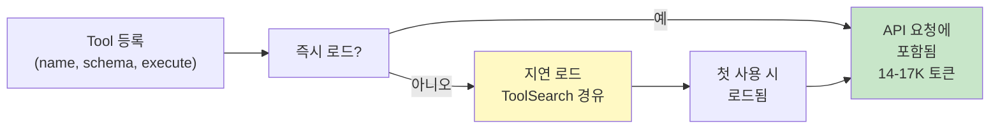
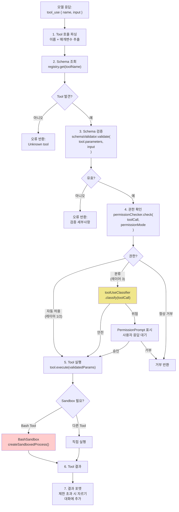
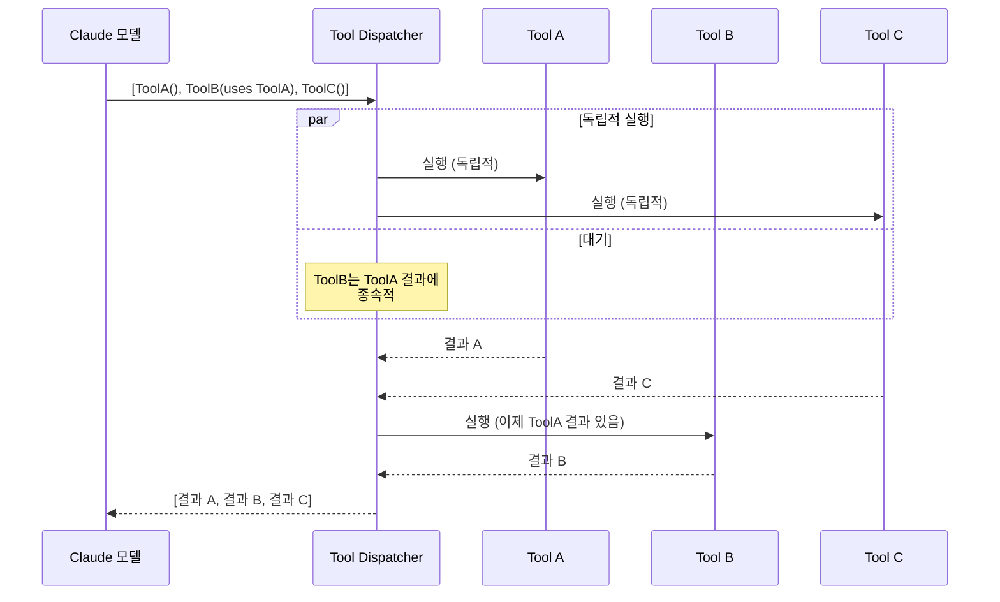
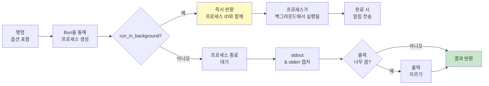
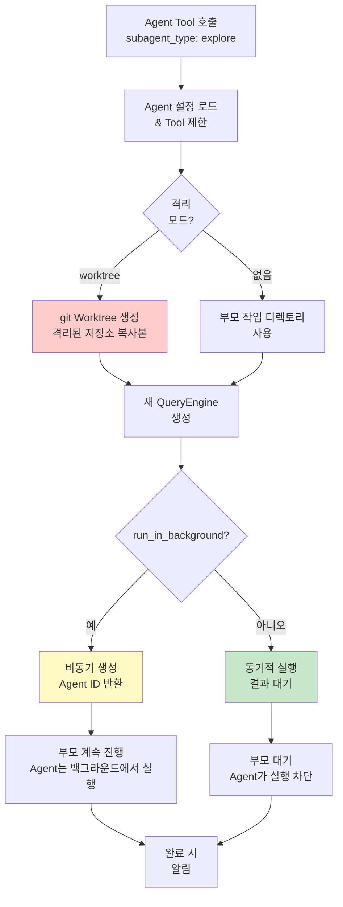
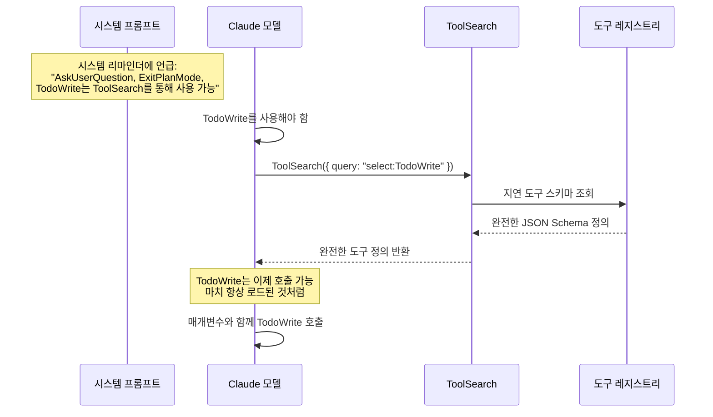

# Tool 시스템 개요

Claude Code의 Tool 시스템은 코딩 능력의 근간이다. 유출된 소스에서 **43+ 빌트인 Tool**이 확인되었으며, 각 Tool는 JSON Schema로 정의된다. Tool 정의는 API 요청당 **14-17K 토큰**을 소비합니다. 이는 시스템 프롬프트의 가장 큰 구성 요소입니다.

## Tool 등록 아키텍처

Claude Code 시스템은 사용 가능한 모든 Tool의 중앙 Registry를 유지합니다. 각 Tool는 이름, 설명, 매개변수 Schema, 실행 함수, 지연 로딩 사용 여부를 포함한 메타데이터로 정의됩니다. Registry는 다음 두 가지 Tool 카테고리를 구분합니다:

**즉시 로드 Tool**는 모든 API 요청에 포함됩니다. 이들은 Read, Write, Edit, Bash, Grep과 같은 가장 자주 사용되는 Tool입니다. 이들의 결합 Schema 크기(14-17K 토큰)는 시스템 프롬프트의 가장 큰 구성 요소를 나타냅니다.

**지연 Tool**는 ToolSearch Tool를 통해 필요에 따라 로드됩니다. 이들은 TodoWrite, AskUserQuestion, ExitPlanMode와 같이 덜 자주 사용되는 Tool를 포함합니다. 이들의 Schema를 지연시킴으로써 Claude Code는 모든 요청에서 3-5K 토큰을 절약하고, 모델이 구체적으로 필요할 때만 비용을 지불합니다.

각 Tool 정의는 완전한 인터페이스를 캡슐화합니다: 매개변수 검증을 위한 JSON Schema, Tool의 동작을 구현하는 비동기 실행 함수, 그리고 Tool를 평가할 권한 레이어를 제어하는 권한 메타데이터(읽기, 쓰기, 실행 또는 네트워크).



## Tool Dispatcher 파이프라인

모델이 Tool 호출을 반환하면, 이는 다단계 파이프라인을 거칩니다:



### 병렬 대 순차 Dispatcher

Claude가 단일 응답에서 여러 Tool 호출을 수행하면, Claude Code는 종속성을 존중하면서 병렬 처리를 극대화하도록 실행 순서를 자동으로 최적화합니다. Dispatcher는 Tool 호출 매개변수를 분석하여 한 Tool의 결과가 다른 Tool에서 참조되는 경우를 감지합니다(예: 이전 Tool의 출력을 입력으로 받는 Tool).

**독립적 Tool 호출**은 `Promise.all()`을 사용하여 동시에 실행됩니다. 예를 들어, 두 개의 관련 없는 파일 읽기 또는 세 개의 별도 디렉토리 검색은 모두 병렬로 수행될 수 있습니다. 이는 전체 실행 시간을 크게 단축합니다.

**종속 Tool 호출**은 순차적으로 실행됩니다. Tool B가 Tool A의 결과를 필요로 할 때, Dispatcher는 A가 완료될 때까지 기다렸다가 B를 호출합니다. 이는 매개변수 분석을 통해 감지됩니다. Tool B의 매개변수가 Tool A의 결과 자리 표시자를 참조하면 종속으로 취급됩니다.

Dispatcher는 원래 Claude의 Tool 호출 순서와 동일한 순서로 결과를 반환하여, 일부가 순서 무관하게 완료되었더라도 모델의 예상 순서를 유지합니다.



## 전체 Tool 카탈로그

### 파일 Tool

| Tool | 핵심 구현 세부사항 |
|------|---------------------------|
| **Read** | 내부적으로 `cat -n` 형식을 사용합니다. 이미지를 다중모드 입력용 base64로 읽습니다. PDF 읽기는 호출당 20페이지로 제한된 PDF 파서 라이브러리를 사용합니다. 큰 파일을 위한 `offset`/`limit` 매개변수가 있습니다. |
| **Write** | **이전 Read 필요**: `readFileTracker` 맵을 유지합니다. `file_path`가 추적기에 없고 파일이 존재하면 오류를 반환합니다. 이는 실수로 인한 덮어쓰기를 방지합니다. |
| **Edit** | 정규식이 아닌 정확한 문자열 매칭을 사용합니다. `old_string`이 여러 매칭을 가지면 모든 매칭 위치를 나열한 오류를 반환합니다. `replace_all` 플래그는 유일성 검사를 우회합니다. |
| **Glob** | 네이티브 glob 라이브러리를 래핑합니다. 결과는 `mtime` 기준으로 정렬됩니다 (가장 최근 수정 먼저). 파일 콘텐츠 읽기 없음. 순수 경로 매칭. |
| **Grep** | ripgrep (`rg`) 바이너리를 래핑합니다. 세 가지 출력 모드: `files_with_matches` (기본값, 경로만), `content` (매칭 줄 + 컨텍스트), `count` (매칭 개수). 기본 제한: 250개 결과. |

### 코드 인텔리전스 Tool

| Tool | 핵심 구현 세부사항 |
|------|---------------------------|
| **LSP Tool** | 언어 서버 프로토콜을 통해 코드 분석, 리팩토링, 자동 완성 및 타입 정보를 제공합니다. 타입스크립트, 파이썬, 루스트 등 지원. |

### 실행 Tool

| Tool | 핵심 구현 세부사항 |
|------|---------------------------|
| **Bash** | `BashSandbox`를 통해 생성됩니다. 작업 디렉토리는 호출 간에 유지됩니다 (세션 상태에 저장되지만), 셸 환경은 재설정됩니다. 기본 타임아웃: 120초, 최대 600초. `run_in_background` 플래그는 분리된 프로세스를 생성하고 즉시 반환합니다. |
| **NotebookEdit** | `.ipynb` JSON 구조를 파싱합니다. 작업: 셀 삽입, 셀 콘텐츠 교체, 셀 삭제. 노트북 메타데이터와 출력 셀을 보존합니다. |
| **PowerShell** | Windows 동등 실행 도구입니다. Bash와 동일한 보안 모델을 사용하여 샌드박스 환경에서 PowerShell 스크립트를 실행합니다. |
| **Sleep** (선택 기능: PROACTIVE/KAIROS) | 지정된 기간 동안 대기하는 도구입니다. 폴링 루프, 재시도 지연, 장기 실행 워크플로우에 사용됩니다. |

### Bash Sandbox 구현

Bash Tool는 Bun 런타임을 사용하여 격리된 Sandbox 환경에서 셸 명령을 실행합니다. 이 Sandbox는 여러 보호 레이어를 제공합니다: 파일시스템 제한은 명령을 프로젝트 작업공간에 한정하고, 환경 변수는 신중하게 제어되며, 명령 실행은 보안 위반에 대해 모니터링됩니다.

**작업 디렉토리 지속성**은 핵심 기능입니다. 각 세션은 여러 bash 호출에서 보존되는 지속적 작업 디렉토리를 유지합니다. 한 bash 호출에서 `cd /home/project`를 실행하면, 같은 세션의 후속 호출은 해당 디렉토리에서 시작합니다. 그러나 셸 환경 자체는 호출 간에 재설정됩니다. 환경 변수는 자동으로 지속되지 않습니다 (필요하면 명령이 이를 내보낼 수 있음).

**타임아웃 처리**는 사용자 경험에 중요합니다. 기본적으로 bash 명령은 120초 타임아웃을 가지며 최대 제한은 600초입니다. 이는 장시간 실행 중인 명령이 세션을 무기한 차단하는 것을 방지합니다. 백그라운드 실행은 `run_in_background` 매개변수를 통해 지원되며, 이는 분리된 프로세스를 생성하고 프로세스 ID와 함께 즉시 반환합니다. 백그라운드 작업이 완료되면 알림이 전송됩니다.

**출력 처리**는 매우 자세한 명령이 과도한 토큰을 소비하지 않도록 합니다. 도구 결과는 설정된 제한을 초과하면 자릅니다. 또한 샌드박스는 stdout과 stderr를 모두 캡처하고, 결합하여 Claude에 종료 코드와 함께 반환합니다.



**보안 검증**은 실행 전에 발생합니다. 모듈은 명령에서 위험한 패턴(rm -rf, 포맷 작업 등)을 분석하고 권한 규칙에 대해 검사합니다. 작업공간을 벗어나거나 제한된 경로에 액세스하려는 명령은 차단됩니다. 권한 모드는 이를 높일 수 있습니다: "auto" 모드는 화이트리스트 명령을 허용하고, "plan" 모드는 명시적 사용자 승인이 필요하며, "bypass" 모드는 신뢰할 수 있는 컨텍스트를 위해 검사를 비활성화합니다.

### 웹 Tool

| Tool | 핵심 구현 세부사항 |
|------|---------------------------|
| **WebSearch** | 제목, URL, 스니펫이 있는 검색 결과를 반환합니다. Prompt Injection 가드: 의심스러운 콘텐츠가 감지되면 결과에 플래그가 지정됩니다. |
| **WebFetch** | URL을 가져오고 읽을 수 있는 콘텐츠를 추출합니다 (HTML → 텍스트). 결과는 대화에 포함되기 전에 Prompt Injection 검사를 받습니다. |

### Agent Tool

| Tool | 핵심 구현 세부사항 |
|------|---------------------------|
| **Agent** | 복잡한 Tool입니다. 자신의 `QueryEngine`을 가진 새 프로세스를 생성합니다. `subagent_type` 매개변수는 Tool 제한을 선택합니다. `isolation: "worktree"`는 파일시스템 격리를 위해 git Worktree를 생성합니다. `run_in_background`는 비동기 실행을 활성화합니다. |
| **ToolSearch** | 지연 Tool Schema를 가져옵니다. 쿼리 모드: 정확 매칭을 위한 `"select:Name"`, 퍼지 검색을 위한 키워드. 완전한 JSON Schema 정의를 반환합니다. |

### Agent 생성 내부

Agent 생성은 Claude Code의 병렬, 전문화된 작업 메커니즘입니다. Agent Tool를 호출하면, Claude Code는 자신의 시스템 프롬프트, Tool 세트, 실행 컨텍스트를 가진 쿼리 엔진의 새 인스턴스를 시작합니다. 이는 다양한 Agent가 다양한 작업(탐색, 아키텍처, 쓰기 등)에 특화될 수 있는 정교한 다중 Agent 워크플로우를 활성화하면서 격리와 제어를 유지합니다.

**Agent 타입은 능력 범위를 결정합니다.** Agent를 생성할 때, `subagent_type`(예: "explore", "architect", "writer")을 지정합니다. 각 타입은 미리 정의된 허용 Tool 세트와 사용자 정의 시스템 프롬프트를 가집니다. 예를 들어, Explore Agent는 Read, Grep, Glob, Bash에 액세스할 수 있지만 Edit, Write, 또는 Agent Tool는 사용할 수 없습니다. 이는 실수로 인한 수정이나 무한 Subagent 생성을 방지합니다. 이 설계는 Agent가 자신의 책임 범위 내에 머물도록 보장합니다.

**격리 모드**는 작업공간 가시성을 제어합니다. 기본적으로 Agent는 부모의 작업 디렉토리를 상속하고 모든 파일을 볼 수 있습니다. `isolation: "worktree"`를 사용하면, Claude Code는 임시 git Worktree를 생성합니다. 이는 별도 분기에 대한 저장소의 완전한 복사본입니다. Agent는 격리 상태에서 작업하며; 변경사항은 명시적으로 병합될 때까지 주 분기에 영향을 주지 않습니다. 이는 탐색 작업 또는 위험한 작업에 매우 가치 있습니다.

**백그라운드 실행**은 부모 에이전트가 작업을 위임할 수 있게 하며 차단하지 않습니다. `run_in_background: true`일 때, 에이전트는 비동기적으로 생성되고 에이전트 ID와 함께 즉시 반환합니다. 부모는 에이전트가 완료되면 알림을 받습니다. 이는 한 에이전트가 여러 워커를 생성하고, 이들의 결과를 수집하고, 결합하는 워크플로우를 잠금 해제합니다. 모두 단일 부모 세션 내에서.



**시스템 프롬프트 사용자 정의**는 Agent 특화의 핵심입니다. 각 Agent 타입은 자신의 도메인을 강조하는 사용자 정의 시스템 프롬프트를 받습니다. explore Agent는 발견과 진단에 집중하고, 아키텍트는 설계 결정에, 작가는 콘텐츠 품질에. 이 프롬프트 엔지니어링은 Tool 제한과 결합되어 부모의 쿼리에서 명시적 지시사항이 필요 없이 Agent 동작을 형성합니다.

**부모-자식 관계**가 추적됩니다. 생성된 Agent는 부모의 ID를 알고 있으며, 양방향 통신을 활성화합니다 (부모는 메시지를 보낼 수 있고, Agent는 부모에게 알릴 수 있음). 이 관계는 결과를 부모에게 보고해야 하는 백그라운드 Agent와 대규모 다중 Agent 워크플로우를 조율하는 조정자 모드에 필수적입니다.

### 작업 & 조정 Tool

| 도구 | 파일 | 핵심 구현 세부사항 |
|------|------|---------------------------|
| **TodoWrite** | `todoWrite.ts` | 상태를 가진 작업 배열을 관리합니다: `pending`, `in_progress`, `completed`. 불변성을 강제합니다: 정확히 한 작업이 `in_progress` 상태입니다. 작업은 `content`(명령형) 및 `activeForm`(현재 연속형) 필드를 가집니다. |
| **Skill** | `skill.ts` | 코드베이스에서 스킬을 로드합니다. 스킬은 사전 구축 워크플로우입니다(예: `commit.ts`는 전체 git 커밋 프로토콜을 구현). `/skill-name` 또는 상황적 패턴으로 트리거됩니다. |
| **TaskOutput** | `taskOutput.ts` | 오프셋 기반 페이지 매김을 사용하여 작업 출력 스트림 또는 읽기 (블로킹 또는 폴링 모드). |
| **CronCreate** (선택 기능: AGENT_TRIGGERS) | Cron 일정 생성 (cron 표현식 또는 간격). |
| **CronDelete** (선택 기능: AGENT_TRIGGERS) | 기존 Cron 일정 제거. |
| **CronList** (선택 기능: AGENT_TRIGGERS) | 모든 활성 Cron 일정 나열. |
| **AskUserQuestion** | 사용자로부터 입력 또는 선택 요청. |
| **SendMessage** | 실행 중인 에이전트 작업으로 메시지 전송 (메일박스 통신). |

### Agent & Worktree Tool

| 도구 | 핵심 구현 세부사항 |
|------|---------------------------|
| **Agent** | 복잡한 Tool입니다. 자신의 `QueryEngine`을 가진 새 프로세스를 생성합니다. `subagent_type` 매개변수는 Tool 제한을 선택합니다. `isolation: "worktree"`는 파일시스템 격리를 위해 git Worktree를 생성합니다. `run_in_background`는 비동기 실행을 활성화합니다. |
| **EnterWorktree** | 격리된 git Worktree를 생성하고 세션을 이동시킵니다. 별도 분기의 저장소 완전 복사본을 생성합니다. |
| **ExitWorktree** | Worktree 세션을 종료하고 원래 작업 디렉토리로 복원합니다. |
| **TeamCreate** | 여러 Agent가 함께 프로젝트를 조정하는 팀을 생성합니다. |
| **TeamDelete** | 팀과 작업 리소스를 제거합니다. |
| **EnterPlanMode** | 코드베이스를 탐색하고 사용자 승인을 위한 구현 접근 방식을 설계합니다. |
| **ExitPlanMode** | 계획 설계를 완료하고 사용자 승인을 요청합니다. |
| **ToolSearch** | 지연 Tool Schema를 가져옵니다. 쿼리 모드: 정확 매칭을 위한 `"select:Name"`, 퍼지 검색을 위한 키워드. |

### MCP 도구

| 도구 | 파일 | 핵심 구현 세부사항 |
|------|------|---------------------------|
| **MCP 브릿지** | `mcp/mcpToolBridge.ts` | Model Context Protocol을 통해 연결된 MCP 서버로 도구 호출을 전달합니다. 도구 스키마는 서버 연결 시 동적으로 로드됩니다. **세션 접미사**에 배치됩니다 (캐시되지 않음). 서버 연결에 따라 변경되기 때문입니다. |

## 도구 스키마 크기 분석

왜 도구 정의는 14-17K 토큰을 소비합니까?

```
도구 스키마 토큰 분석 (대략):
├── Read:           ~800 토큰  (복잡한 매개변수: file_path, offset, limit, pages)
├── Write:          ~400 토큰
├── Edit:           ~600 토큰  (상세한 교체 의미)
├── Bash:           ~1,200 토큰 (광범위한 사용 노트, 안전 규칙)
├── Grep:           ~900 토큰  (많은 매개변수: pattern, glob, type, output_mode, context)
├── Glob:           ~300 토큰
├── Agent:          ~2,000 토큰 (5개 에이전트 타입, 모든 매개변수, 상세한 브리핑 가이드)
├── TodoWrite:      ~1,500 토큰 (복잡한 상태 머신, 사용 시기 / 미사용 시기)
├── AskUserQuestion: ~800 토큰 (옵션 스키마, 다중선택, 미리보기)
├── Skill:          ~300 토큰
├── ToolSearch:     ~400 토큰
├── WebSearch:      ~200 토큰
├── WebFetch:       ~200 토큰
├── NotebookEdit:   ~400 토큰
├── ExitPlanMode:   ~400 토큰
├── 기타 도구:      ~2,500 토큰
└── 합계:           ~12,000-14,000 토큰 (도구 정의만)
    + 시스템 프롬프트의 사용 지시사항: ~3,000 토큰
    = ~14,000-17,000 토큰 총 도구 관련 콘텐츠
```

`Agent`와 `TodoWrite` 도구는 가장 토큰이 비싼 이유는 이들의 설명에 광범위한 행동 지침이 포함되어 있기 때문입니다. 단순 스키마뿐만 아니라 이들을 효과적으로 사용하는 방법과 시기에 대한 지시사항을 포함합니다.

## 지연 도구 로딩 패턴

모든 도구 스키마가 미리 로드되지는 않습니다. 일부는 초기 토큰 비용을 줄이기 위해 지연 로딩 패턴을 사용합니다:



이 패턴은 드물게 사용되는 도구에 대해 초기 시스템 프롬프트 크기를 약 3-5K 토큰 줄입니다.
