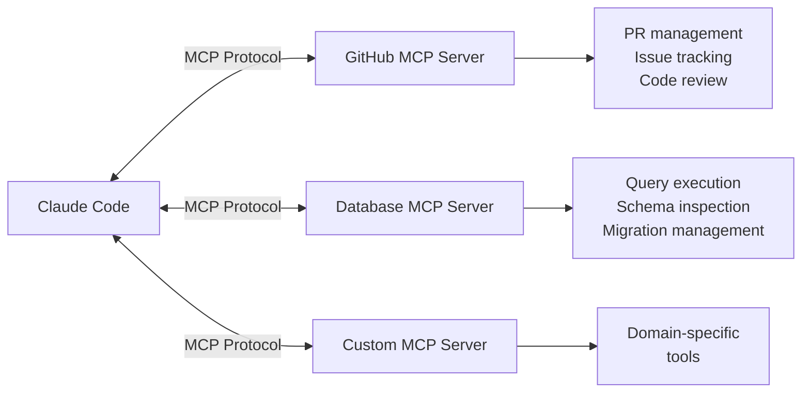
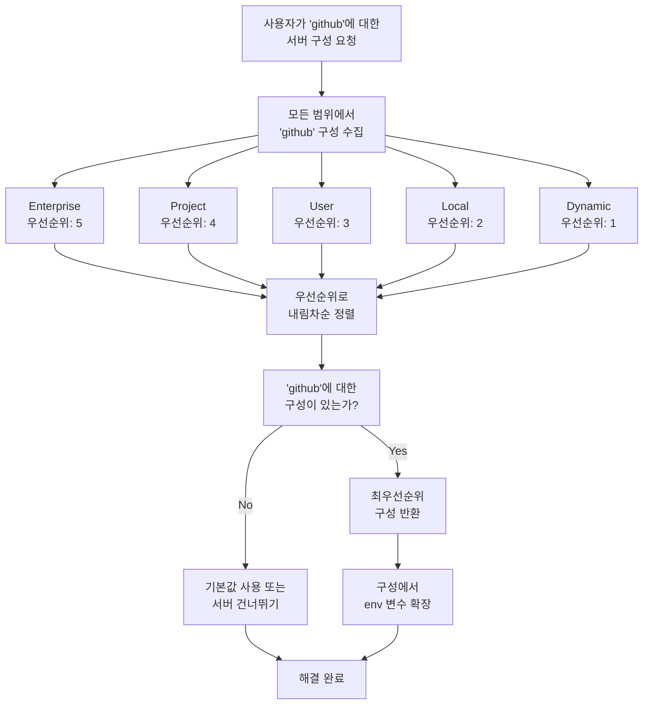
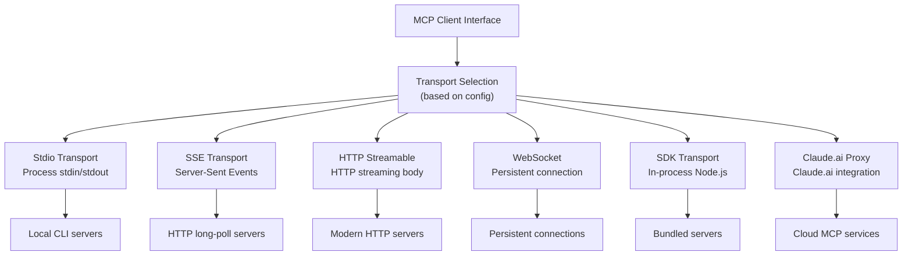
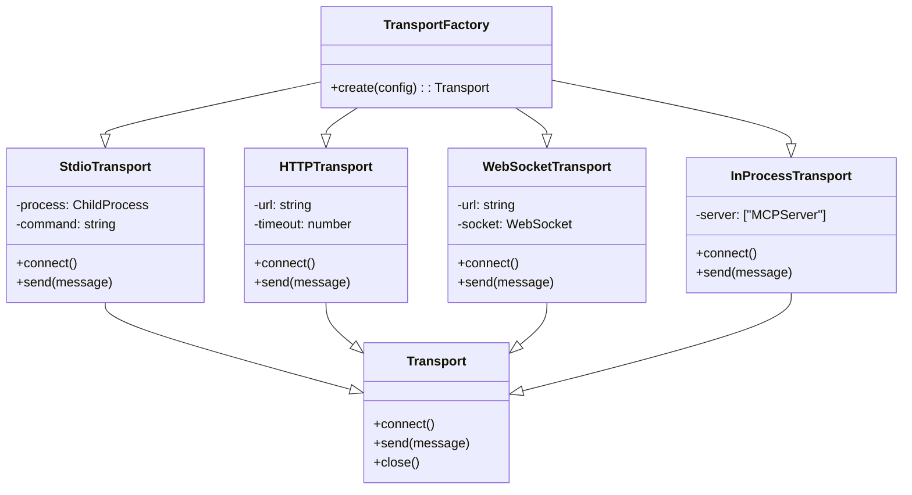
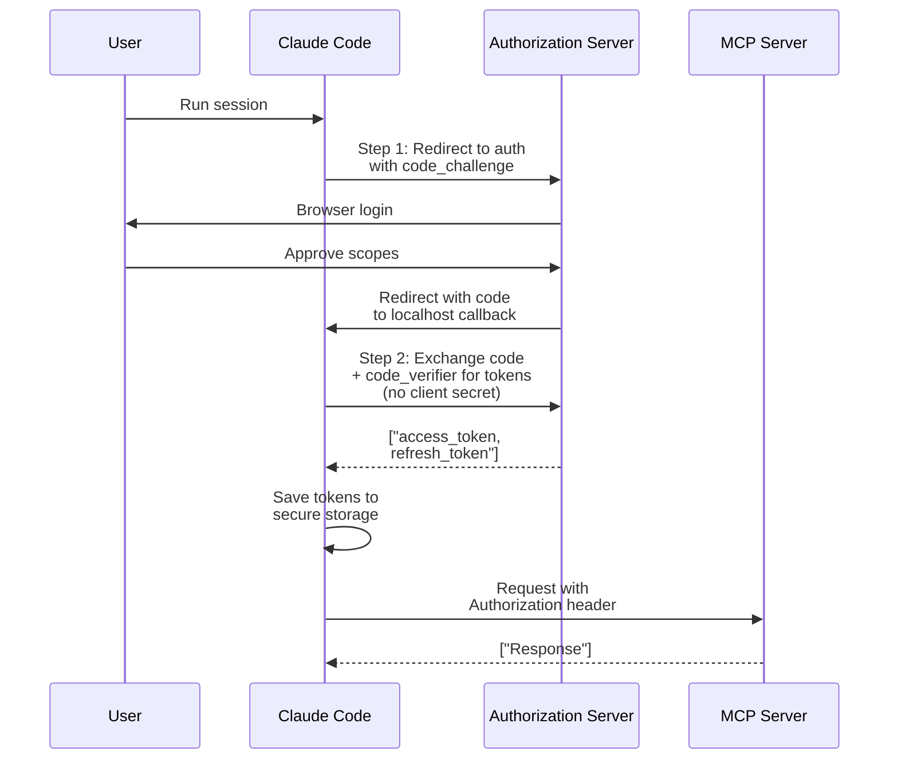
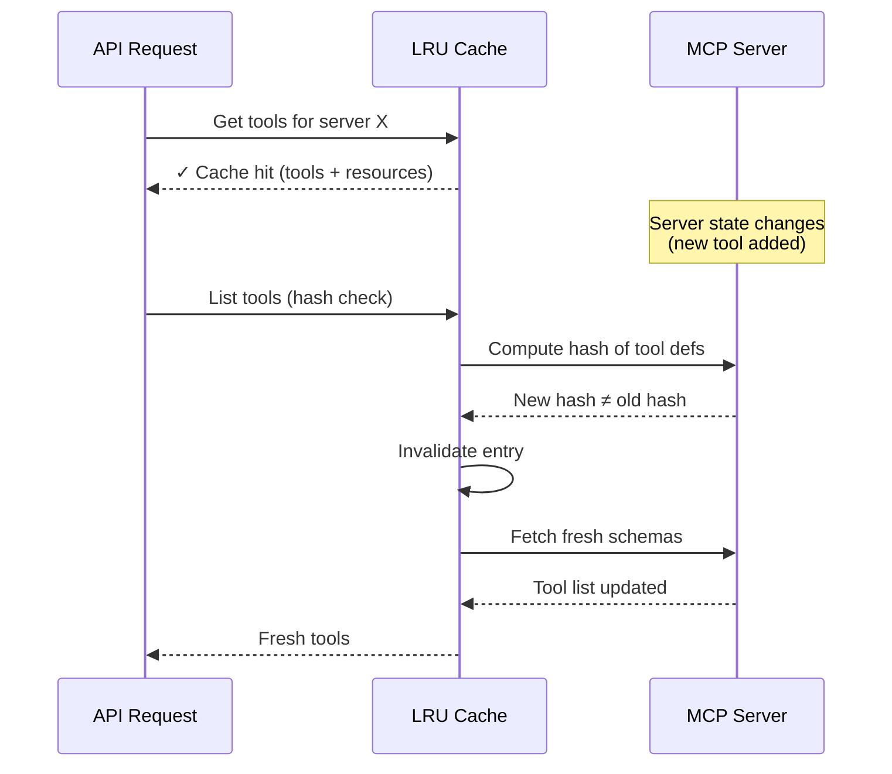
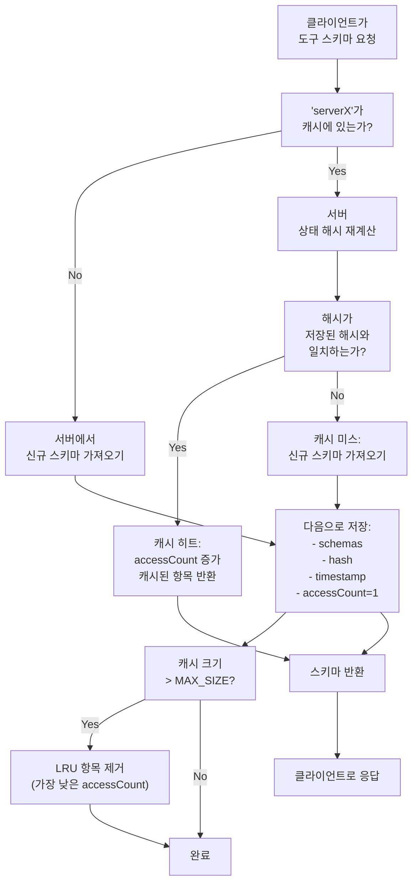
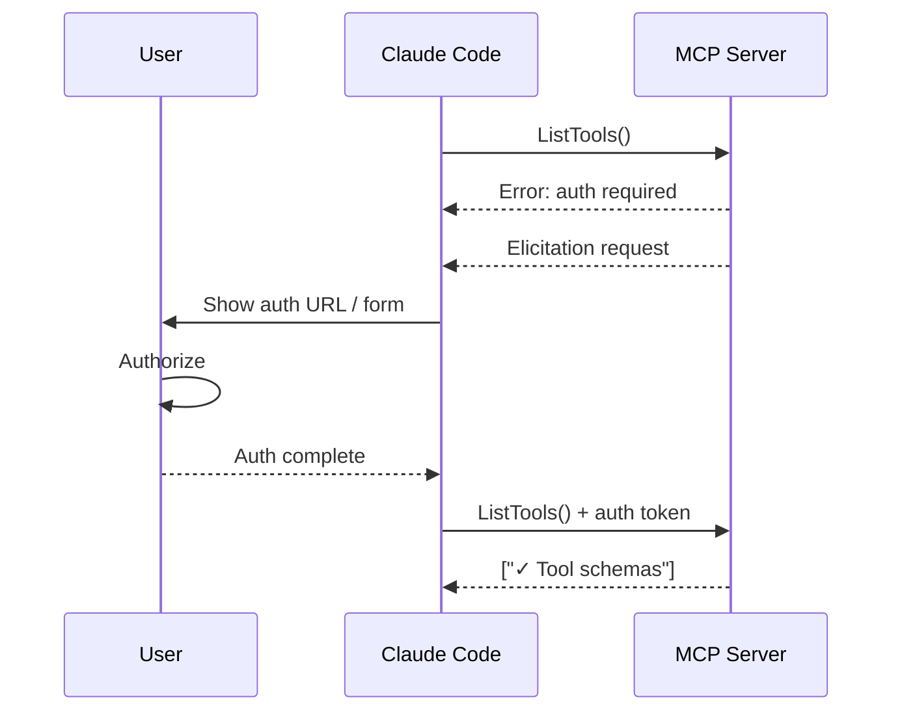
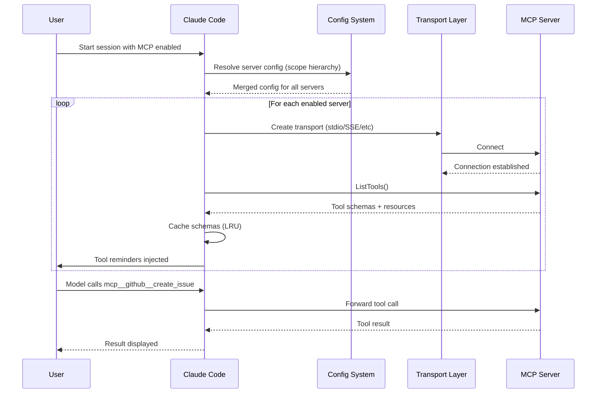

# MCP Tool

## 모델 컨텍스트 프로토콜 통합

Claude Code는 [Model Context Protocol (MCP)](https://modelcontextprotocol.io/) 서버와 통합하여 Tool 기능을 동적으로 확장합니다. 구현은 다중 트랜스포트 지원, 계층적 구성, 정교한 캐싱 전략을 갖춘 완전한 MCP 클라이언트입니다.

### Claude Code에서 MCP 작동 원리



### 주요 속성

| 속성 | 값 |
|----------|-------|
| Protocol | Model Context Protocol (MCP) |
| Loading | 동적. 서버가 연결될 때 도구 나타남. |
| Placement | Tool Schema가 세션 suffix에 추가됨 (캐시되지 않음) |
| Namespace | Tool는 `mcp__servername__toolname` 접두사를 사용합니다 |
| Transport | 여러 트랜스포트: stdio, SSE, HTTP Streamable, WebSocket, SDK, Claude.ai proxy |
| Config | 계층적 범위: Enterprise > Project > User > ClaudeAI > Dynamic |

---

## MCP 아키텍처 개요

Claude Code의 MCP 클라이언트는 정교한 다층 시스템입니다:

1. **Server Management**: 검색, 라이프사이클, 구성
2. **Transport Abstraction**: 여러 프로토콜을 단일 인터페이스로 통합
3. **Tool Schema Loading**: 지연 로딩 패턴을 사용한 동적 검색
4. **Resource Access**: MCP Resources를 통한 읽기 전용 리소스 검색
5. **Caching Layer**: 해시 기반 무효화를 사용한 LRU 캐시
6. **Authentication**: 안전한 인증을 위한 OAuth + XAA 토큰 교환
7. **Elicitation Handling**: 서버의 사용자 입력 요청
8. **Session Integration**: 캐시 정확성을 위해 세션 suffix의 Tool Schema

---

## 구성 계층 구조 (7개 범위)

MCP 서버는 상위 범위가 우선순위를 갖는 계층적 범위 시스템을 사용하여 구성합니다:

```
Enterprise 
    ↓
Project (저장소 루트의 .claude/settings.json)
    ↓
User (홈 디렉토리의 ~/.claude/settings.json)
    ↓
ClaudeAI (Claude.ai 워크스페이스 설정)
    ↓
Dynamic 
```

**범위 특성:**

| 범위 | 위치 | 오버라이드 동작 | 사용 사례 |
|-------|----------|-------------------|----------|
| **Enterprise** | 조직 정책 | 오버라이드될 수 없음 | 보안 정책, 규정 준수 요구사항 |
| **Project** | `.claude/settings.json` | User/ClaudeAI/Dynamic 오버라이드 | 팀 표준, 저장소 특정 서버 |
| **User** | `~/.claude/settings.json` | ClaudeAI/Dynamic 오버라이드 | 개인 선호사항, 로컬 도구 |
| **ClaudeAI** | Claude.ai 워크스페이스 | Dynamic 오버라이드 | 웹 인터페이스 설정 |
| **Dynamic** | 런타임 매개변수 | 최우선순위 | 임시 구성 |

### 구성 해결

Claude Code는 모든 범위를 병합하여 최우선순위 버전을 선택하는 방식으로 MCP 서버 구성을 해결합니다. 여러 범위에서 동일한 서버를 정의할 때, 해결 알고리즘은 범위 우선순위를 비교하고 가장 높은 순위를 사용합니다.

구성 해결 프로세스는 결정론적입니다. 각 서버 이름에 대해 Claude Code는 활성화된 모든 범위(enterprise, project, user, local, claudeai, dynamic)에서 일치하는 모든 구성을 수집하고, 범위 우선순위로 정렬한 후 첫 번째 일치를 반환합니다. 이는 로드 순서나 초기화 시퀀스에 관계없이 일관된 동작을 보장합니다.

범위 우선순위는 조직 계층을 따릅니다. Enterprise 는 Project보다 우선하고, Project는 User를 재정의하고, User는 ClaudeAI를 재정의하고, ClaudeAI는 Dynamic 을 재정의합니다. 이 설계는 조직 정책이 개인의 선택을 제한해야 한다는 원칙을 반영하면서 사용자에게 그 범위 내에서 유연성을 제공합니다.

서버 구성의 환경 변수는 해결 시 확장됩니다. 누락된 변수는 경고를 생성하지만 서버 시작을 방해하지 않습니다. 실제 연결 시도에서 진정한 오류(예: 서버가 인증을 시도할 때 누락된 `GITHUB_TOKEN`)를 감지합니다.



---

## 트랜스포트 추상화 (6개 트랜스포트)

Claude Code의 MCP 구현은 구성을 기반으로 자동으로 선택되는 여러 트랜스포트 프로토콜을 추상화하는 **단일 클라이언트 인터페이스**를 사용합니다:



### 트랜스포트 비교

| 트랜스포트 | 프로토콜 | 양방향 | 지연 시간 | 최적 사용 |
|-----------|----------|--------------|---------|----------|
| **Stdio** | stdin/stdout pipes | 예 | 낮음 | 로컬 CLI 서버 (GitHub CLI, DB 도구) |
| **SSE** | HTTP long-polling | 한 방향 (polling) | 중간 | WebSocket 없는 HTTP 서버 |
| **HTTP Streamable** | HTTP streaming body | 예 | 낮음-중간 | 스트리밍을 지원하는 최신 HTTP 서버 |
| **WebSocket** | WS protocol | 예 | 낮음 | 영구 연결, 실시간 통신 |
| **SDK** | In-process | 예 | 최소 | 번들/임베드 서버, 테스트 |
| **Claude.ai Proxy** | Proxy protocol | 예 | 네트워크 | Claude.ai 워크스페이스 통합 |

### 트랜스포트 팩토리 패턴

Claude Code는 서버 구성 유형을 기반으로 트랜스포트를 인스턴스화하기 위해 팩토리 패턴을 사용합니다. 팩토리는 각 트랜스포트 유형을 구체적인 구현에 매핑하고, 구성 매개변수(URL, 환경 변수, 타임아웃)를 트랜스포트 생성자에 전달합니다.

트랜스포트 선택은 상태 비저장이고 결정론적입니다. 동일한 구성은 항상 동일한 트랜스포트 유형을 생성합니다. 팩토리는 인스턴스화 시 트랜스포트 유형을 검증하고, 알 수 없는 유형이 발견되면 빠르게 실패합니다(프로덕션에서는 발생하지 않아야 하며, 구성 검증은 팩토리 호출 전에 발생합니다).

로컬 트랜스포트(stdio)의 경우, 팩토리는 명령 경로를 해결하고 서브프로세스 생성을 위한 환경 변수를 전달합니다. 원격 트랜스포트(SSE, HTTP, WebSocket)의 경우, URL을 구성하고 타임아웃 및 재시도 횟수 같은 네트워크 옵션을 전달합니다. SDK 트랜스포트는 동적으로 Node.js 모듈을 로드하고 트랜스포트 어댑터로 래핑합니다. Claude.ai 프록시 트랜스포트는 원격 Claude.ai 세션에서만 사용됩니다.



---

## 인증: OAuth + XAA 토큰 교환

MCP 서버는 인증이 필요할 수 있습니다. Claude Code는 두 가지 인증 패턴을 지원합니다:

### 1. RFC 8693 Cross-App Access (XAA)

XAA는 CLI 환경에서 브라우저 팝업 없이 안전한 토큰 교환을 가능하게 합니다. MCP 서버에 인증이 필요한 경우:

```
User → Claude Code → Token Exchange Service → OAuth Provider
         ↓
    사용자가 임시 토큰을 받습니다
         ↓
    토큰이 Authorization 헤더에서 MCP 서버로 전송됩니다
```

**사용 사례:** CLI 기반 서버 (GitHub, Jira, Anthropic)가 터미널 흐름을 방해하지 않고 사용자 신원이 필요한 경우.

### 2. OAuth 클라이언트 플로우

Claude Code는 여러 OAuth 인증 패턴을 지원합니다. 표준 OAuth 클라이언트 자격증명 흐름은 PKCE (Proof Key for Code Exchange)를 사용하여 CLI 환경에서 클라이언트 비밀을 노출하지 않고 안전하게 인증 코드를 토큰으로 교환합니다.

**표준 OAuth (Authorization Code + PKCE):**
1. 무작위 `code_verifier` (43-128자) 생성
2. `code_challenge = BASE64URL(SHA256(code_verifier))` 계산
3. `code_challenge` 및 `redirect_uri = localhost:RANDOM_PORT`와 함께 인증 서버로 리디렉트
4. 사용자가 인증하고 범위 승인
5. 인증 서버가 로컬 콜백 서버로 인증 코드와 함께 리디렉트
6. 코드 + code_verifier를 토큰으로 교환 (요청에 클라이언트 비밀 없음)

**API Key / Static Token:**
정적 인증(API 키, 베어러 토큰)을 사용하는 서버의 경우, 보안 스토리지에 저장하고 모든 요청에서 Authorization 헤더를 통해 주입합니다.

**HTTP Basic Auth:**
HTTP Basic 인증이 필요한 레거시 서버의 경우, 자격증명을 `BASE64(username:password)`로 인코딩하고 Authorization 헤더에 첨부합니다.



---

## LRU 캐시 전략

MCP 도구 및 리소스 스키마는 모든 요청에서 서버 상태를 다시 가져오지 않도록 LRU (Least Recently Used) 캐시를 사용하여 캐시됩니다:

### 캐시 아키텍처



### 캐시 무효화 전략

Claude Code의 MCP 스키마 캐시는 두 가지 레벨 검증 전략을 사용합니다: **해시 기반 무효화** 및 **LRU 제거**. 각 캐시 항목은 서버의 현재 기능(도구 목록, 리소스 목록, 버전) 해시를 저장합니다. 캐시된 스키마를 반환하기 전에, 캐시는 이 해시를 다시 계산하고 저장된 값과 비교합니다. 다르면 해당 서버에 대한 캐시가 무효화되고 새 스키마를 가져옵니다.

이 접근 방식은 비용이 많이 드는 폴링을 피하면서 스키마 신선도를 보장합니다. 서버는 Claude Code의 지식 없이 도구를 추가/제거할 수 있으며, 다음 스키마 접근에서 불일치를 감지하고 업데이트된 목록을 가져옵니다. 자주 새 도구를 노출하는 서버의 경우에도 해시 확인이 매번 다시 가져오고 파싱하는 것보다 저렴합니다.

**LRU (Least Recently Used) 제거:**
캐시는 최대 100개 항목을 유지합니다. 가득 차면, 가장 낮은 접근 횟수(타임스탬프 기준으로 가장 오래된 것)를 가진 항목이 제거됩니다. 이는 자주 접근하는 서버는 캐시에 유지되고 거의 사용되지 않는 서버는 공간이 필요할 때 버려집니다.



**캐싱이 중요한 이유:**
- MCP 도구 스키마는 클 수 있음 (도구당 2-5KB)
- 서버는 10-100개 이상의 도구를 노출할 수 있음
- 모든 요청에서 다시 가져오면 지연 시간과 네트워크 오버헤드 추가
- 해시 기반 무효화는 불필요한 다시 가져오기 없이 신선도 보장

---

---

## Elicitation 처리

MCP 서버는 **Elicitation** 기능을 통해 서버가 독립적으로 얻을 수 없는 정보가 필요한 시나리오에서 사용자 입력을 요청할 수 있습니다(예: MFA 코드, 사용자 선호사항, 동적 자격증명). Claude Code는 두 가지 Elicitation 모드를 구현합니다:

**URL 기반 Elicitation:**
서버가 URL을 제공하고 사용자에게 방문하도록 요청합니다(일반적으로 디바이스 인증 또는 다중 요소 인증). Claude Code는 UI에 URL을 표시하고, 선택적으로 사용자의 브라우저에서 열며, 사용자가 흐름을 완료할 때까지 대기합니다. 서버는 Elicitation 완료 알림을 통해 콜백하여 프로세스 완료를 확인합니다. 이 모드는 5분 타임아웃을 가집니다.

**양식 기반 Elicitation:**
서버가 입력 필드(사용자 이름, 암호, OTP 등)를 설명하는 JSON Schema를 제공합니다. Claude Code는 터미널 양식을 렌더링하고, 사용자 입력을 캡처하고, 구조화된 데이터를 JSON으로 서버에 반환합니다. 양식 기반 Elicitation은 동기식이며, 서버는 응답을 받기 전까지 대기합니다.

**Elicitation Hooks:**
애플리케이션은 hook을 통해 사용자 정의 Elicitation 핸들러를 등록할 수 있습니다. 이를 통해 테스트 스위트는 자동화된 응답을 제공하고 보안 도구는 Elicitation 요청을 프로그래밍 방식으로 감사/승인/거부할 수 있습니다.

모든 Elicitation 요청에는 추적을 위한 요청 ID와 취소를 위한 abort 신호가 포함됩니다. 사용자가 취소하거나 요청이 타임아웃되면 서버는 "cancel" 응답을 받고 정리를 우아하게 처리해야 합니다(재시도 약정 없음).

**사용 패턴:**



---

## In-Process 트랜스포트

번들되거나 임베드된 MCP 서버가 동일한 Node.js 프로세스에서 실행되는 경우, Claude Code는 `createLinkedTransportPair()`를 사용하는 쌍을 이루는 트랜스포트 설계를 구현합니다. 이 트랜스포트 쌍은 `queueMicrotask()`를 사용하여 메시지를 비동기로 전달하므로, 동기 요청/응답 사이클에서 스택 깊이 문제를 피하면서 모든 것을 프로세스 내에 유지합니다.

**아키텍처:**
in-process 트랜스포트 쌍은 두 개의 연결된 트랜스포트(`a` 및 `b`)로 구성됩니다. `a.send(message)`가 호출되면, 메시지는 `b.onmessage(message)`를 호출하도록 microtask로 대기열에 추가되며, 그 반대도 마찬가지입니다. 이를 통해 MCP 클라이언트와 서버가 서로를 차단하지 않고 동일한 이벤트 루프에서 실행되면서도 메시지 순서를 보존하고 양쪽 중 하나가 닫힐 때 적절한 정리를 가능하게 합니다.

**메시지 흐름:**
1. 클라이언트가 `clientTransport.send(request)` 호출
2. 메시지는 서버로 전달하기 위해 microtask로 대기열에 추가됨
3. 서버의 `onmessage` 핸들러가 요청 처리
4. 서버가 `serverTransport.send(response)` 호출
5. 응답은 클라이언트로 돌아가기 위해 microtask로 대기열에 추가됨
6. 클라이언트의 `onmessage` 핸들러가 응답 수신

**장점:**
- 프로세스 간 통신(IPC) 오버헤드 없음
- 부모 프로세스와 공유 메모리 공간
- 서브프로세스 생성이나 포트 할당 없음
- 차단 없는 적절한 async/await 지원
- 테스트 및 임베드된 고성능 도구에 이상적

**사용 사례:**
- Claude Code와 번들된 기본 제공 MCP 서버
- 프로세스를 생성하지 않고 MCP 구현 테스트
- 격리가 필요 없는 고성능 로컬 도구
- 개발 및 플러그인 MCP 서버

---

## 프롬프트 캐싱에 미치는 영향

MCP Tool Schema는 시스템 프롬프트의 **세션 특정 suffix**에 배치되며, 캐시 가능한 prefix에 배치되지 않습니다. 이는 캐시 효율성에 매우 중요합니다:

### 캐시 가능한 prefix에 배치하지 않는 이유?

1. **Dynamic Connections:** MCP 서버는 세션 중에 연결/연결 해제 가능
2. **Schema Changes:** 서버가 Tool를 추가/제거하면 캐시가 모든 변경마다 깨짐
3. **Tool Count Variability:** 다른 사용자가 다른 서버 연결
4. **Prefix Length:** Schema 정의는 세션당 5-10KB 이상의 토큰 소비

### 접미사 배치 전략

시스템 프롬프트 구조:
- [CACHED PREFIX]: Core instructions, Built-in Tool Schemas (14-17K tokens), General rules
- [SESSION SUFFIX - NOT CACHED]: MCP Tool Schemas (mcp__github__*, mcp__database__*, mcp__custom__*), Dynamic Tool list
- [CONVERSATION HISTORY]: Previous messages & Tool calls

**결과:** MCP Tool를 동적으로 유지하면서 프롬프트 캐싱 가능.

### Tool 명명 규칙

모든 MCP Tool는 서버 이름으로 접두사가 붙습니다:

`mcp__<servername>__<toolname>`

예시:
- mcp__github__create_pull_request
- mcp__github__list_issues
- mcp__aws__s3_list_buckets
- mcp__stripe__create_charge

---

## MCP Tool 검색

Claude Code는 MCP Tool 및 리소스에 접근하기 위한 두 가지 메커니즘을 제공합니다:

### 1. 시스템 리마인더를 통한 Tool 검색

MCP 서버가 연결되면, Claude Code는 시스템 리마인더에 Tool 이름을 주입합니다:

사용 가능한 MCP Tool:
- mcp__github__create_pull_request
- mcp__github__list_issues
- mcp__github__get_pull_request
- mcp__database__execute_query
- mcp__database__list_tables

### 2. 지연 Schema 로딩

Tool Schema는 **ToolSearch**를 통해 필요할 때 로드됩니다. 이 기본 제공 Claude Code Tool는 MCP 서버에서 전체 Tool 정의를 가져옵니다. ToolSearch Tool는 두 가지 쿼리 모드를 지원합니다:

**정확한 조회 (`select:ToolName`):**
명명된 Tool의 정확한 Schema를 요청합니다. 모델이 정확히 어떤 Tool를 사용할지 알 때 유용합니다. Tool가 존재하지 않으면 HTTP 404를 반환합니다.

**퍼지 검색 (키워드):**
공백으로 구분된 키워드 목록을 제공합니다(예: "list pull requests"). ToolSearch는 서버에서 모든 Tool를 가져오고, 각 Tool의 설명을 키워드에 대해 점수화하고, 상위 일치의 전체 Schema를 반환합니다. 정확한 Tool 이름을 모르는 탐색 쿼리에 유용합니다.

**왜 지연 로딩인가?**
서버 연결에서 모든 Tool Schema를 가져오면 지연 시간이 추가되고 거의 사용되지 않는 Tool로 프롬프트가 부풀어집니다. 지연 로딩은 모델이 실제로 Tool를 요청할 때까지 Schema 가져오기를 지연시켜 세션 시작 시간과 토큰 사용을 줄입니다. 캐싱 레이어는 동일한 Tool에 대한 반복 호출이 캐시된 Schema를 재사용하도록 보장합니다.

**구현:**
ToolSearch는 그 자체로 Claude Code 시스템 프롬프트에 등록된 MCP 스타일 Tool입니다. 호출되면 요청된 MCP Tool를 설명하는 ToolSchema 객체를 반환합니다. 모델은 그 Schema를 사용하여 실제 MCP Tool를 호출할 수 있습니다. 이는 두 단계 흐름을 만듭니다: (1) 모델이 ToolSearch를 호출하여 Schema를 가져오고, (2) 모델이 실제 MCP Tool를 호출합니다.

### 3. 리소스 접근 Tool

MCP 서버는 Tool와 별개로 **Resources** (읽기 전용 데이터)를 노출할 수 있습니다:

MCP 리소스에 동적으로 접근:
- 서버에서 사용 가능한 리소스 나열: listMCPResources('github')
- 반환: [{ name: 'issues', description: 'GitHub issues' }, { name: 'pull-requests', description: 'GitHub PRs' }]
- 리소스 읽기: readMCPResource('github', 'issues', { repo: 'owner/repo' })

**Resource vs Tool:**
- **Tools:** 호출하는 함수; 서버가 동작 수행
- **Resources:** 읽는 데이터; 서버가 정보 제공

### 4. 공식 MCP 레지스트리

Claude Code는 MCP 프로젝트에서 검증된 모든 게시된 MCP 서버를 나열하는 **공식 MCP 레지스트리**를 유지합니다. 레지스트리는 시작 시 비동기적으로 가져오고(fire-and-forget) 세션에 대해 메모리에 캐시됩니다. 레지스트리에는 디스커버리 URL, 권장 트랜스포트 유형, 간단한 설명과 같은 서버 메타데이터가 포함됩니다.

**레지스트리 목적:**
1. **신뢰 신호:** 공식 레지스트리의 서버는 기본 보안 검증을 통과했습니다
2. **분석:** Claude Code는 MCP 서버 사용을 태깅할 수 있습니다(예: "사용자가 공식 레지스트리 서버 X에서 도구를 호출함")
3. **검색:** 향후 UI 개선 사항은 권장/인기 있는 서버를 표시할 수 있습니다
4. **감사 추적:** 조직은 사용자가 공식 또는 사용자 정의 서버에 연결하는지 확인할 수 있습니다

**레지스트리 형식:**
각 항목에는 다음이 포함됩니다:
- `server.name`: 정규 서버 식별자(예: "github", "stripe")
- `server.remotes[].url`: 서버의 HTTP 끝점
- 검색 가능성 및 권장사항을 위한 메타데이터

**URL 정규화:**
레지스트리 URL은 비교 전에 정규화됩니다(쿼리 문자열 및 후행 슬래시 제거). 이를 통해 직접 `Set.has()` 조회를 통해 구성된 서버 URL이 공식 레지스트리에 속하는지 감지할 수 있으며, 쿼리 매개변수 또는 URL 형식 차이와 무관합니다.

**개인정보 보호:** 레지스트리 가져오기는 `CLAUDE_CODE_DISABLE_NONESSENTIAL_TRAFFIC`을 준수하여 제한된 환경에서 네트워크 호출을 피합니다. 가져오기가 실패하면(네트워크 오류, 타임아웃), Claude Code는 정상적으로 계속됩니다. 레지스트리는 기능에 선택사항입니다.

---

## GitHub MCP 서버 예시

GitHub MCP 서버가 연결되면, Claude Code는 구조화된 도구를 얻습니다:

| 도구 | 목적 | 예시 입력 |
|------|---------|---------------|
| `mcp__github__create_pull_request` | PR 생성 | owner: "facebook", repo: "react", head: "feature", base: "main", title: "..." |
| `mcp__github__list_issues` | 저장소 이슈 나열 | owner: "facebook", repo: "react", state: "open" |
| `mcp__github__create_issue_comment` | 이슈에 댓글 달기 | owner: "facebook", repo: "react", issue_number: 123, body: "..." |
| `mcp__github__get_pull_request` | PR 세부 정보 읽기 | owner: "facebook", repo: "react", pull_number: 456 |
| `mcp__github__list_pull_requests` | PR 나열 | owner: "facebook", repo: "react", state: "open" |

**CLI와의 비교:**

CLI 명령 대신:
gh pr create --repo facebook/react --head feature --base main --title "Add feature"

Claude Code는 구조화된 Tool를 호출합니다:
- type: "tool_use"
- name: "mcp__github__create_pull_request"
- input: owner: "facebook", repo: "react", head: "feature", base: "main", title: "Add feature", body: "Description of changes"

**장점:**
- 실행 전 Schema 검증
- 텍스트 대신 구조화된 출력 (JSON)
- Claude가 여러 API 호출을 연결하기 용이
- 향상된 오류 처리 및 재시도 로직

---

## 서버 구성 예시

### GitHub MCP 구성 예시

.claude/settings.json (프로젝트 범위):
- mcp.servers.github.transport: "stdio"
- mcp.servers.github.command: "node"
- mcp.servers.github.args: ["/path/to/github-mcp-server.js"]
- mcp.servers.github.env.GITHUB_TOKEN: "${GITHUB_TOKEN}"
- mcp.servers.github.enabled: true

### Stripe MCP 구성 예시

~/.claude/settings.json (사용자 범위):
- mcp.servers.stripe.transport: "http-streamable"
- mcp.servers.stripe.url: "https://api.stripe.com/mcp"
- mcp.servers.stripe.auth.type: "api-key"
- mcp.servers.stripe.auth.key: "${STRIPE_API_KEY}"
- mcp.servers.stripe.enabled: true

### 사용자 정의 로컬 서버 구성 예시

.claude/settings.json (프로젝트 범위):
- mcp.servers.internal-tools.transport: "stdio"
- mcp.servers.internal-tools.command: "python3"
- mcp.servers.internal-tools.args: ["/workspace/mcp-servers/internal-tools.py"]
- mcp.servers.internal-tools.timeout: 30000
- mcp.servers.internal-tools.enabled: true

---

## 연결 라이프사이클



---

## 일반적인 문제 해결

### 서버 연결 실패

**증상:** "MCP 서버에 연결하지 못함"

**디버깅:**
1. 트랜스포트 유형이 서버 기능과 일치하는지 확인
2. 인증 확인 (OAuth 토큰, API 키)
3. 서버를 독립적으로 테스트: `node server.js --test`
4. 방화벽 확인 (HTTP/WebSocket 서버의 경우)

### 도구 스키마가 나타나지 않음

**증상:** 리마인더에 도구 이름이 있지만 스키마를 사용할 수 없음

**원인:** 지연 로딩이 트리거되지 않음

**해결책:**
1. ToolSearch를 사용하여 스키마 가져오기: `ToolSearch({ query: "select:ToolName" })`
2. 캐시 무효화 확인 (해시 기반)

### 높은 지연 시간 호출

**증상:** 도구 호출이 5초 이상 걸림

**원인:**
1. Stdio 프로세스 시작 시간 (첫 호출)
2. HTTP/SSE/WebSocket의 네트워크 지연
3. 서버 쪽 처리 시간

**해결책:**
- 자주 호출되는 서버에는 in-process 트랜스포트 사용
- HTTP 서버에 대해 연결 풀링 활성화
- 서버 구현 최적화

---

## 모범 사례

1. **팀 도구에 프로젝트 범위 사용:** 일관성을 위해 저장소에 `.claude/settings.json` 저장
2. **캐시 인식 설계:** 도구 스키마를 안정적으로 유지; 빈번한 스키마 변경 피하기
3. **오류 처리:** MCP 서버는 실패할 수 있습니다; 도구에서 재시도 로직 구현
4. **인증:** CLI 도구에 XAA 사용, 웹 기반 서버에 OAuth 사용
5. **리소스 우선:** 가능하면 읽기 전용 데이터에 MCP Resources 사용
6. **연결 풀링:** 높은 처리량 시나리오에서 HTTP 연결 재사용
