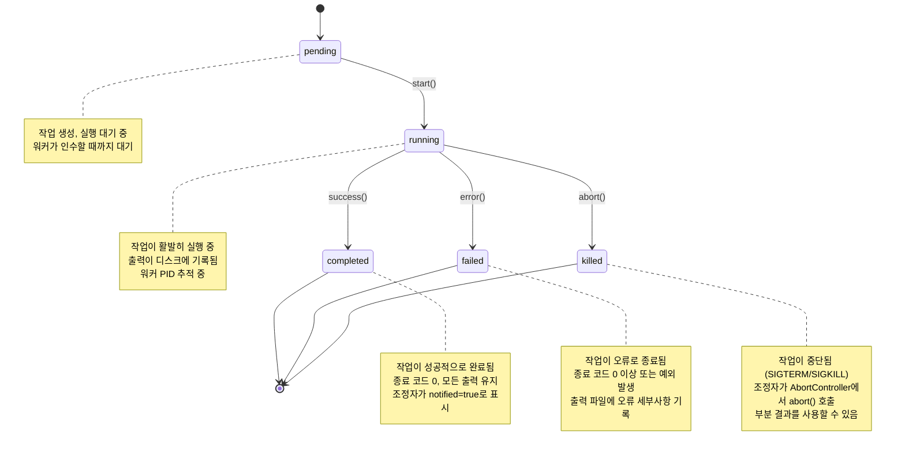
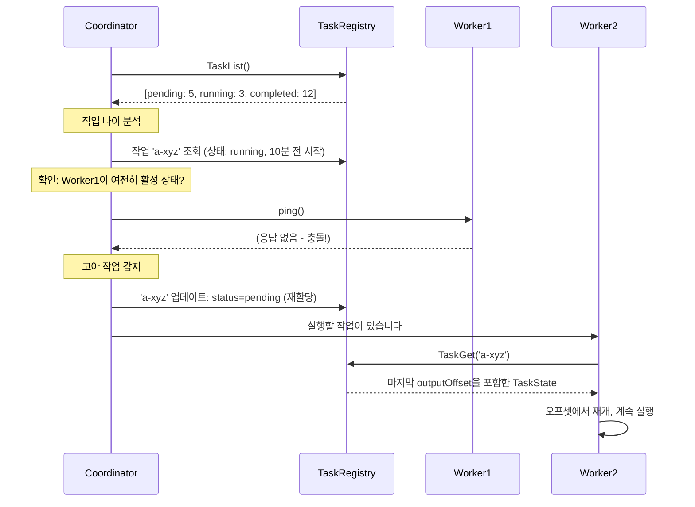
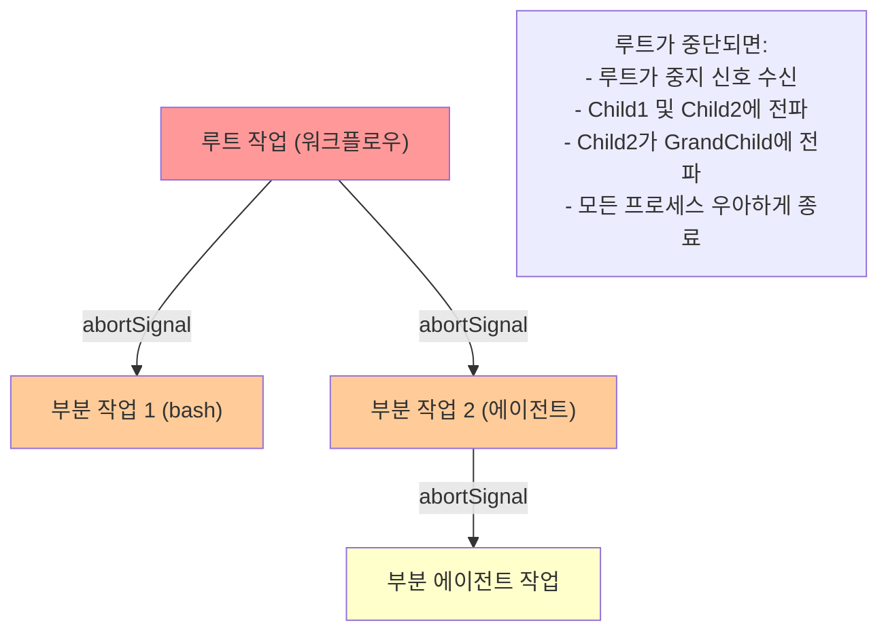
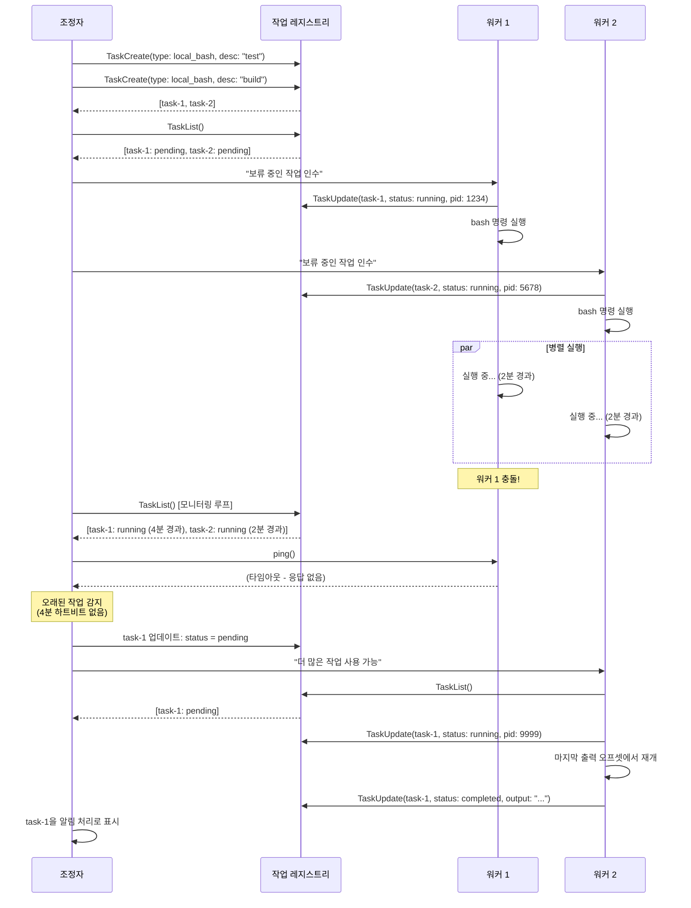
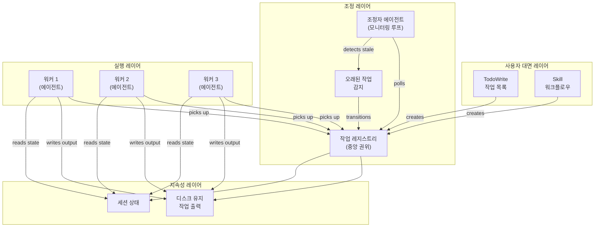

# 작업 Tool

작업 시스템은 Claude Code의 다중 에이전트 운영에 대한 조정 백본입니다. 이 문서는 내부 작업 아키텍처(시스템 아키텍트용)와 사용자 대면 작업 관리 도구(실무자용)를 모두 다룹니다.

---

## Part 1: 작업 시스템 아키텍처

### 핵심 개념: 분산 조정 프로토콜

작업 시스템은 단순한 할 일 목록이 아니라, 다중 에이전트 운영을 위한 **결함 허용 조정 프로토콜**입니다. 핵심 원칙:

1. **중앙 작업 레지스트리**: 조정자가 모든 에이전트에서 읽을 수 있는 전역 작업 목록을 유지
2. **자동 고아 작업 감지**: 에이전트가 충돌하면, 미완료 작업은 "running" 상태로 유지되며 다른 에이전트가 인수 가능
3. **작업 격리**: 각 작업은 독립적이며, 충돌한 작업이 다른 작업으로 연쇄되지 않음
4. **지속적 출력**: 작업 결과는 즉시 디스크에 기록되어 에이전트 재시작 후에도 유지

이 아키텍처는 워커 에이전트를 생성, 충돌 및 교체할 수 있는 안정적인 분산 워크플로우를 가능하게 합니다.

### 일곱 가지 작업 유형

Claude Code의 작업 시스템은 7개의 서로 다른 작업 타입을 지원하며, 각각은 특정 실행 패턴에 최적화되어 있습니다. 통일된 "작업" 추상화보다는, 각 타입이 자신의 수명 주기 로직, 상태 머신, 정리 프로토콜을 가집니다. 이는 아키텍처 현실을 반영합니다: 서브프로세스 생성은 프로세스 내 Agent 실행과 다르며, 이는 다시 MCP 서버 감시와 다릅니다.

**로컬 Bash 작업**은 격리된 프로세스에서 셸 명령을 실행합니다. 이들은 출력을 증분적으로 디스크에 캡처하고, 타임아웃을 강제하며, 명령이 키보드 입력(예: 대화형 프롬프트)에서 차단된 것처럼 보일 때 정체 감지를 지원합니다. 백그라운드 서브프로세스가 kill에서 벗어나지 않도록 프로세스 그룹이 추적됩니다.

**로컬 에이전트 작업**은 같은 Claude Code 프로세스 내에서 서브 에이전트를 생성합니다. 이들은 부모의 도구의 부분 집합을 상속하고 중지 신호 체인을 공유하므로 부모 취소가 아래로 연쇄됩니다. 에이전트 작업은 트랜스크립트 출력 파일을 유지하고 (토큰 개수, 도구 사용 기록) UI에 진행 상황 업데이트를 방출합니다. 포그라운드(조정자 차단) 및 백그라운드 모드를 모두 지원합니다.

**원격 에이전트 작업**은 다른 곳에 배포된 에이전트로 작업을 위임합니다. 일반적으로 클라우드 함수 또는 원격 Claude Code 인스턴스에 대한 API 호출을 통해. 이들은 폴링 루프와 타임아웃 윈도우를 통해 더 높은 지연시간과 네트워크 실패를 우아하게 처리합니다. 결과는 장시간 지속되는 HTTP 연결 또는 콜백 웹훅을 통해 가져옵니다.

**프로세스 내 팀원 작업**은 같은 TypeScript 이벤트 루프에서 에이전트를 실행하고 IPC 오버헤드가 없습니다. 이들은 AppState 메모리를 가변 참조를 통해 직접 공유하여 저지연 팀 조정을 활성화합니다. 팀원은 공유 받은 편지함의 메시지를 폴링하고 직렬화 없이 상태를 읽고 쓸 수 있습니다. 이들은 가장 빠른 작업 타입이지만 리더로부터 상태를 격리할 수 없습니다.

**로컬 워크플로우 작업**은 조건부 분기와 오류 처리를 가진 다단계 작업을 조율합니다. 이들은 자식 작업(bash, Agent, 또는 중첩 워크플로우)을 생성하고 이들의 결과를 조정합니다. 워크플로우는 단계 실행 트리를 유지하고 구성된 경우 실패 시 롤백합니다.

**MCP 모니터 작업**은 활성 MCP 서버 연결을 감시합니다. 이들은 백그라운드에서 모니터링 루프를 실행하고, 오래된 연결을 감지하며, 서버가 충돌하면 재시작합니다. MCP 모니터는 상태 상태 이벤트를 방출하고 작업 알림 시스템과 통합됩니다.

**드림 작업**은 백그라운드에서 연속 학습 루프를 실행합니다 (KAIROS 항상 실행 중인 아키텍처의 일부). 이들은 누적된 로그를 처리하고, 인사이트를 생성하며, 주 상호 루프를 차단하지 않고 Agent 메모리를 업데이트합니다.

| 유형 | 사용 사례 | 특성 |
|------|----------|------|
| `local_bash` | 셸 명령, 스크립트, 빌드 실행 | 프로세스 생성, 작업 디렉토리 유지, 타임아웃 적용 |
| `local_agent` | 특정 부작업을 위한 부분 Agent 생성 | 상위 Tool의 부분 집합 획득, 시스템 프롬프트 템플릿 상속 |
| `remote_agent` | 배포된 Agent에 위임 (예: 클라우드 함수) | 네트워크 호출, 최종 일관성, 높은 지연시간 |
| `in_process_teammate` | 공유 상태를 가진 병렬 에이전트 (빠름) | 같은 프로세스여야 함, 공유 메모리, 격리 없음 |
| `local_workflow` | 복잡한 다단계 작업 | 워크플로우 엔진으로 조정, 부분 작업 생성 가능 |
| `monitor_mcp` | MCP 서버 상태 및 메시지 감시 | 모니터링 루프 실행, 실패 시 재시작 |
| `dream` | 연속 학습 (KAIROS 아키텍처) | 백그라운드에서 실행, 로그 처리, 인사이트 생성 |

### 작업 수명 주기 상태 머신



### 작업 상태 형태

```typescript
interface TaskState {
  // 식별
  id: string;                   // 고유 ID 및 유형 접두사: "b-xyz" (bash), "a-xyz" (agent)
  type: TaskType;               // 위의 일곱 가지 유형 중 하나
  
  // 상태 추적
  status: 'pending' | 'running' | 'completed' | 'failed' | 'killed';
  description: string;          // 사용자 친화적 작업 설명
  
  // 타이밍
  startTime: number;            // 작업 시작 시간 (Unix 타임스탬프)
  endTime?: number;             // 작업 종료 시간 (완료/실패/중지 시 설정)
  
  // 출력 및 결과
  outputFile: string;           // 디스크에 유지된 출력의 절대 경로
  outputOffset: number;         // 현재 읽기 위치 (증분 읽기용)
  exitCode?: number;            // 종료 코드 (0 = 성공, 0 이상 = 오류)
  error?: string;               // 작업이 throw한 경우 예외 메시지
  
  // 알림 추적
  notified: boolean;            // 완료/실패가 조정자에게 보고되었는지 여부
  
  // 실행 컨텍스트
  workingDirectory?: string;    // bash 작업의 CWD, 부분 에이전트는 상속
  parentTaskId?: string;        // 다른 작업에 의해 생성된 경우
  abortSignal?: AbortSignal;    // 계층적 중지 전파
}
```

### 작업 ID 형식 및 접두사

작업 ID는 유형을 인코딩하여 빠른 필터링 및 디스패치를 가능합니다:

```
Bash 작업:              b-a1b2c3d4e5f6g7h8
에이전트 작업:          a-x9y8z7w6v5u4t3s2
워크플로우 작업:        w-f1e2d3c4b5a6
MCP 모니터 작업:        m-j7i6h5g4f3e2d1
드림 작업:              d-k8l7m6n5o4p3q2r1
원격 에이전트 작업:     r-s1t2u3v4w5x6y7z8
프로세스 내 팀원:       i-a2b3c4d5e6f7g8h9
```

---

## Part 2: 완전한 작업 도구 목록

### 핵심 작업 관리 도구

| 도구 | 모듈 | 목적 | 반환 |
|------|------|------|------|
| **TaskCreate** | `taskCreate.ts` | 유형, 설명, 매개변수로 새 백그라운드 작업 생성 | `{ taskId: string }` (유형 접두사 포함) |
| **TaskGet** | `taskGet.ts` | 현재 작업 상태 및 상태 조회 | 모든 필드를 포함한 `TaskState` 객체 |
| **TaskUpdate** | `taskUpdate.ts` | 작업 상태, 설명 또는 사용자 정의 필드 업데이트 | `{ updated: true, newState: TaskState }` |
| **TaskList** | `taskList.ts` | 선택적 필터링을 사용하여 모든 상태의 모든 작업 나열 | `{ tasks: TaskState[], total: number }` |
| **TaskStop** | `taskStop.ts` | 중지 신호를 전송하여 실행 중인 작업 중지 | `{ killed: true, taskId: string }` |
| **TaskOutput** | `taskOutput.ts` | 오프셋 기반 페이지 매김을 사용하여 작업 출력 스트림 또는 읽기 (블로킹 또는 폴링 모드) | `{ output: string, offset: number, eof: boolean }` |
| **SendMessage** | `sendMessage.ts` | 실행 중인 에이전트 작업으로 메시지 전송 (메일박스 통신) | `{ queued: true, messageId: string }` |

### Cron 도구

선택 기능: AGENT_TRIGGERS

작업의 반복 일정을 관리합니다 (작업 트리거 및 백그라운드 조정).

| 도구 | 목적 |
|------|------|
| **CronCreate** | Cron 일정 생성 (cron 표현식 또는 간격) |
| **CronDelete** | 기존 Cron 일정 제거 |
| **CronList** | 모든 활성 Cron 일정 나열 |

### AskUserQuestion 도구

사용자로부터 입력을 요청합니다. 대화형 에이전트 워크플로우에서 사용됩니다.

| 속성 | 값 |
|------|-----|
| 목적 | 사용자로부터 입력 또는 선택 요청 |
| 입력 | 질문 텍스트, 선택 사항 (다중선택), 미리보기 |
| 반환 | `{ response: string }` 또는 `{ selected: string[] }` |

### 도구 세부사항 및 구현 참고사항

#### TaskCreate

레지스트리에 새 작업을 생성하고 추가합니다.

```typescript
// 사용 예시
TaskCreate({
  type: 'local_bash',
  description: '전체 테스트 스위트 실행',
  command: 'npm test -- --coverage',
  workingDirectory: '/home/user/project',
  timeout: 300_000  // 5분
})
// 반환: { taskId: 'b-a1b2c3d4e5f6g7h8' }
```

**주요 구현 세부사항**: 작업은 `pending` 상태로 시작됩니다. 백그라운드 워커 프로세스가 작업 레지스트리를 모니터링하고, 보류 중인 작업을 인수하며, `running`으로 전환하고, 출력 캡처를 시작합니다.

#### TaskList + 조정자 모니터링

조정자는 `TaskList`를 사용하여 오래된 작업을 감지합니다:



#### 오프셋 기반 읽기를 사용한 TaskOutput

출력은 증분 방식으로 디스크에 유지됩니다. 소비자는 오프셋으로 읽어 새 데이터만 얻습니다:

```typescript
// 독자 1: 처음 100줄 읽기
TaskOutput({ taskId: 'b-xyz', offset: 0, limit: 100 })
// 반환: { output: "line1\nline2\n...", offset: 2500, eof: false }

// 독자 2: 더 많은 출력 폴링 (마지막 오프셋에서 계속)
TaskOutput({ taskId: 'b-xyz', offset: 2500, limit: 100 })
// 반환: { output: "line101\nline102\n...", offset: 5000, eof: false }

// 작업 완료 시
TaskOutput({ taskId: 'b-xyz', offset: 5000, limit: 100 })
// 반환: { output: "final output", offset: 5347, eof: true }
```

이를 통해 전체 출력을 다시 읽지 않고도 효율적인 tail-following 동작이 가능합니다.

#### 에이전트 통신을 위한 SendMessage

작업으로 생성된 에이전트는 메일박스를 통해 메시지를 받을 수 있습니다:

```typescript
// 주 조정자
TaskCreate({
  type: 'local_agent',
  description: '데이터 처리 실행',
  prompt: '데이터셋 처리...'
})
// 반환: { taskId: 'a-worker1' }

// 나중: 실행 중인 에이전트로 메시지 전송
SendMessage({
  taskId: 'a-worker1',
  message: '새로운 데이터 청크가 도착했습니다. 처리하세요.',
  priority: 'high'
})
// 에이전트가 메일박스를 폴링하고 메시지를 수신합니다
```

---

## Part 3: AbortController 계층

작업 취소는 고아 프로세스를 방지하기 위해 계층적 AbortController 패턴을 사용합니다:



**구현 세부사항**:

각 작업 실행자는 자신의 `AbortController`를 유지하며, 이는 로컬 중지 게이트로 작동합니다. 작업이 기존 작업의 자식으로 생성될 때, 실행자는 부모의 중지 신호에 수신자를 등록합니다. 부모가 종료되면, 이 수신자는 즉시 발생하고 자식의 로컬 컨트롤러에서 `abort()`를 호출하여 연쇄를 트리거합니다.

중지 전파는 **비동기이지만 즉각입니다**. 수신자는 부모의 중지 신호가 발생할 때 동기적으로 호출되므로, 취소는 마이크로초 내에 자식에 도달합니다 (폴링 루프가 아님). Bash 작업의 경우, 이는 프로세스 그룹에 `SIGTERM`이 전송됨을 의미합니다. 에이전트 작업의 경우, 모든 보류 중인 I/O 작업을 중지하고 작업 상태를 `killed`로 전환합니다. 중첩 워크플로우의 경우, 중지는 깊이 우선으로 전체 트리를 통해 연쇄됩니다.

오류 처리는 의도적 중지(부모 또는 사용자 kill에서)와 다른 실패를 구분합니다. 작업이 `AbortError` 예외(신호가 `abort()`를 호출할 때 발생)를 포착하면, 작업 상태를 깔끔한 종료 기록으로 `killed`로 표시합니다. 다른 예외는 진단용으로 보존된 오류 메시지를 가진 `failed` 작업이 됩니다.

중지 체인 설계는 두 가지 중요한 실패 모드를 방지합니다: (1) 부모가 충돌할 때 살아남는 고아 프로세스, 및 (2) 자식 작업이 제대로 정리되지 않는 리소스 누수. 작업 생성 시 중지 신호를 배선함으로써, 시스템은 부모가 종료될 때 (사용자 요청, 타임아웃, 또는 조정자 종료로 인해) 모든 자식 작업의 정리 코드가 실행됨을 보장합니다.

---

## Part 4: 분산 조정 프로토콜

### 다중 에이전트 작업 배포

다음 시퀀스 다이어그램은 조정자가 여러 에이전트에 작업을 배포하고 실패를 처리하는 방법을 보여줍니다:



**핵심 사항**:
1. 조정자가 주기적으로 `TaskList()`를 폴링합니다 (기본값: 5초마다)
2. 오래된 작업 감지: `running` 상태이며 N초 이상 하트비트 없는 작업
3. 복구: 오래된 작업이 `pending`으로 돌아가고, 다음 사용 가능한 워커가 인수
4. 복원력: `outputOffset`을 통해 부분 출력 보존

---

## Part 5: TodoWrite 

### 개요

`TodoWrite`는 내부 작업 시스템과 다른 **사용자 대면** 작업 관리 도구입니다. 분산 조정이 아닌 인간의 워크플로우 추적에 최적화되어 있습니다.

| 속성 | 값 |
|------|-----|
| 목적 | 사용자에게 보이는 상태를 사용하여 다단계 작업 추적 |
| 상태 | `pending`, `in_progress`, `completed` |
| 제약 | 한 번에 정확히 하나의 작업이 `in_progress` 상태 |
| 지속성 | 세션 상태에 저장, 에이전트 간 공유 안 함 |

### 작업 요구사항

각 작업은 두 가지 형식을 가집니다:

- **`content`**: 명령형 형식 (취할 조치)  
  예시: `"인증 미들웨어 구현"`
  
- **`activeForm`**: 현재 진행형 (현재 진행 중인 작업)  
  예시: `"인증 미들웨어 구현 중"`

### 상태 의미

```typescript
interface TodoTask {
  id: string;
  content: string;        // "기능 X 구현"
  activeForm: string;     // "기능 X 구현 중"
  status: 'pending' | 'in_progress' | 'completed';
  createdAt: number;
  completedAt?: number;
}
```

### 사용 시점

다음과 같은 경우 TodoWrite 작업 목록을 생성하세요:
- 작업에 3개 이상의 서로 다른 단계 필요
- 사용자로부터의 다중 독립 작업
- 우선순위를 명확히 하는 새 지시사항 수신 후
- 원자적 진행 추적이 필요한 복잡한 작업

### 사용하지 말아야 할 경우

다음의 경우 TodoWrite를 건너뛰세요:
- 단일 간단한 작업
- 사소한 작업 (3 단계 미만)
- 순전히 대화형 또는 정보 요청
- 일회성 명령

### 핵심 규칙

1. **즉시 완료 표시**: 단계를 완료한 후, TodoWrite에서 즉시 완료로 표시하세요. 완료를 일괄 처리하지 마세요.
2. **다음의 경우 완료로 표시하지 마세요**:
   - 테스트 실패 중
   - 구현이 부분적임
   - 오류가 해결되지 않음
   - 종속성이 완료되지 않음
3. **관련 없는 작업 제거**: 작업이 낡으면, 보류 중으로 남겨두지 말고 완전히 제거하세요.
4. **하나의 in_progress**: 시스템이 한 번에 정확히 하나의 작업을 `in_progress` 상태로 강제합니다. 새 작업을 시작하기 전에 이전 작업을 완료로 표시하세요.

### 워크플로우 예시

```
초기 작업 (사용자 생성):
- pending:     "프로젝트 스캐폴드 설정"
- pending:     "데이터 모델 구현"
- pending:     "API 테스트 작성"
- pending:     "스테이징에 배포"

단계 1: 첫 번째 작업 시작
- pending:     "데이터 모델 구현"
- pending:     "API 테스트 작성"
- pending:     "스테이징에 배포"
+ in_progress: "프로젝트 스캐폴드 설정"

단계 2: 스캐폴드 완료, 완료로 표시, 모델 시작
- pending:     "API 테스트 작성"
- pending:     "스테이징에 배포"
+ completed:   "프로젝트 스캐폴드 설정"
+ in_progress: "데이터 모델 구현"

단계 3: 모델 완료, 완료로 표시, 테스트 시작
- pending:     "스테이징에 배포"
+ completed:   "프로젝트 스캐폴드 설정"
+ completed:   "데이터 모델 구현"
+ in_progress: "API 테스트 작성"

단계 4: 테스트 완료, 완료로 표시, 배포 시작
+ completed:   "프로젝트 스캐폴드 설정"
+ completed:   "데이터 모델 구현"
+ completed:   "API 테스트 작성"
+ in_progress: "스테이징에 배포"

단계 5: 배포 완료, 완료로 표시, 완료
+ completed:   "프로젝트 스캐폴드 설정"
+ completed:   "데이터 모델 구현"
+ completed:   "API 테스트 작성"
+ completed:   "스테이징에 배포"
```

---

## Part 6: Skill 

### 개요

`Skill`은 사전에 등록된 워크플로우를 실행하기 위한 도구입니다. Skill은 일회성 프롬프트가 아니라, 복잡한 절차의 완전한 구현입니다.

| 속성 | 값 |
|------|-----|
| 목적 | 특화된 다단계 워크플로우 실행 |
| 호출 | 명시적: `/skill-name` 또는 Skill 도구 |
| 등록 | 코드베이스에 중앙화됨 |
| 트리거 패턴 | 상황적 자동 감지 (선택사항) |

### Skill 대 일반 프롬프팅

**Skill**: "Execute the `/commit` workflow" → 준비된 파일 감지, 커밋 메시지 생성, 훅 실행 및 오류 처리를 포함한 완전한 git 커밋 프로토콜.

**일반 프롬프트**: "How do I make a git commit?" → 일반 정보, 실행 가능한 워크플로우 아님.

### 사용 가능한 Skill

| Skill | 트리거 | 목적 | 구현 |
|-------|--------|------|------|
| `commit` | `/commit` | 적절한 메시지 및 훅으로 git 커밋 생성 | 완전한 프로토콜: status → diff → message → commit → verify |
| `simplify` | `/simplify` | 코드 품질 및 효율성 검토, 자동 수정 | 린터 실행, 리팩토링 제안, 수정사항 적용 |
| `loop` | `/loop 5m /foo` | 반복 간격으로 명령/프롬프트 실행 | 백그라운드 작업 생성, 간격마다 폴링 |
| `claude-api` | `import anthropic` | Claude API / SDK 애플리케이션 구축 지원 | API 사용 패턴 안내, 예제 생성 |
| `update-config` | 동작 키워드 (from now on, whenever) | settings.json에서 하네스 훅 구성 | 설정 수정, 자동화된 동작 활성화 |
| `session-start-hook` | 저장소 설정 | 웹 환경을 위한 SessionStart 훅 생성 | 훅 인프라 스캐폴드 |

### Skill 발견

Skill은 스킬 레지스트리에서 로드됩니다. 사용 가능한 Skill을 찾으려면:

```typescript
// 의사 코드
const skills = await skillRegistry.list();
// 반환: { commit, simplify, loop, claude-api, update-config, ... }

// 키워드로 skill 검색
const matches = await skillRegistry.search('deploy');
// 반환: [{ name: 'deploy-aws', description: '...' }, ...]
```

### 핫 리로드 지원

Skill은 에이전트를 재시작하지 않고 다시 로드할 수 있습니다:

```typescript
export const MySkill: SkillDefinition = {
  name: 'my-skill',
  trigger: '/my-skill',
  execute: async (params) => { /* ... */ }
};

// 나중: 디스크에서 skill이 업데이트됨
// 호출: Skill({ name: 'my-skill' })
// 엔진이 파일 변경 감지, 정의 다시 로드, 최신 상태로 실행
```

### 컨텍스트 대 명시적 트리거

**명시적**:
```
사용자: /commit
→ Skill 도구가 직접 호출됨
```

**상황적** (자동 감지):
```
사용자: "Save my changes to git"
시스템 프롬프트 포함: "If user mentions git commit, suggest /commit skill"
→ 모델이 의도 인식, Skill 도구 호출
```

---

## Part 7: 아키텍처 다이어그램



---

## Part 8: 보안 고려사항

### 작업 격리

작업은 다음으로 실행됩니다:
- **별도 프로세스** (bash 작업) 또는 **격리된 에이전트 인스턴스** (에이전트 작업)
- **환경 샌드박싱**: HOME, PATH 및 네트워크가 작업공간으로 제한
- **리소스 제한**: 메모리 상한, CPU 시간 제한, 파일 디스크립터 제한 적용

### 출력 살균

작업 출력은 대화에 포함되기 전에 살균됩니다:
- 자격증명 (AWS 키, API 토큰) 처리
- 민감한 경로 익명화
- 매우 큰 출력 잘림

### 중지 신호 안전

AbortController 계층은 고아 프로세스를 보장하지 않습니다:
- 부모 중지가 모든 자식에 연쇄
- SIGTERM 우아하게 먼저 전송 (30초 타임아웃)
- SIGKILL 폴백
- 백그라운드 부분 프로세스를 포착하기 위해 프로세스 그룹 중지

---

## Part 9: 문제 해결

### "running" 상태에서 작업 중단됨

**증상**: 작업이 `status: 'running'`을 표시하지만 최근 출력이 없습니다.

**진단**:
1. 작업 나이 확인: `endTime` 누락, `startTime` > 10분 전?
2. 워커 여전히 활성 확인: 작업의 PID에 대한 프로세스 목록 확인
3. 출력 오래됨 확인: `outputOffset` > 5분 동안 변경 없음?

**복구**:
```typescript
// 옵션 1: 중지 및 재시도
TaskStop({ taskId: 'task-xyz' })
// 2초 대기
TaskCreate({ ...originalParams })  // 재시도

// 옵션 2: 강제 상태 재설정 (최후의 수단)
TaskUpdate({
  taskId: 'task-xyz',
  status: 'failed',
  error: '조정자가 오래된 작업 감지, 강제 종료'
})
```

### 작업 출력 손실 / 불완전

**증상**: 작업이 완료되었지만 `outputOffset`이 파일 크기와 일치하지 않습니다.

**원인**: 워커가 쓰기 중에 충돌하거나 버퍼가 플러시되지 않음.

**복구**:
```typescript
// 원본 출력 파일 읽기
Read({ file_path: '/tmp/task-xyz-output.txt' })
// 마지막 알려진 outputOffset과 비교
// 조정자가 다음 폴링에서 불일치를 감지하고 처리
```

### 계단식 실패 (부모 중지가 예상치 못한 중지 트리거)

**증상**: 한 부모 작업이 중단될 때 관련 없는 작업이 중지됩니다.

**원인**: 잘못된 중지 신호 배선, 비자식 작업이 부모의 신호 수신.

**해결**: 생성 코드에서 작업 계층 확인:
```typescript
// 잘못됨: 자식이 부모 신호를 상속하지만 전역 중지도 수신
TaskCreate({
  type: 'local_bash',
  parentTaskId: 'a-parent',
  // 전역 중지 신호도 수신하면 안 됨
})

// 올바름: 자식이 parentTaskId만 상속
TaskCreate({
  type: 'local_bash',
  parentTaskId: 'a-parent',
  // 엔진이 자동으로 중지 계층 배선
})
```

---

## 요약 표: 각 도구 사용 시점

| 도구 | 사용 시점 | 출력 | 예시 |
|------|---------|------|------|
| **TodoWrite** | 3+ 단계, 사용자 진행 추적 | 상태가 있는 작업 목록 | "기능 구현, 테스트 작성, 배포" |
| **Skill** | 사전 구축 워크플로우 실행 | 워크플로우 결과 + 로그 | `/commit`을 실행하여 완전한 git 커밋 프로토콜 실행 |
| **TaskCreate** | 백그라운드 작업 생성 (비동기) | 작업 ID | 사용자가 계속 작업하는 동안 테스트 실행 |
| **TaskList** | 조정자 상태 모니터링 | 모든 작업 + 상태 | 워커 충돌 여부 확인, 오래된 작업 감지 |
| **TaskOutput** | 작업 결과 스트림 | 출력 청크 + EOF 플래그 | 빌드 로그가 발생하는 동안 tail |
| **TaskStop** | 작업 중지 | 확인 | 장기 실행 테스트 스위트 중단 |
| **SendMessage** | 실행 중인 에이전트와 통신 | 메시지 ID | 새 데이터 청크를 처리 에이전트로 전송 |
